# AGENTS.md - Ascend310 Repository Operating Guide

## Scope and precedence

These rules apply to the whole repository. A deeper `AGENTS.md` overrides this
file for its subtree. Read the applicable instructions before editing code,
documentation, generated material, or board assets.

## Repository map

| Area | Purpose | Source of truth |
| --- | --- | --- |
| `README.md` | Repository entry point and executable operating instructions | Repository root |
| `src/book/` | Theory/tutorial manuscript source | Markdown |
| `src/experiment/` | Practical case manuscript source | Markdown |
| `src/appendix/` | Appendix manuscript source | Markdown |
| `samples/` | Runnable code, setup scripts, and model tooling paired with chapters/cases | Source files |
| `docs/` in a sample | Numbered engineering plans, audits, and validation records | Markdown |
| `src/.vuepress/` | Site navigation and presentation configuration | TypeScript/config |
| `latex/` | Generated LaTeX/PDF outputs | Generated; do not hand-edit |
| `notebook/` | Auxiliary learning materials | Source notebooks/scripts |

For the palmprint workbench, runtime modules use the `palmprint_` prefix:
`palmprint_service.py`, `palmprint_benchmark.py`, and
`scripts/run_palmprint_service.sh`. Do not introduce new runtime or public
document names using an unexplained `case4` label. The canonical book source
`src/experiment/case4.md` is the fixed fourth-case entry used by the book
converter and VuePress sidebar; keep its tutorial self-contained rather than
renaming it or making it depend on other repository Markdown files.

## Standard development lifecycle

```mermaid
flowchart LR
    accTitle: Ascend310 development workflow
    accDescr: Local development builds and validates source artifacts before a scoped board deployment and hardware verification.

    inspect["Inspect instructions and dirty tree"] --> implement["Implement focused source change"]
    implement --> local["Run local syntax, unit, and frontend checks"]
    local --> review["Review diff, links, hashes, and asset boundaries"]
    review --> sync["Deploy only approved files to board"]
    sync --> board["Run board API, camera, ACL, and UI checks"]
    board --> record["Record evidence and update source documentation"]
```



1. Read the applicable `AGENTS.md`, inspect `git status`, and identify existing
   user changes before editing.
2. Prefer the repository's established helpers, data structures, and test
   patterns. Keep changes narrow and preserve unrelated work.
3. Build and test what can run locally. Do not infer board behavior from local
   results.
4. Before deployment, verify generated frontend assets, model metadata, paths,
   and checksums. Never synchronize large assets by accident.
5. Perform CANN, ATC, ACL, OM, V4L2, camera, and NPU checks only on an Ascend
   board with its intended conda and CANN environments active.
6. Record only measured results. Separate conversion evidence, numerical
   consistency, recognition accuracy, performance, and UI smoke evidence.

## Local development boundary

- The local workspace is a development controller, not an Ascend device.
- Never install or run CANN, PyACL runtime checks, ATC conversion, OM inference,
  `npu-smi`, DVPP, or hardware camera tests locally.
- Local work may include Python syntax checks, pure-Python unit tests, React
  tests, Vite builds, static ONNX checks, and explicit safe checkpoint export
  when the user authorizes it and no board-only component is invoked.
- Do not treat a missing local package such as `cv2`, `acl`, or a board runtime
  as a code failure. Run the affected test on the board and report the local
  limitation explicitly.
- Use `apply_patch` for manual edits. Do not overwrite or revert unrelated
  user changes, generated output, model assets, or data.

## Palmprint workbench architecture

- The runtime is FastAPI plus the prebuilt React/Vite bundle in `frontend/dist`.
  The board does not need Node.js.
- `app.py` remains the process entry point:
  `python app.py --host 0.0.0.0 --port 7860`.
- The production API and React UI are NPU-only. Reject CPU, EDCC, and
  non-admitted model requests at the API boundary. CPU and EDCC are offline
  research baselines only.
- `models/registry.json` contains only production-admitted runtime models.
  `candidate_manifest.json` contains all model candidates and their audit
  status. Do not promote a candidate merely because its checkpoint, ONNX, or OM
  exists.
- Use the NPU template namespace
  `<model_id>__npu__<precision>` exactly. Never add a CPU or legacy namespace
  fallback.
- Keep camera preview polling serial. Prefer MJPG, set a small V4L2 buffer,
  expose actual capture dimensions, and close the device when preview or a task
  ends.

## Model and asset workflow

1. Add or correct candidate metadata in `candidate_manifest.json`: source,
   revision, download method, license status, task type, modality, input/output
   contract, training domain, artifact hashes, and `N/A` reasons.
2. Keep model checkpoints, ONNX files, OM files, datasets, templates, and run
   reports out of Git unless a small checked-in fixture is explicitly intended.
3. Verify a downloaded asset by bytes and SHA-256 before export or conversion.
   Do not call a remote link, an LFS pointer, or an unverified file a model.
4. Export and validate ONNX with the model-specific input/output contract.
   Classifiers, ROI models, detectors, segmenters, two-input networks, vein
   models, and opaque SDKs must not be forced through the embedding adapter.
5. Run ATC and ACL only on the board. Record the exact CANN version, ATC
   parameters, generated OM size/SHA-256, logs, and failure cause.
6. Treat these as separate gates: artifact integrity, ONNX contract, ATC result,
   ACL smoke, numerical consistency, task accuracy, and performance. A passed
   numerical smoke is not an EER/AUC/Rank-1 or latency result.
7. Do not automatically copy board-generated OM files back to the local
   controller. Copy them only on an explicit request, then verify SHA-256 and
   keep them ignored by Git.

For a board-side CompNet campaign, use the candidate-specific commands rather
than the legacy static model as a proxy:

```bash
python prepare_models.py check-compnet-variants --variant all
python prepare_models.py convert-compnet-variants --variant all --precision both
python palmprint_benchmark.py compare --model compnet_tongji_600 \
  --precision mixed_fp16 --dataset tongji --spectrum B --samples 100 --threads 1
python palmprint_benchmark.py performance --model compnet_tongji_600 \
  --backend npu --precision mixed_fp16 --image <roi-image> \
  --warmup 50 --loops 500 --repeats 5 --threads 1
python palmprint_benchmark.py evaluate --model compnet_tongji_600 \
  --backend npu --precision mixed_fp16 --dataset tongji --threads 1
```

Run each eligible CompNet variant independently. Keep the resulting
`reports/runs/` files on the board as evidence; they remain ignored by Git.

## Ascend 310B board deployment

- Classify results by NPU model and compute tier, not by board name or IP.
  This project uses `Ascend 310B4 / 8T`; `20T` results are a separate evidence
  set and must never be merged or ranked with 8T results.
- Inspect an existing board deployment directory before synchronizing. Use the
  deployment script's explicit `--remote-dir` option for an active legacy
  deployment; do not move a running service or broad-copy a home directory.
- Build the frontend locally before deployment:

  ```bash
  cd frontend
  npm ci
  npm test
  npm run build
  cd ..
  bash scripts/deploy_ascend8t.sh --dry-run
  bash scripts/deploy_ascend8t.sh --apply
  ```

- The deploy script uses `rsync` without `--delete`. It preserves model,
  dataset, template, and run-report assets unless an explicit inclusion option
  is supplied. Never use a broad remote path, recursive delete, or a computed
  deletion target without verifying its absolute path first.
- On the board, activate CANN and conda in the same shell that launches the
  service:

  ```bash
  source /usr/local/miniconda3/etc/profile.d/conda.sh
  conda activate base
  source /usr/local/Ascend/ascend-toolkit/set_env.sh
  cd ~/Documents/palmprint-recognition
  bash setup.sh
  python prepare_models.py check --model all
  bash scripts/run_palmprint_service.sh --host 0.0.0.0 --port 7860
  ```

- Prefer `scripts/run_palmprint_service.sh` because it runs an `import acl`
  preflight. A service started without the CANN environment can answer HTTP
  health checks but fail actual NPU inference.
- Restart only the identified service PID. After a restart, verify the listening
  port, `GET /api/health`, `GET /api/bootstrap`, static `/`, and the expected
  process command before interacting with camera hardware.

## Known 310B4 health state and failure policy

- `Health: Alarm` on the established Ascend 310B4 / 8T board is a known board
  condition. Record it in diagnostics, but do not use it alone to block ATC,
  ACL smoke, performance measurement, accuracy evaluation, deployment, or
  model admission.
- Investigate and report concrete failures instead: missing `acl`, failed ACL
  initialization, missing device, nonzero ATC result, missing OM, inference
  mismatch, exit code `139`, device reset, resource leak, camera failure, or
  reproducible test failure.
- Do not fabricate a clean result because the alarm is ignored. Every result
  still needs its own input protocol, warmup/count/repetition parameters,
  artifact hashes, and raw report path.
- Capture the board snapshot with `bash scripts/collect_system_status.sh` before
  a conversion or benchmark campaign. Keep its `npu-smi` output as provenance,
  not as an automatic test gate.

## Debugging runbook

| Symptom | Check | Correct response |
| --- | --- | --- |
| NPU request says PyACL is unavailable | Confirm the launch process sourced CANN; inspect `/api/health` runtime detail | Restart through `run_palmprint_service.sh`; never add a CPU fallback |
| ATC cannot find an operator or exits nonzero | Save the per-model ATC log, input contract, CANN version, and exact command | Mark that precision path failed; do not create a fake OM or substitute a different model |
| Camera preview is slow or wrong-sized | Check V4L2 format, actual frame headers, MJPG/FPS, buffer size, and serial request behavior | Prefer MJPG, validate actual dimensions, downscale only the preview, and release the device |
| Frontend is stale or blank | Check `frontend/dist/index.html`, referenced assets, and `verify_frontend_assets.py --strict` | Rebuild locally, synchronize the bundle, then hard refresh the kiosk/browser |
| API rejects a model | Inspect `/api/bootstrap`, `/api/candidates`, registry admission, and candidate reasons | Preserve NPU-only validation; fix metadata or complete the missing gate |
| Unit test differs locally and on board | Identify missing local dependencies versus a behavior regression | Run the hardware-dependent test in the board conda environment and report both contexts |

For a camera or NPU incident, retain command output, relevant API response,
actual dimensions/format, process PID, and log path. Do not use real biometric
images in screenshots, issue reports, or source control.

## Documentation workflow

- `README.md` is an operating guide only: prerequisites, build, deployment,
  launch, user workflow, and common operational faults. Do not put extensive
  model matrices, hashes, historic logs, or benchmark tables there.
- Numbered documents in a sample `docs/` directory hold detailed engineering
  evidence. Use a two-digit numeric prefix and a descriptive ASCII slug, for
  example `00-document-index.md` or
  `02-device-deployment-and-acceptance-report.md`.
- Make every heading describe the content directly. Name a table's section for
  the data it contains, not with generic wording such as "results" or
  "migration". Audit headings after a structural rewrite.
- Keep `src/experiment/case4.md` self-contained: it may link to its own images,
  source code, and external sources, but not to other repository documentation.
- Preserve documentation evidence boundaries: state whether a result is a
  conversion check, numerical smoke, recognition metric, performance run, UI
  smoke, or hardware diagnosis. Do not substitute one for another.
- React screenshots must use synthetic ROI and anonymous templates. Keep the
  manifest, image byte count, SHA-256, application hash, viewport, and privacy
  statement together. Validate every image against the manifest before release.
- Markdown under `src/book/`, `src/experiment/`, and `src/appendix/` is the
  source of truth. `latex/chapters/`, `latex/cases/`, `latex/appendices/`, and
  PDFs are generated outputs; never hand-edit them.
- Use `./convert-vuepress.sh` only when the user requests generated LaTeX/PDF
  output. After a requested build, inspect `latex/book.log` and fix source
  Markdown rather than generated LaTeX.

## Verification gates

Run the smallest relevant set first, then broaden it when shared behavior
changes.

| Change area | Required local checks | Required board checks |
| --- | --- | --- |
| Python/API/service | `python -m py_compile`; relevant unit tests | Activated conda test suite, HTTP health/bootstrap, NPU request smoke |
| React frontend | `npm test`; `npm run build`; static bundle verifier | Static root/API load and kiosk/manual touch check |
| Model metadata/export | Manifest/registry tests, hashes, ONNX contract checks | ATC, ACL smoke, numerical comparison, task-specific evaluation |
| Camera path | Unit/API contract tests | V4L2 enumeration, actual resolution/FPS, preview, capture, release |
| Documentation | Link/image/manifest checks, whitespace, `git diff --check` | Verify copied documents and screenshot hashes when deployment is requested |

Useful documentation checks from a sample directory are:

```bash
rg -n "^#|^##|^###" docs README.md
git diff --check
python candidate_manifest.py
```

For performance claims, record the exact model, precision, hardware tier,
dataset/protocol, warmup, timing iterations, repetitions, percentile method,
and report path. Never reuse an old static-model latency as a checkpoint-specific
benchmark.

## Change discipline and handoff

- Use `rg` for search and read relevant code before changing it.
- Preserve a dirty worktree. Never use destructive Git commands or overwrite
  user work without explicit permission.
- Use structured parsers for JSON, manifests, and reports. Validate paths before
  copying, moving, or deleting files.
- Do not submit checkpoints, ONNX, OM, datasets, templates, camera captures,
  or run reports to Git unless the user explicitly requests a small fixture.
- State what was changed, where it was verified, which hardware-only checks
  remain, and any unresolved limitation. Do not claim a board action or metric
  that was not actually executed.
