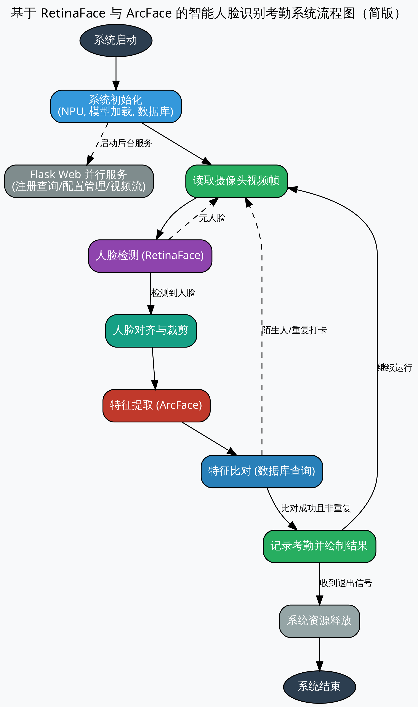

# 案例 1：基于 RetinaFace 与 ArcFace 的智能人脸识别考勤系统

## 教程定位

本案例旨在利用昇腾 310B 的强大 AI 算力，构建一个功能完整、响应迅速的智能人脸识别打卡系统。系统通过 USB 摄像头实时捕捉视频流，检测画面中的人脸，并与预先注册的员工人脸数据库进行比对，完成身份验证和自动记录考勤。

本案例的设计初衷是为开发者提供一个端到端的边缘 AI 应用范例，涵盖了以下核心知识点：

1. **高性能推理加速**：利用昇腾 PyACL 接口直接驱动 NPU，实现 RetinaFace 检测与 ArcFace 识别的硬件加速。
2. **端到端流水线**：建立从“视频流采集 -> 人脸检测 -> 人脸对齐 -> 特征提取 -> 特征比对 -> 数据库存取”的完整业务链路。
3. **嵌入式 Web 交互**：通过 Flask 框架构建轻量级管理后端，支持远程监控、用户注册与考勤导出。
4. **边缘存储实践**：使用 SQLite 数据库在本地高效存储用户特征向量（Embedding）与考勤记录。

从整体结构看，本案例对应一条标准的生物特征识别流水线：

{#fig:face_flow width=60% .center}

本案例选择的实现路线是：
* 使用 **RetinaFace** 完成鲁棒的人脸检测。
* 使用 **ArcFace** 完成高精度的特征提取。
* 使用 **SQLite** 进行本地数据持久化。
* 使用 **Python Flask** 提供现代化的 Web 交互界面。

## 实验硬件与运行条件

为了完成实时人脸识别与考勤实验，建议准备如下硬件条件：

* **昇腾 310B 开发者套件** (如 OrangePi AIpro)
* **USB 摄像头** (支持 640x480 及以上分辨率)
* **显示设备 (可选)**: HDMI 显示器或通过 Web 远程访问
* **CANN 软件栈**: 7.0 或更高版本
* **Python 环境**: 3.9 或更高版本，需安装 `flask`, `opencv-python`, `numpy<2.0`, `sqlite3` 等

运行方式：
* **本地模式**：直接运行 `python3 app.py`，后台线程会自动处理本地 USB 摄像头。
* **Web 模式**：通过浏览器访问 `http://<开发板IP>:5000` 进行管理和手动打卡。

## 本案例支持的模型结构

当前仓库里的模型基于 InsightFace 提供的轻量化版本，经过 `atc` 工具转换为 `.om` 格式：

* **检测模型 (RetinaFace)**: `face_detection.om`
    * 输入尺寸: `640 x 640`
    * 输出: 多尺度分数 (Scores) 与边界框偏移量 (BBoxes)
* **识别模型 (ArcFace)**: `face_recognition.om`
    * 输入尺寸: `112 x 112` (对齐后的人脸切片)
    * 输出: `512` 维特征向量 (Embedding)

这两类模型共同构成了“检测-对齐-识别”的经典人脸分析链路。

## 人脸识别系统的核心流水线

人脸识别不仅仅是“看一眼”，它包含了一系列精细的图像处理步骤：

1. **检测 (Detection)**：在复杂的背景中定位人脸的具体位置。
2. **对齐与裁剪 (Alignment & Cropping)**：根据检测到的关键点，将人脸旋转至正位并裁剪为固定尺寸（如 112x112），以消除姿态影响。
3. **特征提取 (Feature Extraction)**：将图像编码为一个具有高度代表性的固定长度向量（512 维）。
4. **比对 (Matching)**：计算当前向量与数据库中已知向量的相似度（如余弦相似度）。

## RetinaFace 深度剖析：从“看见”到“看懂”人脸

RetinaFace 不仅仅是一个检测人脸框的工具，它是一个精密的、为解决现实世界中各种复杂人脸检测问题而设计的深度学习模型。要理解它的价值，我们需要先了解它的历史背景和设计哲学。

### RetinaFace 的发展历史与作者信息

RetinaFace 模型由 **InsightFace** 团队发布，该团队在人脸识别领域享有盛誉，其开源的 `insightface` 代码库已成为学术界和工业界广泛使用的基准。RetinaFace 的提出，正是在单阶段目标检测器（如 SSD、YOLO）性能大幅提升，但通用检测器在人脸这种特定任务上仍有优化空间的背景下诞生的。

它的设计目标非常明确：创建一个在速度和精度上都达到顶尖水平，并且能同时处理人脸框、关键点乃至 3D 姿态的**一体化解决方案**。它借鉴了通用目标检测器 **RetinaNet** 的核心思想，并针对人脸任务的特性进行了深度定制。

### RetinaFace 到底在解决什么问题？

在真实场景中，“找到一张脸”远比想象的复杂。RetinaFace 主要致力于解决以下几个核心挑战：

1.  **尺度变化巨大**：从合影中的微小人脸到监控下的特写人脸，尺寸差异可能达到上百倍。
2.  **姿态与遮挡**：侧脸、低头、被口罩或手部分遮挡的人脸，都需要被准确识别。
3.  **密集场景**：在人群中，大量人脸紧密排列，容易产生漏检或错误的合并检测。
4.  **实时性要求**：在边缘设备上，检测速度必须足够快，才能支撑实时应用。

### 核心技术解析

RetinaFace 的强大性能源于其对多个关键技术的巧妙融合。

#### 1. 单阶段检测器与多任务学习

与需要先生成候选区域再进行分类的两阶段检测器（如 Faster R-CNN）不同，RetinaFace 是一个**单阶段（One-Stage）检测器**。它直接在特征图上预测目标的位置和类别，速度更快。更重要的是，它采用**多任务学习（Multi-task Learning）**框架，让一个网络同时完成多项任务：

*   **人脸分类**：判断某个区域是人脸还是背景。
*   **边界框回归**：精调人脸框的位置。
*   **关键点定位**：预测眼睛、鼻子、嘴角等 5 个关键点的位置。

这种设计不仅提升了效率，而且关键点定位任务的加入，反过来为模型提供了更丰富的监督信息，有助于更准确地识别人脸区域，尤其是对于部分遮挡的人脸。

#### 2. 特征金字塔网络 (FPN)

为了解决尺度变化问题，RetinaFace 采用了**特征金字塔网络（Feature Pyramid Network, FPN）**。FPN 的思想是“高层特征看语义，底层特征看细节”。它通过自顶向下的路径和横向连接，将高层特征图中丰富的语义信息与底层特征图中高分辨率的细节信息相融合，从而在多个不同尺度的特征图上进行预测。这意味着，大的特征图负责检测小人脸，小的特征图负责检测大人脸，实现了对各种尺寸人脸的“全覆盖”。

#### 3. 上下文感知模块 (SSH)

为了进一步增强特征的表达能力，RetinaFace 在 FPN 的每个预测层后都引入了 **SSH（Single Stage Headless）模块**。SSH 模块通过并行的、具有不同大小卷积核的通路来提取特征，并将它们拼接在一起。这就像给模型装上了“广角镜”和“长焦镜”，使其能够同时关注一个区域的局部细节和它周围的上下文信息，从而在复杂背景或人脸密集的情况下做出更鲁棒的判断。

#### 4. 焦点损失 (Focal Loss) 的启示

虽然 RetinaFace 的论文没有将焦点损失（Focal Loss）作为其核心创新点，但这个概念对于理解所有现代单阶段检测器至关重要。在人脸检测中，一张图像里绝大部分区域都是背景（负样本），只有极少数区域是人脸（正样本）。这种**正负样本的极端不平衡**会导致模型训练时被大量简单的背景样本主导，而忽略了对困难人脸样本的学习。

Focal Loss 通过一个动态缩放因子，降低了大量简单负样本在损失计算中的权重，使得模型能够更专注于学习那些难以区分的正样本和困难负样本。RetinaFace 正是受益于这种思想，才能在复杂的背景中精准地“聚焦”于人脸。

### 在本案例中的应用

在我们的智能考勤系统中，RetinaFace 作为整个识别流程的“眼睛”，其作用至关重要：

*   **提供高质量输入**：它为后续的 ArcFace 识别模块提供了准确的人脸边界框和关键点。只有检测得准，后续的对齐和识别才有可能成功。
*   **保证实时性能**：通过在昇腾 310B NPU 上的高效推理，它确保了系统能够对视频流进行逐帧处理而不会出现明显卡顿，这是实现“自动打卡”功能的基础。
*   **鲁棒性保障**：得益于其先进的设计，即使在光线不佳、人员走动或部分遮挡的情况下，系统依然能维持较高的检测成功率。

## ArcFace 深度剖析：让特征在角度空间中更具区分度

ArcFace 是人脸识别流程的“大脑”，负责将检测到的人脸图像转化为一个高度浓缩且易于比较的 512 维特征向量（Embedding）。它的成功并非偶然，而是建立在人脸识别损失函数长期演进的基础之上。

### 从 Softmax 到度量学习：损失函数的演进之路

在深度学习的早期，人脸识别通常被当作一个多分类问题来处理。例如，在一个包含 1000 个人的数据集中，模型会尝试将输入的人脸图像正确分类到这 1000 个类别中的某一个。这个过程通常使用 **Softmax Loss**。

*   **Softmax Loss 的局限**：Softmax 的目标是让不同类别能够被分开，但它并不强制要求“同一类”的样本在特征空间中靠得足够近，也未要求“不同类”的样本离得足够远。这导致在面对从未见过的新人脸（开集识别）时，模型泛化能力不足。

为了解决这个问题，研究者们开始探索**度量学习（Metric Learning）**的思想，其核心目标是直接在特征空间中优化距离：最大化类间距离，最小化类内距离。

#### 1. SphereFace (A-Softmax)

SphereFace 首次提出，在计算角度时应该引入一个**角度间隔（Angular Margin）**。它将传统的 Softmax 中的权重与特征的点积 $W^T x$ 修改为 $\|W\|\|x\|\cos(\theta)$，并通过对权重 $W$ 的归一化，将特征学习过程约束在一个单位超球面上。然后，它在目标类别的角度 $\theta_y$ 上乘以一个整数 $m$，变成了 $\cos(m\theta_y)$。这样一来，分类的决策边界从简单的线性边界变成了角度边界，强制模型学习到角度区分度更强的特征。

#### 2. CosFace (LMCL)

CosFace 认为 SphereFace 的乘性间隔 $m\theta_y$ 会导致训练不稳定。因此，它提出了一种更简单、更稳定的**加性余弦间隔（Additive Cosine Margin）**。它直接在余弦空间中减去一个常数 $m$，将决策边界从 $\cos(\theta_y)$ 变为 $\cos(\theta_y) - m$。这种方式在实现上更简单，训练过程也更平滑。

### ArcFace 的核心创新：加性角度间隔

ArcFace (Additive Angular Margin Loss) 结合了前两者的优点，并做出了关键性的改进。它的作者同样来自 **InsightFace** 团队，这保证了从检测到识别的算法思想一脉相承。

ArcFace 认为，无论是在余弦空间还是角度空间进行乘性操作，都有些间接。最直接、最有效的方式，应该是在**角度空间**中直接增加一个**加性间隔（Additive Angular Margin）**。

它的数学形式是将决策边界从 $\cos(\theta_y)$ 修改为 $\cos(\theta_y + m)$。

这个看似微小的改动，却带来了巨大的优势：

*   **几何意义明确**：直接在超球面上的测地距离（Geodesic Distance）上增加了一个恒定的角度惩罚项 $m$。这意味着，模型不仅要正确识别人脸，还必须保证该人脸的特征向量与对应类中心的夹角，要比与其他所有类中心的夹角**至少小 $m$ 度**。这个要求非常严格，极大地提升了特征的区分度。
*   **训练更稳定**：相比 SphereFace 的乘性间隔，加性间隔的设计更加稳定，更容易收敛。
*   **性能卓越**：ArcFace 在几乎所有主流人脸识别评测基准上都取得了当时的最佳性能，证明了其设计的有效性。

<!-- {#fig:loss_comp width=70% .center} -->

上图直观地展示了不同损失函数下的决策边界。可以看到，ArcFace 的决策边界（绿色虚线）相比其他损失函数，对类内样本的约束更强，类间间隔也更大。

### 在本案例中的应用

在本考勤系统中，ArcFace 的作用是赋予系统“认识”人的能力：

1.  **生成高质量 Embedding**：对于每一张注册的人脸，ArcFace 都会生成一个 512 维的特征向量。这个向量就是这张脸在数学空间中的“身份证”。
2.  **实现精准比对**：当一个新的人脸被检测到后，系统同样会提取其特征向量。通过计算这个新向量与数据库中所有已注册向量的**余弦相似度**，我们可以快速找到最相似的用户。
3.  **高可靠性**：由于 ArcFace 学习到的特征具有极强的类内紧凑性和类间分离性，因此即使在光照变化、表情变化甚至轻微遮挡的情况下，识别的准确率和召回率依然非常高，误识率极低。这对于一个严肃的考勤应用至关重要。

## 数据存储与检索深度剖析：边缘场景下的智慧与权衡

如果说模型是系统的大脑，那么数据存储就是系统的记忆。本案例采用 SQLite 存储用户特征和考勤记录，这个选择背后体现了边缘计算场景下的典型工程权衡。

### 为什么选择 SQLite？

在动辄使用 MySQL、PostgreSQL 或云数据库的时代，选择 SQLite 似乎有些“复古”。但在昇腾 310B 这样的边缘设备上，它却是最合适的选择之一：

1.  **轻量级与零配置**：SQLite 是一个库，而不是一个独立的服务器进程。它直接将整个数据库存储为一个单一的文件（`attendance.db`），无需安装、无需配置、无需管理用户权限，极大地降低了部署和维护的复杂度。
2.  **资源占用极低**：它对内存和 CPU 的占用非常小，这对于资源本就紧张的边缘设备至关重要，可以确保更多的计算资源留给核心的 AI 推理任务。
3.  **事务支持**：尽管轻量，SQLite 依然提供了完整的 ACID 事务支持，保证了数据操作的原子性、一致性、隔离性和持久性，确保了考勤数据不会因为意外中断而损坏。
4.  **Python 内置支持**：Python 的标准库 `sqlite3` 直接提供了对 SQLite 的支持，无需安装任何额外的驱动包，进一步简化了开发。

### 特征向量的存储：BLOB 格式的优与劣

本案例将 512 维的人脸特征向量（一个包含 512 个浮点数的 `numpy` 数组）直接转换为二进制数据，并存储在数据库的 **BLOB (Binary Large Object)** 类型字段中。

```python
# In database.py
def add_user(name, embedding):
    # embedding 是一个 numpy 数组
    conn = sqlite3.connect(DB_NAME)
    c = conn.cursor()
    # 将 numpy 数组转换为二进制格式存入 BLOB 字段
    c.execute('INSERT INTO users (name, embedding) VALUES (?, ?)', (name, embedding))
    # ...
```

这种做法的**优点**非常明显：

*   **简单高效**：直接存储原始二进制数据，无需进行任何格式转换，读写速度快。
*   **精度无损**：避免了将浮点数转为字符串等可能引入精度损失的操作。

但它的**缺点**也同样突出：

*   **数据库“不理解”数据**：对于 SQLite 来说，BLOB 字段里存的只是一堆无意义的二进制数据。它无法理解这是一个 512 维的向量，因此也无法在数据库层面进行任何向量相关的运算，比如计算距离或相似度。

### 当前的检索方案：简单遍历

正是由于数据库无法直接操作向量，本案例的识别流程采用了最简单直接的**暴力检索（Brute-force Search）**方案：

1.  当一个新的人脸出现时，计算其特征向量 $V_{curr}$。
2.  从数据库中**取出所有**已注册用户的特征向量，加载到内存中形成一个列表 $[V_1, V_2, ..., V_n]$。
3.  在内存中，使用 `numpy` 逐一计算 $V_{curr}$ 与列表中每个向量的余弦相似度。
4.  找到相似度最高且超过阈值的用户作为识别结果。

这个方案在用户规模较小（如几十人或几百人）时是完全可行的，因为现代 CPU 进行几百次 512 维向量的点积运算耗时极短，远低于视频帧率的间隔。

### 性能瓶颈与未来展望

然而，当用户规模从几百人扩大到几千人、几万人甚至更多时，上述暴力检索方案的性能瓶颈会立刻显现。每次识别都需要遍历整个数据库，计算量会随着用户数量线性增长，最终导致识别延迟变得无法接受。

为了解决大规模向量检索的问题，工业界发展出了一系列**近似最近邻（Approximate Nearest Neighbor, ANN）**搜索技术和专门的**向量数据库**。其核心思想是：不再保证 100% 找到最相似的向量，而是通过构建特殊的索引结构（如树、图、哈希等），在牺牲极少量精度的前提下，将检索速度提升几个数量级。

如果本系统需要向上扩展，可以考虑以下演进路径：

*   **集成 ANN 库**：在应用层面集成如 **Faiss**（由 Facebook AI 开发）或 **ScaNN**（由 Google 开发）这样的高性能向量检索库。数据仍然可以存储在 SQLite 中，但在系统启动时，将所有向量加载到内存中构建 Faiss 索引，后续检索直接通过该索引进行。
*   **迁移到向量数据库**：当数据规模和并发请求进一步增大时，可以考虑使用专门的向量数据库，如 **Milvus** 或 **Weaviate**。这些系统不仅内置了高效的 ANN 索引算法，还提供了完整的分布式、高可用的数据管理方案，是处理海量向量数据的终极解决方案。

因此，本案例采用的 SQLite + BLOB + 暴力检索的方案，是在边缘计算资源受限、用户规模可控的特定场景下的最佳实践。它体现了“**简单、有效、满足当前需求**”的工程设计原则，同时也为未来的系统扩展留下了清晰的演进路径。

## PyACL 深度剖析：与昇腾 NPU 对话的艺术

`ascend_inference.py` 是本案例与昇腾 NPU 硬件沟通的桥梁。它通过 `pyacl` 库，将上层的 Python 指令转化为底层硬件可以理解的指令。理解其工作流程，是掌握昇腾平台开发的关键。

### 昇腾计算语言 (ACL) 的标准工作流

在昇腾平台上进行一次完整的模型推理，通常遵循一个非常标准且结构化的流程。这个流程可以被概括为“初始化-执行-释放”三大阶段，共六个步骤。

<!-- {#fig:acl_wf width=80% .center} -->

#### 阶段一：资源初始化

1.  **ACL 初始化 (`acl.init`)**: 这是与硬件沟通的第一步。它负责加载底层驱动，建立与硬件的连接。一个进程中只需调用一次。

2.  **设备与上下文管理 (`acl.rt.set_device`, `acl.rt.create_context`)**: 
    *   `set_device`：指定我们要使用哪一块 NPU 设备（对于只有一个 NPU 的开发板，通常是设备 0）。
    *   `create_context`：为当前线程创建一个独立的执行上下文。这个上下文管理着队列、事件和内存等所有与该线程相关的资源，确保多线程环境下的资源隔离。

在 `ascend_inference.py` 的 `AscendSystem` 类中，这个过程被封装在 `_init_resource` 方法里，确保了系统启动时资源的正确准备。

```python
# In ascend_inference.py -> AscendSystem
class AscendSystem:
    def __init__(self, device_id=0):
        # ...
        self._init_resource()

    def _init_resource(self):
        ret = acl.init() # 1. ACL 初始化
        ret = acl.rt.set_device(self.device_id) # 2. 设置设备
        self.context, ret = acl.rt.create_context(self.device_id) # 2. 创建上下文
        # ...
```

#### 阶段二：模型执行

3.  **模型加载 (`acl.mdl.load_from_file`)**: 将编译好的 `.om` 离线模型从硬盘加载到 NPU 的内存中。加载后，我们会得到一个模型 ID，后续所有操作都通过这个 ID 来引用该模型。

4.  **内存分配与数据准备**: 这是最核心也最容易出错的环节。
    *   **Device 内存**: 模型推理是在 NPU (Device) 上完成的，因此输入数据和输出结果都需要存放在 Device 内存中。我们使用 `acl.rt.malloc` 来分配 Device 内存。
    *   **Host 内存**: 我们的原始图像数据（如用 OpenCV 读取的 `numpy` 数组）存放在 CPU 管理的内存（Host）中。
    *   **数据传输**: 在推理前，必须使用 `acl.rt.memcpy` 将 Host 上的输入数据拷贝到 Device 上的指定内存区域。这个过程被称为 **H2D (Host to Device)** 拷贝。

5.  **模型执行 (`acl.mdl.execute`)**: 将准备好的输入数据（存放于 Device 内存）送入已加载的模型中进行异步推理。调用 `acl.rt.synchronize_stream` 来等待推理完成。

6.  **结果获取**: 推理完成后，结果仍然存放在 Device 内存中。我们需要再次使用 `acl.rt.memcpy` 将其从 Device 拷贝回 Host 内存，这个过程被称为 **D2H (Device to Host)** 拷贝。之后，我们就可以在 Python 中用 `numpy` 等库来解析和使用这些结果了。

在 `AscendModel` 类中，`_init_buffers` 负责第 4 步的内存分配，而 `execute` 方法则完整地覆盖了 H2D 拷贝、模型执行和 D2H 拷贝的全过程。

```python
# In ascend_inference.py -> AscendModel
def execute(self, input_data_list):
    # ... H2D (Host to Device) Memcpy ...
    ret = acl.rt.memcpy(self.input_buffers[i]["ptr"], ..., 1)

    # ... Execute Model ...
    ret = acl.mdl.execute(self.model_id, self.input_dataset, self.output_dataset)

    # ... D2H (Device to Host) Memcpy ...
    ret = acl.rt.memcpy(host_ptr, ..., self.output_buffers[i]["ptr"], ..., 2)
    # ...
```

#### 阶段三：资源释放

7.  **资源清理 (`acl.mdl.unload`, `acl.rt.free`, `acl.rt.destroy_context`, `acl.finalize`)**: 为了避免内存泄漏，所有申请的资源在使用完毕后都必须被显式释放。这包括模型、Device 内存、上下文、流等。最后调用 `acl.finalize` 来断开与硬件的连接。

`AscendSystem` 和 `AscendModel` 的 `release` 方法正是为了完成这一关键的清理工作。

### 为什么需要区分 Host 和 Device？

对于初学者来说，最困惑的莫过于 Host 和 Device 的概念。可以这样理解：

*   **Host (主机)**：指 CPU 及其管理的内存（我们常用的内存条）。它是系统的“总管”，负责运行操作系统、Python 解释器和大部分通用逻辑。
*   **Device (设备)**：指 NPU 及其专用的板载内存（如 HBM）。它是专门用于并行计算的“专家”，执行 AI 推理速度极快，但不能直接运行通用程序。

CPU 和 NPU 是两个独立的计算单元，它们之间的内存地址空间不共享。因此，数据必须通过 `memcpy` 在两者之间显式地来回传递。这个过程是昇腾乃至所有异构计算（如 CUDA 编程）平台的基本操作。


## 📱 Web 界面详细介绍

### 1. 主页 (/)
系统概览与功能导航入口。

### 2. 用户管理 (/user_management)
* **用户注册**：支持“上传照片”或“设备摄像头抓拍”两种方式。
* **用户列表**：查看已注册用户的详情及照片。

### 3. 考勤记录 (/attendance)
* **实时记录**：显示最新的考勤成功记录，包括姓名、时间及打卡现场照片。
* **自动刷新**：页面会实时展示本地摄像头自动捕捉到的打卡信息。

### 4. 配置中心
支持调整识别阈值（Similarity Threshold）和考勤间隔，平衡误识率与用户体验。

## 3D 打印结构件与设备组装

为了提升系统的实用性，我们设计了配套的结构件：
* **摄像头支架**: 适配标准 USB 摄像头，支持俯仰角调节。
* **设备外壳**: 为 OrangePi AIpro 提供散热优化与接口保护。

> 打印建议：使用 PLA 材质，层高 0.2mm，填充率 20%。

## 故障排除与性能建议

* **摄像头无法启动**: 检查 `/dev/video0` 权限，尝试 `sudo chmod 666 /dev/video0`。
* **识别精度不佳**: 
    - 确保注册时的照片清晰且光照均匀。
    - 适当调低阈值（如 0.65），但需警惕误识。
* **推理性能优化**: 
    - 摄像头采集分辨率建议设为 `640x480`。
    - 在 Web 预览时使用较低的帧率以节省 CPU 资源。
