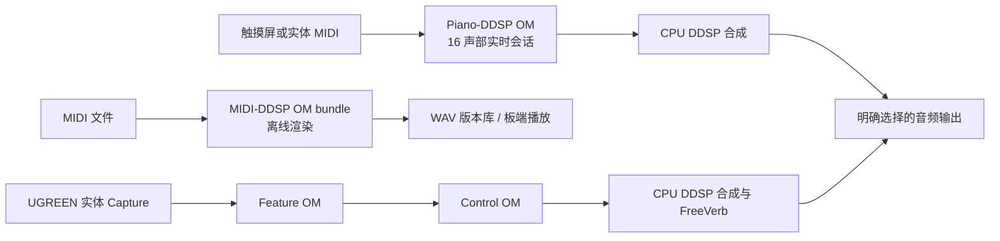

# 项目概览

> 命令默认从 `case3` 根目录执行。[返回文档索引](README.md)。

## 项目边界

Case3 是部署在 Ascend 310B 上的音乐工作台。它有三条明确分开的音频链：触摸或实体
MIDI 驱动的 Piano-DDSP 实时钢琴、MIDI-DDSP 文件渲染，以及摄像头麦克风驱动的
DDSP-VST Effect。浏览器只负责交互与状态显示；模型推理、音频设备选择和文件路径始终由
开发板服务端控制。

当前代码不包含摄像头画面分析或手势识别。案例中的“智能电子琴”指触摸/MIDI 输入、神经
音色控制、实时音频与设备工作台的组合。DDSP-VST 在本项目中是麦克风 Effect，不是实时
MIDI Synth，也不提供 ONNX、TFLite 或 CPU 模型回退。

## 核心模块

| 模块 | 职责 |
| :--- | :--- |
| `piano_ddsp_runtime/` | Piano-DDSP 16 声部实时合成、最小门长、MIDI 状态、FIFO 和音频输出 |
| `midi_ddsp_realtime.py` | MIDI-DDSP 文件分析、版本化 OM bundle 渲染、WAV 缓存与板端播放 |
| `midi_ddsp_webui/` | FastAPI、资源协调、设备枚举、任务、音频库、扬声器测试与 DDSP-VST Effect |
| `webui/` | React/TypeScript 工作台、Canvas 卷帘、WebSocket 与触摸布局 |
| `tools/` | 发布模型下载、校验、ATC/OM 验证、部署、压力测试和报告工具 |

## 硬件

- Ascend 310B 开发板及既有 CANN/PyACL 环境；
- 10 英寸 HDMI 触摸显示器和 USB 触控线，或同一局域网中的浏览器；
- EDIFIER M16 Pro 或其他已经由板端识别的音频输出；
- 可选 MIDIPLUS TINY 等 USB MIDI 控制器；
- DDSP-VST Effect 所需的实体 Capture，例如 UGREEN 1080P 摄像头麦克风；
- 局域网路由器、开发电脑与必要的 USB/HDMI 线材。

本地只做 Python/前端单元测试和生产构建。ATC、OM、PyACL、`npu-smi`、真实音频路由和
物理触摸屏验收必须在 Ascend 310B 上执行。

## 系统链路

Web 工作台有四个顶层工作区：“实时演奏”“MIDI-DDSP”“DDSP-VST”和“设备”。实时演奏
内部以“触摸屏”和“MIDI 键盘”切换输入方式；两个模式共享 Piano-DDSP 会话、钢琴音色、
输出、增益、混响、移调、录音、监听与资源锁。扬声器和输入测试位于设备页。所有 NPU/
声卡任务由 `ResourceCoordinator` 排他协调。

## 模型和报告

模型二进制、权重、ONNX、转换日志和运行报告默认不提交。`models/manifests/` 保存模型
SHA256 清单，`models/README.md` 记录目录约定。生产服务只加载已验证的 OM；本地发布模型
下载、ATC 和板端验证流程见[模型与 OM 部署](03-om-deployment.md)。

原始机器报告保留在 `reports/`，SQLite 只是可重建的音频库索引，WAV、任务元数据和报告
文件才是运行事实。界面操作、全屏启动和部署入口见[WebUI 操作、部署与 API](02-webui.md)。

## 推荐验收顺序

1. 启动服务后先在“设备概览”确认板端、输出、Capture、MIDI 和依赖状态。
2. 在“音频设备 / 输出测试”确认目标扬声器能听见左右或双声道测试音。
3. 在“实时演奏 / 触摸屏”测试 Piano-DDSP 触控按键与卷帘，再在“MIDI 键盘”选择实体端口。
4. 在“MIDI-DDSP”选择已有版本播放，或建立新的完整渲染任务。
5. 确认摄像头是 Capture 而不是 Monitor 后，再在“DDSP-VST”校准输入门并启动 Effect。
6. 完成后停止全部音频任务，确认设备概览中的会话恢复为空闲。
