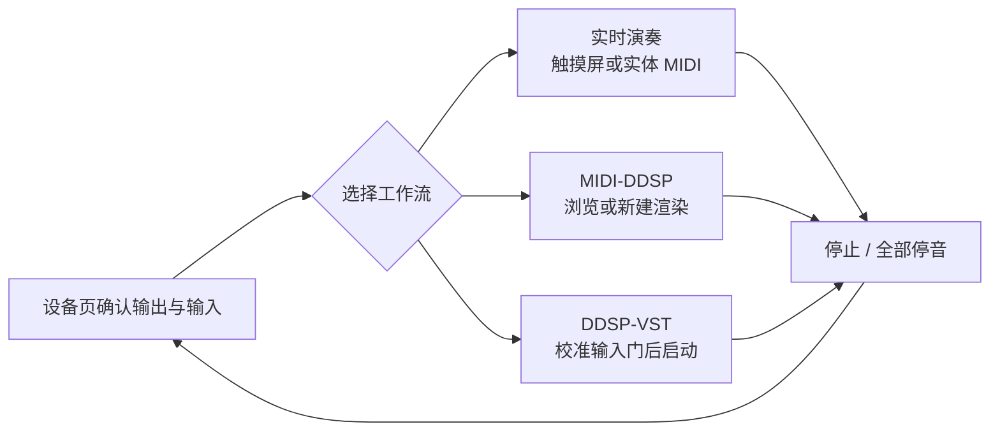
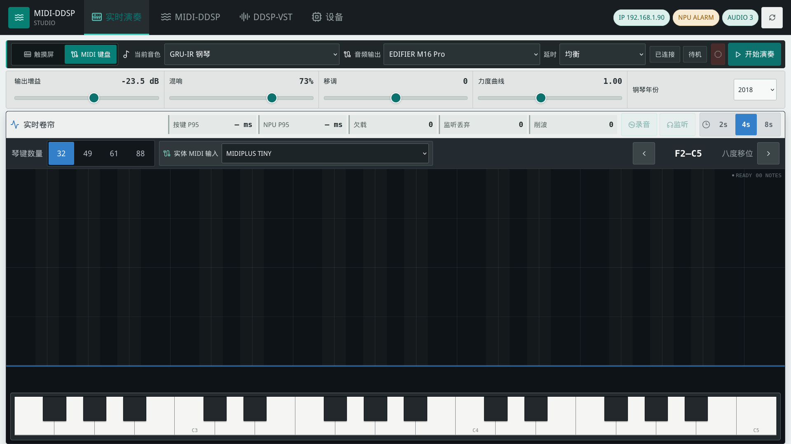
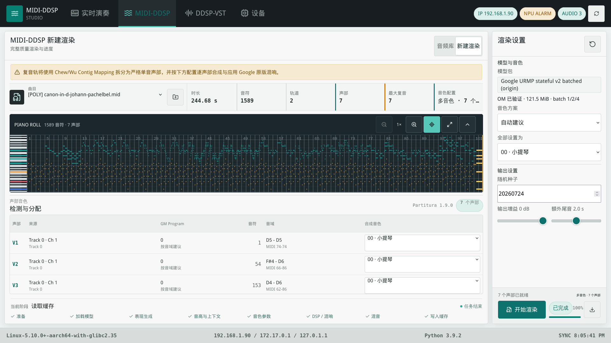
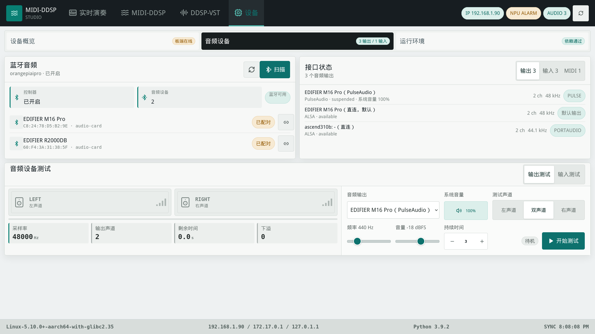
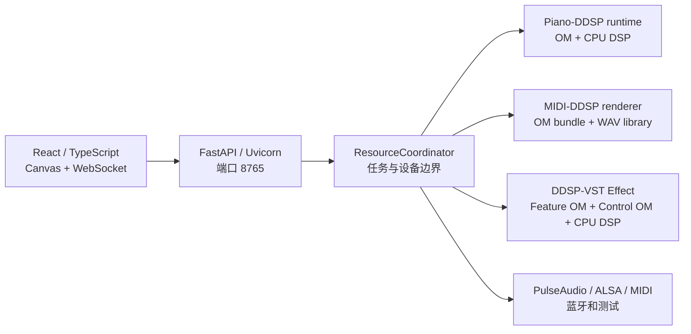

# WebUI 操作、部署与 API

本文是 Case3 WebUI 的统一参考，面向触摸屏使用者、开发者和板端维护者。内容以当前四个
工作区和唯一的 `8765` 生产服务为准，覆盖逐页操作、12 张实机截图、前后端边界、部署、
API 与验收。模型准备另见[模型与 OM 部署](om-deployment.md)，实测命令和结果另见
[WebUI 触摸屏终审与实机压测](webui-acceptance.md)。

本页截图于 2026-08-04 从 `ascend8t` 上的 `http://127.0.0.1:8765` Firefox kiosk 采集，
物理屏幕分辨率为 `1920 x 1080`。截图中的设备、IP、系统音量、模型数和 NPU 警告是当时
状态，仅用于解释布局；操作时应以页面实时状态为准。

## 1. 产品边界与安全顺序

顶层导航只有四个工作区。“触摸屏”和“MIDI 键盘”是“实时演奏”内部的两种输入方式，
共享同一套 Piano-DDSP 会话和设置。

| 工作区 | 输入 | 结果 | 开始前确认 |
| :--- | :--- | :--- | :--- |
| 实时演奏 | 触摸琴键或实体 MIDI | Piano-DDSP 实时钢琴声音 | 已选择输出，其他音频任务已停止 |
| MIDI-DDSP | `.mid` 或 `.midi` 文件 | 版本化 WAV、报告和播放任务 | 模型 bundle、混响资产和资源可用 |
| DDSP-VST | 实体麦克风 Capture | Feature OM、Control OM 与 CPU DDSP 合成后的音频 | Capture、输出和两个 OM 后端可用 |
| 设备 | 音频、MIDI、蓝牙和运行环境 | 状态检查或短时测试 | 实时会话、播放和 Effect 已停止 |

实时演奏、MIDI-DDSP 板端播放、DDSP-VST、扬声器测试和输入测试共用排他资源锁，不能
并发运行。遇到“资源被占用”时，先停止当前拥有者，再启动新任务；刷新页面不会释放声卡
或 NPU。



页面上的应用增益互不影响：实时演奏输出增益、MIDI-DDSP 板端播放音量和 DDSP-VST 输出
增益只处理各自的音频流。“系统音量”只读显示所选 PulseAudio 输出的 mixer 状态，音箱硬件
按键或桌面 mixer 改变音量后页面会同步显示。

## 2. 启动、访问与全屏

开发板使用既有 Conda `base` 和 CANN 环境，不回退到系统 Python，不安装 Node/npm，也不
运行 Vite 或第二个 Web 服务。首次部署或 `requirements.txt` 变更后执行：

```bash
source /usr/local/miniconda3/etc/profile.d/conda.sh
conda activate base
cd /home/HwHiAiUser/Documents/case3
python -m pip install -r requirements.txt
python -c "import pytest; print(pytest.__version__)"
python scripts/check_webui_env.py
```

日常启动只使用仓库脚本：

```bash
cd /home/HwHiAiUser/Documents/case3
python scripts/run_webui.py
```

板载触摸屏打开 Firefox kiosk：

```bash
DISPLAY=:0 XAUTHORITY=/home/HwHiAiUser/.Xauthority \
firefox --kiosk http://127.0.0.1:8765
```

已有 Firefox 时先关闭原窗口，再执行同一条 kiosk 命令，避免多个窗口覆盖触摸事件。远程
电脑通过 `http://<开发板 IPv4>:8765` 访问。服务没有登录和公网访问控制，只应运行在可信
局域网。输入法和 kiosk 配置见[触摸屏输入法配置](touchscreen-input.md)。

## 3. 实时演奏

两个输入模式共用钢琴音色、音频输出、延时档、输出增益、混响、移调、力度、力度曲线、
钢琴年份、录音、监听、实时性能和 Panic。会话运行或录音时不能切换输入模式；先按“停止”，
再更换模式、输出或 MIDI 端口。

### 3.1 触摸屏


*图 1：实时演奏 / 触摸屏。截图处于待机，开始会话后琴键才输出声音。*

| 区域 | 操作 | 正常状态与注意事项 |
| :--- | :--- | :--- |
| 会话栏 | 选择触摸屏、钢琴音色、输出和延时档，然后按“开始演奏” | 状态显示“待机”或“演奏中”；蓝牙输出不允许低延时档 |
| 参数栏 | 拖动输出增益、混响、力度和移调，选择力度曲线与钢琴年份 | 参数实时作用于合成 PCM，不改变系统音量 |
| 实时卷帘 | 选择 2、4 或 8 秒历史，查看按键和 NPU P95、欠载、监听丢弃及削波 | 指标在会话产生事件后更新；短音符仍保留可见轨迹 |
| 触控控制 | 选择 13 或 25 键、键盘大小和八度；使用弯音与延音 | 触摸模式不提供 88 键；弯音松开后回中 |
| 底部琴键 | 按下立即发送 `note_on`，抬起发送 `note_off` | 后端保证最短 16 ms 发声门；取消触摸和失焦会释放音符 |

推荐先选择 EDIFIER 等明确输出和“均衡”延时档，确认“演奏中”后再触键。发生悬挂音符时，
使用顶部 Panic 图标全部停音，随后停止会话并检查输出设备。

### 3.2 MIDI 键盘



*图 2：实时演奏 / MIDI 键盘。MIDIPLUS TINY 是实体输入，钢琴模型和参数与触摸模式一致。*

| 区域 | 操作 | 正常状态与注意事项 |
| :--- | :--- | :--- |
| 会话栏与参数栏 | 与触摸模式相同，先选择输出和钢琴音色再开始 | 不存在第二套音色参数，也不加载 DDSP-VST Synth |
| 琴键数量 | 选择 32、49、61 或 88，使可视范围匹配控制器 | 低于 88 键可按箭头移动八度；88 键固定为 A0-C8 |
| MIDI 输入 | 选择服务端枚举的实体端口 | 输入来自板端 ALSA/RtMidi，不来自浏览器 Web MIDI |
| 卷帘与键盘 | 观察后端 WebSocket 发送的真实音符边沿 | 底部键盘用于可视反馈，不是 MIDI 文件编辑器 |
| 录音、监听和性能 | 使用与触摸模式相同的卷帘工具栏 | 这些状态属于共享会话，切换停止模式不会重置设置 |

列表没有端口时，到“设备 / 音频设备 / MIDI”确认 USB 与 `/dev/snd/seq`。运行中不要拔插
控制器；设备断开时后端会释放该来源的音符和踏板。

## 4. MIDI-DDSP 文件渲染

MIDI-DDSP 先把已有 MIDI 渲染为完整 WAV，再播放或下载，不承担低延时按键合成。“音频库”
和“新建渲染”是分段视图，一次只显示一个文件钢琴卷帘。

### 4.1 音频库


*图 3：MIDI-DDSP / 音频库。选择版本会同步更新配置摘要、卷帘和 WAV。*

| 区域 | 操作 | 正常状态与注意事项 |
| :--- | :--- | :--- |
| 曲目与版本 | 选择曲目和历史渲染版本，必要时设为默认 | 文件缺失的版本标记不可用，不会被静默替换或删除 |
| 文件卷帘 | 使用缩放、复位、全屏和折叠检查完整 MIDI | Canvas 是只读时间轴，显示声部颜色、光标和活动音符 |
| 播放位置 | 选择“开发板喇叭”或“当前浏览器” | 默认是开发板输出；浏览器播放不修改板端 mixer |
| 板端播放 | 选择明确输出和播放音量后开始 | 播放占用资源锁，先停止实时演奏、Effect 和设备测试 |

### 4.2 新建渲染



*图 4：MIDI-DDSP / 新建渲染。配置和随机种子会写入新版本，供后续追溯。*

| 区域 | 操作 | 正常状态与注意事项 |
| :--- | :--- | :--- |
| 曲目栏 | 从目录选择 MIDI，或上传 `.mid`/`.midi` | 上传受格式和大小限制，不接收任意文件路径 |
| 概况与卷帘 | 核对时长、音符、轨道、声部和最大复音 | 复音轨会拆为严格单音声部，并显示明确提示 |
| 声部音色 | 为每个声部选择服务端目录中的 MIDI-DDSP 音色 | GM Program 只是建议，不是最终合成器 |
| 渲染设置 | 选择固定 bundle、方案、种子、输出增益和尾音 | 相同配置再次提交仍生成新历史版本 |
| 任务进度 | 开始后观察阶段、心跳、ETA 和报告 | 完成后到音频库选择该版本播放或下载 |

## 5. DDSP-VST 麦克风 Effect

固定链路为“实体 Capture -> Feature OM -> Control OM -> CPU DDSP 合成 -> 明确输出”。
生产后端必须同时报告 `acl/om`，不提供 ONNX、TFLite、浏览器推理或 CPU 模型回退，也不
提供录音、浏览器监听或原声 Dry/Wet 直通。测试时使用独立单音声源，禁止让音箱直接反馈到
摄像头麦克风。

### 5.1 音色与实时监测


*图 5：DDSP-VST / 音色。待机时轨迹为零，后端标识仍应显示 Feature 和 Control 均为 ACL/OM。*

| 区域 | 操作 | 正常状态与注意事项 |
| :--- | :--- | :--- |
| 音频链路 | 确认 UGREEN 等实体 Capture 和 EDIFIER 等输出后启动 | 运行中设备与音色锁定；设备丢失会停止并释放资源 |
| 实时监测 | 查看音高、电平、Feature/Control 耗时、总延迟和异常计数 | 两个后端都必须是 `ACL/OM`，溢出、欠载和削波应为 0 |
| 音色 | 从中文下拉框选择已发布 Control OM；刷新仅重扫目录 | 中文显示名不改变服务端 ID 或 SHA256 |
| 音色参数 | 调整移调、音高校准、力度校准、谐波和噪声 | 同时关闭谐波与噪声会失去主要合成声源 |

### 5.2 输入门


*图 6：DDSP-VST / 输入门。门关闭时，底噪不会送入合成输出。*

| 控件 | 操作 | 注意事项 |
| :--- | :--- | :--- |
| 重新校准 | 在安静环境采集底噪并生成建议阈值 | 校准期间不要讲话、拍手或播放扬声器 |
| 开启门限 | 设置为高于底噪、低于目标声源峰值 | 太低会被噪声触发，太高会吞掉弱音和起音 |
| 迟滞 | 让关闭阈值低于开启阈值 | 用于减少临界电平附近的反复开关，不是额外增益 |
| 保持、开启、关闭 | 调整门的保持与包络时间 | 关闭过快会截断尾音，过慢会保留环境声 |

### 5.3 效果


*图 7：DDSP-VST / 效果。默认输出增益为 -18 dB，持续过载会触发安全静音。*

| 控件 | 操作 | 注意事项 |
| :--- | :--- | :--- |
| 输出增益 | 从较低值开始逐步调高 | 这是转换后 PCM 增益，不是系统音量 |
| 混响空间与阻尼 | 调整反馈长度和高频衰减 | 参数描述听感，不代表精确房间尺寸或截止频率 |
| 混响 | 调整合成信号的混响比例 | 没有原声直通，因此不是 Dry/Wet 混音器 |
| 安全状态 | 看到“安全静音”或异常时立即停止 | 排查峰值、增益和反馈后再重新启动 |

## 6. 设备

设备工作区分为“设备概览”“音频设备”和“运行环境”。它用于核验和短测试；检测到设备并不
等于已经听音或完成真实 OM 推理。

### 6.1 设备概览


*图 8：设备概览只总结状态，不重复放置页面跳转按钮或终端全文。*

| 区域 | 阅读方法 | 注意事项 |
| :--- | :--- | :--- |
| 开发板状态 | 确认主机、IPv4、平台和 NPU | `Health Alarm` 是警告，真实 OM 任务结果才决定可用性 |
| 实时演奏 | 确认 NPU、输出和会话是否空闲 | “空闲”不表示已经听到声音 |
| DDSP-VST | 确认实体 Capture、Monitor 数量和错误 | Monitor 不能替代麦克风 Capture |
| MIDI-DDSP 与环境 | 确认模型、组件和 Python 依赖已索引 | 目录数量不替代 SHA256 与真实推理验收 |

### 6.2 音频输出与扬声器测试



*图 9：设备 / 音频设备 / 输出。系统音量属于输出状态，与测试 dBFS 和应用增益独立。*

| 区域 | 操作 | 注意事项 |
| :--- | :--- | :--- |
| 蓝牙音频 | 刷新、扫描或连接板端已有设施支持的设备 | 不安装缺失软件；配对成功不等于 A2DP sink 可播放 |
| 输出接口 | 选择 EDIFIER 等明确的 PulseAudio 或 ALSA 输出 | 后端标识用于区分路由，不静默切换设备 |
| 系统音量 | 查看当前 sink 的只读音量和静音状态 | 音箱硬件按键可以改变该读数 |
| 扬声器测试 | 从低 dBFS 开始，选择声道、频率和 1-10 秒时长 | 测试独占资源；逐项听辨左、右声道 |

### 6.3 音频输入与麦克风测试


*图 10：设备 / 音频设备 / 输入。UGREEN 是实体输入，Monitor 明确标为输出回采。*

| 区域 | 操作 | 注意事项 |
| :--- | :--- | :--- |
| 输入列表 | 选择标有“实体输入/CAPTURE”的设备 | 输入测试和 DDSP-VST 都拒绝 Monitor |
| 实时电平 | 对麦克风发声并观察 RMS、峰值和电平条 | `-96 dBFS` 常表示待机或静音 |
| 阈值与时长 | 阈值设在底噪之上、目标声源之下，选择 1-10 秒 | 该阈值不等于 DDSP-VST 输入门参数 |
| 输入测试 | 启动后等待“测试中”和最终结果 | 测试占用 Capture，Effect 运行时不能开始 |

### 6.4 MIDI 设备


*图 11：设备 / 音频设备 / MIDI。零或单端口占满可用宽度，多端口才分栏。*

| 区域 | 操作 | 注意事项 |
| :--- | :--- | :--- |
| MIDI 列表 | 核对制造商、型号、键数和输入端口 | 数据来自服务端 ALSA/RtMidi，不是浏览器 Web MIDI |
| 状态 | 显示可用后，在实时演奏选择同一端口 | 重新插拔可能改变 ID，应刷新并重新选择 |
| 空状态 | 零设备时显示明确提示 | 检查 USB 和 `/dev/snd/seq`；触摸模式仍可使用 |

### 6.5 运行环境


*图 12：设备 / 运行环境。NPU 警告以结构化摘要显示，不直接输出终端全文。*

| 区域 | 阅读方法 | 注意事项 |
| :--- | :--- | :--- |
| 摘要 | Python、依赖、模型和 NPU 应有明确文字状态 | 依赖通过不替代声卡、OM 和听音验收 |
| NPU | 保留 `Health Alarm`，结合真实 OM 任务判断 | 已知 Alarm 不是自动推理失败 |
| 运行依赖 | 检查 FastAPI、音频、MIDI 和 ACL | 板端只允许部署脚本规定的 requirements pip 安装 |
| 模型与解释器 | 检查 OM 类型、精度、大小和 Python 路径 | 不使用系统 Python，也不在板端运行 Node/npm |

## 7. 前后端结构



- `webui/src/`：React、TypeScript、Vite、Lucide、Canvas、Vitest 和 Playwright。
- `midi_ddsp_webui/`：FastAPI 路由、状态、资源协调、MIDI-DDSP 音频库、设备测试和 Effect。
- `piano_ddsp_runtime/`：Piano-DDSP 实时 MIDI 状态、16 ms 最短门长、worker、FIFO 和 CPU DSP。
- `reports/webui/library.sqlite3`：可重建目录；MIDI、WAV、任务元数据、manifest、哈希和报告仍是事实来源。

浏览器只提交服务端枚举的模型、MIDI、渲染和设备 ID，以及有边界的数值参数。它不提交任意
路径、shell 命令或推理后端。所有有副作用的 HTTP 请求和 WebSocket 均为同源连接。

## 8. 本地构建与安全部署

在开发电脑执行标准验证和生产构建。`npm ci` 只在首次准备或锁文件变化时执行；开发板不
安装 Node/npm。

```powershell
python -m pytest -q
cd webui
npm ci
npm run test
npm run build
npm run test:e2e
```

回到 `case3` 根目录后运行部署脚本：

```powershell
powershell -ExecutionPolicy Bypass -File tools/deploy_midi_ddsp_webui.ps1 `
  -SshTarget ascend8t `
  -RemoteRoot /home/HwHiAiUser/Documents/case3
```

脚本在本地生成 `webui/dist`，同步完整后端、vendored `partitura` 和静态资源到 staging，
校验 SHA256 后原子切换 `dist`，并只重启原 `scripts/run_webui.py` 对应的 `8765` 服务。同步
不得删除板端 `midi/`、`midi_wav/`、任务、转换日志、模型、校验清单或报告。

部署后至少验证首页和状态接口，再核对 WebSocket、进程 PID、静态资源哈希与真实设备流程：

```powershell
Invoke-WebRequest http://192.168.1.90:8765/ -UseBasicParsing
Invoke-RestMethod http://192.168.1.90:8765/api/v1/status
```

## 9. API 索引

下表是稳定分组，具体请求体和响应以路由代码与测试为准。浏览器请求只接受目录 ID、设备 ID
和受限参数，不接受任意文件路径或后端选择。

| 分组 | 主要端点 | 用途 |
| :--- | :--- | :--- |
| 全局 | `GET /api/v1/status` | 汇总资源拥有者、实时会话、Effect、设备和依赖 |
| 实时会话 | `GET /api/v1/realtime/catalog`, `GET /api/v1/realtime/status`, `POST /api/v1/realtime/start|stop|panic`, `PATCH /api/v1/realtime/parameters` | 管理共享 Piano-DDSP 会话 |
| 实时事件 | `WS /api/v1/realtime/events`, `GET /api/v1/realtime/recordings/{id}` | 音符边沿、踏板、弯音、录音、监听和状态同步 |
| MIDI-DDSP | `GET /api/v1/catalog`, `/midi-ddsp/library`, `/midi-files/{id}/piano-roll`, `POST /api/v1/midi-ddsp/jobs` | 目录、文件卷帘、版本、渲染和播放 |
| DDSP-VST | `GET /api/v1/ddsp-vst-effect/catalog|status`, `POST /api/v1/ddsp-vst-effect/start|stop|calibrate`, `PATCH /api/v1/ddsp-vst-effect/parameters`, `WS /api/v1/ddsp-vst-effect/events` | OM-only Effect 目录、启停、校准和指标 |
| 音频输入 | `GET /api/v1/audio-inputs`, `GET /api/v1/audio-input-test/status`, `POST /api/v1/audio-input-test/start|stop` | 区分 Capture/Monitor 并运行输入测试 |
| 设备与蓝牙 | `GET /api/v1/bluetooth-audio`, `POST /api/v1/bluetooth-audio/scan|connect|disconnect` | 使用板端已有蓝牙能力 |

`/api/v1/realtime/*` 是实时钢琴唯一入口；不要恢复历史的 `/api/v1/live/*`、
`/api/v1/ddsp-vst/*` 或 `/api/v1/piano-ddsp/*`。麦克风 Effect 使用独立的
`/api/v1/ddsp-vst-effect/*`。设备消失、哈希或张量不符、NPU 不可用、真实 Capture 丢失时，
Effect 必须拒绝或停止并释放锁，不能静默改用其他设备。

## 10. 测试、验收与故障处理

本地只能运行语法、单元、前端和浏览器测试，不得执行 PyACL、ATC、OM 推理、`npu-smi` 或
物理音频。板端验收覆盖 `1920x969` 触摸、`1366x768` 桌面、`1024x768` 平板和
`390x844` 手机，检查无横向溢出、重叠、文字截断、触控目标过小、Canvas 空白和不可达控件。

界面改动还应验证四项导航、语义页签、加载/错误/运行状态、触摸快速按放、底部琴键位置、
MIDI 复音和模式切换。音频或推理改动必须记录 `midi_to_pcm_ms`、队列延迟、非零 PCM、
削波、欠载和真实后端，HTTP 200 不能单独证明声音正确。完整阈值、UI soak、API 负载和
600 秒 DDSP-VST 双工结果见[WebUI 触摸屏终审与实机压测](webui-acceptance.md)。

常见处理原则：

- 资源占用：停止当前实时、播放、Effect 或测试任务，不通过刷新抢占。
- 实体 MIDI 不可用：检查 USB 和 `/dev/snd/seq`，再刷新服务端端口。
- 蓝牙已配对但无输出：确认 A2DP sink 已出现；不在部署中安装缺失工具。
- DDSP-VST 无法启动：检查模型哈希、张量、`acl/om`、实体 Capture 和指定输出，不使用回退。
- NPU 显示 `Health Alarm`：保留为警告，结合真实 OM 推理和指标判断。
- 任务结束：使用页面停止按钮；实时会话可额外 Panic，然后回到设备概览确认资源空闲。

更完整的诊断步骤见[测试故障排查](troubleshooting.md)。
