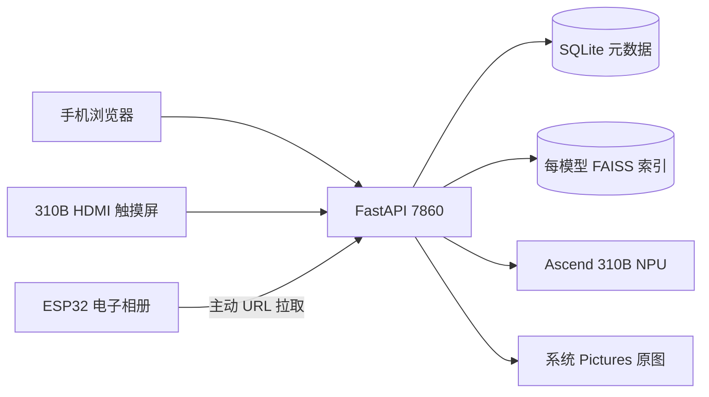

# Case7 部署与日常运行

_面向 310B 操作者的服务部署、启动、检查和重启手册。_

---

本文是 310B 板端服务的部署和日常运维手册。完整架构、模型原理和迁移方法请阅读 [`src/experiment/case7.md`](../../../src/experiment/case7.md)。

## 运行边界

Case7 是运行在 Orange Pi AIpro / Ascend 310B 上的 FastAPI 相册服务器。手机、310B HDMI 触摸屏和远端 ESP32 通过同一个 HTTP 服务访问相册。

| 项目 | 当前约定 |
| --- | --- |
| 服务入口 | `app.py` |
| 监听地址 | `0.0.0.0` |
| 服务端口 | `7860` |
| 发布目录 | `/home/HwHiAiUser/Documents/ai-album` |
| 用户照片 | `~/Pictures/ai-album/imports/` |
| 上传临时目录 | `~/Pictures/ai-album/.upload-tmp/` |
| 运行模式 | `--backend npu --touchscreen` |
| 电子纸输出 | 默认 `dry-run` |

服务只建议部署在可信局域网。当前接口没有公网级用户认证，不要把 `7860` 端口映射到公网。

## 首次部署

在开发机执行 dry-run，确认脚本将要同步的白名单文件：

```bash
cd samples/case7
bash scripts/deploy_ascend8t.sh --ssh-target HwHiAiUser@<BOARD_IP>
```

确认目标、文件清单和远端路径正确后再应用：

```bash
bash scripts/deploy_ascend8t.sh \
  --ssh-target HwHiAiUser@<BOARD_IP> \
  --apply
```

部署脚本使用 `releases/<release-id>`、`current` 和共享目录，不使用 `rsync --delete`，不会覆盖 `models/`、`data/`、`photos/` 或 `reports/`。切换前会保留旧版本，失败时可以恢复上一版本。

## 板端预检与启动

所有 CANN、PyACL、ATC、OM 和 `npu-smi` 操作必须在板端 conda 环境执行：

```bash
cd /home/HwHiAiUser/Documents/ai-album/current
bash scripts/collect_system_status.sh

source /usr/local/miniconda3/etc/profile.d/conda.sh
conda activate base
source /usr/local/Ascend/ascend-toolkit/set_env.sh

bash setup.sh board
bash scripts/run_smart_album_service.sh --root "$PWD"
```

启动脚本会在同一个 shell 中预检 `acl`、FAISS、OpenCV、FastAPI、multipart 和模型注册表，然后以 NPU 后端启动服务。不要直接在没有加载 CANN 的 shell 中运行 `python app.py`。

## 健康检查

```bash
curl http://127.0.0.1:7860/api/health
curl http://127.0.0.1:7860/api/models
curl http://127.0.0.1:7860/api/index/stats
curl -I http://127.0.0.1:7860/
```

应至少确认：

- 服务状态为可用；
- NPU 后端已初始化；
- 需要运行的模型处于 `admitted`；
- 照片数量、可用照片数量和 embedding 数量可解释；
- 静态首页可以访问。

`npu-smi` 中的 `Health: Alarm` 只记录为诊断信息，不能单独判定服务失败。真正的阻断项是 `import acl` 失败、模型加载失败、ACL 执行失败、服务进程退出或 API 返回错误。

## 重启服务

只停止 Case7 自己的 PID，不结束其他服务：

```bash
bash scripts/run_smart_album_service.sh \
  --root /home/HwHiAiUser/Documents/ai-album/current \
  --stop
bash scripts/run_smart_album_service.sh \
  --root /home/HwHiAiUser/Documents/ai-album/current
```

默认日志为 `logs/smart_album.log`，PID 文件为 `run/smart_album.pid`。重启后重新检查 `/api/health`、`/api/index/stats` 和 `/api/display/current`。

## 服务架构



## 常见运维规则

- 发布前先 dry-run，再 `--apply`。
- 只在板端执行 ATC 和 ACL；开发机不安装 CANN。
- 不把个人照片、OM、数据库和报告复制进 Git。
- 不通过修改 shell 启动文件加载 CANN；启动脚本负责显式加载环境。
- 不使用服务端 CPU fallback 掩盖模型准入或 ACL 问题。
