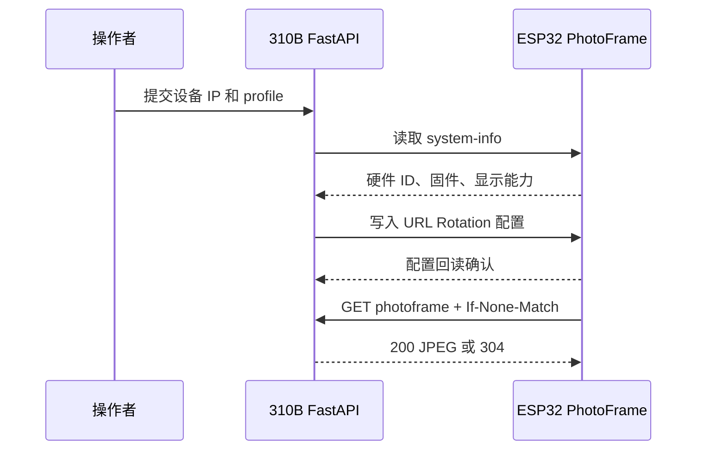

# ESP32 电子相册设备管理

_说明 Waveshare PhotoPainter 与 Seeed E1002 的唤醒、发现、注册和主动拉图。_

---

Case7 当前只管理两类远端电子相册。设备注册是“验证地址和设备身份”流程，不是把任意 IP 写进数据库。

## 固定设备 profile

| profile_id | 设备 | 尺寸 | 允许方向 |
| --- | --- | --- | --- |
| `waveshare_photopainter_73` | Waveshare ESP32-S3-PhotoPainter 7.3 英寸 | 800×480 | `landscape`、`portrait` |
| `seeedstudio_reterminal_e1002` | Seeed Studio reTerminal E1002 | 800×480 | `landscape` |

Waveshare profile 参考 [官方产品页](https://www.waveshare.com/product/displays/e-paper/epaper-1/esp32-s3-photopainter.htm) 和 [Wiki](https://www.waveshare.com/wiki/ESP32-S3-PhotoPainter)。E1002 profile 参考 [Seeed Studio Wiki](https://wiki.seeedstudio.com/getting_started_with_reterminal_e1002/)。这些资料用于确定硬件 profile，不等同于当前固件 URL 协议验收。

Case7 不提供 360 度、90 度、180 度和 270 度任意安装角度。Waveshare 的竖屏或横屏是显示策略；E1002 只能登记为横屏。

## 唤醒和发现

深度休眠状态下，310B 不能通过普通 HTTP、mDNS 或 IP 扫描网络唤醒 ESP32。必须先使用设备实体按键、上电复位或串口操作唤醒，再等待 Wi-Fi 和 HTTP 服务恢复。

设备页的发现操作是受限的 mDNS 候选读取，不是网段扫描，也不会自动选择第一台设备。`photoframe.local` 是共享 mDNS 名称，局域网存在多台设备时不能作为唯一地址。

推荐流程：

1. 按对应设备的实体唤醒键。
2. 等待串口显示 STA IPv4，或从路由器 DHCP 租约读取地址。
3. 在设备页点击“发现局域网电子相册”。
4. 若 mDNS 不可用，输入已确认的 `http://<ESP32_IP>` 并点击探测。
5. 按 IPv4、硬件 ID、板型和固件信息选择唯一候选。
6. 选择对应 `profile_id`，执行“验证并注册”。

注册接口会先读取设备身份，再写入并读回 URL Rotation 配置。验证失败时返回错误，不应留下孤立的“已注册”记录。

## 设备主动拉取

注册成功后，Case7 只使用设备主动 URL 拉取：

```text
GET /api/devices/{device_id}/photoframe
```

ESP32 在自己的轮播时隙发起请求，服务器按设备 profile 生成 JPEG。首次内容请求返回 `200 image/jpeg`；同一照片、策略、设备配置和选择 revision 未变化时，带相同 ETag 的请求返回 `304 Not Modified`。

服务器不会因为网页探测、浏览器预览或 mDNS 发现而把设备标记成“已拉图”。只有包含固件版本和显示能力的 PhotoFrame 请求才会写入最近拉取状态。



## 禁用、删除和状态

设备页的“禁用”是可恢复停用；禁用设备的取图接口返回不可用状态。删除注册只删除设备注册元数据和显示状态，不删除照片、SQLite 照片记录或 embedding。

设备状态至少区分：

- `awaiting_pull`：地址和控制面配置已验证，尚未观察到完整 PhotoFrame 拉图；
- `pulled`：已经观察到带固件和显示能力的有效拉图；
- `disabled`：设备被管理页停用；
- `unreachable`：验证或配置请求无法连接；
- `rejected`：设备身份或 profile 不匹配。

## 不支持的路径

当前文档不把服务端直接发送、旧版 Demo `/dataUP`、未知固件端点或网络唤醒写成当前工作流。若设备固件不支持 URL Rotation，必须先确认并修改固件协议，再进行单独的固件开发和验收。
