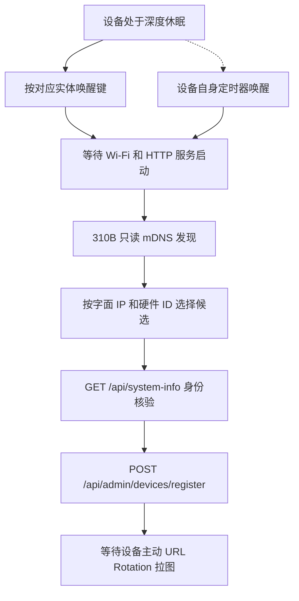

# 唤醒与发现两类 ESP32 电子相册

_本手册用于 Waveshare ESP32-S3-PhotoPainter 7.3 英寸和 Seeed Studio reTerminal E1002。Case7 服务器示例地址为 `http://192.168.1.135:7860`。设备与 310B 必须位于彼此可路由的局域网；HTTP 必须可达，mDNS 只是可选的发现方式。_

## 先确认固件能力

“设备已连接 Wi-Fi”“网页能打开”和“可以被 Case7 配对”是三个不同状态。Case7 的自动发现只接受同时满足以下条件的设备：

| 检查 | 通过条件 | 失败时的含义 |
| --- | --- | --- |
| mDNS | 广播 `_esp32-pframe._tcp`，端口 80 | 可能是旧固件、原厂固件、休眠或组播被隔离 |
| HTTP | 310B 能访问字面 IPv4 的 `GET /api/system-info` | 设备尚未醒来、地址变化或网络隔离 |
| 身份 | `project_name=esp32-photoframe`，并返回 `device_id`、板型和尺寸 | 不能把原厂 SenseCraft/Xiaozhi 或普通 Web 设备登记为 PhotoFrame |
| profile | 明确匹配 `waveshare_photopainter_73` 或 `seeedstudio_reterminal_e1002` | 仅有 800x480 不能推断是哪一种面板 |

原厂固件可能显示二维码、mDNS 或厂商网页，但不一定实现上述接口。不要因为外壳名称、二维码中的 `photoframe.local` 或端口 80 可达就判定兼容。若设备使用原厂 SenseCraft/Xiaozhi 固件，必须先按照该固件的官方流程操作，或刷入/修改一个明确实现 PhotoFrame API 的固件，再按本手册验证。

## 深度休眠不能由网络唤醒

上游 PhotoFrame 默认可以进入 deep sleep。进入 deep sleep 后，ESP32 会停止 Wi-Fi、mDNS 和 HTTP 服务；310B 没有可发送的 WoL、UDP 或 HTTP 唤醒接口。网络发现也不会改变这个状态。只有设备自身的定时器、GPIO/实体按键，或重新上电才能让它醒来。



## 两种设备的实体按键

| 设备 profile | 从深睡唤醒并启动网络服务 | 醒着时的手动换图 | 方向限制 |
| --- | --- | --- | --- |
| `waveshare_photopainter_73` | 按一次 **BOOT** | **KEY**（Rotate） | 横屏或竖屏；服务器只使用 `landscape`/`portrait` |
| `seeedstudio_reterminal_e1002` | 按顶部绿色 **Wake/Refresh** | 左侧 Rotate/Refresh 键（以设备实际固件提示为准） | 仅横屏 800x480 |

按键名称来自上游 PhotoFrame 的板级映射。不同的原厂 Demo 可能把按键映射成清屏、刷新或配网；看到的行为与表格不一致时，以串口日志和该设备固件说明为准。按“换图”键不一定会启动 HTTP 服务，因此发现前应使用上表中的唤醒键并等待启动完成。

## 标准操作顺序

### 在 310B 设备管理页完成发现

打开 `http://192.168.1.135:7860/?mode=touchscreen`，进入底部 **设备**。在
**ESP32 唤醒与发现** 区域先阅读对应的实体唤醒键说明，然后点击 **发现局域网电子相册**。
这个按钮只调用只读的 `GET /api/admin/devices/discover`，不会创建登记记录。候选出现后，
按字面 IPv4、硬件 ID 和实物型号确认；点击 **选择并继续登记** 会把候选带入设备页，
仍需在设备页点击 **验证并注册设备** 才会写入注册表。

如果 mDNS 被路由器隔离，设备管理页还提供 **发现为空时，按 IP 验证单台设备**。输入刚从
串口或 DHCP 租约得到的 `http://<设备IPv4>`，点击 **读取并验证 IP**。它调用只读的
`POST /api/admin/devices/probe`，只读取 `/api/system-info`，不会扫描网段、修改设备或
注册设备；只有返回 `project_name=esp32-photoframe`、硬件 ID、板型和尺寸时，才可以
点击候选继续登记。

### 1. 唤醒并等待网络

1. 一次只处理一台目标设备，先按表格中的唤醒键。
2. 等待屏幕完成启动、连接 2.4 GHz Wi-Fi，并保持设备在醒着状态。Case7 固定开启深度休眠，不能在服务页面关闭；如设备在扫描前再次睡眠，再按一次实体唤醒键。
3. 从设备串口启动日志或路由器 DHCP 租约取得当前 IPv4。地址每次重启或重新配网都可能变化；`photoframe.local` 不是唯一地址，局域网两台设备还可能使用相同主机名。

### 2. 在 310B 上运行只读发现

如果健康检查连接被拒绝，先在 310B 的发布目录启动 Case7（只启动本项目服务，不要用
`python app.py` 绕过 CANN 预检）：

```bash
cd /home/HwHiAiUser/Documents/ai-album/current
SMART_ALBUM_PUBLIC_URL=http://192.168.1.135:7860 \
  bash scripts/run_smart_album_service.sh
```

启动脚本会在同一 shell 激活 conda/CANN，检查 `acl`、FAISS、OpenCV、FastAPI、multipart
和已准入模型。若脚本报模型或 ACL 错误，先修复服务环境；不要把“网页端口能打开”当成 NPU
服务已经可用。

先确认 Case7 服务已启动：

```bash
curl -fsS --max-time 8 http://127.0.0.1:7860/api/health
curl -fsS --max-time 8 http://127.0.0.1:7860/api/device-profiles
```

然后执行发现：

```bash
curl -fsS --max-time 15 http://127.0.0.1:7860/api/admin/devices/discover
```

服务端使用固定的 `/usr/bin/avahi-browse -rpt _esp32-pframe._tcp`，等待最多 10 秒，只保留端口 80 的 RFC1918 字面 IPv4，并对每个地址执行一次只读 `/api/system-info`。mDNS 没有可用结果时，只会回退探测设备注册表中此前由用户验证过的地址；该接口不会扫描 CIDR、解析任意 DNS、修改设备、创建设备记录或唤醒设备。

候选示例：

```json
{
  "device_url": "http://192.168.1.137",
  "hostname": "photoframe.local",
  "device_hardware_id": "a4cb8fdaa1dc",
  "board_name": "waveshare_photopainter_73",
  "firmware_version": "v2.18.0",
  "width": 800,
  "height": 480,
  "profile_candidates": ["waveshare_photopainter_73"],
  "status": "ready"
}
```

发现多台设备时，必须按屏幕实物、字面 IPv4、硬件 ID/MAC 和固件版本人工点击一台；服务不会按名称或返回顺序自动选择。mDNS 记录在设备刚入睡后可能短暂残留，所以候选的 `status=ready` 也要以紧接着的 HTTP 身份读取为准。

### 3. 发现为空时用 IP 回退

空列表不等于设备不存在。常见原因是设备仍在深睡、尚未广播 mDNS、AP 隔离、跨 VLAN 或交换机过滤 UDP 5353。先重新按唤醒键，再从串口/DHCP 得到地址，用 310B 或同一局域网电脑执行：

```bash
photo_ip=192.168.1.137
curl -i --connect-timeout 5 --max-time 10 "http://${photo_ip}/api/system-info"
curl -i --connect-timeout 5 --max-time 10 "http://${photo_ip}/"
```

只有返回的 JSON 明确包含 `project_name=esp32-photoframe`、`device_id`、`board_name`、`width` 和 `height`，才可以把这个 IP 填入注册表。仅能打开普通网页、只能看到二维码或只有 `photoframe.local` 名称，都不算身份核验。串口监视器的完整取 IP 方法见 [PhotoPainter 串口读取 IP 与 Wi-Fi 配网](./13-photopainter-serial-ip-and-wifi.md)。

### 4. 明确选择并注册

在触摸屏或手机的 **设备** 面板中：

1. 点击 **发现局域网 PhotoFrame**，点击唯一目标候选；或手工填写刚刚验证过的 `http://<ESP32-IP>`。
2. 选择正确的 profile。Seeed E1002 的竖屏选项必须保持禁用；不能只根据 800x480 自动猜测型号。
3. 核对硬件 ID 后点击 **验证并登记**。

等价的 HTTP 请求如下，`expected_device_id` 必须替换成 `/api/system-info` 返回的值：

```bash
# 仅为格式示例：必须替换成刚才 /api/system-info 返回的当前值。
curl -fsS -X POST http://127.0.0.1:7860/api/admin/devices/register \
  -H 'Content-Type: application/json' \
  --data-raw '{
    "name": "客厅-微雪",
    "profile_id": "waveshare_photopainter_73",
    "orientation": "landscape",
    "device_url": "http://192.168.1.137",
    "expected_device_id": "a4cb8fdaa1dc",
    "trigger_now": true
  }'
```

注册请求会再次读取设备身份，在任何 `/api/config` 写入前核对硬件 ID、板型和尺寸；地址不可达、身份不符或固件不支持 URL Rotation 时返回错误，并且不会留下半注册记录。`trigger_now=true` 只表示在已验证设备上请求一次固件提供的立即动作，不是网络唤醒。

返回 `202` 且 `registration_status=awaiting_pull` 的含义是“310B 已验证地址并完成控制面配置”，不是“电子纸已经显示”。设备必须在醒着时主动请求：

```text
GET http://192.168.1.135:7860/api/devices/<case7_device_id>/photoframe
```

设备卡片随后才会记录 `pulled`、最近请求时间和 HTTP 状态。首个有效请求通常为 `200 image/jpeg`，相同选择和 ETag 的重复请求为 `304 Not Modified`。

## 睡眠、轮播和再次唤醒

Case7 不提供关闭深度休眠的联调模式。注册和成功取图都会写入 `deep_sleep_enabled=true`；正常链路是：

1. ESP32 由自身定时器或实体按键唤醒；
2. 连接 Wi-Fi 并发出 URL Rotation GET；
3. 310B 返回 `200`（新 ETag）或 `304`（选择未变化）；
4. ESP32 刷新面板并再次进入深睡。

310B 只能在设备已经醒来并发出请求后提供照片，不能把“推进下一张”、`/api/rotate` 或注册按钮当作远程唤醒。要临时检查设备，先按实体唤醒键，等 HTTP 服务恢复，再在 Case7 设备页查看请求状态。若 DHCP 地址变化，重新读取 IP，并在设备卡片中重新验证配置；不要沿用旧租约。

## 常见故障

| 现象 | 可能原因 | 处理顺序 |
| --- | --- | --- |
| 发现为空，串口显示正在睡眠 | 深睡关闭了 Wi-Fi/mDNS/HTTP | 按 Waveshare **BOOT** 或 E1002 **绿色 Wake/Refresh**，等待启动后重试 |
| 发现为空但网页 IP 可打开 | 固件只广播 `_http._tcp`、组播被隔离或版本过旧 | 直接读取 `/api/system-info`；确认 `project_name` 后手工填 IP，不能把普通 Web 设备登记为 PhotoFrame |
| 两台候选都叫 `photoframe.local` | mDNS 主机名相同 | 用字面 IP + `device_hardware_id` + 实物逐一确认 |
| 注册返回 502/`not_registered` | 设备在注册前再次休眠、IP 错误或网络不通 | 唤醒并保持 awake，重新 curl `/api/system-info`，再注册 |
| 注册返回身份不匹配 | 选错设备或 `expected_device_id` 过期 | 取消本次注册，重新发现并核对硬件 ID；不要强行去掉校验 |
| 注册成功但没有“设备已拉图” | 设备尚未保存 URL Rotation，或仍在深睡 | 在设备网页核对图片 URL，先关闭深睡，观察一次真实 GET |
| E1002 只能看到 SenseCraft 配网/二维码 | 使用原厂固件，不是 PhotoFrame API | 不要猜测端点；刷入或开发明确支持 URL Rotation 的固件后再验证 |

## 证据记录模板

每台设备单独保存以下信息，避免把两台同名设备混在一起：

```text
observed_at: 2026-09-06T08:00:00+08:00
device_kind: waveshare_photopainter_73 | seeedstudio_reterminal_e1002
physical_wake_key: BOOT | green Wake/Refresh
serial_or_dhcp_source: <日志文件或租约截图>
device_ip: <当前字面 IPv4>
device_hardware_id: <system-info.device_id>
firmware_version: <system-info.version>
system_info_http_status: 200
mdns_service: _esp32-pframe._tcp | unavailable
case7_discovery_status: ready | none_found | unavailable
case7_registration_status: awaiting_pull | not_registered
first_pull_status: 200 | 304 | not_observed
case7_server: http://192.168.1.135:7860
notes: <是否关闭深睡、面板是否真实刷新、异常原文>
```

## 官方依据与边界

- [PhotoFrame v2.18.0 README](https://github.com/aitjcize/esp32-photoframe/blob/v2.18.0/README.md)：深睡默认开启以及 Waveshare BOOT、E1002 绿色 Wake 的按键映射。
- [PhotoFrame API](https://github.com/aitjcize/esp32-photoframe/blob/v2.18.0/docs/API.md)：URL Rotation、显示协商头和 `304` 行为。
- [PhotoFrame mDNS 实现](https://github.com/aitjcize/esp32-photoframe/blob/v2.18.0/main/mdns_service.c)：`_esp32-pframe._tcp` 端口 80 广播。
- [Espressif 睡眠模式说明](https://docs.espressif.com/projects/esp-idf/en/latest/esp32/api-reference/system/sleep_modes.html)：deep sleep 不保持 Wi-Fi 连接，网络包不能直接唤醒。
- [Waveshare PhotoPainter Wiki](https://www.waveshare.com/wiki/ESP32-S3-PhotoPainter) 与 [Seeed reTerminal E1002 Wiki](https://wiki.seeedstudio.com/getting_started_with_reterminal_e1002/)：硬件按键和面板资料；厂商硬件页面不自动证明 PhotoFrame API 兼容。

本手册证明的是“实体唤醒后，310B 能否发现并验证设备”的操作流程。它不把 mDNS 候选、HTTP `200`、URL Rotation 拉图或 E6 dry-run 任何一项冒充真实七色电子纸刷新结果；真实面板刷新仍需逐台硬件验收。

## 本次 310B 页面验证记录

2026-09-06 在 `192.168.1.135` 的设备管理页完成了一次实际只读验证：`/api/health` 返回
`ready`，NPU 为 `Ascend 310B4`，但 **发现局域网电子相册** 返回
`status=none_found`、候选数为 0。对板端邻居表中的三个地址做受限 IP 验证时，
`.81` 超时、`.82` 拒绝连接、`.83` 返回 `Epson UPnP/1.0` 的 `404`；没有任何一个地址
返回 `project_name=esp32-photoframe`，因此没有创建登记记录。该结果只说明测试时没有
观察到可核验的 PhotoFrame，不代表设备永久不存在。请按实体唤醒键并保持设备醒着后，
在同一设备管理页再次点击发现；若仍为空，使用串口/DHCP 地址执行 **读取并验证 IP**。
