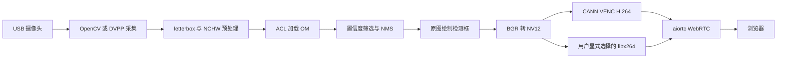
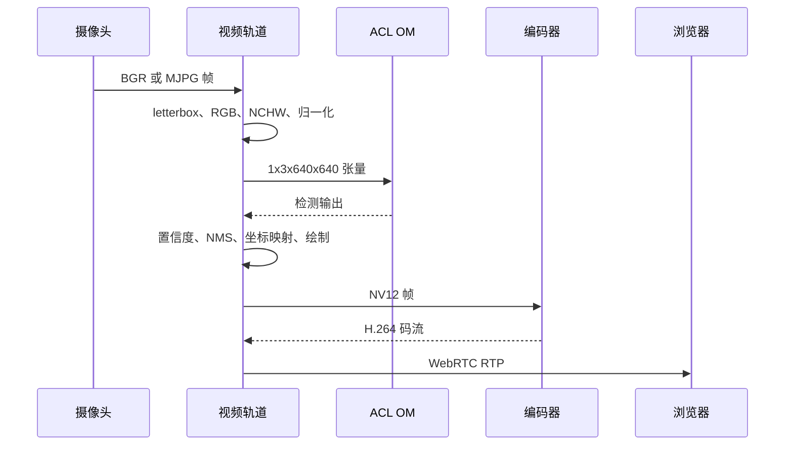

# case8 项目设计

## 🎯 项目任务

本案例从 USB 摄像头读取连续图像，在 Ascend 310B 上使用 YOLOv10 手势检测
模型识别 HaGRID 类别，将检测框和标签绘制回原始画面，再通过 WebRTC 发送
到远程浏览器。它把模型部署、NPU 推理、视频采集、H.264 编码和实时传输
串成一个可观察的边缘 AI 应用。

## 🧱 系统结构

摄像头采集、推理、绘制和编码属于同一个视频轨道，但每个模块有清晰的
输入输出边界：采集输出图像，ACL 输出检测张量，后处理输出检测结果，编
码器输出 Annex-B H.264 码流，WebRTC 负责网络传输。

## 🔄 一帧的处理过程

## 🧠 模型和理论基础

HaGRID 是面向手势识别的图像数据集，本案例使用其 YOLOv10 格式的预训练
权重，不在 310B 上训练模型。YOLOv10 直接输出目标框、置信度和类别编号；
程序再根据模型对应的标签文件把类别编号转换为手势名称。[HaGRID 项目][^1]
和 [YOLOv10 项目][^2] 是模型与数据集的外部参考。

模型输入采用静态 `1x3x640x640`。原始摄像头画面先保持比例缩放，再用边框
补齐为正方形，避免直接拉伸导致手势形状改变。模型尺寸由 OM 契约决定，
不是网页运行时参数；网页只调整采集尺寸和推理间隔等运行配置。

## ⚙️ 为什么使用 310B NPU

OM 模型由 ATC 针对目标 SoC 编译，ACL 在 NPU 上执行推理并管理 device
buffer。这样可以把持续视频中的卷积和检测头计算从主 CPU 转移到 NPU，CPU
主要负责采集调度、后处理、绘制和 WebRTC 服务。

## 🎞️ 为什么使用 CANN VENC

CANN VENC 将 NV12 视频帧交给 Ascend 视频编码硬件，目标是降低 CPU 编码开
销。CANN VENC 和 CPU `libx264` 是两个并列选项：

| 选项 | 推理位置 | 编码位置 | 选择方式 |
| --- | --- | --- | --- |
| CANN VENC | NPU | Ascend VENC | 默认/网页显式选择 |
| CPU libx264 | NPU | CPU | 网页或 `--no-hardware-encode` 显式选择 |

硬件编码失败时不会自动切换到 CPU。这样页面和日志可以明确告诉使用者
“CANN VENC 不可用”，不会把硬件故障隐藏在一个看似正常的 CPU 视频流后面。

## ⏱️ 实时性取舍

采集线程只保留最新帧，推理线程按照 `infer_every_n` 处理，视频轨道持续发
送最新的绘制结果。实时预览优先控制延迟，因此在推理暂时跟不上时允许丢弃
旧帧，而不是无限堆积队列。`/stats` 将采集、推理、NV12 转换和发送指标分
开，便于定位瓶颈。

## 🚧 适用范围

本案例是教学和板端验证程序，不包含模型训练、用户认证、持久化视频存储或
多用户会话管理。模型权重、数据集、ONNX 和 OM 是外部资产，代码仓库只保留
导出、转换和运行时处理逻辑。

[^1]: HaGRID project. https://github.com/hukenovs/hagrid
[^2]: THU-MIG YOLOv10 project. https://github.com/THU-MIG/yolov10
