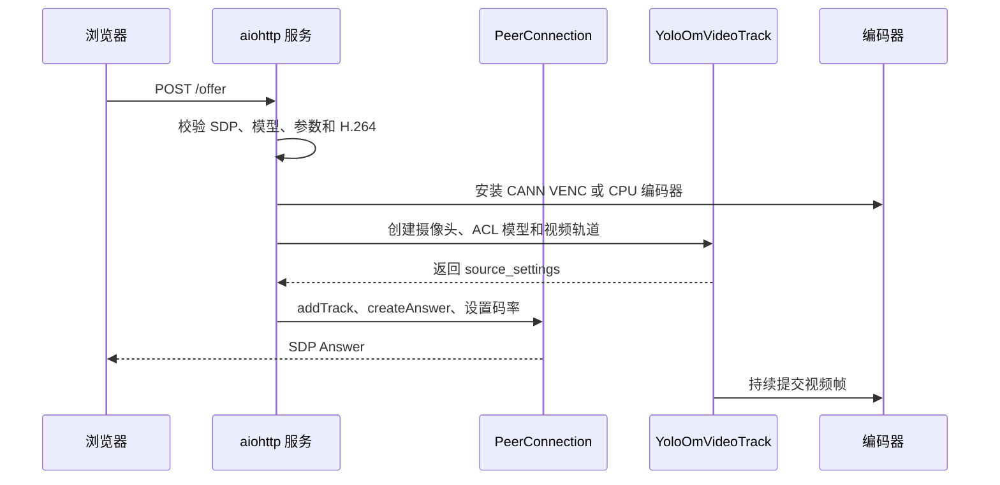

# case8 程序解析

## 🗂️ 代码目录

| 目录或文件 | 作用 |
| --- | --- |
| `scripts/webrtc_om_app.py` | WebRTC 服务、视频轨道、路由和启动参数 |
| `hagrid_yolo/preprocess.py` | letterbox、RGB、NCHW 和归一化 |
| `hagrid_yolo/detector.py` | 连接预处理、后端和后处理 |
| `hagrid_yolo/backends/acl_backend.py` | ACL 初始化、OM 加载、buffer 和执行 |
| `hagrid_yolo/postprocess.py` | 输出解码、坐标恢复和 NMS |
| `hagrid_yolo/visualization.py` | 检测框、标签和统计信息绘制 |
| `webrtc_app/cann_encoder.py` | NV12 转换、CANN VENC 通道和 H.264 输出 |
| `webrtc_app/dvpp_jpegd.py` | DVPP JPEGD 解码为 NV12 |
| `webrtc_app/v4l2_capture.py`、`v4l2_raw.py` | MJPG V4L2 采集 |
| `web/webrtc_index.html`、`webrtc_client.js`、`webrtc_styles.css` | 浏览器页面、请求和状态展示 |

## 🚪 服务入口和接口

`scripts/webrtc_om_app.py` 的 `main()` 解析命令行参数，`build_app()` 注册
静态文件和 API 路由。默认监听 `0.0.0.0:8080`，默认模型为
`models/YOLOv10n_gestures.om`。

| 方法 | 路径 | 用途 |
| --- | --- | --- |
| GET | `/` | 返回网页 |
| GET | `/client.js`、`/styles.css` | 返回前端资源 |
| GET | `/health` | 返回服务和当前编码器状态 |
| GET | `/models` | 列出 `models/` 下的 OM 文件 |
| GET | `/stats` | 返回当前视频轨道和编码器统计 |
| POST | `/offer` | 接收浏览器 SDP，创建 WebRTC Answer |

`/health` 的 `status=ok` 只代表 HTTP 服务在线；CANN VENC 是否真正创建成功，
必须看编码器状态或建立视频连接后的 `/stats`。

## 🔌 `/offer` 的处理顺序

如果选择 CANN，`patch_h264_encoder(True)` 会先验证 CANN ACL 可导入；随后
`CannH264Encoder` 在收到第一帧时创建 VENC 通道。模型、摄像头、编码器或
H.264 协商失败，`/offer` 返回明确的 HTTP 错误并清理 PeerConnection。

## 🧮 推理流水线

`YoloOmVideoTrack` 从采集后端获取一帧，交给 `YoloDetector`：

1. `letterbox()` 保持宽高比缩放并记录 `scale`、`pad_left`、`pad_top`。
2. `preprocess_image()` 将 BGR 转 RGB、HWC 转 NCHW，并归一化到 `float32`。
3. `AclModel.infer()` 将输入复制到 device buffer，执行 `acl.mdl.execute`，再将输出复制回 host。
4. `decode_detections()` 过滤置信度，必要时将 `xywh` 转为 `xyxy`，恢复原图坐标并执行 NMS。
5. `visualization.py` 将框和标签画回原始分辨率图像。

后处理减去 letterbox padding 再除以缩放比例，因此检测框仍对应摄像头原图，
而不是 640x640 的模型输入。

## 🎥 采集与编码

OpenCV 后端从摄像头得到 BGR 或 MJPG 解码后的图像；DVPP 后端从 V4L2 读取
MJPG，再用 `DvppJpegDecoder` 解码成 NV12，之后仍需要转成 BGR 完成推理和
绘制。最终所有编码路径都使用 NV12：

- `CannH264Encoder` 调用 `CannVenc.encode()`，通道创建、device 内存申请或
  编码回调失败都会抛出异常。
- CPU 模式由 aiortc 的 `H264Encoder` 使用 `libx264`，只在用户显式选择时
  安装。

## 🧹 生命周期和资源释放

连接关闭、ICE 失败、连接超时或服务退出时，`close_peer_connection()` 会
停止视频轨道、关闭摄像头、释放 ACL 模型和 VENC 通道，并清空统计状态。ACL
运行时支持与其他硬件模块共享初始化；WebRTC 路径使用不影响其他模块的
释放策略，避免提前调用全局 `acl.finalize()`。

## ❌ 错误处理原则

| 位置 | 行为 |
| --- | --- |
| ACL 导入或 OM 加载 | `/offer` 失败，返回错误文本 |
| 摄像头或 DVPP 初始化 | `/offer` 失败，不静默切换后端 |
| CANN VENC 通道创建 | 返回或上报 VENC 错误，连接停止 |
| CANN VENC 单帧编码 | `/stats` 的 `encoder_error` 更新，前端显示错误并停止 |
| 用户显式选择 CPU | 仅编码改为 `libx264`，OM 推理仍在 NPU |

因此当前程序没有“硬编失败后自动回退 CPU”的分支。这个行为是案例的验收
要求，不是可选的优化项。
