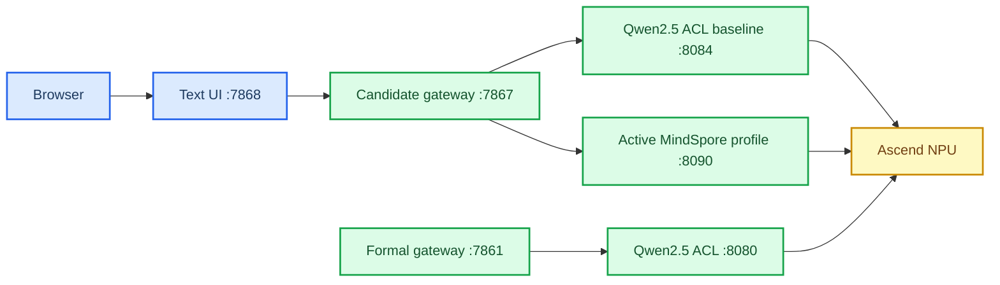

# 案例 9：Ascend 310B 中文文本聊天

_Qwen2.5 静态 KV ACL 是现有正式基线；Qwen1.5、TinyLlama 和 DeepSeek 是已有的 MindSpore 候选，新一轮还登记 Qwen2.5、Qwen3 和 20T 专用 MiniCPM3 候选。Qwen1.5 的 8T 历史报表为 9/9，因历史 health/snapshot 缺少 `npu_model` 按 8/9 记录；当前地址 G0 已补齐但严格 placement 仍失败，B4 保持 `blocked`；20T `.95` 缺口批次通过 9/9 机器门并保持 `experimental_dirty_base`。8T 随后出现重复 `DRV_LPM_FAULT 0x80E3A203`，恢复 worker 仅完成缩小烟测。TinyLlama 在 8T 的长输出/机器质量门失败，20T 缺口批次执行后为 8/9，32/48 token 长输出出现 UTF-8 错误，继续 `blocked`。DeepSeek 已在 20T `.95` 完成原有 API 机器门，并在 8T 历史 `.90` 地址的缺口批次通过 9/9 机器门；两板中文人工质量和正式准入仍未完成。8T 当前地址为 `192.168.1.90`（`.11.14` 与 `.178` 为同一块板的历史别名）；20T 当前地址为 `192.168.1.95`，`.210` 仅为历史请求地址；音频、ASR/TTS 和 XiaoZhi 暂停。_

---

## 📋 当前状态

此案例提供一个原生 ACL/OM 的 OpenAI Chat Completions 上游、一个 Bearer 保护的
case9 网关，以及一个仅在可信局域网使用的文字页面。当前只测试文本。正式 ACL/OM
运行时不依赖或导入 Torch、Torch-NPU、Torchaudio、Transformers、ONNX Runtime、
vLLM 或 MindIE；新增的 MindSpore 候选明确使用开发板现有 `base` 环境，适配代码只
允许导入 MindSpore/MindNLP，并始终标记为 `dirty-base` 实验，不会自动提升为正式模型。

| 板卡 | SoC | 当前状态 |
| --- | --- | --- |
| `192.168.1.90`（历史别名 `.11.14`、`.178`） | Ascend310B4 / 8T | Qwen2.5 当前身份只读复核通过（identity-only）；完整 ACL/API/长输出/稳定性机器门和历史性能保留；MindSpore Qwen 历史报表 9/9，当前 G0 环境/SoC/工件复核已补齐但 Qwen1.5 严格 placement 仍失败，B4 保持 `blocked`；重启/恢复小批次和切换冒烟均有报告；DeepSeek 缺口批次 9/9 机器门、10 轮稳定性和 2+30 性能通过（总耗时 p50/p95 `3938.489/4008.768 ms`，吞吐 p50/p95 `0.510/0.517 token/s`）；候选链文件已同步并逐文件 SHA-256 校验；另有重复 LPM fault 诊断，IP 变化不重复运行 |
| `192.168.11.14` | 同一块 8T 板的历史地址 | 仅用于历史报告 provenance，不作为当前连接入口 |
| `192.168.8.178` | 同一块 8T 板的旧地址 | 仅 provenance，不再作为连接入口 |
| `192.168.8.210`（历史请求地址） | Ascend310B1 / 20T | Qwen2.5 历史批次机器门通过；不再作为当前连接入口 |
| `192.168.1.95`（当前 20T） | Ascend310B1 / 20T | DeepSeek 固定 FP16 工件、MindSpore/Ascend smoke、两次临时 API 9/9 机器门和完整 2+30 SSE 已记录；Qwen1.5 缺口批次 9/9 机器门、10 轮稳定性和 2+30 性能通过（总耗时 p50/p95 `1329.830/1440.076 ms`，吞吐 p50/p95 `1.505/1.619 token/s`）；TinyLlama 缺口批次 8/9，长输出 32/48 token UTF-8 失败，中文机器质量 7/10；共享 `base` 为 dirty-base，候选质量和正式链仍 blocked |

### 模型分层

| 层级 | 模型/Profile | 入口 | 结论 |
| --- | --- | --- | --- |
| 现有正式基线 | Qwen2.5-0.5B-Instruct 静态 KV ACL | `8080 -> 7861 -> 7865` | 沿用已记录的 B4/B1 工件和门禁；本轮不替换 |
| MindSpore 候选 | `qwen1.5-0.5b-mindspore` | `7868 -> 7867 -> 8090` | 8T 当前 `blocked`（历史身份门按 8/9；当前 G0 已补齐但严格 placement 失败）；20T 缺口批次 9/9、`experimental_dirty_base`（总耗时 p50/p95 `1329.830/1440.076 ms`，吞吐 p50/p95 `1.505/1.619 token/s`）；重启 d/e、post-mask n 与 LPM 恢复小批次通过；人工质量/准入待签字 |
| MindSpore 候选 | `tinyllama-1.1b-mindspore` | `7868 -> 7867 -> 8090` | `blocked`；8T b 批次 8/9；20T 缺口批次 8/9，32/48 token 长输出含 `U+FFFD`、中文机器质量 7/10，CLI 禁止激活 |
| MindSpore 候选 | `deepseek-r1-qwen-1.5b-mindspore` | `.90` 8T（历史报告地址 `.11.14`/`.178`）缺口批次 9/9（总耗时 p50/p95 `3938.489/4008.768 ms`，吞吐 p50/p95 `0.510/0.517 token/s`）；人工质量待审 | `.95` 20T 隔离 API 机器门通过；中文质量、正式网关/UI 和 dirty-base 准入未完成，保持 `blocked` |
| MindSpore 新候选 | `qwen2.5-0.5b-mindspore`、`qwen2.5-1.5b-mindspore` | `7868 -> 7867 -> 8090` | 0.5B 8T `blocked`：当前地址 context-only 诊断加载 `48.65 s`、生成 2 token 用时 `15.23 s`，但严格 placement 证据缺失。1.5B 8T `blocked`：七个文件已同步校验；重启后的正确 CANN 诊断在生成阶段 `Alloc failed, size:481482240`，NPU 峰值约 `14993/15610 MB`。两者 20T 均为 `not-run`。首轮 SIGSEGV 是 PYTHONPATH 污染历史证据；placement/API/长输出/稳定性/质量/性能仍未运行。详见 [0.5B 当前地址记录](docs/39-qwen25-05b-context-only-20260904.md) 和 [1.5B 内存门记录](docs/37-qwen25-1.5b-8t-memory-gate-20260904.md)。 |
| MindSpore 新候选 | `qwen3-0.6b-mindspore`、`qwen3-1.7b-mindspore` | `7868 -> 7867 -> 8090` | 8T `blocked`：MindNLP 0.4.1 没有 Qwen3 loader；20T `not-run`。不升级环境，兼容性分支需单独批准 |
| MindSpore 新候选 | `minicpm3-4b-mindspore` | `7868 -> 7867 -> 8090` | 8T `not-run`；仅官方 20T/24G Modelers FP16 路线，20T 当前未执行；不移植到 8T |

Qwen1.5/TinyLlama 的逐项原始响应、错误边界和性能文件见
[MindSpore 聊天验收记录](docs/24-mindspore-chat-validation-record.md)；这些机器门结果不等于
人工质量签字，也不会改变正式 `8080 -> 7861 -> 7865` 入口。DeepSeek 的 20T 隔离模型、
环境、API 机器门和性能原始文件见 [20T 验证记录](docs/26-deepseek-20t-validation-20260830.md)。
本轮 Qwen1.5/20T、TinyLlama/20T 和 DeepSeek/8T 的历史缺口报告仍位于
  `repro/case9-dual-board-gap-20260830/`；该包 `197/197` 文件哈希校验通过。Qwen2.5
当前 8T 地址的环境、工件和严格 placement 诊断报告位于
`repro/mindspore-chat-20260904/reports/board8t/`，不能与历史缺口包混为同一批次。TinyLlama/20T
的机器门已失败，不能因有性能数据而解除 `blocked`；Qwen2.5/.95 因当前工件缺失保持 `blocked`。

TinyLlama 的预编译 OM、匹配 tokenizer 和 MindSpore 源权重已发布到
[`zhouxzh/ascend310b-llm-om-zoo`](https://huggingface.co/zhouxzh/ascend310b-llm-om-zoo)，
但只标记为 `experimental_historical_artifact`。发布说明保留了完整字节数和 SHA-256，
并明确记录中文质量 `7/10`、`max_tokens=32/48` 的 `U+FFFD` 长输出失败、缺少当前
CANN8.0 ATC 证据以及资源增长风险；它不能作为正式中文聊天或 XiaoZhi 后端。详见
[TinyLlama Hugging Face 发布记录](docs/29-tinyllama-huggingface-publication.md)。

MindSpore 候选链和旧 Qwen2.5 ACL 候选链不能同时占用相同的 `7867/7868` 端口。旧
`7868 -> 7867 -> 8084` 链只作为 Qwen2.5 历史隔离证据；执行 Profile 试验时使用
`7868 -> 7867 -> 8090`，每次只允许一个活动模型。

历史 MindSpore 批次使用过 8/16/24/32/48/64/80 长输出、10 轮稳定性和 2+30 性能测量；当前候选新批次只使用 8/16/32/64。缺口批次目前
已完成 Qwen1.5/20T 与 DeepSeek/8T 的 8/16/24/32/48/64 长输出和机器门；TinyLlama/20T
已完成同一批次但 32/48 token UTF-8 检查失败；8T 的
usageperf p50 为 8693.731 ms、历史 Qwen2.5 20T 为 6486.422 ms；该历史 20T
dirty-base 结果相对旧基线改善约 16.32%，未达到 20% 正式提升门。DeepSeek 使用独立
模型和协议，`.95` 临时 API 的 2+30 SSE p50 为 2489.698 ms、吞吐 p50 为
0.805 token/s；`.90` 缺口批次的 p50 为 3938.489 ms、吞吐 p50 为 0.510 token/s。
这些数字不与 Qwen2.5 或不同模型直接合并排名；TinyLlama 的性能仅作失败批次记录。
正式 `8080 -> 7861 -> 7865` 入口保持不变。

候选模型的完整研究清单（当前注册表共 23 个 Profile，其中 15 个为仅登记条件候选）、条件候选和证据等级见
[MindSpore LLM 候选模型清单](docs/31-mindspore-llm-candidate-inventory.md)；逐板执行
顺序和门禁见 [双板验收计划](docs/32-mindspore-llm-candidate-validation-plan.md)，
实测结果追加到 [验收记录](docs/33-mindspore-llm-candidate-validation-record.md)。
当前 8T 的严格复测入口、账本和来源登记分别见
[严格测试计划](docs/40-8t-mindspore-llm-strict-test-plan.md)、
[严格验证记录](docs/41-8t-mindspore-llm-strict-validation-record.md) 和
[候选检索记录](docs/42-mindspore-candidate-search-record.md)。
候选 UI 会列出 `passed`、`blocked` 和 `not-run`，但只有技术门通过的
`experimental_dirty_base` Profile 才允许显式实验切换。

本轮新增事实：Qwen2.5-0.5B 在当前 8T 地址完成了固定工件的 context-only loader 诊断，
但严格 placement 证据不足，注册表保持 `blocked`；Qwen3 在 MindNLP 0.4.1 中没有
loader，8T 同样保持 `blocked`。Qwen2.5-1.5B 已在 8T 完成七个文件的同步与 SHA-256
核验；正确 CANN v2/v3b/v4 曾加载模型并生成短文本，但重启后的正确 CANN 复测在生成
阶段因 `Alloc failed, size:481482240` 失败，placement/API/质量/性能仍为 `not-run`，该板保持
`blocked`。首轮 SIGSEGV 只作为 PYTHONPATH 污染历史证据；20T
新批次和 MiniCPM3 仍为 `not-run`。详见
[Qwen2.5 诊断记录](docs/34-qwen25-0.5b-mindspore-8t-loader-smoke-20260903.md)、
[1.5B 预检记录](docs/36-qwen25-1.5b-8t-preflight-20260904.md)和
[1.5B 内存门记录](docs/37-qwen25-1.5b-8t-memory-gate-20260904.md)。

> **⚠️ 矩阵占位不是支持声明：** 注册表为双板 UI 对齐保留 MiniCPM3/4/5 的
> `Ascend310B4` `not-run`/`blocked` 行。它们不代表 8T 可以运行；MiniCPM3 只在
> 20T/B1 规划后续预检，MiniCPM4/5 为条件候选且两块板都禁止切换。

## 🧭 候选架构



旧 Qwen2.5 隔离链为 `7868 -> 7867 -> 8084`；MindSpore Profile 候选链为
`7868 -> 7867 -> 8090`。二者是互斥的候选后端，不能并行启动在同一端口。正式
`7865 -> 7861 -> 8080` 保持不变，直到候选 Profile 完整门禁和独立复核都通过。ACL
和 MindSpore 服务只监听 loopback；网关 token 不会发送给浏览器。文字页面没有浏览器
鉴权，只能在可信实验网使用。

## 🧰 本地检查

控制机的 `sci-agent` 环境可以运行纯 Python、ONNX 和前端检查，但不能运行 CANN、ACL、
ATC、OM 或 `npu-smi`：

```powershell
$python = 'C:\Users\zhoux\anaconda3\envs\sci-agent\python.exe'
& $python -m py_compile qwen25_kv_acl_runtime.py qwen25_kv_acl_service.py scripts\serve_qwen25_kv_acl.py
& $python -m py_compile case9_model_profiles.py mindspore_chat_service.py mindspore_chat_providers.py
& $python -m pytest -q

Set-Location frontend
npm ci
npm test
npm run build
Set-Location ..

git diff --check
```

前端构建只在控制机执行；本地音频 UI 可由板端托管生成后的 `frontend/dist`，而当前
MindSpore 候选文字 UI 由 `text_chat_app.py` 返回内嵌 HTML。两条路径都不在板端安装
Node.js。

MindSpore 候选的 provider 依赖板端已有 `base` 环境，不在控制机检查命令中安装或
复制板端运行时。控制机的 Torch 仅可用于外部参考/导出，不得进入板端候选服务的
`PYTHONPATH`。

## 🔐 板端候选启动

先在目标板 SSH 会话中显式激活环境并执行工件/descriptor 门禁。示例是 8T；20T 应改为
`Ascend310B1`、B1 OM/contract/lock，并且其 dirty-base 仅是实验标签。

当前 8T 候选部署根是 `~/case9-qwen25-kv1024`；20T 使用独立的
`~/case9-qwen25-kv1024-20t`。完整验收批次的旧目录只作为报告 provenance，不能
直接替代当前候选根。

```bash
cd ~/case9-qwen25-kv1024
source /usr/local/miniconda3/etc/profile.d/conda.sh
conda activate case9-acl-om
source /usr/local/Ascend/ascend-toolkit/set_env.sh
# The ACL/OM environment is intentionally isolated from the board's user site.
export PYTHONNOUSERSITE=1
export CASE9_QWEN25_KV_ROOT="$PWD"
export CASE9_QWEN25_KV_BOARD_ID="192.168.1.90"  # 同一块板的历史地址为 192.168.11.14 / 192.168.8.178
export CASE9_QWEN25_KV_SOC_VERSION="Ascend310B4"
export CASE9_QWEN25_KV_OUTPUT_ROOT="$PWD/reports/$(date -u +%Y%m%dT%H%M%SZ)"
export PYTHONPATH="$PWD${PYTHONPATH:+:$PYTHONPATH}"

bash scripts/provision_qwen25_kv102_board.sh check
bash scripts/provision_qwen25_kv102_board.sh inspect
bash scripts/provision_qwen25_kv102_board.sh smoke
```

只在 smoke 通过后启动候选 ACL 服务：

```bash
export QWEN25_ROOT="$PWD"
export QWEN25_KV_OM="$PWD/artifacts/qwen25-static-kv-1024-v2.om"
export QWEN25_KV_CONTRACT="$PWD/contracts/qwen25-static-kv-1024-v2-om-contract.json"
export QWEN25_KV_TOKENIZER="$PWD/artifacts/tokenizer.json"
export QWEN25_KV_TOKENIZER_CONFIG="$PWD/artifacts/tokenizer_config.json"
export QWEN25_KV_LOCK="$QWEN25_KV_OM.lock.json"
export QWEN25_KV_TOKENIZER_LOCK="$QWEN25_KV_TOKENIZER.lock.json"
export QWEN25_KV_MAX_TOKENS=80
bash scripts/run_qwen25_kv_acl_service.sh
```

另开 shell 进行最小 API 检查：

```bash
curl -fsS http://127.0.0.1:8084/health
curl -fsS http://127.0.0.1:8084/v1/models
```

候选 ACL、JSON/SSE、长输出和资源门通过后，才可设置板端 `GATEWAY_API_KEY` 并启动：

```bash
export GATEWAY_API_KEY="$(openssl rand -hex 24)"
bash scripts/run_qwen25_kv102_gateway.sh
bash scripts/run_qwen25_kv102_text_chat.sh
```

此过程不改写 `.env`，不触碰正式端口，也不自动切换任何后端。

### MindSpore Profile 候选

候选服务使用开发板现有 `base` 环境，且必须先记录完整包清单、MindSpore/MindNLP
版本、CANN 和 `npu-smi` 快照。切换由板端 CLI 管理；浏览器只读显示活动 Profile：

```bash
cd ~/case9-mindspore-chat
source /usr/local/miniconda3/etc/profile.d/conda.sh
conda activate base
source /usr/local/Ascend/ascend-toolkit/set_env.sh
bash scripts/case9-modelctl.sh list
bash scripts/case9-modelctl.sh status
CASE9_ALLOW_EXPERIMENTAL=1 bash scripts/case9-modelctl.sh switch qwen1.5-0.5b-mindspore
```

服务健康后，再启动候选网关和文字页面：

```bash
export UPSTREAM_BASE_URL=http://127.0.0.1:8090/v1
export UPSTREAM_MODEL=case9-active
export RAG_ENABLED=false
export MAX_CONCURRENT_REQUESTS=1
export PUBLIC_MODEL_ID=case9-rag
bash scripts/run_mindspore_chat_gateway.sh
bash scripts/run_mindspore_chat_text.sh
```

Profile 服务约束为 context 1024、`max_tokens <= 64`、`temperature=0`、`top_p=1`、
batch 1、单请求串行，并支持 JSON/SSE。切换失败时 CLI 只回滚到上一个已验证 Profile；
不修改 `8080/7861/7865`，不自动使用 CPU、云端、Torch、vLLM 或 MindIE。

## 📦 复现包

本轮 MindSpore 聊天候选的本地忽略复现包是：

```text
repro/mindspore-chat-20260829/
```

截至同步批次 `mindspore-chat-final-20260830e`，该包包含 392 个已校验清单条目（目录中
另有 `bundle-manifest.json` 和 `SHA256SUMS.txt`），其中当前 allowlist 管理 124 个源码快照、
170 个 8T 板端条目，另保留 98 个历史条目；包含 Qwen1.5/TinyLlama 权重、tokenizer、注册表、服务脚本、环境快照和 `.90`
的原始验收报告。新增的 `qwen-post-mask-20260829n` 是部署注意力掩码/greedy 参数补丁
后的缩小复核；`qwen-lpm-recovery-20260829r` 记录 LPM fault 后的受控恢复、候选链和
NPU 诊断（可执行机器门全部通过，但不代表硬件稳定）。两者都不能替代完整验收批次。
`bundle-manifest.json` 与 `SHA256SUMS.txt` 记录每个文件的大小和 SHA-256。
DeepSeek 已在当前可达的 20T 地址 `.95` 完成独立复现包同步；旧 `.210` 仅保留为历史请求地址。
Qwen1.5/20T、TinyLlama/20T 与 DeepSeek/8T 的本轮缺口原始报告已同步到
`repro/case9-dual-board-gap-20260830/`；TinyLlama/20T 报告为 8/9 机器门失败，保持 `blocked`。
同步使用显式 allowlist，并遵循 `.part -> size -> SHA-256 ->` 原子改名：

```bash
bash scripts/sync_mindspore_chat_repro_bundle.sh \
  --board8-host 192.168.1.90 \
  --board20-host 192.168.1.95 \
  --remote-root /home/HwHiAiUser/case9-mindspore-chat
```

仅修改同一块板的 IP 时沿用 `.178` 的报告 provenance，不需要重复测试；若确实更换
硬件或运行环境，仍必须重新执行 CANN/ACL、descriptor、smoke、API 和完整门禁。相同
哈希不会让另一块新板自动继承正式状态。

旧 Qwen2.5 schema 3 清单及其 `20260829T012933Z` 批次仍在历史包中；其中 `.90` 的
候选链 7 个明确日志/响应文件已逐文件校验。板端并不存在可供声称的
`20260827T130500Z-chain/` 目录；该历史文件统一位于旧包的
`reports/board8t/candidate/`。旧同步包中的 `.210` 原始文件仍 pending；新的 DeepSeek
文件位于 `repro/deepseek-r1-20t-20260830/`，不会覆盖旧包。

## 🧪 完整验收

候选服务已启动后运行：

```bash
bash scripts/run_qwen25_dual_board_acceptance.sh --board 8t \
  --board8-root /home/HwHiAiUser/case9-qwen25-kv1024

bash scripts/run_qwen25_dual_board_acceptance.sh --board 20t \
  --board20-root /home/HwHiAiUser/case9-qwen25-kv1024-20t \
  --board20-om-rel artifacts/qwen25-static-kv-1024-b1.om \
  --board20-lock-rel artifacts/qwen25-static-kv-1024-b1.om.lock.json \
  --board20-contract-rel contracts/qwen25-static-kv-1024-b1-om-contract.json
```

MindSpore 候选的新批次要求长输出 8/16/32/64 token、10 轮稳定性、10 条中文探测（机器检查与工程定性复核）、JSON/SSE/错误边界、
候选网关/UI 以及 2+30 性能测量。任一门失败都保留报告并停在候选状态，不改用 CPU、
云端或其他模型。

## 🔗 文档

- [当前运行手册](docs/00-case9-current-runbook.md)
- [双板验证记录](docs/01-qwen25-dual-board-validation.md)
- [复现包与同步](docs/02-qwen25-reproducibility-and-sync.md)
- [历史结果与边界](docs/03-case9-history-and-boundaries.md)
- [MindSpore 聊天移植计划](docs/23-mindspore-chat-porting-plan.md)
- [MindSpore 聊天验收记录](docs/24-mindspore-chat-validation-record.md)
- [TinyLlama Hugging Face 发布记录](docs/29-tinyllama-huggingface-publication.md)
- [Orange Pi MindSpore Online 示例盘点](docs/30-orange-pi-mindspore-online-inventory.md)
- [MindSpore LLM 候选模型清单](docs/31-mindspore-llm-candidate-inventory.md)
- [MindSpore LLM 候选双板验收计划](docs/32-mindspore-llm-candidate-validation-plan.md)
- [MindSpore LLM 候选验收记录](docs/33-mindspore-llm-candidate-validation-record.md)
- [MindNLP loader 能力记录](docs/38-mindnlp-loader-capability-20260904.md)
- [Qwen2.5-0.5B 当前地址诊断记录](docs/39-qwen25-05b-context-only-20260904.md)
- [Qwen3 loader 兼容性记录](docs/35-qwen3-loader-compatibility-check-20260903.md)
- [Qwen2.5-1.5B 8T 预检记录](docs/36-qwen25-1.5b-8t-preflight-20260904.md)
- [Qwen2.5-1.5B 8T 内存门失败记录](docs/37-qwen25-1.5b-8t-memory-gate-20260904.md)
- [8T MindSpore LLM 严格测试计划](docs/40-8t-mindspore-llm-strict-test-plan.md)
- [8T MindSpore LLM 严格验证记录](docs/41-8t-mindspore-llm-strict-validation-record.md)
- [MindSpore 候选搜索记录](docs/42-mindspore-candidate-search-record.md)
- [聊天模型 Profile 运行手册](docs/25-chat-model-profile-runbook.md)
- [双板缺口补测计划](docs/27-case9-dual-board-gap-completion-plan.md)
- [双板缺口验证记录](docs/28-case9-dual-board-gap-validation-record.md)
- [中文复现教程](../../src/experiment/case9.md)
- [历史报告归档](docs/archive/20260827/README.md)

[^1]: Qwen Team. "Qwen2.5-0.5B-Instruct model card." https://huggingface.co/Qwen/Qwen2.5-0.5B-Instruct
[^2]: Huawei Ascend. "Ascend CANN documentation." https://www.hiascend.com/document
