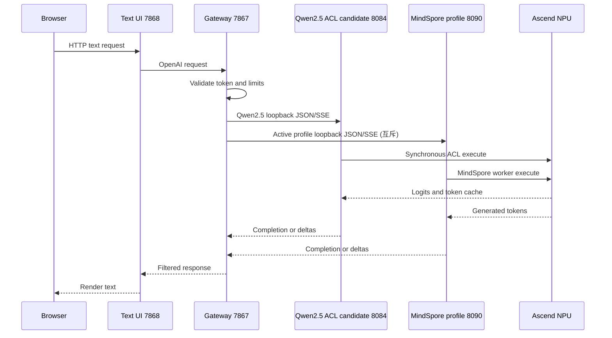

# Case9 当前运行手册：Qwen2.5 ACL 基线与 MindSpore 候选链

_更新日期：2026-09-06。当前 8T 开发板地址为 `192.168.1.90`；`192.168.11.14` 与 `192.168.8.178` 是同一块 Ascend310B4/8T 板的历史地址，仅保留为报告 provenance，因此沿用已完成的实测证据。20T DeepSeek 隔离实验使用实际地址 `192.168.1.95`，旧请求地址 `192.168.8.210` 仅保留为历史 provenance。音频、ASR/TTS 与 XiaoZhi 仍暂停。_

---

## 当前状态

Qwen2.5-0.5B-Instruct 静态 KV 图是现有 ACL/NPU 基线，每块板使用自己的 OM，由原生
ACL 执行。MindSpore 聊天 Profile 是新增的 dirty-base 实验链，使用单一活动 worker，
不能视为正式模型。旧 Qwen2.5 隔离证据链为 `7868 -> 7867 -> 8084`；MindSpore 候选
使用 `7868 -> 7867 -> 8090`，两者互斥。正式入口 `8080 -> 7861 -> 7865` 保持原状，
不因地址变化或候选启动自动切换。

> **当前设备暂停：** 2026-09-04 重启后的只读跟进快照显示 `.11.14` 仍周期性报告
> `DRV_LPM_FAULT 0x80E3A203`；Qwen2.5-1.5B 诊断期间 NPU 峰值约 `14993/15610 MB`，
> 进程退出后的快照回落到 `3005/15610 MB`，且没有 Case9 端口监听。
> 这不是单独的 `Health: Alarm` 失败门，但在设备恢复前不得追加 1.5B/长压测或启动候选
> worker；内存失败、快照和哈希见验收记录 [§7.11](33-mindspore-llm-candidate-validation-record.md)。

> **2026-09-06 重启复核：** 同一块 `.90` 短暂可达，仍为 `Ascend310B4`，无 Case9
> 进程或端口，`npu-smi` 显示 `2348/15610 MB`；内核继续出现
> `DRV_LPM_FAULT 0x80E3A203`/`reset_core_mk`，随后 SSH 再次超时。完整输出和证据边界见
> [8T 严格验证记录](41-8t-mindspore-llm-strict-validation-record.md)。

> **当前环境门：** 在同一重启窗口按严格前缀执行 G0 时，`PYTHONNOUSERSITE=1` 下
> `mindnlp` 不可导入，MindSpore 为 `2.4.0`，并报告与 Ascend 软件包 `7.6` 不匹配；
> 该检查已以退出码 `2` 保存到板端 `strict-g0/resume-g0-20260906T012557Z/`，
> `environment.json` SHA-256 为
> `05448e0f2fb89a4a7e25ce74dd1a365056795570dc68b6d62a2b3f5fd2093013`。
> 在不获批准安装/升级包前，MindSpore worker 不得启动。

| 标识 | 芯片与环境 | 证据 | 当前判定 |
| --- | --- | --- | --- |
| `192.168.1.90`（历史地址 `.11.14`；原采集地址 `.178`） | Ascend310B4 / 8T；`case9-acl-om`；CANN 8.0.0 | 本地已校验完整批次 `20260827T113500Z`、usageperf `20260827T124500Z`；MindSpore Qwen 历史批次、重启小批次和切换冒烟也已留证；候选日志/响应文件已本地 SHA-256 校验 | 同一板 IP 变更；ACL 工件/API/长输出/稳定性和机器协议门已通过；MindSpore Qwen 历史报表为 9/9，`.90` 地址的 G0 环境/SoC/工件复核已补齐，但严格 placement 诊断仍失败，B4 候选保持 `blocked`；B4 相对旧 8082 p50 基线改善约 21.96%；中文工程定性复核约 9/10 可理解，正式人工签字未完成且含硬件事实错误 |
| `192.168.8.178` | 同一块 Ascend310B4 / 8T 的历史采集地址 | 上述报告的 provenance 地址 | 不再作为连接入口；报告仍不可改写 |
| `192.168.8.210`（历史地址） | Ascend310B1 / 20T；CANN 8.0.0；`base + base-overlay` | Qwen2.5 历史完整批次和 usageperf provenance | 历史 Qwen2.5 机器门及 16.32% 结果仍有效；该旧地址不作为当前入口。DeepSeek 新实验见下一行 |
| `192.168.1.95`（当前 20T） | Ascend310B1 / 20T；CANN 8.0.0；MindSpore 2.4.10/MindNLP 0.4.1；shared dirty-base | `repro/deepseek-r1-20t-20260830/bundle-manifest.json`；DeepSeek revision `0a28897...`、权重 SHA-256 `706e1bfd...3419c`；Qwen1.5/TinyLlama 缺口报告在 `repro/case9-dual-board-gap-20260830/` | DeepSeek 隔离 smoke、10 轮短稳定性、两次 9/9 API 机器门和 2+30 SSE 性能已记录，中文质量/正式准入保持 `blocked`；Qwen1.5 缺口 9/9 机器门（人工质量待审），TinyLlama 缺口 8/9 且长输出失败；Qwen2.5 新 MindSpore 批次尚未在 20T 执行 |

IP 变化不会改变 SoC、OM、contract、tokenizer 或已记录的进程证据。若更换硬件、
系统、CANN、模型或 OM，必须新建 UTC 批次并重新执行门禁；仅换 IP 不需要伪造一轮
“重新测试”。

### MindSpore Profile 状态

| Profile | 目标板 | 运行方式 | 当前状态 |
| --- | --- | --- | --- |
| `qwen1.5-0.5b-mindspore` | `192.168.1.90` B4/8T（历史报告 `.11.14`/`.178`）；`.95` B1/20T | `base` + MindSpore/MindNLP，服务 `8090` | B4 历史机器门按 `8/9`（health/snapshot 缺少 `npu_model`）；当前 G0 已补齐但严格 placement 仍失败，保持 `blocked`；`.95` 缺口批次 `qwen20-gap-20260830` 为 `9/9`、`experimental_dirty_base`（总耗时 p50/p95 `1329.830/1440.076 ms`，吞吐 p50/p95 `1.505/1.619 token/s`）；人工质量/准入待签字 |
| `tinyllama-1.1b-mindspore` | `192.168.1.90` B4/8T（历史报告 `.11.14`/`.178`）；`.95` B1/20T | 同上，独立缓存和报告 | B4 原批次 `blocked`（8/9）；`.95` 缺口批次 `tiny20-gap-20260830` 为 8/9，32/48 token 长输出含 `U+FFFD`、中文机器质量 7/10；CLI 禁止激活 |
| `deepseek-r1-qwen-1.5b-mindspore` | `192.168.1.90` B4/8T（历史报告 `.11.14`/`.178`）；`.95` B1/20T（`.210` 为旧 alias） | 两板均使用临时/隔离 registry 的 `base` + MindSpore/MindNLP，服务 `8090` | B4 缺口批次 `deepseek-8t-gap-20260830` 为 `9/9`（性能 p50/p95 `3938.489/4008.768 ms`，吞吐 `0.510/0.517 token/s`，人工质量待审）；`.95` API 机器门通过但中文质量和 dirty-base 准入未完成，保持 `blocked` |

Profile 的状态不能继承 Qwen2.5 ACL 证据。共享 `base` 中已有 Torch 等包只记录污染，
适配代码不得导入它们；正式入口仍指向既有 ACL 服务。

当前地址上的新增诊断：Qwen2.5-0.5B 的六个固定工件、CANN 模块和严格 placement
复测已记录；provider 因无显式 Ascend placement metadata 在加载后 fail-closed，状态为
`blocked`，context-only 旁证不能替代严格门，详见 [诊断记录](34-qwen25-0.5b-mindspore-8t-loader-smoke-20260903.md)。
Qwen2.5-1.5B 的七个工件在正确 CANN v4 环境完成加载和两 token context-only 诊断，
但同样未通过 placement 门。Qwen3-0.6B/1.7B 则因 MindNLP `0.4.1` 没有 Qwen3 loader
而在 8T `blocked`。这些结果都不允许通过 `case9-modelctl` 启动。

## 架构与端口



| 用途 | ACL | 网关 | UI | 浏览器地址 |
| --- | --- | --- | --- | --- |
| 候选隔离 | `127.0.0.1:8084` | `127.0.0.1:7867` | `0.0.0.0:7868` | `http://192.168.1.90:7868/`（当前 8T） |
| MindSpore 候选（互斥） | `127.0.0.1:8090` | `127.0.0.1:7867` | `0.0.0.0:7868` | 同上；仅显示活动 Profile |
| 正式入口（未因本轮切换） | `127.0.0.1:8080` | `127.0.0.1:7861` | `0.0.0.0:7865` | `http://192.168.1.90:7865/` |

ACL 只监听 loopback。网关 Bearer token 只在板端环境中保存，UI 没有浏览器鉴权，
因此候选 UI 仅允许可信实验网使用。

## 环境和候选启动

控制机 `sci-agent` 只负责 ONNX 静态检查、CPU 参考、单元测试和前端构建。板端在
同一 shell 中显式激活 CANN；8T 当前地址示例为：

```bash
cd ~/case9-qwen25-kv1024
source /usr/local/miniconda3/etc/profile.d/conda.sh
conda activate case9-acl-om
source /usr/local/Ascend/ascend-toolkit/set_env.sh
# The verified MindSpore/MindNLP wheels are in the board base user site.
# Leave it visible for the chat Profile worker; use PYTHONNOUSERSITE=1 only
# for an explicit negative isolation diagnostic.
unset PYTHONNOUSERSITE
export CASE9_QWEN25_KV_ROOT="$PWD"
export CASE9_QWEN25_KV_BOARD_ID="192.168.1.90"  # same board; historical aliases were 192.168.11.14 / 192.168.8.178
export CASE9_QWEN25_KV_SOC_VERSION="Ascend310B4"
export CASE9_QWEN25_KV_OUTPUT_ROOT="$PWD/reports/$(date -u +%Y%m%dT%H%M%SZ)"
export PYTHONPATH="$PWD${PYTHONPATH:+:$PYTHONPATH}"

bash scripts/provision_qwen25_kv102_board.sh check
bash scripts/provision_qwen25_kv102_board.sh inspect
bash scripts/provision_qwen25_kv102_board.sh smoke
```

通过 smoke 后，显式传入 B4 OM、contract、lock 和 tokenizer，启动候选 ACL 服务：

```bash
export QWEN25_ROOT="$PWD"
export QWEN25_KV_OM="$PWD/artifacts/qwen25-static-kv-1024-v2.om"
export QWEN25_KV_CONTRACT="$PWD/contracts/qwen25-static-kv-1024-v2-om-contract.json"
export QWEN25_KV_TOKENIZER="$PWD/artifacts/tokenizer.json"
export QWEN25_KV_TOKENIZER_CONFIG="$PWD/artifacts/tokenizer_config.json"
export QWEN25_KV_LOCK="$QWEN25_KV_OM.lock.json"
export QWEN25_KV_TOKENIZER_LOCK="$QWEN25_KV_TOKENIZER.lock.json"
export QWEN25_KV_MAX_TOKENS=80
bash scripts/run_qwen25_kv_acl_service.sh
```

20T 必须改用 B1 OM、B1 contract/lock，并设置 `CASE9_QWEN25_KV_ALLOW_DIRTY_BASE=1`；
不得因为输入输出形状相同而静默替换 SoC 工件。候选链通过后才启动网关和 UI：

```bash
export GATEWAY_API_KEY="$(openssl rand -hex 24)"
bash scripts/run_qwen25_kv102_gateway.sh
bash scripts/run_qwen25_kv102_text_chat.sh
```

### MindSpore 候选链

候选 Profile 使用独立目录和板端 `base` 环境。启动前先记录包清单和 CANN 快照，
然后由 CLI 管理单一 worker：

```bash
cd ~/case9-mindspore-chat
source /usr/local/miniconda3/etc/profile.d/conda.sh
conda activate base
source /usr/local/Ascend/ascend-toolkit/set_env.sh
bash scripts/case9-modelctl.sh list
bash scripts/case9-modelctl.sh status
CASE9_ALLOW_EXPERIMENTAL=1 bash scripts/case9-modelctl.sh switch qwen1.5-0.5b-mindspore
```

确认 `http://127.0.0.1:8090/health` 就绪后，才可启动候选网关和文字 UI：

```bash
export UPSTREAM_BASE_URL=http://127.0.0.1:8090/v1
export UPSTREAM_MODEL=case9-active
export RAG_ENABLED=false
export MAX_CONCURRENT_REQUESTS=1
export PUBLIC_MODEL_ID=case9-rag
bash scripts/run_mindspore_chat_gateway.sh
bash scripts/run_mindspore_chat_text.sh
```

Profile 服务限制为 context 1024、`max_tokens <= 64`、greedy、batch 1、单请求串行，
支持 JSON/SSE。浏览器不提供切换 API；切换失败由 CLI 回滚到已验证 Profile，回滚失败
则 fail-closed。该链不修改 8080/7861/7865。

## 验收报告和候选链

完整批次分别保存在：

```text
repro/qwen25-kv1024-dual-board-20260827/reports/full-campaign/board8t/20260827T113500Z/acceptance.json
repro/qwen25-kv1024-dual-board-20260827/reports/full-campaign/board20t/20260827T113500Z/acceptance.json
```

性能计量（2 次预热、30 次测量）使用带 SSE `usage` 的独立报告：

| 板 | 总耗时 p50 / p95 | 首事件 p50 / p95 | token/s p50 | 报告 |
| --- | ---: | ---: | ---: | --- |
| 当前 8T（采集于 `.178`） | `8693.731 / 8707.133 ms` | `8563.591 / 8576.954 ms` | `0.230` | `reports/usage-perf/board8t/20260827T124500Z-usageperf/acceptance.json` |
| 历史 Qwen2.5 20T（采集于 `.210`） | `6486.422 / 6506.085 ms` | `6364.634 / 6383.111 ms` | `0.308` | `reports/usage-perf/board20t/20260827T124500Z-usageperf/acceptance.json` |

DeepSeek 使用独立模型和独立协议，不能并入上表的 Qwen2.5 排名：`context=1024`、显式
`int64` mask、FP16、2 次预热 + 30 次 SSE 测量，临时 API 服务在 20T 的总耗时 p50/p95
为 `2489.698 / 2537.096 ms`，首事件 p50/p95 为 `2483.582 / 2530.960 ms`，吞吐
p50 为 `0.805 token/s`。完整报告为
`repro/deepseek-r1-20t-20260830/reports/board20t/api/deepseek-api-full-20t-20260830T051523Z/`；
重新开放后的复核报告为
`repro/deepseek-r1-20t-20260830/reports/board20t/api/reopen-20260830T0536Z/`（机器门仍为
`9/9`，总耗时 p50/p95 `2484.751 / 2557.242 ms`）。这些都是 isolated candidate
machine evidence，不代表中文质量、正式网关或模型准入。

候选链证据使用同一地址变更前的 provenance；8T 的原始 chain 目录本身不在板端存档，
只保留了明确列出的历史日志/响应文件：

| 板 | 报告目录 | 结果 |
| --- | --- | --- |
| 8T（当前为 `.90`；历史地址 `.11.14`/`.178`） | `reports/board8t/candidate/`（本地 7 个文件） | 未授权请求 401；授权 JSON/SSE、UI 首页和 UI SSE 通过；无重复 delta；文件已逐一 SHA-256 校验。不能声称存在 `20260827T130500Z-chain/` 目录 |
| 历史 Qwen/Tiny 候选链（20T `.210`） | `reports/board20t/20260827T130500Z-chain-retry/`（板端 provenance） | 未授权请求 401；授权 JSON/SSE、UI 首页和 UI SSE 曾通过；使用 dirty-base overlay；不属于 DeepSeek 新实验 |

这些报告证明候选链曾在相应工件和环境下通过，不表示服务当前仍在运行。正式入口
没有因 IP 变化或候选链通过而切换；双板正式判定还受 20T dirty-base 和性能门限制。
在历史 Qwen worker（PID `90531`）上已复核过 `7867 -> 8090`：未授权请求为 `401`，
授权 JSON/SSE 均为 `200`，公开模型保持 `case9-rag`，且无重复 delta。随后历史地址 `.90` 出现
`DRV_LPM_FAULT 0x80E3A203`（LPM 驱动/硬件诊断事件），该 worker 退出；受控恢复后的
worker PID 为 `15897`，恢复小批次和候选 UI/网关链路再次通过机器协议检查，但不代表
硬件稳定性或正式准入。恢复证据和候选进程记录已纳入当前复现包；正式入口状态不变。

截至 `mindspore-chat-final-20260830e` 的复现包同步，清单包含 392 个文件条目（另有
 manifest/checksum 两个索引文件，其中当前 source=124、board8t=170、board20t=0，历史保留=98）；完整批次和
`usageperf` 的四份 JSON 已在本地按 SHA-256 验证。历史地址 `.90` 的受控恢复报告已同步，
当前入口为同一块板的 `.90`；7 个明确列出的
候选日志/响应文件已同步到 `reports/board8t/candidate/` 并完成逐文件校验；原计划的
`20260827T130500Z-chain/` 目录不应声称存在。旧同步包中的 `.210` 不可达只描述历史
采集批次；当前 `.95` 可达，但 Qwen2.5 工件缺失的身份报告为 `blocked`。新的 DeepSeek
复现包已在 `.95` 单独保存，Qwen1.5/TinyLlama/DeepSeek 的本轮缺口报告则位于
`repro/case9-dual-board-gap-20260830/`，分别保留通过和失败门禁。本次同步包含板端
MindSpore worker 的环境、artifact、重启和切换证据；IP 变化本身仍未被虚构为一轮新的
硬件性能测试。当前 `.90` 地址对 TinyLlama/DeepSeek 的只读 G0/G1 复核（无模型
加载或服务启动）及其哈希见 [验收记录 §7.4](33-mindspore-llm-candidate-validation-record.md)。

## MindSpore 候选模型入口

候选模型的完整清单、证据分级和条件候选见
[MindSpore LLM 候选模型清单](31-mindspore-llm-candidate-inventory.md)。执行顺序、逐板
验收门和禁止依赖见
[MindSpore LLM 候选模型双板验收计划](32-mindspore-llm-candidate-validation-plan.md)；
每次实测应追加到 [验收记录](33-mindspore-llm-candidate-validation-record.md)。

当前有正式候选输出的仍是 Qwen1.5、TinyLlama 和 DeepSeek；Qwen2.5-0.5B 仅有
8T context-only 诊断，因严格 placement 证据不足保持 `blocked`。Qwen3 在当前
MindNLP `0.4.1` 中没有 loader，8T 两个 Profile 也保持 `blocked`。Qwen2.5-1.5B
的七个文件已同步并通过 SHA-256；正确保留 CANN 路径的 v2/v3b/v4 诊断已加载模型并
生成短文本，但 placement、API、长输出、稳定性、质量和性能仍为 `not-run`，因此
该板继续 `blocked`（详见 [1.5B 内存门记录](37-qwen25-1.5b-8t-memory-gate-20260904.md)，
其中首轮 SIGSEGV 只作为 PYTHONPATH 污染的历史证据；配置级预检见
[1.5B 预检记录](36-qwen25-1.5b-8t-preflight-20260904.md)）。20T 新批次
和 MiniCPM3 仍为 `not-run`。候选 UI 可以展示这些状态，但只有技术门通过
且显式允许实验的 Profile 才能由 `case9-modelctl` 启动；正式 `8080 -> 7861 -> 7865`
不改变。

## API 快速检查

```bash
curl -fsS http://127.0.0.1:8084/health
curl -fsS http://127.0.0.1:8084/v1/models
curl -fsS -H 'Content-Type: application/json' \
  -d '{"model":"qwen2.5-0.5b-instruct-static-kv-1024-fp32-acl-om","messages":[{"role":"user","content":"你好"}],"stream":false,"max_tokens":2,"temperature":0,"top_p":1}' \
  http://127.0.0.1:8084/v1/chat/completions
```

固定输入只接受 `system`、`user`、`assistant`；`temperature=0`、`top_p=1`；超过
上下文或 64 token 直接返回错误。SSE delta 是相对新增文本，不重复累计前缀。
模型尚未完成 ACL 初始化、或 watchdog/清理失败后进入不健康状态时，`/v1/models`
返回 `503 model_unavailable`，不会把未就绪的 OM 广告为可用。

MindSpore 候选服务的直接检查：

```bash
curl -fsS http://127.0.0.1:8090/health
curl -fsS http://127.0.0.1:8090/v1/models
curl -fsS http://127.0.0.1:8090/v1/chat/completions \
  -H 'Content-Type: application/json' \
  -d '{"model":"case9-active","messages":[{"role":"user","content":"你好"}],"stream":false,"max_tokens":2,"temperature":0,"top_p":1}'
```

Qwen1.5 的 `.90` 历史 b 批次报表为 9/9，但缺少 health 的 `npu_model` 身份字段，当前地址 `.90` 的 G0 已补齐，严格 placement 仍失败，B4 保持 `blocked`；`.95` 缺口批次完成 9/9 机器门（包括 errors/protocol）；
TinyLlama 的两板批次均保持 `blocked`，其中 `.95` 缺口为 8/9 且长输出和机器质量门失败。
DeepSeek `.90` 缺口为 9/9 机器门，`.95` 仍是中文质量/dirty-base `blocked`。所有候选
仍需人工质量与准入签字。
上述命令的响应只能写入对应 Profile 报告，不得改写正式 ACL 结果。服务端应拒绝非法角色、
非零 temperature、超上下文、超过 64 token 或超大请求体。

## 停止和回滚

- 只停止本批次报告中记录且命令行匹配的 PID；不要使用宽泛的 `pkill python`。
- 先保存 health、服务日志、lock、descriptor 和 `npu-smi` before/during/after 快照。
- 失败时停留在候选状态；不把 CPU、云端、Torch、vLLM 或其他未经审核模型作为回退。
  MindSpore 只允许通过本手册登记的 Profile CLI 启动，不能绕过其独立门禁。
- 不删除系统 CANN、conda 缓存、OM、历史报告或复现包。
- `Health: Alarm` 只作诊断字段；真实 ACL、ATC、进程或资源错误才是独立失败原因。

## 相关文档

- [双板验证记录](01-qwen25-dual-board-validation.md)
- [复现包与同步](02-qwen25-reproducibility-and-sync.md)
- [历史结果与边界](03-case9-history-and-boundaries.md)
- [MindSpore 聊天移植计划](23-mindspore-chat-porting-plan.md)
- [MindSpore 聊天验收记录](24-mindspore-chat-validation-record.md)
- [TinyLlama Hugging Face 发布记录](29-tinyllama-huggingface-publication.md)
- [Orange Pi MindSpore Online 示例盘点](30-orange-pi-mindspore-online-inventory.md)
- [MindSpore LLM 候选模型清单](31-mindspore-llm-candidate-inventory.md)
- [MindSpore LLM 候选双板验收计划](32-mindspore-llm-candidate-validation-plan.md)
- [MindSpore LLM 候选验收记录](33-mindspore-llm-candidate-validation-record.md)
- [Qwen2.5-1.5B 8T 预检记录](36-qwen25-1.5b-8t-preflight-20260904.md)
- [Qwen2.5-1.5B 8T 内存门失败记录](37-qwen25-1.5b-8t-memory-gate-20260904.md)
- [聊天模型 Profile 运行手册](25-chat-model-profile-runbook.md)
- [证据索引](12-case9-evidence-index.md)
- [中文复现教程](../../../src/experiment/case9.md)

[^1]: Qwen Team. "Qwen2.5-0.5B-Instruct model card." https://huggingface.co/Qwen/Qwen2.5-0.5B-Instruct
[^2]: Huawei Ascend. "ATC soc_version 参数说明." https://www.hiascend.com/document/detail/en/canncommercial/800/devaids/atc/atlasatcparam_16_0036.html
