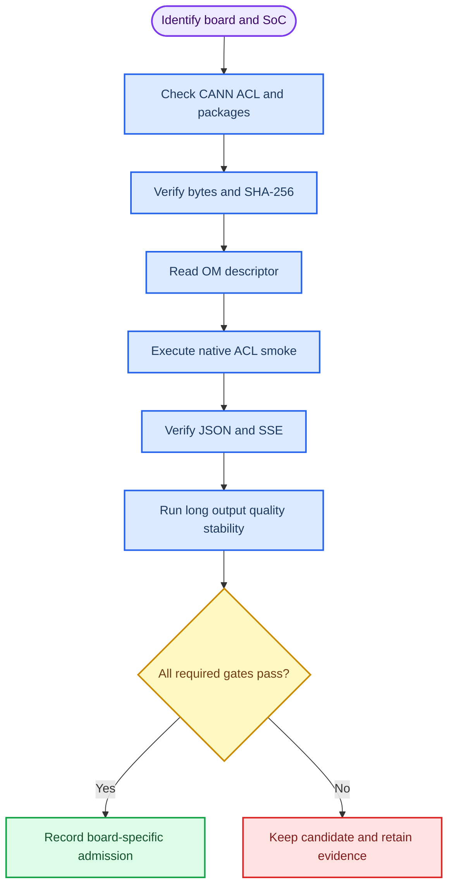

# Qwen2.5 静态 KV 双板验证记录

_更新日期：2026-08-30；8T 的当前地址是 `192.168.1.90`，本轮报告仍保留原采集地址 `192.168.8.178` 作为 provenance。20T 当前地址为 `192.168.1.95`，旧 `.210` 只作历史 provenance；Qwen2.5 当前身份复核为 `.90` `passed`（只读）、`.95` `blocked`（当前无工件），详见[缺口账本](28-case9-dual-board-gap-validation-record.md)。两地址变化未触发性能重跑。_

---

## 📋 记录范围

本轮主线是同一份 Qwen2.5-0.5B-Instruct 静态 KV 1024 ONNX，在两个 Ascend 310B
SoC 上分别使用目标 OM 执行。所有服务均为 batch 1、greedy 解码，候选 ACL 服务只
监听 `127.0.0.1:8084`。`.178` 是 8T 报告采集地址；板卡改用 `.90` 后沿用这些证据，不把地址别名误写成第二块板。

| 板卡 | SoC / 算力 | 环境 | 当前判定 |
| --- | --- | --- | --- |
| `192.168.1.90`（采集时 `192.168.8.178`） | Ascend310B4 / 8T | `case9-acl-om`，Python 3.9.25，CANN 8.0.0 | 完整机器门通过；中文工程定性复核单独记录，正式人工签字未完成；候选证据 7 个明确日志/响应文件已本地 SHA-256 校验；当前入口地址 |
| `192.168.1.95`（历史批次采集于 `192.168.8.210`） | Ascend310B1 / 20T | `base + base-overlay`，Python 3.9.2，CANN 8.0.0 | 历史完整机器门仍有效；当前 Qwen2.5 身份报告为 `blocked`（无当前 ONNX/OM/contract/lock），历史候选链原始文件 pending；dirty-base 实验，不是生产环境 |
| `192.168.8.178` | 同一块 Ascend310B4 / 8T | 历史采集地址 | 只用于报告 provenance，不再作为连接入口 |

两块板的 `npu-smi` 都曾显示 `Health: Alarm`。该字段只作为诊断信息保存，不能单独
阻断或证明任何门禁；ACL 初始化、descriptor、推理、协议和资源证据仍需逐项通过。

## 🧱 工件与 OM 契约

公共 ONNX、tokenizer 和源 checkpoint 的哈希来自复现包；OM 是 SoC 相关的二进制，
因此 B4 与 B1 的字节和哈希不同是预期行为。正式证据必须绑定生成时的
`--soc_version`，不能只根据输入输出形状判断可互换。

| 工件 | bytes | SHA-256 | 绑定 |
| --- | ---: | --- | --- |
| `qwen25-static-kv-1024-v2.onnx` | `1,261,082,122` | `b4870df5da9c8cbef4163ceb65d4dc13433f2fd8ed5d2083ef3223d07d1a3c0e` | B4/B1 共用图 |
| `tokenizer.json` | `7,031,645` | `c0382117ea329cdf097041132f6d735924b697924d6f6fc3945713e96ce87539` | B4/B1 共用 |
| B4 OM | `1,266,010,586` | `f6650e52ff3908288763ef7957832ade606b0e554fa8fde986932f1ca1140eb8` | `Ascend310B4` |
| B1 OM | `1,266,009,438` | `6bca884fbce746efdb02f8c9294cad5b2faa6c8b96cac9ec8c83730126298609` | `Ascend310B1` |
| `model.safetensors` | `988,097,824` | `fdf756fa7fcbe7404d5c60e26bff1a0c8b8aa1f72ced49e7dd0210fe288fb7fe` | 导出 provenance |

两份最新 descriptor contract 都是 51 个输入、49 个输出：3 个基础输入、48 个
split key/value 输入、1 个 logits 输出和 48 个单 token cache 输出。

| 张量组 | dtype | shape | 数量 |
| --- | --- | --- | ---: |
| `input_ids` | `int64` | `[1, 1]` | 1 |
| `attention_mask` | `int64` | `[1, 1024]` | 1 |
| `position_ids` | `int64` | `[1, 1]` | 1 |
| past key/value | `float32` | `[1, 2, 1024, 64]` | 48 |
| logits | `float32` | `[1, 1, 151936]` | 1 |
| token cache | `float32` | `[1, 1, 2, 64]` | 48 |

运行时必须按实际 descriptor 顺序读取 cache，不能使用上游示例中的固定索引。

## 🔁 验证顺序



## 🧪 已完成的批次

短批次 `20260827T112500Z` 与完整批次 `20260827T113500Z` 的 JSON 报告分别保存在：

- `repro/qwen25-kv1024-dual-board-20260827/reports/corrected-smoke/board8t/20260827T112500Z/acceptance.json`
- `repro/qwen25-kv1024-dual-board-20260827/reports/corrected-smoke/board20t/20260827T112500Z/acceptance.json`
- `repro/qwen25-kv1024-dual-board-20260827/reports/full-campaign/board8t/20260827T113500Z/acceptance.json`
- `repro/qwen25-kv1024-dual-board-20260827/reports/full-campaign/board20t/20260827T113500Z/acceptance.json`

完整批次使用长输出 `8/16/24/32/48/64/80`、稳定性 10 轮和性能 2 次预热加 30 次测量。
两板的机器门、协议边界、长输出、稳定性和性能请求均通过；超上下文和超大正文返回
400，SSE 没有重复 delta，客户端中断后 health 仍可用。短批次仅作早期 smoke，不替代
完整批次。

| 指标 | B4 / 8T | B1 / 20T |
| --- | ---: | ---: |
| 长输出结果 | 8/16/24 token 达预算；32/48/64/80 均 31 token 后 stop | 同左 |
| 稳定性轮数 | 10/10 成功 | 10/10 成功 |
| 中文探测条数 | 10，机器有效；工程定性复核约 9/10 可理解，硬件事实回答错误；正式人工签字未完成 | 同左；dirty-base |
| 总耗时 p50 / p95 | `8693.731 / 8707.133 ms` | `6486.422 / 6506.085 ms` |
| 首事件 p50 / p95 | `8563.591 / 8576.954 ms` | `6364.634 / 6383.111 ms` |
| token/s p50 | `0.230` | `0.308` |

两板完整批次均返回 UTF-8 完整文本且无 `U+FFFD`。中文探测的“可理解”与事实正确性
分开记录：`hardware` 探测把 Ascend 310B 错答为 CPU，`capability` 和 `list` 受模型
自然停止/长度边界影响。该结果不能被解读为无条件中文质量通过。

## 🚧 门禁状态

下表以 Qwen2.5 历史完整批次和候选链原始报告为依据；8T 的报告 provenance 地址仍写作
`.178`，当前可连接地址是同一块板的 `.90`。B1 列记录的是旧 `.210` 批次，不代表当前
`.95` 已加载 Qwen2.5；`.95` 当前身份状态见[缺口账本](28-case9-dual-board-gap-validation-record.md)。

| 门 | `.90`（报告采集 `.178`）B4 | `.210` B1（历史） | 证据边界 |
| --- | --- | --- | --- |
| G0 环境、工件、锁 | passed | passed (dirty-base) | 字节、SHA、SoC 和禁止包记录 |
| G1 descriptor、ACL load、smoke | passed | passed | 51/49 descriptor 与真实 execute |
| G2 JSON/SSE | passed | passed | 完整批次和协议边界 |
| G3 长输出 8/16/24/32/48/64/80 | passed | passed | 8/16/24 达预算；>=32 为 31 token stop |
| G4 10 轮资源稳定性 | passed (10/10) | passed (10/10) | 无崩溃或明显 FD 泄漏 |
| G5 10 条中文质量复核 | 工程定性复核约 9/10 可理解，硬件事实错误；正式人工签字 `not-run` | 工程定性复核约 9/10 可理解，dirty-base；正式人工签字 `not-run` | 质量与协议分开；不宣称无条件正确 |
| G6 四种 OM/SoC 组合 | compatibility experiment | compatibility experiment | 见 [跨板记录](22-qwen25-cross-board-om-validation.md) |
| G7 网关 7867、UI 7868 | board-side passed；7 个明确日志/响应文件已同步到 `reports/board8t/candidate/` 并逐一 SHA-256 校验；不声称存在 `20260827T130500Z-chain/` 目录 | board-side passed（`20260827T130500Z-chain-retry` provenance）；旧 `.210` 原始文件仍 pending/unreachable | 401、授权 JSON/SSE/UI、无重复 delta；8T 文件计入本地 129 条目 hash bundle，B1 结果只作历史 provenance |
| G8 2+30 性能与基线改善 | passed；相对旧 8082 p50 约 +21.96% | passed；相对旧基线约 +16.32% | 20T 未达到 20% 正式提升门 |
| 正式提升 `8080 -> 7861 -> 7865` | not admitted | not admitted | 正式入口保持不变 |

`Health: Alarm` 不改变上表判定。20T 的 dirty-base 也不因 ACL/API 通过而变成干净生产
环境；不得删除既有包或安装替代框架来“修复”该状态。

## 📈 完整批次证据索引

完整批次的长输出、稳定性、机器探测和边界报告已生成；带 `usage` 的性能计量位于
`usageperf` 报告。`.90` 板端只保留了明确列出的候选日志/响应文件，已同步到本地
`reports/board8t/candidate/`；原计划的 `20260827T130500Z-chain/` 目录不应声称存在。
`.210` 的 `20260827T130500Z-chain-retry/` 仍只是历史板端 provenance，旧 SSH 采集未同步；
当前 `.95` 可达，但 Qwen2.5 工件缺失，身份报告明确为 `blocked`。复现包最近同步批次为
`20260829T012933Z`，schema 3 共 129 个条目；
完整批次和 `usageperf` 的四份 JSON 均已本地 SHA-256 验证。本轮只补同步证据，没有因
8T IP 变化未重复硬件测试。Qwen1.5/20T、TinyLlama/20T 和 DeepSeek/8T 的新缺口报告
集中在 `repro/case9-dual-board-gap-20260830/`，不改写本 Qwen2.5 历史性能表。

20T 的 dirty-base 和两板性能门仍阻止正式入口提升：正式提升要求每块板都满足环境
边界、质量和性能条件，且相对 8082 基线至少改善 20%；本次 B1 p50 改善约 16.32%。

运行入口：

```bash
bash scripts/run_qwen25_dual_board_acceptance.sh --board 8t \
  --board8-root /home/HwHiAiUser/case9-qwen25-kv1024 \
  --board8-om-rel artifacts/qwen25-static-kv-1024-v2.om \
  --board8-lock-rel artifacts/qwen25-static-kv-1024-v2.om.lock.json \
  --board8-contract-rel contracts/qwen25-static-kv-1024-v2-om-contract.json

bash scripts/run_qwen25_dual_board_acceptance.sh --board 20t \
  --board20-root /home/HwHiAiUser/case9-qwen25-kv1024-20t \
  --board20-om-rel artifacts/qwen25-static-kv-1024-b1.om \
  --board20-lock-rel artifacts/qwen25-static-kv-1024-b1.om.lock.json \
  --board20-contract-rel contracts/qwen25-static-kv-1024-b1-om-contract.json
```

命令不会启动或停止服务；失败时只保留该批次报告并停止在候选状态。原始报告、日志、
PID 和 `npu-smi` 快照应同步到复现包后再更新本表。

## 🧯 回滚规则

- 只停止本批次记录且命令行匹配的 PID。
- 先保存 health、服务日志、OM/contract lock 和 before/during/after 快照。
- 不删除系统 CANN、conda 缓存、其他模型或历史报告。
- 不自动切换 CPU、云端、Torch、MindSpore、vLLM 或其他模型。
- 跨 SoC 成功只记录为 compatibility experiment，不改变目标 SoC 的正式绑定。

## 🔗 相关文档

- [当前运行手册](00-case9-current-runbook.md)
- [复现包与同步](02-qwen25-reproducibility-and-sync.md)
- [历史结果与边界](03-case9-history-and-boundaries.md)
- [证据索引](12-case9-evidence-index.md)
- [双板缺口计划](27-case9-dual-board-gap-completion-plan.md)
- [双板缺口账本](28-case9-dual-board-gap-validation-record.md)
- [双板复现包记录](20-qwen25-kv1024-reproducibility-bundle.md)
- [跨板 OM 实验](22-qwen25-cross-board-om-validation.md)

[^1]: Huawei Ascend. "ATC soc_version 参数说明." https://www.hiascend.com/document/detail/en/canncommercial/800/devaids/atc/atlasatcparam_16_0036.html
[^2]: Qwen Team. "Qwen2.5-0.5B-Instruct model card." https://huggingface.co/Qwen/Qwen2.5-0.5B-Instruct
