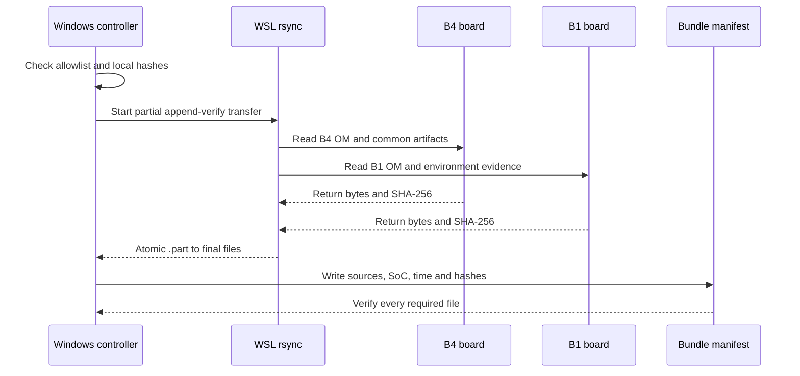

# Qwen2.5 复现包与双板同步

_定义模型、OM、源码和证据的可重复同步边界；本文件不安装依赖，也不自动启动服务。8T 当前地址为 `192.168.1.90`，报告中的 `192.168.8.178` 是同一块板的旧采集地址；20T 当前地址为 `192.168.1.95`，`.210` 仅为历史请求地址。_

---

## 📦 复现包布局

本轮复现包位于被 Git 忽略的目录：

```text
repro/qwen25-kv1024-dual-board-20260827/
├── artifacts/common/          # ONNX、tokenizer 和配置
├── artifacts/om/Ascend310B4/  # B4 OM 与 lock
├── artifacts/om/Ascend310B1/  # B1 OM 与 lock
├── source-model/               # 导出 provenance
├── contracts/                  # 控制机和两板 descriptor
├── environment/                # 当前同步 provenance 与带日期的历史环境快照
├── reports/board8t/            # 8T 原始报告
├── reports/board20t/           # 20T 原始报告
├── source/                     # 运行脚本快照
└── bundle-manifest.json        # 来源、大小、SHA-256、时间
```

`bundle-manifest.json` 和 `SHA256SUMS.txt` 是同步后的索引；模型、OM、日志和运行报告
不提交 Git。短批次报告位于 `reports/corrected-smoke/`，完整门禁报告位于
`reports/full-campaign/`，带 token 计量的性能报告位于 `reports/usage-perf/`。

当前 `bundle-manifest.json` 是 schema 3，记录 `129` 个 allowlist 条目，最近同步批次为
`20260829T012933Z`。`full-campaign` 和 `usage-perf` 的四份 `acceptance.json` 已在本地
验证；`.90` 当前可达，并已按显式 allowlist 同步 7 个候选网关/UI 日志和响应文件，逐文件
完成 SHA-256 校验，存放于 `reports/board8t/candidate/`。板端并不存在可供声称的
`20260827T130500Z-chain/` 目录，因此该名称只可作为“不存在的原计划路径”记录，不能写成
本地报告。旧 `.210` 的候选 raw 文件仍 pending，仅保留历史板端 provenance；这不表示
当前 `.95` 不可达。当前 `.95` 的 Qwen2.5 身份复核已执行，但因找不到 ONNX、OM、contract
或 lock，状态为 `blocked`，未加载 OM 或执行推理。Qwen1.5、TinyLlama 和 DeepSeek 的
当前缺口结果另存于 `repro/case9-dual-board-gap-20260830/`。本轮同步没有启动服务、加载
OM 或执行推理。

## 🔒 当前工件锁

| 文件 | bytes | SHA-256 | 来源/绑定 |
| --- | ---: | --- | --- |
| `qwen25-static-kv-1024-v2.onnx` | `1,261,082,122` | `b4870df5da9c8cbef4163ceb65d4dc13433f2fd8ed5d2083ef3223d07d1a3c0e` | 公共静态图 |
| `model.safetensors` | `988,097,824` | `fdf756fa7fcbe7404d5c60e26bff1a0c8b8aa1f72ced49e7dd0210fe288fb7fe` | 控制机导出 provenance |
| `tokenizer.json` | `7,031,645` | `c0382117ea329cdf097041132f6d735924b697924d6f6fc3945713e96ce87539` | B4/B1 共用 |
| B4 OM | `1,266,010,586` | `f6650e52ff3908288763ef7957832ade606b0e554fa8fde986932f1ca1140eb8` | `Ascend310B4` |
| B1 OM | `1,266,009,438` | `6bca884fbce746efdb02f8c9294cad5b2faa6c8b96cac9ec8c83730126298609` | `Ascend310B1` |

OM 的大小不同是 ATC 针对 SoC 的内存规划和算子实现差异；不能用重命名或覆盖的方式
把 B4 OM 变成 B1 OM。跨 SoC 加载即使成功，也只能写入单独的 compatibility experiment
报告。

## 🔁 同步流程



在 Windows 上建议通过 WSL 执行脚本。脚本只接受显式 allowlist，不使用 `--delete`，
不递归复制 home，也不启动或停止服务：

```bash
cd /mnt/d/Github/Ascend310/samples/case9
bash scripts/sync_qwen25_repro_bundle.sh \
  --layout candidate \
  --board8-host 192.168.1.90 \
  --board20-host 192.168.1.95 \
  --board8-root /home/HwHiAiUser/case9-qwen25-kv1024 \
  --board20-root /home/HwHiAiUser/case9-qwen25-kv1024-20t \
  --source-model-root /home/HwHiAiUser/case9-qwen25-kv1024 \
  --campaign-run-id <UTC-run-id>
```

同步规则固定为：远端先读 `Content-Length`/`stat` 和 SHA-256，传到本地 `.part`，
再次计算大小与 SHA-256 后原子改名。网络中断时可以重试；`.part` 不得被当作已验证
模型。若只补证据，使用 `--board8-evidence-rel` 或 `--board20-evidence-rel` 重复
传入具体 `reports/...` 或 `logs/...` 路径，不使用通配符。

## ✅ 本地和板端复核

本地复现包完成同步后运行：

```powershell
$python = 'C:\Users\zhoux\anaconda3\envs\sci-agent\python.exe'
& $python scripts/verify_qwen25_repro_bundle.py `
  repro/qwen25-kv1024-dual-board-20260827
```

板端在启动任何服务前，重新计算工件并读取目标 SoC：

```bash
sha256sum -c SHA256SUMS.txt
npu-smi info
source /usr/local/miniconda3/etc/profile.d/conda.sh
conda activate case9-acl-om
source /usr/local/Ascend/ascend-toolkit/set_env.sh
# The Qwen2.5 ACL service has its own lock and does not need to hide the
# MindSpore user site. Set this only when reproducing the historical isolated
# environment check.
unset PYTHONNOUSERSITE
```

8T 必须使用 `case9-acl-om`。20T 当前使用 `base + base-overlay` 的证据带有
`dirty-base` 标签；预置的 Torch、Torch-NPU、Torchaudio、MindSpore 不得删除，也不
得由 ACL runtime 导入。复现包不包含系统 CANN、驱动、固件或任何 API key，这些必须
在新板单独核对。

## 🧭 换板步骤

1. 在新板建立用户主目录下的独立实验目录，不能覆盖正在运行的目录。
2. 复制公共 ONNX、tokenizer、配置、源码和与 SoC 匹配的 OM/lock。
3. 运行 `sha256sum -c SHA256SUMS.txt`，再执行 `check -> inspect -> smoke`。
4. 从实际 OM descriptor 生成新的 contract，记录 CANN、Python、驱动、`npu-smi` 和 PID。
5. 先在 `127.0.0.1:8084` 验证 JSON/SSE，再考虑 `7867 -> 7868` 候选链。
6. 完整门禁和独立复核通过前，不修改 `8080 -> 7861 -> 7865` 正式入口。

IP 变化但硬件、SoC、CANN、OM、contract 和运行环境不变时，可沿用同一块板的既有
报告；必须在 manifest 中同时记录当前地址和报告采集地址，不能改写原始报告。真正换板
或更换系统/运行时仍需生成新的 UTC 报告目录，不能因为文件哈希相同而继承
`formally_promoted` 状态。

## 🧾 来源和历史边界

当前 Qwen2.5 同步集只包含静态 KV 1024 的公共图、源 checkpoint、tokenizer、B4/B1
OM、contract、锁和本轮脚本/报告。MindSpore 候选的完整缺口复现集不混入本文件，而位于
`repro/case9-dual-board-gap-20260830/`；其 Qwen1.5/20T、TinyLlama/20T 和
DeepSeek/8T 报告分别在[缺口账本](28-case9-dual-board-gap-validation-record.md)中记录。
ASR/TTS 与 XiaoZhi 工件仍不加入任何同步集；失败或暂停原因见[历史边界](03-case9-history-and-boundaries.md)
及 `docs/archive/20260827/`。

若某个文件校验失败，删除对应未验证 `.part` 文件并重新获取；保留失败日志和原始哈希，
不要用 CPU、云端、Torch、MindSpore、vLLM 或其他模型替代。

## 🔗 相关文档

- [当前运行手册](00-case9-current-runbook.md)
- [双板验证记录](01-qwen25-dual-board-validation.md)
- [历史结果与边界](03-case9-history-and-boundaries.md)
- [证据索引](12-case9-evidence-index.md)
- [双板缺口计划](27-case9-dual-board-gap-completion-plan.md)
- [双板缺口账本](28-case9-dual-board-gap-validation-record.md)
- [归档原文索引](archive/20260827/README.md)

[^1]: Qwen Team. "Qwen2.5-0.5B-Instruct model card." https://huggingface.co/Qwen/Qwen2.5-0.5B-Instruct
[^2]: Huawei Ascend. "ATC soc_version 参数说明." https://www.hiascend.com/document/detail/en/canncommercial/800/devaids/atc/atlasatcparam_16_0036.html
