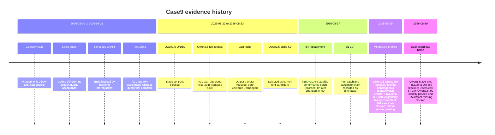

# Case9 历史结果、候选模型与边界

_保留早期候选、失败原因和暂停范围。8T 当前地址为 `192.168.1.90`；`.11.14` 与 `.178` 都是同一块板的历史地址。20T 当前地址为 `192.168.1.95`，`.210` 仅是历史请求地址；历史结果不自动提升当前板的状态。_

---

## 📚 历史文档位置

2026-08-27 前的详细报告原文已保留在
[`docs/archive/20260827/`](archive/20260827/README.md)。当前 canonical 文档只维护
双板 Qwen2.5 静态 KV 主线以及新的 MindSpore 聊天候选计划；归档文档用于追溯来源、
失败原因和外部链接，不能当作当前服务在线或当前板已验收的证明。

| 历史主题 | 当前结论 | 原文入口 |
| --- | --- | --- |
| 网关协议 stub | JSON/SSE 协议检查，不代表真实 LLM 或 NPU | [01-board-gateway-acceptance.md](archive/20260827/01-board-gateway-acceptance.md) |
| 本地音频 | 仅早期硬件 I/O 检查，未完成 10 条 PTT 闭环 | [03-local-chat-validation.md](archive/20260827/03-local-chat-validation.md) |
| TinyLlama | 可完成 ACL/API 实验，但中文质量未接纳 | [09-tinyllama-acl-om-validation-record.md](archive/20260827/09-tinyllama-acl-om-validation-record.md) |
| TinyLlama Hugging Face 发布 | 预编译 OM、tokenizer 和源权重已按历史实验工件发布；长输出/中文质量问题原样标注 | [29-tinyllama-huggingface-publication.md](29-tinyllama-huggingface-publication.md) |
| Qwen1.5 通用 ONNX | 静态 contract/算子门阻断，未变成当前模型 | [07-acl-om-validation-record.md](archive/20260827/07-acl-om-validation-record.md) |
| Qwen2.5 2048/full-context | ACL/API 证据属于性能基线，固定 2048 主体计算慢 | [15-qwen25-static-onnx-validation-record.md](archive/20260827/15-qwen25-static-onnx-validation-record.md) |
| last-logits | 仅减少输出传输，未解决固定上下文主体计算 | [16-qwen25-optimization-research-and-last-logits-validation.md](archive/20260827/16-qwen25-optimization-research-and-last-logits-validation.md) |
| `.178`/`.11.14`/`.90` 静态 KV（历史别名） | 同一块 B4/8T 板的地址变更；完整双板证据采集于 `.178`，历史入口为 `.11.14`，当前入口为 `.90` | [18-qwen25-static-kv-1024-validation-record.md](archive/20260827/18-qwen25-static-kv-1024-validation-record.md) |
| MindSpore 聊天 Profiles | Qwen1.5 `.90` 历史报表 9/9 但严格身份门 8/9 待补证，`.95` 缺口批次 9/9；TinyLlama 两板均 `blocked`（`.95` 缺口 8/9，长输出含 `U+FFFD`）；DeepSeek `.90` 缺口 9/9，`.95` 中文质量/dirty-base 仍 `blocked`；8T 另有重复 LPM fault 诊断，人工质量和准入待签字 | [24-mindspore-chat-validation-record.md](24-mindspore-chat-validation-record.md) |

## 🗓️ 决策时间线

_时间线说明 Qwen2.5 ACL 基线与 MindSpore 候选为何分层；不表示每个旧候选在新板仍可用。_

## 🧩 为什么当前使用静态 KV

当前模型将 KV cache 拆成 48 个固定输入，并输出当前 token 的 48 个 cache 张量。ACL
运行时按 descriptor 复用请求级缓存，避免每一步重复将完整 cache 从主机传到设备。
这不是自动性能承诺：长输出、D2D cache 更新、内存行为和 token/s 必须以新板原始报告
为准，不能引用旧 board、旧 OM 或浏览器观察替代。

## 🛑 暂停范围

### 音频、ASR 与 TTS

`local_app.py`、C922 麦克风、USB 喇叭、sherpa-onnx ASR/TTS 都不属于本轮验收。
文本 API 成功不能替代录音、识别、TTS、播放或端到端时延证据；本轮不启动它们。

### XiaoZhi

本轮不安装、配置或启动 `xiaozhi-esp32-server`，也不提供 OTA、WebSocket、Opus、ASR、
TTS 或真机验证命令。历史审核发现其默认依赖路径涉及 Torch/Torchaudio，而当前 310B
运行边界不允许将这些框架作为本地 ACL LLM 的依赖。恢复此阶段之前，应单独审核无 Torch
语音组件、设备协议、鉴权和真实设备闭环。[XiaoZhi server source][xiaozhi]

### 禁止的自动回退

任何 ATC、ACL、descriptor、数值、长输出、资源或 API 门失败，都不自动改用 CPU、云端、
Torch、Torch-NPU、Torchaudio、Transformers、ONNX Runtime、vLLM、MindIE 或未经审核的
OPP。MindSpore 仅在本轮明确登记的聊天 Profile 中作为板端已有 `base` 运行时使用；
它不是 ACL 主线的 fallback，也不能因为能导入就绕过 Profile 门禁。保留本批次日志、
SHA、PID 和 `npu-smi` 快照后结束候选服务即可。

## 🧱 证据标签

| 标签 | 可以说明 | 不可以说明 |
| --- | --- | --- |
| `artifact_verified` | 字节、SHA、来源记录一致 | ONNX/OM 能执行 |
| `descriptor_verified` | OM 输入输出、dtype、shape 已读取 | ACL 推理或中文质量 |
| `acl_smoke_passed` | 至少一次真实 ACL execute | 长输出、稳定性、通用能力 |
| `api_passed` | JSON/SSE 契约通过 | 网关/UI/设备闭环通过 |
| `quality_reviewed` | 预先定义的探测完成机器检查和工程定性复核 | 正式人工签字或其他板/其他工件的质量 |
| `formally_promoted` | 指定板、工件、环境和完整门禁均通过 | 新板自动继承状态 |
| `not-run` / `blocked` | 尚未执行或被前置条件阻断 | 任意正向能力结论 |

8T 与 20T 的性能、中文质量、NPU 内存和稳定性不得合并排名。B1 与 B4 OM 的交叉加载
结果只是 compatibility experiment；目标 SoC OM 仍是正式证据的默认工件。

## MindSpore 候选边界

候选链为 `浏览器 :7868 -> 网关 :7867 -> 活动 Profile :8090 -> 单一 MindSpore
worker -> NPU`，与 Qwen2.5 的 `8084` ACL 候选后端互斥。Profile 使用板端 `base`
环境，因此即使 JSON、SSE、稳定性和质量门通过，也先标记
`experimental_dirty_base`，不能直接写入正式模型列表。

| Profile | 板卡 | 当前边界 |
| --- | --- | --- |
| `qwen1.5-0.5b-mindspore` | `.90` B4/8T；`.95` B1/20T | `.90` b 批次报表 9/9，但严格身份门 8/9 待补证；重启 d/e 小批次均 10/10，artifact verifier 7/7；`.95` 缺口批次 9/9，性能 p50/p95 `1329.830/1440.076 ms`、吞吐 `1.505/1.619 token/s`；人工质量/准入待签字，均为 dirty-base |
| `tinyllama-1.1b-mindspore` | `.90` B4/8T；`.95` B1/20T | `blocked`：`.90` b 批次 8/9；`.95` 缺口 8/9，32/48 token 长输出含 `U+FFFD`、中文机器质量 7/10；CLI 禁止激活 |
| `deepseek-r1-qwen-1.5b-mindspore` | `.90` B4/8T；`.95` B1/20T（`.210` 为旧 alias） | `.90` 缺口 9/9，性能 p50/p95 `3938.489/4008.768 ms`、吞吐 `0.510/0.517 token/s`，人工质量待审；`.95` 固定工件和 API 机器门通过但中文质量/dirty-base 准入未完成，保持 `blocked` |

候选服务可由 `case9-modelctl switch <profile>` 切换，但浏览器没有管理接口。切换
失败应回滚至上一个已验证 Profile；回滚失败则 fail-closed。详细命令和状态字段见
[聊天模型 Profile 运行手册](25-chat-model-profile-runbook.md)。

本轮双板缺口的原始 acceptance、性能和长输出报告集中在
`repro/case9-dual-board-gap-20260830/`；逐组合状态和 Qwen2.5 当前身份证据见
[缺口计划](27-case9-dual-board-gap-completion-plan.md)与[缺口账本](28-case9-dual-board-gap-validation-record.md)。
这些报告不改变正式 `8080 -> 7861 -> 7865` 入口，也不把 dirty-base 机器门提升为准入。

## 新一轮 MindSpore 候选边界

本轮候选范围扩展为 Qwen1.5、TinyLlama、DeepSeek、Qwen2.5-0.5B、Qwen2.5-1.5B、
Qwen3-0.6B、Qwen3-1.7B，以及仅面向 20T 的 MiniCPM3-4B。Qwen2.5-0.5B 已在
原 8T 板的历史地址 `192.168.11.14` 完成固定工件和 NPU 活动诊断；当前入口为
`192.168.1.90`。该诊断因严格 placement
证据缺失保持 `blocked`；Qwen3 两个 Profile 因当前 MindNLP loader 缺失保持 `blocked`。
Qwen2.5-1.5B 已在 8T 完成七个文件同步和 SHA-256 核验；修正 CANN `PYTHONPATH`
后，v2/v3b/v4 诊断已完成模型加载和短生成，但 placement、API、质量和性能仍未执行，
8T 状态继续为 `blocked`。首轮 SIGSEGV 仅保留为环境污染的历史证据；详见
[docs/36](36-qwen25-1.5b-8t-preflight-20260904.md) 和
[docs/37](37-qwen25-1.5b-8t-memory-gate-20260904.md)。其余新增模型在真实板端测试前
保持 `not-run`，不能把 HF/MindFormers 的框架支持写成 310B 兼容性。
OpenPangu、EE-Model、TeleChat、BitCPM、MiniCPM5、MiniMind、Haidass 等需要额外
框架或缺少当前板证据的条目只登记为条件候选，状态为 `blocked` 或 `not-run`，不下载、
不安装、不启动。

完整来源和证据分级见 [MindSpore LLM 候选模型清单](31-mindspore-llm-candidate-inventory.md)，
执行顺序和逐板门禁见 [双板验收计划](32-mindspore-llm-candidate-validation-plan.md)，
实测状态追加到 [验收记录](33-mindspore-llm-candidate-validation-record.md)。候选 UI
可以显示失败和未执行条目；只有技术门通过的 dirty-base Profile 才能显式实验切换，
`admitted` 仍需人工批准。新增候选不改变正式 Qwen2.5 ACL 路线，也不恢复音频或 XiaoZhi。

TinyLlama 的 Hugging Face 发布只用于保存可复核工件。发布的预编译 OM、tokenizer 和
MindSpore 源权重分别记录了来源、字节数和 SHA-256；模型卡明确列出中文质量 `7/10`、
`max_tokens=32/48` 的 `U+FFFD` 长输出失败、缺少当前 CANN8.0 ATC 证据以及历史资源增长
风险。因此发布状态是 `experimental_historical_artifact`，不是 `admitted`，也不能作为
小智或正式中文聊天后端。

## 🔗 当前入口

- [当前运行手册](00-case9-current-runbook.md)
- [双板验证记录](01-qwen25-dual-board-validation.md)
- [复现包与同步](02-qwen25-reproducibility-and-sync.md)
- [完整归档索引](archive/20260827/README.md)
- [MindSpore 聊天移植计划](23-mindspore-chat-porting-plan.md)
- [MindSpore 聊天验收记录](24-mindspore-chat-validation-record.md)
- [MindSpore LLM 候选模型清单](31-mindspore-llm-candidate-inventory.md)
- [MindSpore LLM 候选双板验收计划](32-mindspore-llm-candidate-validation-plan.md)
- [MindSpore LLM 候选验收记录](33-mindspore-llm-candidate-validation-record.md)
- [Qwen2.5-0.5B 8T loader/NPU 活动诊断](34-qwen25-0.5b-mindspore-8t-loader-smoke-20260903.md)
- [Qwen3 loader 兼容性检查](35-qwen3-loader-compatibility-check-20260903.md)
- [Qwen2.5-1.5B 8T 配置/loader 预检](36-qwen25-1.5b-8t-preflight-20260904.md)
- [Qwen2.5-1.5B 8T 内存门失败记录](37-qwen25-1.5b-8t-memory-gate-20260904.md)
- [TinyLlama Hugging Face 发布记录](29-tinyllama-huggingface-publication.md)
- [双板缺口计划](27-case9-dual-board-gap-completion-plan.md)
- [双板缺口账本](28-case9-dual-board-gap-validation-record.md)

[xiaozhi]: https://github.com/xinnan-tech/xiaozhi-esp32-server "xiaozhi-esp32-server"
