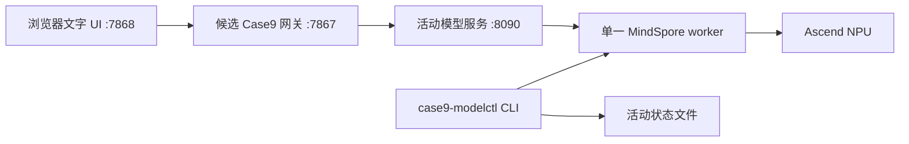

# Case9 MindSpore 聊天模型逐个移植计划

_版本：1.3｜更新日期：2026-08-30｜状态：20T DeepSeek 已在实际可达的 192.168.1.95 完成隔离加载、短稳定性、API 契约和 2+30 SSE 性能证据；中文最终质量、正式候选链和人工准入仍待完成_

## 1. 目标与范围

本计划把官方 Orange Pi MindSpore 示例中的聊天模型，逐个整理为 Case9 的
OpenAI 兼容候选服务。首轮只处理文本生成模型：

1. `Qwen1.5-0.5B-Chat`
2. `TinyLlama-1.1B`
3. `DeepSeek-R1-Distill-Qwen-1.5B`

视觉、扩散、Janus、MiniCPM3 和音频链路不在本轮范围。现有 Qwen2.5 静态 KV
ACL 服务及正式入口 `8080 -> 7861 -> 7865` 保持不变，直到候选模型独立通过门禁并
得到人工批准。

## 2. 候选架构



候选服务只绑定 `127.0.0.1:8090`，网关只在候选链上使用它。浏览器可以查看当前
Profile，但不能调用切换接口，也不会收到管理密钥。任何时刻只允许一个模型常驻，
切换前必须停止并确认旧 worker 已释放设备资源。

## 3. 模型 Profile 矩阵

| Profile | 上游模型/来源 | 验收板卡 | 初始限制 | 预期状态 |
| --- | --- | --- | --- | --- |
| `qwen1.5-0.5b-mindspore` | `Qwen/Qwen1.5-0.5B-Chat` | `192.168.1.90`，Ascend310B4/8T | context 1024；默认 32；上限 80；greedy | `experimental_dirty_base`；完整 b 批次 9/9，post-restart d/e 与 post-mask n 小批次通过，候选链和进程组切换已冒烟；人工质量/准入待定 |
| `tinyllama-1.1b-mindspore` | `TinyLlama/TinyLlama-1.1B-Chat-v1.0` | `192.168.1.90`，Ascend310B4/8T | context 1024；默认 32；上限 80；greedy | `blocked`；b 批次 8/9，32-token 长输出含 replacement character；已有切换冒烟仅作历史证据，当前 CLI 禁止激活 |
| `deepseek-r1-qwen-1.5b-mindspore` | `MindSpore-Lab/DeepSeek-R1-Distill-Qwen-1.5B`（实际 FP16 源：`MindSpore-Lab/DeepSeek-R1-Distill-Qwen-1.5B-FP16`，modelers） | `192.168.1.95`，Ascend310B1/20T（`192.168.8.210` 为旧请求地址） | FP16/context 1024；默认 32、上限 80、greedy；revision `0a28897fe71fdd30de350b667ae588601a85990f`；权重 SHA-256 `706e1bfd7cb0680fbf73df6a2506766e447246e4291d7054c8b395dc3583419c`；shared dirty-base | `blocked`：隔离加载、短稳定性、API 契约和 reduced/full 性能证据已留存；中文推理/事实质量未过，正式网关/UI 未启动 |

每个 Profile 必须单独记录模型 revision、tokenizer、配置、权重路径、环境指纹、
文件大小和 SHA-256。来源仓库存在但没有锁定哈希时，不能标记
`artifact_verified`。

## 4. 环境边界

开发板直接使用已有 `base` 环境，并明确标记为 `dirty-base`。不得删除其中已有的
`torch`、`torch_npu`、`torchaudio` 或 ONNX Runtime；本适配层也不得导入这些包。
控制机可以安装导出和 CPU 参考所需依赖，但不得把控制机的 Python 包复制到板端。

板端每次启动都在同一 shell 中执行：

```bash
source /usr/local/miniconda3/etc/profile.d/conda.sh
conda activate base
source /usr/local/Ascend/ascend-toolkit/set_env.sh
```

不升级或覆盖系统 CANN、驱动、kernel、OPP。只有出现可复现的版本兼容错误，且有
锁文件和回归计划时，才允许调整 MindSpore/MindNLP；调整后必须重新回归已通过的
Profile。

## 5. 统一服务契约

`127.0.0.1:8090` 提供：

```text
GET  /health
GET  /v1/models
POST /v1/chat/completions
```

请求和生成边界：

- `messages` 必须是数组，角色仅允许 `system`、`user`、`assistant`；
- 服务端使用 Profile 自带 tokenizer 和 chat template，不硬编码 token ID；
- 实际 token 化后检查 `prompt_tokens + max_tokens <= 1024`，超限返回 400；
- batch 固定为 1，单进程、单请求串行；
- 首轮只接受 `temperature=0`、`top_p=1`，使用 greedy；
- 请求体最大 256 KB，`max_tokens` 默认 32、最大 80；
- 同时支持普通 JSON 和 OpenAI SSE；SSE 只发送前缀差量；
- 客户端断开、超时或异常后释放 worker/设备资源；阻塞 watchdog 触发时服务
  fail-closed，不继续接收请求；
- 客户端不能指定模型路径、后端、Profile、Python 表达式或管理参数。

`/health` 至少返回 Profile、revision、环境指纹、NPU 型号、worker PID、busy 状态、
缓存清理状态和 admission 状态。

## 6. 实施阶段

### 6.1 注册表和服务骨架

新增统一 Profile 注册表和 provider 适配层。服务层负责 HTTP 约束、SSE、超时、串行
锁和健康状态；provider 负责 tokenizer、chat template、MindSpore 模型加载和生成。
服务不得把官方 Gradio 回调直接当作 HTTP 上游。

### 6.2 Qwen1.5 首个基线

先在 `.90` 上冻结 `base` 包清单和 CANN/NPU 快照，复用已经下载的官方 Qwen1.5
权重前，补齐不可变 revision、文件哈希和 tokenizer 记录。完成单 token、JSON、SSE、
长输出、稳定性、性能及中文探测后，才可试运行统一候选链。

### 6.3 TinyLlama

复用同一 worker 契约但使用独立缓存和日志。英文能力与中文能力分别报告；即使英文
协议和生成门通过，也不能因此把中文 Profile 标记为可用。

### 6.4 DeepSeek

实际隔离实验在 `192.168.1.95`（Ascend310B1/20T）完成；`192.168.8.210` 仅是旧请求地址。
已锁定 FP16 revision/工件并完成 MindSpore/Ascend 加载、1/4-token smoke、10 轮短请求
稳定性、JSON/SSE 契约和 20T/记录的 8T 对比。该证据不等于 8T 移植、完整中文质量或
正式候选链通过；共享 `base`、中文推理/事实质量和人工准入仍使 Profile 保持 `blocked`，
不得自动降级为 CPU。

### 6.5 候选链和切换

候选 Profile 在完成机器门后，使用 `CASE9_ALLOW_EXPERIMENTAL=1 case9-modelctl
switch <profile>` 显式切换活动 worker；只有人工批准为 `admitted` 的 Profile 才能
省略该实验开关。CLI 启动后有界等待并确认 `PID=PGID=SID`，切换时只向该隔离进程组
发送 TERM/KILL；成功切换会健康检查新 PID 并原子写入状态。失败时回滚到上一个已验证
Profile，回滚失败则保持 fail-closed。正式端口永不由 CLI 自动修改。

## 7. 验收门

每个模型使用唯一 UTC run-id 保存命令、PID、日志、哈希和 `npu-smi` 快照：

| 门 | 内容 | 通过条件 |
| --- | --- | --- |
| G0 | 环境、SoC、CANN、Python、依赖污染 | 指纹完整且目标板匹配 |
| G1 | 权重、tokenizer、配置和 revision | 下载完整并通过 SHA-256 |
| G2 | MindSpore tokenizer/model 导入 | 单 token 生成成功 |
| G3 | JSON/SSE | 契约、错误码和前缀 delta 正确 |
| G4 | 8/16/32/64/80 token | UTF-8 完整、EOS/finish reason 一致 |
| G5 | 10 轮稳定性 | 无崩溃、明显 FD/RSS/NPU 泄漏 |
| G6 | 中文/英文探测 | Qwen/DeepSeek 目标 8/10；TinyLlama 分开报告 |
| G7 | 性能 | 2 次预热 + 30 次测量，p50/p95、首 token、token/s |
| G8 | 候选链和切换 | 鉴权、SSE、UI、停止、回滚均有原始证据 |

允许的状态字符串为：

```text
artifact_verified, environment_verified, load_passed, json_passed, sse_passed,
stability_passed, quality_reviewed, performance_recorded,
experimental_dirty_base, admitted, blocked, not-run
```

共享 `base` 即使全部功能门通过，也只能先标记 `experimental_dirty_base`。`admitted`
需要人工批准，不能由测试脚本自动设置。

当前证据边界：候选网关鉴权、候选文字 UI、JSON/SSE 转发已有一次 HTTP 冒烟记录；DeepSeek
在 `.95` 的临时 `service-test` 已完成 9/9 机器 API 门（含 2 次预热 + 30 次 SSE、错误边界
和客户端中断），但这不是正式网关/UI 链或中文质量门；
Qwen -> Tiny -> Qwen 的旧 worker 进程组停止、资源释放和新 worker 健康启动也已有一次
板端冒烟记录。浏览器会话清空、失败回滚和 watchdog 进程级处置仍是独立的 `not-run`
门，不能从 HTTP 冒烟或成功切换推断它们通过。

DeepSeek API 原始报告位于 `repro/deepseek-r1-20t-20260830/reports/board20t/api/`，其中
`reopen-20260830T0536Z/` 是用户重新开放 20T 后的复核批次；该批次机器门仍为 `9/9`。
下的 `deepseek-api-full-20t-20260830T051523Z/`；标准 G7 的完整 2+30 证据已记录，
中文探测仍单独判定为未通过。

## 8. 失败和回滚

失败时只停止当前批次已记录且命令行匹配的 worker PID，保留报告、日志、哈希和
`npu-smi` 快照。不得删除系统 CANN、conda 缓存、其他模型或正式服务。不得自动改用
CPU、云端、Torch、Torch-NPU、vLLM、MindIE 或其他未审核模型。

## 9. 参考资料

- [MindSpore Orange Pi 在线推理目录](https://www.mindspore.cn/tutorials/zh-CN/master/orange_pi/model_infer.html)
- [Qwen1.5 Orange Pi 教程](https://www.hiascend.com/developer/techArticles/20250424-3)
- [Qwen1.5-0.5B-Chat](https://huggingface.co/Qwen/Qwen1.5-0.5B-Chat)
- [TinyLlama-1.1B-Chat-v1.0](https://huggingface.co/TinyLlama/TinyLlama-1.1B-Chat-v1.0)
- [DeepSeek-R1-Distill-Qwen-1.5B](https://huggingface.co/MindSpore-Lab/DeepSeek-R1-Distill-Qwen-1.5B)
