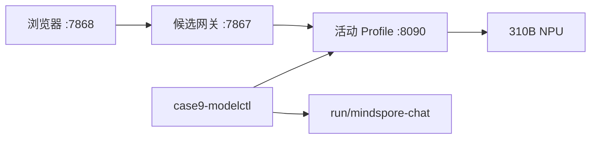

# Case9 聊天模型 Profile 运行手册

_适用范围：候选 MindSpore 文本服务｜更新日期：2026-08-29｜正式入口不变_

本手册用于在开发板上逐个启动和验证 Qwen1.5、TinyLlama、DeepSeek Profile。
它不会安装依赖，不会切换正式 Qwen2.5 ACL 服务，也不会部署 XiaoZhi。

## 1. 端口和进程边界



| 组件 | 监听地址 | 说明 |
| --- | --- | --- |
| MindSpore Profile 服务 | `127.0.0.1:8090` | 单进程、单请求、单模型 |
| 候选 Case9 网关 | `127.0.0.1:7867` | 对外模型名仍为 `case9-rag` |
| 候选文字 UI | `0.0.0.0:7868` | 只显示活动 Profile，不提供切换 API |
| 正式链路 | `8080/7861/7865` | 本手册不得修改 |

板端不安装 Node.js。当前候选文字 UI 由 `text_chat_app.py` 返回受控的内嵌 HTML，
不会动态挂载 `frontend/dist`；`frontend/dist` 仍作为控制机生成的构建复现材料，按
allowlist 同步并校验大小与 SHA-256。源码、`package-lock.json` 和测试用于控制机复现，
`node_modules` 及未锁定的构建输出不得进入板端。

## 2. 板端准备

在 `.90`（B4/8T）或 `.95`（B1/20T；`.210` 仅为旧地址）上，用同一个 shell 执行：

```bash
source /usr/local/miniconda3/etc/profile.d/conda.sh
conda activate base
source /usr/local/Ascend/ascend-toolkit/set_env.sh
cd ~/case9-mindspore-chat
export PYTHONPATH="$PWD${PYTHONPATH:+:$PYTHONPATH}"
```

### 2.1 启动脚本的环境变量契约

模型 worker、候选网关和候选文字 UI 是三个不同的进程边界，不能假定它们共享
交互式 shell 的 conda 状态。`case9-modelctl.sh` 启动
`run_mindspore_chat_service.sh` 时，默认使用 `CONDA_PROFILE=/usr/local/miniconda3/etc/profile.d/conda.sh`
和 `CASE9_MINDSPORE_CONDA_ENV=base`，并由 worker 自己 source
`CANN_ENV_SCRIPT=/usr/local/Ascend/ascend-toolkit/set_env.sh`。需要切换路径时，
只在板端 shell 显式设置这些变量：

```bash
export CONDA_PROFILE=/usr/local/miniconda3/etc/profile.d/conda.sh
export CASE9_MINDSPORE_CONDA_ENV=base
export CANN_ENV_SCRIPT=/usr/local/Ascend/ascend-toolkit/set_env.sh
export CASE9_MODEL_ROOT="$PWD"
```

`CASE9_PYTHON_BIN` 可以指定激活环境内的 Python；`CASE9_MODELCTL_ALLOW_EXTERNAL_PYTHON=1`
只允许经过审计的绝对路径例外。`CASE9_PYTHONNOUSERSITE` 默认不设置（或设为 `0`），
因为当前板端验证的 MindSpore/MindNLP 位于 `base` 的用户 site；设为 `1` 会隐藏该副本，
仅用于明确的隔离诊断。日常启动和切换必须经过 `case9-modelctl` 的环境、工件和 Profile
admission gate。

启动器的导入预检会打印 `mindspore`/`mindnlp` 的实际模块路径、Python user-site
开关和版本。2026-08-30 在当前 8T `.90` 与 20T `.95` 板上，默认 unset
`PYTHONNOUSERSITE` 均成功导入 MindNLP 0.4.1；显式设为 `1` 均按预期找不到
`mindnlp`。因此不要在 MindSpore worker 的启动命令中全局设置 `PYTHONNOUSERSITE=1`。

`CASE9_LAUNCHER_VERIFIED=1` 是 launcher 的防误用标记，不是对拥有同一板端 shell
账户者的安全凭据：该账户可读取或伪造进程环境和状态文件。因而 modelctl 的“唯一入口”是
运营规则和可审计边界，而不是用来隔离同一 Linux 用户的权限边界。浏览器和同网段客户端
不能设置该标记，且服务仍固定 loopback、Profile admission、进程组和状态文件检查；需要
多用户隔离时，应另行配置不同系统账户、文件权限和系统服务策略，不能把本候选实验链当作
多租户安全服务。

候选网关和文字 UI 使用另一个已存在的环境，默认均为
`case9-local-chat`：网关读取 `CASE9_GATEWAY_CONDA_ENV`，UI 读取
`TEXT_CHAT_CONDA_ENV`；两者都使用 `CONDA_PROFILE`。候选包装器会固定
`127.0.0.1:8090`、`127.0.0.1:7867`、`0.0.0.0:7868`、`case9-active`、
`RAG_ENABLED=false` 和请求上限，不接受命令行覆盖。启动网关前必须在当前 shell
显式提供高熵密钥：

```bash
export CASE9_GATEWAY_CONDA_ENV=case9-local-chat
export TEXT_CHAT_CONDA_ENV=case9-local-chat
export GATEWAY_API_KEY='<board-local-secret>'
```

`scripts/run_mindspore_chat_gateway.sh` 和它调用的
`scripts/run_xiaozhi_gateway.sh` **不会自动读取** `.env` 或 `.env.local`；后者只是
历史共享网关的 conda/ Python 激活包装器，并不启动 XiaoZhi 服务。不要把密钥写入
命令历史、文档或 Git。直接调用 `run_text_chat.sh` 时它会读取
`TEXT_CHAT_ENV_ROOT_FILE`（默认 `.env`）和 `TEXT_CHAT_ENV_FILE`（默认 `.env.local`），
但候选 UI 包装器将二者固定为 `/dev/null`，因此候选启动仍以当前 shell 的
`GATEWAY_API_KEY` 和显式环境变量为准。网关若设置 `PYTHON_BIN` 会跳过 conda 激活，
只应在绝对路径已审计时使用；UI 的 `TEXT_CHAT_PYTHON_BIN` 也必须解析到激活环境。

推荐把 worker、网关、UI 分别放在三个 SSH shell（或三个受控 systemd scope）中；每个
shell 都重新执行本节的 conda/CANN 初始化，并把启动命令、环境指纹和 PID 保存到同一
UTC run-id 目录。这样换板时只需复制注册表、锁文件和报告，不会依赖操作者的
`.bashrc` 或残留环境变量。

启动前查看版本和禁止导入边界：

```bash
python - <<'PY'
import mindspore, mindnlp, sys
print("python", sys.version)
print("mindspore", mindspore.__version__)
print("mindnlp", getattr(mindnlp, "__version__", "unknown"))
PY
npu-smi info
```

本轮允许适配层导入 MindSpore/MindNLP；不得在适配代码中导入 Torch、Torch-NPU、
Torchaudio、Transformers、vLLM、MindIE 或任意客户端传入的 Python 模块。`base` 中
已有污染包只记录，不删除。

## 3. 查看 Profile 和活动状态

注册表位于 `configs/chat_model_profiles.json`。使用 CLI 查看，不从浏览器发管理请求：

```bash
bash scripts/case9-modelctl.sh list
bash scripts/case9-modelctl.sh status
```

状态输出应至少包含 Profile、目标 SoC、模型 revision、worker PID、端口、busy、健康和
admission。没有 `admitted` 或 `experimental_dirty_base` 之外的明确状态时，不得把
Profile 放入正式模型列表。

### 3.1 工件 verifier 和验收 preflight

`scripts/verify_mindspore_profile_artifacts.py` 是只读检查器。它从严格注册表读取
`cache_dir`、文件大小和 SHA-256，拒绝路径穿越、符号链接、缺失锁值和不完整文件；它
不会下载、安装、删除模型，也不会启动或停止 worker。以 Qwen 为例：

```bash
python scripts/verify_mindspore_profile_artifacts.py \
  --profile qwen1.5-0.5b-mindspore \
  --root ~/case9-mindspore-chat \
  --output reports/mindspore-chat/qwen1.5-0.5b-mindspore/artifact-verify.json
```

Tiny 使用相同命令替换 Profile ID。返回 `passed` 才能把该次文件检查记录为
`artifact_verified`；只有注册表声明而没有实际字节和 SHA-256 复核时，必须记为
`not-run` 或 `unverified`。对 `--all` 的结果要逐 Profile 阅读，DeepSeek 当前是
`blocked`，不能把它的前置阻断误写成模型推理失败。

`scripts/mindspore_chat_acceptance.py` 也只对已经启动的 loopback 服务发请求。它的
`process_management` 固定为 `none`，不会替 operator 管理 PID；报告中的质量门只检查
HTTP/JSON、UTF-8、预算和结构，`human_review` 必须人工填写，脚本不会设置
`admitted`。推荐在独立 UTC 目录保存完整批次：

```bash
python scripts/mindspore_chat_acceptance.py \
  --profile qwen1.5-0.5b-mindspore \
  --execute \
  --run-id <utc-run-id> \
  --long-budgets 8,16,32,64,80 \
  --stability-loops 10 \
  --perf-warmup 2 --perf-loops 30 \
  --probe-file tests/fixtures/mindspore_chat_probe.json \
  --output reports/mindspore-chat/qwen1.5-0.5b-mindspore/<utc-run-id>
```

执行前后保存 `/health`、命令、服务日志和 `npu-smi` 快照。验收脚本异常或某一门失败
时保留原始目录，不重试到 CPU、云端或其他模型；正式入口仍保持不变。

当前 health gate 除 `ready`、`healthy`、`busy` 和 `cache_cleared` 外，还必须核对
`npu_model`、`device_target`、`worker_pid` 与 `environment_fingerprint`。历史批次若
缺少这些字段（例如旧 Qwen `health.json` 的 `npu_model: null`），只按采集时的契约
解释，不能事后套用新 gate 改写其状态。

Qwen1.5 Profile 的 `npu_model` 必须与注册表的 `board_soc` 精确匹配
`Ascend310B4`，不能只接受任意 `Ascend*` 字符串；`device_target` 必须为 `Ascend`，
环境指纹必须是 64 位十六进制字符串。新证据位于
[`qwen-health-gate-20260829c`](../repro/mindspore-chat-20260829/reports/board8t/qwen-health-gate-20260829c/)，
其 [health.json](../repro/mindspore-chat-20260829/reports/board8t/qwen-health-gate-20260829c/health.json)
记录了 `Ascend310B4`、worker PID `42803` 和环境指纹。此批次使用缩小的 2-token/
1 次稳定性/1 次性能参数，只证明严格 health 身份契约，不替代完整性能、长输出或人工
质量验收。

历史补丁批次在 `.90` 受控重启后的 worker PID 为 `90531`；`qwen-post-mask-20260829n`
再次通过 health、JSON、SSE、长输出、稳定性、性能、错误和协议机器门。随后板端出现
`DRV_LPM_FAULT 0x80E3A203`，该 PID 退出；恢复批次记录的 worker PID 为 `15897`。恢复批次
`qwen-lpm-recovery-20260829r` 只使用缩小参数验证服务恢复和接口契约，不改变 dirty-base
实验状态，也不替代完整批次、硬件稳定性或人工质量审查。LPM 原始诊断必须一并保留，
不能把 worker 恢复误写成驱动故障已解决。

## 4. 启动或切换单一模型

先确保目标 Profile 已完成 G0-G2，之后执行：

```bash
# 当前 Profile 仍是 shared base/dirty-base；候选实验必须显式同意：
CASE9_ALLOW_EXPERIMENTAL=1 bash scripts/case9-modelctl.sh switch qwen1.5-0.5b-mindspore
```

其他候选：DeepSeek 当前为 `blocked`。`.95` 的固定工件和临时 API 机器门已经有隔离
证据，但中文质量、正式候选链和 dirty-base 准入尚未完成；`.210` 仅是旧地址。
TinyLlama 也已因长输出/机器质量门失败标记为 `blocked`。两者的 `switch` 请求都会被
CLI 拒绝，直到新的完整验收证据更新注册表。不要用
`CASE9_ALLOW_EXPERIMENTAL=1` 绕过该门。

CLI 必须只停止自己状态文件中记录、且命令行匹配的旧 PID；不得使用宽泛的
`pkill python`。启动时它会有界等待，只有确认 `PID=PGID=SID` 后才写入 PGID sidecar；
停止时 TERM/KILL 只发送到该隔离进程组。切换流程为：停止旧 worker、等待设备资源释放、
启动新 worker、轮询 `/health`、原子写入活动状态、清空会话。新 worker 健康检查失败时
自动回滚上一个已验证 Profile；回滚也失败则保持 fail-closed，并保留两个批次的日志。

已经在 `.90` 做过一次 Qwen -> TinyLlama -> Qwen 的成功冒烟和一次 Qwen stop/restart；
它不替代失败回滚或 watchdog 验收。开始新的操作前先读取 `status`，若返回
`group_isolated=false`、`group_alive=false` 或 `stale=true`，不要手工猜测 PID，应保留状态
文件和日志后按故障记录处理。

文字 UI 按活动模型状态维护会话代际（generation）。每次请求会读取
`active-model.json` 中的 Profile、worker PID、revision、更新时间及原子文件签名；任一
状态变化（包括切换完成、进入 fail-closed 或恢复可用）都会触发服务端原子
`clear_all()`，因此浏览器保留的旧 cookie 只会映射到新的空会话。若切换发生在回复生成
期间，代际校验会取消本轮，并禁止把旧 worker 的部分或完整回复提交到新会话；客户端需
重新发起请求。该段描述的是已实现的保护逻辑，不等同于切换、回滚或 watchdog 验收门已
通过，相关门仍须以原始报告为准。

DeepSeek 命令仅适用于 `.95`（Ascend310B1/20T）。`.210` 是旧请求地址；若 `.95` 不可达、
SoC/CANN 不匹配或工件未锁定，应保持 `blocked`，不要在 `.90` 代跑。

## 5. 直接检查服务 API

确认候选服务健康：

```bash
curl -fsS http://127.0.0.1:8090/health
curl -fsS http://127.0.0.1:8090/v1/models
```

普通 JSON 请求：

```bash
curl -fsS http://127.0.0.1:8090/v1/chat/completions \
  -H 'Content-Type: application/json' \
  -d '{"model":"case9-active","messages":[{"role":"user","content":"请用一句话介绍自己。"}],"stream":false,"max_tokens":8,"temperature":0,"top_p":1}'
```

SSE 请求：

```bash
curl -N http://127.0.0.1:8090/v1/chat/completions \
  -H 'Content-Type: application/json' \
  -d '{"model":"case9-active","messages":[{"role":"user","content":"用中文回答：太阳从哪里升起？"}],"stream":true,"max_tokens":8,"temperature":0,"top_p":1}'
```

服务应返回 OpenAI 兼容结构。SSE 的每个 `delta.content` 必须是新增前缀差量，不能把
累计全文重复发送。`max_tokens > 80`、非法角色、非零 temperature、错误模型名、
超出 context 或超过 256 KB 请求体都应返回明确的 4xx；错误后健康状态和资源清理要
通过 `/health` 复核。

## 6. 启动候选网关和文字 UI

服务 API 通过后，在另一个已激活 `case9-local-chat` 的 shell 中启动候选网关（网关本身
不导入 MindSpore；是否 source CANN 不影响它，但为便于审计可保持与 worker 相同的 shell
初始化）：

```bash
export GATEWAY_API_KEY='<board-local-secret>'
export CASE9_GATEWAY_CONDA_ENV=case9-local-chat
bash scripts/run_mindspore_chat_gateway.sh
```

再启动候选 UI：

```bash
export GATEWAY_API_KEY='<board-local-secret>'
export TEXT_CHAT_CONDA_ENV=case9-local-chat
bash scripts/run_mindspore_chat_text.sh
```

浏览器访问 `http://<开发板IP>:7868/`。页面显示当前 Profile 和健康状态，但不显示
网关密钥、不接受客户端模型路径，也不提供浏览器切换动作。切换只能在板端执行 CLI；
切换后确认页面会话已清空。

## 7. 验收顺序

每次切换后按以下顺序记录同一 UTC run-id：

```text
health/models -> JSON -> SSE -> 8/16/32/64/80 tokens
-> 10 轮稳定性 -> 2 warmup + 30 performance -> 10 条质量探测
-> 网关鉴权/UI -> 成功切换/失败回滚
```

保存 `command.txt`、服务日志、PID、工件哈希和 `npu-smi` before/during/after。TinyLlama
的英文和中文探测要分栏；Qwen1.5/DeepSeek 的中文目标是至少 8/10 可理解，但这只是
质量门，不替代协议或硬件门。

## 8. 停止和回滚

```bash
bash scripts/case9-modelctl.sh status
bash scripts/case9-modelctl.sh stop
```

只停止 CLI 记录的 worker 和本批次候选网关/UI PID。不要停止正式 Qwen2.5 服务，不要
删除 `~/case9-mindspore-chat` 中的日志、模型缓存或报告。失败时保留 `blocked`、
`not-run` 或具体失败状态，禁止自动切换 CPU、云端或其他推理框架。

## 9. 常见故障

| 现象 | 核查 | 处理 |
| --- | --- | --- |
| `/health` 可达但生成失败 | 启动 shell 是否 source CANN；`import mindspore/mindnlp` | 停止 worker，保存日志后重启；不加 CPU fallback |
| 首 token 很慢 | 首次权重加载、官方模型缓存和 `max_new_tokens` | 区分加载延迟与 steady-state；不要扩大 token 上限 |
| SSE 重复文本 | 检查服务是否发送累计全文 | 修复前缀差量逻辑，重新执行 G3 |
| 切换后旧 PID 仍在 | 查看命令行和状态文件 | 只终止匹配 PID；确认 NPU 释放后再启动 |
| `.95` 无法连接 | SSH、CANN、SoC 和磁盘快照；`.210` 仅为旧地址 | DeepSeek 保持 `blocked`，不在 8T 替代测试 |

## 10. 参考与边界

- [MindSpore Orange Pi 在线推理](https://www.mindspore.cn/tutorials/zh-CN/master/orange_pi/model_infer.html)
- [Qwen1.5 模型卡](https://huggingface.co/Qwen/Qwen1.5-0.5B-Chat)
- [TinyLlama 模型卡](https://huggingface.co/TinyLlama/TinyLlama-1.1B-Chat-v1.0)
- [DeepSeek 模型卡](https://huggingface.co/MindSpore-Lab/DeepSeek-R1-Distill-Qwen-1.5B)

本手册不包含 XiaoZhi、OTA、设备 WebSocket、麦克风、ASR/TTS 或正式入口切换命令。
文本 Profile 通过不代表语音闭环通过；正式提升仍需人工批准和独立证据。
