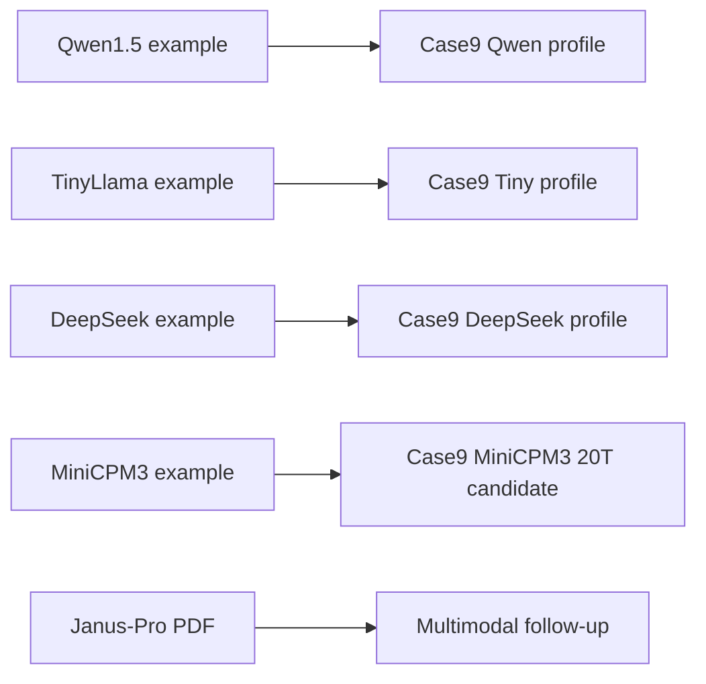

# Orange Pi MindSpore Online 示例盘点与 Case9 适配

_盘点日期：2026-09-04｜目标板：`192.168.3.10`（Ascend310B4 / 8T）｜只读检查，未修改板端环境。_

---

## 目录和环境

盘点目录为 `/home/HwHiAiUser/orange-pi-mindspore/Online`，主机名为
`orangepiaipro`。板端在显式加载 CANN 后观察到：Python `3.9.2`、MindSpore
`2.4.10`、MindNLP `0.4.1`、Gradio `4.44.0`、CANN `8.0.0`，`acl` 可导入，
`npu-smi` `25.2.0`。`base` 是 dirty 环境，已经存在 Torch、Torch-NPU、Torchaudio
和 ONNX Runtime；本次没有安装、删除或升级任何包。



## 纯文本 LLM 示例

| Online 路径 | 模型与入口 | 原例行为 | Case9 对应实现 | 当前证据 |
| --- | --- | --- | --- | --- |
| `14-qwen1.5-0.5b/qwen1.5-0.5b.py` | `Qwen/Qwen1.5-0.5B-Chat` | MindNLP `AutoModelForCausalLM`/`AutoTokenizer`，Gradio `ChatInterface`，采样参数和 `max_new_tokens=1024` 写在脚本中 | `qwen1.5-0.5b-mindspore`，统一 tokenizer/chat template、JSON/SSE、context 1024、greedy，服务 `8090` | Online 目录有 1,239,173,352 字节权重和编译产物；Case9 `.95` 机器门 9/9，`.90` 历史报表 9/9 但严格身份门 8/9 待补证；仍是 `experimental_dirty_base` |
| `15-tinyllama/app.py` | `TinyLlama/TinyLlama-1.1B-Chat-v1.0` | 手写 `<|user|>/<|assistant|>` 模板，采样 `temperature=.7`，Gradio | `tinyllama-1.1b-mindspore`，固定模板、greedy、JSON/SSE，服务 `8090`；Profile 禁止激活 | Online 目录没有权重；Case9 已下载并校验权重，但 8T/20T 均 8/9，32/48 token 有 `U+FFFD`，中文机器质量 `7/10`，`blocked` |
| `17-DeepSeek-R1-Distill-Qwen-1.5B/deepseek-r1-distill-qwen-1.5b.py` | `MindSpore-Lab/DeepSeek-R1-Distill-Qwen-1.5B` | MindNLP `modelers` 镜像，`apply_chat_template`，Gradio，采样 `temperature=.1` | `deepseek-r1-qwen-1.5b-mindspore`，固定 revision/缓存和 API 约束；8T 独立修正版与 20T 隔离 API 证据分开保存 | Online 目录没有权重；8T 有 context-1024、中文四 token 和稳定性实验通过记录，20T 有隔离 API 机器门；中文事实/完整回答与 dirty-base 准入仍 `blocked` |
| `19_minicpm3/minicpm_gradio.py` | `MindSpore-Lab/MiniCPM3-4B-FP16` | MindNLP 专用 `MiniCPM3Tokenizer`/`MiniCPM3ForCausalLM`，Modelers 镜像，Gradio 流式生成；官方表格目标为 CANN `8.0.0.beta1`、MindSpore `2.5.0`、20T/24G | `minicpm3-4b-mindspore`，仅作为 20T 条件候选；需先确认当前 CANN/MindSpore loader，不向 8T 移植 | Online 示例有脚本但不含 Case9 API/固定哈希；尚未在当前板端验收，状态 `not-run` |

四个文本脚本均在导入时加载或下载模型、直接启动 Gradio，没有本地路径参数、OpenAI API、
超时 watchdog 或生命周期管理。Case9 适配不是把脚本原样复制，而是保留模型加载语义，
增加本地固定工件、profile registry、单 worker、请求限制、SSE 前缀差量和证据记录。
适配层不导入 Torch；板端 `base` 中已有的 Torch 包只作为污染记录。

## 多模态例子边界

`18-DeepSeek-Janus-Pro-1B/` 只有约 5 页 PDF，没有可运行的 Python 入口。文档面向
图像理解/图像生成，要求 MindSpore `2.5.0` 和 `mindnlp` 的 `janus` 分支，运行目录为
`llm/inference/janus_pro`。它不是纯文本 OpenAI Chat Completions 模型，不能接入当前
`7868 -> 7867 -> 8090` 聊天链，也不计入本轮文本 LLM 的数量。若要移植，必须另立
多模态输入、图像预处理、输出协议和显存验收计划；本轮不安装其依赖。

## 权重和复现状态

- Qwen1.5 的 Online 权重和 Case9 缓存均已存在，并有逐文件 SHA-256 清单。
- TinyLlama 与 DeepSeek 的 Online 目录只有脚本（及 Python 缓存），没有可直接复用的完整权重；Case9 使用独立缓存和固定 revision 下载的权重。
- TinyLlama 的历史预编译 OM、tokenizer 和已知问题发布记录见
  [TinyLlama Hugging Face 发布记录](29-tinyllama-huggingface-publication.md)。
- 所有模型权重、编译缓存、日志和板端报告留在 Git 忽略的 `repro/` 或板端目录；不把
  Online 目录的存在误写成模型已成功运行。

## MindSpore 测试数量口径

截至本次盘点，**已有正式候选批次使用 MindSpore 在 NPU 上启动并产生过输出的是 3 个文本模型**：
Qwen1.5、TinyLlama、DeepSeek-R1-Distill-Qwen-1.5B。2026-09-03 又对 Qwen2.5-0.5B
完成了固定工件的 context-only 诊断，并通过并发 `npu-smi` 观察到 AICore/设备内存活动；
由于严格 placement metadata 缺失，它仍不能计入“已验证候选”或正式测试数量。官方 Online
目录目前列出第 4 个文本示例 MiniCPM3-4B，但它尚未在当前 Case9 板端执行，不能计入“已测试”数量。按 Case9 的完整机器门计算，
Qwen1.5 `.95` 和 DeepSeek `.90` 的修正版批次达到 `9/9`；Qwen1.5 `.90` 严格身份门为 `8/9` 待补证；TinyLlama 为 `8/9`。由于共享 dirty
`base`、中文质量/事实检查和正式入口审批仍未完成，**正式 `admitted` 模型数量为 0**。
“运行过”不等于“中文可用”，context-only 诊断也不等于严格 NPU placement 通过，更不等于“小智后端可用”。

当前板上的 MindNLP `0.4.1` 没有 `Qwen3ForCausalLM` 或 `qwen3` 模块；因此 Qwen3-0.6B
和 Qwen3-1.7B 的 8T Profile 已记录为 loader `blocked`，没有下载或加载权重。Qwen2.5-1.5B
已在当前 8T 完成七个文件同步与 SHA-256 核验；正确 CANN v2/v3b/v4 诊断已完成模型加载和短生成，但
生成/API/质量/性能均为 `not-run`，8T 状态为 `blocked`（配置级预检见
[36](36-qwen25-1.5b-8t-preflight-20260904.md)，内存门记录见
[37](37-qwen25-1.5b-8t-memory-gate-20260904.md)）。MiniCPM3-4B（官方要求 20T/24G、且示例要求
swap）仍等待可达的 20T 板和环境前置检查。

逐项原始报告和状态字段见 [MindSpore 聊天验收记录](24-mindspore-chat-validation-record.md)、
[双板缺口账本](28-case9-dual-board-gap-validation-record.md) 和
[`local_model_manifest.json`](../local_model_manifest.json)。

可追溯的板端原始文件还包括：Qwen Online 目录下的 `kernel_meta/buildPidInfo.json`；
TinyLlama 的 `run/mindspore-chat/logs/tinyllama-1.1b-mindspore-20260829T071501Z.log`；
以及 DeepSeek 修正版的 `case9-deepseek-8t-experiment/reports/fp16-context1024-four-token-smoke.log`
和 `performance-stability-8t-comparable.json`。这些路径只属于板端证据，不能替代 Case9
固定的 manifest、API 报告或人工质量审查。

本次把当前 Case9 代码和注册表同步到 `.3.10` 前，先备份了 14 个同名代码/配置文件；
权重和历史报告未覆盖。同步后的 `case9_model_profiles.py`、注册表和服务文件与控制机
SHA-256 一致。候选端口无常驻进程时，用 `case9-modelctl` 启动 Qwen 做了一次短 smoke：
`/health` 报告 `Ascend310B4`、MindSpore `2.4.10`、worker PID `12820`，中文请求
`max_tokens=2` 返回 `我是来自`（因预算结束，`finish_reason=length`），随后 worker
由 CLI 停止且 `8090` 无监听。原始输出保存在
`repro/orange-pi-mindspore-online-20260902/evidence/case9-qwen-smoke-20260902.txt`；
这只是接口/加载 smoke，不替代完整质量和性能验收。

## 板端只读复核命令

以下命令用于换板后重新盘点，不会安装依赖或下载模型：

```bash
source /usr/local/miniconda3/etc/profile.d/conda.sh
conda activate base
source /usr/local/Ascend/ascend-toolkit/set_env.sh
cd /home/HwHiAiUser/orange-pi-mindspore/Online
find . -maxdepth 3 -type f | sort
rg -n -i 'llm|qwen|llama|deepseek|chat|mindnlp|gradio' .
python - <<'PY'
import mindspore, mindnlp, sys
print(sys.version)
print(mindspore.__version__)
print(getattr(mindnlp, "__version__", "unknown"))
PY
npu-smi info
```

运行官方脚本前必须另建带时间戳的报告目录，并确认模型缓存、网络、显存和进程边界；
不要从 Gradio 成功启动推导 OpenAI API 或 Case9 网关通过。当前正式入口和音频、ASR/TTS、
XiaoZhi 范围均保持不变。

## 参考来源

- [Orange Pi MindSpore 在线推理目录](https://www.mindspore.cn/tutorials/zh-CN/master/orange_pi/model_infer.html)
- [TinyLlama 模型卡](https://huggingface.co/TinyLlama/TinyLlama-1.1B-Chat-v1.0)
- [Qwen1.5-0.5B-Chat 模型卡](https://huggingface.co/Qwen/Qwen1.5-0.5B-Chat)
- [DeepSeek-R1-Distill-Qwen-1.5B 模型卡](https://huggingface.co/MindSpore-Lab/DeepSeek-R1-Distill-Qwen-1.5B)
- [MiniCPM3 Orange Pi 示例代码](https://github.com/candle-org/orange-pi-mindspore/blob/dev/applications/online/inference/19_minicpm3/minicpm_gradio.py)
- [MiniCPM3 Ascend 技术文章](https://www.hiascend.com/developer/techArticles/20250612-1)
