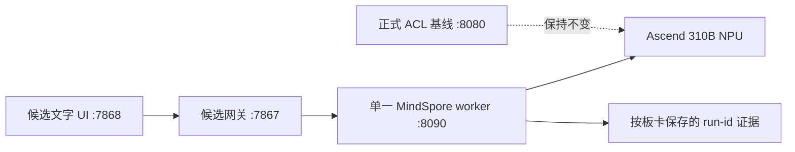

# MindSpore LLM 候选模型双板验收计划

_版本：1.0｜制定日期：2026-09-02｜执行环境：开发板现有 `base`，不新增依赖_

---

本文把 [候选模型清单](31-mindspore-llm-candidate-inventory.md) 转化为可重复的
板端测试流程。目标是获得可审计的模型候选数据，不是自动替换当前正式 Qwen2.5 ACL
服务。当前 8T 连接入口为 `192.168.1.90`；`192.168.11.14` 和
`192.168.8.178` 是同一块板的历史 IP 别名。2026-09-03 的执行更新确认了该板的
Qwen2.5-0.5B 固定工件和 NPU 活动诊断，但
因严格 placement metadata 缺失保持 `blocked`；Qwen3 在现有 MindNLP `0.4.1` 中没有
loader，8T 两个 Qwen3 Profile 直接 `blocked`。这些结论不改变后续门禁顺序，也不产生
正式入口切换。

## 1. 🎯 固定边界

| 项目 | 约束 |
| --- | --- |
| 8T | `192.168.1.90`，Ascend310B4 / 8T（历史别名 `.11.14`、`.178`，同一块板） |
| 20T | `192.168.1.95`，Ascend310B1 / 20T |
| 板端运行时 | 现有 `base` + 当前 MindSpore/MindNLP；记录为 `dirty-base` |
| 禁止变更 | 不安装/升级/删除 Torch、Torch-NPU、Torchaudio、Transformers、vLLM、MindIE、CANN、驱动或 OPP |
| 候选服务 | `127.0.0.1:8090`，单进程、单模型、单请求串行 |
| 候选链 | `7868 -> 7867 -> 8090` |
| 正式链 | `8080 -> 7861 -> 7865`，全程保持不变 |
| 生成约束 | context 1024、batch 1、greedy、`temperature=0`、`top_p=1`、`max_tokens <= 64` |

每个模型和每块 SoC 建立独立 UTC `run_id` 目录。8T 与 20T 的结果不能合并，也不能
因为模型名或 IP 别名自动继承状态。



## 2. 🧭 执行顺序

### 阶段 A：登记和环境冻结

1. 将 8 个原生 MindSpore Profile 和 15 个条件 Profile 写入 schema v2 注册表。
2. 为每块板采集 Python、MindSpore、MindNLP、CANN、驱动、`acl`、`npu-smi`、磁盘、
   内存、HugePages 和污染包清单。
3. 在每次板端命令前执行：

   ```bash
   source /usr/local/miniconda3/etc/profile.d/conda.sh
   conda activate base
   source /usr/local/Ascend/ascend-toolkit/set_env.sh
   export PYTHONNOUSERSITE=1
   ```

   `PYTHONNOUSERSITE=1` 只用于明确的隔离诊断；若它隐藏了板端已验证的 MindSpore
   wheel，应记录原因并按既有服务环境运行，不能借此安装替代包。

### 阶段 B：工件复现

1. 优先解析官方 Modelers/MindSpore 原生权重；HF Safetensors 仅在当前 loader 已知
   可读取时使用。
2. 固定仓库 revision、tokenizer、配置、许可证、下载 URL、Content-Length 和 SHA-256。
3. 下载遵循 `.part -> Content-Length -> SHA-256 -> 原子改名`，不把 LFS 指针或可变
   `main` 当作模型工件。
4. 20T 的 MiniCPM3 只使用 `MindSpore-Lab/MiniCPM3-4B-FP16`；8T 不尝试 4B 模型。
5. 工件核验失败时只登记 `blocked`，保留日志，不继续加载。

注册表会为每个候选保留 `Ascend310B4` 和 `Ascend310B1` 两行，以便双板矩阵和 UI
始终可对齐。对 MiniCPM3/4/5 而言，B4 的 `not-run` 或 `blocked` 行是**记录性占位**，
不表示 8T 可以运行：MiniCPM3 仍只允许在 20T/B1 进入后续预检，MiniCPM4/5 的
`conditional` Profile 在两块板上都禁止下载、加载和切换。任何实际执行资格都必须同时
通过对应 SoC 的状态、工件和硬件门，不能从 `board_targets` 行本身推导。

### 阶段 C：按优先级加载

执行顺序固定为：

1. Qwen1.5（复用已有证据并补缺口）；
2. TinyLlama（复核失败边界，禁止以英文结果解除中文阻断）；
3. DeepSeek（20T 优先，8T 仅记录兼容性）；
4. Qwen2.5-0.5B；
5. Qwen2.5-1.5B；
6. Qwen3-0.6B；
7. Qwen3-1.7B；
8. MiniCPM3-4B（仅 20T）。

每个 Profile 只使用自己的 tokenizer/chat template。Qwen3 首轮固定关闭 thinking；
MiniCPM3 使用官方专用 tokenizer/model 类。任何 loader、算子或内存错误都停止该
Profile，不改变共享环境。

## 3. 🧪 验收门

| 门 | 操作 | 原始证据 | 通过标准 |
| --- | --- | --- | --- |
| G0 环境 | 版本、SoC、CANN、ACL、资源和禁止包扫描 | `environment.json`、`npu-smi` 快照、包清单 | 目标板身份明确；dirty-base 如实标注 |
| G1 工件 | 下载和逐文件哈希校验 | `artifact-manifest.json`、`SHA256SUMS.txt` | revision、大小、SHA-256 全部匹配 |
| G2 加载 | tokenizer、模型、Ascend context、单 token greedy | worker 日志、`health.json`、单 token 响应 | NPU 执行成功，无 CPU fallback，PID 保持 |
| G3 协议 | `/health`、`/v1/models`、JSON、SSE 和错误边界 | 请求/响应 JSON、SSE 原文 | 状态码、模型 ID、前缀 delta 和错误码符合契约 |
| G4 长输出 | `max_tokens=8/16/32/64` | `long-output.json`、完整响应 | UTF-8 完整、无 `U+FFFD`、finish reason 一致 |
| G5 稳定性 | 固定短 prompt 连续 10 轮 | `stability.json`、RSS/FD/NPU 快照 | 10/10 成功；无崩溃或明显持续增长 |
| G6 质量 | 固定中文 10 条，英文另测 | `quality.json`、完整响应和人工标签 | Qwen/DeepSeek/MiniCPM3 中文目标 8/10；TinyLlama 分开报告 |
| G7 性能 | 2 次预热 + 30 次测量 | `performance.json`、前中后 `npu-smi` | 首 token、总延迟、p50/p95、token/s 完整 |
| G8 候选链 | 鉴权、UI、SSE、切换、停止、回滚 | 网关/UI 响应、PID/状态日志 | 候选链通过；正式端口无变化 |

逐板 G0-G8 技术门全部通过且环境为共享 `base` 的模型状态为
`experimental_dirty_base`，可通过显式实验开关切换。任何身份字段缺失、门计数不足或
SoC 不匹配都必须保持 `blocked`；历史输出不能替代当前板卡证据。质量未审核只显示
独立警告；`admitted` 需要人工批准。人工批准必须落在 Profile 的质量证据中：
`reviewed=true`、明确的 `human_review=approved`、至少 8/10 个整数人工通过样本（不少
于 80%），并且中文目标语言必须标记为 `passed`。只有机器探测通过、或填写
`machine_valid_count`，均不能使 Profile 进入 `admitted`。

## 4. ⚙️ 服务和注册表改造要求

注册表 schema v2 采用一个模型 Profile、按 SoC 分开的 `validation` 记录。每个板卡
记录至少包括：SoC、算力、运行时间、状态、run-id、环境指纹、工件哈希、报告路径、
质量标签和性能指标。

`candidate_kind=native_mindspore` 才允许进入 provider 加载器；
`candidate_kind=conditional` 只供 UI 展示，服务和 CLI 必须拒绝加载。

provider 适配层需要支持：

- Qwen1.5、Qwen2.5、Qwen3 的统一 CausalLM loader；
- MiniCPM3 的专用 loader；
- profile tokenizer 和 chat template；
- context、采样参数、请求体和超时约束；
- 进程级 watchdog、客户端中断清理和 fail-closed；
- 不导入 Torch、Transformers、vLLM、MindIE 或 CPU fallback。

`/health` 和候选 UI 显示当前 Profile、revision、板卡 SoC、环境指纹、worker PID、
busy/cache 状态、质量状态和 admission 状态；不暴露本地路径或管理凭据。

## 5. 📦 复现目录和证据规则

板端使用隔离根目录：

```text
~/case9-mindspore-chat/
  artifacts/<profile>/
  reports/<soc>/<profile>/<run-id>/
  logs/<profile>/<run-id>/
  environment/<soc>/<run-id>/
```

同步脚本对注册表中的每条 `validation.<soc>.report_paths` 生成稳定的 canonical
目标，不把本地 `repro` 包装目录或远端候选命中顺序带入目标名称：

```text
<board>/profile-reports/<profile>/<soc>/<normalized-report-rel>
```

`bundle-manifest.json.profile_plan.reports` 必须同时记录原始
`registry_path`、允许尝试的 `remote_candidates` 和最终 `destination`；缺失报告在
`missing` 中重复这三个 provenance 字段并标记 `status=missing`。目标路径碰撞、另一
SoC 的板卡前缀或不安全相对路径都在 SSH/rsync 之前拒绝。`repro/<bundle>/`、对应的
`board8t`/`board20t` 包装会被规范化移除，但其余 `reports/`、`run/` 层级和文件名
保留，确保不同证据路径不会被静默合并。

失败时只停止本批次已记录、命令行匹配的 worker PID；保留日志、哈希、响应、进程和
`npu-smi` before/during/after 快照。不得递归删除 home、conda 缓存、系统 CANN、其他
模型或正式服务。`Health: Alarm` 作为诊断字段记录，不单独判定失败。

已有报告只有在工件哈希、环境指纹、SoC 和协议完全匹配时才可复用；缺失门必须新建
run-id 补测。仅 IP 变化不需要伪造新的硬件性能批次。

## 6. 🔍 本地和板端检查

控制机只执行纯 Python、注册表/manifest、单元测试、Markdown/链接检查和前端构建：

```powershell
python -m py_compile case9_model_profiles.py mindspore_chat_service.py mindspore_chat_providers.py
python -m pytest -q
python scripts/mindspore_candidate_matrix.py --board both --dry-run
python scripts/mindspore_candidate_matrix.py --reports-root reports/mindspore-chat --board both \
  --output reports/mindspore-chat/candidate-matrix.json
git diff --check
```

`mindspore_candidate_matrix.py` 的默认 `--reports-root` 是仓库内的
`reports/mindspore-chat`，只递归扫描该 canonical 根目录下的 `acceptance.json` 及其
同目录/父目录旁证文件。它不会自动扫描 `repro/` 下的历史复现包；注册表中的
`validation.report_paths` 和文档链接是 provenance，不会因为被引用就进入当前矩阵。
需要复核历史批次时必须显式传入对应 `--reports-root`，并把输出标为历史批次，不能与
canonical 报告合并。`--dry-run` 只检查参数和边界，完全不扫描报告也不写文件。
正常扫描只读取注册表和既有报告，输出每个 Profile/SoC 的 G0-G8 覆盖、
`technical_pass`、`experimental_switchable` 与被拒报告；它不启动服务、不连接开发板、
不安装依赖。G0、G1 和 G8 仍必须用板端原始环境/工件/候选链证据补充，矩阵工具的
“implemented”不能替代硬件旁证。

板端才执行 MindSpore import、NPU 推理、`npu-smi` 和候选服务。每个报告写明执行主机、
命令、时间、模型 revision、SoC、CANN、温度/健康诊断和原始路径。

## 7. 🛡️ 失败、回滚和升级边界

- 工件、导入、NPU、协议、资源或质量门失败：状态设为 `blocked` 或 `not-run`，不切换
  正式入口。
- 模型切换失败：停止当前候选 worker，回滚上一个已验证实验 Profile；回滚失败则
  候选链 fail-closed。
- 不因失败安装 Torch、Torch-NPU、vLLM、MindIE、新 CANN、OPP 或替代模型。
- 只有获得单独批准且有锁文件时，才可另立依赖升级或转换分支；本计划不包含该分支。

## 8. ✅ 完成条件

当所有实际尝试的 Profile 都有逐板状态、工件哈希、原始报告和 UI 展示，且技术通过者
可实验切换、失败者被禁用时，本计划的数据收集阶段完成。正式模型仍保持现有 Qwen2.5
ACL 基线；中文质量和人工准入单独签字，不由脚本自动提升。
