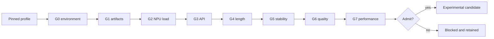

# 8T MindSpore LLM strict test plan

_Case9 canonical runbook for the Ascend310B4/8T board; revision 1.0, 2026-09-05._

---

This document defines the next reproducible test batch for the one physical 8T board.
The current connection endpoint is `192.168.1.90`. `192.168.11.14` and
`192.168.8.178` are historical IP aliases for the same board and remain valid only as
report provenance. Changing an IP or rebooting the board does not create a new hardware
or performance batch.

## 🎯 Scope and decision rules

The objective is to determine which **existing-base MindSpore** profile can pass a
strict text-chat gate on `Ascend310B4`. The Qwen2.5 static-KV ACL service remains the
formal baseline (`8080 -> 7861 -> 7865`); this campaign uses only the candidate chain
(`7868 -> 7867 -> 8090`). Audio, ASR/TTS, XiaoZhi, Torch, Torch-NPU, Transformers,
vLLM, MindIE and dependency upgrades are outside the scope.

The registry currently contains eight executable (`native_mindspore`) profiles and fifteen
metadata-only conditional profiles; six of the conditional rows are new in this batch.
Conditional profiles are visible for research but are not
downloaded, loaded, started or switched by this plan. A successful short generation is
not sufficient for admission: placement, protocol, stability, quality and performance
must all have independent evidence.



## 📋 Fixed board and environment

| Field | Required value |
| --- | --- |
| Canonical host | `192.168.1.90` |
| Historical aliases | `192.168.11.14`, `192.168.8.178` |
| Hardware | `Ascend310B4 / 8T` |
| Environment | existing `base` (label `experimental_dirty_base`) |
| CANN | use the installed version; record it, never replace it |
| Service | one process, one profile, one request at a time |
| Context and decoding | 1024 tokens, batch 1, greedy, `temperature=0`, `top_p=1` |
| Output limit | `max_tokens <= 64` |

Every run gets a UTC `run_id` and an isolated directory:

```text
~/case9-mindspore-chat/
  environment/Ascend310B4/<run-id>/
  artifacts/<profile>/<run-id>/
  reports/Ascend310B4/<profile>/<run-id>/
  logs/<profile>/<run-id>/
```

Before any board command, use the same shell and record the command itself:

```bash
source /usr/local/miniconda3/etc/profile.d/conda.sh
conda activate base
source /usr/local/Ascend/ascend-toolkit/set_env.sh
export PYTHONNOUSERSITE=1
```

If `PYTHONNOUSERSITE=1` hides the already validated MindNLP installation, stop and
record that as an environment observation; do not install a replacement package.

## 🧪 Profile queue

The first eight rows are the only rows eligible for a board attempt. The fifteen
conditional rows (including the six rows added in this batch) are deliberately
metadata-only until a separate
approval changes their candidate kind and supplies verified artifacts.

| Priority | Profile | 8T starting state | Action in this batch |
| ---: | --- | --- | --- |
| 1 | `qwen1.5-0.5b-mindspore` | `blocked` | Recheck only missing strict gates |
| 2 | `tinyllama-1.1b-mindspore` | `blocked` | Preserve English/Chinese failures; no promotion |
| 3 | `deepseek-r1-qwen-1.5b-mindspore` | `experimental_dirty_base` (historical) | Re-run only after G0 and device recovery |
| 4 | `qwen2.5-0.5b-mindspore` | `blocked` | Placement and memory preflight first |
| 5 | `qwen2.5-1.5b-mindspore` | `blocked` | Memory gate first; do not start a service on failure |
| 6 | `qwen3-0.6b-mindspore` | `blocked` | Loader capability check; no package upgrade |
| 7 | `qwen3-1.7b-mindspore` | `not-run`/`blocked` | Loader capability check; no package upgrade |
| 8 | `minicpm3-4b-mindspore` | `not-run` | 8T is out of the official 20T-only scope |
| 9-23 | fifteen conditional profiles (six added in this batch) | `not-run` or `blocked` | Register only; never download or start |

The six conditional profiles are `qwen2-0.5b-instruct-mindspore`,
`qwen2-1.5b-instruct-mindspore`, `qwen2-math-1.5b-instruct-mindspore`,
`qwen2.5-coder-0.5b-instruct-mindspore`, `qwen2.5-math-1.5b-instruct-mindspore` and
`llama3.2-1b-instruct-mindspore`. Their source, license and revision metadata is in
[the search record](42-mindspore-candidate-search-record.md); no artifact hash is
claimed.

## 🔍 Gate protocol

| Gate | Evidence to save | Pass condition |
| --- | --- | --- |
| G0 environment | Python, MindSpore, MindNLP, CANN, `acl`, SoC, memory, disk, HugePages, package list, `npu-smi` | Identity is `Ascend310B4`; existing base is explicitly dirty |
| G1 artifacts | URL, revision, size, SHA-256 and lock file per file | Every declared file is complete and hash-verified |
| G2 load | tokenizer load, model load, context creation, one-token response, PID and NPU snapshots | No CPU fallback; output token is in vocabulary |
| G3 API | `/health`, `/v1/models`, JSON, SSE and malformed-request responses | Contract, model ID and prefix deltas are correct |
| G4 length | Full responses at 8, 16, 32 and 64 tokens | Valid UTF-8, no replacement character, correct finish reason |
| G5 stability | Ten fixed short requests with RSS/FD/NPU before and after | 10/10 success; no crash or sustained growth |
| G6 quality | Ten fixed Chinese prompts and a separate English set | Qwen/DeepSeek target at least 8/10 human-understandable; TinyLlama is reported separately |
| G7 performance | Two warmups plus 30 measurements | First-token, total latency, p50/p95 and token/s are all recorded |
| G8 candidate chain | `7868 -> 7867 -> 8090`, auth, UI, switch and rollback logs | Candidate chain passes while formal ports remain untouched |

The service must reject an over-context prompt rather than silently truncate it. A
client disconnect or watchdog timeout stops the worker and marks it unhealthy. A failed
gate is recorded as `blocked` or `not-run`; it never triggers CPU, cloud, Torch,
MindSpore-upgrade, vLLM or MindIE fallback. `Health: Alarm` is a diagnostic field, not
an automatic failure, but a concrete LPM fault, device reset, allocation failure or
missing ACL evidence stops further heavy tests.

## 🧾 Report contract

Each report must include the profile ID, board host used, SoC, tier, run ID, source
revision, tokenizer revision, CANN/MindSpore/MindNLP versions, artifact hashes, exact
command, process PID, gate status, raw response paths and `npu-smi` before/during/after
files. Use the state vocabulary from `case9_model_profiles.py` only. Do not copy a
result from an IP alias into a new run ID unless a new test actually ran.

The registry is authoritative for admission. A profile can be marked
`experimental_dirty_base` only after all technical gates pass; `admitted` additionally
requires explicit human quality approval with at least 8/10 samples. Conditional
profiles can never be admitted by metadata alone.

## 🛡️ Stop and rollback

1. Stop only the PID recorded for the current candidate batch.
2. Preserve logs, reports, hashes, process snapshots and device diagnostics.
3. Leave `8080 -> 7861 -> 7865` and its model configuration unchanged.
4. Re-enable the last verified candidate only after its own health check; otherwise keep
   the candidate chain fail-closed.
5. Do not remove conda caches, system CANN, OPP, other model files or historical reports.

## 🔗 References

The profile source and loader boundaries follow the [MindSpore Orange Pi online
examples][orange-pi] and the [MindNLP model support documentation][mindnlp]. Model
licenses and immutable revisions are recorded per profile rather than inferred from a
mutable `main` branch.

[orange-pi]: https://github.com/candle-org/orange-pi-mindspore/tree/dev/applications/online
[mindnlp]: https://mindnlp.cqu.ai/
