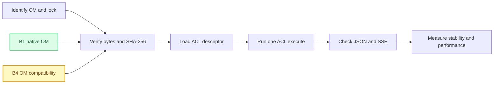

# Case9 20T 全量 LLM OM 测试批次（2026-09-14）

_目标：在当前 20T 板 `192.168.1.95` 上对已识别的 Case9 LLM OM 工件逐个执行原生 ACL 运行验证；本记录在测试开始时建立，只有实际命令、报告和哈希可将门禁状态从 `not-run` 更新。_

---

## 🎯 批次边界

本批次的“全部 OM”仅指 Case9 已有、可追溯身份的五个 **LLM** OM 工件。它不包含其他
sample 的视觉、音频或多模态 OM，也不把 ONNX、Safetensors、MindSpore 权重或不存在的
模型文件计作 OM。

- 目标板：`HwHiAiUser@192.168.1.95`，主机名 `orangepiaipro-20t`
- SoC：`Ascend310B1 / 20T`
- CANN：`8.0.0`；本轮在同一 shell 中显式加载 `set_env.sh`
- 批次根目录：`/home/HwHiAiUser/case9-om-20t-20260914`
- 运行边界：只加载既有 OM 并用原生 ACL 测试；**不运行 ATC、不重新导出 ONNX、不重新转换 OM**
- 正式链路：`8080 -> 7861 -> 7865` 保持不变；候选服务只使用新建的 loopback 临时端口

`npu-smi` 的 `Health: Alarm` 是已知诊断字段。它必须写入环境快照，但不能单独决定
通过或失败。现有 `base` 含有其他实验包，因此本轮 ACL 测试需记录为
`experimental_dirty_base`；测试代码不得导入 Torch、Torch-NPU、MindSpore、vLLM、MindIE
或 ONNX Runtime。



## 📦 工件范围和身份

所有 SHA-256 都是完整工件的既有身份记录，而不是本轮 `.95` 板端验证结果。本轮必须在
目标板再次验证字节数和 SHA-256；只有校验完成才可读取 descriptor 或调用
`acl.mdl.execute`。

| 测试 ID | OM 工件 | 既有来源 | 目标/实验类别 | bytes | SHA-256 | 本轮起始状态 |
| --- | --- | --- | --- | ---: | --- | --- |
| `qwen25-kv1024-b1-native` | `qwen25-static-kv-1024-b1.om` | `repro/qwen25-kv1024-dual-board-20260827/artifacts/om/Ascend310B1/` | `Ascend310B1` 原生候选 | `1,266,009,438` | `6bca884fbce746efdb02f8c9294cad5b2faa6c8b96cac9ec8c83730126298609` | `not-run` |
| `qwen25-kv1024-b4-compat` | `qwen25-static-kv-1024-v2.om` | `repro/qwen25-kv1024-dual-board-20260827/artifacts/om/Ascend310B4/` | B4 到 B1 compatibility experiment | `1,266,010,586` | `f6650e52ff3908288763ef7957832ade606b0e554fa8fde986932f1ca1140eb8` | `not-run` |
| `tinyllama-b4-compat` | `tiny-llama.om` | `repro/tinyllama-hf-upload-20260902/artifacts/om/` | B4 到 B1 compatibility experiment | `1,493,077,371` | `604e47c5b6e1239abcc012d7e8d4be8398465657a142ad59280d2c1917eda967` | `not-run` |
| `qwen25-full2048-b4-compat` | `qwen25-static-2048.om` | 8T 历史部署 `~/case9-qwen25/artifacts/` | B4 到 B1 compatibility experiment | `1,407,111,161` | `dc17b153ee1e76b3d31e971617d1cfdc7c56f366226212a61377a2c85e1d92b8` | `not-run` |
| `qwen25-lastlogits2048-b4-compat` | `qwen25-static-2048-last-retry2.om` | 8T 历史部署 `~/case9-qwen25/artifacts/optimized-last-logits/` | B4 到 B1 compatibility experiment | `1,407,130,895` | `ae196fd8ba4ccb7c721f8fcb9d0ff4d9b5b72bfcdf9a77309c6fe51d5103c460` | `not-run` |

`qwen25-kv1024-b1-native` 是本轮唯一可作为 20T 原生 OM 验证的组合。其余四项即使
descriptor、ACL execute 或 API 成功，也只能被记录为跨 SoC 兼容性观察，不能替换 B1
工件、不能用于正式提升，也不能与 B1 性能数据合并排名。

TinyLlama 的历史工件还需要与匹配 tokenizer 一起校验。它已知不满足中文质量和长输出
准入条件；本轮 ACL 运行测试只能复核该 OM 在此硬件组合上的执行行为，不会解除这些
历史质量限制。详细边界见 [TinyLlama 发布记录](29-tinyllama-huggingface-publication.md)。

## 🧪 环境快照和运行约束

本批次开始前的板端只读检查已观察到：`acl` 在加载 CANN 环境后可导入，Python 为
`3.9.2`，可用磁盘约 `81 GiB`，可用系统内存约 `21 GiB`，设备显存约 `23,673 MiB`。
这些是环境前提，不是任一模型已经加载或已经生成文本的证据。

每次运行在新 shell 中使用下列最小环境；命令不得修改 `.bashrc`、系统 CANN、驱动、
OPP 或已有模型目录：

```bash
source /usr/local/miniconda3/etc/profile.d/conda.sh
conda activate base
source /usr/local/Ascend/ascend-toolkit/set_env.sh
export PYTHONNOUSERSITE=1
```

若需要 `tokenizers`，它只能装入批次根下的隔离 overlay，并通过显式 `PYTHONPATH` 使用；
不修改 `base`。每个 artifact 的 tokenizer、contract、lock、运行脚本和报告路径必须与
该 OM 一起写入同一时间戳目录。

## 📋 门禁和记录格式

每个工件使用独立 `run_id`，并保留如下最小证据集合：

```text
reports/<run_id>/
  environment.json
  artifacts.json
  descriptor.json
  acl-smoke.json
  api.json
  stability.json
  performance.json
  npu-before.txt
  npu-during.txt
  npu-after.txt
  command.txt
  service.log
```

| 门 | 验收内容 | 起始状态 | 通过后允许的下一步 |
| --- | --- | --- | --- |
| G0 | 来源、lock、字节数、SHA-256、tokenizer 与 contract 完整 | `not-run` | ACL descriptor |
| G1 | CANN、ACL、SoC、内存、磁盘、污染包和 `npu-smi` 快照 | `not-run` | 模型加载 |
| G2 | `acl.init`、device/context、OM load 和 descriptor 完整记录 | `not-run` | 单 token execute |
| G3 | 一次同步 `acl.mdl.execute`、有限 logits 和合法 token | `not-run` | 临时 HTTP 服务 |
| G4 | loopback `/health`、`/v1/models`、JSON completion、SSE completion | `not-run` | 长输出与异常路径 |
| G5 | 合同允许范围内的长输出、UTF-8、EOS/length 和客户端中断处理 | `not-run` | 稳定性 |
| G6 | 连续 10 轮、PID、RSS、FD、NPU 内存和清理观察 | `not-run` | 性能测量 |
| G7 | 2 次预热、30 次串行测量的首 token、总时延、token/s、p50/p95 | `not-run` | 单工件结论 |
| G8 | 推理前、中、后 `npu-smi` 与服务日志共同证明实际 NPU 执行 | `not-run` | 汇总到证据索引 |

G0 或 G1 未通过时，标记该工件为 `blocked` 并停止该工件的后续门；G2 到 G8 任一失败时
保留完整日志、状态和已通过门，不改用 CPU、云端、其他推理框架或重新 ATC。传输中断只
保留 `.part` 文件，不得把部分文件登记为模型或推断为 hash 通过。

## 🧭 执行顺序

1. 先同步并验证 `qwen25-kv1024-b1-native` 及其 B1 contract、lock 和 Qwen tokenizer。
2. 在候选 loopback 端口完成 B1 原生的 G0 到 G8；不改变正式服务端口。
3. 逐项复制、重新校验并运行本地复现包已具备的两个 B4 compatibility OM（静态 KV 和
   TinyLlama）；每一项均新建服务进程和时间戳目录，前一项结束后确认其 PID 与 device
   资源已释放。
4. 最后取得两项历史 2048 B4 OM 的实际文件、各自 contract 和运行所需 tokenizer；只在
   G0 身份通过后执行对应的 legacy runtime 测试。
5. 将每次实际结果追加到本文件，并把可复核报告路径、字节数、SHA-256 和失败日志登记到
   [Case9 证据索引](12-case9-evidence-index.md)。

历史 `.210` 的 20T 记录可作为背景和对照，但不能替代本批次 `.95` 上的原始报告。历史
性能也不能填入 G7；本轮必须以同一工件、实际运行时、明确 warmup/loops 和新的原始时间戳
报告重新计算。

## 已观测的 20T 测试结果

以下结果均在 `2026-09-14` 的 `192.168.1.95` / `orangepiaipro-20t` 上实际执行。板端为
`Ascend310B1 / 20T`，CANN 为 `8.0.0`，Python 为 `3.9.2`。`base` 已存在
Torch、Torch-NPU、Torchaudio 和 MindSpore；本轮 ACL 路径未导入这些包，但必须标为
`experimental_dirty_base`，不能据此提升为生产环境结论。

| 测试 ID | 板端工件哈希门 | ACL descriptor | 实际生成 | API/稳定性/性能 | 本轮结论 |
| --- | --- | --- | --- | --- | --- |
| `qwen25-kv1024-b1-native` | 通过，`6bca884f...6298609` | 通过，51 输入/49 输出 | 通过 | 完整通过 | 原生 20T 实验结果 |
| `qwen25-kv1024-b4-compat` | 通过，`f6650e52...1140eb8` | 通过 | 通过，1 token，`你好` | 未运行 | B4 到 B1 compatibility experiment |
| `tinyllama-b4-compat` | 通过，`604e47c5...eda967` | 通过，4 输入/3 输出 | 通过，1 token | 未运行 | B4 到 B1 compatibility experiment；不准入中文聊天 |
| `qwen25-full2048-b4-compat` | 未开始 | 未开始 | 未开始 | 未开始 | `blocked`：目标板、本地复现包均无工件；原 8T `.90` 和 HF 清单当前不可达 |
| `qwen25-lastlogits2048-b4-compat` | 未开始 | 未开始 | 未开始 | 未开始 | `blocked`：目标板、本地复现包均无工件；原 8T `.90` 和 HF 清单当前不可达 |

### B1 原生 Qwen2.5 Static-KV 1024

工件、tokenizer、controller contract、runtime contract 和本轮 campaign lock 全部在板端完成
字节数与 SHA-256 校验。原生 ACL descriptor probe 成功，基础输入为
`input_ids [1,1] int64`、`attention_mask [1,1024] int64`、`position_ids [1,1] int64`，并有
48 个分层 KV 输入；共记录 51 个输入和 49 个输出。

候选服务仅监听 `127.0.0.1:18101`，未改动正式 `8080 -> 7861 -> 7865` 链路。JSON、SSE、
非法请求和协议边界检查均通过；SSE delta 未重复。运行中 `npu-smi` 记录到 AICore `68--85%`，
因此不是 CPU fallback。测试进程退出后没有残留候选服务进程，AICore 回到 `0%`。

| 项目 | 实测值 |
| --- | --- |
| 长输出 | `max_tokens=8/16/24/32` 全部通过；32-token 请求实际产生 31 token，以 EOS 正常停止，UTF-8 完整 |
| 稳定性 | 10/10 短请求成功；每轮 2 token，约 `6.38 s` |
| 中文探测 | 10/10 机器协议检查通过；未进行人工 `8/10` 质量评级，不能写为中文质量准入 |
| 性能协议 | 2 次预热、30 次串行 SSE、每请求 2 token |
| 首事件延迟 | p50 `4721.046 ms`，p95 `4736.121 ms` |
| 总延迟 | p50 `4734.774 ms`，p95 `4749.877 ms` |
| 吞吐 | p50 `0.422 token/s`，p95 `0.423 token/s` |

原始报告在板端：
`/home/HwHiAiUser/case9-om-20t-20260914/reports/qwen25-b1-native-acceptance/full-20260914/`。
明确 allowlist 回传的副本在本地忽略目录：
`repro/qwen25-kv1024-dual-board-20260827/reports/board20t/20260914-full/full-20260914/`。

### B4 跨 SoC 工件

Qwen2.5 B4 Static-KV OM 的历史锁文件早于 `soc_version` 字段，但其不可变 `atc_command`
明确记录 `--soc_version=Ascend310B4`。运行时仅在显式
`--compatibility-experiment` 下从该字段识别源 SoC，并在健康状态保留
`compatibility_experiment=true`；原生 B1 admission 仍要求锁文件直接含有 SoC 字段。

TinyLlama 的 descriptor 和一 token execute 均成功，但输出是换行符，且该模型历史上没有通过
中文质量与长输出准入。它只证明此 B4 OM 可以在本次 B1/CANN 组合执行一次，不能证明中文聊天
能力或性能稳定性。

### 未取得的 2048 工件

本轮没有重新 ATC。目标板在 `/home/HwHiAiUser` 的定向查询没有找到 `qwen25-static-2048.om`
或 `qwen25-static-2048-last-retry2.om`；控制机复现包也没有这两份文件。历史 8T 来源
`192.168.1.90` 的 SSH 和 Hugging Face 仓库清单查询在本次检查时均超时。因此它们的状态是
工件获取阻断，而不是 OM、ACL、模型或 20T 硬件不支持。取得原始文件、contract 和 tokenizer
后，必须先重复 G0，再运行专用 legacy compatibility runner。

## 🔗 已有证据和后续更新

- B1/B4 静态 KV 工件、双板边界和历史报告：[Qwen2.5 双板验证](01-qwen25-dual-board-validation.md)、[复现与同步](02-qwen25-reproducibility-and-sync.md)
- 当前 `.95` 的历史身份检查和旧批次缺口：[双板缺口验证记录](28-case9-dual-board-gap-validation-record.md)
- B4 full-context 和 last-logits 的历史转换、ACL 与性能边界：[归档优化记录](archive/20260827/16-qwen25-optimization-research-and-last-logits-validation.md)
- 全部 Case9 证据入口：[Case9 证据索引](12-case9-evidence-index.md)

本文件建立时，本批次没有记录任何新的 OM descriptor、ACL execute、API、稳定性或性能
通过结果。后续只追加由 `192.168.1.95` 实际执行产生的报告；若缺少工件、网络传输中断、
ACL 初始化失败或服务异常，按具体门记录 `blocked` 或 `failed`，不扩大为其他板、其他
OM 或其他框架的不支持结论。
