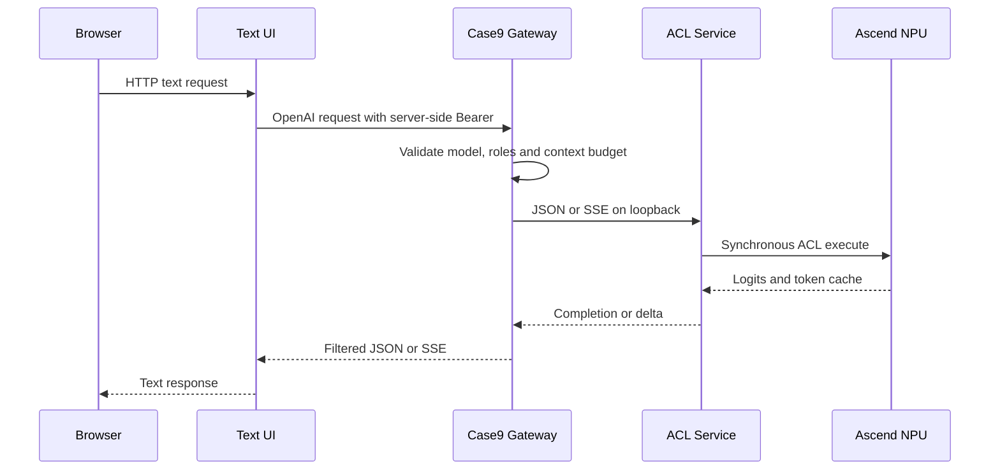

# Case9 当前运行手册：双板 Qwen2.5 静态 KV 文本链路

_面向 2026-08-27 的文本 LLM 复现与验收；音频、ASR/TTS 和 XiaoZhi 服务端仍暂停。_

---

## 📍 当前范围

本手册只描述 Qwen2.5-0.5B 静态 KV 文本链路。网关保持 OpenAI Chat
Completions 兼容协议，浏览器文字页面是独立客户端；浏览器页面不是 XiaoZhi
ESP32 的设备协议服务端。XiaoZhi 的 WebSocket、Opus、ASR、TTS、OTA 和设备会话
仍由未来单独审核的服务端负责[^1]。

| 板卡 | 芯片与算力 | 当前证据 | 当前结论 |
| --- | --- | --- | --- |
| `192.168.1.90` | `Ascend310B4 / 8T`，CANN `8.0.0` | 静态 KV 的 ONNX、ATC、OM、ACL/NPU、JSON/SSE、网关/UI 和中文探测均有历史报告 | 历史正式链路；重启后不假定进程仍在运行 |
| `192.168.8.178` | `Ascend310B4 / 8T`，CANN `8.0.0` | 复现包、契约、ACL smoke 和候选 API 已通过 | 替换板候选；正式网关/UI和中文质量尚未重新验收 |
| `192.168.8.210` | `Ascend310B1 / 20T`，CANN `8.0.0` | B1 专用 OM、descriptor、ACL smoke、JSON/SSE 和短协议测速通过 | **实验性**；干净环境、长输出、稳定性、中文质量和正式链路仍缺失 |

状态标签的含义是：`artifact_verified` 只代表字节和哈希，
`descriptor_verified` 代表 OM 描述符符合契约，`acl_smoke_passed` 代表至少一次
真实 ACL execute，`api_passed` 代表 JSON/SSE 协议，不能单独推出中文质量或生产可用性。
完整证据索引见 [`12-case9-evidence-index.md`](12-case9-evidence-index.md)。

## 🧭 架构与端口

正式文本链路（历史 B4 证据）和候选隔离链路使用不同端口。ACL 服务只绑定
loopback；网关 token 只存在板端进程环境，浏览器不接触 token。



| 用途 | UI | 网关 | ACL | 对外地址 |
| --- | --- | --- | --- | --- |
| 历史正式 B4 | `7865` | `127.0.0.1:7861` | `127.0.0.1:8080` | `http://<board-ip>:7865/` |
| 候选隔离 | `7868` | `127.0.0.1:7867` | `127.0.0.1:8084` | `http://<board-ip>:7868/` |
| 音频实验（暂停） | `7862` | 取决于 `.env` | 取决于 `.env` | 不属于本手册 |

候选端口通过全部门禁前不得覆盖 `8080`、`7861` 或 `7865`。当前 20T 的
`8084`、`8080`、`7861` 和 `7865` 在最近一批测试结束后均无监听；启动前必须
重新检查，不要根据旧 PID 或旧报告猜测服务状态。

## 🧰 前置条件

### 板端条件

- 在目标板确认 `aarch64`、`npu-smi` 芯片型号、驱动和 CANN `8.0.0`。
- 使用 Python 3.9 的独立 `case9-acl-om` 环境；20T 当前 `base` 结果仅是显式
  dirty-base 实验，不是正式环境。
- 在同一个 shell 中 source conda 和 CANN，设置 `PYTHONNOUSERSITE=1`。
- 运行时只允许 NumPy、`tokenizers`、PyACL 和标准库；禁止在板端安装或导入
  `torch`、`torch_npu`、`torchaudio`、`transformers`、`onnxruntime`、
  MindSpore、MindTorch、vLLM 或 MindIE。
- 不升级、覆盖或删除系统 CANN、驱动、OPP 或 conda `base` 中的既有包。

### 控制机条件

Windows 的 `sci-agent` 环境仅用于 checkpoint 导出、ONNX checker、CPU 参考和
前端构建。控制机上的 Torch/Transformers/ONNX Runtime 不得同步到板端运行目录。
模型、ONNX、OM、日志和报告默认位于被 Git 忽略的复现包中，不提交仓库。

## 🔐 板端门禁

以下命令使用归档包中的 canonical 入口。每次更换板卡都要使用新的绝对
`OUTPUT_ROOT`，不能覆盖旧报告。

```bash
cd ~/case9-qwen25-kv1024-20260825
chmod +x scripts/*.sh src-board/*.sh src-board/scripts/*.sh src-gateway-ui/scripts/*.sh
bash scripts/verify_all_hashes.sh

source /usr/local/miniconda3/etc/profile.d/conda.sh
conda activate case9-acl-om
source /usr/local/Ascend/ascend-toolkit/set_env.sh
export PYTHONNOUSERSITE=1
export CASE9_QWEN25_KV_ROOT="$PWD"
export CASE9_QWEN25_KV_BOARD_ID="<board-ip-or-id>"
export CASE9_QWEN25_KV_SOC_VERSION="Ascend310B4"  # 20T/B1 改为 Ascend310B1
export CASE9_QWEN25_KV_OUTPUT_ROOT="$PWD/run/replacement/$CASE9_QWEN25_KV_BOARD_ID/$(date -u +%Y%m%dT%H%M%SZ)"
export PYTHONPATH="$PWD/src-board${PYTHONPATH:+:$PYTHONPATH}"

bash src-board/provision_qwen25_kv102_board.sh check
bash src-board/provision_qwen25_kv102_board.sh inspect
```

`check` 会记录芯片、CANN、ACL、磁盘、内存和禁止包；`inspect` 会以完整文件
哈希复核控制机契约。`convert` 必须从已检查的 contract 派生 `input_shape`，不能
手写另一套 KV 形状：

```bash
export CASE9_QWEN25_KV_OM_PREFIX="$CASE9_QWEN25_KV_OUTPUT_ROOT/artifacts/rebuilt-qwen25-static-kv-1024"
export CASE9_QWEN25_KV_OM_CONTRACT="$CASE9_QWEN25_KV_OUTPUT_ROOT/contracts/rebuilt-qwen25-static-kv-1024-om-contract.json"
bash src-board/provision_qwen25_kv102_board.sh convert
export CASE9_QWEN25_KV_OM="$CASE9_QWEN25_KV_OM_PREFIX.om"
bash src-board/provision_qwen25_kv102_board.sh smoke
```

在 20T/B1 上优先使用按 `Ascend310B1` 重新生成的 B1 OM；如果使用已有 B1 OM，
必须同时设置 `CASE9_QWEN25_KV_OM` 和匹配的
`CASE9_QWEN25_KV_OM_CONTRACT`。归档 B4 OM 不得静默成为 B1 的正式工件。CANN
的转换目标应与部署芯片绑定[^2]；本次交叉加载成功只是一项明确记录的例外。

20T 当前若只能使用用户明确授权的 `base`，命令必须显式标记实验性：

```bash
export CASE9_QWEN25_KV_ENV=base
export CASE9_QWEN25_KV_ALLOW_DIRTY_BASE=1
```

这两个变量不会删除 `base` 中的包，也不会把结果升级为生产验收。正式门禁需要
干净的专用环境；禁止为了通过检查而卸载用户已有包或安装 Torch 系列包。

## 🧪 候选服务与 API

通过 `smoke` 后，先在 `127.0.0.1:8084` 启动候选服务。服务使用
`qwen2.5-0.5b-instruct-static-kv-1024-fp32-acl-om`，batch 固定为 1，greedy
解码，最大 `max_tokens` 由启动参数明确记录（当前 canonical provisioner 的
`serve` 路径传入 32；独立 wrapper 默认上限为 80，二者不能混写）。

```bash
export QWEN25_ROOT="$PWD"
export QWEN25_KV_OM="$CASE9_QWEN25_KV_OM"
export QWEN25_KV_CONTRACT="$CASE9_QWEN25_KV_OM_CONTRACT"
export QWEN25_KV_TOKENIZER="$PWD/artifacts/tokenizer.json"
export QWEN25_KV_TOKENIZER_CONFIG="$PWD/artifacts/tokenizer_config.json"
export CASE9_QWEN25_KV_ENV="${CASE9_QWEN25_KV_ENV:-case9-acl-om}"
bash src-board/scripts/run_qwen25_kv_acl_service.sh
```

另开 SSH 会话执行最小 API 检查。直接 ACL API 不要求 Bearer；网关 API 另有
鉴权，不要把下面的直接地址暴露给局域网：

```bash
curl -fsS http://127.0.0.1:8084/health
curl -fsS http://127.0.0.1:8084/v1/models
curl -fsS -H 'Content-Type: application/json' \
  -d '{"model":"qwen2.5-0.5b-instruct-static-kv-1024-fp32-acl-om","messages":[{"role":"user","content":"你好"}],"stream":false,"max_tokens":2,"temperature":0,"top_p":1}' \
  http://127.0.0.1:8084/v1/chat/completions
curl -N -H 'Content-Type: application/json' \
  -d '{"model":"qwen2.5-0.5b-instruct-static-kv-1024-fp32-acl-om","messages":[{"role":"user","content":"你好"}],"stream":true,"max_tokens":2,"temperature":0,"top_p":1}' \
  http://127.0.0.1:8084/v1/chat/completions
```

短请求通过不等于长输出可用。当前 20T 只有 `max_tokens=2` 的 1 次预热加 5 次
测量：JSON p50/p95 为 `7751.579/7751.770 ms`，SSE 总耗时 p50/p95 为
`7789.273/7792.435 ms`。单 token 执行耗时较高，32 或 80 token 可能需要数分钟；
在长输出连续性和句末策略验证前，不要把页面显示的半段文字当成完整答案。

## 🚦 网关与文字页面

只有候选 ACL 的健康、JSON、SSE、长输出和资源检查均通过后，才允许启动网关。
当前 20T 不满足正式切换条件，因此本节只给出端口和配置契约，不宣称已运行。

候选配置应固定为：

```dotenv
UPSTREAM_BASE_URL=http://127.0.0.1:8084/v1
UPSTREAM_MODEL=qwen2.5-0.5b-instruct-static-kv-1024-fp32-acl-om
RAG_ENABLED=false
MAX_CONCURRENT_REQUESTS=1
PUBLIC_MODEL_ID=case9-rag
```

候选网关是 `127.0.0.1:7867`，候选文字页面是 `0.0.0.0:7868`；页面没有浏览器
鉴权，同一局域网主机可发送文本。归档中 `src-board` 下的旧候选 wrapper 仍有
路径问题（会寻找不存在的 `scripts/run_xiaozhi_gateway.sh` 或
`scripts/run_text_chat.sh`），在修正并重新计算源码哈希前不要直接引用它们。
复现包的 `scripts/run_repro_chain.sh` 目前直接启动 `src-gateway-ui`，但硬编码
`case9-acl-om` 和 `case9-local-chat`；20T 的 `base` overlay 不能据此声称正式链路。

历史 B4 正式配置为：

```dotenv
UPSTREAM_BASE_URL=http://127.0.0.1:8080/v1
UPSTREAM_MODEL=qwen2.5-0.5b-instruct-static-kv-1024-fp32-acl-om
RAG_ENABLED=false
MAX_CONCURRENT_REQUESTS=1
```

公开模型名始终是 `case9-rag`。固定上下文模型只接受 `temperature=0`、
`top_p=1`，网关字符预算和 ACL token 预算都必须同时满足。RAG 注入在静态 KV
验收阶段关闭，以免检索片段挤占 1024 token 上限。

## 🧯 停止、回滚与故障边界

- 只停止本次运行明确记录的 PID；不要使用宽泛的 `pkill python`。
- 复现包链路使用 `bash scripts/stop_repro_chain.sh`，该脚本只处理包内 PID
  文件且会核对命令行路径。
- 候选服务异常时，先保存服务日志、OM/contract 哈希和 `npu-smi` 快照，再停止
  候选 PID；不要覆盖历史 OM 或报告。
- ATC、ACL、descriptor、数值、长输出或 API 任一门失败，都停留在候选状态；
  不自动切换 CPU、云端、Torch、MindSpore、vLLM 或其他模型。
- `Health: Alarm` 是诊断字段，不单独阻断测试；真实 ACL 初始化失败、设备丢失、
  进程崩溃、非零 ATC、contract 不匹配或资源持续增长才是具体失败证据。

## 📊 验收清单

| 门 | 20T 当前状态 | 下一步 |
| --- | --- | --- |
| 工件与哈希 | 通过 | 继续保留 B1 OM lock |
| ONNX/OM descriptor | 通过 | 记录每次新板 descriptor |
| ACL smoke/NPU | 通过（短请求） | 增加长输出和 EOS/reset |
| JSON/SSE | 通过（1+5 短协议） | 做完整 API 回归 |
| 中文质量 | 未执行 | 10 条探测，至少 8/10 可理解 |
| 长输出连续性 | 未执行 | 32/80 token 与 finish reason |
| RSS/FD/NPU 稳定性 | 未执行 | 连续 10 轮前后快照 |
| 网关/UI | 未执行 | 候选 7867/7868，再考虑正式端口 |
| 干净 Python 环境 | 未通过 | 创建专用环境，不改 base |
| XiaoZhi/音频 | 暂停 | 等文本模型和无 Torch 语音方案分别通过 |

## 🔗 参考资料

- 详细双板数据：[01-qwen25-dual-board-validation.md](01-qwen25-dual-board-validation.md)
- 复现包与同步：[02-qwen25-reproducibility-and-sync.md](02-qwen25-reproducibility-and-sync.md)
- 历史候选和暂停边界：[03-case9-history-and-boundaries.md](03-case9-history-and-boundaries.md)
- 项目证据索引：[12-case9-evidence-index.md](12-case9-evidence-index.md)
- Qwen2.5 静态 KV 验证：[18-qwen25-static-kv-1024-validation-record.md](18-qwen25-static-kv-1024-validation-record.md)
- 20T 性能记录：[21-qwen25-20t-performance-comparison.md](21-qwen25-20t-performance-comparison.md)
- 跨板 OM 记录：[22-qwen25-cross-board-om-validation.md](22-qwen25-cross-board-om-validation.md)

[^1]: xinnan-tech. (2026). "xiaozhi-esp32-server." https://github.com/xinnan-tech/xiaozhi-esp32-server
[^2]: Huawei Ascend. (2024). "ATC 参数说明：soc_version." https://www.hiascend.com/document/detail/en/canncommercial/800/devaids/atc/atlasatcparam_16_0036.html
