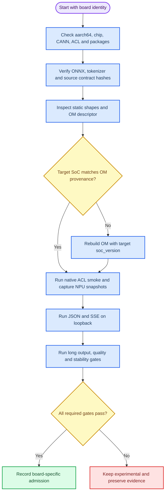

# Qwen2.5 静态 KV 双板验证记录

_记录日期：2026-08-27；本文件只汇总已有板端证据，不替代下一轮 20T 验收。_

---

## 📋 记录范围

本记录把同一 Qwen2.5 静态 KV 图在两种 Ascend 310B 芯片上的结果分开呈现。所有
请求均为 batch 1、greedy 解码；短请求结果只能证明相应工件在相应环境中完成了
ACL/API 操作，不能推出长文本质量、长期稳定性或任意 OM 的跨 SoC 可移植性。

| 证据集 | 地址 | 芯片 | CANN | Python 环境 | 判定 |
| --- | --- | --- | --- | --- | --- |
| B4 历史正式 | `192.168.1.90` | `Ascend310B4 / 8T` | `8.0.0` | `case9-acl-om`，3.9.16 | 静态 KV 已完成正式入口和中文探测；当前不假定服务仍在线 |
| B4 替换板 | `192.168.8.178` | `Ascend310B4 / 8T` | `8.0.0` | 3.9.25 观测 | 复现包、契约、ACL smoke、候选 API 通过；正式网关/UI未重跑 |
| B1 20T | `192.168.8.210` | `Ascend310B1 / 20T` | `8.0.0` | `base` 3.9.2 + 用户 overlay | B1 OM 短请求实验通过；dirty-base，未正式接纳 |

`npu-smi` 在两类板卡均报告过 `Health: Alarm`。项目规则把它作为诊断字段；本记录
仍要求独立保存 ACL 初始化、descriptor、execute、进程和 `npu-smi` 证据，不以忽略
警报来替代任何门禁。

## 🧱 工件和契约

两块板使用相同的单文件 ONNX、tokenizer 和静态 KV contract。OM 是按目标芯片由
ATC 生成的二进制，优先按部署芯片重新生成并锁定；B1/B4 的 OM 字节不同是预期的。

| 工件 | B4 值 | B1 值 |
| --- | --- | --- |
| ONNX | `1,261,082,122` bytes；`b4870df5da9c8cbef4163ceb65d4dc13433f2fd8ed5d2083ef3223d07d1a3c0e` | 相同 |
| tokenizer | `7,031,645` bytes；`c0382117ea329cdf097041132f6d735924b697924d6f6fc3945713e96ce87539` | 相同 |
| B4 OM | `1,266,010,586` bytes；`f6650e52ff3908288763ef7957832ade606b0e554fa8fde986932f1ca1140eb8` | 不适合作为默认 B1 工件 |
| B1 OM | 不适合作为默认 B4 工件 | `1,266,009,438` bytes；`6bca884fbce746efdb02f8c9294cad5b2faa6c8b96cac9ec8c83730126298609` |
| 模型 ID | `qwen2.5-0.5b-instruct-static-kv-1024-fp32-acl-om` | 相同 |

OM descriptor 的共同契约为 51 个输入、49 个输出：3 个基础输入、48 个 split
key/value cache 输入、1 个 logits 输出和 48 个单 token cache 输出。

| 张量组 | dtype | shape | 数量 |
| --- | --- | --- | ---: |
| `input_ids` | `int64` | `[1,1]` | 1 |
| `attention_mask` | `int64` | `[1,1024]` | 1 |
| `position_ids` | `int64` | `[1,1]` | 1 |
| past cache | `float32` | `[1,2,1024,64]` | 48 |
| logits | `float32` | `[1,1,151936]` | 1 |
| token cache | `float32` | `[1,1,2,64]` | 48 |

契约和 OM descriptor 必须按 ATC 实际输出顺序保存，不能按文件名或上游示例猜测
cache 索引。tokenizer 词表实测小于 logits 维度；运行时必须拒绝越界 token ID。

## 🔁 验证流程

下图表示每块板都必须独立完成的门禁顺序；历史报告不能跳过当前板的 `check` 和
`smoke`。



## ⏱️ 固定测速协议

短协议用于复现硬件差异，不是生产吞吐基准：

| 参数 | 固定值 |
| --- | --- |
| Prompt | `你好，请用一句话介绍你自己。` |
| Endpoint | `POST /v1/chat/completions` |
| `stream` | JSON 与 SSE 分别测试 |
| `max_tokens` | `2` |
| `temperature` | `0` |
| `top_p` | `1` |
| 预热/测量 | 1 次 / 5 次 |
| 并发 | 1 个进程、1 个请求串行 |
| 百分位 | lower-index，`floor((n-1)*q)` |

### 同一 B1 OM 的双板结果

这是按 `Ascend310B1` 生成的 B1 OM 在两块板上运行的对照。B4 一侧是交叉加载
实验，不应替代 B4 专用 ATC provenance。

| 板卡 | JSON p50 (ms) | JSON p95 (ms) | SSE 总耗时 p50 (ms) | SSE 首事件 p50 (ms) | 成功率 |
| --- | ---: | ---: | ---: | ---: | --- |
| B4 / 8T `.90` | `10285.786` | `10303.100` | `10302.362` | `10170.613` | JSON/SSE `5/5` |
| B1 / 20T `.210` | `7679.848` | `7696.983` | `7697.568` | `7576.490` | JSON/SSE `5/5` |

### 同一 B4 OM 的双板结果

这是同一 SHA 为 `f6650e52...40eb8` 的 B4 OM 在两块板上的交叉加载记录：

| 板卡 | JSON p50 (ms) | JSON p95 (ms) | SSE 总耗时 p50 (ms) | SSE 首事件 p50 (ms) | 成功率 |
| --- | ---: | ---: | ---: | ---: | --- |
| B4 / 8T `.90` | `10375.744` | `10377.640` | `10344.559` | `10212.736` | JSON/SSE `5/5` |
| B1 / 20T `.210` | `7678.424` | `7737.832` | `7709.688` | `7584.653` | JSON/SSE `5/5` |

两组结果都只含 5 次测量，响应文本为 `我是Q`，completion 为 2 token，
`finish_reason=length`。因此可支持的结论是：本批次两个具体 OM 在当前驱动、CANN
和 runtime 组合下完成了短请求，20T 短请求耗时较低；不能支持长文本中文质量、
任意 OM 跨 SoC 复用或长期稳定性结论。

## 🧪 20T 当前门禁状态

`192.168.8.210` 的 B1 专用 OM 结果如下。原始文件位置和 SHA 见
[`21-qwen25-20t-performance-comparison.md`](21-qwen25-20t-performance-comparison.md)。

| 门 | 状态 | 证据边界 |
| --- | --- | --- |
| 工件完整性 | `passed` | ONNX、tokenizer、B1 OM 和 lock 有字节/SHA |
| 静态/descriptor | `passed` | 51 inputs / 49 outputs，48 cache pairs |
| ACL smoke | `passed` | `你好！`，2 tokens |
| NPU 执行 | `passed experimentally` | 有 ACL execute 和 before/during/after 快照 |
| JSON/SSE | `passed experimentally` | 候选 `127.0.0.1:8084`，短协议 5/5 |
| 干净环境 | `not passed` | `base` 可发现既有 Torch、Torch-NPU、Torchaudio、MindSpore |
| 长输出连续性 | `not run` | 尚无 32/80 token 的完整 finish 证据 |
| 中文质量 | `not run` | 尚无 10 条探测集 |
| 10 轮资源稳定性 | `not run` | 尚无 RSS/FD/NPU 内存长期记录 |
| 网关/UI | `not run` | 未完成 `8080 -> 7861 -> 7865` 或候选 7867/7868 |

所以当前正式表述必须是：**20T/B1 静态 KV 文本 API 的短请求实验通过，但模型尚未
正式接纳**。不得把 8T/B4 的中文 `8/10` 或正式 UI 结果回填到 20T。

## 🗂️ 证据位置和复现字段

双板原始证据保留在复现包的 board-specific 目录，以及：

- [`20-qwen25-kv1024-reproducibility-bundle.md`](20-qwen25-kv1024-reproducibility-bundle.md)
- [`21-qwen25-20t-performance-comparison.md`](21-qwen25-20t-performance-comparison.md)
- [`22-qwen25-cross-board-om-validation.md`](22-qwen25-cross-board-om-validation.md)

每次新板测试至少记录以下字段，并把日志路径写入同一批报告：

```text
board_ip / hostname / chip / tier
cann_version / driver / kernel / python_prefix
source_file_sha256 / onnx_sha256 / tokenizer_sha256
om_bytes / om_sha256 / atc_soc_version / om_lock_sha256
contract_sha256 / descriptor_sha256
exact_command / exit_code / pid / port
prompt / max_tokens / temperature / top_p / warmup / loops
raw_report_path / npu_before / npu_during / npu_after
```

## ⚠️ 限制和风险

- B1 与 B4 应分别用 `Ascend310B1`、`Ascend310B4` 生成和锁定 OM；交叉加载成功是
  兼容性例外，不是通用保证。
- 20T 当前结果在 dirty `base` 上取得。不能通过删除既有包来伪造干净环境，也不能
  在板端安装 Torch、Torch-NPU、Torchaudio 或其他推理框架。
- 同步 ACL execute 可能让单 token 延迟达到数秒；浏览器在长输出期间等待较久不等于
  NPU 停止。应记录超时和 finish reason，而不是自动重试造成重复生成。
- `Health: Alarm`、during 采样的 AICore 低值或设备内存变化都要原样保留；它们需要
  与 ACL 成功和资源释放证据一起解释。

## 🔗 相关记录

- 当前运行手册：[00-case9-current-runbook.md](00-case9-current-runbook.md)
- 复现与同步：[02-qwen25-reproducibility-and-sync.md](02-qwen25-reproducibility-and-sync.md)
- 历史边界：[03-case9-history-and-boundaries.md](03-case9-history-and-boundaries.md)
- 完整证据索引：[12-case9-evidence-index.md](12-case9-evidence-index.md)
