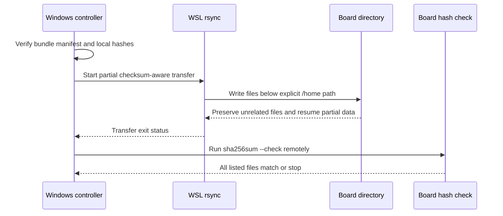

# Qwen2.5 复现包与双板同步规范

_定义从 Windows `sci-agent` 到 Ascend 310B 板端的可重复传输、校验和回滚边界。_

---

## 📦 复现包范围

完整复现包位于被 Git 忽略的 `repro/qwen25-kv1024-20260825/`，包含控制机导出
工具、单文件 ONNX、tokenizer、B4 历史 OM、板端 ACL runtime、网关/UI 源码快照、
环境锁和历史报告。模型数据约 4.46 GiB；`SHA256SUMS.txt` 和
`bundle-manifest.json` 是包内清单，不是板卡兼容性声明。

| 目录 | 用途 | 是否同步到运行环境 |
| --- | --- | --- |
| `artifacts/` | ONNX、tokenizer、历史 B4 OM 和 lock | 是，按目标板选择 |
| `source-model/` | 控制机 checkpoint、配置和许可证 | 仅控制机；不在板端推理 |
| `contracts/` | ONNX contract 与历史 OM descriptor | 只读输入/参考 |
| `controller/` | `sci-agent` 导出、检查、CPU 对照工具 | 仅控制机 |
| `src-board/` | ACL runtime、service、provision 脚本 | 是 |
| `src-gateway-ui/` | 网关、文字 UI 和依赖快照 | 通过门禁后使用 |
| `environment/` | 版本、pip freeze、conda explicit 记录 | 记录参考，不自动安装 |
| `reports/`、`logs/` | 历史证据 | 保留，不覆盖 |

复现包不包含系统 CANN、驱动、固件、API key、运行时 `.env`、PID 文件或开机自启
配置。新板必须重新执行环境检查、OM descriptor、ACL smoke 和 API 验收；复制报告
只能证明 provenance，不能替代新板证据。

## 🔐 工件身份

| 工件 | 来源/版本 | bytes | SHA-256 | 绑定范围 |
| --- | --- | ---: | --- | --- |
| `qwen25-static-kv-1024-v2.onnx` | Qwen2.5-0.5B-Instruct；`modelscope:13448952dbdab7a1627d0680ecd207535d889a23` | `1,261,082,122` | `b4870df5da9c8cbef4163ceb65d4dc13433f2fd8ed5d2083ef3223d07d1a3c0e` | 控制机导出图；B1/B4 共用 |
| `tokenizer.json` | 同一模型来源 | `7,031,645` | `c0382117ea329cdf097041132f6d735924b697924d6f6fc3945713e96ce87539` | runtime 词表 |
| B4 OM | ATC `--soc_version=Ascend310B4` | `1,266,010,586` | `f6650e52ff3908288763ef7957832ade606b0e554fa8fde986932f1ca1140eb8` | `.90` 历史 B4 |
| B1 OM | ATC `--soc_version=Ascend310B1` | `1,266,009,438` | `6bca884fbce746efdb02f8c9294cad5b2faa6c8b96cac9ec8c83730126298609` | `.210` 20T B1 |
| 控制机 contract | static KV split contract | — | `fcc423f24fdf36c5d364ad7bd535943fb0c8545ab546a5724ab0261330639498` | 51 inputs / 49 outputs |

ONNX contract 的 cache 是 48 个 `float32 [1,2,1024,64]` 输入和 48 个
`float32 [1,1,2,64]` 单 token 输出，logits 为 `float32 [1,1,151936]`。
OM 还包含目标 SoC 的算子实现和内存规划，因此 OM 的 SHA、ATC 参数、CANN 版本和
芯片型号必须作为一个整体记录。即使两个具体 OM 在本次交叉实验中都能加载，也不
能据此省略目标 SoC 的 ATC provenance。

## 🔄 Windows 到板端同步

复现包自带 `scripts/sync_to_board.ps1`。它调用 WSL `rsync --partial --checksum`，
不使用 `--delete`，同步后在板端运行完整 `sha256sum --check`。目标必须是用户主目录
下的明确子目录，不能指向 `/`、整个 home 或正在运行的共享目录。



在 Windows PowerShell 中，从复现包父目录执行：

```powershell
$bundle = 'D:\Github\Ascend310\samples\case9\repro\qwen25-kv1024-20260825'
Set-Location $bundle
python scripts/verify_bundle.py .
.\scripts\sync_to_board.ps1 -HostName 192.168.8.210 `
  -UserName HwHiAiUser `
  -RemoteDir /home/HwHiAiUser/case9-qwen25-kv1024-20260827-20t
```

`RemoteDir` 应是本次实验的新目录；同步脚本不会启动或停止任何进程。若网络中断，
可以在同一目标目录重试，随后仍必须看到远端 `sha256sum --check SHA256SUMS.txt`
成功。不要把控制机 `sci-agent` 的 `site-packages`、checkpoint 临时目录或
`.part` 文件递归复制到板端运行环境。

## 🧪 新板复现步骤

### 建立板端上下文

在板端保持一个 shell，先验证包完整性，再选择与芯片匹配的运行环境：

```bash
cd ~/case9-qwen25-kv1024-20260827-20t
bash scripts/verify_all_hashes.sh

source /usr/local/miniconda3/etc/profile.d/conda.sh
conda activate case9-acl-om
source /usr/local/Ascend/ascend-toolkit/set_env.sh
export PYTHONNOUSERSITE=1
export CASE9_QWEN25_KV_ROOT="$PWD"
export CASE9_QWEN25_KV_BOARD_ID="192.168.8.210"
export CASE9_QWEN25_KV_SOC_VERSION="Ascend310B1"
export CASE9_QWEN25_KV_OUTPUT_ROOT="$PWD/run/replacement/192.168.8.210/$(date -u +%Y%m%dT%H%M%SZ)"
export PYTHONPATH="$PWD/src-board${PYTHONPATH:+:$PYTHONPATH}"
```

`case9-acl-om` 必须是 Python 3.9 的专用环境，且不能发现禁止包。20T 现有
`base` 环境中预置的 Torch、Torch-NPU、Torchaudio 和 MindSpore 不得删除或用于
推理；若只为复现实验而使用 base，必须显式记录：

```bash
export CASE9_QWEN25_KV_ENV=base
export CASE9_QWEN25_KV_ALLOW_DIRTY_BASE=1
```

该覆盖只允许把结果标记为实验性。它不是正式部署的替代品，也不是安装新包的授权。

### 执行门禁

```bash
bash src-board/provision_qwen25_kv102_board.sh check
bash src-board/provision_qwen25_kv102_board.sh inspect
```

若需要在 B1 上重新转换，输出必须位于本批次目录，且不能覆盖归档 B4 OM：

```bash
export CASE9_QWEN25_KV_OM_PREFIX="$CASE9_QWEN25_KV_OUTPUT_ROOT/artifacts/qwen25-static-kv-1024-b1"
export CASE9_QWEN25_KV_OM_CONTRACT="$CASE9_QWEN25_KV_OUTPUT_ROOT/contracts/qwen25-static-kv-1024-b1-om-contract.json"
bash src-board/provision_qwen25_kv102_board.sh convert
export CASE9_QWEN25_KV_OM="$CASE9_QWEN25_KV_OM_PREFIX.om"
bash src-board/provision_qwen25_kv102_board.sh smoke
```

如果已有 B1 OM，则跳过 `convert`，但仍需显式指定该 OM 和与之对应的 descriptor
contract，再运行 `smoke`。如果 `check`、`inspect` 或 `smoke` 失败，保留输出根目录
和日志，不能自动改用 B4 OM、CPU 或云端模型。

### 启动候选 API

候选 ACL 端口固定为 `127.0.0.1:8084`。服务启动必须传入本批次的 OM、tokenizer
和 descriptor contract，避免默认路径误选历史 B4 工件：

```bash
export QWEN25_ROOT="$PWD"
export QWEN25_KV_OM="$CASE9_QWEN25_KV_OM"
export QWEN25_KV_CONTRACT="$CASE9_QWEN25_KV_OM_CONTRACT"
export QWEN25_KV_TOKENIZER="$PWD/artifacts/tokenizer.json"
export QWEN25_KV_TOKENIZER_CONFIG="$PWD/artifacts/tokenizer_config.json"
bash src-board/scripts/run_qwen25_kv_acl_service.sh
```

另一个 SSH 会话中验证：

```bash
curl -fsS http://127.0.0.1:8084/health
curl -fsS http://127.0.0.1:8084/v1/models
```

候选服务通过健康和短 JSON/SSE 后，才可进入长输出、中文质量和资源稳定性测试。
不要把 `8084` 的成功直接写成正式 `8080 -> 7861 -> 7865` 链路通过。

## 🧾 环境和源码锁

复现包中的 environment 文件是观察记录，不是自动安装脚本。每批测试都要把实际
值写入报告：

| 字段 | 20T 已有记录 | 正式复现要求 |
| --- | --- | --- |
| 芯片 | `Ascend310B1 / 20T` | `npu-smi` 原始输出 |
| CANN | `8.0.0` | toolkit、compiler、OPP 版本一致 |
| Python | `3.9.2`（base） | 专用环境 Python 3.9 |
| NumPy | `1.26.4` overlay | wheel 来源、bytes、SHA |
| `tokenizers` | `0.19.1` overlay | wheel 来源、bytes、SHA |
| 禁止包 | base 可发现 | 专用 ACL 进程中不可导入 |
| runtime 源码 | 有 SHA | 记录每个 `.py` 的 SHA |

控制机导出环境 `sci-agent` 只在 Windows 使用；它可以包含 Torch、Transformers
和 ONNX Runtime，但这些依赖不能出现在板端 ACL 进程的 import path。CANN 环境必须
在启动服务的同一 shell 中 source，不能依赖 `.bashrc` 的隐式状态。

## 🧹 停止和回滚

- 停止前先保存 `health`、API 原始响应、服务日志、OM lock 和 `npu-smi` before/during/after。
- 只停止本次批次记录的 PID；复现包链路使用 `bash scripts/stop_repro_chain.sh`。
- 不删除 `artifacts/`、历史 `reports/`、系统 CANN、conda 缓存或其他模型。
- 回滚到 B4 历史链路时，恢复其原始 OM、descriptor、`.env` 和报告路径，不能把 B1
  OM 重命名覆盖 B4 文件。
- 设备重启后默认所有服务都已停止；重新执行哈希、环境、descriptor 和 smoke，不能
  仅凭旧 PID 恢复服务。

## ⚠️ 可重复性风险

- OM 是 SoC/ATC/CANN 相关工件；同一 ONNX 不意味着同一 OM，也不意味着跨板正式支持。
- 同步脚本的 `--checksum` 只保证文件传输内容一致，不保证驱动、固件、HugePages
  或 CANN runtime 一致。
- 归档的 `src-board` 候选 wrapper 存在旧路径和不同 token 上限；当前应以
  `src-board/provision_qwen25_kv102_board.sh` 和其内部直接调用的 service 为准。
- 复现包的正式 chain helper 硬编码 `case9-acl-om`、`case9-local-chat`；在 20T
  base overlay 上必须先完成环境参数化和独立 API/UI 验收，不能直接宣称正式启动。
- 模型、日志和报告被 Git 忽略；若需要跨机器保存，必须同时保存清单、SHA、命令、
  exit code、板卡身份和原始报告路径。

## 🔗 相关文档

- 当前运行手册：[00-case9-current-runbook.md](00-case9-current-runbook.md)
- 双板验证数据：[01-qwen25-dual-board-validation.md](01-qwen25-dual-board-validation.md)
- 历史边界：[03-case9-history-and-boundaries.md](03-case9-history-and-boundaries.md)
- 复现包原始记录：[20-qwen25-kv1024-reproducibility-bundle.md](20-qwen25-kv1024-reproducibility-bundle.md)
- 20T 性能记录：[21-qwen25-20t-performance-comparison.md](21-qwen25-20t-performance-comparison.md)
- 跨板 OM 记录：[22-qwen25-cross-board-om-validation.md](22-qwen25-cross-board-om-validation.md)
