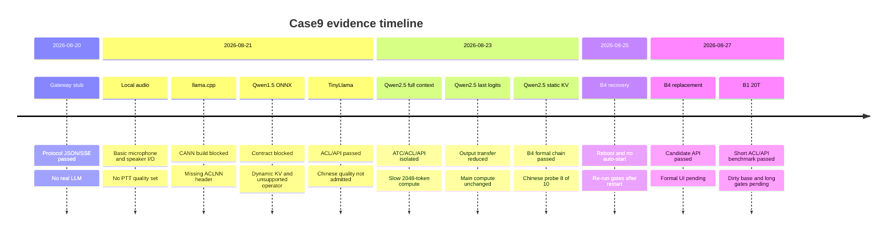

# Case9 历史结果与边界

_按时间归档早期网关、模型、音频和 XiaoZhi 工作；历史证据不自动升级为当前部署结论。_

---

## 📚 文档用途

本文是新运行手册的历史索引。它保留失败原因、已通过的具体门禁和未完成工作，帮助
读者理解为什么当前只把 Qwen2.5 静态 KV 文本链路作为主线，以及为什么 20T/B1 仍
标记为实验性。历史报告绑定当时的板卡、源码、OM、环境和端口；不能用当前代码重新
解释旧结果。

## 🗓️ 时间线

_时间线展示 2026-08-20 至 2026-08-27 的主要候选和证据状态；每个事件只说明当时可支持的结论。_

## 🧩 候选结果

### 网关协议 stub

早期网关使用合成上游验证 `/health`、Bearer、JSON、SSE 和 `[DONE]`。它证明的是
HTTP/协议实现，不包含真实模型、ATC、ACL 或 NPU 推理。详见
[`01-board-gateway-acceptance.md`](01-board-gateway-acceptance.md)。

### TinyLlama 预编译 OM

TinyLlama 在旧 B4 板上完成过 OM descriptor、真实 ACL execute、NPU 生成、JSON/SSE
和网关转发；但中文探测出现英文回退和替换字符，且观察到 NPU/HugePages 资源增长。
它不是当前中文聊天模型，也不是 Qwen2.5 的依赖。完整记录见
[`09-tinyllama-acl-om-validation-record.md`](09-tinyllama-acl-om-validation-record.md)
和 [`13-tinyllama-complete-validation-record.md`](13-tinyllama-complete-validation-record.md)。

### Qwen1.5 通用 ONNX

`onnx-community/Qwen1.5-0.5B-Chat-ONNX` 文件内容虽完整，但图包含 51 个输入、49 个
输出、动态或符号维度和未放行的 `Sigmoid`；旧 ACL contract 门因此阻断，没有执行
ATC、OM、ACL 或 NPU 推理。文件下载成功不能写成模型部署成功。详见
[`07-acl-om-validation-record.md`](07-acl-om-validation-record.md)。

### Qwen2.5 full-context 和 last-logits

2048 固定长度 Qwen2.5 图在 B4 上完成过静态检查、ATC、OM descriptor、ACL smoke 和
隔离 API。last-logits 图只缩小输出传输，主体仍计算固定 2048 长度，因此没有被当作
最终性能优化。相关证据见 [`15-qwen25-static-onnx-validation-record.md`](15-qwen25-static-onnx-validation-record.md)
和 [`16-qwen25-optimization-research-and-last-logits-validation.md`](16-qwen25-optimization-research-and-last-logits-validation.md)。

### Qwen2.5 静态 KV 1024

静态 KV 图使用 48 个 split cache 输入和 48 个单 token cache 输出，减少了每步需要
重复传输的 cache。B4 历史板 `.90` 完成了 ATC、ACL/NPU、JSON/SSE、网关/UI、中文
探测和同协议性能对照；中文探测是 `8/10`，相对 2048 基线的 p50/p95 改善是
`48.79%/48.70%`。这些结果属于 `.90` 的特定 OM、源码和环境，且最近重启后不应
假定服务仍在线。详见 [`18-qwen25-static-kv-1024-validation-record.md`](18-qwen25-static-kv-1024-validation-record.md)。

## 🧪 双板当前状态

| 板卡 | 已完成 | 未完成或不可推出 |
| --- | --- | --- |
| `.90` B4/8T | 历史 B4 OM、descriptor、ACL/NPU、正式端口和中文探测 | 当前进程状态需重新检查；结果不能回填其他板 |
| `.178` B4/8T | 复现包哈希、环境检查、ONNX contract、ACL smoke、候选 JSON/SSE | 正式网关/UI、长输出、中文探测和稳定性 |
| `.210` B1/20T | B1 专用 OM、descriptor、ACL smoke、8084 JSON/SSE、1+5 短测速 | 干净环境、长输出连续性、中文 10 条、10 轮资源、网关/UI、正式入口 |

同一 B4 OM 和同一 B1 OM 都曾在两块板上完成交叉加载 smoke，并得到短请求成功；这
是一项有明确路径和 SHA 的兼容性实验，不是“所有 310B OM 都能跨芯片复用”的承诺。
详见 [`22-qwen25-cross-board-om-validation.md`](22-qwen25-cross-board-om-validation.md)。

## 🎙️ 音频与 XiaoZhi

旧本地音频路径只完成过一次 C922 麦克风采样和 USB 喇叭 I/O 检查，没有 10 条中文
PTT 闭环、ASR 质量、TTS 听感或端到端延迟分位数。`local_app.py:7862` 应与文本
LLM 分开验收，不得用文字 API 结果替代音频证据。

`xiaozhi-esp32-server` 从未在当前两块板上完成安装、配置、设备注册、OTA、WebSocket、
Opus、ASR、TTS 或真实 ESP32 闭环。暂停原因包括上游默认 Torch/Torchaudio 依赖与
310B 无 Torch 约束、测试时无可用真机，以及本地中文模型质量门尚未完整通过。不要
在板端为了启动 XiaoZhi 安装这些依赖；待无 Torch 语音方案和真实设备分别审核后再
恢复。相关计划见 [`04-xiaozhi-phase2-plan.md`](04-xiaozhi-phase2-plan.md)。

## 🧱 证据标签

| 标签 | 可以说明 | 不能说明 |
| --- | --- | --- |
| `artifact_verified` | 文件大小、来源和 SHA 匹配 | ONNX/OM 可执行或中文质量 |
| `contract_verified` | 输入输出名称、shape、dtype 符合检查 | ACL execute 成功 |
| `acl_smoke_passed` | 至少一次真实 ACL 模型执行 | 长输出、稳定性、通用质量 |
| `api_passed` | JSON/SSE HTTP 契约通过 | 网关/UI或设备协议通过 |
| `quality_passed` | 明确探测集达到预先定义的人工/自动标准 | 其他板卡或其他 OM 的质量 |
| `formally_promoted` | 指定板卡和指定工件完成所有规定入口门禁 | 新板自动继承该状态 |
| `not_run` / `blocked` | 没有执行或被前置条件阻断 | 任何正向能力结论 |

## 🚫 永久边界

- 不在 Ascend 板端安装或运行 `torch`、`torch_npu`、`torchaudio`、Transformers、
  ONNX Runtime、MindSpore、MindTorch、vLLM、MindIE 或未经审核的自定义 OPP。
- 不把 CPU、云端或其他模型作为 NPU 失败时的自动 fallback；失败日志和哈希必须保留。
- 不把 `Health: Alarm` 单独当成失败，也不因忽略它而声称通过；必须保留真实硬件
  快照和失败原因。
- 不把 TinyLlama、Qwen1.5、GGUF/llama.cpp、full-context Qwen2.5 或 last-logits
  工件混入静态 KV 运行目录。
- 不把浏览器文字页面当作 XiaoZhi 设备服务端，不把网关 stub 当作真实 LLM。
- 不将 B4 与 B1 的性能、中文质量、内存或稳定性数据合并排名；每份 OM 都绑定
  `soc_version`、CANN、驱动、源码和报告路径。

## 🧭 后续工作边界

20T/B1 的下一轮应按以下顺序推进，任何一步失败都停止在实验状态：

1. 建立不含禁止包的专用 Python 3.9 环境，不修改 `base`。
2. 重新执行 `check -> inspect -> convert（如需要）-> smoke`，保存 B1 OM lock。
3. 做 32/80 token 长输出、EOS/reset 和客户端断开清理测试。
4. 做 10 条中文探测和连续 10 轮 RSS/FD/NPU 内存观察。
5. 修正并参数化网关/UI 启动脚本后，在 `8084 -> 7867 -> 7868` 候选链验证。
6. 只有候选链、质量和稳定性门全部通过，才评估 `8080 -> 7861 -> 7865` 正式入口。

详细复现步骤和同步边界见 [`02-qwen25-reproducibility-and-sync.md`](02-qwen25-reproducibility-and-sync.md)。
