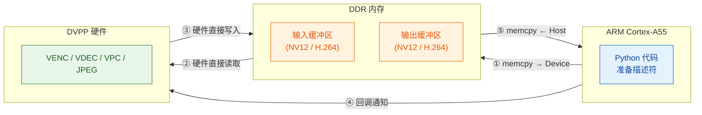
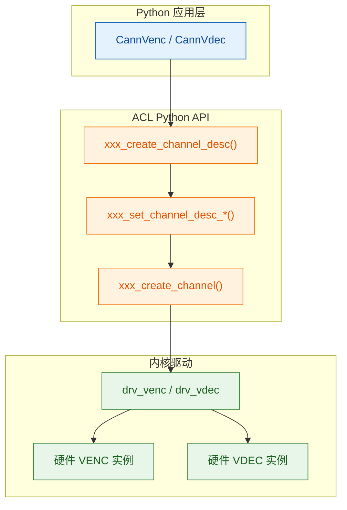

# Ascend DVPP 数字视觉预处理 — 基础概念与编程模型

> **学习路径**：本文是 [VENC 教程](venc_guide.md)、[VDEC 教程](vdec_guide.md) 和 [VPC 教程](vpc_guide.md) 的前置阅读。
> 它覆盖所有 DVPP 子模块共享的基础概念——ACL 初始化、通道模型（回调式与 Stream 式）、NV12 格式、DVPP 内存。

## 目录

1. [DVPP 是什么](#dvpp-是什么)
2. [DVPP 在芯片中的位置](#dvpp-在芯片中的位置)
3. [DVPP 子模块概览](#dvpp-子模块概览)
4. [H.264 与 H.265 编解码基础](#h264-与-h265-编解码基础)
5. [ACL 初始化——四步必需咒语](#acl-初始化四步必需咒语)
6. [通道模型](#通道模型)
7. [回调线程模型](#回调线程模型)
8. [DVPP 内存管理](#dvpp-内存管理)
9. [描述符模型](#描述符模型)
10. [NV12——DVPP 的通用货币](#nv12dvpp-的通用货币)
11. [子模块间的区别速查](#子模块间的区别速查)
12. [acllite — CANN 自带 Python 封装库](#acllite--cann-自带-python-封装库)
13. [DVPP V1 与 himpi V2 — 两套 API 体系](#dvpp-v1-与-himpi-v2--两套-api-体系)
14. [延伸到 aiortc 集成](#延伸到-aiortc-集成)

---

## DVPP 是什么

**DVPP**（Digital Vision Pre-Processing）是 Ascend 芯片内部的一组**硬件加速模块**，专门处理图像和视频数据。它独立于 NPU 的 AI Core（推理引擎），不占用 AI 算力。

```
Ascend 310B4 芯片
├── AI Core × 1           ← DaVinci V300（矩阵运算，NPU 推理主力）
├── CPU × 4               ← TaishanV200M（ARM AArch64，动态划分 Control CPU / AI CPU）
├── DVPP                   ← 视频/图像硬件加速（独立于 AI Core）
│   ├── VENC               → 视频编码
│   ├── VDEC               → 视频解码
│   ├── VPC                → 图像处理（resize/crop/csc）
│   ├── JPEGE              → JPEG 编码
│   └── JPEGD              → JPEG 解码
└── TS                     ← 专用任务调度器（管理 AI Core 和 DVPP 任务派发）
```

**关键认知**：DVPP 与 AI Core 是芯片上两个独立的硬件域。你可以同时跑 DVPP 编码 1080p 视频 + AI Core 跑 YOLO 推理，互不干扰。

---

## DVPP 在芯片中的位置

DVPP 接收来自 **DDR 内存** 的数据，处理后写回 DDR。CPU 的工作是准备输入描述符、下发任务、接收完成通知——不参与实际数据处理。



数据流五步走：

1. CPU 分配设备内存 (`分配DVPP内存`) 并将数据从主机拷入 (`拷贝到设备`)
2. DVPP 硬件通过内部总线读取输入
3. DVPP 硬件处理后将结果写入输出缓冲区
4. DVPP 触发回调通知 CPU "处理完成"
5. CPU 在回调中将结果从设备内存拷回主机 (`拷贝到主机`)

**核心洞察**：DVPP 直接访问 DDR，不走 CPU。这是它能比 CPU 软件处理快得多的根本原因。

---

## DVPP 子模块概览

| 模块 | 全称 | 功能 | 输入格式 | 输出格式 | 教程 |
|------|------|------|---------|---------|------|
| **VENC** | Video Encoder | 视频编码 | NV12 原始帧 | H.264 / H.265 码流 | [venc_guide.md](venc_guide.md) |
| **VDEC** | Video Decoder | 视频解码 | H.264 / H.265 码流 | NV12 原始帧 | [vdec_guide.md](vdec_guide.md) |
| **VPC** | Video Pre-Processing Core | 图像处理 | NV12 / RGB / BGR | NV12 / RGB / BGR | [vpc_guide.md](vpc_guide.md) |
| **JPEGE** | JPEG Encoder | JPEG 编码 | YUV420SP / YUV422SP | JPEG 码流 | [jpeg_guide.md](jpeg_guide.md) |
| **JPEGD** | JPEG Decoder | JPEG 解码 | JPEG 码流 | YUV420SP / YUV444 | [jpeg_guide.md](jpeg_guide.md) |
> **PNGD（PNG 解码器）**虽然列在 DVPP 规格中，但在 310B (CANN 8.3.RC1) 上实测 `dvpp_png_decode_async` 返回成功但输出缓冲区全零，himpi 通道也无法从 Python 创建。310B 上 PNG 解码请使用 CPU 方案（Pillow / OpenCV）。因此本教程系列不含 PNGD 章节。

### VENC 与 VDEC 的对称关系

```
VENC:  NV12 ──→ [硬件编码] ──→ H.264 码流
VDEC:  H.264 码流 ──→ [硬件解码] ──→ NV12
```

两者串联可以形成**全硬件转码管道**（NV12 作为中间格式，设备内零拷贝）。

### VPC——未被充分使用的利器

VPC 提供 resize（缩放）、crop（裁剪）、csc（色彩空间转换），全部硬件加速：

```
摄像头 YUYV → VPC(csc: YUYV→NV12 + resize: 1080p→720p) → NV12 → VENC
```

这比 CPU 做 `cv2.cvtColor + cv2.resize` 快得多，且不占 CPU。

### 本项目当前使用的模块

| 模块 | 状态 | 用途 |
|------|------|------|
| VENC | 已集成 | WebRTC 硬件编码 |
| VDEC | 已基准测试 | 待集成到 WebRTC 接收端 |
| VPC | 已教程 | 候选：摄像头 YUYV→NV12 转换 |

---

## H.264 与 H.265 编解码基础

VENC 和 VDEC 都围绕 H.264/H.265 工作。理解这些编码标准的基本概念，是使用 DVPP 编解码模块的前提。

### 什么是 H.264

**H.264**（也叫 AVC，Advanced Video Coding）是目前全球使用最广泛的视频编码标准，2003 年由 ITU-T 和 ISO/IEC 联合发布。几乎所有浏览器、手机、摄像头、视频会议系统都支持 H.264。

H.264 的核心思想是**去除视频中的冗余**：

```
空间冗余 → 帧内预测（Intra prediction）
  同一帧内相邻像素通常相似——用已编码的相邻块预测当前块，只存差值。

时间冗余 → 帧间预测（Inter prediction）
  相邻帧之间大部分区域不变——把画面分成宏块，只编码"运动"的部分。

统计冗余 → 熵编码（CABAC/CAVLC）
  出现频率高的符号用短码字，出现频率低的用长码字。
```

#### 帧类型

编码后的每一帧按类型分为：

| 帧类型 | 全称 | 大小 | 依赖 | 说明 |
|--------|------|------|------|------|
| **I 帧** (IDR) | Instantaneous Decoder Refresh | 最大（~80KB@480p） | 无 | 独立解码，不依赖任何其他帧 |
| **P 帧** | Predictive | 中等（~5-15KB@480p） | 前一帧 | 只存与前一帧的差异 |
| **B 帧** | Bi-predictive | 最小（~2-5KB@480p） | 前后帧 | 双向预测，压缩率最高但延迟最大 |

> **B 帧与实时通信**：B 帧需要参考"未来"帧，编码器必须缓冲多帧才能编码 B 帧，引入额外延迟。WebRTC 和实时视频通话通常**禁用 B 帧**（`tune=zerolatency`），只用 I 帧和 P 帧。

#### GOP（Group of Pictures）

一个典型的 H.264 码流结构：

```
[SPS] [PPS] [IDR(I)] [P] [P] ... [P] [IDR(I)] [P] [P] ...
 ├─ GOP ─┤├──────── GOP ────────┤├──────── GOP ────────┤
```

- **GOP**：一个 I 帧到下一个 I 帧之间的帧组。GOP=30 表示每 30 帧插入一个 I 帧（30fps 下每秒一个关键帧）
- **IDR 帧**：GOP 的起点，包含完整图像数据，可以独立解码。解码器必须从 IDR 帧开始才能正确解码
- **I/P 比例**：GOP=30 时，97% 是 P 帧，仅 3% 是 I 帧。这模拟真实视频流——I 帧体积大但稀疏，P 帧小而密集

#### NAL 单元与 Annex-B 格式

H.264 码流由 **NAL 单元**（Network Abstraction Layer Units）组成：

| NAL 类型 | 含义 | 说明 |
|----------|------|------|
| SPS | 序列参数集 | 分辨率、帧率、编码档次等元信息 |
| PPS | 图像参数集 | 熵编码模式、量化参数等 |
| IDR Slice | 即时解码刷新 | I 帧的实际图像数据 |
| Non-IDR Slice | 非即时解码刷新 | P 帧/B 帧的实际图像数据 |
| SEI | 补充增强信息 | 可选元数据（时间码、缓冲周期等） |

**Annex-B 格式**是 H.264 码流最常见的打包格式，用起始码 `0x00000001`（或 `0x000001`）分隔每个 NAL 单元：

```
00 00 00 01 [SPS data] 00 00 00 01 [PPS data] 00 00 00 01 [IDR slice] 00 00 00 01 [P slice] ...
```

VDEC 要求输入必须是 Annex-B 格式。VENC 输出的也是 Annex-B 格式。

### 什么是 H.265

**H.265**（也叫 HEVC，High Efficiency Video Coding）是 H.264 的下一代标准，2013 年发布。核心目标：**相同画质下码率减半**。

| 特性 | H.264 | H.265 |
|------|-------|-------|
| 编码块大小 | 16×16 宏块（固定） | 8×8 到 64×64 CTU（自适应） |
| 帧内预测方向 | 9 种 | 35 种 |
| 并行处理 | 仅 Slice 级 | WPP + Tile 级 |
| 压缩率 | 基准 | **同画质下码率少 50%** |
| 编码复杂度 | 基准 | **约 2-5 倍** |
| 浏览器支持 | 100% | >95%（Firefox 不支持 WebRTC H.265） |
| 专利授权 | MPEG LA + 两个专利池 | 三个专利池（更复杂） |

### 为什么本项目只讲 H.264

1. **API 统一**：CANN VENC/VDEC 对 H.264 和 H.265 的 API 调用完全一致——唯一区别是 `entype` 参数（`1` vs `0`）。学会 H.264，切到 H.265 只需改一行。

2. **码流容易生成**：用 `av.CodecContext("libx264", "w")` 即可在 CPU 上编码测试素材。H.265 需要 `libx265`，ARM 平台上编码极慢，不适合教学。

3. **性能结论通用**：基准测试得出的 VENC/VDEC vs CPU 性能拐点，对 H.265 同样成立。H.265 的 CPU 编解码更重（复杂度 2-5×），DVPP 硬件优势会更大。

4. **WebRTC 标配**：WebRTC 强制要求 H.264 Baseline 支持。H.265 是可选的，且 aiortc 1.14.0 只有 H.264 和 VP8 编码模块，不支持 H.265 的 RTP 载荷封装（RFC 7798）和 SDP 协商。

---

## ACL 初始化——四步必需咒语

任何使用 DVPP 的 Python 进程，都必须在开头执行这四个调用。顺序固定不可变：

```text
初始化运行时()               # ① 初始化 ACL 运行时，必须第一个调用
绑定设备(0)                  # ② 选择 NPU 设备 0
ctx = 创建上下文(0)           # ③ 在设备上创建执行上下文
绑定上下文(ctx)               # ④ 将上下文绑定到当前线程
```

> 这四步是 VENC 和 VDEC 共同的启动流程。具体 Python API（`acl.init()` / `acl.rt.set_device()` 等）见各教程的代码示例。

### 为什么需要 context

ACL 的 context（上下文）是**线程局部**的。每个需要调用 ACL API 的线程都必须绑定自己的 context。这就是为什么回调线程里必须再调一遍 `绑定上下文(ctx)`——主线程的 context 不会自动传递到回调线程。

```
主线程:   初始化运行时 → 绑定设备 → 创建上下文 → 绑定上下文 → 调用 VENC/VDEC API
回调线程:                                              绑定上下文 → 等待回调事件(300ms)
```

### 多线程规则

- 一个设备可以创建多个 context
- 一个 context 同时只能绑定一个线程
- 一个线程同时只能绑定一个 context
- 同一个 context 可以在不同时间绑定到不同线程（但不能同时）

VDEC 教程的"坑 #6：销毁通道顺序"就是因为违反了这个规则——线程和通道的生命周期必须正确协调。

---

## 通道模型

VENC 和 VDEC 都采用**通道（Channel）**模型。通道是 DVPP 硬件资源的抽象——创建一个通道就是向驱动申请一个硬件编码器/解码器实例。



### 通道描述符 → 通道 的两步创建

```text
// === VENC 通道创建 ===
venc_desc = 创建编码通道描述符()
设置编码类型(venc_desc, H264)          // 编码类型
设置输入格式(venc_desc, NV12)          // 像素格式
设置分辨率(venc_desc, 640, 480)        // 宽度、高度
设置GOP(venc_desc, 30)                 // 关键帧间隔
设置帧率(venc_desc, 30)                // 输入帧率
设置最大码率(venc_desc, 2000)          // 单位 kbps
设置码率控制模式(venc_desc, CBR)       // CBR 或 VBR
设置回调函数(venc_desc, venc回调)      // 编码完成回调
设置回调线程(venc_desc, 回调线程ID)
创建编码通道(venc_desc)                // ← 此时才向驱动申请硬件资源

// === VDEC 通道创建 ===
vdec_desc = 创建解码通道描述符()
设置通道ID(vdec_desc, 0)               // ← VDEC 必须显式设置，VENC 不需要
设置编码类型(vdec_desc, H264)          // 与 VENC 相同
设置输出格式(vdec_desc, NV12)          // 解码输出的像素格式
设置输出分辨率(vdec_desc, 640, 480)    // 解码后的帧尺寸
设置参考帧数(vdec_desc, 5)             // ← VDEC 特有参数
设置回调函数(vdec_desc, vdec回调)      // 解码完成回调
设置回调线程(vdec_desc, 回调线程ID)
创建解码通道(vdec_desc)                // ← 此时才向驱动申请硬件资源
```

描述符 ≠ 通道。描述符只是一组参数配置，调用 `创建xxx通道(desc)` 才会真正向驱动**申请硬件资源**并返回通道。

### 通道数是有限的

Ascend 310B4 的 VENC/VDEC 硬件实例数量有限（通常每种 1-2 个）。`创建通道()` 会失败如果所有硬件实例都被占用。

### 通道复用 vs 创建/销毁

每次调用 `创建通道() → 处理 N 帧 → 销毁通道()` 的固定开销约 **5-10ms**（设备内存分配 + 驱动交互）。对于单帧编码场景（如 VDEC 最初每帧一个通道），创建/销毁的开销远超编解码本身。

**最佳实践**：创建一次通道，连续编码/解码所有帧，最后销毁。

### 两种通道体系

DVPP 内部有两种不同的通道模型，分别用于编解码模块和图像处理模块：

| | VENC / VDEC 专用通道 | VPC / JPEG 通用通道 |
|---|---|---|
| 创建 API | `创建编码通道()` / `创建解码通道()` | `创建通用通道()`（无需设置 mode） |
| 异步机制 | **回调线程**（`等待回调事件` 轮询） | **Stream 同步**（`同步等待Stream` 阻塞） |
| 线程模型 | 需要独立回调线程 + Queue | 不需要额外线程 |
| 数据描述 | VENC: pic_desc→stream_desc，VDEC: stream_desc→pic_desc | pic_desc → pic_desc（同类型） |

```
VENC/VDEC 回调式：                     VPC/JPEG Stream 式：

主线程: 发送帧 → Queue.get(等待)      主线程: 发送异步 → 同步等待Stream
            ↑                                      ↑
回调线程: 回调触发 → Queue.put(结果)    (无回调线程，硬件直接通知 Stream)
```

> VPC 教程对此有详细展开。理解两种模型的差异是正确使用 DVPP 的关键——它们共享内存管理和描述符模型，但异步机制完全不同。

---

## 回调线程模型

DVPP 是**异步**的：你发送一个工作请求后立即返回，结果通过**回调**在另一个线程中返回。

```
时间线：

主线程:   发送帧请求 ──────── (等待 Queue.get) ──→ 得到结果
                                ↑
回调线程: (等待回调事件) ─→ 回调触发 ─→ Queue.put(结果)
              循环               ↑
                            DVPP 硬件完成
```

### 回调线程的代码模板

```text
// === 共享基础设施 ===
结果队列(容量=64)         // 线程安全队列，连接回调线程和主线程
运行标志 = True           // 控制回调线程退出

// === 回调线程 (VENC 和 VDEC 共用) ===
def 回调线程():
    绑定上下文(ctx)              // ① 线程局部的 context 绑定
    while 运行标志:
        等待回调事件(300ms)       // ② 阻塞等待 DVPP 硬件完成通知
        // 收到通知后，DVPP 驱动自动调用对应的回调函数

// === VENC 编码完成回调 ===
def venc回调(输入图片描述符, 输出码流描述符, 用户数据):
    size = 读取码流大小(输出码流描述符)
    ptr  = 读取码流数据指针(输出码流描述符)

    主机缓冲区 = 分配主机内存(size)         // CPU 可访问的内存
    拷贝设备到主机(主机缓冲区, ptr, size)    // 将编码结果拷出
    结果 = 转字节串(主机缓冲区, size)
    释放主机内存(主机缓冲区)

    结果队列.放入(结果)                     // ③ 通知主线程
    销毁图片描述符(输入图片描述符)           // ④ 回调负责销毁输入

// === VDEC 解码完成回调 ===
def vdec回调(输入码流描述符, 输出图片描述符, 用户数据):
    ret = 读取图片返回码(输出图片描述符)     // ← VDEC 特有：必须检查返回码
    if ret != 0:
        结果队列.放入(None)                 // 解码失败，丢弃此帧
        return

    ptr  = 读取图片数据指针(输出图片描述符)
    size = 读取图片大小(输出图片描述符)

    主机缓冲区 = 分配主机内存(size)
    拷贝设备到主机(主机缓冲区, ptr, size)
    结果 = 转字节串(主机缓冲区, size)
    释放主机内存(主机缓冲区)

    结果队列.放入(结果)

    // ④ VDEC 必须销毁两个描述符（比 VENC 多一个）
    销毁码流描述符(输入码流描述符)
    销毁图片描述符(输出图片描述符)
```

**VENC vs VDEC 回调的关键差异**：

| | VENC 回调 | VDEC 回调 |
|---|---|---|
| 参数顺序 | `(输入_pic_desc, 输出_stream_desc)` | `(输入_stream_desc, 输出_pic_desc)` |
| 读取输出 | `读取码流大小/数据()` | `读取图片返回码()` + `读取图片数据/大小()` |
| 返回码检查 | 无 | **必须检查**，非 0 = 解码失败 |
| 销毁输入 | `销毁图片描述符(输入)` | `销毁码流描述符(输入)` |
| 销毁输出 | 不需要（调用方管理） | **`销毁图片描述符(输出)`** |

**记忆方法**：第一个参数总是"输入"，第二个总是"输出"。VENC 输入图片→输出码流；VDEC 输入码流→输出图片。

### 为什么用 Queue 而不是 Event

Queue 天然适合"生产者（回调线程）→ 消费者（主线程）"模式：
- 支持缓冲（多帧排队）
- 阻塞等待（`Queue.get(timeout=5.0)`）
- 线程安全（无需额外锁）

### 为什么是 300ms

`等待回调事件(300ms)` 阻塞最多 300ms 等待 DVPP 硬件完成通知。超时后返回（即使没有事件），然后循环再次调用。300ms 的选择：
- 太短（如 10ms）→ 高频 CPU 轮询，浪费 CPU
- 太长（如 5000ms）→ 销毁通道时等待太久才退出循环
- 300ms 是平衡值——既不过分轮询，也能及时退出

---

## DVPP 内存管理

DVPP 有两套内存系统，必须正确区分：

| 操作 | 分配位置 | 访问方式 | 用途 | 释放 |
|-----|---------|---------|------|------|
| `分配DVPP内存(大小)` | **设备端**（NPU 片内或 DDR） | 不能被 CPU 直接读写 | DVPP 硬件访问的输入/输出缓冲区 | `释放DVPP内存(ptr)` |
| `分配主机内存(大小)` | **主机端**（系统 DDR） | CPU 可正常读写 | 回调中临时中转数据 | `释放主机内存(ptr)` |

### 数据搬运方向

```text
拷贝到设备(设备内存, 主机数据, 大小)   // 主机 → 设备（发送数据给 DVPP 处理）
拷贝到主机(主机内存, 设备数据, 大小)   // 设备 → 主机（从 DVPP 取回结果）
```

> 这两个方向是 `memcpy` 操作的仅有的两种用法。具体常量名（`ACL_MEMCPY_HOST_TO_DEVICE` 等）见各教程代码示例。

### 典型的内存生命周期

```
一帧 VENC 编码的内存流转：                一帧 VDEC 解码的内存流转：

① 分配DVPP内存(in)  → 输入缓冲区(NV12)    ① 分配DVPP内存(in)  → 输入缓冲区(H.264码流)
② 分配DVPP内存(out) → 输出缓冲区(码流)    ② 分配DVPP内存(out) → 输出缓冲区(NV12帧)
③ 拷贝到设备(in)    → 发送帧数据到设备    ③ 拷贝到设备(in)    → 发送码流到设备
④ 发送编码请求()    → DVPP 硬件处理       ④ 发送解码请求()    → DVPP 硬件处理
⑤ [回调触发]                              ⑤ [回调触发]
⑥ 分配主机内存()    → 临时缓冲区           ⑥ 分配主机内存()    → 临时缓冲区
⑦ 拷贝到主机(out)   → 取回 H.264 码流     ⑦ 拷贝到主机(out)   → 取回 NV12 帧
⑧ 释放DVPP内存(in)                       ⑧ 释放DVPP内存(in)
⑨ 释放DVPP内存(out)                      ⑨ 释放DVPP内存(out)
⑩ 释放主机内存()                          ⑩ 释放主机内存()
```

两者的内存流转模式完全一致，只是输入/输出的数据类型互换。

### 常见内存错误

| 错误 | 现象 | 原因 |
|------|------|------|
| 忘记 `释放DVPP内存` | 内存泄漏 → 后续分配失败 | 每帧分配但未释放 |
| 忘记 `释放主机内存` | 主机内存泄漏 | 回调中分配主机内存后未释放 |
| 在主机上直接读设备指针 | 段错误 / 垃圾数据 | 设备内存不能直接被 CPU 访问 |
| 回调中未销毁输入描述符 | 内存泄漏 | VENC pic_desc / VDEC stream_desc 必须由回调销毁 |

---

## 描述符模型

DVPP 使用两种描述符来描述输入/输出数据：

### pic_desc — 图片描述符

描述一帧图像（NV12 / RGB 等）：

```text
pic = 创建图片描述符()
设置图片数据(pic, 设备内存指针)        // 设备内存中的像素数据
设置图片大小(pic, 数据字节数)          // 图像数据总大小
设置图片格式(pic, NV12)                // 像素格式：1=NV12, 12=RGB888, 13=BGR888
设置图片宽度(pic, 640)                // 图像宽度（像素）
设置图片高度(pic, 480)                // 图像高度（像素）
设置行步长(pic, 640)                  // stride，对齐到 16
```

读取图片描述符：
```text
数据指针 = 读取图片数据(pic)           // 设备内存指针
数据大小 = 读取图片大小(pic)           // 数据字节数
像素格式 = 读取图片格式(pic)           // 像素格式枚举值
返回码   = 读取图片返回码(pic)         // VDEC 专用：0=解码成功，非0=失败
```

### stream_desc — 码流描述符

描述一段压缩码流（H.264 / H.265 / JPEG）：

```text
stream = 创建码流描述符()
设置码流数据(stream, 设备内存指针)      // 设备内存中的码流数据
设置码流大小(stream, 数据字节数)        // 码流总字节数
```

读取码流描述符：
```text
数据指针 = 读取码流数据(stream)
数据大小 = 读取码流大小(stream)
```

### 描述符与子模块的对应关系

| 子模块 | 输入描述符 | 输出描述符 | 回调参数顺序 |
|--------|----------|----------|------------|
| VENC | pic_desc | stream_desc | `(input_pic_desc, output_stream_desc)` |
| VDEC | stream_desc | pic_desc | `(input_stream_desc, output_pic_desc)` |
| JPEGE | pic_desc | stream_desc | 同 VENC |
| JPEGD | stream_desc | pic_desc | 同 VDEC |

**记忆方法**：第一个参数总是 "输入"，第二个参数总是 "输出"。VENC 输入是图片 → 输出是码流；VDEC 输入是码流 → 输出是图片。

---

## NV12——DVPP 的通用货币

NV12（也叫 YUV420SP）是 DVPP 所有图像相关模块（VENC、VDEC、VPC、JPEGE）的首选像素格式。

### 为什么 NV12

- **体积小**：每像素 1.5 字节（RGB 是 3 字节），省 50% 内存和传输带宽
- **人眼匹配**：利用人对亮度敏感、对色度不敏感的特性，降低色度分辨率
- **硬件原生**：VENC/VDEC 硬件内部直接处理 NV12，无需格式转换
- **摄像头兼容**：大多数摄像头（UVC、MIPI CSI）输出 YUV 格式，接近 NV12

### 内存布局

```
NV12 缓冲区 =  [Y 平面] [UV 交错平面]

Y 平面:  H 行 × W 列，每个像素 1 字节（仅亮度）
         row 0: Y00 Y01 Y02 ... Y0W
         row 1: Y10 Y11 Y12 ... Y1W
         ...

UV 平面: H/2 行 × W 列，每 2 字节一组 (U, V)
         row 0: U00 V00 U01 V01 ... U0W/2 V0W/2
         row 1: U10 V10 U11 V11 ...

总字节数 = H × W × 3/2
```

### 与其他 YUV 格式的区别

| 格式 | 全称 | 内存布局 | DVPP 支持 |
|------|------|---------|----------|
| **NV12** | YUV420SP | Y 平面 + UV 交错平面 | VENC / VDEC / VPC / JPEGE |
| NV21 | YVU420SP | Y 平面 + VU 交错平面 (U/V 顺序相反) | VDEC / VPC |
| I420 | YUV420P | Y 平面 + U 平面 + V 平面（3 个独立平面） | VPC (部分) |
| YUYV | YUV422 | YUYV 交错（每 2 像素共享 UV） | — (需 VPC 转换) |
| YUY2 | YUYV 的 Windows 叫法 | 同 YUYV | — |

### USB 摄像头输入 → NV12 的路径

大多数 USB 摄像头输出 **YUYV** (YUY2) 或 **MJPG** (Motion JPEG)，不是 NV12。转换路径：

```
USB Camera YUYV
  ├── CPU 路径: cv2.cvtColor(YUYV→BGR) → numpy BGR → 手动 bgr_to_nv12()
  └── VPC 路径: YUYV → VPC(csc: YUYV→NV12) → NV12  ← 零拷贝，不占 CPU
```

VPC 路径更优但需要额外代码。本项目的 `server.py` 当前用 CPU 路径（简单优先）。

---

## 子模块间的区别速查

虽然 VENC 和 VDEC 共享通道模型、回调模型、描述符模型，但细节有重要差异：

| | VENC | VDEC |
|---|---|---|
| channel_id | 驱动自动分配 | **必须显式设置** |
| 发送帧 API | `venc_send_frame` | `vdec_send_frame` |
| send_frame 参数 | `(pic_desc, stream_desc)` | `(stream_desc, pic_desc)` |
| frame_config | 可设置 `force_i_frame` | 可设置 EOS、跳过帧 |
| 回调销毁 | 仅输入 `pic_desc` | 输入 `stream_desc` **和**输出 `pic_desc` |
| 输出 ret_code | 无 | **有，必须检查** |
| 通道销毁顺序 | 先停线程再销毁通道 | **先销毁通道再停线程** |
| 参考帧数 | 无 | 有（默认 5） |
| send_skipped_frame | 无 | 有 |
| 驱动日志命令 | `dmesg \| grep -i venc` | `dmesg \| grep -i vdec` |

详细差异见各自教程的对应章节。

---

## 延伸到 aiortc 集成

`webrtc_app/cann_encoder.py` 中的 `CannH264Encoder` 将 DVPP 的上述概念打包成了 aiortc 兼容的接口：

```
DVPP 概念             →  CannH264Encoder 实现
─────────────────────────────────────────────────
ACL 初始化             →  _ensure_venc() 懒加载，全局只执行一次
通道模型               →  self._venc (CannVenc 实例，单通道复用)
回调线程               →  CannVenc 内部管理，encoder 无感知
NV12 格式              →  av.VideoFrame → numpy BGR → bgr_to_nv12()
描述符                 →  CannVenc.encode() 内部构造，外部不可见
异步→同步转换          →  Queue.get() 阻塞等待回调结果
回退机制               →  CANN 不可用时自动切回 super()._encode_frame()
```

理解本文的 DVPP 基础概念后，读 `cann_encoder.py` 的源代码就能看到——它只是把这些积木按照 aiortc 期望的接口重新组装了一遍，没有新魔法。

> **实践**: [WebRTC 推流性能对比指南](webrtc_bench_guide.md) 通过三条管线（纯 CPU / OpenCV+VENC / JPEGD+VENC）的对照实验，直观展示了 DVPP 各级硬件加速对帧率和 CPU 的实际影响。

---

## acllite — CANN 自带 Python 封装库

### 什么是 acllite

**acllite** 是随 CANN Toolkit 一起安装的 Python 封装库，位于：

```
/usr/local/Ascend/thirdpart/aarch64/acllite/
```

它**基于 DVPP V1（`acl.media`）构建**——内部全部使用 `acl.media.dvpp_*`、`acl.media.venc_*`、`acl.media.vdec_*` 等 V1 接口，不依赖 himpi V2。这也是为什么 acllite 能在 310B 上完整运行：V1 是 310B 上唯一完整可用的 API 体系。

它将 DVPP 的通道管理、stride 对齐、内存拷贝、Stream/回调同步等底层细节封装成了面向对象的 API。

### 模块组成

| 文件 | 类 / 功能 | 对应 DVPP 模块 |
|------|----------|--------------|
| `acllite_resource.py` | `AclLiteResource` — ACL 初始化一行搞定 | 通用 |
| `acllite_image.py` | `AclLiteImage` — 图像数据容器（numpy / 文件 / DVPP 内存） | 通用 |
| `acllite_imageproc.py` | `AclLiteImageProc` — resize / crop / JPEG 编解码 | VPC / JPEGE / JPEGD |
| `dvpp_vdec.py` | `DvppVdec` — H.264/H.265 硬件解码 | VDEC |

> **VENC 不在 acllite 中**。编码器需使用项目自带的 `CannVenc` 类（`webrtc_app/cann_encoder.py`）。

### 快速上手

```python
import numpy as np
from acllite_resource import AclLiteResource
from acllite_image import AclLiteImage
from acllite_imageproc import AclLiteImageProc

# ① ACL 初始化——一行替代四步咒语
acl_res = AclLiteResource()
acl_res.init()

# ② 创建 VPC + JPEG 处理器
vpc = AclLiteImageProc()

# ③ 准备图像（numpy ndarray → DVPP 内存）
nv12 = np.vstack([y_plane, uv_plane])
img = AclLiteImage(nv12, width, height).copy_to_dvpp()

# ④ 一行 resize
resized = vpc.resize(img, 320, 240)

# ⑤ 一行 JPEG 编码
jpeg = vpc.jpege(resized)

# ⑥ 一行 JPEG 解码
decoded = vpc.jpegd(jpeg)

# ⑦ 取回 numpy
data = decoded.byte_data_to_np_array()  # → np.uint8 一维数组

# ⑧ 清理
vpc.destroy()
# AclLiteResource 在 __del__ 中自动释放 ACL 资源
```

### AclLiteImage — 数据容器

`AclLiteImage` 统一了不同来源的图像数据，是所有 acllite 操作的输入输出：

```text
三种构造方式：

① 从 numpy ndarray（内存像素）
   img = AclLiteImage(nv12_ndarray, width, height)
   img_dvpp = img.copy_to_dvpp()    # 拷贝到 DVPP 内存后才能用 VPC

② 从文件（支持 .jpg / .png / .yuv）
   img = AclLiteImage("photo.jpg")                    # JPEG 文件
   img = AclLiteImage("frame.yuv", 640, 480)          # YUV 需提供宽高

③ 从 DVPP 设备内存指针（VPC/VDEC 输出）
   ret, img = vdec.read()    # DvppVdec 返回的已是 AclLiteImage

取出数据：
   ndarray = img.byte_data_to_np_array()   # → numpy 一维 uint8
```

### VPC / JPEG 操作速查

```text
vpc.resize(img, out_w, out_h)            → 缩放（自动 stride + Stream 同步）
vpc.crop_and_paste(img, w, h, cw, ch)    → 裁剪（保持比例填充）
vpc.jpege(img)                            → NV12 → JPEG 硬件编码
vpc.jpegd(img)                            → JPEG → NV12 硬件解码
```

### VDEC 操作速查

```python
from dvpp_vdec import DvppVdec
import constants as const

# 创建解码器
vdec = DvppVdec(channel_id=0, width=640, height=480,
                entype=const.ENTYPE_H264_BASE, ctx=ctx)
vdec.init()

# 送入 H.264 Annex-B 码流（需先拷贝到 DVPP 内存）
vdec.process(h264_device_ptr, h264_size, user_data=(0, frame_id))

# 读取解码后的 AclLiteImage
ret, img = vdec.read()
if img:
    nv12 = img.byte_data_to_np_array()

vdec.destroy()
```

### acllite 涵盖范围总结

```
DVPP 子模块    │ 裸调 API                │ acllite 封装
───────────────┼─────────────────────────┼─────────────────────
VENC 编码      │ acl.media.venc_*        │ ❌ 无 — 用 CannVenc
VDEC 解码      │ acl.media.vdec_*        │ DvppVdec ✅
VPC resize     │ dvpp_vpc_resize_async   │ vpc.resize() ✅
VPC crop       │ dvpp_vpc_crop_*         │ vpc.crop_and_paste() ✅
JPEGE 编码     │ dvpp_jpeg_encode_async  │ vpc.jpege() ✅
JPEGD 解码     │ dvpp_jpeg_decode_async  │ vpc.jpegd() ✅
ACL 初始化     │ 四步咒语                │ AclLiteResource ✅
内存管理       │ dvpp_malloc + memcpy    │ copy_to_dvpp() ✅
```

### 适用场景

| 场景 | 推荐方案 |
|------|---------|
| 快速原型、学习 DVPP | acllite（几行代码跑通） |
| VPC resize/crop/JPEG 生产代码 | acllite（自动管理资源，代码量少 80%） |
| VDEC 解码 | acllite 或裸 API（看是否需要精细控制） |
| VENC 编码 | `CannVenc`（项目自带） |
| 需要精细控制内存/回调 | 裸调 `acl.media` |

> acllite 已在 Ascend 310B4 (CANN 8.3.RC1) 上验证通过。详见 [VPC 教程](vpc_guide.md) 和 [VDEC 教程](vdec_guide.md) 的 acllite 章节。

---

## DVPP V1 与 himpi V2 — 两套 API 体系

CANN 为 Ascend 310B 提供了两套不同的媒体处理 API，它们共存于 Python 模块中，但设计理念和可用性差别很大。理解两者的区别是正确选择 API 的前提。

### 概览

| | DVPP V1 (`acl.media`) | himpi V2 (`acl.himpi`) |
|---|---|---|
| 全称 | Digital Vision Pre-Processing | Hi Media Processing Interface |
| 定位 | AscendCL 通用媒体处理 | 专用媒体处理（对标 HiMPP） |
| 函数数量 | ~80 | ~112 |
| 通道模型 | VENC/VDEC 专用 + 通用 dvpp 通道 | 统一 `*_create_chn` |
| 数据描述 | 描述符（pic_desc / stream_desc） | C 结构体（Python 不可构造） |
| 310B Python 可用性 | **大部分可用** | **通道创建不可用** |

### 功能对比

```
功能              DVPP V1 (acl.media)              himpi V2 (acl.himpi)
─────────────────────────────────────────────────────────────────────────────
VENC 编码         venc_create_channel ✓             venc_create_chn ✗ (Python不可用)
                  venc_send_frame ✓                 venc_send_frame ✗
                  force_i_frame ✓                   ROI编码、场景检测 ⊕
                                                    H.264/H.265 VUI ⊕

VDEC 解码         vdec_create_channel ✓             vdec_create_chn ✗
                  vdec_send_frame ✓                 vdec_send_stream ✗
                                                    fd输出模式 ⊕

VPC resize/crop   dvpp_vpc_resize_async ✓           vpc_resize ✗ (需通道)
                  dvpp_vpc_crop_resize_async ✓      vpc_crop_resize ✗

VPC CSC           dvpp_vpc_convert_color_async ✗    vpc_convert_color △ (通道不可创建)

VPC 高级功能      无                                 旋转、翻转、仿射变换 ⊕
                                                    模糊、滤波、直方图 ⊕
                                                    腐蚀、膨胀、OSD ⊕

JPEG 编码         dvpp_jpeg_encode_async ✓          venc_send_jpege_frame ✗

JPEG 解码         dvpp_jpeg_decode_async ✓          vdec + jpegd模式 ✗
```

> ⊕ = himpi 独有功能  ✗ = 310B Python 不可用  ✓ = 已验证可用  △ = 部分可用/有问题

### 为什么存在两套 API

himpi (Hi Media Processing Interface) 是华为海思芯片的传统媒体处理接口，源自 Hi35xx/HiMPP 系列。CANN 将这套接口以 `acl.himpi` 模块暴露，目标是为老用户提供迁移路径，并为新硬件（310P/710）提供更丰富的媒体处理功能。

DVPP V1 (`acl.media`) 是 CANN/AscendCL 的原生接口，设计上更统一（描述符模型），在 310B 上经过了更充分的验证。

### 310B 上的实际可用性

在 CANN 8.3.RC1 + 310B 上实测：

| API 族 | 通道创建 | 数据处理 | 结论 |
|--------|---------|---------|------|
| `acl.media.dvpp_*` | ✅ 全部可用 | ✅ resize/crop/JPEG 可用 | **推荐使用** |
| `acl.media.venc_*` | ✅ 专用 API | ✅ 编码可用 | **推荐使用** |
| `acl.media.vdec_*` | ✅ 专用 API | ✅ 解码可用 | **推荐使用** |
| `acl.himpi.vpc_*` | ❌ 不可创建 | ❌ 依赖通道 | 不可用 |
| `acl.himpi.venc_*` | ❌ 不可创建 | ❌ 依赖通道 | 不可用 |
| `acl.himpi.vdec_*` | ❌ 不可创建 | ❌ 依赖通道 | 不可用 |
| `acl.himpi.vpc_convert_color` | 不需要通道 | △ 返回硬件错误 (0xa0078003) | 不可用 |

**根本原因**：himpi 的 `*_create_chn` 函数需要传入 C 结构体（如 `hi_vpc_chn_attr`），Python 侧不支持创建这些结构体。虽然部分无通道函数（如 `vpc_convert_color`）语法上可调用，但缺少预配置的通道上下文，返回硬件错误。

### 选择指南

```
你要在 310B 上处理媒体数据？
├── VENC/VDEC 编解码
│   └── → acl.media.venc_* / vdec_*（唯一选择）
├── VPC resize/crop
│   ├── → acl.media.dvpp_vpc_*_async（裸调）
│   └── → acllite（推荐，封装了 dvpp V1）
├── JPEG 编解码
│   ├── → acl.media.dvpp_jpeg_*_async（裸调）
│   └── → acllite（推荐，一行搞定）
├── 旋转/翻转/滤波/仿射
│   └── → CPU (OpenCV)（himpi V2 不可用）
└── 310P/710 等新硬件
    └── → himpi V2（更多功能，完整支持）
```

> **记忆口诀**：310B 上 `acl.media`（V1）是唯一完整可用的 API。acllite 是 V1 的高层封装（内部 100% 使用 `acl.media`，0 处调用 himpi）。310P/710 上 himpi（V2）提供了更丰富的媒体处理功能。

---

## 下一步

1. [VENC 教程](venc_guide.md) — 硬件编码：从最小编码示例到 aiortc 集成
2. [VDEC 教程](vdec_guide.md) — 硬件解码：基础 API 到性能拐点分析
3. [VPC 教程](vpc_guide.md) — 硬件图像处理：resize/crop 全硬件管道
4. [JPEG 教程](jpeg_guide.md) — 硬件 JPEG 编解码：截图、快照、MJPEG
5. [WebRTC 推流性能对比](webrtc_bench_guide.md) — 三条管线对照实验，直观验证 DVPP 加速效果
6. 运行 [`check_cann.py`](check_cann.py) 验证你的环境
