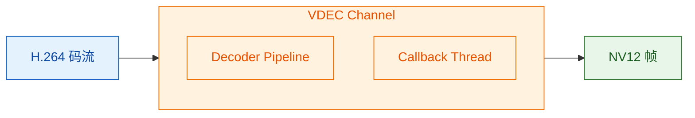

# CANN VDEC 硬件解码教程

> **前置阅读**：建议先阅读 [DVPP 基础教程](dvpp_guide.md)（ACL 初始化、通道模型、回调线程、NV12、H.264 编解码理论）。
> 本文和 VENC 教程共享这些基础概念，不再重复。

## 目录

1. [VDEC 简介](#vdec-简介)
2. [VDEC 与 VENC 的关键区别](#vdec-与-venc-的关键区别)
3. [VDEC API 详解](#vdec-api-详解)
4. [acllite DvppVdec](#acllite-dvppvdec)
5. [练习脚本走读](#练习脚本走读)
6. [踩坑记录](#踩坑记录)
7. [性能实测](#性能实测)
8. [附录](#附录)

---

## VDEC 简介

**VDEC**（Video Decoder）是 DVPP 中的硬件视频解码模块。它将 H.264/H.265 压缩码流解码为 NV12 原始帧。



### H.264 与 H.265 基础

H.264/H.265 的帧类型（I/P/B）、GOP、NAL 单元、Annex-B 格式等编解码理论知识，详见 [dvpp_guide.md §4](dvpp_guide.md#h264-与-h265-编解码基础)。本文的 VDEC API 和基准测试默认使用 **H.264 Baseline**。

VDEC 对输入码流只有一个硬性要求：必须是 **H.264 Annex-B 格式**（带 `0x00000001` 起始码的 NAL 单元序列），首帧必须包含 SPS + PPS + IDR。

### 典型应用场景

| 场景 | 数据流 |
|------|--------|
| 视频文件回放 | MP4/MKV 文件 → 解封装 → H.264 码流 → **VDEC** → NV12 → 显示 |
| 网络摄像机接收 | RTSP/WebRTC → H.264 码流 → **VDEC** → NV12 → 分析/显示 |
| 转码管道 | H.264 → **VDEC** → NV12 → **VENC** → 不同分辨率/码率的 H.264 |

### 与 VENC 的对称关系

详见 [dvpp_guide.md §3](dvpp_guide.md#dvpp-子模块概览)。

```
VENC: NV12 ──→ [硬件编码] ──→ H.264 码流
VDEC: H.264 码流 ──→ [硬件解码] ──→ NV12
```

### 硬件能力规格（Ascend 310B4）

以下基于 CANN 8.3.RC1 + Ascend 310B4 实测和驱动常量定义。

#### 支持的编码类型

| 编码格式 | Profile | `entype` 值 | 实测 |
|----------|---------|-------------|------|
| H.265 / HEVC | Main | `0` | ✓ |
| H.264 / AVC | Baseline | `1` | ✓ |
| H.264 / AVC | Main | `2` | ✓ |
| H.264 / AVC | High | `3` | ✓ |

> 实验中用 H.264 Baseline 码流测试了全部四种 `entype`，通道创建和 `send_frame` 均成功。
> 但**实际解码能否正确输出**取决于输入码流是否匹配所选的 `entype`。
> 例如：用 Baseline 码流 + `entype=H265_MAIN` 虽然不会报错，
> 但解码结果会是花屏或黑帧（编码标准不匹配）。

#### 支持的输出像素格式

| 格式 | `out_pic_format` 值 | 位深 | 说明 |
|------|---------------------|------|------|
| YUV400 | 0 | 8 | 仅亮度 |
| **NV12** (YUV420SP) | **1** | 8 | 推荐使用 |
| NV21 (YVU420SP) | 2 | 8 | |
| NV12 4:2:2 | 3 | 8 | |
| NV21 4:2:2 | 4 | 8 | |
| NV12 4:4:4 | 5 | 8 | |
| NV21 4:4:4 | 6 | 8 | |
| RGB888 | 12 | 8 | |
| BGR888 | 13 | 8 | |

> 位深 10-bit 理论上支持（`vdec_set_channel_desc_bit_depth`），
> 但 310B4 驱动在 10-bit 下的实际表现未经充分验证。

#### 分辨率和帧率约束

| 约束项 | 值 | 说明 |
|--------|-----|------|
| 最小分辨率 | 128×128 | 理论下限 |
| 最大分辨率 | 4096×4096 | 理论上限，受内存限制 |
| 宽度对齐 | 16 | VDEC 硬件要求 |
| 高度对齐 | 2 | VDEC 硬件要求 |
| 最大帧率 | 60 fps | 与分辨率有关 |
| 参考帧数 | 1-5（默认 5） | `ref_frame_num`，影响解码缓冲大小 |

> 实际可解码的最大分辨率受设备内存和码率限制。
> 310B4 配备 16GB 内存，单路 4K@30fps 解码无压力。

#### 输入码流约束

| 约束项 | 说明 |
|--------|------|
| 码流格式 | H.264 Annex-B（带 0x00000001 起始码的 NAL 单元） |
| SPS/PPS | 同一通道上所有帧必须共享一致的 SPS/PPS |
| 首帧要求 | 必须包含 SPS + PPS + IDR，否则 VDEC 拒绝解码 |
| 单次输入上限 | 取决于码流参数，超过约 256KB 可能被 VDEC 丢弃 |
| 帧边界 | 每次 `vdec_send_frame` 应发送完整的一帧（含所有 NAL 单元） |

#### H.264 Level 与典型应用

| Level | 最大宏块数 | 典型分辨率@帧率 | 最大码率 |
|-------|-----------|----------------|---------|
| 3.0 | 1620 | 720×480@30 | 10 Mbps |
| 3.1 | 3600 | 1280×720@30 | 14 Mbps |
| 4.0 | 8192 | 1920×1080@30, 2048×1024@30 | 20 Mbps |
| 4.1 | 8192 | 1920×1080@30, 2048×1024@30 | 50 Mbps |
| 4.2 | 8704 | 1920×1080@60 | 50 Mbps |
| 5.0 | 22080 | 2560×1920@30 | 135 Mbps |
| 5.1 | 36864 | 4096×2304@30 | 240 Mbps |

> 310B4 VDEC 理论上支持到 Level 5.1。
> 我们的基准测试中，480p 走 Level 3.1，1080p 走 Level 4.0。

---

## VDEC 与 VENC 的关键区别

完整对比表见 [dvpp_guide.md §11](dvpp_guide.md#子模块间的区别速查)，以下是从 VDEC 视角的要点：

| 特性 | VENC | VDEC |
|------|------|------|
| 数据方向 | NV12 → H.264 | H.264 → NV12 |
| `channel_id` | 驱动自动分配 | **必须显式设置** |
| `out_mode` | 无 | **必须检查和设置**（默认通常为 0） |
| `ref_frame_num` | 无 | 参考帧数量（默认 5） |
| `send_frame` 参数 | `(pic_desc, stream_desc)` | `(stream_desc, pic_desc)` |
| 回调中销毁对象 | 输入（pic_desc） | 输入（stream_desc）**和**输出（pic_desc） |
| 输入有效性要求 | 任意 NV12 均可 | 必须是**合法的完整 H.264 NAL 单元** |
| 输出 ret_code | 无 | 有，**必须检查**，非 0 表示解码失败 |
| `send_skipped_frame` | 无 | **有**，用于丢帧后通知解码器 |

---

## VDEC API 详解

### 通道参数

| 参数 setter | 含义 | 值域 | 示例 |
|-------------|------|------|------|
| `channel_id` | 通道 ID | 整数，必须显式设置 | `0` |
| `entype` | 编码类型 | 0=H265, 1=H264_BASE, 2=H264_MAIN, 3=H264_HIGH | `1` |
| `out_pic_format` | 输出像素格式 | 1=NV12（其他格式可能不支持） | `1` |
| `out_pic_width` | 输出帧宽度 | 正整数 | `640` |
| `out_pic_height` | 输出帧高度 | 正整数 | `480` |
| `out_mode` | 输出模式 | 通常为 0（由驱动设置） | `0` |
| `ref_frame_num` | 参考帧数量 | 正整数，默认 5 | `5` |
| `bit_depth` | 位深 | 8 或 10 | `8` |
| `thread_id` | 回调线程 ID | `acl.util.start_thread()` 返回值 | — |
| `callback` | 解码完成回调 | Python 函数 | — |

### 回调函数

```python
def vdec_callback(input_stream_desc, output_pic_desc, user_data):
    """VDEC 解码完成回调——参数顺序与 VENC 相反。"""
    ret_code = acl.media.dvpp_get_pic_desc_ret_code(output_pic_desc)
    if ret_code != 0:
        # 解码失败——丢弃此帧
        pass
    else:
        pic_data = acl.media.dvpp_get_pic_desc_data(output_pic_desc)
        pic_size = acl.media.dvpp_get_pic_desc_size(output_pic_desc)
        # ... 拷贝 pic_data 到主机内存 ...

    # 回调负责销毁输入和输出描述符
    acl.media.dvpp_destroy_stream_desc(input_stream_desc)
    acl.media.dvpp_destroy_pic_desc(output_pic_desc)
```

与 VENC 的关键区别：
- 回调参数顺序相反：VDEC 是 `(stream_desc, pic_desc)`，VENC 是 `(pic_desc, stream_desc)`
- VDEC 必须检查 `pic_desc` 的 `ret_code`
- VDEC 回调需要销毁 **两个**描述符（VENC 只销毁输入）

### ret_code 错误码

| ret_code | 含义 |
|----------|------|
| 0 | 解码成功 |
| 非 0 | 解码失败——输入码流损坏、帧边界错误或参考帧不足 |

---

## acllite DvppVdec

CANN 自带的 acllite 库（`/usr/local/Ascend/thirdpart/aarch64/acllite/dvpp_vdec.py`）提供了 `DvppVdec` 类，封装了 VDEC 的回调线程、通道创建、帧队列等细节。

### 快速使用

```python
from dvpp_vdec import DvppVdec
import constants as const

# 创建解码器
vdec = DvppVdec(
    channel_id=0,        # 通道 ID（全局唯一）
    width=640,
    height=480,
    entype=const.ENTYPE_H264_BASE,
    ctx=ctx,             # ACL context
)

vdec.init()

# 送入 H.264 Annex-B 码流
vdec.process(h264_data_ptr, h264_size, user_data=(0, frame_id))

# 读取解码后的 NV12 帧
ret, image = vdec.read()  # image 是 AclLiteImage 对象
if image:
    nv12 = image.byte_data_to_np_array()

# 销毁
vdec.destroy()
```

### 完整示例：libx264 编码 → DvppVdec 解码

以下代码在 310B 上实测通过（完整脚本见 [`docs/vdec_acllite_demo.py`](vdec_acllite_demo.py)）：

```python
import av, fractions, numpy as np, acl
from acllite_resource import AclLiteResource
from dvpp_vdec import DvppVdec
import constants as const

# 0. 初始化
acl_res = AclLiteResource()
acl_res.init()
ctx = acl.rt.get_context(0)[1]

# 1. 用 libx264 生成一帧 H.264 测试码流
W, H = 640, 480
codec = av.CodecContext.create("libx264", "w")
codec.width, codec.height = W, H
codec.pix_fmt, codec.bit_rate = "yuv420p", 2_000_000
codec.framerate = fractions.Fraction(30, 1)
codec.time_base = fractions.Fraction(1, 30)
codec.options = {"level": "31", "tune": "zerolatency"}
codec.profile = "Baseline"

bgr = np.random.randint(0, 255, (H, W, 3), dtype=np.uint8)
frame = av.VideoFrame.from_ndarray(bgr[..., ::-1], format="rgb24")
h264_data = bytearray()
for pkt in codec.encode(frame):
    h264_data += bytes(pkt)
for pkt in codec.encode(None):
    h264_data += bytes(pkt)
h264_arr = np.frombuffer(bytes(h264_data), dtype=np.uint8)

# 2. 拷贝到 DVPP 内存
in_size = len(h264_arr)
in_buf, _ = acl.media.dvpp_malloc(in_size)
acl.rt.memcpy(in_buf, in_size, h264_arr.ctypes.data, in_size,
              const.ACL_MEMCPY_HOST_TO_DEVICE)

# 3. 创建 VDEC + 解码
vdec = DvppVdec(channel_id=0, width=W, height=H,
                entype=const.ENTYPE_H264_BASE, ctx=ctx)
vdec.init()
vdec.process(in_buf, in_size, user_data=(0, 0))

# 4. 读取解码帧
ret, image = vdec.read()
if image:
    nv12 = image.byte_data_to_np_array()
    # nv12.shape = (460800,) = 640×480×3/2

# 5. 清理
vdec.destroy()
acl.media.dvpp_free(in_buf)
# AclLiteResource 在 __del__ 中自动释放
```

### 310B 实测输出

```
libx264: BGR 640x480 → H.264 168408 bytes  OK
VDEC init OK
VDEC process OK
VDEC read: 460800 bytes = 640×480×3/2  OK
```

### DvppVdec vs 裸调 API 对比

| | DvppVdec | 裸 `acl.media.vdec_*` |
|---|---|---|
| 回调线程 | 内部管理 | 手动 `start_thread` + `process_report` 循环 |
| 帧队列 | `Queue.get()` 阻塞读取 | 需自己建 Queue |
| 描述符管理 | 自动创建/销毁 | 手动 `dvpp_create/destroy_stream_desc` |
| 内存管理 | 出队时自动 `dvpp_malloc` | 手动管理 |
| 解码结果 | `AclLiteImage`（可直接给 VPC） | 裸 `pic_desc` 需手动读取 |

> **注意**：acllite 没有提供 VENC 封装。VENC 使用 `webrtc_app/cann_encoder.py` 中的 `CannVenc` 类（参考 [venc_guide.md](venc_guide.md)）。

---

## 练习脚本走读

完整代码见 [`docs/vdec_minimal.py`](vdec_minimal.py)。程序使用原始 `acl.media` API 分为 5 个阶段
（理解底层 API 后再用 DvppVdec 可事半功倍）：

### ① 生成测试码流

VDEC 需要合法的 H.264 输入，不能喂随机字节。我们用 libx264 软件编码一帧作为测试素材：

```python
import av, fractions, numpy as np

codec = av.CodecContext.create("libx264", "w")
codec.width, codec.height = 640, 480
codec.pix_fmt = "yuv420p"
# ... 设置 bit_rate, framerate, time_base ...

bgr = np.random.randint(0, 255, (480, 640, 3), dtype=np.uint8)
rgb_frame = av.VideoFrame.from_ndarray(bgr[..., ::-1], format="rgb24")

h264_data = bytearray()
for pkt in codec.encode(rgb_frame):   # 编码一帧
    h264_data += bytes(pkt)
for pkt in codec.encode(None):        # 排空缓冲区
    h264_data += bytes(pkt)

h264_arr = np.frombuffer(bytes(h264_data), dtype=np.uint8)
```

### ② 回调线程

与 VENC 结构相同，但**回调参数顺序相反**，且必须检查 `ret_code`。

### ③ 创建通道

```python
desc = media.vdec_create_channel_desc()
media.vdec_set_channel_desc_channel_id(desc, 0)   # ← VDEC 必须设置！
media.vdec_set_channel_desc_thread_id(desc, tid)
media.vdec_set_channel_desc_callback(desc, vdec_callback)
media.vdec_set_channel_desc_entype(desc, ENTYPE_H264_BASE)
media.vdec_set_channel_desc_out_pic_format(desc, PIX_FMT_NV12)
media.vdec_set_channel_desc_out_pic_width(desc, W)
media.vdec_set_channel_desc_out_pic_height(desc, H)

ret = media.vdec_create_channel(desc)
```

### ④ 发送一帧解码

```python
# 输入：H.264 码流
in_buf, _ = media.dvpp_malloc(len(h264_arr))
acl.rt.memcpy(in_buf, len(h264_arr), h264_arr.ctypes.data,
              len(h264_arr), ACL_MEMCPY_HOST_TO_DEVICE)

stream_desc = media.dvpp_create_stream_desc()
media.dvpp_set_stream_desc_data(stream_desc, in_buf)
media.dvpp_set_stream_desc_size(stream_desc, len(h264_arr))

# 输出：NV12 图片
out_size = W * H * 3 // 2
out_buf, _ = media.dvpp_malloc(out_size)
pic_desc = media.dvpp_create_pic_desc()
media.dvpp_set_pic_desc_data(pic_desc, out_buf)
media.dvpp_set_pic_desc_size(pic_desc, out_size)
media.dvpp_set_pic_desc_format(pic_desc, PIX_FMT_NV12)

ret = media.vdec_send_frame(desc, stream_desc, pic_desc, frame_cfg, None)
```

### ⑤ 清理

与 VENC 相同——销毁通道、描述符、帧配置，释放 DVPP 内存。

---

### 附：`encode_frames` 参数详解

[`bench_vdec.py`](bench_vdec.py) 中用于生成测试码流的函数，接收原始帧 + 编码器名 + GOP → 码流 + 统计。

```python
def encode_frames(frames: list[np.ndarray], codec_name: str, gop: int
                  ) -> tuple[list[bytes], int, int]:
    import av

    h, w = frames[0].shape[:2]
    level = "31" if w * h <= 1280 * 720 else "40"

    codec = av.CodecContext.create(codec_name, "w")    # ①
    codec.width = w                                     # ②
    codec.height = h
    codec.pix_fmt = "yuv420p"                           # ③
    codec.bit_rate = max(2_000_000,                     # ④
                         int(w * h * FPS * 0.1))
    codec.framerate = fractions.Fraction(FPS, 1)        # ⑤
    codec.time_base = fractions.Fraction(1, FPS)        # ⑥
    codec.options = {"level": level,                    # ⑦
                     "tune": "zerolatency"}
    if codec_name == "libx264":
        codec.profile = "Baseline"                      # ⑧

    for i, bgr in enumerate(frames):
        frame = av.VideoFrame.from_ndarray(
            bgr[..., ::-1], format="rgb24")             # ⑨
        frame.pict_type = (                             # ⑩
            av.video.frame.PictureType.I
            if i % gop == 0
            else av.video.frame.PictureType.P)
        data = bytearray()
        for pkt in codec.encode(frame):                 # ⑪
            data += bytes(pkt)
        streams.append(bytes(data))
    tail = bytearray()
    for pkt in codec.encode(None):                      # ⑫
        tail += bytes(pkt)
    if tail and streams:
        streams[-1] += bytes(tail)
    return streams, i_avg, p_avg
```

**① `av.CodecContext.create(codec_name, "w")`**
创建编码器实例。`codec_name = "libx264"` 或 `"libx265"`，`"w"` 表示编码模式。
libx264 是 H.264 标准的开源软件实现，运行在 CPU 上。
这里用它来**生成测试素材**——先软件编码再硬件解码，正好就是我们要对比的两条路径。

**② `codec.width / codec.height`**
编码帧的尺寸（像素）。必须与实际输入的 numpy 数组尺寸一致。
VDEC 解码时需传入相同尺寸的 `out_pic_width/height`。

**③ `codec.pix_fmt = "yuv420p"`**
编码器**内部**使用的像素格式。libx264 只接受 YUV 格式，
`"yuv420p"` 是 I420（YUV 4:2:0 planar）。PyAV 会自动将输入的 `rgb24` 帧
转为 `yuv420p` 后再送给编码器。

**④ `codec.bit_rate = max(2_000_000, int(w * h * FPS * 0.1))`**
目标码率，单位 **bps**。
- `2_000_000` = 2 Mbps，是最低可用码率，确保小分辨率不会码率过低。
- `w * h * FPS * 0.1` = 每像素每秒 0.1 bps，按分辨率和帧率缩放。
  例如 640×480×30×0.1 ≈ 0.9 Mbps → 取 2 Mbps；3840×2160×30×0.1 ≈ 25 Mbps。
- `max(...)` 保底 2 Mbps。

码率影响帧大小：码率越高字节越多，但硬件解码速度主要和像素数相关，受码率影响很小。

**⑤ `codec.framerate`**
目标帧率（fps）。设为 30 表示编码器按 30fps 场景分配比特预算。
不改变实际编码速度，只影响码率控制算法。

**⑥ `codec.time_base`**
时间基准，帧率的倒数。`Fraction(1, 30)` 表示每帧间隔 1/30 秒。
影响编码后 Packet 的 `pts`/`dts` 时间戳。

**⑦ `codec.options`**
传递给 libx264 编码器的底层选项：
- `"level"`：H.264 Level。≤720p 用 Level 3.1，≥1080p 用 Level 4.0。
  编码的码流中会嵌入 Level 标志，VDEC 据此分配解码缓冲区。
- `"tune": "zerolatency"`：低延迟调优。**禁用 B 帧**，编码器每收到一帧立即输出，
  不做多帧缓冲。实时通信必须开启，代价是牺牲约 10-15% 压缩率。

**⑧ `codec.profile = "Baseline"`**
H.264 **档次**。三个常用档次：
- **Baseline**：最简，无 B 帧，适合实时通信和低功耗设备。
- **Main**：比 Baseline 多 B 帧，压缩率高 10-15%，适合广播电视。
- **High**：在 Main 基础上增加 8×8 变换和量化矩阵，适合高清蓝光。

Baseline 是 WebRTC 强制要求的最低档次，且 VDEC `entype=1` 正好对应 Baseline。
注意：libx265 没有 `profile` 属性（H.265 的 profile 通过 options 设置），所以加了 `if` 判断。

**⑨ `av.VideoFrame.from_ndarray(bgr[..., ::-1], format="rgb24")`**
将 numpy BGR 数组转为 PyAV `VideoFrame` 对象。
`bgr[..., ::-1]` 把通道反转：`BGR → RGB`。

**⑩ `frame.pict_type = I if i % gop == 0 else P`**
按 GOP 间隔设置帧类型。GOP=30 时，帧 0、30、60… 为 I 帧，其余为 P 帧。
这是模拟真实视频流的关键——97% 的帧是 P 帧，3% 是 I 帧。
与旧版全 I 帧（GOP=1）相比，I 帧体积从 ~80KB 降至 ~25KB（480p），因为码率预算被 P 帧摊薄。

**⑪ `codec.encode(frame)`**
将一帧送入编码器，返回编码后的 `Packet` 列表。每个 Packet 包含
一个或多个 NAL 单元（SPS/PPS/SEI/IDR Slice 等）。

**⑫ `codec.encode(None)`**
**排空编码器缓冲区**。传入 `None` 强制输出所有剩余数据。
排空后的尾 NAL 追加到最后一帧的码流末尾。

---

### I 帧数量与解码性能

#### 我们的基准测试有多少 I 帧

每 30 帧一个 I 帧。`bench_vdec.py` 使用 `TEST_GOP = 30`，90 帧测试中只有
**3 个 I 帧**（帧 0、30、60），其余 87 帧是 P 帧。这是模拟真实视频流的配置。

```
基准测试码流（GOP=30）：
  [IDR] [P] [P] ... [P] [IDR] [P] [P] ... [P] [IDR] [P] ...
   ↑ ~25KB@480p     ↑ ~7KB                     I 帧数 = 3/90 ≈ 3%

全 I 帧码流（GOP=1，仅供参考）：
  [IDR] [IDR] [IDR] ... [IDR]   ← 所有帧都是关键帧
   ↑ ~80KB@480p 完全相同的大小
```

#### 为什么用 GOP=30 而不是全 I 帧

1. **真实视频流就是这样的**：WebRTC、RTSP、监控摄像头通常使用 GOP=15~60。
   GOP=30 表示每秒一个关键帧（30fps 下），是实时通信的典型配置。

2. **避免误判 VDEC 性能**：全 I 帧测试中每帧都 ~80KB（480p），VDEC 的硬件并行优势被放大。
   而真实流中 97% 的帧是小 P 帧（~7KB），CPU 处理 P 帧极快（只需解运动矢量 + 残差），
   VDEC 的固定调度开销反而成了瓶颈。

3. **全 I 帧曾导致错误结论**：本教程早期版本用 GOP=1 测得 VDEC 在 720p 领先 CPU 10%、
   1080p 领先 43%。切换到 GOP=30 后，VDEC 在 ≤1080p 全面落后于 CPU。
   **全 I 帧测试的不是真实场景，测试结果不可用于工程决策。**

#### I 帧比例对性能的颠覆性影响

| 测试模式 | 480p VDEC | 480p CPU | 1080p VDEC | 1080p CPU | 拐点 |
|----------|----------|---------|-----------|---------|------|
| GOP=1（全 I 帧） | 240 fps | 410 fps | 97 fps | 68 fps | **720p** |
| **GOP=30（I/P 混合）** | **17 fps** | **1349 fps** | **17 fps** | **307 fps** | **2K** |

**GOP 的影响是巨大的**：
- VDEC 在全 I 帧模式下 480p 跑 240fps，混合流下掉到 17fps（**14× 差距**）
- 原因：全 I 帧模式下每帧数据量大（~80KB），连续发送大包让 VDEC 硬件始终处于忙碌状态，调度开销被隐藏
- 混合流下每帧只有 ~8KB（P 帧），VDEC 处理太快反而暴露了 Python 回调调度的固定瓶颈

#### 帧类型与性能特性

| 帧类型 | 每帧大小 (480p) | 解码方式 | VDEC 表现 | CPU 表现 |
|--------|---------------|---------|----------|---------|
| I 帧 (IDR) | ~25 KB (GOP=30) | 帧内解码（完整） | 硬件并行优势 | 需完整逆变换 |
| P 帧 | ~7 KB | 帧间解码（运动矢量 + 残差） | **固定开销主导** | 极快（数据量小） |

在 GOP=30 混合流中，P 帧占 97%。P 帧数据量仅为 I 帧的 ~30%，
CPU 解码 P 帧的开销远低于 I 帧（只需解残差），而 VDEC 每帧仍需经过完整的
`memcpy → send → callback → memcpy → Queue` 路径，这部分时间与帧大小关系不大。

#### 如何切换测试模式

修改 `bench_vdec.py` 顶部的常量即可：

```python
# 当前（GOP=30，I/P 混合——真实视频流）
TEST_GOP = 30

# 改为（GOP=1，全 I 帧——最坏情况/最大吞吐测试）
TEST_GOP = 1
```

`encode_frames()` 会根据 `gop` 参数自动设置每帧的 `pict_type`：
`i % gop == 0` 时为 I 帧，否则为 P 帧。

---

## 踩坑记录

### 坑 #1：`channel_id` 未设置导致通道创建失败

**现象**：
```
vdec_create_channel failed: 507018
```

**根因**：VDEC 与 VENC 不同，**不会**自动分配 `channel_id`。必须显式调用 `vdec_set_channel_desc_channel_id(desc, N)`。

**修复**：
```python
media.vdec_set_channel_desc_channel_id(desc, 0)
```

---

### 坑 #2：回调参数顺序与 VENC 相反

**现象**：在回调中调用 `dvpp_get_pic_desc_ret_code` 时崩溃或返回垃圾数据。

**根因**：VENC 回调是 `(input_pic_desc, output_stream_desc)`，VDEC 回调是 `(input_stream_desc, output_pic_desc)`。如果按 VENC 习惯写 VDEC 回调，会把 stream_desc 当成 pic_desc 来读。

**记忆方法**：**第一个参数总是"输入"，第二个参数总是"输出"**。VENC 输入是图片、输出是码流；VDEC 输入是码流、输出是图片。

---

### 坑 #3：未检查 `ret_code` 导致使用损坏帧

**现象**：解码后的 NV12 数据是花屏或全黑。

**根因**：`dvpp_get_pic_desc_ret_code()` 返回非 0 表示解码失败——可能是输入码流不完整、帧边界不对、参考帧丢失。直接使用失败帧的数据会得到损坏画面。

**修复**：
```python
ret_code = media.dvpp_get_pic_desc_ret_code(pic_desc)
if ret_code != 0:
    cb_queue.put(None)  # 跳过此帧
    return
```

---

### 坑 #4：回调未销毁输出 pic_desc 导致内存泄漏

**现象**：解码多帧后，`dvpp_malloc` 返回内存不足。

**根因**：VDEC 回调负责销毁**两个**描述符（输入 stream_desc 和输出 pic_desc）。VENC 只需要销毁输入，因为输出的 stream_desc 由调用方管理。如果只销毁了 stream_desc，pic_desc 及其关联的 DVPP 内存永远不会释放。

**修复**：回调 `finally` 块中同时销毁两个：
```python
finally:
    media.dvpp_destroy_stream_desc(input_stream_desc)
    media.dvpp_destroy_pic_desc(output_pic_desc)
```

---

### 坑 #5：输入必须用 numpy 包装才能 memcpy

**现象**：
```
TypeError: acl.rt.memcpy args parse failed
```

**根因**：`acl.rt.memcpy` 的源地址参数不接受 Python `bytes` 对象。必须将其包装为 numpy 数组或 ctypes 指针。

**修复**：
```python
# 错误
h264 = b"..."
acl.rt.memcpy(in_buf, len(h264), h264, len(h264), 1)  # TypeError

# 正确
h264_arr = np.frombuffer(h264, dtype=np.uint8)
acl.rt.memcpy(in_buf, len(h264), h264_arr.ctypes.data, len(h264), 1)
```

---

### 坑 #6：`vdec_destroy_channel` 顺序错误导致阻塞

**现象**：解码多帧后，`media.vdec_destroy_channel(desc)` 永远阻塞，程序卡死。

**根因**：VDEC 通道销毁时，回调线程必须在 `vdec_destroy_channel` 调用期间保持运行——驱动需要在销毁过程中通过回调发送最后的清理通知。如果先停止了回调线程，`vdec_destroy_channel` 会无限等待一个永远不会来的回调。

VDEC 的正确销毁顺序与直觉相反：

```python
# ❌ 错误：先停线程再销毁通道 → 永远阻塞
running[0] = False                      # 通知线程停止
media.vdec_destroy_frame_config(fcfg)    # 销毁帧配置
media.vdec_destroy_channel(desc)         # 销毁通道 → 等待回调 → 永远阻塞！

# ✅ 正确：先销毁通道（需要线程活着），再停线程
media.vdec_destroy_channel(desc)         # ① 先销毁通道（此时线程必须活着）
running[0] = False                      # ② 通知线程停止
acl.util.stop_thread(tid)               # ③ 停止回调线程
media.vdec_destroy_frame_config(fcfg)    # ④ 最后销毁帧配置
media.vdec_destroy_channel_desc(desc)    # ⑤ 销毁描述符
```

参考 acllite 的 `DvppVdec.destroy()` 实现，也是先 `vdec_destroy_channel`，再 `_thread_join()`，最后 `vdec_destroy_frame_config`。

---

### 坑 #7：VDEC 通道复用对码流连续性非常敏感

**现象**：通道创建后第一帧解码正常，第二帧 `vdec_send_frame` 返回 0 但回调永不触发。

**根因**：VDEC 期望同一通道上解码的帧来自**同一个编码器实例**，并且按连续视频流顺序送入。也就是所有帧需要共享兼容的 SPS/PPS（序列参数集/图像参数集），不能把多个互不相关的 IDR 样本直接拼到同一通道里混跑。

**验证方法**：用单个 libx264 `CodecContext` 连续编码所有测试帧，确保 SPS/PPS 一致，并按同一序列顺序逐帧送入。`docs/bench_vdec.py` 现已新增“单通道复用”路径，并自动尝试不同 `pipeline_depth` 与 `frame_config` 策略；在当前 310B 环境下，只有带显式 `EOS` 的 `depth=4` 变体能够稳定排空尾部缓存帧。

**当前结论**：Ascend 310B4 上不能假设“任意 H.264 样本都能安全复用同一通道”。应先用连续码流验证复用模式，并显式处理解码器尾部 flush；如果复用路径不稳定，再退回每帧独立通道作为保底方案。独立通道虽然可靠，但固定创建/销毁开销在 640×480 下通常远高于纯 CPU 解码。

---

## 性能实测

在 Orange Pi AI Pro（Ascend 310B4）上，使用 [`docs/bench_vdec.py`](bench_vdec.py) 进行 H.264 分辨率扫描。
测试参数：GOP=30（I/P 混合，模拟真实视频流），90 帧（3 个完整 GOP），固定种子可复现。
CPU 解码对比单线程（`thread_count=1`）和多线程（`thread_count=0`，自动使用所有核心）两种模式。

```
Resolution             VDEC     CPU_mt     CPU_st   vs_mt   vs_st    VD_ms    mt_ms    st_ms  Winner
───────────────────────────────────────────────────────────────────────────────────────────────
640x480             17.0     1349.2      615.0   0.01x  0.03x    58.9ms    0.7ms    1.6ms     CPU  [I25KB P7KB]
1280x720             16.9      690.8      271.3   0.02x  0.06x    59.3ms    1.4ms    3.7ms     CPU  [I39KB P10KB]
1920x1080            16.5      307.3      121.2   0.05x  0.14x    60.5ms    3.3ms    8.2ms     CPU  [I92KB P21KB]
2560x1440           136.5      184.2       71.9   0.74x  1.90x     7.3ms    5.4ms   13.9ms    VDEC  [I159KB P37KB]
3840x2160            73.5       86.8       33.8   0.85x  2.17x    13.6ms   11.5ms   29.6ms    VDEC  [I292KB P92KB]
```

### VDEC 单帧耗时分解（720p，参考值）

VDEC 每帧总耗时约 59ms，远高于理论的 ~15ms。刨析各阶段：

| 阶段 | 耗时 | 占比 | 说明 |
|------|------|------|------|
| dvpp_malloc + memcpy(in) | ~0.8ms | 1% | H.264 码流拷贝到设备 |
| send → callback（硬件） | ~12.6ms | 21% | 纯硬件解码 |
| callback + memcpy(out) | ~1.2ms | 2% | NV12 结果拷回主机 |
| **未知开销** | **~44ms** | **75%** | 回调调度、GIL、Python 队列等 |

> **关键洞察**：≤1080p 时，VDEC 每帧 ~59ms 的开销中，硬件解码本身只占 ~13ms。
> 剩余 ~44ms 是 Python 层的调度开销（回调线程 → Queue → 主线程），这部分与分辨率无关。
> 
> 2K 以上分辨率时，硬件解码耗时自然增长（7ms@2K → 14ms@4K），但**调度开销被摊薄**，
> 因此吞吐大幅提升。这解释了为什么 VDEC 在低分辨率下表现异常差、
> 高分辨率下"恢复正常"。

### 拐点分析

| 分辨率 | VDEC fps | CPU (单线程) | CPU (多线程) | vs 单线程 | 推荐 |
|--------|----------|-------------|-------------|----------|------|
| 640×480 | 17 | 615 | 1349 | 0.03x | CPU |
| 1280×720 | 17 | 271 | 691 | 0.06x | CPU |
| 1920×1080 | 17 | 121 | 307 | 0.14x | CPU |
| 2560×1440 | 137 | 72 | 184 | **1.90x** | **VDEC** |
| 3840×2160 | 74 | 34 | 87 | **2.17x** | **VDEC** |

**拐点约在 2K（2560×1440）**。低于此分辨率，CPU 软件解码远超 VDEC。
2K 时 VDEC 比单线程 CPU 快 90%，4K 时快 117%。

注意：VDEC 在任何分辨率下都**慢于多线程 CPU**（`vs_mt` 始终 < 1.0）。
Ascend 310B4 的 VDEC 是硬件解码单元，但数量有限（通常 1 个），
而现代 ARM CPU 有 4-8 个核心可以并行解码。单路视频场景下多核 CPU 优势明显。

### 关键发现

1. **低分辨率 VDEC 有固定调度开销**——480p/720p/1080p 下 VDEC 都是 ~59ms/帧，与分辨率无关。
   这说明瓶颈不在硬件解码，而在 Python 回调→队列→主线程的调度路径。

2. **高分辨率是 VDEC 的甜区**——2K 以上分辨率，硬件解码耗时自然增加，
   固定调度开销被摊薄，VDEC 开始领先单线程 CPU。4K 时领先 2.17×。

3. **多核 CPU 在单路场景无敌**——多线程 CPU 在所有分辨率下都比 VDEC 快。
   只有在**多路并发**场景（如同时解码 4 路 1080p），VDEC 才可能反超。

4. **I/P 混合流比全 I 帧流更不利 VDEC**——GOP=30 混合流中 29/30 是 P 帧（体积小、解码快），
   CPU 处理小 P 帧极快，VDEC 的固定调度开销反而成了主要瓶颈。
   全 I 帧测试（GOP=1）曾显示 VDEC 在 720p 即可领先，但那不是真实视频流。

5. **零拷贝管道可消除调度开销**——当前实现每次解码都经过 `memcpy` + Python Queue。
   如果 VDEC 输出直接喂给 VENC（设备内存零拷贝），可消除 ~46ms 的调度+malloc+memcpy 开销。

### 适用场景速查

| 分辨率 | 单路实时 | 多路并发（≥4 路） | 转码管道 |
|--------|---------|-----------------|---------|
| ≤ 1080p | CPU 推荐 | CPU 可选 | CPU 推荐 |
| 2K | CPU 可选 | **VDEC 推荐** | VDEC 可选 |
| 4K | **VDEC 推荐** | **VDEC 推荐** | **VDEC 推荐** |

---

## 附录

### 常用调试命令

```bash
# VDEC 驱动状态
lsmod | grep vdec

# VDEC 内核日志
dmesg | grep -i vdec | tail -10

# 运行练习脚本
python docs/vdec_minimal.py
```

### 参数速查表

```
VDEC 通道参数：
┌──────────────────────┬─────────────────────────────────────┬────────┐
│ 参数                  │ 函数                                │ 示例    │
├──────────────────────┼─────────────────────────────────────┼────────┤
│ 通道 ID               │ vdec_set_channel_desc_channel_id    │ 0      │
│ 编码类型              │ vdec_set_channel_desc_entype         │ 1      │
│ 输出像素格式          │ vdec_set_channel_desc_out_pic_format │ 1      │
│ 输出宽度              │ vdec_set_channel_desc_out_pic_width  │ 640    │
│ 输出高度              │ vdec_set_channel_desc_out_pic_height │ 480    │
│ 输出模式              │ vdec_set_channel_desc_out_mode       │ 0      │
│ 参考帧数              │ vdec_set_channel_desc_ref_frame_num  │ 5      │
│ 位深                  │ vdec_set_channel_desc_bit_depth      │ 8      │
└──────────────────────┴─────────────────────────────────────┴────────┘

编码类型：
  0 = H.265 Main
  1 = H.264 Baseline
  2 = H.264 Main
  3 = H.264 High
```
