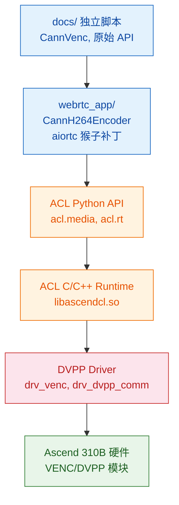
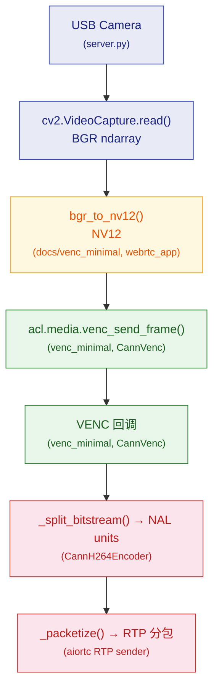

# CANN VENC 硬件编码完整指南

> **如何阅读本文**
>
> 如果你是第一次接触 CANN VENC，建议跳读：
> 1. [环境与架构](#环境与架构) — 确认你的 310B 满足前置条件
> 2. [练习脚本](#练习脚本) — 依次运行 3 个脚本，看到编码结果
> 3. 遇到报错 → 查 [开发过程与踩坑记录](#开发过程与踩坑记录)
> 4. 想理解原理 → 回读 [理论背景](#理论背景) 和 [VENC API 详解](#venc-api-详解)
>
> 文中所有完整可运行的代码都放在 [`docs/`](.) 目录下，与教程对应的文件已在各节标注。

## 目录

1. [环境与架构](#环境与架构)
2. [理论背景](#理论背景)
3. [VENC API 详解](#venc-api-详解)
4. [开发过程与踩坑记录](#开发过程与踩坑记录)
5. [练习脚本](#练习脚本)
6. [集成到 aiortc](#集成到-aiortc)
7. [性能对比与基准测试](#性能对比与基准测试)

---

## 理论背景

### 为什么需要硬件编码

H.264 视频编码是计算密集型任务。一块 640×480@30fps 的视频流，纯 CPU 软件编码（如 libx264）会占用 ARM Cortex-A55 的大量计算资源。对于 Orange Pi AI Pro 这样的嵌入式设备，CPU 资源有限，软件编码不仅影响视频质量（可能因算力不足而降低帧率），还挤占了其他任务的 CPU 时间。

昇腾 310B 芯片内部集成了 **VENC（Video Encoder）** 硬件模块，专用于 H.264/H.265 编码。硬件编码器具有：

- **固定功能电路**：编码路径完全硬化，功耗和延迟远低于通用 CPU
- **独立于 AI Core**：不占用 NPU 推理算力
- **实时性保证**：硬件 pipeline 确保编码在固定时间内完成

### CANN / ACL 体系

CANN（Compute Architecture for Neural Networks）是华为昇腾芯片的全栈软件栈，其层级结构如下：



- **docs/ 独立脚本**：教程递进代码，不依赖任何项目模块，读者可直接运行
- **webrtc_app/**：项目层，对接 aiortc WebRTC 栈

- **ACL**（Ascend Computing Language）：CANN 的核心编程接口，提供设备管理、内存管理、媒体处理等 API
- **DVPP**（Digital Vision Pre-Processing）：数字视觉预处理模块，包含 VENC（编码）、VDEC（解码）、VPC（图像处理）、JPEG 编解码等
- **acl.media**：Python 侧对 DVPP 的封装

### VENC 在 DVPP 中的位置

DVPP 各子模块分工详见 [dvpp_guide.md §3](dvpp_guide.md#dvpp-子模块概览)。VENC 的职责：**NV12 原始帧 → H.264/H.265 码流**。

VDEC 是它的镜像：H.264/H.265 码流 → NV12。两者串联可形成全硬件转码管道。

### NV12 格式

VENC 的输入格式必须是 **NV12**（YUV420SP）。详见 [dvpp_guide.md §10 — NV12](dvpp_guide.md#nv12dvpp-的通用货币)，这里只强调 VENC 的关键约束：

- **总大小**：H × W × 3/2 字节（对比 RGB 的 H × W × 3，节省 50%）
- **stride 对齐**：VENC 要求宽度对齐到 16，未对齐会导致编码画面偏移或绿条。对齐公式：`((width + 15) // 16) * 16`

### 编码流程（端到端）



---

## 环境与架构

### 硬件

- **芯片**：Ascend 310B4（Orange Pi AI Pro）
- **VENC 模块**：支持 H.264 Baseline/Main/High，H.265 Main
- **驱动**：`drv_venc`, `drv_h264e`, `drv_h265e`（通过 `lsmod | grep venc` 验证）

### 软件

- **CANN 版本**：8.3.RC1
- **安装路径**：`/usr/local/Ascend/ascend-toolkit/8.3.RC1/`
- **Python API**：`/usr/local/Ascend/ascend-toolkit/latest/python/site-packages/acl/`
- **动态库**：`/usr/local/Ascend/ascend-toolkit/latest/aarch64-linux/lib64/`

### 环境变量

每次使用 CANN Python API 前必须设置：

```bash
export LD_LIBRARY_PATH="/usr/local/Ascend/ascend-toolkit/latest/aarch64-linux/lib64:/usr/local/Ascend/driver/lib64:$LD_LIBRARY_PATH"
export PYTHONPATH="/usr/local/Ascend/ascend-toolkit/latest/python/site-packages:$PYTHONPATH"
```

这两个变量分别解决了：
- `libascendcl.so: cannot open shared object file` — 动态库找不到
- `No module named 'acl'` — Python 包找不到

---

## VENC API 详解

### ACL 初始化

4 步固定初始化详见 [dvpp_guide.md §5](dvpp_guide.md#acl-初始化四步必需咒语)，此处只给出 VENC 上下文的代码：

```python
import acl

ret = acl.init()                    # ①
ret = acl.rt.set_device(0)          # ②
ctx, ret = acl.rt.create_context(0) # ③
ret = acl.rt.set_context(ctx)       # ④
assert ret == 0
```

所有后续的 VENC API 调用都依赖这个上下文。

### VENC 通道模型

通道模型详见 [dvpp_guide.md §6](dvpp_guide.md#通道模型)，这里只列出 VENC 特有的 API：


| 函数 | 用途 |
|------|------|
| `venc_create_channel_desc()` | 创建通道描述符 |
| `venc_set_channel_desc_*()` | 设置通道参数（见下节） |
| `venc_create_channel(desc)` | 创建通道（返回 0 即成功） |
| `venc_send_frame(...)` | 发送一帧到编码器 |
| `venc_create_frame_config()` | 创建帧配置（控制 force I-frame 等） |
| `venc_destroy_channel(desc)` | 销毁通道 |
| `venc_destroy_channel_desc(desc)` | 销毁描述符 |

### 通道参数详解

创建 VENC 通道前，必须在描述符上设置以下参数：

| 参数 setter | 含义 | 值域 | 示例 |
|-------------|------|------|------|
| `entype` | 编码类型 | 0=H265, 1=H264_BASE, 2=H264_MAIN, 3=H264_HIGH | `1` |
| `pic_format` | 输入像素格式 | 1=NV12, 12=RGB888, 13=BGR888 | `1` |
| `pic_width` | 帧宽度（像素） | 对齐到 16 | `640` |
| `pic_height` | 帧高度（像素） | 对齐到 2 | `480` |
| `key_frame_interval` | GOP 大小 | **[1, 65536]** | `30` |
| `src_rate` | 输入帧率 | 正整数 | `30` |
| `max_bit_rate` | 最大码率 | **[2, 614400]** **kbps** | `2000` |
| `rc_mode` | 码率控制模式 | 1=VBR, 2=CBR | `2` |
| `thread_id` | 回调线程 ID | `acl.util.start_thread()` 返回值 | — |
| `callback` | 编码完成回调 | Python 函数 | — |

### 回调机制

回调线程模型详见 [dvpp_guide.md §7](dvpp_guide.md#回调线程模型)。VENC 的回调特点：

- 参数顺序：**`(input_pic_desc, output_stream_desc)`** — 第一个是输入图片，第二个是输出码流
- 输入 `pic_desc` 必须由回调销毁（`dvpp_destroy_pic_desc`）
- 输出 `stream_desc` 的数据需在回调中通过 `malloc_host` + `memcpy` 拷到主机内存
- 通过 `queue.Queue` 将编码结果传回主线程，实现异步→同步转换

---

## 开发过程与踩坑记录

### 坑 #1：Python 环境找不到 acl 模块

**现象**：
```
ModuleNotFoundError: No module named 'acl'
```

**根因**：CANN 的 Python 包不在标准 `sys.path` 中。即使 `conda activate` 了正确的环境，CANN 的 site-packages 也不会自动加入搜索路径。

**修复**：

```bash
export PYTHONPATH="/usr/local/Ascend/ascend-toolkit/latest/python/site-packages:$PYTHONPATH"
```

**教训**：CANN 的 Python 路径是 `<toolkit>/python/site-packages`，**不是** `<toolkit>/aarch64-linux/python/site-packages`。`aarch64-linux/` 下只有动态库（`lib64/`），没有 Python 包。

> **在代码中修复？** 教程的 `docs/` 独立脚本遵循"环境变量在进程外设置"的原则，不内置 `sys.path` 操作代码。这样读者明确知道依赖从哪来，避免隐藏的路径魔法。项目层的 `webrtc_app/cann_encoder.py` 中有 `_try_import_cann()` 做自动路径发现，但那是因为服务端需要防御性编程。

---

### 坑 #2：libascendcl.so 找不到

**现象**：
```
ImportError: libascendcl.so: cannot open shared object file: No such file or directory
```

**根因**：即使 `import acl` 成功（因为 Python 包路径正确），底层 C 扩展仍需要动态库。

**修复**：
```bash
export LD_LIBRARY_PATH="/usr/local/Ascend/ascend-toolkit/latest/aarch64-linux/lib64:/usr/local/Ascend/driver/lib64:$LD_LIBRARY_PATH"
```

---

### 坑 #3：venc_create_channel 返回 507018 — bitrate 单位错误

**现象**：
```
RuntimeError: venc_create_channel failed: 507018 (0x7bc8a)
dmesg: rc_drv_check_bit_rate bit rate set 2000000k error for out of [2k, 614400k]
```

**根因**：`max_bit_rate` 的单位是 **kbps**（千比特/秒），不是 bps（比特/秒）。

我传入了 `2_000_000`（2 Mbps 以 bps 表示），被 VENC 驱动解释为 2,000,000 kbps = 2 Gbps，远超上限 614,400 kbps。

**修复**：
```python
# 错误
media.venc_set_channel_desc_max_bit_rate(desc, 2_000_000)  # bps → 超出范围

# 正确
media.venc_set_channel_desc_max_bit_rate(desc, 2_000)       # kbps = 2 Mbps
```

**dmesg 调试技巧**：VENC 错误信息会写入内核日志，`dmesg | grep -i venc` 是排查参数问题的第一手段。

---

### 坑 #4：venc_create_channel 返回 507018 — GOP 为 0

**现象**：
```
dmesg: rc_check_com_attr gop 0 err, should be in [1 65536]
dmesg: rc_create_chn check user rc attr err
```

**根因**：`key_frame_interval`（即 GOP — Group of Pictures）未设置，默认值为 0，不在合法范围 [1, 65536] 内。

GOP 控制多少个 P/B 帧之间插入一个 I 帧（关键帧）。GOP=30 意味着每 30 帧一个 I 帧，这在 30fps 下相当于每秒一个关键帧。GOP=0 对编码器没有意义（永远不产生 I 帧？），因此被拒绝。

**修复**：
```python
media.venc_set_channel_desc_key_frame_interval(desc, 30)  # GOP=30
```

---

### 坑 #5：venc_set_channel_desc_channel_id 不存在

**现象**：
```
AttributeError: module 'acl.media' has no attribute 'venc_set_channel_desc_channel_id'
```

**根因**：VDEC 有 `vdec_set_channel_desc_channel_id`，但 VENC 的 API 中**没有对应的 setter**。VENC 的 channel_id 由驱动自动分配，不能手动设置。

这暴露了 CANN API 的一个不对称设计：VDEC 和 VENC 虽然结构相似，但细节不同，不能简单类比。

---

### 坑 #6：NumPy 维度索引错误

**现象**：
```
ValueError: could not broadcast input array from shape (640,640) into shape (640,)
```

**根因**：NV12 数据是 2D 数组 `(H*3/2, W)`，但代码用 1D 线性偏移去索引：
```python
# 错误：nv12_data[src_off : src_off + w] 切出了形状 (w, w) 而非 (w,)
nv12_padded[off : off + w] = nv12_data[src_off : src_off + w]  # 2D → 1D 广播失败
```

当 `src_off = row * w = 0` 时，`nv12_data[0:640]` 取到的是整个 Y plane 的前 640 行（即整个 640×640 区域），而不是第 0 行的 640 个像素。

**修复**：使用 2D 切片明确行列：
```python
nv12_padded_2d = np.zeros(stride * h * 3 // 2, dtype=np.uint8).reshape(-1, stride)
nv12_src_2d = nv12_data.reshape(-1, w)

# Y plane
for row in range(h):
    nv12_padded_2d[row, :w] = nv12_src_2d[row, :w]

# UV plane
for row in range(h // 2):
    nv12_padded_2d[h + row, :w] = nv12_src_2d[h + row, :w]

nv12_padded = nv12_padded_2d.ravel()
```

---

### 坑 #7：stide 对齐

VENC 要求输入帧的宽度**对齐到 16**（硬件约束）。NV12 数据填充时，Y plane 每行宽度应为 `aligned_width`（stride），UV plane 同理。

```python
self._align = 16
self._stride = ((width + self._align - 1) // self._align) * self._align
# 640 → 640 (已对齐)，638 → 640 (补齐)
```

不设置 stride 对齐会导致编码出的画面出现偏移或绿条。

---

### 坑 #8：NPU Alarm 状态混淆

**现象**：
```
npu-smi info: Health = Alarm
```

这让我们一度怀疑 VENC 不可用。但实际测试表明 Alarm 不影响 VENC（参数正确就能创建成功）。`Alarm` 可能与其他传感器（温度、电源）有关，不一定反映 DVPP 模块状态。

**经验**：不要被 NPU 全局状态迷惑，通过 `dmesg` 获取具体的模块级错误信息。

---

## 练习脚本

三个可独立运行的脚本位于 [`docs/`](.)，建议按顺序阅读理解。

### 概览

| 文件 | 你会学到 | 运行时间 |
|------|----------|----------|
| `check_cann.py` | ACL 初始化的 4 个必要调用 | <1s |
| `venc_minimal.py` | 原始 VENC API：回调线程、DVPP 内存、发送一帧 | ~3s |
| `bench_venc.py` | `CannVenc` 封装类 + 5 分辨率扫描对比 | ~20s |

> **关于 acllite**：CANN 自带的 acllite 库（`/usr/local/Ascend/thirdpart/aarch64/acllite/`）封装了 VPC、JPEG、VDEC，但**没有 VENC 封装**。生产代码推荐用本项目 `webrtc_app/cann_encoder.py` 中的 `CannVenc` 类（见[集成到 aiortc](#集成到-aiortc)）。

```bash
cd ~/Documents/WebRTC
export LD_LIBRARY_PATH="/usr/local/Ascend/ascend-toolkit/latest/aarch64-linux/lib64:/usr/local/Ascend/driver/lib64:$LD_LIBRARY_PATH"
export PYTHONPATH="/usr/local/Ascend/ascend-toolkit/latest/python/site-packages:$PYTHONPATH"

python docs/check_cann.py        # → ACL init OK  soc=Ascend310B4
python docs/venc_minimal.py      # → Encoded keyframe: ~135 KB
python docs/bench_venc.py        # → VENC 4.3ms/帧 @480p  CPU 20.8ms  加速 4.9x
```

---

### 走读：ACL 初始化 — [`check_cann.py`](check_cann.py)

```python
import acl

ret = acl.init()                    # ① 初始化 ACL 运行时
ret = acl.rt.set_device(0)          # ② 绑定设备 0
ctx, ret = acl.rt.create_context(0) # ③ 创建执行上下文
ret = acl.rt.set_context(ctx)       # ④ 绑定上下文到当前线程
```

这四个调用是**固定的**，顺序不能变。任何使用 CANN 的 Python 进程都需要它们。

### 走读：最小编码 — [`venc_minimal.py`](venc_minimal.py)

这是理解 VENC 的核心文件。代码分为 5 个阶段：

**① ACL 初始化** — 与 step1 相同。

**② 回调线程** — VENC 是异步的：
```python
cb_queue: queue.Queue = queue.Queue(maxsize=8)

def venc_callback(input_pic_desc, output_stream_desc, _user_data):
    size = media.dvpp_get_stream_desc_size(output_stream_desc)  # 读取编码后大小
    ptr  = media.dvpp_get_stream_desc_data(output_stream_desc)  # 读取数据指针
    host_buf = acl.rt.malloc_host(size)        # 分配主机内存
    acl.rt.memcpy(host_buf, size, ptr, size, ACL_MEMCPY_DEVICE_TO_HOST)
    cb_queue.put(ctypes.string_at(host_buf, size))  # 拷贝为 Python bytes
    acl.rt.free_host(host_buf)
    media.dvpp_destroy_pic_desc(input_pic_desc)     # 回调负责销毁输入

def callback_thread(_args):                  # 独立线程处理回调
    acl.rt.set_context(ctx)                  # 必须重新绑定上下文
    while running[0]:
        acl.rt.process_report(300)           # 300ms 轮询
```

**③ 创建通道** — 设置全部参数后调用 `venc_create_channel()`。
与第 4 章的参数表一一对应。

**④ 发送一帧** — NV12 padding（16 对齐）→ `dvpp_malloc` → `venc_send_frame` → `cb_queue.get()` 等待结果。

**⑤ 清理** — 销毁通道、描述符、帧配置，释放 DVPP 内存。

---

### 走读：封装与基准 — [`bench_venc.py`](bench_venc.py)

`bench_venc.py` 将原始 VENC API 封装为可复用的 `CannVenc` 类，然后做 **5 分辨率扫描**对比硬件 vs CPU 编码性能。整个文件 ~380 行，分为 6 个部分。

#### ① 测试参数

```python
RESOLUTIONS = [
    (640, 480),
    (1280, 720),
    (1920, 1080),
    (2560, 1440),      # 2K
    (3840, 2160),      # 4K
]

TEST_FRAMES = 90            # 恰好 3 个 GOP（GOP=30 × 3）
TEST_GOP = 30                # 1 个 I + 29 个 P，模拟真实视频流
RANDOM_SEED = 42             # 固定种子 → 结果可复现
WARMUP_FRAMES = 3
FPS = 30
```

- **90 帧**：3 个完整 GOP，每个 GOP 含 1 个 I 帧 + 29 个 P 帧，I 帧占比 3.3%，与真实视频流一致
- **固定种子 42**：同一种子下任何机器生成的测试帧内容相同，保证跨运行可复现
- **3 帧预热**：排除首次编码的驱动初始化开销（比旧版 10 帧更精简）

#### ② 确定性测试帧生成

```python
def make_test_nv12(n: int, w: int, h: int) -> list[np.ndarray]:
```

直接生成 NV12 帧给 VENC——无需 BGR→NV12 转换，测量的是**纯编码性能**。每帧包含：
- **水平渐变**（R 通道映射为 Y） + **垂直渐变叠加**
- **正弦移动白条**：模拟时间相关性，防止编码器走 P 帧"全零残差"捷径
- **角落棋盘格**：8×8 方块交替，测试空间纹理编码

`make_test_bgr()` 生成同样的视觉内容但为 BGR 格式——给 CPU libx264 用（PyAV 内部转为 YUV）。

#### ③ `CannVenc` 类详解

将 `venc_minimal.py` 的原始 API 封装为可复用的同步接口。

**`__init__`** — 通道创建：与 `venc_minimal.py` 相同逻辑，额外计算 stride 对齐（`((w+15)//16)*16`）和输出缓冲区大小。

**`_venc_callback`** — 编码完成回调：从 `output_stream_desc` 读取编码数据 → `malloc_host` → `memcpy` 拷到主机内存 → 放入 Queue。回调负责销毁输入的 `pic_desc`。

**`encode(nv12, force_keyframe)`** — 编码一帧：

```python
# ① NV12 宽度补齐到 stride（16 对齐）—— VENC 硬件约束
padded = np.zeros(stride * h * 3 // 2, dtype=np.uint8).reshape(-1, stride)
src = nv12.reshape(-1, w)
for r in range(h):                 # Y 平面逐行拷贝
    padded[r, :w] = src[r, :w]
for r in range(h // 2):             # UV 平面逐行拷贝
    padded[h + r, :w] = src[h + r, :w]

# ② 分配 DVPP 输入内存 + 拷贝 NV12 到设备
in_buf, _ = media.dvpp_malloc(padded.nbytes)
acl.rt.memcpy(in_buf, padded.nbytes, padded.ctypes.data, padded.nbytes,
              ACL_MEMCPY_HOST_TO_DEVICE)

# ③ 构造输入 pic_desc 和输出 stream_desc
pic = media.dvpp_create_pic_desc()
media.dvpp_set_pic_desc_data(pic, in_buf)
media.dvpp_set_pic_desc_format(pic, PIX_FMT_NV12)
media.dvpp_set_pic_desc_width_stride(pic, stride)    # ← 必须设置 stride
# ... 输出 out_buf + stream_desc ...

# ④ 可选强制 I 帧
if force_keyframe:
    media.venc_set_frame_config_force_i_frame(self._frame_cfg, True)

# ⑤ 排空回调队列（防止上一帧残留干扰）
while not self._cb_queue.empty():
    self._cb_queue.get_nowait()

# ⑥ 发送编码请求 + 等待回调
media.venc_send_frame(self._ch_desc, pic, sd, self._frame_cfg, None)
encoded = self._cb_queue.get(timeout=5.0)

# ⑦ 清理：释放 DVPP 内存、销毁 stream_desc、恢复 force I-frame 标志
```

**`destroy()`** — 先 `venc_destroy_channel` 再停回调线程，与 VDEC 的销毁顺序要求类似。

#### ④ CPU 编码对比 — `bench_libx264()`

```python
def bench_libx264(frames: list[np.ndarray], bitrate_bps: int) -> tuple:
    level = "31" if w * h <= 1280 * 720 else "40"   # ≤720p → 3.1, ≥1080p → 4.0
    codec = av.CodecContext.create("libx264", "w")
    codec.bit_rate = bitrate_bps                      # bps（注意与 VENC 的 kbps 区分）
    codec.options = {"level": level, "tune": "zerolatency"}
    codec.profile = "Baseline"                        # 与 VENC entype=1 对应
```

参数与 VENC 对齐：Baseline profile、zerolatency tune、相同码率。PyAV 内部自动将 BGR 转为 YUV420P。

#### ⑤ 主流程 — 分辨率扫描

```python
for w, h in RESOLUTIONS:
    bitrate_kbps = max(2000, int(w * h * FPS * 0.1 / 1000))
    bitrate_bps = bitrate_kbps * 1000

    nv12_frames = make_test_nv12(TEST_FRAMES, w, h)    # VENC 用
    bgr_frames = make_test_bgr(TEST_FRAMES, w, h)      # CPU 用

    # VENC 测量
    venc = CannVenc(w, h, bitrate=bitrate_kbps)
    for i in range(WARMUP_FRAMES):                     # 预热
        venc.encode(nv12_frames[i], force_keyframe=(i == 0))
    t0 = time.perf_counter()
    for i in range(TEST_FRAMES):                        # 正式测量
        venc.encode(nv12_frames[i], force_keyframe=(i % TEST_GOP == 0))
    venc_fps = TEST_FRAMES / (time.perf_counter() - t0)

    # CPU 测量
    _, cpu_fps, cpu_ms = bench_libx264(bgr_frames, bitrate_bps)

    speedup = venc_fps / cpu_fps
```

**码率自适应公式** `max(2000, w*h*fps*0.1/1000)` kbps：
- 480p：640×480×30×0.1/1000 = 921 → **2000 kbps**（保底 2 Mbps）
- 720p：1280×720×30×0.1/1000 = 2764 → **2764 kbps**
- 1080p：1920×1080×30×0.1/1000 = 6220 → **6220 kbps**
- 4K：3840×2160×30×0.1/1000 = 24883 → **24883 kbps**

含义：每像素每秒分配 0.1 bit，按分辨率等比缩放。

#### ⑥ 本文件与 `venc_minimal.py` 的关系

| | `venc_minimal.py` | `bench_venc.py` |
|---|---|---|
| 目的 | 教学——展示每个 API 调用 | 基准——评估性能 |
| 帧数 | 1 帧 | 90 帧 × 5 分辨率 |
| 封装 | 裸 API 直接调用 | `CannVenc` 类 |
| 对比 | 无 | 与 libx264 A/B 对比 |
| 内容 | 随机噪声 | 确定性帧（渐变+条+棋盘） |
| 输出 | 打印成功/失败 | 5 行对比表格 |

---

### 这些文件与项目的关系

| 文件 | 在项目中的角色 |
|------|---------------|
| `check_cann.py` | 环境诊断——出问题时先跑它 |
| `venc_minimal.py` | 学习用途——展示每个 API 调用（含 `bgr_to_nv12`） |
| `bench_venc.py` | 独立基准测试——`CannVenc` 封装类 + 性能对比 |
| `webrtc_app/cann_encoder.py` | 生产代码——`CannVenc` + `CannH264Encoder`(aiortc 集成) |

初次学习时只读 `docs/` 四个文件即可，理解后再看 `webrtc_app/cann_encoder.py` 的 aiortc 集成部分（[第 6 章](#集成到-aiortc)）。

---

## 集成到 aiortc

### 架构设计

aiortc 的编码器选择发生在 `aiortc.rtcrtpsender` 内部，基于 SDP 协商的 codec。对于 H.264，它实例化 `aiortc.codecs.h264.H264Encoder`。

我们的方案是**猴子补丁（Monkey Patch）**：

```python
import aiortc.codecs.h264 as h264_module
from webrtc_app.cann_encoder import CannH264Encoder

h264_module.H264Encoder = CannH264Encoder
```

这样 aiortc 在创建 H.264 编码器时，实际得到的是我们的 `CannH264Encoder` 实例。

### 继承策略

`CannH264Encoder` **继承** `H264Encoder`，而非从头实现：

```
H264Encoder (aiortc)
├── _encode_frame()     → 调用 libx264 编码         [覆盖]
├── _packetize()        → H.264 NAL → RTP 分包      [继承]
├── _split_bitstream()  → Annex-B → NAL 单元分割    [继承]
├── _packetize_fu_a()   → FU-A 分片                [继承]
├── _packetize_stap_a() → STAP-A 聚合               [继承]
├── encode()            → 编码入口                   [继承]
├── pack()              → RTP 包封装                 [继承]
└── target_bitrate      → 码率属性                   [继承]

CannH264Encoder(H264Encoder)
├── _encode_frame()     → 调用 CANN VENC 编码       [覆盖]
├── _ensure_venc()      → VENC 通道管理             [新增]
└── 其他全部继承
```

**为什么继承而非重写**：RTP H.264 载荷格式（RFC 6184）非常复杂，涉及 FU-A 分片（大 NAL 拆分为多个 RTP 包）、STAP-A 聚合（小 NAL 合并为一个 RTP 包）、NAL 头解析等。复用 aiortc 的实现能节省大量代码并保证兼容性。

### 回退机制

当 CANN 不可用时（如 libascendcl.so 未找到、NPU 驱动未加载），自动回退到 CPU 编码：

```python
class CannH264Encoder(H264Encoder):
    def _encode_frame(self, frame, force_keyframe):
        if not _CANN_READY:
            yield from super()._encode_frame(frame, force_keyframe)  # libx264
            return

        try:
            # CANN VENC 编码...
        except RuntimeError:
            logger.error("VENC failed, falling back to libx264")
            self._venc = None
            yield from super()._encode_frame(frame, force_keyframe)
```

---

## 性能对比与基准测试

### 实测数据：CANN VENC vs libx264

以下数据在 Orange Pi AI Pro（Ascend 310B4）上实测获得，使用 [`docs/bench_venc.py`](bench_venc.py) 脚本。

**测试条件**：GOP=30（I/P 混合），90 帧（3 个完整 GOP），确定性测试帧，固定种子 42。
码率按分辨率自动缩放：`max(2M, w*h*fps*0.1)` bps。

```
═══ VENC H.264 Resolution Scan: GOP=30, 90 frames ═══

Resolution             VENC        CPU  Speedup  VENC_ms   CPU_ms  Winner
───────────────────────────────────────────────────────────────────────────────
640x480            234.7       48.1   4.88x     4.3ms   20.8ms    VENC  [2Mbps]
1280x720            163.8       19.0   8.60x     6.1ms   52.5ms    VENC  [2Mbps]
1920x1080            90.9        9.2   9.84x    11.0ms  108.3ms    VENC  [6Mbps]
2560x1440            58.1        6.8   8.55x    17.2ms  147.2ms    VENC  [11Mbps]
3840x2160            29.0        3.8   7.71x    34.5ms  265.7ms    VENC  [24Mbps]
```

### 结果解读

| 分辨率 | 像素数 | VENC fps | CPU fps | 加速比 | VENC 延迟 | CPU 延迟 |
|--------|--------|----------|---------|--------|----------|---------|
| 640×480 | 0.3M | **235** | 48 | **4.9x** | 4.3ms | 20.8ms |
| 1280×720 | 0.9M | **164** | 19 | **8.6x** | 6.1ms | 52.5ms |
| 1920×1080 | 2.1M | **91** | 9 | **9.8x** | 11.0ms | 108.3ms |
| 2560×1440 | 3.7M | **58** | 7 | **8.6x** | 17.2ms | 147.2ms |
| 3840×2160 | 8.3M | **29** | 4 | **7.7x** | 34.5ms | 265.7ms |

#### VENC 延迟线性缩放

将 VENC 延迟与像素数画在坐标上：

```
像素数 →  0.3M    0.9M    2.1M    3.7M    8.3M
延迟   →  4.3ms   6.1ms   11.0ms  17.2ms  34.5ms
每 MP  →  14.3    6.8     5.2     4.6     4.2  ms/MP
```

- **绝对值线性增长**：像素翻倍 ≈ 延迟翻倍，硬件编码路径没有非线性瓶颈
- **每百万像素延迟递减**：从 14.3ms/MP（480p）降至 4.2ms/MP（4K）——高分辨率下硬件利用率更高
- **4K 单帧仅 34.5ms**：在 30fps 场景下，编码仅占帧间隔（33.3ms）的 103%，刚好够单路实时

#### CPU 延迟非线性恶化

```
像素数 →  0.3M    0.9M    2.1M    3.7M    8.3M
延迟   →  20.8ms  52.5ms  108.3ms 147.2ms 265.7ms
每 MP →  69.3    58.3    51.6    39.8    32.0   ms/MP
```

- **CPU 每百万像素延迟也递减**（69→32 ms/MP）但起点高得多
- **4K 单帧 265.7ms**：仅为 3.8 fps，无法实时编码
- **2K 开始 CPU 丧失实时性**：147ms/帧 → 6.8 fps，远低于 30fps 要求

#### 加速比曲线

```
 10x ┤                    ●9.8x
     │               ●8.6x    ●8.6x
  8x ┤
     │                                ●7.7x
  6x ┤
     │     ●4.9x
  4x ┤
     │
  2x ┤
     └─────┬──────┬──────┬──────┬──────
         480p   720p  1080p   2K     4K
```

加速比在 1080p 达到峰值 9.8x，之后缓慢下降。原因：
- 低分辨率：VENC 优势被固定开销（memcpy、回调调度）摊薄
- 1080p：CPU 已严重吃力（109ms/帧），VENC 仍从容（11ms/帧）→ 差距最大
- 2K/4K：VENC 延迟增速追近 CPU（两者都进入像素主导区）→ 加速比略降但仍 >7.7x

#### 与 VDEC 的对比

VENC 和 VDEC 在 Ascend 310B4 上的表现截然不同：

| 对比维度 | VENC（编码） | VDEC（解码） |
|----------|------------|------------|
| ≤1080p 表现 | **全面碾压 CPU**（5×~10×） | 严重落后 CPU（~59ms/帧固定开销） |
| 单帧延迟 @480p | **4.3ms** | 58.9ms |
| 4K 延迟 | **34.5ms** | 13.6ms |
| 拐点 | **无拐点**——所有分辨率都赢 | 2K 才开始领先单线程 CPU |
| 瓶颈 | 纯硬件编码（无调度开销） | Python 回调调度（75% 时间在非硬件） |
| 适合场景 | 全分辨率单路实时 | 仅 2K+ 或多路并发 |

**根因**：VENC 的硬件执行时间（编码部分）主导了总耗时，因为编码计算量大（DCT、量化、熵编码）。VDEC 的解码计算量小得多，总耗时被 Python 层调度开销（回调线程→Queue→主线程）主导。编码的"重计算"反而成就了 VENC 的优势——硬件干活，CPU 等着。

### 什么场景下使用 VENC

#### 场景决策树

```
需要实时视频编码（>30fps）？
├── 是 → 分辨率？
│       ├── ≤480p → CPU 48fps 够用，VENC 235fps 过剩但免费
│       │          → 建议 VENC（更省 CPU 给推理/分析用）
│       ├── 720p → CPU 19fps 不够实时！
│       │          → 必须 VENC
│       ├── 1080p → CPU 9fps，完全不可用
│       │          → 必须 VENC
│       ├── 2K → CPU 7fps
│       │          → 必须 VENC
│       └── 4K → CPU 4fps
│                  → 必须 VENC（且单路刚好 29fps 卡线实时）
└── 否（离线/批处理）→ CPU 可考虑，但 VENC 仍快 5~10x
```

#### 典型场景推荐

| 场景 | 推荐方案 | 理由 |
|------|---------|------|
| **WebRTC 视频通话** | **VENC** | 480p/720p 实时编码 + CPU 留给推理 |
| **USB 摄像头监控** | **VENC** | 1080p@30fps CPU 跑不动，VENC 轻松 |
| **多路视频流 (>2 路)** | **VENC 必须** | CPU 单路 720p 就 19fps，多路不可行 |
| **4K 录制** | **VENC** | CPU 4fps，VENC 29fps 刚好实时 |
| **本地视频文件转码** | 均可 | 离线场景 CPU 也可，但 VENC 更快 |
| **AI 推理 + 视频边车** | **VENC** | CPU 编码会抢占 NPU 推理的 host 侧资源 |
| **低功耗设备** | **VENC** | 硬件编码功耗远低于 CPU 全速运行 |

#### 多路并发估算

以 1080p@30fps 为目标帧率：

| 编码器 | 单路 fps | 最多支持路数 | CPU 剩余 |
|--------|---------|-------------|---------|
| CPU libx264 | 9 | **0 路**（不到 30） | 0% |
| **VENC** | 91 | **3 路**（91/30） | ~95% |

VENC 的 91fps 吞吐意味着可以同时编码 3 路 1080p@30fps，CPU 几乎空闲。

#### 什么情况下 CPU 编码就够了

只有**离线批处理**且满足以下全部条件时，CPU 才有意义：
- 分辨率 ≤ 480p（CPU 48fps 够用）
- 不需要实时输出（无帧率硬性要求）
- 无并发推理任务（CPU 全给编码用）
- 不想引入 CANN 依赖（如 Docker 环境未安装 CANN）

**底线**：从 720p 开始，CPU 就达不到 30fps。任何实时视频场景 — 尤其是在 Orange Pi 这样的嵌入式 ARM 设备上 — VENC 都是刚需。

### 验证方法

在 Orange Pi 上分别运行 CPU 和硬件编码服务器，用 `htop` 观察实时 CPU 占用差异：

```bash
# CPU 编码
python server.py --source usb_camera

# 硬件编码
python server.py --source usb_camera --hardware-encode
```

或直接跑基准测试：

```bash
cd ~/Documents/WebRTC
export LD_LIBRARY_PATH="/usr/local/Ascend/ascend-toolkit/latest/aarch64-linux/lib64:/usr/local/Ascend/driver/lib64:$LD_LIBRARY_PATH"
export PYTHONPATH="/usr/local/Ascend/ascend-toolkit/latest/python/site-packages:$PYTHONPATH"
python docs/bench_venc.py
```

---

## 附录

### 常用调试命令

```bash
# NPU 状态
npu-smi info
npu-smi info -t usages -i 0

# VENC 驱动状态
lsmod | grep venc

# VENC 内核日志（参数错误信息 —— 排查 507018 必用）
dmesg | grep -i venc | tail -10

# 环境验证（等价于 check_cann.py）
python docs/check_cann.py

# 运行全部单元测试（需要 pytest）
pytest test/ -v

# 运行基准测试
python docs/bench_venc.py
```

### 参数速查表

```
VENC 通道参数：
┌──────────────────────┬──────────┬─────────────────────┬───────────┐
│ 参数                  │ 函数                                │ 默认   │ 我们的值  │
├──────────────────────┼─────────────────────────────────────┼────────┼──────────┤
│ 编码类型              │ venc_set_channel_desc_entype         │ —      │ 1 (H264) │
│ 像素格式              │ venc_set_channel_desc_pic_format     │ —      │ 1 (NV12) │
│ 宽度                  │ venc_set_channel_desc_pic_width      │ —      │ 640      │
│ 高度                  │ venc_set_channel_desc_pic_height     │ —      │ 480      │
│ GOP                   │ venc_set_channel_desc_key_frame_interval│ 0  │ 30       │
│ 帧率                  │ venc_set_channel_desc_src_rate       │ —      │ 30       │
│ 最大码率 (kbps)       │ venc_set_channel_desc_max_bit_rate   │ —      │ 2000     │
│ 码率控制              │ venc_set_channel_desc_rc_mode        │ —      │ 2 (CBR)  │
│ 回调线程              │ venc_set_channel_desc_thread_id      │ —      │ tid      │
│ 回调函数              │ venc_set_channel_desc_callback       │ —      │ cb       │
└──────────────────────┴─────────────────────────────────────┴────────┴──────────┘

错误码：
  0         = ACL_SUCCESS
  507018    = 参数错误（检查 dmesg 获取具体原因）
  500001    = ACL_ERROR_FAILURE
  500004    = ACL_ERROR_DRV_FAILURE

编码类型：
  0 = H.265 Main
  1 = H.264 Baseline
  2 = H.264 Main
  3 = H.264 High

像素格式：
  1  = NV12 (YUV420SP)
  12 = RGB888
  13 = BGR888

码率控制：
  1 = VBR (Variable Bitrate)
  2 = CBR (Constant Bitrate)
```
