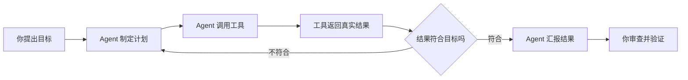
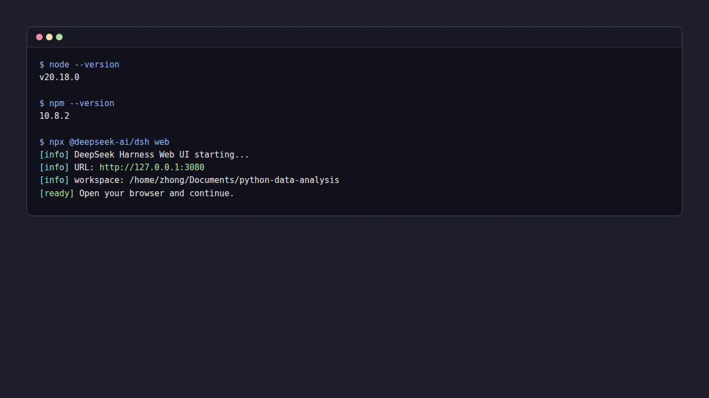
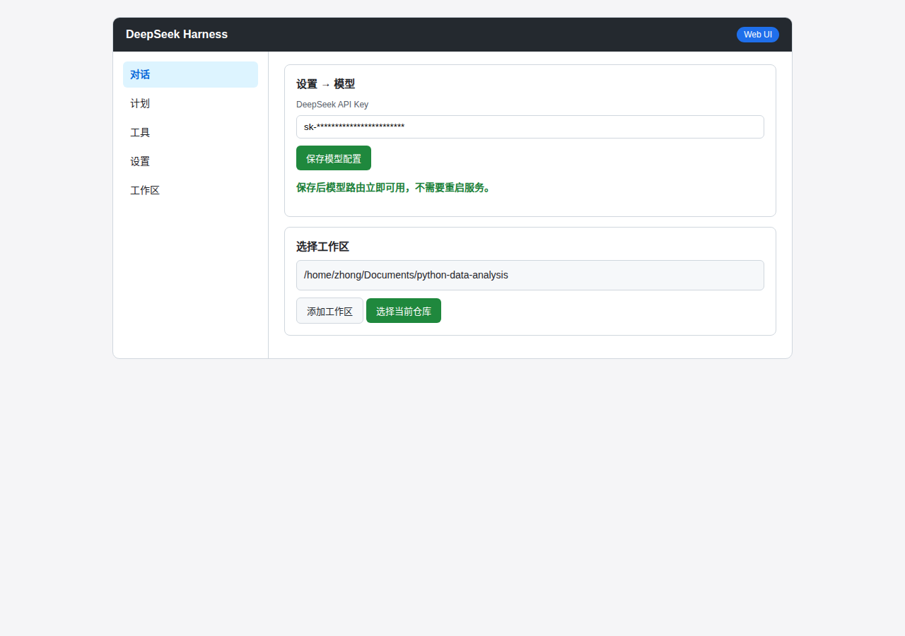

# 附录 4：Vibe Coding 基础

> **本章导读**
> 目标：掌握 Vibe Coding 的基本流程，用 DSH 生成、运行并审查 Python 代码。
> 环境：昇腾 310B 自带 Anaconda，本附录不安装 Python 环境。
> 数据：`samples/case7/models/registry.json`
> 输出：`tmp/appendix4/<姓名>/vibe_models.py`

Vibe Coding 是用自然语言描述目标，由 AI Agent 写代码并运行，人负责审查和验证。DSH 是这套流程中的执行环境，DeepSeek 负责理解任务和生成方案。本附录只讲基础流程，不要求提前掌握完整 Python 语法。

## 1. Vibe Coding 是什么

Vibe Coding 的基本流程是：人负责目标、边界和结果，Agent 负责代码生成、运行和修改。它的完整循环是：

```text
定义问题 → 要求最小版本 → 运行 → 反馈真实结果 → 追问 → 验证
```

每一步都有明确负责人：

| 工作 | 谁负责 | 检查重点 |
|---|---|---|
| 描述目标 | 你 | 要读什么、做什么、输出到哪里 |
| 制定计划 | Agent | 计划是否只动指定文件 |
| 生成代码 | Agent | 代码是否使用允许的工具和依赖 |
| 运行代码 | Agent | 是否先展示命令，再执行 |
| 解释代码 | Agent | 每一行是否都能讲清楚 |
| 审查结果 | 你 | 输出是否来自真实文件，结论能否复现 |
| 验证安全 | 你 | 是否修改了不该改的文件，是否泄露 Key |

Vibe Coding 适合探索代码、生成初稿、解释报错和快速迭代。它不适合在完全看不懂代码、不了解文件边界或没有验证方法时直接信任结果。

参考教程：

- [datawhalechina/easy-vibe](https://github.com/datawhalechina/easy-vibe)：从零开始学 AI 编程，用“先看示例 + 自己动手做”组织课程。
- [datawhalechina/vibe-vibe](https://github.com/datawhalechina/vibe-vibe)：系统化的 Vibe Coding 教程，强调从“写代码”转向“对话式创作”。

## 2. Agent 与 DSH 基础

AI Agent 不是普通的聊天机器人。聊天机器人只负责生成回答，Agent 还可以读取文件、运行命令、修改代码和搜索网页。DSH（DeepSeek Harness）是一个能执行这些操作的 Agent 工作环境。

一个 Agent 通常由四部分组成：

| 组成部分 | 作用 | DSH 中的例子 |
|---|---|---|
| 大模型 | 理解任务，生成计划和代码 | DeepSeek 大模型 |
| 工具 | 执行文件、命令和网络操作 | 读写文件、运行命令、搜索网页 |
| 记忆 | 记录目标和上下文 | 当前会话、长期目标 |
| 工作区 | Agent 的活动范围 | 当前仓库根目录 |

常见 Agent 可以按权限从低到高分类：

| Agent | 类型 | 是否直接操作本地文件 | 适合用途 |
|---|---|---|---|
| ChatGPT | 网页/App 助手 | 通常不会 | 问答、写作、代码解释 |
| AI IDE | 代码编辑器 | 会，但通常在打开的项目内 | 代码补全、修改当前项目 |
| DSH | 本地 Agent | 会，可以运行命令 | 读取文件、生成脚本、执行验证 |

DSH 的工作方式是一个循环：理解目标，制定计划，调用工具，看到结果，再调整计划。下面是一个简化的流程：



本教程使用 DeepSeek + DSH，因为 DeepSeek 的中文理解、代码和推理表现适合课程任务，DSH 提供了计划模式、工具调用和安全确认机制。模型 API 成本会随厂商调整，实际以官网为准。

参考资料：

- [Hannibal046/Awesome-LLM](https://github.com/Hannibal046/Awesome-LLM)：持续更新的大语言模型论文、工具和教程清单。
- [WangRongsheng/awesome-LLM-resources](https://github.com/WangRongsheng/awesome-LLM-resources)：中文友好的 LLM、Agent、多模态与训练推理资料汇总。
- [luban-agi/Awesome-AIGC-Tutorials](https://github.com/luban-agi/Awesome-AIGC-Tutorials)：面向入门学习的 LLM 和 AIGC 教程合集。
- [e2b-dev/awesome-ai-agents](https://github.com/e2b-dev/awesome-ai-agents)：AI Agent 框架、论文、工具和项目清单。
- [luo-junyu/Awesome-Agent-Papers](https://github.com/luo-junyu/Awesome-Agent-Papers)：以论文为主的 LLM Agent 综述和进展。
- [Shubhamsaboo/awesome-llm-apps](https://github.com/Shubhamsaboo/awesome-llm-apps)：Agent、RAG 和应用案例合集。

## 3. DSH 配置与安全检查

### 3.1 确认环境

昇腾 310B 自带 Anaconda，本附录不安装 Python 环境。先确认基础命令可用：

```bash
python --version
conda --version
dsh web
```

能看到 `python` 和 `conda` 版本即可继续。`dsh web` 启动后，浏览器打开：

```text
http://127.0.0.1:3080
```

DSH 的官方仓库在：

<https://github.com/deepseek-ai/deepseek-harness>




### 3.2 配置模型与工作区

DSH 需要两样配置才能开始工作：模型 API Key 和工作区。先到 DeepSeek 开放平台申请 API Key：

<https://platform.deepseek.com/>

申请后打开 DSH 的 `Settings → Models`，粘贴 API Key 并保存。然后在主界面点击 `Choose workspace`，选择本仓库根目录。昇腾 310B 上常见路径为：

```text
~/Documents/Ascend310
```

Windows 开发机上类似：

```text
D:\Github\Ascend310
```



API Key 只保存在本地设置里，不要写进教程、代码、聊天内容或 GitHub。

### 3.3 DSH 界面


| 区域 | 作用 | 常见操作 |
|---|---|---|
| 左侧会话栏 | 新建会话、切换历史会话 | 点“新会话”开始一个干净任务 |
| 中部消息区 | 你与 Agent 的对话记录 | 滚动查看每一步 |
| 底部输入框 | 输入自然语言任务 | 回车发送 |
| 工具行 | 显示 Agent 正在读取、编辑、运行什么 | 点击查看工具执行详情 |
| 右上角状态 | 当前工作区、模型、安全模式 | 确认工作区是否正确 |
| 设置 | API Key、模型、工作区配置 | 只配置一次，之后不要随意修改 |

每次开始任务前，先问一句：

```text
请告诉我当前工作区路径。
```

如果 DSH 回答的路径不是本仓库，先改回本仓库再继续。

### 3.4 安全规则

Agent 能做的事情和真人操作电脑一样有后果。看不懂的命令、不确定的文件修改，都可能破坏课程项目或系统环境。使用 DSH 时遵守五条规则：

1. 先看计划，再批准执行。
2. 只修改工作区里的指定文件。
3. 不执行删除、格式化、上传、系统级安装等危险命令。
4. 不把 API Key 写进代码、文档或 GitHub。
5. 结论必须能从文件内容或命令输出中验证。

常见风险与应对：

| 风险 | 表现 | 应对 |
|---|---|---|
| 选错工作区 | DSH 找不到文件，或修改了别的目录 | 先问当前工作区路径，再重新选择 |
| 危险命令 | Agent 要删除文件、安装依赖或改系统配置 | 停下来，要求解释，确认后再继续 |
| 生成看不懂的代码 | 代码能运行，但自己讲不清每一行 | 让 DSH 逐行解释，能复述后再验收 |
| Key 泄露 | API Key 出现在代码或文档中 | 删除 Key，重新生成，绝不提交 |
| 长任务失控 | Agent 连续修改多个文件 | 拆成小任务，每步检查一次结果 |

## 4. 第一次 Vibe Coding 任务

本附录的第一个任务不使用外部数据，改为读取本仓库中的模型清单：

```text
samples/case7/models/registry.json
```

文件里包含 `models` 列表，每个模型有 `model_id`、`status`、`embedding_dim` 和 `precision_mode` 等字段。

### 4.1 提示词

在 DSH 中输入：

```text
请先告诉我当前工作区路径，确认后开始。
请读取 samples/case7/models/registry.json，不要修改原文件。
用标准库 json 输出：
1. models 数量；
2. 每个模型的 model_id、status、embedding_dim、precision_mode。
代码保存到 tmp/appendix4/<姓名>/vibe_models.py。
只允许读取，不安装任何依赖。
```

提示词包含了目标、数据路径、输出位置、约束和验收标准。DSH 应该先制定计划，再读取文件，再生成脚本。

### 4.2 参考脚本

DSH 生成的代码可能不完全相同，下面是一个可运行的参考写法：

```python
import json
from pathlib import Path

path = Path("samples/case7/models/registry.json")
data = json.loads(path.read_text(encoding="utf-8"))
models = data["models"]

print("models:", len(models))
for model in models:
    print(model["model_id"], model["status"], model["embedding_dim"], model["precision_mode"])
```

### 4.3 预期输出

当前仓库实测输出：

```text
models: 3
mobileclip_s0__npu__mixed_fp16 admitted 512 allow_fp32_to_fp16
chinese_clip_rn50__npu__mixed_fp16 admitted 1024 allow_fp32_to_fp16
resnet50_feature__npu__mixed_fp16 admitted 2048 allow_fp32_to_fp16
```

如果 DSH 的输出和上面不一致，先检查工作区路径、文件内容和代码，不要直接接受结果。

### 4.4 验收步骤

DSH 完成任务后，按以下顺序验收：

1. 检查计划：是否只读取指定 JSON，不修改原文件。
2. 检查命令：是否只运行 Python，不执行安装或删除命令。
3. 检查代码：是否使用标准库 `json` 和 `pathlib`，没有 pandas。
4. 自己运行一次脚本，确认输出与文件内容一致。
5. 用一句话说明脚本读取了哪个字段、计算了什么、输出了什么。

## 5. 提示词与审查方法

### 5.1 提示词结构

| 要素 | 要求 | 示例 |
|---|---|---|
| 目标 | 说明要做什么 | 读取模型清单并输出摘要 |
| 数据路径 | 给出明确路径 | `samples/case7/models/registry.json` |
| 输出位置 | 说明代码保存到哪里 | `tmp/appendix4/<姓名>/vibe_models.py` |
| 约束 | 说明允许和禁止的操作 | 只读、只用标准库、不装依赖 |
| 验收标准 | 说明怎样算完成 | 输出模型数量、ID、状态、维度 |

好的提示词让 Agent 少猜测。坏的提示词只有一句话，例如“帮我分析一下”，这时 Agent 可能选错文件、改变工作区或生成无法验证的结论。

### 5.2 审查清单

| 项目 | 检查内容 |
|---|---|
| 计划 | Agent 是否先说明将读取什么、运行什么、写入什么 |
| 命令 | 每条命令是否看得懂，是否修改原文件 |
| 代码 | 是否能用标准库完成，是否每一行都能解释 |
| 输出 | 是否来自真实文件，能否复现 |
| 安全 | 是否没有删除、上传、安装系统级依赖，是否没有泄露 Key |
| 记录 | 是否保留了 DSH 修改代码的过程 |

## 6. 参考资料

- [datawhalechina/easy-vibe](https://github.com/datawhalechina/easy-vibe)：从零开始学 AI 编程，用“先看示例 + 自己动手做”组织课程。
- [datawhalechina/vibe-vibe](https://github.com/datawhalechina/vibe-vibe)：系统化的 Vibe Coding 教程，强调从“写代码”转向“对话式创作”。
- [Hannibal046/Awesome-LLM](https://github.com/Hannibal046/Awesome-LLM)：持续更新的大语言模型论文、工具和教程清单。
- [WangRongsheng/awesome-LLM-resources](https://github.com/WangRongsheng/awesome-LLM-resources)：中文友好的 LLM、Agent、多模态与训练推理资料汇总。
- [luban-agi/Awesome-AIGC-Tutorials](https://github.com/luban-agi/Awesome-AIGC-Tutorials)：面向入门学习的 LLM 和 AIGC 教程合集。
- [e2b-dev/awesome-ai-agents](https://github.com/e2b-dev/awesome-ai-agents)：AI Agent 框架、论文、工具和项目清单。
- [luo-junyu/Awesome-Agent-Papers](https://github.com/luo-junyu/Awesome-Agent-Papers)：以论文为主的 LLM Agent 综述和进展。
- [Shubhamsaboo/awesome-llm-apps](https://github.com/Shubhamsaboo/awesome-llm-apps)：Agent、RAG 和应用案例合集。
- [DSH 官方仓库](https://github.com/deepseek-ai/deepseek-harness)
- [DeepSeek 开放平台](https://platform.deepseek.com/)

## 7. 验证清单

- [ ] 能说出 Vibe Coding 的完整循环。
- [ ] 能区分 Agent、大模型、工具和工作区。
- [ ] `python --version` 和 `conda --version` 已确认可用。
- [ ] DSH 已启动，浏览器可以打开 `http://127.0.0.1:3080`。
- [ ] 已配置 API Key 和本仓库工作区。
- [ ] 能背出 5 条安全规则。
- [ ] 第一次任务只读取 `samples/case7/models/registry.json`，没有修改原文件。
- [ ] 能解释生成脚本中的 `json`、`Path` 和 `for` 循环。
- [ ] 脚本输出与文件内容一致。

## 8. 常见错误与坑

| 现象 | 可能原因 | 处理方式 |
|---|---|---|
| DSH 找不到文件 | 工作区不在本仓库 | 先问当前工作区路径，再重新选择 |
| DSH 修改了原文件 | 文件边界不清晰 | 明确只读路径，检查计划后再批准 |
| DSH 使用了 pandas | 提示词没有限制依赖 | 明确只用标准库 `json` 和 `pathlib` |
| 代码能运行但讲不清 | 直接接受了生成结果 | 让 DSH 逐行解释，自己复述后再保存 |
| API Key 出现在代码中 | 配置时把 Key 当数据传给了 Agent | 删除 Key 并重新生成，绝不提交 |
| 输出与文件不一致 | 没有自己运行脚本 | 重新运行，检查路径、字段和输出 |
| DSH 页面打不开 | 启动命令还在运行，或端口被占用 | 等显示 `URL: http://127.0.0.1:3080` 后再刷新 |

## 9. 作业

1. 用自己的话写 300 字以内的“Vibe Coding 安全说明”，至少包含：Vibe Coding 是什么、5 条安全规则、3 个绝对不执行的操作、为什么每条结论都要自己验证。把说明写入 `tmp/appendix4/<姓名>/safety.md`。
2. 写一份 150 字以内的“提示词设计说明”，解释为什么提示词要包含目标、路径、输出位置和约束。把说明整理成 `tmp/appendix4/<姓名>/prompt-notes.md`。
3. 让 DSH 读取 `samples/case7/models/registry.json`，输出 `models` 数量、每个模型的 `model_id`、`status`、`embedding_dim` 和 `precision_mode`。把脚本保存为 `tmp/appendix4/<姓名>/vibe_models.py`。
4. 让 DSH 增加一个统计维度，例如统计 `status == "admitted"` 的模型数量，或者按 `embedding_dim` 排序。
5. 把 DSH 生成的代码逐行审查一遍，说明哪几行最可能出错，为什么。

## 10. 评分要点

| 项目 | 要求 |
|---|---|
| 认知 | 能解释 Vibe Coding 和 Agent 的基本概念 |
| 安全 | 能背出红线，看不懂的命令会停下来解释 |
| 提示词 | 提示词包含目标、路径、输出位置、约束和验收标准 |
| 代码审查 | 能逐行解释生成脚本，能指出风险和修改点 |
| 结果验证 | 输出与 `samples/case7/models/registry.json` 一致 |
| AI 协作 | 保留 DSH 修改代码的记录，并说明每处修改为什么安全 |
