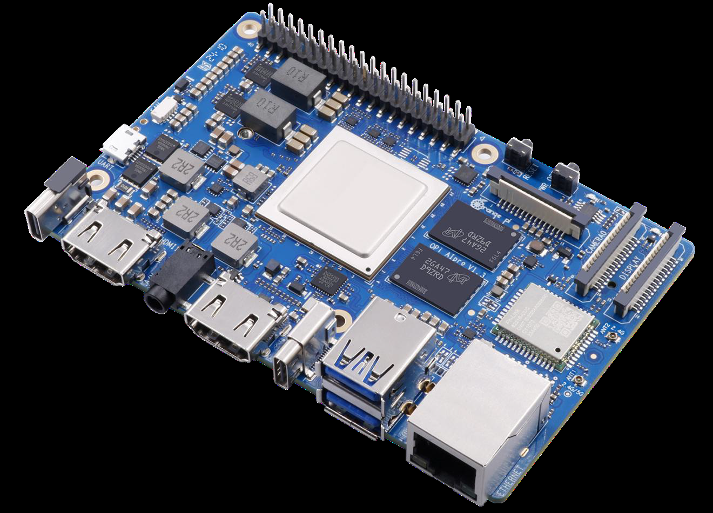
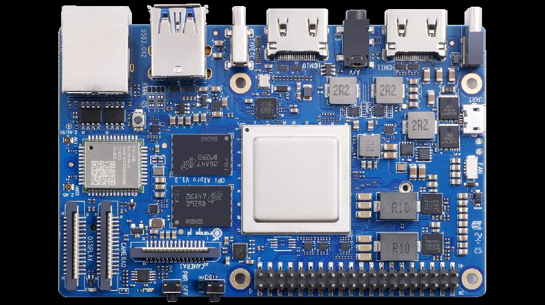
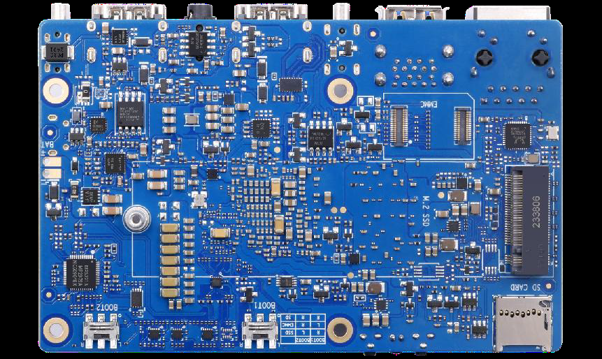
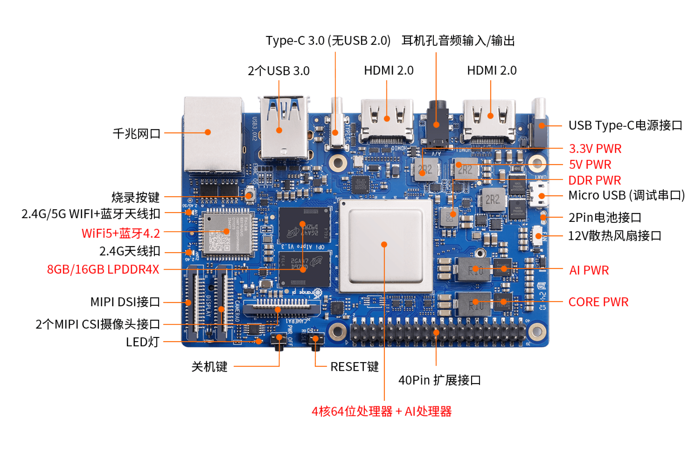
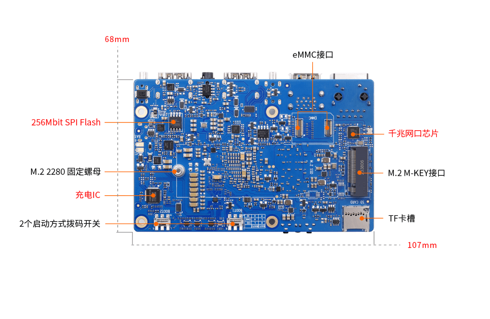
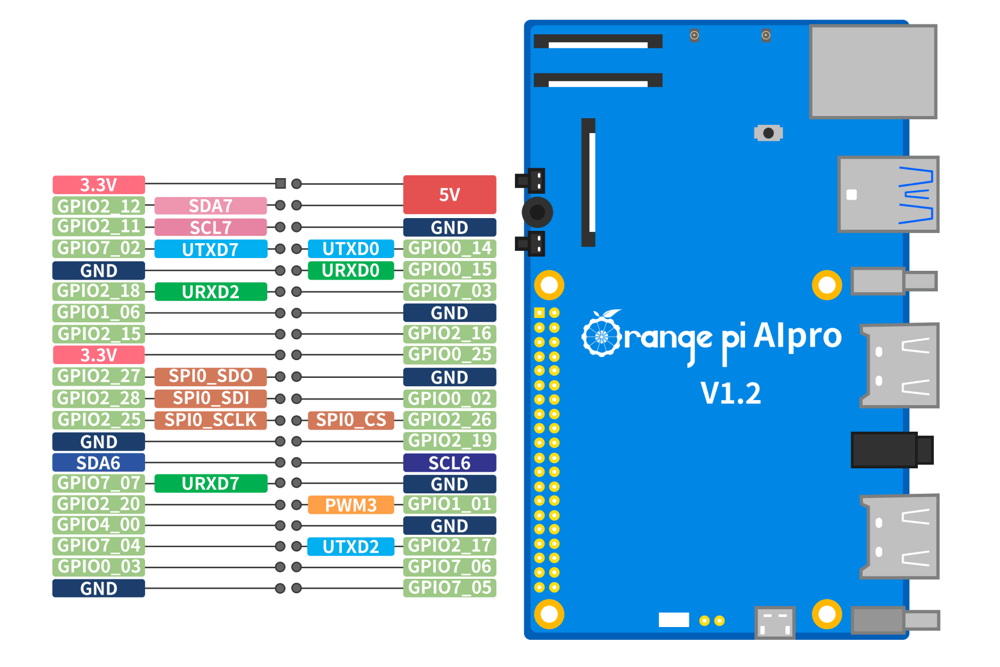

## 昇腾310B开发板介绍

OrangePi AIpro(8T)开发板是香橙派联合华为精心打造的高性能AI开发板，采用昇腾AI技术路线，搭载的昇腾310B为4核64位处理器+AI处理器，集成图形处理器，支持8TOPS INT8的AI算力，拥有8GB/16GB LPDDR4X内存，可以外接32GB/64GB/128GB/256GB eMMC模块，支持双4K高清输出。OrangePi AIpro(8T)引用了相当丰富的接口，包括两个HDMI输出、GPIO接口、Type-C电源接口、支持SATA/NVMe SSD 2280的M.2插槽、TF插槽、千兆网口、两个USB3.0、一个USB Type-C 3.0、一个Micro USB（串口打印调试功能）、两个MIPI摄像头、一个MIPI屏等，预留电池接口，可广泛适用于AI边缘计算、深度视觉学习及视频流AI分析、视频图像分析、自然语言处理、智能小车、机械臂、人工智能、无人机、云计算、AR/VR、智能安防、智能家居等领域，覆盖 AIoT各个行业。 OrangePi AIpro(8T)支持Ubuntu、openEuler操作系统，满足大多数AI算法原型验证、推理应用开发的需求。

### 开发板详细视图

### 开发板硬件规格