### 所需配件
1. TF卡
   容量最小为32GB，速率为Class10级以上的闪迪品牌的TF卡，如下图所示。建议使用64G及以上的TF卡，以避免在开发过程中出现磁盘空间不足的问题。
   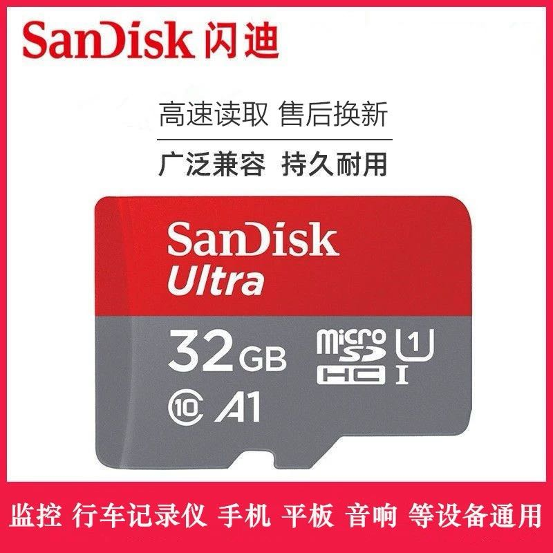

2. TF卡读卡器
   用于读写TF卡，刷写系统，建议选择速率为USB3.0以上的，减少系统刷写的等待时间。
   

3. HDMI线或HDMI转mini-HDMI线
   主要取决于显示器的接口类型该开发板的视频输出接口为标准HDMI接口。
   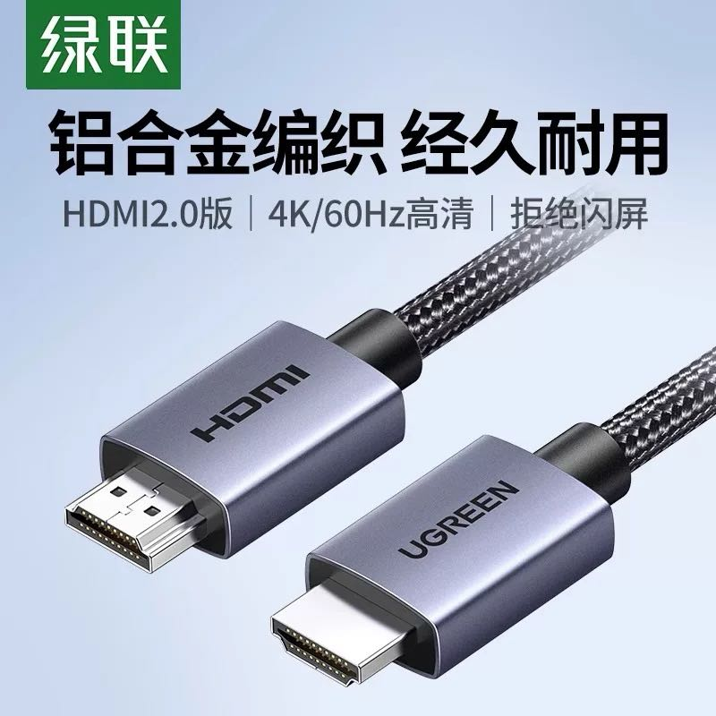
   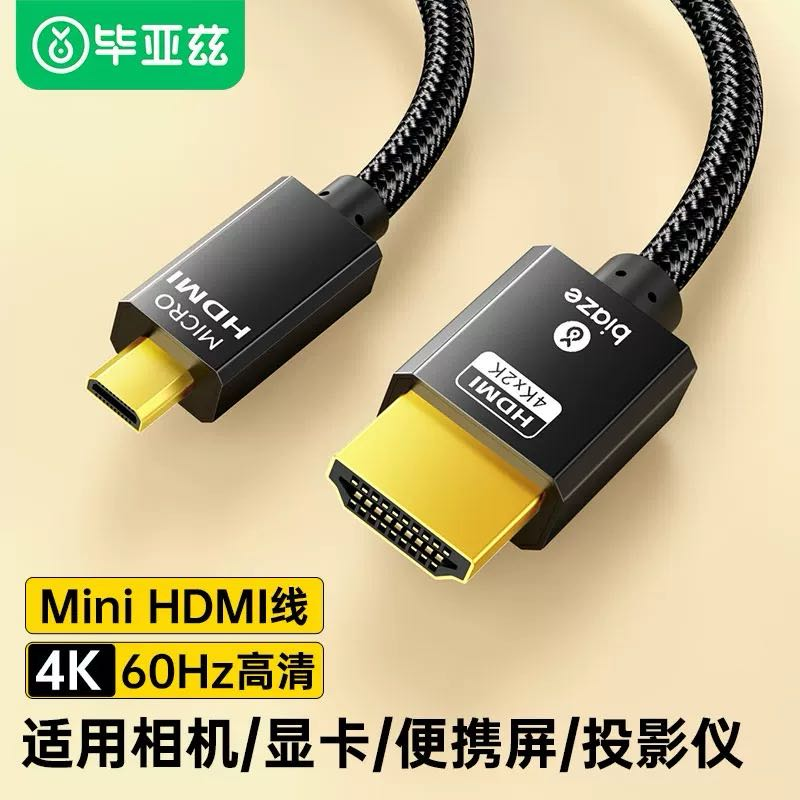

4. 电源
   该开发板的电源输入为PD 20V，需要搭配支持PD协议20V挡位的65W电源适配器。
   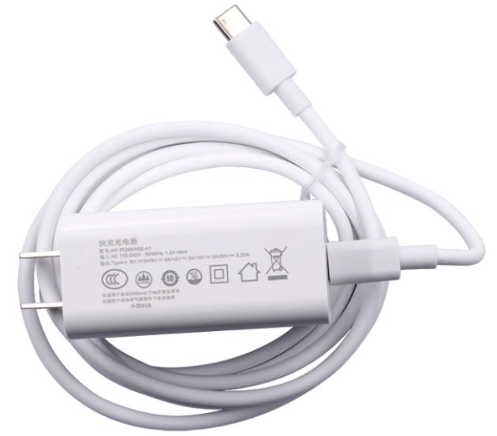

5. USB接口的鼠标以及键盘
   在无远程访问的条件下对开发板进行本地调试。
   

6. 金属配套外壳
   用于保护开发板硬件。
   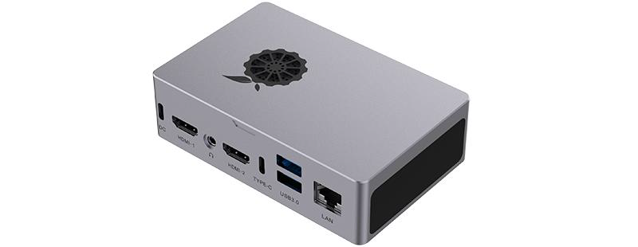

7. 12V散热风扇以及散热鳍块
   开发板的风扇接口为2pin，输出电压为12v，支持PWM调速。由于该开发板的CPU发热较大，强烈建议安装主动扇热设备。
   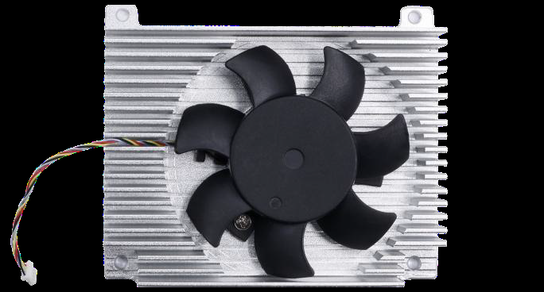

8. Type-C转USB 3.0转接线（可选）
   OrangePi AIPro开发板具有一个Type-C接口，协议为USB3.0（不支持USB 2.0），可外接支持USB3.0以上协议的外置设备。
   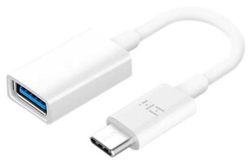

9. M.2接口 2280规格的PCIe Nvme SSD（可选）
   开发板的背部设计有M.2接口，可外接一个M.2的SSD作为开发板的系统盘或者存储。
   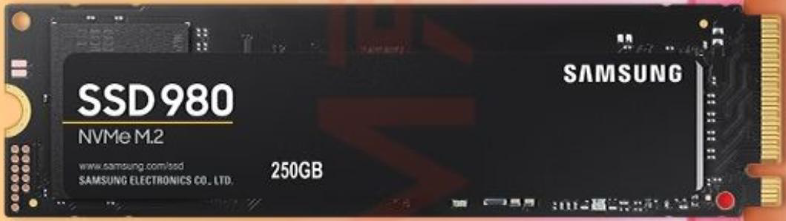

10. M.2接口 2280规格的Sata Ngff SSD（可选）
    同样，开发板的M.2接口不仅支持PCIe协议，也支持Sata协议，因此也可以使用Sata协议的SSD。
    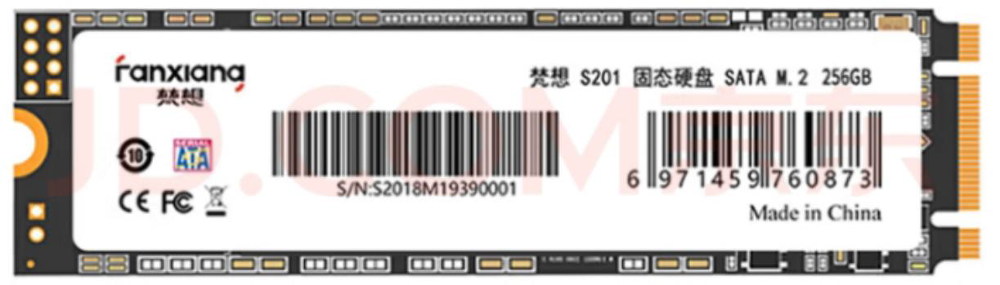

11. 香橙派的eMMC模块（可选）
    eMMC（嵌入式多媒体卡）是一种集成了闪存和控制器的低成本存储解决方案，主要用于智能手机、平板电脑和低端笔记本电脑等消费电子产品。其读写速度适中（100-400MB/s），比传统机械硬盘快但不及固态硬盘（SSD），具有体积小、功耗低和易于集成的特点。开发板支持使用eMMC模块作为存储，但需要额外购置eMMC模块。
    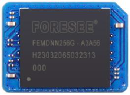
    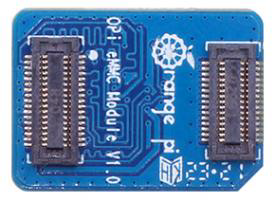

12. USB摄像头模块（可选）
    可用于图像识别、视频通话等多方面用途。
    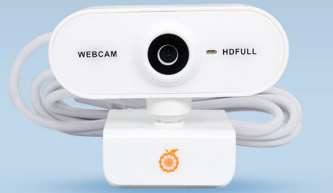

13. 网线（可选）
    开发板自带有wifi模块可用于连接wifi，若需要更稳定的网络连接，建议使用网线连接。
    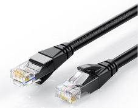

14. 树莓派IMX219型号摄像头（MIPI-CSI）（可选）
    开发板带有两个MIPI-CSI接口，可以兼容树莓派的MIPI摄像头，无需占用USB接口。
    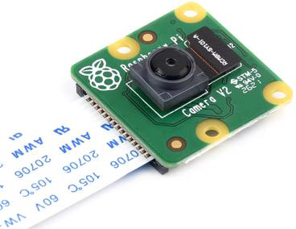

15. 树莓派5寸MIPI LCD显示屏（可选）
    开发板带有一个MIPI-DSI显示输出接口，可以直接驱动MIPI的显示屏，而无需外接显示器。
    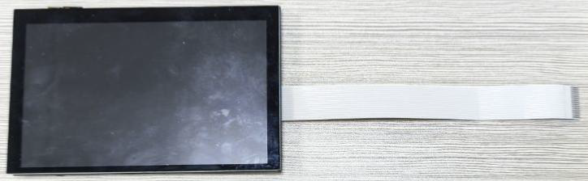

16. Micro USB数据线（可选）
    开发板自带了CH343P芯片，将UART转发为Micro USB接口，若需要使用串口对开发板进行调试，则需要使用Micro USB数据线。
    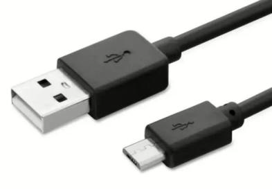

### 下载开发板的系统镜像
作为华为生态中重要的一员，开发板不仅支持Ubuntu系统，也支持openEuler系统，但由于开发板自身并无存储，我们在使用开发板的过程中需要使用电脑对TF卡进行系统的刷写，建议使用安装有Windows11 或 Ubuntu22.04以上版本的PC。

首先，打开香橙派官网的[技术支持界面](http://www.orangepi.cn/html/hardWare/computerAndMicrocontrollers/service-and-support/Orange-Pi-AIpro.html)。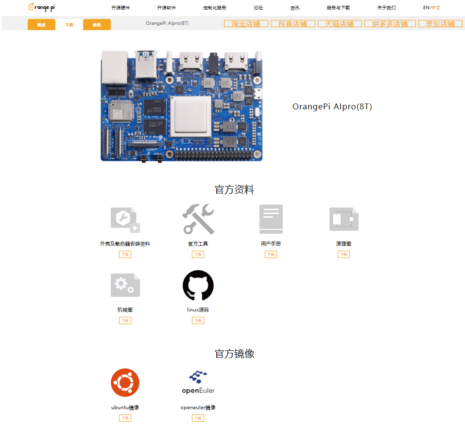

向下滑动网页，找到官方镜像部分，分为Ubuntu和openEuler两个部分，两个系统都是官方为我们编译完成的，且预装了部分昇腾NPU的应用环境以及软件，非常方便新手用户上手使用。


#### Ubuntu
1. 点击下载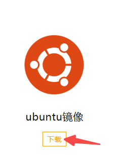
2. 复制提取码并跳转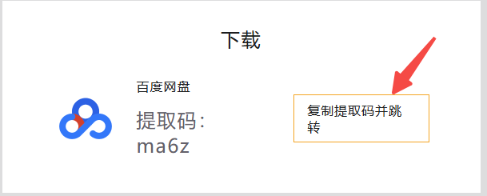
3. 打开百度网盘的链接后有一个命名为Ubuntu的文件夹，点开该文件夹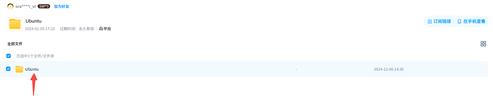
4. 文件夹中，后缀为.xz的文件是镜像压缩包文件，.sha文件是压缩包的md5校验码文件，用于校验镜像包文件是否完整。
5. 文件夹中的镜像有两种，一种文件名带有Desktop的，是带有GUI图形化界面的，另一种文件名带有minimal的，是不具有图形化界面的，只有命令行界面。建议新学习的用户使用带有desktop的镜像。 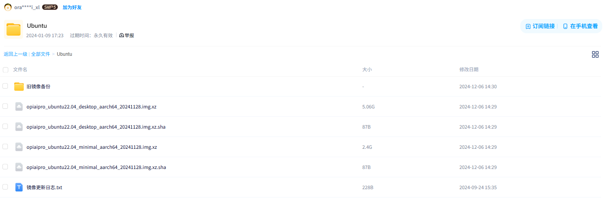
6. 下载后先校验压缩包是否完整，后解压压缩包

#### openEuler
1. 点击下载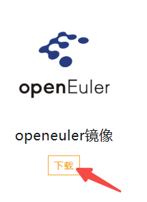
2. 复制提取码并跳转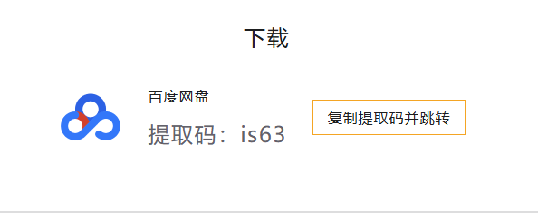
3. 打开百度网盘的链接后有一个命名为OpenEuler的文件夹，点开该文件夹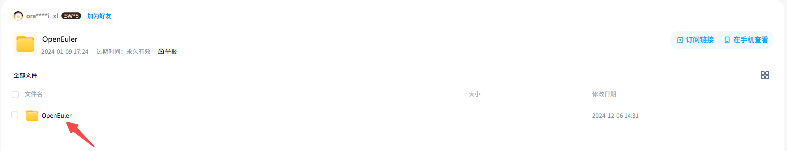
4. 文件夹中，后缀为.xz的文件是镜像压缩包文件，.sha文件是压缩包的md5校验码文件，用于校验镜像包文件是否完整。
5. 文件夹中的镜像只有一种，即具有GUI图形化界面的openEuler系统。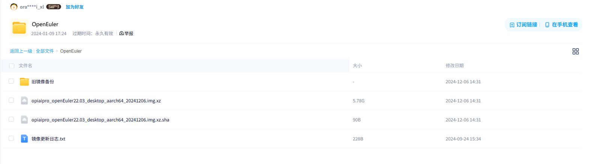
6. 下载后先校验压缩包是否完整，后解压压缩包

#### 使用md5校验下载的文件
在Windows系统下，可以使用`certutil -hashfile <filename> md5`;在Ubuntu系统下，可以使用`md5sum <filename>`；在MacOS系统下，可以使用`md5 <filename>`进行计算，此处以Windows系统为例：在文件夹按住Shift键并单击鼠标右键，选择“在终端（Powershell/命令提示符）中打开”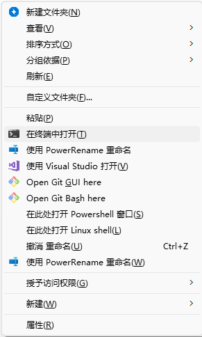，然后在打开的窗口中输入`certutil -hashfile opiaipro_ubuntu22.04_desktop_aarch64_20241128.img.xz md5`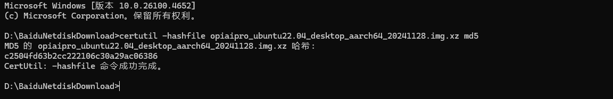，将得到的md5值与`opiaipro_ubuntu22.04_desktop_aarch64_20241128.img.xz.sha`文件进行对比，若一致可进行下一步操作，否则需要重新下载。

### 刷写系统到TF卡

#### 下载并安装必要的工具
> 下载链接：[官网](http://www.orangepi.cn/html/hardWare/computerAndMicrocontrollers/service-and-support/Orange-Pi-AIpro.html) [百度网盘](https://pan.baidu.com/s/1Jho73pw91r5GJD2KijY45Q?pwd=3xuz#list/path=%2F)
1. SD Card Formatter
   这个是TF卡的快速格式化工具，在每次需要刷写系统之前，都必须先对TF卡进行格式化操作，若不格式化在后续的刷写系统过程中有较大概率出错。
2. balenaEther
   这个是系统镜像的刷写工具，用于刷写img镜像文件进入TF卡。

#### 格式化TF卡
1. 将TF卡插入读卡器中，并将读卡器插入电脑
2. 打开SD Card Formatter软件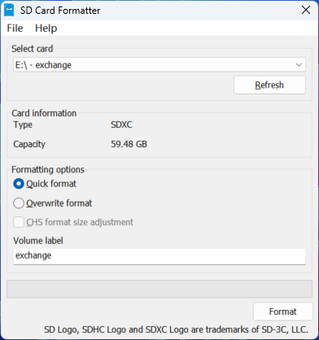
3. 点击右下角Format按键，格式化TF卡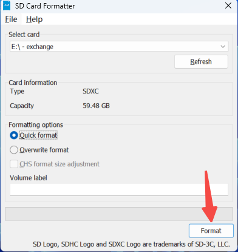
> 警告内容是关于格式化操作会清除TF卡上原有的所有数据，此处选是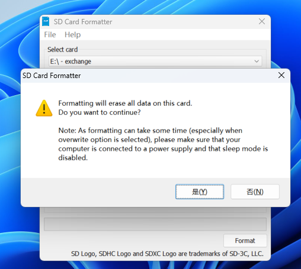
4. 等待软件格式化完成，并点击确定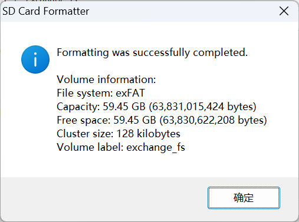

#### 刷写系统到TF卡（以Ubuntu为例）
> 此处以Ubuntu为例
1. 打开balenaEther，选择“从文件烧录”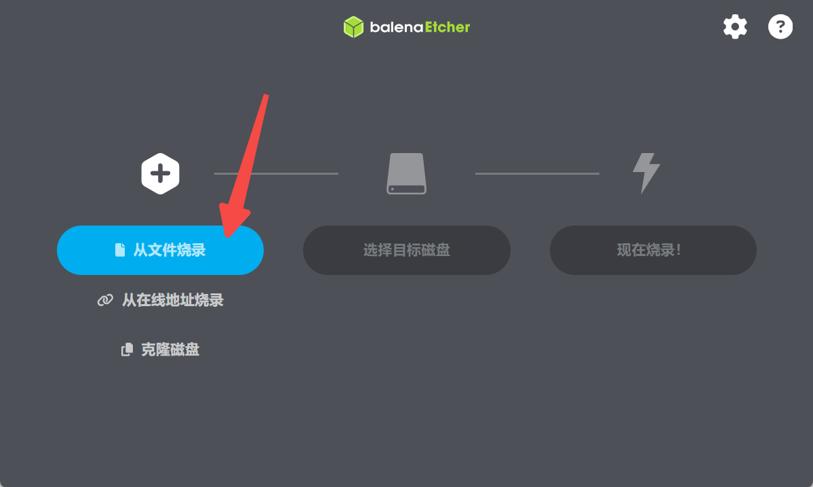
2. 选择好要烧录的镜像文件（**.img**格式），再选择目标磁盘为TF卡对应的位置，如图中名称为“SDXC Card”的位置，选中并选择“选定1”。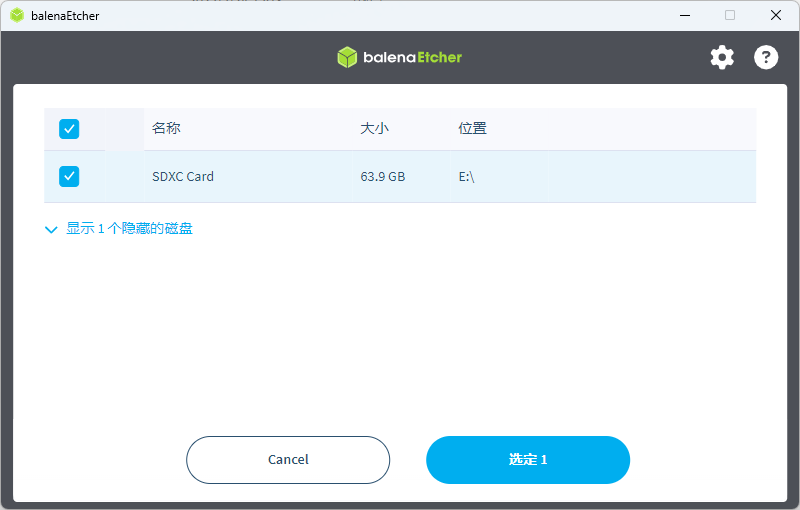
3. 点击“现在烧录！”，耐心等待烧录完成。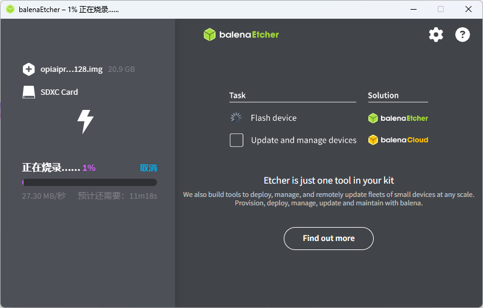
4. 烧录完成后进入校验过程，也请耐心等待。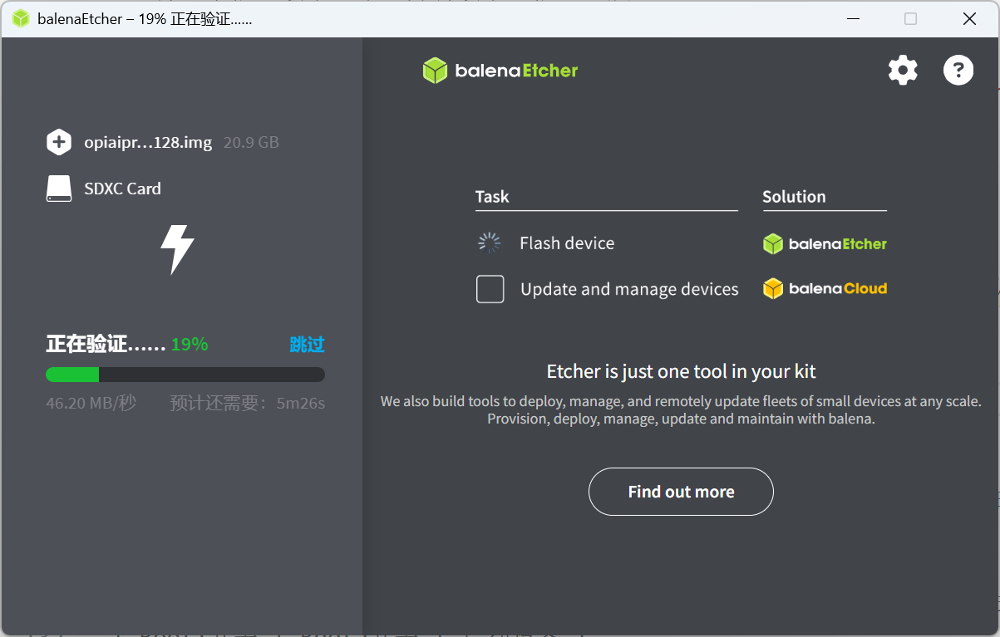
5. 烧录完成后即可关闭程序，并安全弹出TF卡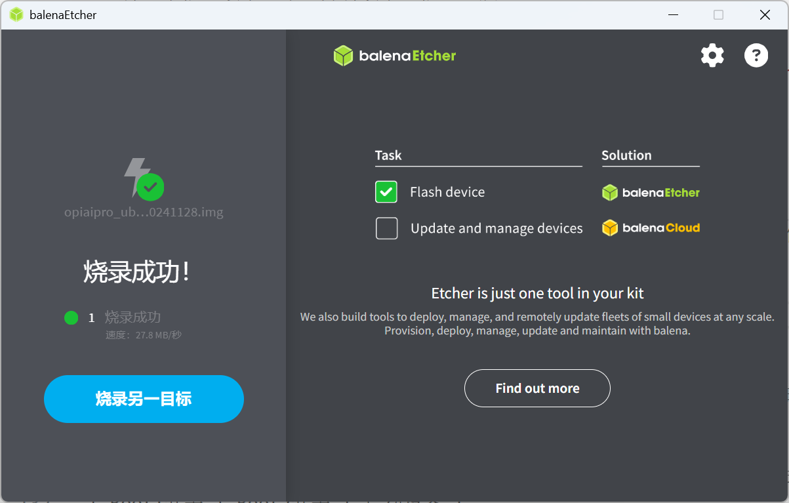

#### 刷写系统到eMMC
由于板上并不自带有eMMC模块，若要想使用需要额外购买香橙派的eMMC模块，此处暂时不列入参考，若需使用，请查阅香橙派的用户手册。

#### 刷写系统到SSD
开发板带有M.2接口，可以使用SSD作为启动设备。但SSD需要自行准备，且根据香橙派

#### 调整设备启动方式的拨码开关
开发板支持多种启动方式，包括TF卡、eMMC以及M.2 SSD，当这些存储设备都同时存在时，需要让开发板选定一个存储设备作为启动来源。
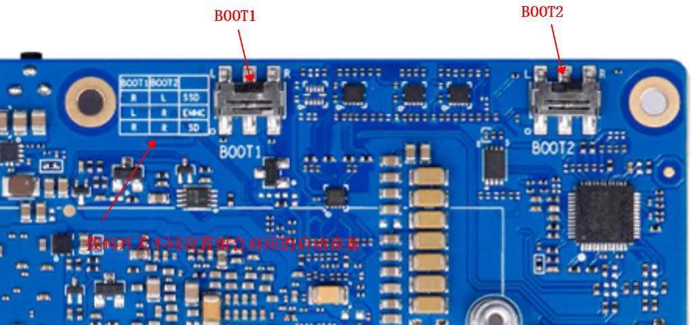
两个开关都有左、右两种状态，因此共有4种状态，但是目前开发板仅使用3种模式，对应的参数表如下：
| Boot1开关 | Boot2开关 | 启动设备 |
| :------: | :------: | :------: |
| 左 | 左 | 未使用 |
| 右 | 右 | TF卡 |
| 左 | 右 | eMMC |
| 右 | 左 | M.2 SSD (Nvme或Ngff)|
切换拨码开关后，必须要将开发板完全断电再重新上电才能使新的启动配置生效，使用RESET按键重启则不会使新的启动配置生效。


### 启动开发板（Ubuntu）
- 图形化界面
1. 将系统刷写完成的TF卡从读卡器中取出，插入开发板的TF卡插槽中，并确保两个启动开关的位置均在右边，接入HDMI数据线到靠近USB3.0接口的HDMI0接口，然后将Type-C电源线插入开发板最边缘的TYPE-C供电口，等待风扇的声音变小以及屏幕出现系统登录界面。
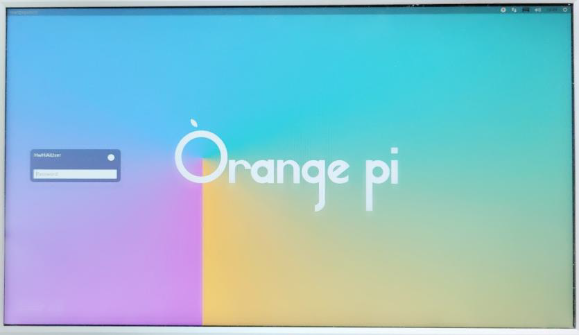
2. 进入登录界面后，将键盘接入开发板的USB接口中，默认的登录用户名是```HwHiAiUser```，输入该账户的密码```Mind@123```,登录进入系统。
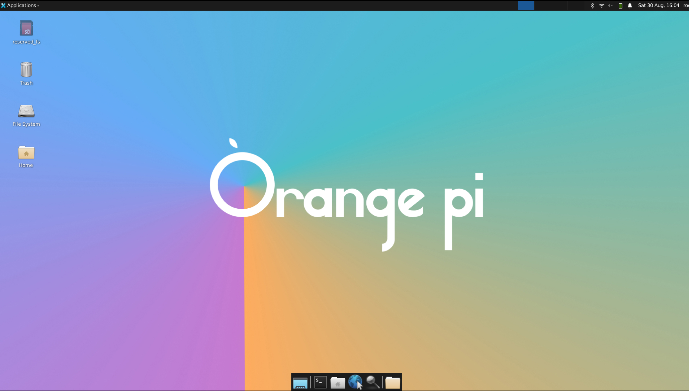
默认账户表格：
| 用户名 | 密码 |
| :---: | :--: |
| root | Mind@123 |
| HwHiAiUser | Mind@123 |

- 串口界面
1. 使用USB2TTL模块，与开发板的GPIO口进行连线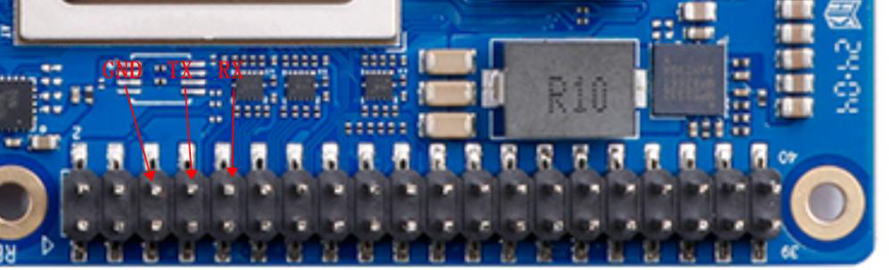，开发板的TX（GPIO8）接入USB2TTL模块的RX接口，开发板的RX（GPIO10）则接入模块的TX接口，并连接好GND接地，在Windows电脑下可以使用PUTTY连接串口。
2. 使用开发板自带的Micro USB接口进行串口调试，该方法更为方便，只需要一根Micro USB数据线，接入电脑后打开设备管理器查询对应的串口，然后使用PUTTY进行链接即可。
以Micro USB接口为例：
1. 使用Micro USB数据线连接开发板和电脑
2. 打开电脑的设备管理器，选择端口，寻找开发板对应的串口端口号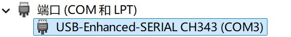
3. 打开串口调试软件（PUTTY）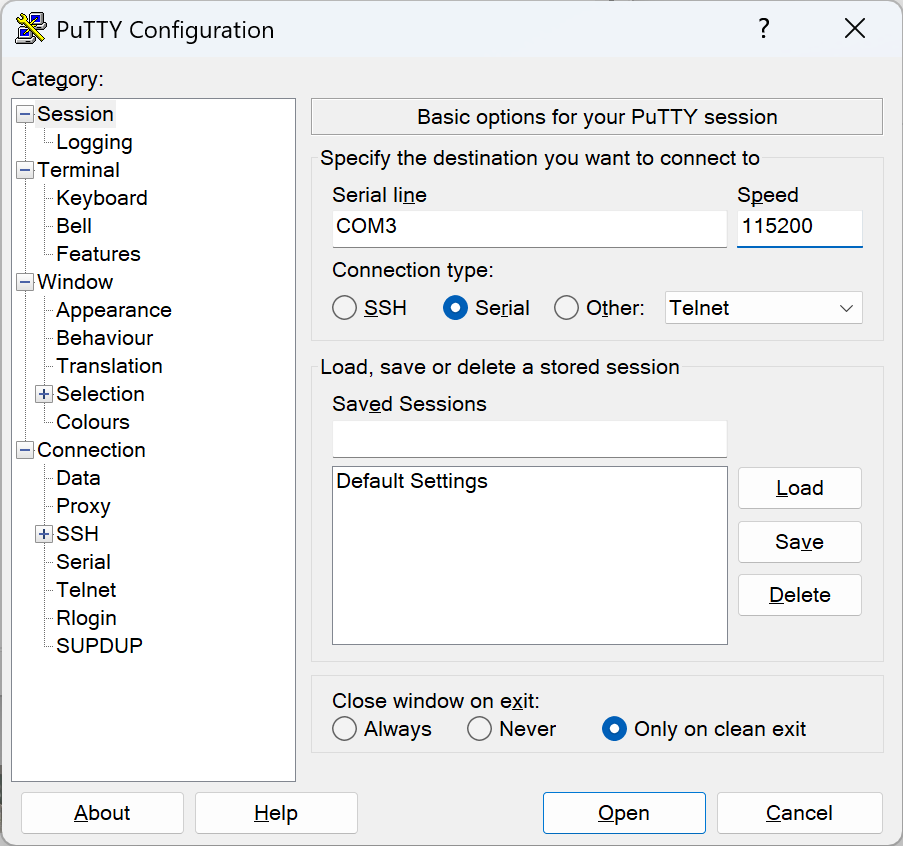，将Connection Type选择为```Serial```，然后在Serial Line处将端口号修改为设备管理器中查到的端口号，如作者此处端口号为```COM3```，此外，还需要将Speed从9600修改为115200，最后点击Open打开串口。
4. 等待出现```Ubuntu 22.04.3 LTS orangepiaipro ttyAM0```字样，输入登录的用户名HwHiAiUser并回车，然后输入密码Mind@123并回车，注意在输入密码的时候屏幕并不会显示任何东西，登陆后的界面如图所示。
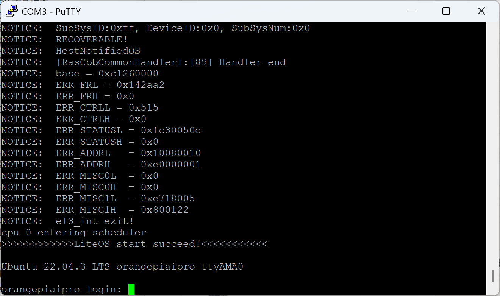
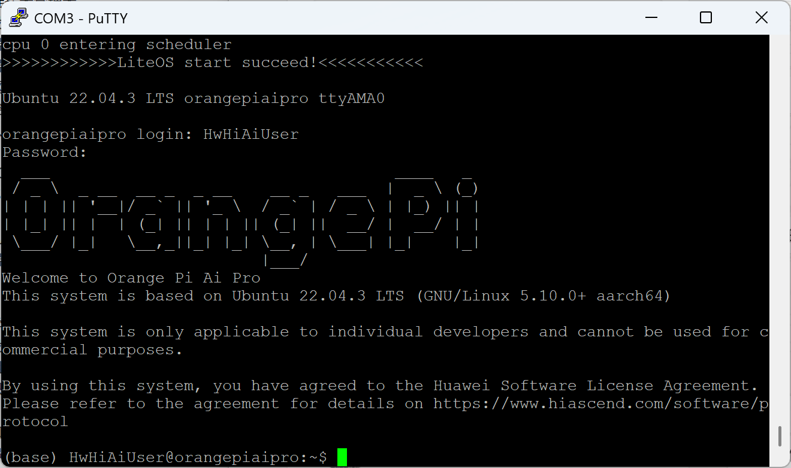

### Ubuntu Xfce桌面使用说明
目前系统仅支持Ubuntu 22.04 - Jammy系统，内核版本为Linux 5.10
#### 当前版本适配情况
请详见香橙派官方的用户手册，有部分功能仅支持使用官方程序进行测试，无法直接从系统中调用，在使用过程中需注意这些限制。

#### HDMI口使用
开发板有两个HDMI2.0 接口，目前只有HDMI0 支持显示Linux 系统的桌面，当Linux 系统的桌面系统关闭时，HDMI0 和HDMI1 还可以用于NVR 二次开
发场景输出图片。

#### 音频使用
Linux 内核没有适配耳机和HDMI 等的ALSA 音频驱动，此部分驱动还在开 发中，目前只能通过音频样例代码来测试耳机、HDMI 的音频播放和板载MIC 的录音功能。或者自行购买Linux系统免驱的USB外置声卡，经测试可以正常使用。

