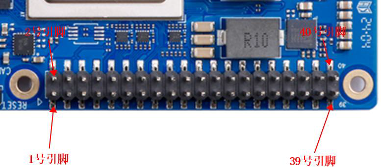
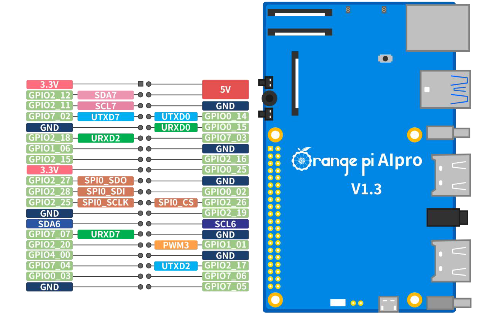

### GPIO口的引脚顺序
如图，单号引脚和双号引脚分别在一排。

注意事项： 、
1. 40 pin 接口中总共有26 个GPIO 口，但8 号和10 号引脚默认是用于调试串
   口功能的，并且这两个引脚和Micro USB 调试串口是连接在一起的，所以这两个
   引脚请不要设置为GPIO 等功能。
2. 所有的GPIO 口的电压都是3.3v。
3. 40 pin 接口中27 号和28 号引脚只有I2C 的功能，没有GPIO 等其他复用功
   能，另外这两个引脚的电压默认都为1.8v。