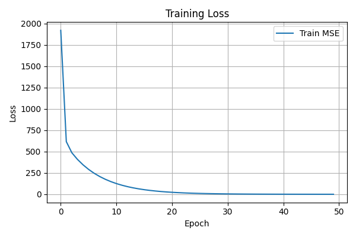
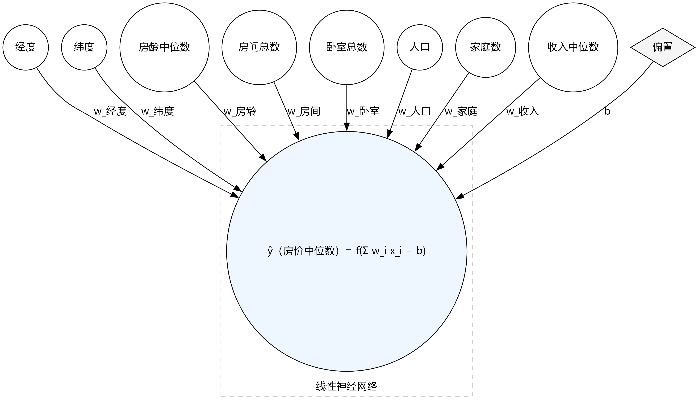
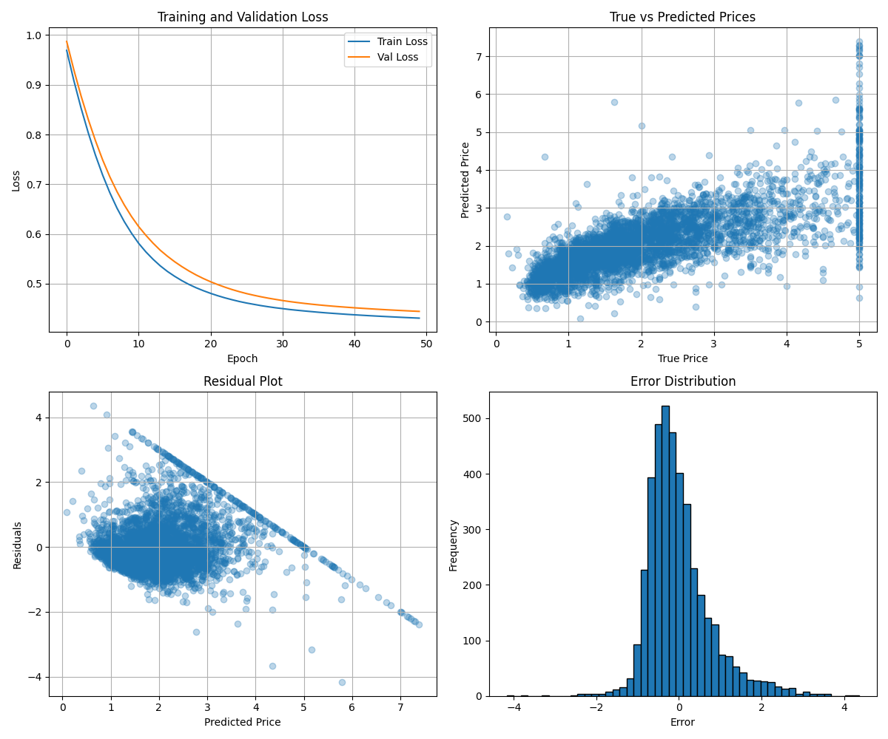
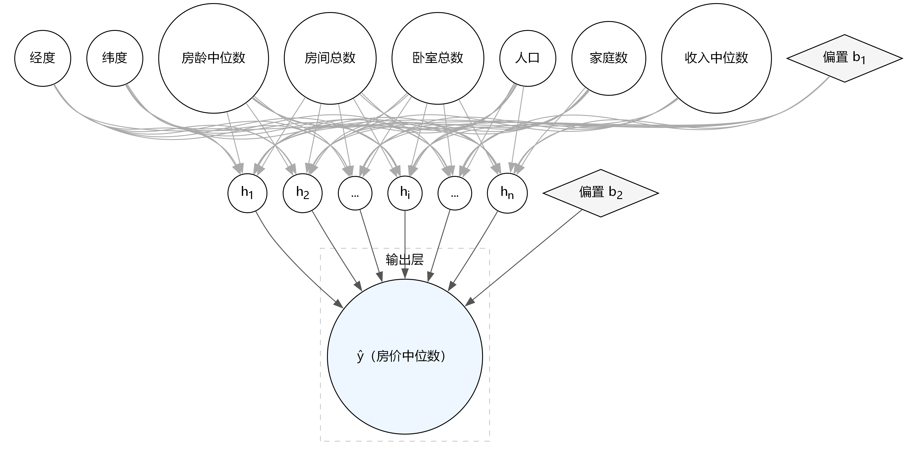
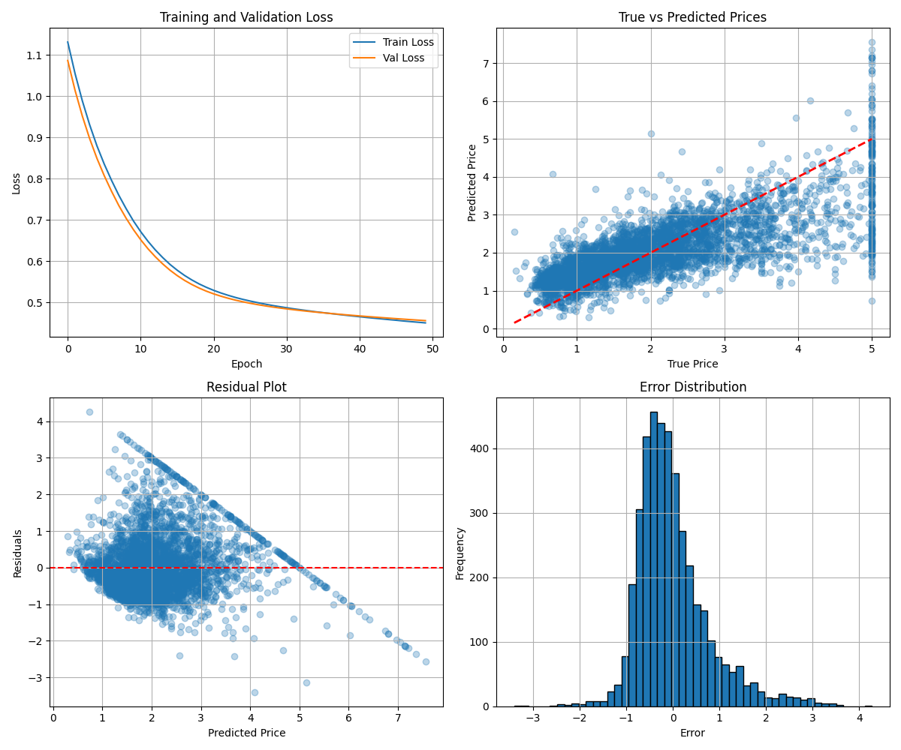
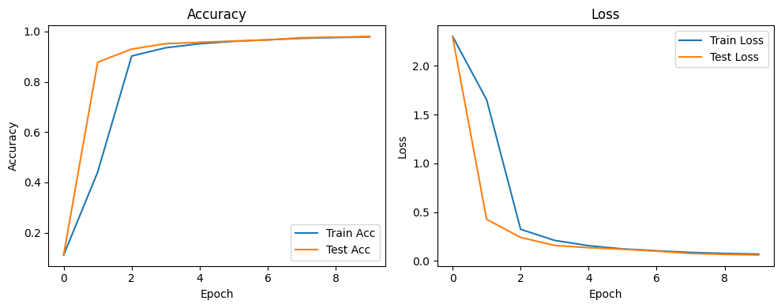

PyTorch 是以动态计算图著称的深度学习框架，核心由灵活的张量运算与自动微分系统构成。eager execution 让调试、可视化和原型迭代更直观，而 TorchScript 则提供图模式部署以兼顾性能与可移植性。配合丰富的 TorchVision、TorchAudio、TorchText 等生态包，开发者可以在视觉、语音、自然语言处理等任务上快速搭建端到端方案。

Ascend Extension for PyTorch 是华为昇腾为 PyTorch 用户提供的深度适配插件，使 PyTorch 能无缝调用昇腾 AI 处理器算力，沿用原生接口并针对算子、通信与调度做深度优化。项目源码可在官方仓库获取，更多动态可关注昇腾社区。

虽然当前已有 CANN、MindSpore 等优秀深度学习框架，但在 PyTorch 广泛应用的背景下，先基于 PyTorch 学习并借助昇腾插件迁移至昇腾 310B，既能降低学习门槛，又可减少适配成本、缩短开发周期。

由于 torch_npu 对昇腾 310B 的支持仍有限，适配与迁移存在诸多问题，因此这里只做 PyTorch 在 310B 上的基础示例与简要介绍。

## 架构速览

整体架构可概括为“PyTorch前端 + torch_npu中间层 + 昇腾算子后端”。图1展示了其分层设计：PyTorch前端将动态图、自动微分、优化器等能力暴露给开发者；`torch_npu` 负责对接CANN算子库、通信库以及运行时；底层由昇腾AI处理器提供硬件加速。理解这一层次关系有助于在故障排查时迅速定位问题。

## 核心能力纵览

插件在多个维度增强了PyTorch在昇腾平台的体验：

- **算子与生态适配**：基于开源PyTorch实现对昇腾AI处理器的深度定制，持续补齐主流算子与第三方库，保证常见模型脚本可直接迁移。
- **训练基础设施**：保持动态图、自动微分、优化器与Profiling等特性，与原生PyTorch保持一致，降低学习成本。
- **自定义算子扩展**：为算子开发者提供接口，可在PyTorch框架内快速集成自研算子。
- **分布式通信**：内置Broadcast、AllReduce等集合通信原语，覆盖单机多卡与多机多卡场景。
- **推理链路**：模型可导出ONNX，再借助离线转换工具生成适配昇腾的推理模型，便于训练—推理一体化交付。

## PyTorch安装教程

### CANN环境准备

在昇腾310B开发板上安装PyTorch之前，必须必须安装匹配CANN版本的驱动与固件。
如果没有安装CANN相关的工具包与驱动，请参考《CANN 软件安装指南》（商用/社区版）(https://www.hiascend.com/document/detail/zh/CANNCommunityEdition/83RC1/index/index.html)或者本教程的第二章(https://zhouxzh.github.io/Ascend310/book/chapter2.html)进行离线安装。
如果已安装 CANN 相关工具包与驱动，可按执行以下命令获取版本信息:
```bash
cat /usr/local/Ascend/ascend-toolkit/latest/aarch64-linux/ascend_toolkit_install.info
```
例如刚刚完成CANN 8.3.RC1版本的安装后，会输出以下信息：
```bash
package_name=Ascend-cann-toolkit
version=8.3.RC1
innerversion=V100R001C23SPC001B235
compatible_version=[V100R001C15],[V100R001C18],[V100R001C19],[V100R001C20],[V100R001C21],[V100R001C23]
arch=aarch64
os=linux
path=/usr/local/Ascend/ascend-toolkit/8.3.RC1/aarch64-linux
```
在安装 PyTorch 框架与 torch_npu 插件之前，请先确认 CANN 环境变量已正确加载。若尚未将加载命令写入 `~/.bashrc`，可在当前会话执行：
```bash
source /usr/local/Ascend/ascend-toolkit/set_env.sh
```
如需持久生效，请将上述命令追加到 ~/.bashrc 后执行 `source ~/.bashrc`。

### PyTorch二进制软件包安装方法

完成基础环境后，可以参考按照[Ascend Extension for PyTorch 软件安装指南](https://www.hiascend.com/document/detail/zh/Pytorch/720/configandinstg/instg/insg_0001.html)或者[昇腾的PyTorhc框架的Github仓库](https://github.com/Ascend/pytorch)部署PyTorch及 `torch_npu` 插件。
在昇腾310B开发板上安装PyTorch框架和torch_npu插件的方法有两种，一种是二进制软件包安装，另外一种是源码编译安装。对于初学者来说，推荐使用二进制软件包进行安装。
PyTorch框架和torch_npu插件二进制软件包安装的具体方法如下：

#### 安装PyTorch框架

由于出厂的 Ubuntu 22.04 系统已预装 miniconda，我们可以直接利用该环境。预装的 miniconda 通常带有 `bash`，在 `base` 下直接安装 PyTorch 与 torch_npu 容易产生冲突，因此建议新建一个 conda 环境，例如使用 `conda create -n npu` 创建名为 `npu` 的环境。若按照本教程第二章在昇腾 310B 开发板上安装了 CANN 8.3.RC1，则可用的 Python 版本为 3.8–3.11，对应支持的 PyTorch 版本为 2.1.0、2.6.0、2.7.1、2.8.0。这里选择安装 Python 3.11 与 PyTorch 2.8.0，先在新建的 `npu` 环境安装 Python 编译器：`conda install python=3.11`。下载 PyTorch 二进制包时需与当前 Python 版本一致，可用 `python -V` 确认版本，输出示例为 `Python 3.11.14`。该环境还需安装 CANN 依赖的第三方库，可执行：
```bash
pip3 install attrs cython 'numpy>=1.19.2,<=1.24.0' decorator \
 sympy cffi pyyaml pathlib2 psutil protobuf==3.20.0 scipy requests absl-py
```

在昇腾开发板上安装 PyTorch 可手动下载二进制包或直接用 pip 自动安装。若手动下载，需确保与 Python 和 CANN 版本严格匹配，可在[华为昇腾 PyTorch 官方安装指南](https://www.hiascend.com/document/detail/zh/Pytorch/720/configandinstg/instg/insg_0004.html)选择对应的包。假设 Python 3.11、CANN 8.3.RC1，可参考以下命令下载：
```bash
wget https://download.pytorch.org/whl/cpu/torch-2.8.0%2Bcpu-cp311-cp311-manylinux_2_28_aarch64.whl
```
然后使用 pip3 安装：
```bash
pip3 install torch-2.8.0+cpu-cp311-cp311-manylinux_2_28_aarch64.whl
```
更简便的方式是直接让 pip 自动匹配版本，例如：
```bash
pip install torch==2.8.0
```
推荐使用自动安装。安装完成后，可通过以下命令验证：
```bash
python -c "import torch; print(torch.__version__)"
```
若安装正确，输出示例为：
```bash
2.8.0+cpu
```

#### 安装昇腾torch_npu插件
安装 torch_npu 时，版本需要与 PyTorch、Python、系统架构以及 CANN 保持一致。可前往[华为昇腾 PyTorch 官方安装指南](https://www.hiascend.com/document/detail/zh/Pytorch/720/configandinstg/instg/insg_0004.html)选择匹配的二进制包。例如在 Python 3.11、PyTorch 2.8.0、CANN 8.3.RC1 场景下，选择 torch_npu 7.2.0，对应示例下载命令为：
```bash
wget https://gitcode.com/Ascend/pytorch/releases/download/v7.2.0-pytorch2.8.0/torch_npu-2.8.0-cp311-cp311-manylinux_2_28_aarch64.whl
```
下载后使用 pip3 安装：
```bash
pip3 install torch_npu-2.8.0-cp311-cp311-manylinux_2_28_aarch64.whl
```
若已知当前环境支持的最高 PyTorch 版本为 2.8.0，且已安装 PyTorch 2.8.0，可直接让 pip 自动匹配下载并安装：
```bash
pip install torch_npu
```

### torch_npu安装后测试
成功安装torch_npu后，需要对安装后的torch_npu进行简单的测试，以此验证是否安装成功。其中最简单的方法，是直接在命令窗口中输入以下命令：
```bash
python3 -c "import torch;import torch_npu; a = torch.randn(3, 4).npu(); print(a + a);"
```
成功运行后可见如下输出：
```bash
.[W compiler_depend.ts:164] Warning: Device do not support double dtype now, dtype cast replace with float. (function operator())
...tensor([[ 0.0879,  0.5805, -0.3437, -0.0229],
        [-1.7557,  0.0712,  2.7342,  1.8566],
        [-1.2092,  1.4896,  0.2234,  0.4621]], device='npu:0')
```
上述 warning 来源于昇腾 310B 暂不支持双精度浮点（double），运行时会自动将双精度浮点 double 转为单精度浮点 float。
若在 HwHiAiUser（非 root）用户下执行同一命令，输出与下述示例类似：
```bash
/usr/local/miniconda3/lib/python3.9/site-packages/torch_npu/utils/collect_env.py:59: UserWarning: Warning: The /usr/local/Ascend/ascend-toolkit/latest owner does not match the current owner.
  warnings.warn(f"Warning: The {path} owner does not match the current owner.")
/usr/local/miniconda3/lib/python3.9/site-packages/torch_npu/utils/collect_env.py:59: UserWarning: Warning: The /usr/local/Ascend/ascend-toolkit/8.3.RC1/aarch64-linux/ascend_toolkit_install.info owner does not match the current owner.
  warnings.warn(f"Warning: The {path} owner does not match the current owner.")
/usr/local/miniconda3/lib/python3.9/site-packages/torch_npu/utils/_path_manager.py:67: UserWarning: Permission mismatch: The owner of /usr/local/miniconda3/lib/python3.9/site-packages/torch_npu/lib/libop_plugin_atb.so does not match.
  warnings.warn(f"Permission mismatch: The owner of {path} does not match.")
/usr/local/miniconda3/lib/python3.9/site-packages/torch_npu/utils/collect_env.py:59: UserWarning: Warning: The /usr/local/Ascend/ascend-toolkit/latest owner does not match the current owner.
  warnings.warn(f"Warning: The {path} owner does not match the current owner.")
/usr/local/miniconda3/lib/python3.9/site-packages/torch_npu/utils/collect_env.py:59: UserWarning: Warning: The /usr/local/Ascend/ascend-toolkit/8.3.RC1/aarch64-linux/ascend_toolkit_install.info owner does not match the current owner.
  warnings.warn(f"Warning: The {path} owner does not match the current owner.")
[W compiler_depend.ts:164] Warning: Device do not support double dtype now, dtype cast replace with float. (function operator())
tensor([[ 0.4831,  0.6161,  0.2278, -0.1595],
        [ 1.3375,  0.2916, -0.3860, -2.3874],
        [ 1.3766, -1.6611,  2.7217,  2.0813]], device='npu:0')
```
尽管会出现较多 warning，这是因为torch_npu插件用root账户安装所致，但结果依然是正确的。

**注意事项**
多数情况下，已成功安装后仍在运行上文命令时报错，原因是内存不足，尤其常见于 8GB 内存的昇腾 310B 开发板。首次运行 PyTorch+torch_npu 时，会触发将计算图交给 CANN 进行编译与优化（含算子/图的并行编译），默认并行度较高，容易在低内存设备上触发 OOM。

处理办法：降低编译并行度
- 临时生效（仅针对本次运行）：
  ```bash
  TE_PARALLEL_COMPILER=1 MAX_COMPILE_CORE_NUMBER=1 python your_script.py
  ```
- 会话/永久生效：
  ```bash
  export TE_PARALLEL_COMPILER=1
  export MAX_COMPILE_CORE_NUMBER=1
  # 建议追加到 ~/.bashrc 后执行：source ~/.bashrc
  ```

说明
- 该问题与使用 atc 工具时的并行编译内存占用现象一致，降低并行度可显著缓解。
- 首次运行的编译开销较大，通过以上设置可提高在 8GB 设备上的稳定性。


## torch_npu插件的使用

PyTorch 是广泛使用的深度学习框架，基于 Python，入门友好且生态完善。系统学习可参考李沐的《动手学深度学习》第二版（开源电子书，含配套代码）：[动手学深度学习](https://zh-v2.d2l.ai/index.html)。

关于 torch_npu：目前在昇腾 310B 上自动迁移工具不可用（实测无法跑通），因此本章默认不使用自动迁移，统一采用手工迁移路径，并提供常见替换与调优对策。迁移与调优可参考官方文档《[PyTorch训练模型迁移调优](https://www.hiascend.com/document/detail/zh/Pytorch/720/ptmoddevg/trainingmigrguide/PT_LMTMOG_0002.html)》。但是该文档主要面向训练服务器，细节与 310B 存在差异。

下文将结合若干实例，演示 torch_npu 在昇腾 310B 上的实践要点。

### 线性神经网络实现

为了更清晰地展示基于 CUDA 的 PyTorch 使用与基于 `torch_npu` 的使用之间的区别，我们将从经典的线性神经网络入手。线性回归和 softmax 回归作为经典统计学习技术，可以视为线性神经网络的实例。这些知识将为在昇腾 310B 上进行代码移植的其他部分奠定基础。

#### 一元线性回归
线性回归可用于刻画变量间的线性关系。在最简单的一元情形中，大学物理实验的电阻测量就是典型案例。根据欧姆定律可得：
$$V = I\,R$$
为适应实际中的接触电势/表计零漂，常用含偏置模型：
$$V_i \approx R\,I_i + b$$

以均方误差为目标函数：
$$
L(R,b)=\frac{1}{n}\sum_{i=1}^{n}\big(R\,I_i+b-V_i\big)^2
$$
其梯度为：
$$
\frac{\partial L}{\partial R}=\frac{2}{n}\sum_{i=1}^{n}I_i\big(R\,I_i+b-V_i\big),\quad
\frac{\partial L}{\partial b}=\frac{2}{n}\sum_{i=1}^{n}\big(R\,I_i+b-V_i\big)
$$

采用小批量 SGD（批大小为 m，索引集合 B）：
$$
g_R=\frac{2}{m}\sum_{i\in B}I_i\big(R\,I_i+b-V_i\big),\quad
g_b=\frac{2}{m}\sum_{i\in B}\big(R\,I_i+b-V_i\big)
$$
按学习率更新：
$$
R\leftarrow R-\eta\,g_R,\quad b\leftarrow b-\eta\,g_b
$$

实践流程（单位统一为 A、V，建议 float32，NPU 上双精度会自动降为 float32）：
- 采集多组 ($I_i$, $V_i$)，若存在接触电势选用含偏置模型。
- 初始化参数（启发式：$R≈(\sum I_i V_i)/(\sum I_i^2)，b≈0$）。
- 随机抽取小批量，计算 $g_R$、$g_b$，按学习率迭代至收敛。
- 用 MSE 或 R² 评估拟合，必要时剔除离群点。

下方示例代码在 PyTorch+torch_npu 上实现上述流程。
```python linear_regression_npu.py
"""线性回归（V ≈ R·I + b）示例，使用华为昇腾 NPU 设备训练。
- 数据：合成电压/电流数据，单位 A/V，含高斯噪声（约 5mV）。
- 目标：拟合电阻 R（斜率）与偏置 b（截距）。
- 设备：默认 npu:0，可切换为 CPU。
- 训练：SGD 优化，MSE 损失，小批量训练并通过 tqdm 展示进度。
- 输出：打印估计的 R、b，并保存训练损失曲线为 training_loss.png。
"""

import torch  # PyTorch 主库
from tqdm import tqdm  # 进度条显示
import matplotlib.pyplot as plt  # 绘图
import torch_npu  # NPU 支持库（确保已安装与环境就绪）

device = torch.device('npu:0')  # 选择 NPU 设备（Ascend），需要正确的驱动/环境
torch.manual_seed(0)  # 固定随机种子以确保可复现

# 使用合成数据（无自有数据）
N = 1024  # 样本数
R_true, b_true = 120.0, 0.02  # 真实电阻（Ω）与偏置（V），用于生成数据的“地真值”
I = torch.linspace(0.0, 1.0, N).unsqueeze(1)  # 电流张量 [N,1]，范围 0~1 A
noise_std = 0.005  # 噪声标准差 ≈ 5 mV
noise = noise_std * torch.randn(N, 1)  # 加性高斯噪声，与 V 同形状
V = R_true * I + b_true + noise  # 生成电压张量 [N,1]，单位 V

I = I.to(device)  # 将数据移至计算设备（NPU/CPU）
V = V.to(device)
batch_size = 16  # 小批量大小，影响梯度估计方差与训练稳定性

# 线性模型 V ≈ R·I + b（1 输入 -> 1 输出，带偏置）
model = torch.nn.Linear(1, 1, bias=True).to(device)  # 权重即电阻 R，偏置即 b
opt = torch.optim.SGD(model.parameters(), lr=1e-2)  # 随机梯度下降，学习率 1e-2
loss_fn = torch.nn.MSELoss()  # 均方误差：衡量预测电压与真实电压的差异

# 使用小批量训练循环，加入 tqdm 进度条并记录 loss
num_epochs = 50  # 训练轮数
epoch_losses = []  # 记录每个 epoch 的平均损失，便于绘图

with tqdm(range(num_epochs), desc="Epochs") as pbar:  # 进度条显示每个 epoch
    for _ in pbar:
        epoch_loss = 0.0  # 累计当前 epoch 的损失
        n_batches = 0  # 实际批次数（用于计算平均损失）
        perm = torch.randperm(I.shape[0], device=device)  # 打乱索引以实现随机小批量
        for start in range(0, I.shape[0], batch_size):  # 遍历每个批次起点
            end = start + batch_size  # 批次终点
            idx = perm[start:end]  # 当前批次的随机样本索引
            I_b = I[idx].to(torch.float32)  # NPU 通常以 float32 计算，确保类型一致
            V_b = V[idx].to(torch.float32)
            pred = model(I_b)  # 前向计算：V̂ = R·I + b
            loss = loss_fn(pred, V_b)  # 计算当前批次的 MSE 损失
            opt.zero_grad()  # 清空上一轮梯度
            loss.backward()  # 反向传播，计算参数梯度
            opt.step()  # 参数更新（SGD）
            epoch_loss += loss.item()  # 累加标量损失
            n_batches += 1  # 批次数 +1
        avg_loss = epoch_loss / max(n_batches, 1)  # 当前 epoch 的平均损失
        epoch_losses.append(avg_loss)  # 记录以便后续绘图
        pbar.set_postfix(loss=f"{avg_loss:.6f}")  # 在进度条尾部显示当前损失

R = model.weight.detach().item()  # 提取斜率（电阻，单位 Ω），不跟踪梯度
b = model.bias.detach().item()    # 提取截距（偏置，单位 V），不跟踪梯度
print("device =", device)  # 打印使用的设备
print("R(Ω) =", R, " b(V) =", b)  # 打印拟合结果，便于与真值对比

# 绘制训练损失下降曲线并保存图片
plt.figure(figsize=(6, 4))  # 设定图像尺寸
plt.plot(epoch_losses, label="Train MSE")  # 绘制每个 epoch 的平均损失
plt.xlabel("Epoch")  # 横轴：训练轮数
plt.ylabel("Loss")  # 纵轴：均方误差
plt.title("Training Loss")  # 标题
plt.grid(True)  # 开启网格，便于阅读
plt.legend()  # 图例显示
plt.tight_layout()  # 自动布局，防止标签遮挡
plt.savefig("linear_regression_training_loss.png")  # 保存为 PNG 文件
```
要运行上述示例，请先在当前（npu）环境中安装依赖：
```bash
pip install tqdm matplotlib
```

示例运行后可见如下输出：
```bash
Epochs: 100%|█████████████████████████████████████████████████████████| 50/50 [00:28<00:00,  1.77it/s, loss=0.173204]
device = npu:0
R(Ω) = 118.63302612304688  b(V) = 0.7558640241622925
```
同时给出训练结果的可视化：下图展示训练损失（MSE）随 epoch 变化的曲线。



提示
- 数据需统一单位（A、V），使用 float32 更稳妥。
- 无明显偏置时可将偏置项置为 0；存在测量/接触偏差时保留偏置并做鲁棒处理（如剔除离群点）。
- 拟合优劣可用 MSE 或 R² 评估，必要时清理异常样本。 
- 在部分环境中，PyTorch 2.1 运行上述代码可能报错，通常与 nn.Linear 的输出维度设为 1 的配置触发兼容性问题有关；建议升级至更高版本或将输出维度调整为大于 1 以规避。
- 将代码中的 `device = torch.device('npu:0')` 改为 `device = torch.device('cpu')`，即可在纯 CPU 上运行。该示例在 CPU 与 NPU 上耗时接近，主要因为未涉及大规模矩阵/张量计算，计算密度较低，NPU 的并行优势难以发挥。

#### 多元线性回归

为了验证昇腾 310B 上 torch_npu 与 PyTorch 的兼容性，下面以加州房价数据集的多元线性回归示例继续演示 torch_npu 的使用。加州房价数据（California Housing Dataset）可通过 `fetch_california_housing()` 在 `scikit-learn` 获取，或在 [Kaggle](https://www.kaggle.com/datasets/azhadarshad/california-housing-dataset) 等平台下载 CSV。该数据集包含经纬度（longitude/latitude）、房屋中位年龄（housing_median_age）、总房间数与卧室数（total_rooms/total_bedrooms）、人口与家庭数（population/households）、收入中位数（median_income）、房价中位数（median_house_value）以及与海距离类别（ocean_proximity）等字段，可用于房价预测（如线性回归、随机森林、XGBoost 等回归模型）、结合经纬度进行地理可视化绘制房价热力图以分析区域差异，并通过“每户平均房间数”等衍生特征进行特征工程以提升效果。需注意，该数据为历史数据，不能直接反映当前价格；使用时应遵守隐私与数据保护规定，尤其在与其他数据源结合时；该数据集结构清晰、特征丰富，是机器学习回归入门的经典案例。
对于线性神经网络（多元线性回归），可表示为： 
$$
\hat{\mathbf{y}} = \mathbf{X} \mathbf{w} + \mathbf{b}, \quad \mathbf{X} \in \mathbb{R}^{m\times d},\; \mathbf{w} \in \mathbb{R}^{d\times k},\; \mathbf{b} \in \mathbb{R}^{k}
$$
其中 $m$ 为样本数，$d$ 为特征维度，$k$ 为输出维度（回归时常取 $k=1$）；对于单样本 $\mathbf{x}\in\mathbb{R}^d$，有 $\hat{\mathbf{y}}=\mathbf{x}^\top W+b$。
加州房价数据集的输入特征维度为 8，输出为房价估计值，其线性神经网络结构示意如下：



损失函数通常选用均方误差（MSE）：  
$$
\mathcal{L}(\mathbf{w},b) = \frac{1}{m}\sum_{i=1}^m \big\|\hat{\mathbf{y}}^{(i)} - \mathbf{y}^{(i)}\big\|_2^2
$$
在训练模型的时候，我们希望寻找出一组参数$(\mathbf{w}^*, b^*$)，使得训练样品的损失函数最小：
$$
\mathbf{w}^*, b^* = \argmin_{\mathbf{w},b} \mathcal{L}(\mathbf{w},b)
$$
在实际训练中，通常采用小批量随机梯度下降法来求解最优参数。其算法流程如下：

1.  **初始化**：随机初始化模型参数 $\mathbf{w}$ 和 $b$，并设定学习率 $\eta$。
2.  **小批量采样**：从训练数据中随机抽取包含 $m$ 个样本的小批量 $\mathcal{B} = \{(\mathbf{x}^{(1)}, y^{(1)}), \dots, (\mathbf{x}^{(m)}, y^{(m)})\}$。
3.  **计算梯度**：计算损失函数关于参数的梯度估计值：
  $$
  \mathbf{g}_{\mathbf{w}} = \frac{\partial \mathcal{L}}{\partial \mathbf{w}} = \frac{2}{m} \sum_{i \in \mathcal{B}} \mathbf{x}^{(i)} (\mathbf{x}^{(i)\top} \mathbf{w} + b - y^{(i)})
  $$
  $$
  g_b = \frac{\partial \mathcal{L}}{\partial b} = \frac{2}{m} \sum_{i \in \mathcal{B}} (\mathbf{x}^{(i)\top} \mathbf{w} + b - y^{(i)})
  $$
4.  **更新参数**：利用计算出的梯度更新当前参数：
  $$
  \mathbf{w} \leftarrow \mathbf{w} - \eta \cdot \mathbf{g}_{\mathbf{w}}
  $$
  $$
  b \leftarrow b - \eta \cdot g_b
  $$
5.  **迭代**：重复步骤 2-4，直到满足停止准则（如达到最大迭代次数或损失函数收敛）。

在上述算法中，学习率（Learning Rate, $\eta$）与训练轮数（Epoch）是影响模型性能的关键超参数。学习率决定了参数沿梯度反方向更新的步长：若设置过大，模型可能在最优解附近震荡甚至发散；若设置过小，则收敛速度过慢且易陷入局部最优。通常学习率的取值范围在 $0.01$ 到 $0.00001$ 之间。训练轮数是指完整遍历一次训练数据集的过程。由于单次迭代仅利用小批量数据更新梯度，通常需要多个 Epoch 才能使模型参数充分拟合数据特征并趋于稳定。一般建议将 Epoch 设置在 $10$ 到 $100$ 之间。

利用torch_npu插件，可以在昇腾 310B 上进行这个模型的训练，合理配置这些超参数不仅影响模型的最终精度，还直接关系到有限算力资源下的训练效率。详细的代码如下：

```python california_housing_liear_netword.py
import torch
import torch.nn as nn
import torch.optim as optim
from sklearn.datasets import fetch_california_housing
from sklearn.preprocessing import StandardScaler
from sklearn.model_selection import train_test_split
from torch.utils.data import DataLoader, TensorDataset
import numpy as np
from tqdm.auto import tqdm, trange

# ==========================================
# 1. 环境配置与随机种子设置
# ==========================================
# 设置随机种子以确保实验结果的可复现性
np.random.seed(42)
torch.manual_seed(42)

# 指定计算设备。'npu' 表示使用华为昇腾 AI 处理器
# 如果在没有 NPU 的环境下运行，可改为 'cuda' 或 'cpu'
device = torch.device('npu')

# ==========================================
# 2. 数据加载与预处理
# ==========================================
# 加载加州房价数据集（回归任务）
california = fetch_california_housing()
X = california.data  # 特征矩阵：包含 8 个特征（如人均收入、房龄等）
y = california.target.reshape(-1, 1)  # 目标值：房价，调整为 (N, 1) 形状

# 数据标准化：神经网络对输入特征的量级很敏感
# 使用 StandardScaler 使数据符合均值为 0，方差为 1 的分布
scaler_X = StandardScaler()
scaler_y = StandardScaler()
X_scaled = scaler_X.fit_transform(X)
y_scaled = scaler_y.fit_transform(y)

# 划分数据集：80% 用于训练，20% 用于验证
X_train, X_val, y_train, y_val = train_test_split(
    X_scaled, y_scaled, test_size=0.2, random_state=42
)

# ==========================================
# 3. 构建 PyTorch 数据加载器 (DataLoader)
# ==========================================
batch_size = 32

# 将 NumPy 数组转换为 PyTorch 张量 (FloatTensor)
train_dataset = TensorDataset(
    torch.FloatTensor(X_train), 
    torch.FloatTensor(y_train)
)
val_dataset = TensorDataset(
    torch.FloatTensor(X_val), 
    torch.FloatTensor(y_val)
)

# DataLoader 负责按批次 (Batch) 提供数据，并在训练集上开启打乱 (Shuffle)
train_loader = DataLoader(train_dataset, batch_size=batch_size, shuffle=True)
val_loader = DataLoader(val_dataset, batch_size=batch_size)

# ==========================================
# 4. 定义模型结构
# ==========================================
# 单层感知机：本质上是一个线性回归模型 (y = Wx + b)
class SingleLayerPerceptron(nn.Module):
    def __init__(self, input_dim):
        super().__init__()
        # 定义一个全连接层，输入维度为特征数，输出维度为 1
        self.fc = nn.Linear(input_dim, 1)
        
    def forward(self, x):
        # 前向传播逻辑
        return self.fc(x)

# 实例化模型并迁移到指定的计算设备 (NPU)
model = SingleLayerPerceptron(X_train.shape[1]).to(device)

# 定义损失函数：均方误差 (MSE)，适用于回归任务
criterion = nn.MSELoss()

# 定义优化器：随机梯度下降 (SGD)，学习率设为 0.01
optimizer = optim.SGD(model.parameters(), lr=0.01)

# ==========================================
# 5. 训练与验证函数定义
# ==========================================
def train_epoch(model, loader, criterion, optimizer):
    """单轮训练逻辑"""
    model.train() # 设置为训练模式
    total_loss = 0
    for batch_x, batch_y in tqdm(loader, desc="Train", leave=False):
        # 将数据迁移到 NPU
        batch_x = batch_x.to(device)
        batch_y = batch_y.to(device)
        
        # 梯度清零
        optimizer.zero_grad()
        # 前向传播
        outputs = model(batch_x)
        # 计算损失
        loss = criterion(outputs, batch_y)
        # 反向传播
        loss.backward()
        # 梯度裁剪：防止梯度爆炸
        torch.nn.utils.clip_grad_norm_(model.parameters(), max_norm=1.0)
        # 更新参数
        optimizer.step()
        
        total_loss += loss.item() * batch_x.size(0)
    return total_loss / len(loader.dataset)

def validate(model, loader, criterion):
    """验证逻辑"""
    model.eval() # 设置为评估模式
    total_loss = 0
    with torch.no_grad(): # 验证阶段不需要计算梯度
        for batch_x, batch_y in tqdm(loader, desc="Val", leave=False):
            batch_x = batch_x.to(device)
            batch_y = batch_y.to(device)
            outputs = model(batch_x)
            loss = criterion(outputs, batch_y)
            total_loss += loss.item() * batch_x.size(0)
    return total_loss / len(loader.dataset)

# ==========================================
# 6. 执行训练循环
# ==========================================
epochs = 20
train_losses = []
val_losses = []

# 使用 trange 展示总进度条
t = trange(epochs, desc="Epochs")
for epoch in t:
    train_loss = train_epoch(model, train_loader, criterion, optimizer)
    val_loss = validate(model, val_loader, criterion)
    
    train_losses.append(train_loss)
    val_losses.append(val_loss)
    
    # 在进度条右侧实时显示当前损失和学习率
    t.set_postfix(train_loss=f"{train_loss:.4f}", val_loss=f"{val_loss:.4f}", lr=f'{optimizer.param_groups[0]["lr"]:.6f}')

print(f"\nFinal Validation Loss: {val_losses[-1]:.4f}")

# ==========================================
# 7. 模型评估与指标计算
# ==========================================
model.eval()
all_predictions = []
all_targets = []

# 获取验证集上的所有预测结果
with torch.no_grad():
    for batch_x, batch_y in val_loader:
        batch_x = batch_x.to(device)
        predictions = model(batch_x)
        # 将结果移回 CPU 并转为 NumPy
        all_predictions.extend(predictions.cpu().numpy())
        all_targets.extend(batch_y.cpu().numpy())

# 逆标准化：将预测值和真实值还原回原始的房价单位（10万美元）
all_predictions = scaler_y.inverse_transform(np.array(all_predictions))
all_targets = scaler_y.inverse_transform(np.array(all_targets))

# 计算回归常用指标
from sklearn.metrics import r2_score, mean_absolute_error, mean_squared_error

r2 = r2_score(all_targets, all_predictions) # 决定系数，越接近 1 越好
mae = mean_absolute_error(all_targets, all_predictions) # 平均绝对误差
rmse = np.sqrt(mean_squared_error(all_targets, all_predictions)) # 均方根误差

print(f"\n最终评估指标:")
print(f"R² Score: {r2:.4f}")
print(f"MAE: ${mae:.2f}")
print(f"RMSE: ${rmse:.2f}")

# ==========================================
# 8. 结果可视化
# ==========================================
import matplotlib.pyplot as plt

fig, axes = plt.subplots(2, 2, figsize=(12, 10))

# 1. 损失曲线：观察模型是否收敛
axes[0, 0].plot(train_losses, label='Train Loss')
axes[0, 0].plot(val_losses, label='Val Loss')
axes[0, 0].set_xlabel('Epoch')
axes[0, 0].set_ylabel('Loss')
axes[0, 0].set_title('Training and Validation Loss')
axes[0, 0].legend()
axes[0, 0].grid(True)

# 2. 预测值 vs 真实值：散点越接近对角线表示预测越准
axes[0, 1].scatter(all_targets, all_predictions, alpha=0.3)
axes[0, 1].set_xlabel('True Price')
axes[0, 1].set_ylabel('Predicted Price')
axes[0, 1].set_title('True vs Predicted Prices')
axes[0, 1].grid(True)

# 3. 残差图：检查误差是否随机分布（理想状态下应无明显模式）
residuals = all_targets - all_predictions
axes[1, 0].scatter(all_predictions, residuals, alpha=0.3)
axes[1, 0].set_xlabel('Predicted Price')
axes[1, 0].set_ylabel('Residuals')
axes[1, 0].set_title('Residual Plot')
axes[1, 0].grid(True)

# 4. 误差分布直方图：检查误差是否符合正态分布
axes[1, 1].hist(residuals, bins=50, edgecolor='black')
axes[1, 1].set_xlabel('Error')
axes[1, 1].set_ylabel('Frequency')
axes[1, 1].set_title('Error Distribution')

plt.tight_layout()
plt.savefig('california_housing_linear_network_results.png')
```
在配置好torch_npu环境的昇腾310B开发板上运行以上的代码，可以得到以下的结果：
```bash
Epochs: 100%|██████| 50/50 [02:14<00:00,  2.68s/it, lr=0.000100, train_loss=0.4308, val_loss=0.4444]
                                                                                                    
Final Validation Loss: 0.4444

最终评估指标:
R² Score: 0.5484
MAE: $0.56
RMSE: $0.77
```
同时，我们可以得到训练过程的损失收敛及评估指标图如下图所示：



### 多层感知机实现

我们之所以需要多层感知机（Multilayer Perceptron, MPL），是因为线性神经网络的输出仅为输入的加权和，难以刻画现实世界中复杂的非线性关系。以房价预测为例，房屋面积对价格的影响往往存在边际效应，而非简单的线性增长。为了突破这一局限，我们需要构建更深的网络结构。

如果我们仅仅通过堆叠多个线性层来构建网络，其数学表达为 
$$\hat{\mathbf{y}} = \mathbf{W}_2 (\mathbf{W}_1 \mathbf{x} + \mathbf{b}_1) + \mathbf{b}_2$$
展开后可见 
$$\hat{\mathbf{y}} = (\mathbf{W}_2 \mathbf{W}_1) \mathbf{x} + (\mathbf{W}_2 \mathbf{b}_1 + \mathbf{b}_2) = \mathbf{W}_{new} \mathbf{x} + \mathbf{b}_{new}$$
这意味着多个线性层的组合在数学上仍然等价于单个线性层。无论网络深度如何增加，若缺乏非线性因素，它都无法拟合复杂的非线性函数。

多层感知机通过在层间引入激活函数打破了这种线性限制。以常用的 ReLU 为例，其定义为 
$$\text{ReLU}(x) = \max(0, x)$$
另一个经典的激活函数是 Sigmoid 函数，它将任意实数映射到 $(0, 1)$ 区间，曾广泛应用于早期神经网络。其定义为 
$$\text{sigmoid}(x) = \frac{1}{1 + e^{-x}}$$

这种非线性变换允许网络通过组合不同的线性分段来逼近任意复杂的连续函数。一个含隐藏层的多层感知机可以表示为 
$$\mathbf{H} = \sigma(\mathbf{X} \mathbf{W}_1 + \mathbf{b}_1)$$ 
与
$$\mathbf{O} = \mathbf{H} \mathbf{W}_2 + \mathbf{b}_2$$
其中 $\sigma$ 即为非线性激活函数。


相比于只能处理线性相关问题的线性网络，多层感知机通过增加隐藏层的深度与宽度，能够捕捉特征之间的高阶交互作用。在加州房价数据集中，这种结构可以学习到经纬度与收入水平之间复杂的空间关联。对于加州房价数据集的多层感知机的模型如下图所示：



在昇腾 310B 上实现多层感知机，不仅能验证 `torch_npu` 对多层算子序列的调度能力，也能通过实验直观观察到非线性映射带来的精度提升。具体的代码如下：
```python california_housing_mlp.py
import torch
import torch.nn as nn
import torch.optim as optim
from sklearn.datasets import fetch_california_housing
from sklearn.preprocessing import StandardScaler
from sklearn.model_selection import train_test_split
from torch.utils.data import DataLoader, TensorDataset
import numpy as np
from tqdm.auto import tqdm, trange
import random

# 设置随机种子以确保实验结果的可重现性
SEED = 42
random.seed(SEED)
np.random.seed(SEED)
torch.manual_seed(SEED)
# 指定使用昇腾 NPU 设备
device = torch.device('npu:0')

# 加载加州房价数据集：包含8个特征，目标值为房屋中位数价格
california = fetch_california_housing()
X = california.data  # 特征矩阵 (样本数, 8)
y = california.target.reshape(-1, 1) # 目标值 (样本数, 1)

# 数据标准化：将特征和目标值缩放到均值为0、方差为1的分布，有助于模型收敛
scaler_X = StandardScaler()
scaler_y = StandardScaler()
X_scaled = scaler_X.fit_transform(X)
y_scaled = scaler_y.fit_transform(y)

# 划分数据集：80% 用于训练，20% 用于验证
X_train, X_val, y_train, y_val = train_test_split(
    X_scaled, y_scaled, test_size=0.2, random_state=42
)

# 构建 PyTorch 数据管道
batch_size = 32
train_dataset = TensorDataset(
    torch.FloatTensor(X_train), 
    torch.FloatTensor(y_train)
)
val_dataset = TensorDataset(
    torch.FloatTensor(X_val), 
    torch.FloatTensor(y_val)
)

# DataLoader 负责按批次(Batch)提供数据并支持洗牌(Shuffle)
train_loader = DataLoader(train_dataset, batch_size=batch_size, shuffle=True)
val_loader = DataLoader(val_dataset, batch_size=batch_size)

# 定义双层感知机模型
class DoubleLayerPerceptron(nn.Module):
    def __init__(self, input_dim, hidden_dim=64):
        super().__init__()
        self.net = nn.Sequential(
            nn.Linear(input_dim, hidden_dim), # 输入层到隐藏层
            nn.ReLU(),                        # 激活函数，引入非线性
            nn.Linear(hidden_dim, 1)          # 隐藏层到输出层（回归任务输出维度为1）
        )
    def forward(self, x):
        return self.net(x)

# 实例化模型并迁移至 NPU
model = DoubleLayerPerceptron(X_train.shape[1]).to(device)
# 回归任务常用的均方误差损失函数
criterion = nn.MSELoss()
# 随机梯度下降优化器
optimizer = optim.SGD(model.parameters(), lr=0.0001)

# 单个 Epoch 的训练逻辑
def train_epoch(model, loader, criterion, optimizer):
    model.train()
    total_loss = 0
    for batch_x, batch_y in tqdm(loader, desc="Train", leave=False):
        # 将数据搬运到 NPU 显存
        batch_x = batch_x.to(device)
        batch_y = batch_y.to(device)
        
        optimizer.zero_grad()           # 清空梯度
        outputs = model(batch_x)        # 前向传播
        loss = criterion(outputs, batch_y) # 计算损失
        loss.backward()                 # 反向传播计算梯度
        torch.nn.utils.clip_grad_norm_(model.parameters(), max_norm=1.0) # 梯度裁剪防止梯度爆炸
        optimizer.step()                # 更新权重
        total_loss += loss.item() * batch_x.size(0)
    return total_loss / len(loader.dataset)

# 验证逻辑
def validate(model, loader, criterion):
    model.eval() # 设置为评估模式
    total_loss = 0
    with torch.no_grad(): # 验证阶段不需要计算梯度
        for batch_x, batch_y in tqdm(loader, desc="Val", leave=False):
            batch_x = batch_x.to(device)
            batch_y = batch_y.to(device)
            outputs = model(batch_x)
            loss = criterion(outputs, batch_y)
            total_loss += loss.item() * batch_x.size(0)
    return total_loss / len(loader.dataset)

# 执行训练过程
epochs = 50
train_losses = []
val_losses = []

t = trange(epochs, desc="Epochs")
for epoch in t:
    train_loss = train_epoch(model, train_loader, criterion, optimizer)
    val_loss = validate(model, val_loader, criterion)
    train_losses.append(train_loss)
    val_losses.append(val_loss)
    # 在进度条右侧实时显示当前损失和学习率
    t.set_postfix(train_loss=f"{train_loss:.4f}", val_loss=f"{val_loss:.4f}", lr=f'{optimizer.param_groups[0]["lr"]:.6f}')

print(f"\nValidation Loss: {val_losses[-1]:.4f}")

# 评估阶段：获取验证集的预测值并还原标准化
model.eval()
all_predictions = []
all_targets = []

with torch.no_grad():
    for batch_x, batch_y in val_loader:
        batch_x = batch_x.to(device)
        predictions = model(batch_x)
        all_predictions.extend(predictions.cpu().numpy())
        all_targets.extend(batch_y.cpu().numpy())

# 将标准化后的数据逆转回原始价格单位
all_predictions = scaler_y.inverse_transform(np.array(all_predictions))
all_targets = scaler_y.inverse_transform(np.array(all_targets))

# 计算回归评估指标
from sklearn.metrics import r2_score, mean_absolute_error, mean_squared_error

r2 = r2_score(all_targets, all_predictions) # 决定系数，越接近 1 越好
mae = mean_absolute_error(all_targets, all_predictions) # 平均绝对误差
rmse = np.sqrt(mean_squared_error(all_targets, all_predictions)) # 均方根误差

print(f"\n最终评估指标:")
print(f"R² Score: {r2:.4f}")
print(f"MAE: ${mae:.2f}")
print(f"RMSE: ${rmse:.2f}")

# 结果可视化
import matplotlib.pyplot as plt

fig, axes = plt.subplots(2, 2, figsize=(12, 10))

# 1. 损失下降曲线：观察模型是否收敛或过拟合
axes[0, 0].plot(train_losses, label='Train Loss')
axes[0, 0].plot(val_losses, label='Val Loss')
axes[0, 0].set_xlabel('Epoch')
axes[0, 0].set_ylabel('Loss')
axes[0, 0].set_title('Training and Validation Loss')
axes[0, 0].legend()
axes[0, 0].grid(True)

# 2. 预测值 vs 真实值散点图：点越靠近红虚线表示预测越准
axes[0, 1].scatter(all_targets, all_predictions, alpha=0.3)
axes[0, 1].plot([all_targets.min(), all_targets.max()], 
                [all_targets.min(), all_targets.max()], 'r--', lw=2)
axes[0, 1].set_xlabel('True Price')
axes[0, 1].set_ylabel('Predicted Price')
axes[0, 1].set_title('True vs Predicted Prices')
axes[0, 1].grid(True)

# 3. 残差图：检查误差是否随机分布（理想状态应均匀分布在0附近）
residuals = all_targets - all_predictions
axes[1, 0].scatter(all_predictions, residuals, alpha=0.3)
axes[1, 0].axhline(y=0, color='r', linestyle='--')
axes[1, 0].set_xlabel('Predicted Price')
axes[1, 0].set_ylabel('Residuals')
axes[1, 0].set_title('Residual Plot')
axes[1, 0].grid(True)

# 4. 误差分布直方图：观察误差是否符合正态分布
axes[1, 1].hist(residuals, bins=50, edgecolor='black')
axes[1, 1].set_xlabel('Error')
axes[1, 1].set_ylabel('Frequency')
axes[1, 1].set_title('Error Distribution')
axes[1, 1].grid(True)

plt.tight_layout()
plt.savefig('california_housing_mlp_results.png')
```
在昇腾310B开发板上运行以上代码，可以得到以下的结果：
```bash
Epochs: 100%|█████████████████████████████████████████████| 50/50 [02:39<00:00,  3.19s/it, lr=0.000100, train_loss=0.4509, val_loss=0.4563]
                                                                                                                                           
Validation Loss: 0.4563

最终评估指标:
R² Score: 0.5363
MAE: $0.57
RMSE: $0.78
```
同时，我们可以得到训练过程的损失收敛及评估指标图如下图所示：



### LeNet-5

LeNet-5 是由 Yann LeCun 等人在 1998 年提出的经典卷积神经网络（CNN），最初用于手写数字识别（MNIST 数据集）。它是深度学习领域的里程碑，奠定了现代卷积神经网络的基础架构。其名称中的“Le”取自第一作者 Yann LeCun 的姓氏，而数字“5”则代表该网络包含 **5 层具有可训练参数的权重层**（包括 3 个卷积层和 2 个全连接层）。在原始设计中，C5 层虽然在逻辑上起到了全连接的作用，但由于其卷积核尺寸与输入特征图完全一致，因此被归类为卷积层。

LeNet-5 共有 7 层（不含输入层），其标准结构如下：

1.  **输入层 (Input)**：接收 $32 \times 32$ 的灰度图像。
2.  **卷积层 (C1)**：使用 6 个 $5 \times 5$ 的卷积核，输出特征图大小为 $28 \times 28$。
3.  **池化层 (S2)**：$2 \times 2$ 平均池化，步长为 2，输出大小为 $14 \times 14$。
4.  **卷积层 (C3)**：使用 16 个 $5 \times 5$ 的卷积核，输出大小为 $10 \times 10$。
5.  **池化层 (S4)**：$2 \times 2$ 平均池化，步长为 2，输出大小为 $5 \times 5$。
6.  **全连接层 (C5)**：包含 120 个神经元，将卷积特征展开。
7.  **全连接层 (F6)**：包含 84 个神经元，激活函数通常使用 Sigmoid 或 Tanh。
8.  **输出层 (Output)**：10 个神经元，对应数字 0-9。

LeNet-5 的核心设计理念在于通过局部感受野使卷积核仅关注图像的局部区域，从而有效提取边缘和角点等局部特征。配合权值共享机制，同一特征图上的神经元能够共享卷积参数，这不仅极大减少了模型的参数总量，还显著降低了过拟合的风险。此外，通过下采样技术，池化层在降低特征图分辨率、减少计算量的同时，增强了模型对图像形变和平移的鲁棒性。这种交替使用卷积与池化的层级特征提取方式，使网络能够从基础线条逐步抽象出复杂的数字轮廓。在昇腾 310B 上实现 LeNet-5，可以进一步验证 `torch_npu` 对卷积算子（Conv2d）和池化算子（AvgPool2d）的硬件加速支持。具体代码如下：
```python lenet5_npu.py
import os
import numpy as np
import torch
import torch.nn as nn
import torch.optim as optim
from torch.utils.data import TensorDataset, DataLoader
from torchvision import datasets
import matplotlib.pyplot as plt
from tqdm.auto import tqdm, trange

# 指定使用昇腾 NPU 设备
# 在昇腾 AI 处理器上运行 PyTorch 代码时，需要指定设备为 "npu"
device = torch.device("npu")

class LeNet(nn.Module):
    """
    经典的 LeNet-5 网络结构实现
    LeNet-5 是一个简单的卷积神经网络，包含两个卷积层和三个全连接层
    """
    def __init__(self):
        super().__init__()
        # 第一层卷积：输入通道1（灰度图），输出通道6，卷积核5x5
        # padding默认是0，stride默认是1
        self.conv1 = nn.Conv2d(1, 6, kernel_size=5)
        # 池化层：2x2 窗口，步长为2，用于下采样，减少特征图尺寸
        self.pool = nn.AvgPool2d(2, 2)
        # 第二层卷积：输入通道6，输出通道16，卷积核5x5
        self.conv2 = nn.Conv2d(6, 16, kernel_size=5)
        # 全连接层：输入特征 16*4*4，输出120
        # 这里的 16*4*4 是经过两次卷积和池化后的特征图大小展平后的维度
        # 原始 28x28 -> conv1(5x5) -> 24x24 -> pool(2x2) -> 12x12
        # -> conv2(5x5) -> 8x8 -> pool(2x2) -> 4x4
        self.fc1 = nn.Linear(16 * 4 * 4, 120)
        # 全连接层：输入120，输出84
        self.fc2 = nn.Linear(120, 84)
        # 输出层：输入84，输出10（对应 MNIST 的10个类别 0-9）
        self.fc3 = nn.Linear(84, 10)

    def forward(self, x):
        # 卷积 -> ReLU 激活 -> 池化
        # x shape: [batch, 1, 28, 28] -> [batch, 6, 12, 12]
        x = torch.relu(self.conv1(x))
        x = self.pool(x)
        # 卷积 -> ReLU 激活 -> 池化
        # x shape: [batch, 6, 12, 12] -> [batch, 16, 4, 4]
        x = torch.relu(self.conv2(x))
        x = self.pool(x)
        # 展平特征图为一维向量，用于全连接层
        # x shape: [batch, 16, 4, 4] -> [batch, 16*4*4]
        x = x.view(x.size(0), -1)
        # 全连接层 -> ReLU
        x = torch.relu(self.fc1(x))
        x = torch.relu(self.fc2(x))
        # 输出层，通常配合 CrossEntropyLoss 使用，不需要 softmax
        x = self.fc3(x)
        return x

def plot_metrics(script_dir, train_acc_history, test_acc_history, train_loss_history, test_loss_history):
    """
    绘制并保存训练过程中的精度和损失曲线
    """
    plt.figure(figsize=(10, 4))
    # Accuracy subplot (左图：精度曲线)
    plt.subplot(1, 2, 1)
    plt.plot(train_acc_history, label="Train Acc")
    plt.plot(test_acc_history, label="Test Acc")
    plt.xlabel("Epoch"); plt.ylabel("Accuracy"); plt.title("Accuracy"); plt.legend()
    # Loss subplot (右图：损失曲线)
    plt.subplot(1, 2, 2)
    plt.plot(train_loss_history, label="Train Loss")
    plt.plot(test_loss_history, label="Test Loss")
    plt.xlabel("Epoch"); plt.ylabel("Loss"); plt.title("Loss"); plt.legend()
    plt.tight_layout()
    # 保存图片到脚本所在目录
    out_path = os.path.join(script_dir, "accuracy_loss_curve.png")
    plt.savefig(out_path, bbox_inches="tight")
    print(f"Saved accuracy & loss curve to: {out_path}")

def load_data(script_dir, batch_size=256):
    """
    加载 MNIST 数据集并进行预处理
    """
    # 数据存储路径
    data_root = os.path.join(script_dir, "data")
    # 使用 torchvision.datasets 下载并加载 MNIST 数据
    train_ds = datasets.MNIST(data_root, train=True, download=True)
    test_ds = datasets.MNIST(data_root, train=False, download=True)
    
    # 预处理：
    # 1. unsqueeze(1): 增加通道维度 [N, H, W] -> [N, 1, H, W]
    # 2. to(torch.float16): 转换为半精度浮点数，NPU 上 float16 计算性能更好
    # 3. div_(255.0): 像素值归一化到 [0, 1] 区间
    x_train = train_ds.data.unsqueeze(1).to(torch.float16).div_(255.0)
    y_train = train_ds.targets.to(torch.int64)
    x_test = test_ds.data.unsqueeze(1).to(torch.float16).div_(255.0)
    y_test = test_ds.targets.to(torch.int64)
    
    # 构建 DataLoader，用于批量加载数据
    # shuffle=True 表示训练时打乱数据顺序
    train_loader = DataLoader(TensorDataset(x_train, y_train), batch_size=batch_size, shuffle=True)
    test_loader = DataLoader(TensorDataset(x_test, y_test), batch_size=batch_size, shuffle=False)
    return train_loader, test_loader

def train_and_eval(train_loader, test_loader, epochs=10, lr=0.01):
    """
    执行模型训练与验证循环
    """
    # 初始化模型并迁移至 NPU 设备
    # .half() 将模型参数转换为 float16，利用 NPU 的 Tensor Core 加速
    model = LeNet().half().to(device)
    # 定义损失函数：交叉熵损失，适用于多分类问题
    criterion = nn.CrossEntropyLoss()
    # 定义优化器：随机梯度下降 (SGD)
    optimizer = optim.SGD(model.parameters(), lr=lr, momentum=0.9)

    train_acc_history = []
    test_acc_history = []
    train_loss_history = []
    test_loss_history = []

    # 使用 trange 展示总进度条
    t = trange(epochs, desc="Epochs")
    for epoch in t:
        # --- 训练阶段 ---
        model.train() # 设置模型为训练模式（启用 Dropout, BatchNorm 等）
        correct = 0; total = 0
        running_loss = 0.0
        for inputs, labels in train_loader:
            # 数据迁移至 NPU 并转为半精度，标签保持 int64 或 int32
            inputs = inputs.to(device)
            labels = labels.to(device)
            
            # 前向传播
            outputs = model(inputs)
            # 计算损失时将输出转回 float32 以保证数值稳定性（混合精度训练的常见做法）
            loss = criterion(outputs.float(), labels)
            
            # 反向传播与优化
            optimizer.zero_grad() # 清空梯度
            loss.backward()       # 计算梯度
            optimizer.step()      # 更新参数
            
            # 统计损失与精度
            running_loss += loss.item() * labels.size(0)
            # 获取预测结果（最大概率对应的索引）
            preds = outputs.float().argmax(dim=1)
            correct += (preds == labels).sum().item()
            total += labels.size(0)
        
        # 计算本 epoch 的平均训练精度和损失
        train_acc = correct / total
        train_loss = running_loss / total
        train_acc_history.append(train_acc)
        train_loss_history.append(train_loss)

        # --- 测试阶段 ---
        model.eval() # 设置模型为评估模式
        correct_t = 0; total_t = 0
        running_loss_t = 0.0
        with torch.no_grad(): # 验证时不计算梯度，节省显存和计算资源
            for inputs, labels in test_loader:
                inputs = inputs.to(device).half(); labels = labels.to(device)
                outputs = model(inputs)
                loss_t = criterion(outputs.float(), labels)
                running_loss_t += loss_t.item() * labels.size(0)
                preds = outputs.float().argmax(dim=1)
                correct_t += (preds == labels).sum().item()
                total_t += labels.size(0)
        
        # 计算本 epoch 的平均测试精度和损失
        test_acc = correct_t / total_t
        test_loss = running_loss_t / total_t
        test_acc_history.append(test_acc)
        test_loss_history.append(test_loss)
        t.set_postfix(train_acc =f"{train_acc:.4f}", val_loss=f"{test_acc:.4f}", lr=f'{optimizer.param_groups[0]["lr"]:.6f}')

    # 返回训练/测试指标历史
    return train_acc_history, test_acc_history, train_loss_history, test_loss_history

if __name__ == "__main__":
    # 获取当前脚本目录，方便保存文件
    script_dir = os.path.dirname(os.path.abspath(__file__))
    # 加载数据
    train_loader, test_loader = load_data(script_dir, batch_size=256)
    # 开始训练
    train_acc_history, test_acc_history, train_loss_history, test_loss_history = train_and_eval(
        train_loader, test_loader, epochs=10, lr=0.01
    )
    # 绘制结果
    plot_metrics(script_dir, train_acc_history, test_acc_history, train_loss_history, test_loss_history)
```

**注意：** 运行此代码前，请确保已安装 `torchvision` 库。安装时必须严格注意 `torchvision` 与 `PyTorch` 的版本对应关系，版本不匹配可能导致无法导入或运行时错误。

以下是昇腾 PyTorch 插件支持的 PyTorch 版本与其对应的 TorchVision 版本对照表：

| PyTorch 版本 | TorchVision 版本 |
| :--- | :--- |
| 2.1.0 | 0.16.0 |
| 2.6.0 | 0.17.0 |
| 2.7.1 | 0.18.0 |
| 2.8.0 | 0.19.0 |

例如，若当前环境安装的是 PyTorch 2.8.0，则需安装 TorchVision 0.19.0：
```bash
pip install torchvision==0.19.0
```

在昇腾310B开发板上运行以上代码，可以得到以下的结果：
```bash
  warnings.warn(f"Warning: The {path} owner does not match the current owner.")
Epochs:   0%|                                                                                      | 0/10 [00:00<?, ?it/s]
Epochs: 100%|█████████████████████████████| 10/10 [01:51<00:00, 11.15s/it, lr=0.010000, train_acc=0.9782, val_loss=0.9800]
Saved accuracy & loss curve to: /home/HwHiAiUser/Documents/samples/chapter3/LeNet/accuracy_loss_curve.png
```
并生成如下图所示的部分预测结果可视化：



在本示例中，尽管使用了昇腾 NPU 进行加速，但观察到的训练速度与 CPU 相比并未展现出量级上的优势，这主要是由任务规模与硬件特性共同决定的。MNIST 数据集中的图像分辨率仅为 28x28，且 LeNet-5 网络的参数量和计算深度相对较低，这种轻量级的计算负载难以充分填满 NPU 内部众多的并行计算单元，导致硬件资源处于不饱和状态。与此同时，在 NPU 上执行任务涉及到数据从主机内存到设备显存的搬运开销，以及 CANN 算子库在调用时的指令调度与同步耗时，当计算本身的耗时极短时，这些固有的通信与管理开销便成为了性能瓶颈。只有在面对如 ImageNet 等大规模数据集或 ResNet、Transformer 等深层复杂模型时，NPU 强大的张量计算能力才能在抵消掉调度开销后，通过极高的并行度显著缩短整体训练周期。

值得注意的是，本示例对原始 LeNet-5 进行了关键的适配调整。首先，我们将激活函数由 Sigmoid 替换为 ReLU；其次，我们将模型计算精度由 FP32 全精度调整为 FP16 半精度。这是因为在当前硬件环境下，FP32 模型在编译阶段可能遇到兼容性阻碍导致无法运行。同时实验表明，在半精度计算模式下，Sigmoid 函数极易因数值精度不足导致训练效果显著下降，而 ReLU 则能维持更好的数值稳定性与收敛效果。

FP16（半精度浮点数）在表示范围和精度上存在显著限制，这直接影响了激活函数的数值表现。由于 FP16 仅有 16 位，其有效数字位数极少且数值范围较窄，在处理涉及指数运算和除法的 Sigmoid 函数时极易出现问题。在前向计算中，当输入值的绝对值稍大时，FP16 的精度不足以区分计算过程中的微小差别，导致输出迅速进入饱和区并锁定为 0 或 1。更严重的是，在反向传播过程中，Sigmoid 的导数在接近饱和区时会趋近于 0，这些微小的梯度值在 FP16 的精度下极易发生下溢出而变成纯 0，从而导致权重停止更新，使网络训练陷入停滞。

相比之下，ReLU 函数展现出了极佳的数值稳定性。作为一种分段线性函数，ReLU 的计算过程仅涉及简单的比较操作，完全避开了复杂的非线性变换带来的精度损失。在正值区域，ReLU 的导数恒定为 1，这种特性确保了梯度在传播过程中不会因为数值过小而消失，也不会受到 FP16 精度限制的影响。这种天然的鲁棒性使得 ReLU 非常契合 NPU 等强调低精度、高吞吐计算的硬件架构，能够有效保障模型在半精度模式下的收敛效果。

最后值得注意的一点是模型精度转换（FP32 转 FP16）与设备传输的操作顺序。代码实现上通常有两种方式：一种是先在 CPU 端将模型转换为半精度，再传输至 NPU，写法为 `model = LeNet().half().to(device)`；另一种是先将模型传输至 NPU，再进行精度转换，写法为 `model = LeNet().to(device).half()`。
虽然这两种写法最终得到的模型状态一致，但在昇腾 310B 的 `torch_npu` 环境下，其底层执行流程存在差异。实测表明，由于 NPU 涉及图编译过程，**优先在 CPU 端完成精度转换（即第一种写法）可以显著减少图编译的开销**，从而缩短程序的整体启动时间。不过，一旦编译完成进入稳定运行阶段，两者的计算效率差异则微乎其微。

## torch_npu插件兼容性测试套件


为了全面评估 `torch_npu` 在昇腾 310B 上的算子支持度与数值稳定性，我们在 [`samples/chapter3/test`](https://github.com/zhouxzh/Ascend310/tree/main/samples/chapter3/test) 目录下提供了一套兼容性测试脚本。这些测试旨在帮助开发者快速验证当前环境（CANN 版本 + PyTorch 版本 + 硬件）是否满足模型迁移的基本要求，并识别潜在的算子不支持或精度异常问题。

### 测试目标与验证维度

在利用 `torch_npu` 插件开发神经网络应用时，我们注意到该插件在昇腾 310B 上的兼容性仍有提升空间。面对复杂的网络结构或特定的算子组合，图编译阶段偶尔会出现不稳定的情况。此外，部分算子在特定精度下的表现也需关注，例如 `Sigmoid` 激活函数在 FP16 精度下可能引发模型收敛异常。鉴于此，针对 AlexNet、VGG、ResNet 等经典网络中常用的核心算子进行全面测试显得尤为必要。为此，我们开发了一套轻量级的测试套件。

本测试套件的首要目标是验证核心算子在昇腾 NPU 上的支持度与执行稳定性。通过覆盖卷积（`Conv2d`）、全连接（`Linear`）、矩阵乘法（`MatMul`）等深度学习中最基础且关键的算子，旨在检查这些指令能否被正确分发至 NPU 后端并顺利执行。这不仅有助于判断当前软硬件环境是否具备运行复杂模型的基础能力，对于快速排查因算子缺失或版本不兼容导致的运行时错误也至关重要。

其次，精度对齐是评估迁移质量的关键指标。测试脚本通过对比同一组输入数据在 NPU 与 CPU 上的计算结果，严格量化两者之间的数值差异。通常情况下，在 FP32 精度下，我们期望误差控制在极小的范围内（如小于 1e-4），以确保模型迁移后推理与训练结果的可靠性。这种对比验证能有效发现因硬件架构差异或算子实现细节不同而引发的数值漂移问题。

最后，测试还致力于探索不同边界条件下的表现。这包括验证 FP16、FP32 等不同数据类型的兼容性，特别是针对昇腾 310B 对 FP64（双精度）支持有限的特性进行实测，以及评估在不同 Tensor 形状和维度下算子的内存占用与计算效率。通过这些多维度的测试，开发者可以更清晰地了解硬件的性能边界与最佳实践配置。

### 测试套件结构详解

本测试套件基于 `pytest` 框架构建，针对不同精度（FP16/FP32）进行了分层验证，主要包含以下核心组成部分：

**1. 测试环境配置 (`conftest.py`)**

`conftest.py` 脚本负责构建稳健的测试环境。它利用 pytest 的钩子函数（Hooks）机制，实现了一套实时日志记录系统。针对嵌入式开发板在长时间批量测试中可能出现的网络波动或系统挂起导致终端输出丢失的问题，该脚本定义了 `pytest_runtest_setup` 和 `pytest_runtest_logreport` 等钩子。这些钩子确保在每个测试用例开始和结束时，立即将测试节点 ID 及运行结果（PASSED/FAILED）写入 `pytest_realtime_log.txt` 文件。为了防止系统崩溃导致数据丢失，写入操作调用了 `os.fsync` 强制刷新磁盘。此外，`pytest_terminal_summary` 会在测试结束时统计并输出通过、失败及跳过的用例总数，生成详尽且持久化的测试报告，极大便利了无人值守场景下的故障排查。

**2. 基础算子运算测试 (`test_float16_ops.py` / `test_float32_ops.py`)**

基础算子测试剥离了复杂的神经网络层封装，直接验证深度学习中最底层的张量加法（`Add`）和矩阵乘法（`MatMul`）。这两个脚本分别对应 FP16（半精度）和 FP32（单精度），旨在直接检验昇腾 NPU 硬件底层的算术逻辑单元（ALU）与矩阵计算单元（Cube Core）的计算正确性。通过绕过 `nn.Module` 等高层抽象，这些测试作为排查底层硬件故障或驱动问题的最小功能单元，有助于区分框架层面的算子映射错误与硬件层面的计算异常。

*   **`test_float32_ops.py`**：关注高精度计算的一致性。它在 CPU 和 NPU 上执行相同的 FP32 运算，要求两者误差控制在极小范围内（如加法 1e-4，矩阵乘法 1e-3），确保 NPU 单精度计算路径的数值稳定。
*   **`test_float16_ops.py`**：针对边缘计算常用的半精度推理场景。采用“CPU FP32 计算作为真值”的策略，即在 CPU 上使用高精度 FP32 运算，NPU 使用 FP16 运算，最后将 NPU 结果转回 FP32 进行对比。这种方式既验证了 NPU 的半精度计算能力，又通过放宽容差（1e-2）合理包容了精度量化带来的正常误差。

**3. 神经网络层测试 (`test_nn_layers_float16.py` / `test_nn_layers_float32.py`)**

这是测试套件的核心，旨在全面验证常用深度学习算子在昇腾 NPU 上的表现。测试覆盖了特征提取与分类的关键组件：
*   **核心层**：`nn.Linear` 和 `nn.Conv2d` 的测试用例涵盖了 LeNet、AlexNet、VGG 及 ResNet 等经典架构的典型参数配置（输入尺寸、卷积核大小、步长及填充）。
*   **激活与归一化**：囊括 `ReLU`、`Sigmoid`、`Tanh`、`LeakyReLU`、`GELU`、`Softmax` 等激活函数及 `BatchNorm2d`，确保非线性变换与数据分布调整的准确性。
*   **池化与辅助层**：验证 `AvgPool2d` 和 `MaxPool2d` 的基本功能及 `count_include_pad`、`ceil_mode` 等特定参数，同时包含 `Dropout` 和 `Flatten` 的行为验证。

为了适应不同场景，套件提供了双重验证策略：
*   **`test_nn_layers_float32.py`**：侧重高精度数值一致性，要求 NPU 结果与 CPU 基准误差极小（1e-3），确保推理精确度。
*   **`test_nn_layers_float16.py`**：模拟混合精度推理，输入和模型转为半精度在 NPU 执行，结果转回 FP32 对比。考虑到量化损失，容差适度放宽（1e-2 至 1e-1），重点验证低精度模式下的逻辑正确性与功能完备性。
此外，为防止嵌入式设备内存溢出（OOM），每个测试类均实现了 `teardown_method`，在用例执行后自动清理 NPU 缓存。

### 测试结果摘要

运行该测试套件前，请确保在 `npu` 虚拟环境中已安装 pytest：
```bash
pip3 install pytest
```
随后在终端进入相应的 `test` 文件夹并运行：
```bash
pytest -v ./
```
在昇腾 310B（CANN 8.3.RC1 + PyTorch 2.8.0）环境下，典型测试结果如下：

```text
============================= test session starts ==============================
...
FAILED test_nn_layers_float16.py::TestNNLayersFloat16::test_avgpool_float16_default_behavior[3-1-1]
FAILED test_nn_layers_float16.py::TestNNLayersFloat16::test_avgpool_float16_default_behavior[3-2-1]
FAILED test_nn_layers_float16.py::TestNNLayersFloat16::test_avgpool_float16[True-3-1-1]
FAILED test_nn_layers_float16.py::TestNNLayersFloat16::test_avgpool_float16[True-3-2-1]
FAILED test_nn_layers_float32.py::TestNNLayersFloat32::test_maxpool_float32_default_behavior[2-2-0]
FAILED test_nn_layers_float32.py::TestNNLayersFloat32::test_maxpool_float32_default_behavior[3-2-0]
FAILED test_nn_layers_float32.py::TestNNLayersFloat32::test_maxpool_float32_default_behavior[3-2-1]
FAILED test_nn_layers_float32.py::TestNNLayersFloat32::test_maxpool_float32[False-2-2-0]
FAILED test_nn_layers_float32.py::TestNNLayersFloat32::test_maxpool_float32[False-3-2-0]
FAILED test_nn_layers_float32.py::TestNNLayersFloat32::test_maxpool_float32[False-3-2-1]
FAILED test_nn_layers_float32.py::TestNNLayersFloat32::test_maxpool_float32[True-2-2-0]
FAILED test_nn_layers_float32.py::TestNNLayersFloat32::test_maxpool_float32[True-3-2-0]
FAILED test_nn_layers_float32.py::TestNNLayersFloat32::test_maxpool_float32[True-3-2-1]
=================== 76 passed, 13 failed in 123.45s ====================
```

测试日志显示，绝大多数基础算子（Add, MatMul）和核心网络层（Linear, Conv2d, BatchNorm, Activations）在 FP16 和 FP32 模式下均通过验证，证明 NPU 基本计算功能正常。但测试也暴露了两个显著异常，需重点关注：

- FP16 平均池化层 (AvgPool) 的边界精度问题
在 `test_nn_layers_float16.py` 的测试中，`AvgPool2d` 算子表现出特定的边界精度异常，具体体现为当 `kernel_size=3` 且 `padding=1` 时测试均告失败，而 `kernel_size=2` 且无填充时则能顺利通过。这一现象表明 NPU 在处理半精度（FP16）池化边界填充（Padding）时，累加计算的精度损失可能超出了预设容差范围，或者底层硬件对 Padding 区域“0”值的处理逻辑与 CPU 存在微小差异。因此，开发者在推理代码中若使用 FP16 模式且包含带 Padding 的奇数核 AvgPool 层，需特别警惕潜在的精度下降风险。

- FP32 最大池化层 (MaxPool) 的系统性失效
在 `test_nn_layers_float32.py` 中，所有 `MaxPool2d` 测试用例（共 9 个）全部失败，与 FP16 模式下全部通过的表现形成鲜明对比，这揭示了一个严重的系统性故障。FP16 正常而 FP32 全面失败，极可能是当前版本 CANN 驱动或 PyTorch 插件在 FP32 格式 MaxPool 算子实现上存在 Bug，亦或是数据排布未对齐导致计算错误甚至产生 NaN/Inf。鉴于此为高优先级阻碍性问题（Blocker），建议暂时避免在 NPU 上使用 FP32 格式的 MaxPool，或将其回退至 CPU 执行，直至驱动版本修复。

开发者在迁移自定义模型前，建议优先运行此测试套件以排查环境潜在问题。
