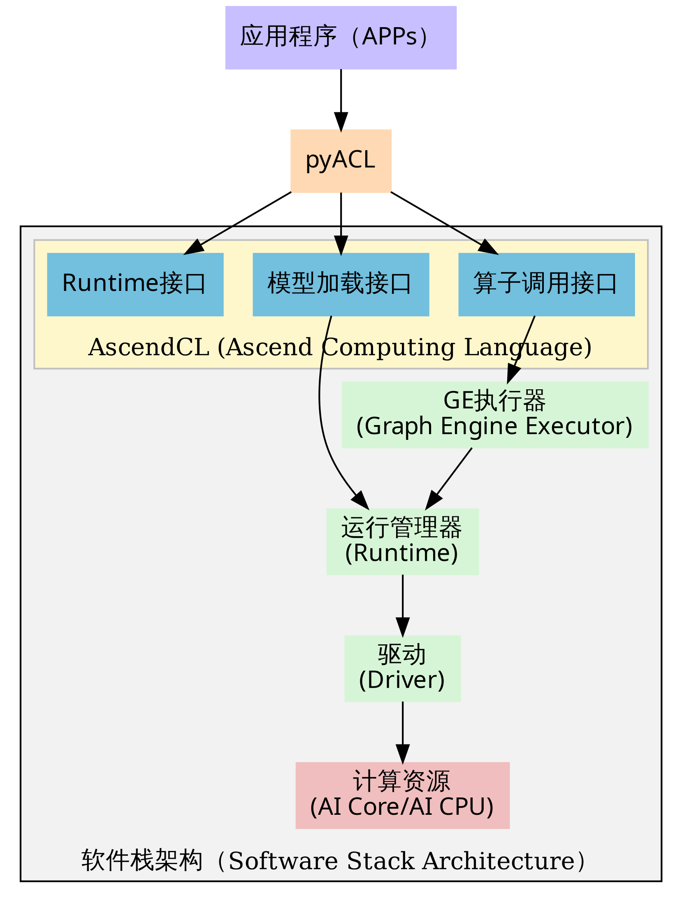
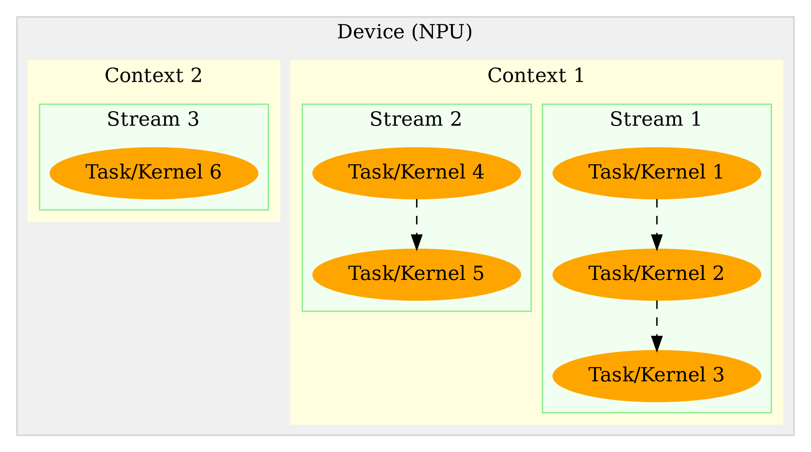
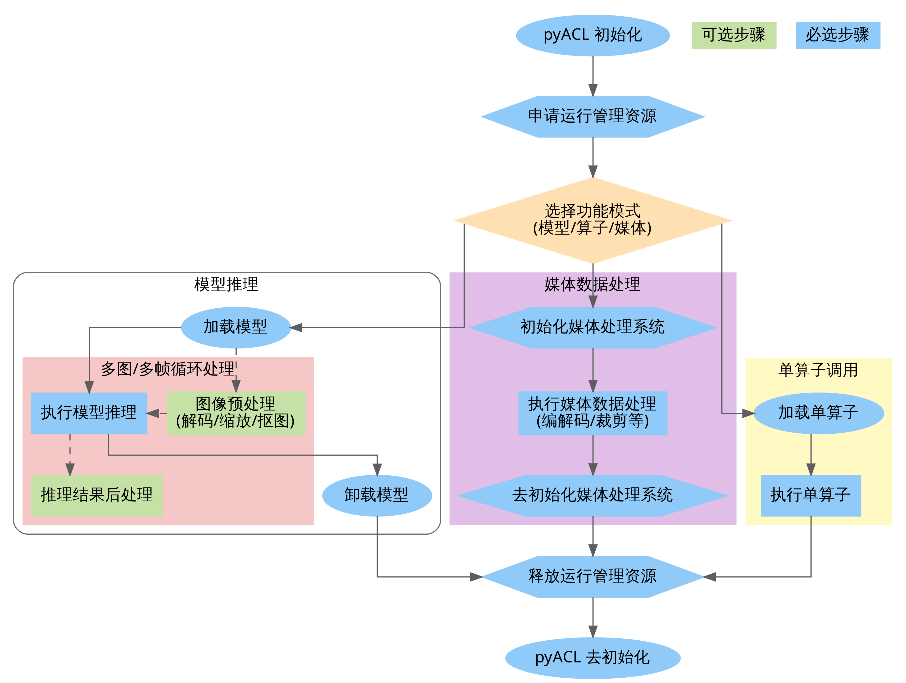
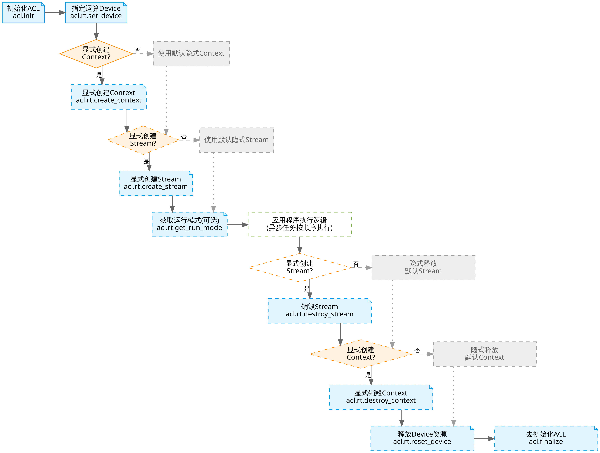
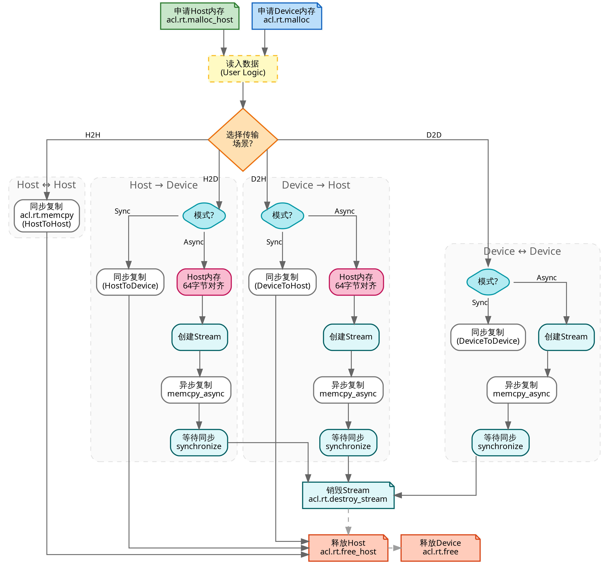
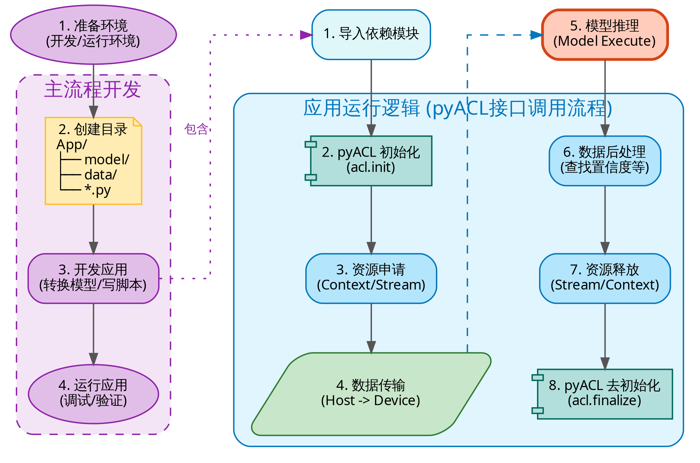

AscendCL（Ascend Computing Language）是一套用于在昇腾平台上开发深度神经网络应用的 C 语言 API 库。它提供了运行资源管理、内存管理、模型加载与执行、媒体数据处理等核心功能，充当了统一的 API 框架，帮助开发者充分利用昇腾 AI 处理器的硬件算力（如矩阵计算、图像预处理等）。

然而，直接使用 C/C++ 版本的 AscendCL 进行开发存在一定的挑战。首先，C/C++ 语言本身的指针操作和手动内存管理对开发者要求较高，容易产生内存泄漏或访问越界等难以调试的问题；其次，C++ 代码通常较为冗长，构建和编译流程繁琐，不利于算法的快速原型验证与敏捷迭代。回顾上一章，虽然我们可以尝试将 PyTorch 移植到昇腾 310B 开发板上，但受限于硬件架构差异和算子支持度，直接运行原生 PyTorch 代码往往面临诸多兼容性问题和性能瓶颈。**因此，对于初学者而言，直接在 310B 板端运行 PyTorch 并不是最优解，而 PyACL 则是平衡开发效率与运行性能的最佳选择。**

为了解决上述痛点，PyACL（Python Ascend Computing Language）应运而生。作为 AscendCL 的 Python 绑定版本，PyACL 通过 CPython 封装底层 C 接口，在保留硬件高性能特性的同时，大幅降低了开发门槛。它允许开发者通过简洁的 Python 语法调用昇腾处理器的强大能力，无缝衔接主流 AI 框架和数据处理库。

需要特别指出的是，**昇腾 310B 是一款定位为推理（Inference）的 AI 处理器，算力与显存资源受限，并不适合进行大规模的模型训练**。在实际应用中，标准的开发流水线如下：
1.  **模型训练**：在拥有高性能显卡（GPU）或昇腾 910 训练卡的服务器上，使用 PyTorch 等框架完成模型训练。
2.  **模型转换**：使用 ATC 工具将训练好的模型转换为昇腾专用的离线模型（.om）。
3.  **推理部署**：使用 **PyACL** 在昇腾 310B 上加载 .om 模型，实现高性能的边缘端推理。

本章将依据这一官方开发范式，系统讲解 PyACL 应用开发的全流程。

## PyACL的基本概念
PyACL 封装了底层 C语言接口，主要包含以下模块：
- **acl**: 核心模块，提供初始化、Device 管理、内存管理、模型推理等功能。
- **acl.media**: 媒体数据处理（DVPP），包括 JPEG 编解码、视频编解码、VPC（图像处理）。
- **acl.op**: 单算子调用接口。

### PyACL的逻辑架构

PyACL的程序逻辑架构图如下图所示：

{#fig:pyacl_logic width=70% .center}

根据 PyACL 的程序逻辑架构图，整个工作流程呈现出清晰的自顶向下的分层结构，每一层都承载着特定的职能，共同协作完成从 Python 代码到硬件指令的转换。

最顶层是 **应用层（Application Layer）**，即开发者编写的应用程序入口（如 `main.py`）。在此层，开发者专注于处理顶层业务逻辑，例如视频流读取或图像预处理，并通过 Python 语法调用 PyACL 提供的功能接口。紧接着是 **PyACL 桥接层**，它位于应用层与 C++ 库之间，充当了一个轻量级的封装层。其核心职能是利用 CPython 机制，将上层的 Python 函数调用“翻译”为底层 C 语言的 AscendCL 接口调用。这种设计巧妙地屏蔽了底层 C++ 指针操作与内存管理的复杂性，让开发者在享受 Python 语法便捷性的同时，依然能够直接操控底层的系统资源。

向下深入，便是 **AscendCL 接口层**。它向 PyACL 开放了三大核心能力：负责 Context、Stream 等基础资源管理的 **Runtime 接口**，负责加载离线模型（.om）的 **模型加载接口**，以及支持单独执行某个算子（如 MatMul）的 **算子调用接口**。当指令穿过接口层进入 **执行控制层** 时，数据流根据任务类型分化为两条路径：如果是标准的 **模型推理流**，由于 .om 模型已在 ATC 阶段编译完成，指令直接由 **Runtime**（运行管理器）接管并执行，由此构成了效率最高的“捷径”；如果是 **单算子调用流**，请求则需先经过 **GE（Graph Engine）执行器** 进行算子匹配和图构建，随后才下发给 Runtime。

无论走哪条路径，所有任务最终都会汇聚于 **Runtime**。作为任务调度的核心枢纽，Runtime 将经过调度的任务流提交给底层的 **驱动层（Driver）**。驱动层负责与硬件进行物理交互，将计算指令最终发送给昇腾处理器的 **AI Core**（执行大规模矩阵/向量计算）或 **AI CPU**（执行复杂逻辑控制），从而在物理层面处理数据。

纵观整个架构，PyACL 展现出一种极强的 **“穿透性”**。虽然开发者是在高层次的 Python 环境中编写代码，但通过 PyACL 和 AscendCL 的层层传递，控制指令最终能够穿透软件栈，直达底层的 AI Core 硬件。这种“Python 语义驱动，硬件原生执行”的架构设计，正是 PyACL 既能保持开发效率，又能实现高性能推理的根本原因。

### 基本概念与运行模型

利用 PyACL 进行编程开发，构建高效的 AI 应用，首先必须深入理解三个核心概念：**Device**、**Context** 和 **Stream**。这三者构成了 PyACL 运行时资源管理的基础骨架。**Device** 代表了物理层面的计算设备，即安装了昇腾 AI 处理器的硬件单元，是计算资源的实际载体。在多设备场景下，不同 Device 之间的内存资源是物理隔离的，无法直接共享。**Context（上下文）** 是在 Device 之上的逻辑容器，负责管理执行环境。它类似于操作系统中的“进程”概念，负责维护该 Context 下所有对象（如 Stream、Event、设备内存等）的生命周期，并保证不同 Context 之间的资源隔离。**Stream（执行流）** 则是动态的任务传送带，用于维护异步操作的执行顺序。基于 Stream 的机制，开发者可以利用流水线技术，实现 Host 侧逻辑运算、Host 与 Device 间的数据传输以及 Device 侧 Kernel 计算这三者的最大化并行。

理解这三者之间的关系，是掌握 PyACL 资源管理的关键。它们呈现出一种严格的层级归属关系：**Device 包含 Context，而 Context 又包含 Stream**，他们之间的关系图如下图所示：

{fig:device_context_stream width=70% .center}

一个 Context 必须且只能属于一个特定的 Device，但一个 Device 下可以并存多个 Context。Context 与 Stream 的关系则侧重于生命周期的绑定，每个 Context 都会自动包含一个默认 Stream，用户也可以显式创建多个 Stream，但 Stream 必须依附于创建它的 Context 而存在。如果 Context 被销毁，其下属的 Stream 也就无法再被使用。因此，资源释放必须遵循“先释放 Stream，再释放 Context，最后释放 Device”的逆序原则。

在多线程编程范式下，线程（Thread）与 PyACL 资源对象的交互机制是实现高并发的关键。**线程与 Context 之间遵循“单时刻单绑定”原则**，即在任意时刻，一个应用线程只能作为一个 Context 的“活跃”操作者。默认情况下，线程会绑定到最后一次创建的那个 Context 上，但开发者可以通过 `acl.rt.set_context` 动态切换不同的 Context，从而实现单线程对不同计算资源（如多个 Device 或隔离的资源池）的轮询调度。**线程与 Stream 则呈现出灵活的“一对多”控制关系**。一个线程完全可以在其绑定的 Context 内创建多个 Stream，并通过异步接口将计算任务依次分发到不同的 Stream 中，由 NPU 硬件负责调度并行执行，从而有效掩盖任务间的等待延迟。

关于资源的选择，PyACL 提供了默认和显式两种模式。系统支持隐式创建“默认 Context”和“默认 Stream”，它们通常在调用 `acl.rt.set_device` 时自动建立，适用于简单的单 Device 验证场景。然而，默认资源存在诸多限制，既不支持手动释放，也无法通过句柄灵活管理。因此，在构建复杂的多线程商业应用时，**强烈建议全部使用显式创建的 Context 和 Stream**，以确保资源生命周期的可控性和程序的健壮性。

在性能优化与调度方面，合理规划 Stream 的数量至关重要。虽然多 Stream 旨在实现并行，但 Device 端的硬件资源（如 AI Core、AI CPU、Vector Core）是有限的。如果进程内过多的 Stream 同时争抢同一类硬件资源，硬件调度器在不同 Stream 间切换的开销可能会抵消并行带来的收益。因此，**最佳实践是按照算子执行引擎来划分 Stream**，例如将 AI Core 密集型任务与 AI CPU 逻辑型任务分发到不同的 Stream 中，从而实现异构硬件的真正的并行。此外，在架构设计上，“单线程多 Stream”的模式通常比“多线程多 Stream”具有微弱的性能优势，因为它避免了 Host 侧操作系统频繁进行线程上下文切换的开销，让 CPU 能更专注于向 NPU 下发任务。

### PyACL应用开发环境

#### CANN 安装
要部署 PyACL 的开发环境和运行环境，首先需要安装与目标 CANN 版本匹配的驱动和固件。虽然昇腾 310B 开发板通常预装了基础环境，但为了获得最新的特性支持，建议按照[本教程第二章](https://zhouxzh.github.io/Ascend310/book/chapter2.html)或[《CANN 软件安装指南》](https://www.hiascend.com/document/detail/zh/CANNCommunityEdition/83RC1/index/index.html)升级至较新的 CANN 版本（如 CANN 8.3）。

CANN 软件包安装完成后，**无需额外安装独立的 Python 绑定库**，PyACL 相关模块已包含在 CANN Toolkit 中。但为了确保系统能正确找到 `acl` 模块，必须加载必要的环境变量。

#### 环境变量配置

如果按照本教程第二章的标准流程安装，通常无需额外操作，CANN 的路径配置脚本可能已自动写入启动文件。在 Miniconda 的 `base` 环境中，您可以直接尝试导入 `acl`。

如果创建了新的虚拟环境或遇到 `ModuleNotFoundError`，请手动执行以下命令加载环境变量：

```bash
source /usr/local/Ascend/ascend-toolkit/set_env.sh
```

为避免每次打开终端都需要输入该命令，建议将其添加到 `~/.bashrc` 文件末尾。

> **⚠ 注意**：
> PyACL 组件（`acl.so`）支持的 Python 版本范围通常为 **3.7.5 ~ 3.10**。请确保您的虚拟环境 Python 版本在此区间内。

#### 环境验证

为了验证 PyACL 环境是否就绪，我们可以编写一个简单的测试脚本 `check_ascend_device.py`，用于查询当前系统的 NPU 设备数量：

```python
import acl  # 导入核心库

# 1. 初始化 ACL 环境
# 配置文件路径传入空字符串，表示使用默认配置
ret = acl.init("") 
if ret != 0:
    print(f"ACL init failed, ret={ret}")
    exit(1)

# 2. 获取可用 Ascend 设备数量
count, ret = acl.rt.get_device_count()
if ret == 0:
    print(f"Found {count} Ascend devices.")
else:
    print(f"Get device count failed, ret={ret}")

# 3. 去初始化 (释放资源)
acl.finalize()
```

运行该脚本：

```bash
(base) HwHiAiUser@orangepiaipro:~/Documents/samples/chapter4$ python check_ascend_device.py 
Found 1 Ascend devices.
```
该示例代码演示了 PyACL 应用的基础生命周期：包括环境初始化、查询硬件资源（NPU 数量）以及最后的资源释放。对于投影 310B 处理器的开发板，其可用 NPU 设备数量为 1，程序输出结果与硬件实际情况一致。

从上述示例可以看出，环境初始化与资源释放是 PyACL 应用开发的必要环节。在调用任何核心功能接口前，必须先执行 `acl.init(config_path)`。若跳过初始化步骤，后续所有接口调用可能失败并返回错误码（如 `ACL_ERROR_UNINITIALIZED`），导致程序无法正常运行。在没有特殊配置需求时，`acl.init` 可直接传入空字符串或指向空白 JSON 文件的路径。

同样，程序运行结束后必须执行 `acl.finalize()` 以确保资源被正确回收。如果缺少资源释放环节，可能会引发内存泄漏、NPU 算力资源被持续占用或设备状态异常，进而影响后续任务的执行甚至导致系统崩溃。

值得注意的是，对于上述简单的设备查询程序，即使没有显式调用初始化和资源释放接口，程序通常也能够返回正确的结果。例如，我们可以将代码简化为如下一行的命令并在终端执行：

```bash
python -c "import acl; print(f'Found {acl.rt.get_device_count()[0]} Ascend devices.')"
```

这种现象的原因主要有两点：
1. **接口依赖性较低**：`acl.rt.get_device_count` 属于基础的硬件查询接口，在某些版本的驱动实现中，这类轻量级查询操作可能并不严格依赖完整的全局初始化环境即可访问驱动状态。
2. **操作系统资源回收**：虽然程序没有显式调用 `acl.finalize()`，但当 Python 进程退出时，操作系统会自动关闭相关的文件描述符并回收该进程占用的资源。因此，多次运行该脚本通常不会立刻导致系统资源耗尽或报错。

**但必须强调，这属于非规范用法。** 在涉及模型加载、内存申请或硬件加速（DVPP）等核心功能时，跳过 `acl.init` 可能会导致报错。为了保证程序的健壮性与兼容性，开发者应始终坚持规范的“初始化-业务执行-资源释放”流程。


### PyACL接口调用流程

调用 PyACL 接口开发的 AI 应用通常遵循一套标准化的逻辑流程，涵盖从环境初始化、硬件资源申请、业务计算执行到资源销毁的完整生命周期。开发者可以根据业务需求，将模型推理、媒体数据处理（DVPP）或单算子加速等功能进行独立部署或组合使用，如下图所示：

{fig:pyacl_interface width=100% .center}

根据上图展示的 PyACL 接口调用流程，我们可以将开发过程清晰地划分为三个主要阶段：**系统初始化**、**核心功能执行**以及**资源释放**。

1.  **系统初始化与资源申请（公共基础）**
    无论开发何种类型的应用，起步动作都是统一的。首先调用 `acl.init` 进行全局初始化，随后申请运行管理资源。这通常涉及指定计算设备（Device）、创建上下文（Context）以及创建用于管理任务流的 Stream。这些资源构成了后续所有计算任务的基础环境。

2.  **核心功能执行**
    在资源就绪后，开发者根据具体业务需求选择相应的执行路径：
    *   **模型推理链路（左侧分支）**：这是最典型的 AI 应用场景。开发者首先调用接口加载离线模型（.om），随后在业务循环中对每一帧图像或数据进行必要的预处理（如使用 DVPP 硬件进行解码与缩放）将其转化为模型所需格式，接着调用模型执行接口完成推理，并在获取推理结果后执行解析分类标签或画框等后处理逻辑，最后在任务完成后及时卸载模型以释放内存资源。
    *   **媒体数据处理链路（中间分支）**：如果应用仅涉及图像编解码或视频处理而无需推理，可以直接初始化媒体系统，调用 DVPP 接口进行处理，随后去初始化。
    *   **单算子调用链路（右侧分支）**：适用于不需要加载完整网络模型，仅需执行特定矩阵运算或数学函数的场景。流程简化为加载特定算子描述并直接执行算子。

3.  **资源释放与去初始化**
    当业务逻辑执行完毕后，必须严格按照逆序释放资源：先销毁 Stream 和 Context，再重置 Device，最后调用 `acl.finalize` 完成 PyACL 的去初始化。这一步对于防止内存泄漏和保证系统稳定性至关重要。

此流程图清晰地界定了必选步骤（蓝色）与可选的业务逻辑步骤（绿色），帮助开发者建立规范的编程思维。

### 运行管理资源生命周期

PyACL 的资源管理构建在 **Device**、**Context** 与 **Stream** 三个核心概念之上。在应用启动阶段，必须首先调用 `acl.init` 完成全局环境初始化。随后，通过 `acl.rt.set_device` 指定计算所需的物理 NPU 设备。

开发应用时，应用程序中必须包含运行管理资源申请的代码逻辑，您需要按照Device、Stream的顺序依次申请。其中，创建Stream的方式分为隐式创建和显式创建，其适用场景有所不同，运行资源的申请与释放的流程如下图所示：

{fig:pyacl_stream width=100% .center}

上图展示了 PyACL 资源管理的完整生命周期流程。整个流程严格遵循“先申请后释放，谁申请谁释放”的原则，主要包含以下几个关键步骤：

1.  **ACL 初始化 (`acl.init`)**：这是所有 AscendCL 操作的起点。必须在进程启动的最开始调用，用于初始化 ACL 的全局配置。
2.  **资源申请 (`set_device/create_context/create_stream`)**：开发者通过 `acl.rt.set_device` 锁定物理硬件资源。如果应用没有显式调用 `acl.rt.create_context` 或 `acl.rt.create_stream`，系统在调用 `set_device` 后会自动创建并关联**默认 Context** 与**默认 Stream**。但在生产环境或多线程并发场景下，建议显式创建这些资源，以实现更好的逻辑隔离和任务异步调度。Stream 作为任务执行队列，负责管理指令在硬件上的下发顺序。
4.  **业务执行 (Execution)**：在此阶段，应用进行模型加载、数据预处理、推理计算等核心逻辑。所有的计算任务（Kernel）都会被下发到之前创建的 Stream 中。
5.  **资源销毁**：业务完成后，必须按特定顺序释放资源。对于**显式创建**的资源，应首先调用 `acl.rt.destroy_stream` 销毁 Stream，再调用 `acl.rt.destroy_context` 销毁 Context。最后调用 `acl.rt.reset_device` 重置设备以彻底释放 Device 资源。需要特别说明的是，若未显式创建 Context 与 Stream（即使用系统默认资源），开发者**不能**调用相应的销毁接口；在这种情况下，直接调用 `reset_device` 即可隐式地销毁关联的默认 Context 与 Stream 资源。
5.  **ACL 去初始化 (`acl.finalize`)**：这是进程退出的最后一步，用于彻底清理全局资源。开发者应严格遵循“先业务、再流、后设备”的逆序原则进行资源释放，最后调用此接口退出环境，以避免内存泄漏或设备状态异常。

**关键点总结：**
*   **顺序至关重要**：资源的申请与释放必须严格遵循层级逻辑。申请资源时，按照 **`Device -> Context -> Stream`** 的顺序依次创建；释放资源时，则必须严格遵循 **`Stream -> Context -> Device`** 的逆序原则。如果先重置了 Device，依附于其上的 Context 和 Stream 将变为非法状态，导致不可预知的系统错误。
*   **显式 vs 隐式**：虽然隐式创建（直接 `set_device` 后 `create_stream`）代码更少，但为了代码的健壮性和可维护性，推荐在生产环境代码中始终使用**显式创建 Context和Stream** 的流程。

以下是 PyACL 资源申请与释放的标准逻辑示例。这段伪代码展示了在典型应用场景下，如何按照规范的生命周期管理硬件资源：

```python
import acl

# 1. 环境初始化
ret = acl.init("")

# 2. 指定计算设备
device_id = 0
ret = acl.rt.set_device(device_id)

# 3. 显式创建 Context 并绑定到当前线程
context, ret = acl.rt.create_context(device_id)
ret = acl.rt.set_context(context)

# 4. 显式创建执行流（属于上述 Context）
stream, ret = acl.rt.create_stream()

# -----------------------------------------------------------------
# ... 执行核心业务逻辑（如模型推理、算子调用或媒体处理）...
# -----------------------------------------------------------------

# 5. 销毁执行流（先释放 Stream）
ret = acl.rt.destroy_stream(stream)

# 6. 销毁 Context（在销毁 Stream 之后）
ret = acl.rt.destroy_context(context)

# 7. 重置设备（释放 Device 相关资源）
ret = acl.rt.reset_device(device_id)

# 8. 系统去初始化
ret = acl.finalize()
```

**关键步骤说明**：

*   **初始化与去初始化**：`acl.init` 和 `acl.finalize` 必须在进程级别成对调用。未初始化直接调用其他接口会导致运行报错。
*   **隐式 Context 机制**：示例中利用 `acl.rt.set_device` 隐式创建了 Context。在复杂的并发场景下，建议使用 `acl.rt.create_context` 显式创建，以便更精确地控制资源隔离。
*   **资源释放顺序**：代码严格遵循了**“后申请，先释放”**的逆序原则。如果先重置设备再销毁流，会导致非法句柄访问，进而引发系统崩溃或内存异常。
*   **返回值检查**：虽然本示例为简化逻辑未展示 `ret` 判断，但在实际工程中，**必须**检查每一个接口的返回值（`0` 代表成功），以便在资源不足或硬件异常时及时捕获错误。

### 异构内存管理

由于昇腾 AI 处理器拥有独立的存储单元，应用开发涉及 **Host**（CPU 侧）与 **Device**（NPU 侧）两部分内存。开发者通常面临频繁的数据交互需求：通过 `acl.rt.malloc` 申请 Device 侧内存用于 NPU 计算，或通过 `acl.rt.malloc_host` 申请 Host 内存。数据的流动则依靠 `acl.rt.memcpy` 完成，通过定义传输方向，将采集到的源数据搬运到 NPU 计算单元，或将计算出的结果拉回 Host 进行后处理。内存数据的流动方向一共有四种，分别是Host之间，Host到Device，Device之间以及Device到Device，分别对应`ACL_MEMCPY_HOST_TO_HOST`,，具体的流程图如下图所示：

{fig:pyacl_memory width=100% .center}

数据在 Host（CPU）与 Device（NPU）之间的拷贝主要有四种常见路径：Host 到 Host、Host 到 Device、Device 到 Host 以及 Device 到 Device，分别对应四个常量：`ACL_MEMCPY_HOST_TO_HOST`、`ACL_MEMCPY_HOST_TO_DEVICE`、`ACL_MEMCPY_DEVICE_TO_HOST` 和 `ACL_MEMCPY_DEVICE_TO_DEVICE`。

标准的处理流程通常由以下步骤组成：首先在 Host 侧准备好输入数据；接着使用 `acl.rt.malloc` 或 `acl.rt.malloc_host` 申请目标内存空间；随后调用 `acl.rt.memcpy` 指定拷贝方向并执行数据传输（支持同步或异步模式）；待数据传输至 Device 后进行计算；最后将计算结果通过 Device 到 Host 的拷贝路径拉回 Host 侧进行后处理。在此过程中，需特别注意内存对齐要求，以及在异步拷贝时必须配合 Stream 同步操作以确保数据可用。

以下是这四种内存传输模式的详细说明与关键点解析：

**1. Host 到 Host (ACL_MEMCPY_HOST_TO_HOST)**
纯 CPU 端的内存拷贝通常用于进程内部的数据移动或不同 Host 缓冲区之间的数据整理。该过程无需关注 Device 端的内存对齐要求，也不涉及 Stream，直接使用同步拷贝方式即可。以下是 Host 到 Host 同步拷贝的示例代码，首先申请两块 Host 内存，读取数据后，调用 `acl.rt.memcpy` 并指定拷贝类型为 1（即 ACL_MEMCPY_HOST_TO_HOST）：

```python
# Host 到 Host 同步拷贝
host_src, ret = acl.rt.malloc_host(size)
host_dst, ret = acl.rt.malloc_host(size)
# 假设 read_file 为用户自定义的数据加载函数
read_file(file, host_src, size)          
ret = acl.rt.memcpy(host_dst, size, host_src, size, 1) # 1 代表 ACL_MEMCPY_HOST_TO_HOST

# 释放资源
acl.rt.free_host(host_src)
acl.rt.free_host(host_dst)
```

**2. Host 到 Device (ACL_MEMCPY_HOST_TO_DEVICE)**
将 Host 侧的数据上传至 NPU（Device 侧）是推理任务的起点。该过程支持同步或异步方式。若采用异步上传，需确保 Host 内存满足 Device 的访问要求，通常建议使用 `acl.rt.malloc_host` 申请。在异步模式下，开发者必须显式创建 Stream，并在后续使用 Device 数据前执行同步等待操作，以确保数据传输完整。

以下是同步与异步拷贝的实现示例：
```python
# 准备内存
host_ptr, _ = acl.rt.malloc_host(size)
dev_ptr, _  = acl.rt.malloc(size, 2)  # 2 代表 ACL_MEM_MALLOC_HUGE (Device 内存)
read_file(file, host_ptr, size)

# 方式一：同步拷贝
# 2 代表 ACL_MEMCPY_HOST_TO_DEVICE
acl.rt.memcpy(dev_ptr, size, host_ptr, size, 2)

# 方式二：异步拷贝
stream, _ = acl.rt.create_stream()
acl.rt.memcpy_async(dev_ptr, size, host_ptr, size, 2, stream)
acl.rt.synchronize_stream(stream) # 等待数据传输完成

# 释放资源 (注意顺序)
acl.rt.free_host(host_ptr)
acl.rt.free(dev_ptr)
acl.rt.destroy_stream(stream)
```

**3. Device 到 Host (ACL_MEMCPY_DEVICE_TO_HOST)**
将 Device 侧的计算结果回传至 Host 侧是推理流程的最后一步，主要用于后续的业务结果解析或数据持久化。异步回传支持与 Device 侧的计算任务并行处理，但必须在 Host 侧访问该数据前执行 Stream 同步。在内存分配上，建议使用 `acl.rt.malloc_host` 申请 Host 侧缓冲区，以确保 Device 侧的 DMA 能够高效地完成数据交互。

```python
# 准备内存
out_dev, _ = acl.rt.malloc(out_size, 2)
out_host, _ = acl.rt.malloc_host(out_size)

# 假设 Device 侧计算已完成，执行异步拷贝 (3 代表 ACL_MEMCPY_DEVICE_TO_HOST)
acl.rt.memcpy_async(out_host, out_size, out_dev, out_size, 3, stream)

# 必须等待拷贝流执行完毕，确保数据已完整到达 Host
acl.rt.synchronize_stream(stream)

# 此时可进行后处理并释放资源
acl.rt.free(out_dev)
acl.rt.free_host(out_host)
```

**4. Device 到 Device (ACL_MEMCPY_DEVICE_TO_DEVICE)**
在 Device 内部不同缓冲区之间进行拷贝，或者在多 Device 场景下跨设备传输数据，这里主要注意的是，对于昇腾310B开发板来说，一般来说，一个昇腾310B开发板只有一个NPU，也就是说，只有一个Device。这种模式常用于数据格式重排或设备间通信。

该操作通常配合异步 Stream 使用，以避免阻塞 Host 线程。在执行跨设备拷贝时，开发者需要注意上下文切换或使用特定的点对点传输接口。以下是同一 Device 内执行异步拷贝的示例代码。程序首先申请两个 Device 内存块，随后通过 `acl.rt.memcpy_async` 执行拷贝，并将传输类型指定为 4（即 ACL_MEMCPY_DEVICE_TO_DEVICE）：

```python
# 同一 Device 内的异步拷贝
dev_a, _ = acl.rt.malloc(size, 2)
dev_b, _ = acl.rt.malloc(size, 2)
stream, _ = acl.rt.create_stream()

# 4 代表 ACL_MEMCPY_DEVICE_TO_DEVICE
acl.rt.memcpy_async(dev_b, size, dev_a, size, 4, stream)
acl.rt.synchronize_stream(stream)

# 释放资源
acl.rt.free(dev_a)
acl.rt.free(dev_b)
acl.rt.destroy_stream(stream)
```

该模式常用于设备内数据重排或多设备间的点对点传输。在昇腾 310B 等单 NPU 平台上，跨设备传输并不常见；在多 NPU 环境下，应通过切换 Context 或使用专用点对点传输接口以减少额外拷贝开销。建议始终配合异步 Stream 并在访问目标缓冲区前调用同步接口（如 synchronize_stream 或 stream_wait_event）以确保数据已就绪，同时注意内存对齐与访问权限，避免 DMA 访问异常。

**通用开发注意事项**
1.  **异步与同步**：异步拷贝接口（`memcpy_async`）必须配合 Stream 以及 `synchronize_stream` 使用，否则无法保证数据一致性。
2.  **内存类型**：为了提升传输效率，Host 侧供 Device 访问的内存建议始终使用 `acl.rt.malloc_host` 申请。
3.  **释放顺序**：资源释放应遵循严格的逆序原则——先销毁 Stream，再释放内存，最后重置 Device。
4.  **错误处理**：示例代码为保持简洁略去了错误检查，但在实际开发中，所有 ACL 接口调用的返回值（`ret`）都必须进行检查（`0` 表示成功）。

### 同步等待机制

从上一节关于内存拷贝的四种路径中，我们可以观察到 `acl.rt.memcpy` 与 `acl.rt.memcpy_async` 两种截然不同的操作模式。这两种模式的选择，本质上是在**编程简易性**与**执行性能**之间做权衡。

#### 同步与异步的概念

**同步操作（Synchronous）** 是最符合直觉的编程方式，它遵循严格的“请求-响应”逻辑。正如我们在 Host 到 Host 拷贝示例中所见，当 Host 线程发起一个同步指令时（如 `acl.rt.memcpy`），CPU 会挂起当前线程，像监工一样死死盯着任务，直到任务彻底完成后才会恢复执行下一行代码。这种模式的优点显而易见：逻辑简单，数据一致性由代码执行顺序天然保证，非常适合初学者进行功能验证或定位 BUG。但其缺点也同样致命：它完全抹杀了硬件并行的可能性。试想，当 CPU 在傻傻等待数据从 Host 搬运到 Device 时，昂贵的 NPU 计算单元可能正处于空闲状态，导致系统整体吞吐量下降。

**异步操作（Asynchronous）** 则打破了这种串行束缚，是高性能 AI 应用的标配。在调用 `acl.rt.memcpy_async` 时，Host 线程仅需将任务“投递”到 Stream 队列中便立即返回，继续处理其他逻辑（如读取下一张图片或预处理数据）。此时，底层的 DMA 搬运引擎会与 NPU 的计算引擎同时工作，实现了真正的**软硬件并行**。这就好比点餐系统，前台服务员（Host）只负责快速接单并把单子（Task）扔给厨房（Stream），而不需要站在厨房门口等菜做好，从而能接待更多的客人。在复杂的 AI 业务流中，这种机制允许我们构建精妙的流水线：**在 NPU 拼命推理当前帧的同时，DMA 正在默默地将下一帧数据搬运进显存，而 CPU 已经在预处理第三帧数据**。这种“想尽办法让显卡即使一毫秒都不闲着”的设计，正是提升 AI 应用帧率的关键。

然而，异步操作是一把双刃剑，带来的性能红利必须以**严谨的同步控制**为代价。因为 Host 线程“投递”完任务就跑了，如果不加干预，它很可能在数据还没搬运完时就开始尝试读取结果，或者在 NPU 还没用完数据时就释放了内存，从而引发数据错乱甚至程序崩溃。因此，异步开发必须配合**同步等待机制**，在关键的时间节点上让“脱缰”的并行任务重新对齐。

#### PyACL的四种同步机制

PyACL 提供了四种不同粒度的同步等待机制，以适应从简单的单流控制到复杂的多流并行协作等不同场景。正确选择同步方式是平衡 Host 侧控制流与 Device 侧数据流的关键。

1.  **Event 的同步等待 (`acl.rt.synchronize_event`)**
    Event 是 PyACL 中的“时间锚点”或“完成标记”。这种机制允许 Host 侧主动阻塞，直到某个特定的 Event 在 Device 侧被触发。其典型流程是：开发者创建一个 Event，将其记录（Record）到某个 Stream的任务队列中；当 Stream 执行到该记录点时，会在硬件层面触发该 Event；Host 线程通过调用 `synchronize_event` 暂停自身执行，直至接收到触发信号。这种方式粒度适中，适合 Host 需要等待某个特定任务节点完成后再进行后续逻辑（如读取特定阶段的结果），且该 Event 可能被多个等待者复用的场景。

    ```python
    # 伪代码：Host 等待特定 Event
    event, _ = acl.rt.create_event()
    acl.rt.memcpy_async(dev_ptr, size, host_ptr, size, 1, stream) # 异步拷贝
    acl.rt.record_event(event, stream) # 在流中安插一个锚点
    
    # ... Host 执行其他不依赖数据的逻辑 ...
    
    acl.rt.synchronize_event(event) # Host 在此阻塞，直到上面的拷贝完成
    # 此时可以安全释放 host_ptr 或读取 dev_ptr
    ```

2.  **Stream 内任务的同步等待 (`acl.rt.synchronize_stream`)**
    这是最常用且最直观的同步方式，它表示 Host 侧阻塞等待指定 Stream 中的**所有**已提交任务全部执行完毕。其语义简单直接，保证了指定流水线上的所有操作都已落盘。常用于单 Stream 流水线的收尾阶段，或者 Host 必须确保整个任务队列清空后才能继续（例如释放 Stream 资源前）。虽然简单，但它是粗粒度的阻塞操作，如果 Stream 中积压任务较多，会导致 Host 长时间等待。

    ```python
    # 伪代码：Host 等待整个流清空
    acl.rt.memcpy_async(..., stream) # 任务1
    acl.op.execute_v2(..., stream)   # 任务2
    acl.rt.memcpy_async(..., stream) # 任务3
    
    acl.rt.synchronize_stream(stream) # Host 阻塞，直到任务1,2,3全部完成
    # 此时所有任务均已结束
    ```

3.  **Stream 间的同步等待 (`acl.rt.stream_wait_event`)**
    这是实现**多流并行与主要流水线协作**的核心机制。与前两者不同，`stream_wait_event` **不会阻塞 Host 线程**，而是向 Consumer Stream（消费者流）中下发一个“等待指令”。Consumer Stream 执行到该指令时，会暂停处理后续任务，直到 Producer Stream（生产者流）触发了指定的 Event。这种机制完全在 PyACL 内部调度和 Device 硬件层面完成，Host 仅负责编排逻辑，从而最大化了 CPU 与 NPU 的并行效率。它非常适合跨流的数据依赖场景，例如：Stream A 负责数据搬运，Stream B 负责计算，Stream B 必须等待 Stream A 搬运完成后才能开始计算。

    ```python
    # 伪代码：Stream 间协作 (不阻塞 Host)
    # Stream A: 搬运数据 -> Record Event
    acl.rt.memcpy_async(dev_input, ..., stream_a)
    acl.rt.record_event(event, stream_a) # 记录搬运完成
    
    # Stream B: 等待数据 -> 开始计算
    acl.rt.stream_wait_event(stream_b, event) # Stream B 暂停，直到 Stream A 触发 Event
    acl.mdl.execute_async(..., stream_b)      # 只有等数据搬运完了，才会执行推理
    
    # Host 这里是非阻塞的，可以立即继续运行
    ```

4.  **Device 的同步等待 (`acl.rt.synchronize_device`)**
    这是粒度最粗的全局同步操作。调用此接口会阻塞 Host 进程，直到当前 Context 绑定的 Device 上**所有 Stream 的所有任务**全部完成。虽然它能保证设备层面的全局一致性，但由于其“一刀切”的等待特性，极大破坏了并行性，且开销最高。通常仅在程序初始化调试、全局状态检查或程序退出前的最终资源回收阶段使用，在高性能的生产业务循环中应尽量避免。

    ```python
    # 伪代码：全局等待
    acl.rt.memcpy_async(..., stream1)
    acl.rt.memcpy_async(..., stream2)
    
    # 强制等待设备上所有任务结束 (调试或退出时使用)
    acl.rt.synchronize_device()
    ```

#### 昇腾310B最佳同步策略与场景分析

在昇腾 310B 这种边缘计算平台上，CPU 的单核性能通常弱于服务器级 CPU，因此**减少 Host 侧（CPU）的阻塞**、把调度压力卸载给 Device 侧硬件显得尤为关键。
为了更直观地理解为什么在昇腾 310B 上必须强调“CPU 减负”与“异步并行”，我们需要深入分析这颗 SoC 的 CPU 性能定位。与市面上其他主流的边缘计算开发板相比，昇腾 310B 呈现出显著的 **“NPU 极强，CPU 较弱”** 的异构特性。

下表详细对比了昇腾 310B 与树莓派 5、RK3588 以及 NVIDIA Jetson Orin Nano 在 CPU 规格上的差异：

| 平台名称 | 核心处理器 (SoC) | CPU 架构 | 核心配置 | 主频 (典型) | CPU 算力估算 (UnixBench) |
| :--- | :--- | :--- | :--- | :--- | :--- |
| **昇腾 310B** | Ascend 310B | ARM Cortex-A55 | **4 核 (纯小核)** | 1.0 GHz ~ 1.6 GHz | ~ 400 - 600 分 |
| **树莓派 5** | BCM2712 | ARM Cortex-A76 | 4 核 (大核) | 2.4 GHz | ~ 2400+ 分 |
| **Orange Pi 5** | RK3588 | Cortex-A76 + A55 | 4 大核 + 4 小核 | 2.4 GHz (大) / 1.8 GHz (小) | ~ 5000+ 分 |
| **Jetson Orin Nano** | Tegra Orin | ARM Cortex-A78AE | 6 核 (高性能核) | 1.5 GHz | ~ 3500+ 分 |
| **桌面 PC** | Intel i7-12700K | x86-64 (Alder Lake) | 8 大核 + 4 小核 | 3.6 GHz ~ 5.0 GHz | ~ 45000+ 分 |

**数据解读与性能差距分析：**

1.  **架构代差（效率核 vs 性能核）**：
    昇腾 310B 采用的是 **Cortex-A55** 架构。在 ARM 的设计体系中，A55 被定义为“高能效核心（Efficiency Core）”，通常用于手机处理器的后台任务或物联网设备，其侧重点在于低功耗而非高性能。
    相比之下，树莓派 5 使用的 Cortex-A76 和 Orin Nano 使用的 Cortex-A78AE 均属于“高性能核心（Performance Core）”。在同频下，A76 的整数计算能力约为 A55 的 2~3 倍，浮点性能更是相差甚远。

2.  **绝对性能差距**：
    从综合基准测试（如 UnixBench 或 Geekbench）来看，昇腾 310B 的 CPU 性能大约仅为树莓派 5 的 **1/4 到 1/5**，仅为 RK3588 的 **1/8** 左右。这意味着，同样一段基于 OpenCV 的纯 CPU 图像缩放代码，在树莓派 5 上可能耗时 5ms，而在昇腾 310B 上可能耗时 25ms 甚至更多。

3.  **与桌面 CPU 的鸿沟**：
    如果是从在笔记本（x86, i5/i7）上开发算法迁移到 310B，这种落差会更加剧烈，性能折损可能达到 **50 倍甚至 100 倍**。桌面 CPU 拥有巨大的二级/三级缓存和乱序执行能力，这掩盖了 Python 解释器本身的低效。但在 310B 上，Python 的 Global Interpreter Lock (GIL) 加上较弱的单核性能，极易成为系统的最大短板。

**对 PyACL 开发的启示：**

基于上述硬件数据，我们在开发中必须遵循以下“生存法则”：
*   **不要信任 CPU 的浮点计算能力**：任何涉及图像 Pixels 遍历的操作（如 Resize, Color Convert, Normalize）若写在 CPU (Python) 端，必将导致帧率骤降。**必须使用 DVPP 硬件加速**。
*   **Python 代码仅做胶水**：Python 逻辑应仅限于流程控制、参数配置和极少量的后处理。业务主体必须由底层的 C++ 算子或 NPU 模型承担。
*   **异步是救命稻草**：由于 CPU 处理每一行 Python 代码都比其他平台慢，因此更不能让 CPU 傻傻等待 NPU（同步）。只有利用 `stream_wait_event` 让 CPU 快速把任务分发完并脱身，才能掩盖 A55 核心性能不足的缺陷。

**1. 优先策略：全链路异步与细粒度同步**

在昇腾 310B 平台上，由于 CPU 算力相对有限，最理想的流水线策略是实施“全链路异步”设计，即让 CPU 专注于指令分发，而将繁重的计算负载全权交由 NPU 负责。开发者应尽量避免使用 `acl.rt.memcpy` 等同步阻塞接口，转而全面采用 `acl.rt.memcpy_async` 配合 Event 机制。这种方法的核心原则在于，凡是能通过 Device 侧 `stream_wait_event` 解决的任务依赖，绝不让 Host 侧的 CPU 介入干预。例如，在典型的多级推理流水线中，我们可以安排 Stream A 负责视频解码（DVPP），Stream B 负责模型推理。当 Stream A 完成解码任务后，只需在流中记录一个 Event，而 Stream B 仅需等待该 Event 触发即可启动推理。整个交互过程中，CPU 仅需极低开销下发几条控制指令，完全无需挂起等待解码结束，从而能腾出宝贵算力去处理复杂的业务逻辑或网络通信，实现真正的软硬件解耦与并行。

```python
# 伪代码：利用 Event 实现解码与推理的异步流水线
# stream_dvpp 负责解码，stream_infer 负责推理
acl.media.dvpp_jpeg_decode_async(..., stream_dvpp)

# 1. 在解码流中记录一个“完成节点”
event_decode_done, _ = acl.rt.create_event()
acl.rt.record_event(event_decode_done, stream_dvpp)

# 2. 让推理流等待这个节点（Host 不阻塞，仅 NPU 内部等待）
acl.rt.stream_wait_event(stream_infer, event_decode_done)

# 3. 只有当解码完成后，推理流才会开始执行模型
acl.mdl.execute_async(..., stream_infer)
```

**2. 数据传输优化：Host Pinned Memory 的强制管理**

实现异步传输的高性能前提是 Host 侧内存的稳定性。在使用 `acl.rt.memcpy_async` 进行 Host 到 Device 的数据搬运时，源端的 Host 内存**必须**是通过 `acl.rt.malloc_host` 申请的页锁定内存（Pinned Memory）。普通的 `malloc` 申请的内存可能会被操作系统分页机制换出到磁盘交换区，导致 DMA 控制器无法安全、准确地访问数据。此外，内存的生命周期管理至关重要。在释放 Host 侧指针之前，必须通过 `acl.rt.synchronize_stream` 等手段确保所有涉及该内存块的 Stream 任务都已彻底执行完毕。如果过早释放内存，NPU 正尝试读取数据时地址已失效，将导致读取到野指针数据，引发难以复现的推理错误或系统崩溃。

```python
# 伪代码：异步传输的内存管理规范
# 必须使用 acl.rt.malloc_host 申请 Pinned Memory
host_ptr, _ = acl.rt.malloc_host(size) 

# ... 填充数据到 host_ptr ...

# 执行异步拷贝
acl.rt.memcpy_async(dev_ptr, size, host_ptr, size, 1, stream)

# 错误做法：直接释放 host_ptr (DMA 可能还在搬运中！)
# acl.rt.free_host(host_ptr) 

# 正确做法：先同步等待流结束，再释放
acl.rt.synchronize_stream(stream)
acl.rt.free_host(host_ptr)
```

**3. 多 Stream 协作范式：生产者-消费者模型**

构建基于生产者-消费者模型的多 Stream 协作机制，是挖掘 310B 硬件潜能、提升应用帧率（FPS）的关键手段。具体的实施路径是将通过 Stream 的划分将任务解耦为“预处理”、“推理”和“后处理”等独立阶段，通过 Event 机制实现流水线衔接。这种模式下，前一个阶段完成后记录 Event，后一个阶段感应 Event 并启动，就像工厂流水线一样运转。其最大优势在于避免了 CPU 使用 `while` 循环去轮询 NPU 的状态，极大降低了 CPU 占用率。对于昇腾 310B 这类嵌入式 SoC 而言，节省下来的 CPU 开销意味着开发者可以在 Python 层运行更复杂的逻辑判断，从而提升整个系统的智能化水平。

```python
# 伪代码：多 Stream 协作
# 循环中处理每一帧
for image in images:
    # 阶段 1: 预处理流 (Stream A)
    preprocess(image, stream_a)
    acl.rt.record_event(evt_pre, stream_a)
    
    # 阶段 2: 推理流 (Stream B)
    # 只有当预处理完成，推理才开始
    acl.rt.stream_wait_event(stream_b, evt_pre) 
    model_inference(stream_b)
    acl.rt.record_event(evt_infer, stream_b)
    
    # 阶段 3: 后处理流 (Stream C) or Host 读取
    # 只有推理完成，才处理结果
    acl.rt.stream_wait_event(stream_c, evt_infer)
    post_process(stream_c)
```

**4. 避免滥用全局同步与调试建议**

在追求高性能的同时，必须警惕对同步接口的滥用。最典型的反模式是在每一帧的处理循环中都调用 `acl.rt.synchronize_device()`，这种做法相当于强制将所有并行的流水线“拍扁”为串行执行，完全浪费了 NPU 的并行处理能力。全局同步应当被严格限制在程序初始化（确保设备状态复位）、调试阶段（精确定位错误发生的算子）或进程退出阶段（安全回收所有资源）。对于开发者而言，调试异步程序确实存在挑战，因为报错行往往滞后于实际错误发生点。因此，建议遵循“从同步到异步”的演进路线：在开发初期，全部使用同步接口（如 `synchronize_stream`）确保逻辑正确性和内存安全；进入性能调优阶段后，再逐步替换为异步接口并引入 Event 机制，配合 Profiling 工具观察流水线中的空隙（Bubble），逐步压榨硬件性能。

**小结**

掌握 PyACL 同步机制的核心在于理解**“控制流（CPU）与数据流（NPU）的分离”**。在昇腾 310B 开发中，优秀的架构设计应当是：Host 线程像一个从容的指挥官，通过 Event 编排好各 Stream 的协作顺序后便抽身而去，留给 NPU 硬件去并行处理繁重的数据搬运与计算任务。合理使用 `stream_wait_event` 实现 Device 内部的依赖隔离，仅在必须获取最终结果时使用 `synchronize_stream` 回收数据，是在边缘端实现高性能推理的黄金法则。


## 模型推理流水线

模型推理是 PyACL 应用开发的核心场景。为了能够让训练好的深度学习模型在昇腾 AI 处理器上高效运行，开发者需要遵循一套从环境准备到资源释放的标准化全流程。

### 模型推理开发流程解析

整个模型推理应用的构建过程可以宏观地分为 **“主流程开发”** 与 **“应用运行逻辑”** 两个层面，如下图所示：

{fig:pyacl_inference width=100% .center}

#### 主流程开发（Preparation Strategy）

主流程开发主要涉及应用构建的物理层面的准备工作。首先，开发者需要确保昇腾 AI 处理器的驱动与固件、CANN 软件（包含 pyACL）以及 Python 运行环境均已正确安装并完成环境变量配置，这是应用运行的基石。其次，为了保证项目的可维护性，建议采用标准化的目录结构，例如规划专门的 `model/` 目录存放离线模型、`data/` 目录存放测试图片或数据集，以及独立的脚本目录。紧接着进入核心开发阶段，这包括使用 ATC 工具将原始框架（如 ONNX 或 PyTorch）的模型转换为昇腾专用的 `.om` 离线模型，以及编写 Python 主程序以串联推理逻辑。最后，开发者需要在板端实际执行脚本，进行应用的验证与调试，确保从模型转换到最终输出的整个链路畅通无阻。

#### 应用运行逻辑（Execution Logic）
这是编写 Python 脚本时的代码执行时序，严格遵循 PyACL 的接口调用规范，主要包含以下八个关键步骤：

1.  **导入依赖**：`import acl` 引入 pyACL 库。
2.  **系统初始化**：调用 `acl.init()` 进行全局配置初始化，这是一切操作的起点。
3.  **资源申请**：创建 Device 连接，配置 Context（上下文）与 Stream（执行流），为后续计算搭建“舞台”。
4.  **数据传输（Host -> Device）**：在执行推理前，必须将待处理的图片或矩阵数据从 CPU 侧（Host）搬运至 NPU 侧（Device）。这通常涉及 `acl.rt.malloc` 申请 Device 内存以及 `acl.rt.memcpy` 执行搬运。
5.  **模型推理（Inference）**：这是流程的核心。调用 `acl.mdl.execute` 接口，指示 AI Core 利用加载的 `.om` 模型对 Device 内存中的数据进行计算。
6.  **数据后处理**：将推理产生的结果（通常在 Device 侧）回传至 Host 侧（或直接在 Device 侧处理），通过 Python 代码解析概率向量（Softmax）、筛选置信度或进行坐标转换。
7.  **资源释放**：业务完成后，必须按 **“先释放 Stream，再释放 Context，最后重置 Device”** 的逆序释放资源。
8.  **系统去初始化**：最后调用 `acl.finalize()`，通知系统回收全局资源，结束进程。

### 实例分析（ResNet50） 

通过前面的内容，我们已经详细的掌握了昇腾310B的PyACL的开发的基本知识，现在以ResNet50为例，详细讲解PyACL模型推理的详细的开发流程。
在上一章的内容中，我们已经简单介绍过ResNet的基础知识，我们知道ResNet50就是具有50层的ResNet，ResNet主要是用于图片的分类的，下面分步骤详细介绍整个图片分类的模型推理的开发流程。

#### 模型构建

首先用 bash 创建一个开发目录并放置示例文件，建议结构如下：

```text
resnet50/
├── model/
│   └── xxx.om      # 转换后的模型文件
├── data/
│   └── xxx.jpg     # 测试数据
├── main.py         # 主程序（示例）
└── utils.py        # 辅助脚本（可选）
```

创建该目录结构的命令（在终端粘贴执行）：

```bash
mkdir -p resnet50/model resnet50/data
cd resnet50
```

在前面的章节中，我们已经深入探讨了 CANN 软件栈的核心组件，并以 ResNet50 模型为例，详细解构了如何利用 **ATC（Ascend Tensor Compiler）** 工具将开源框架（如 ONNX）的模型转换为昇腾 AI 处理器专用的 `.om` 离线模型。

模型转换是应用开发中至关重要的前置环节，它将通用的深度学习模型“翻译”为高效的硬件指令。关于 ATC 工具的详细操作参数与进阶转换技巧，本章不再赘述。读者可回溯查阅本教程[第二章：CANN软件栈核心组件解析](https://zhouxzh.github.io/Ascend310/book/chapter2.html)的相关内容，或参考昇腾官方的权威文档《[ATC工具使用指南](https://www.hiascend.com/document/detail/zh/CANNCommunityEdition/80RC2alpha002/devaids/auxiliarydevtool/atlasatc_16_0003.html)》。

这里我们将第二章已转换好的模型复制到本章示例的 `model/` 目录。参考命令为：

```bash
cp ../../chapter2/sample_resnet_quick_start/model
/resnet50.om model/
```
                             
接着从华为云

得到 `.om` 离线模型后，就相当于拥有了在昇腾硬件上执行推理的“钥匙”。下面将介绍如何用 PyACL 加载该 `.om` 模型，并完成从模型加载、输入准备到推理与结果解析的完整流程。

### ResNet-18

npu:
```bash
ACL Resource Init Success. Device: 0
开始推理...
100%|████████████████████████████████████████████████████████████████████████████████████████████████████| 10000/10000 [00:36<00:00, 272.89it/s]
推理完成。
总图片数: 10000
总耗时: 36.6464 秒
推理帧率: 272.88 FPS
正确率: 44.86%
```


#### 核心实现：Dataset与DataBuffer

在上述的第5步（模型推理）中，PyACL 并不直接接受原始指针作为参数，而是引入了 `Dataset` 和 `DataBuffer` 的数据结构来管理输入输出。这种设计是为了应对深度学习模型多输入、多输出的异构特性。

1.  **aclDataBuffer（数据缓冲）**：最底层的单元，它封装了 Device 上的内存地址（`ptr`）和数据长度（`size`），代表一个具体的 Tensor（张量）。
2.  **aclmdlDataset（数据集）**：它是一个容器列表，用于存放多个 `aclDataBuffer`。例如，一个模型有两个输入（图片和元数据），那么输入的 `dataset` 就应该 add 两个 `buffer`。

标准的推理代码实现范式如下：

```python
import acl

# ... (初始化与资源申请代码略) ...

# 1. 加载模型
# 系统会自动分配 model_id 用于标识该模型
model_id, ret = acl.mdl.load_from_file("model/resnet50.om")
model_desc = acl.mdl.create_desc()
acl.mdl.get_desc(model_desc, model_id)

# 2. 准备 Dataset (以输入为例)
# 创建一个空的 Dataset 容器
input_dataset = acl.mdl.create_dataset()
# 获取模型第0个输入的所需大小
input_size = acl.mdl.get_input_size_by_index(model_desc, 0)

# 申请 Device 侧内存，并将数据拷贝进去 (假设 image_bytes 为预处理后的数据)
input_ptr, ret = acl.rt.malloc(input_size, 2) # ACL_MEM_MALLOC_HUGE_ONLY
acl.rt.memcpy(input_ptr, input_size, image_bytes_ptr, input_size, 1) # ACL_MEMCPY_HOST_TO_DEVICE

# 创建 Buffer 封装该内存指针
input_buf = acl.create_data_buffer(input_ptr, input_size)
# 将 Buffer 添加到 Dataset 中
acl.mdl.add_dataset_buffer(input_dataset, input_buf)

# 3. 准备 Output Dataset (逻辑同上，需根据模型输出数量创建对应 buffer)
# ...

# 4. 执行推理
# 同步接口，阻塞直到推理完成
ret = acl.mdl.execute(model_id, input_dataset, output_dataset)

# 5. 后处理与资源清理
# ...
```

通过这种层级化的封装，PyACL 能够统一处理简单模型与复杂多输入模型的推理请求，保证了接口的通用性与扩展性。

### 扩展功能：单算子与媒体处理
除了完整的模型推理，PyACL 还支持更为细粒度的操作。如果应用涉及基础线性代数运算（BLAS）或特定的数学计算，开发者可以略过复杂的模型构建过程，直接通过算子调用接口加载并执行单个算子。这种方式更加轻量，适合进行算子级的性能验证或特定的数据变换任务。此外，通过集成的 DVPP 接口，应用可以在硬件层级完成视频编解码与图像预处理，极大地减轻了 CPU 在数据清洗阶段的负担。

## DVPP 图像/视频处理

DVPP（Digital Vision Pre-Processing）是昇腾处理器的硬件加速引擎，用于处理 JPEG 解码、缩放、抠图等，速度远超 CPU。

### JPEGD (JPEG Decode)
将 `.jpg` 数据解码为 YUV 格式。
```python
# 1. 创建图片描述信息
channel_desc = acl.media.dvpp_create_channel_desc()
acl.media.dvpp_create_channel(channel_desc)

# 2. 准备输入内存 (Host -> Device)
# 假设 np_jpg_data 是读取的二进制 jpg 数据
input_dev, _ = acl.media.dvpp_malloc(len(np_jpg_data))
acl.rt.memcpy(input_dev, len(np_jpg_data), np_jpg_data_ptr, len(np_jpg_data), 1) # 1=Host2Device

# 3. 预测解码后大小并申请输出内存
output_desc = acl.media.dvpp_create_jped_config()
output_size, _ = acl.media.dvpp_jpeg_predict_dec_size(np_jpg_data_ptr, len(np_jpg_data), output_desc)
output_dev, _ = acl.media.dvpp_malloc(output_size)

# 4. 执行异步解码
acl.media.dvpp_jpeg_decode_async(channel_desc, input_dev, len(np_jpg_data), output_dev, output_size, output_desc, stream)
acl.rt.synchronize_stream(stream) # 等待完成
```

### VPC (Vision Preprocessing Core)
处理 Resize、Crop、Padding 等。输入必须是 Device 侧的 YUV 数据。
关键步骤：创建 `acldvppPicDesc` 描述输入和输出图片的格式、宽高、Stride，然后调用 `acl.media.dvpp_vpc_resize_async`。

## 单算子调用

如果不加载整个模型，仅需调用某个特定算子（如 Softmax, MatMul）：
1.  **acl.op.set_attr**: 设置算子属性。
2.  **acl.op.execute_v2**: 执行算子。
需注意，算子名称和输入输出格式必须与 CANN 算子库定义一致。

## 更多特性

*   **Profiling**: 通过 `acl.prof` 接口控制性能数据采集的起止。
*   **Dump**: 运行中导出模型各层的输入输出数据，用于精度比对。
*   **AIPP**: 在模型转换时配置静态 AIPP，让硬件自动完成 Resize/ColorConvert，PyACL 代码中无需编写相关逻辑。

## 应用调试与常见 FAQ

### 调试技巧
*   **返回值检查**：所有 ACL 接口均返回 `ret` 状态码，`0` 表示成功。非 0 需查阅《错误码参考》。
*   **日志获取**：设置环境变量 `export ASCEND_GLOBAL_LOG_LEVEL=1` (Info 级别) 查看详细日志，日志默认位置在 `~/ascend/log/`。

### FAQ
*   **Q: 为什么 `acl.mdl.execute` 报错 "Memory Check Failed"?**
    *   A: 检查 `acl.mdl.get_input_size_by_index` 获取的大小是否与你 `acl.rt.malloc` 的大小严格一致。
*   **Q: DVPP 解码后的图片看起来是花的？**
    *   A: DVPP 输出通常有宽/高对齐要求（如 128x16 对齐）。读取数据时需要根据 `stride` 跳过 Padding 数据，而不能简单按 `width * height` 读取。

## 使用约束

1.  **Context 线程安全**：一个 Context 可以在多个线程中使用，但需用户保证并发安全。推荐一线程一 Context。
2.  **Stream 约束**：Stream 上的任务按顺序执行，但异步接口下发后需显式 `synchronize` 才能确保数据就绪。
3.  **内存对齐**：DVPP 对内存地址和图片尺寸有严格对齐要求。

## 应用样例参考目录
昇腾社区提供了丰富的 Sample 仓（Gitee），推荐初学者阅读：
*   `sampleResnetQuickStart`: 最基础的图片分类。
*   `sampleYOLOV7`: 包含后处理逻辑的目标检测。
*   `sampleJpegDecode`: 专门展示 DVPP 用法。
