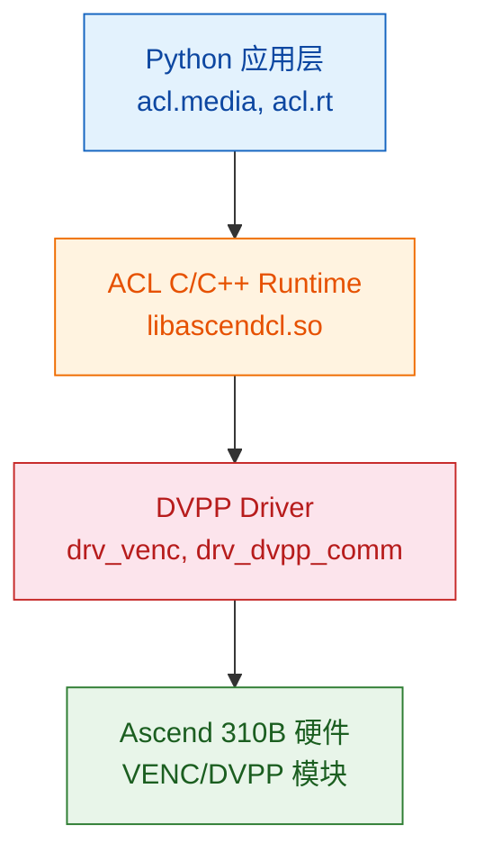
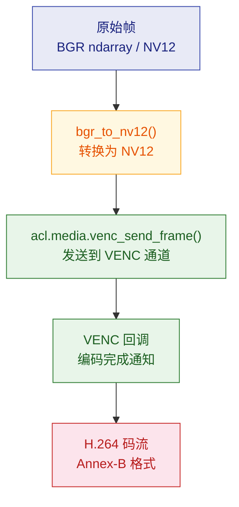
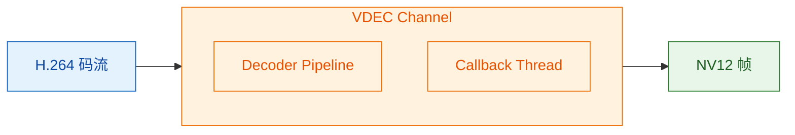

Ascend 310B 芯片内置了 **DVPP（Digital Vision Pre-Processing）** 硬件加速引擎，提供视频编解码（VENC/VDEC）、图像处理（VPC）和 JPEG 编解码能力。本章从基础概念出发，逐步深入到各子模块的 API 使用、性能调优和实战集成。

## DVPP 基础概念与编程模型

DVPP（Digital Vision Pre-Processing）是 Ascend 芯片内部的一组**硬件加速模块**，专门处理图像和视频数据。它独立于 NPU 的 AI Core（推理引擎），不占用 AI 算力。PyACL 通过 `acl.media` 接口对外暴露这些能力。

> 本节覆盖所有 DVPP 子模块（VENC、VDEC、VPC、JPEGE、JPEGD）共享的基础概念。如果你是第一次接触 DVPP，建议按顺序阅读本节，再进入具体子模块的教程。

### DVPP 在芯片中的位置

```
Ascend 310B4 芯片
├── AI Core × 1           ← DaVinci V300（矩阵运算，NPU 推理主力）
├── CPU × 4               ← TaishanV200M（ARM AArch64，动态划分 Control CPU / AI CPU）
├── DVPP                   ← 视频/图像硬件加速（独立于 AI Core）
│   ├── VENC               → 视频编码
│   ├── VDEC               → 视频解码
│   ├── VPC                → 图像处理（resize/crop/csc）
│   ├── JPEGE              → JPEG 编码
│   └── JPEGD              → JPEG 解码
└── TS                     ← 专用任务调度器（管理 AI Core 和 DVPP 任务派发）
```

**关键认知**：DVPP 与 AI Core 是芯片上两个独立的硬件域。你可以同时跑 DVPP 编码 1080p 视频 + AI Core 跑 YOLO 推理，互不干扰。

### DVPP 数据流

DVPP 接收来自 **DDR 内存** 的数据，处理后写回 DDR。CPU 的工作是准备输入描述符、下发任务、接收完成通知——不参与实际数据处理。

数据流五步：① CPU 分配设备内存并拷贝数据到设备 → ② DVPP 硬件通过内部总线读取 → ③ 处理后将结果写入输出缓冲区 → ④ DVPP 触发回调通知 CPU → ⑤ CPU 从设备内存拷回结果。

**核心洞察**：DVPP 直接访问 DDR，不走 CPU。这是它能比 CPU 软件处理快得多的根本原因。

### 子模块概览

| 模块 | 全称 | 功能 | 输入格式 | 输出格式 | 本教程章节 |
|------|------|------|---------|---------|------|
| **VENC** | Video Encoder | 视频编码 | NV12 原始帧 | H.264 / H.265 码流 | [VENC](#venc--硬件视频编码) |
| **VDEC** | Video Decoder | 视频解码 | H.264 / H.265 码流 | NV12 原始帧 | [VDEC](#vdec--硬件视频解码) |
| **VPC** | Video Pre-Processing Core | 图像处理 | NV12 / RGB / BGR | NV12 / RGB / BGR | [VPC](#vpc--硬件图像处理) |
| **JPEGE** | JPEG Encoder | JPEG 编码 | YUV420SP / YUV422SP | JPEG 码流 | [JPEG](#jpeg--硬件编解码) |
| **JPEGD** | JPEG Decoder | JPEG 解码 | JPEG 码流 | YUV420SP / YUV444 | [JPEG](#jpeg--硬件编解码) |

> **PNGD**（PNG 解码器）虽然列在 DVPP 规格中，但在 310B (CANN 8.3.RC1) 上实测输出缓冲区全零。310B 上 PNG 解码请使用 CPU 方案（Pillow / OpenCV）。本教程不含 PNGD 章节。

### AIPP vs DVPP（何时用哪个）

PyACL 的媒体处理分两类能力：

- **DVPP**：适合做”低级别”的高吞吐预处理——JPEG/视频解码、YUV↔RGB 转换、缩放、裁剪等。优点是速度快、CPU 负载低，但受格式与对齐约束。
- **AIPP**（Artificial Intelligence Pre-Processing）：适合做”模型输入级”的精确预处理——统一色域/像素变换、量化/去均值、通道顺序等。AIPP 分静态（在模型转换时固化到 .om）与动态（运行时通过接口设置）两种模式。

**常见组合**：先用 DVPP 完成解码与粗略 resize/crop，再用 AIPP（静态或动态）做最后的色域和像素级处理，保证与模型输入要求一致。

### H.264 与 H.265 编解码基础

VENC 和 VDEC 都围绕 H.264/H.265 工作。理解这些编码标准的基本概念，是使用 DVPP 编解码模块的前提。

**什么是 H.264**

H.264（也叫 AVC）是目前全球使用最广泛的视频编码标准。核心思想是去除视频中的冗余：空间冗余通过帧内预测消除，时间冗余通过帧间预测消除，统计冗余通过熵编码消除。

编码后的每一帧按类型分为：

| 帧类型 | 全称 | 大小 | 依赖 | 说明 |
|--------|------|------|------|------|
| **I 帧** (IDR) | Instantaneous Decoder Refresh | 最大（~80KB@480p） | 无 | 独立解码，不依赖任何其他帧 |
| **P 帧** | Predictive | 中等（~5-15KB@480p） | 前一帧 | 只存与前一帧的差异 |
| **B 帧** | Bi-predictive | 最小（~2-5KB@480p） | 前后帧 | 双向预测，压缩率最高但延迟最大 |

> **B 帧与实时通信**：B 帧需要参考”未来”帧，引入额外延迟。WebRTC 和实时视频通话通常**禁用 B 帧**（`tune=zerolatency`），只用 I 帧和 P 帧。

**GOP（Group of Pictures）**：一个 I 帧到下一个 I 帧之间的帧组。GOP=30 表示每 30 帧插入一个 I 帧（30fps 下每秒一个关键帧）。IDR 帧必须从 IDR 帧开始才能正确解码。

**NAL 单元与 Annex-B 格式**：H.264 码流由 NAL 单元组成（SPS、PPS、IDR Slice、Non-IDR Slice、SEI）。Annex-B 格式用起始码 `0x00000001` 分隔每个 NAL 单元。VDEC 要求输入必须是 Annex-B 格式。

**什么是 H.265**

H.265（也叫 HEVC）是 H.264 的下一代标准，核心目标：**相同画质下码率减半**。

| 特性 | H.264 | H.265 |
|------|-------|-------|
| 编码块大小 | 16×16 宏块（固定） | 8×8 到 64×64 CTU（自适应） |
| 帧内预测方向 | 9 种 | 35 种 |
| 压缩率 | 基准 | **同画质下码率少 50%** |
| 编码复杂度 | 基准 | **约 2-5 倍** |
| 浏览器支持 | 100% | >95%（Firefox 不支持 WebRTC H.265） |

**为什么本章只讲 H.264**：① API 统一——CANN VENC/VDEC 对 H.264 和 H.265 的 API 完全一致，唯一区别是 `entype` 参数；② 码流容易生成——ARM 平台上 libx264 编码远快于 libx265；③ 性能结论通用——基准测试得出的拐点对 H.265 同样成立；④ WebRTC 标配——aiortc 1.14.0 只有 H.264 和 VP8 编码模块。

### ACL 初始化——四步必需咒语

任何使用 DVPP 的 Python 进程，都必须在开头执行这四个调用，顺序固定不可变：

```python
import acl

ret = acl.init()                    # ① 初始化 ACL 运行时
ret = acl.rt.set_device(0)          # ② 选择 NPU 设备 0
ctx, ret = acl.rt.create_context(0) # ③ 在设备上创建执行上下文
ret = acl.rt.set_context(ctx)       # ④ 将上下文绑定到当前线程
```

**为什么需要 context**：ACL 的 context（上下文）是**线程局部**的。每个需要调用 ACL API 的线程都必须绑定自己的 context。回调线程里必须再调一遍 `set_context(ctx)`——主线程的 context 不会自动传递到回调线程。

**多线程规则**：一个设备可以创建多个 context，但一个 context 同时只能绑定一个线程，一个线程同时只能绑定一个 context。同一个 context 可以在不同时间绑定到不同线程（但不能同时）。

### 通道模型

VENC 和 VDEC 都采用**通道（Channel）**模型。通道是 DVPP 硬件资源的抽象——创建一个通道就是向驱动申请一个硬件编码器/解码器实例。

通道创建遵循”描述符 → 通道”两步模式：先创建通道描述符并设置参数，再调用 create_channel 申请硬件资源。描述符只是一组参数配置，create 时才真正向驱动申请资源。

**DVPP 内部有两种不同的通道模型**：

| | VENC / VDEC 专用通道 | VPC / JPEG 通用通道 |
|---|---|---|
| 创建 API | `venc_create_channel()` / `vdec_create_channel()` | `dvpp_create_channel()`（无需设置 mode） |
| 异步机制 | **回调线程**（`process_report` 轮询） | **Stream 同步**（`synchronize_stream` 阻塞） |
| 线程模型 | 需要独立回调线程 + Queue | 不需要额外线程 |
| 数据描述 | VENC: pic_desc→stream_desc，VDEC: stream_desc→pic_desc | pic_desc → pic_desc（同类型） |

```
VENC/VDEC 回调式：                     VPC/JPEG Stream 式：

主线程: 发送帧 → Queue.get(等待)      主线程: 发送异步 → 同步等待Stream
            ↑                                      ↑
回调线程: 回调触发 → Queue.put(结果)    (无回调线程，硬件直接通知 Stream)
```

**通道复用 vs 创建/销毁**：每次 `创建通道() → 处理 N 帧 → 销毁通道()` 的固定开销约 **5-10ms**。对于单帧编码场景，创建/销毁的开销远超编解码本身。最佳实践：创建一次通道，连续处理所有帧，最后销毁。

**通道数是有限的**：Ascend 310B4 的 VENC/VDEC 硬件实例数量有限（通常每种 1-2 个）。

### 回调线程模型

DVPP 是**异步**的：发送工作请求后立即返回，结果通过**回调**在另一个线程中返回。

```
时间线：

主线程:   发送帧请求 ──────── (等待 Queue.get) ──→ 得到结果
                                ↑
回调线程: (等待回调事件) ─→ 回调触发 ─→ Queue.put(结果)
              循环               ↑
                            DVPP 硬件完成
```

**VENC vs VDEC 回调的关键差异**：

| | VENC 回调 | VDEC 回调 |
|---|---|---|
| 参数顺序 | `(输入_pic_desc, 输出_stream_desc)` | `(输入_stream_desc, 输出_pic_desc)` |
| 读取输出 | `获取码流大小/数据()` | `获取图片返回码()` + `获取图片数据/大小()` |
| 返回码检查 | 无 | **必须检查**，非 0 = 解码失败 |
| 销毁输入 | `销毁图片描述符(输入)` | `销毁码流描述符(输入)` |
| 销毁输出 | 不需要（调用方管理） | **`销毁图片描述符(输出)`** |

**记忆方法**：第一个参数总是”输入”，第二个总是”输出”。VENC 输入图片→输出码流；VDEC 输入码流→输出图片。

**为什么用 Queue 而不是 Event**：Queue 天然适合”生产者（回调线程）→ 消费者（主线程）”模式——支持缓冲（多帧排队）、阻塞等待（`Queue.get(timeout=5.0)`）、线程安全（无需额外锁）。

**为什么是 300ms**：`process_report(300ms)` 阻塞最多 300ms 等待 DVPP 硬件完成通知。太短（如 10ms）会高频 CPU 轮询，太长（如 5000ms）会导致销毁通道时等待过久。300ms 是平衡值。

### DVPP 内存管理

DVPP 有两套内存系统，必须正确区分：

| 操作 | 分配位置 | 访问方式 | 用途 | 释放 |
|-----|---------|---------|------|------|
| `dvpp_malloc(大小)` | **设备端**（NPU 片内或 DDR） | 不能被 CPU 直接读写 | DVPP 硬件访问的输入/输出缓冲区 | `dvpp_free(ptr)` |
| `malloc_host(大小)` | **主机端**（系统 DDR） | CPU 可正常读写 | 回调中临时中转数据 | `free_host(ptr)` |

数据搬运方向：`memcpy(设备内存, 主机数据, 大小)` — 主机→设备（发送数据给 DVPP）；`memcpy(主机内存, 设备数据, 大小)` — 设备→主机（取回结果）。

**常见内存错误**：

| 错误 | 现象 | 原因 |
|------|------|------|
| 忘记 `dvpp_free` | 内存泄漏 → 后续分配失败 | 每帧分配但未释放 |
| 忘记 `free_host` | 主机内存泄漏 | 回调中分配主机内存后未释放 |
| 在主机上直接读设备指针 | 段错误 / 垃圾数据 | 设备内存不能直接被 CPU 访问 |
| 回调中未销毁输入描述符 | 内存泄漏 | VENC pic_desc / VDEC stream_desc 必须由回调销毁 |

### 描述符模型

DVPP 使用两种描述符来描述输入/输出数据：

- **pic_desc（图片描述符）**：描述一帧图像（NV12 / RGB 等），包含数据指针、大小、格式、宽高、stride。VDEC 专用字段：`ret_code`（0=解码成功，非0=失败）。
- **stream_desc（码流描述符）**：描述一段压缩码流（H.264 / H.265 / JPEG），包含数据指针和大小。

| 子模块 | 输入描述符 | 输出描述符 | 回调参数顺序 |
|--------|----------|----------|------------|
| VENC | pic_desc | stream_desc | `(input_pic_desc, output_stream_desc)` |
| VDEC | stream_desc | pic_desc | `(input_stream_desc, output_pic_desc)` |
| JPEGE | pic_desc | stream_desc | 同 VENC |
| JPEGD | stream_desc | pic_desc | 同 VDEC |

### NV12——DVPP 的通用货币

NV12（也叫 YUV420SP）是 DVPP 所有图像相关模块的首选像素格式。

**为什么 NV12**：① 体积小——每像素 1.5 字节（RGB 是 3 字节），省 50% 内存和带宽；② 人眼匹配——利用人对亮度敏感、对色度不敏感的特性，降低色度分辨率；③ 硬件原生——VENC/VDEC 硬件内部直接处理 NV12；④ 摄像头兼容——大多数摄像头输出 YUV 格式，接近 NV12。

**内存布局**：NV12 缓冲区 = [Y 平面]（H×W，每像素 1 字节亮度）+ [UV 交错平面]（H/2 × W，每 2 字节一组 U,V）。总字节数 = H × W × 3/2。

**与其他 YUV 格式的区别**：

| 格式 | 全称 | 内存布局 | DVPP 支持 |
|------|------|---------|----------|
| **NV12** | YUV420SP | Y 平面 + UV 交错平面 | VENC / VDEC / VPC / JPEGE |
| NV21 | YVU420SP | Y 平面 + VU 交错平面 (U/V 顺序相反) | VDEC / VPC |
| I420 | YUV420P | Y 平面 + U 平面 + V 平面（3 个独立平面） | VPC (部分) |
| YUYV | YUV422 | YUYV 交错（每 2 像素共享 UV） | — (需 VPC 转换) |

**USB 摄像头输入 → NV12 的路径**：大多数 USB 摄像头输出 YUYV 或 MJPG，不是 NV12。转换可选 CPU 路径（`cv2.cvtColor + bgr_to_nv12()`）或 VPC 路径（VPC CSC: YUYV→NV12，但 310B 不支持 CSC）。

### acllite — CANN 自带 Python 封装库

**acllite** 是随 CANN Toolkit 安装的 Python 封装库（位于 `/usr/local/Ascend/thirdpart/aarch64/acllite/`），基于 DVPP V1（`acl.media`）构建。它将 DVPP 的通道管理、stride 对齐、内存拷贝、Stream/回调同步等底层细节封装成了面向对象的 API。

| 文件 | 类 / 功能 | 对应 DVPP 模块 |
|------|----------|--------------|
| `acllite_resource.py` | `AclLiteResource` — ACL 初始化一行搞定 | 通用 |
| `acllite_image.py` | `AclLiteImage` — 图像数据容器（numpy / 文件 / DVPP 内存） | 通用 |
| `acllite_imageproc.py` | `AclLiteImageProc` — resize / crop / JPEG 编解码 | VPC / JPEGE / JPEGD |
| `dvpp_vdec.py` | `DvppVdec` — H.264/H.265 硬件解码 | VDEC |

> **VENC 不在 acllite 中**。编码器需使用裸调 API（参见 #venc--硬件视频编码(#venc--硬件视频编码)）。

**快速上手**：

```python
import numpy as np
from acllite_resource import AclLiteResource
from acllite_image import AclLiteImage
from acllite_imageproc import AclLiteImageProc

# ① ACL 初始化——一行替代四步咒语
acl_res = AclLiteResource()
acl_res.init()

# ② 创建 VPC + JPEG 处理器
vpc = AclLiteImageProc()

# ③ 准备图像（numpy ndarray → DVPP 内存）
nv12 = np.vstack([y_plane, uv_plane])
img = AclLiteImage(nv12, width, height).copy_to_dvpp()

# ④ 一行 resize
resized = vpc.resize(img, 320, 240)

# ⑤ 一行 JPEG 编码
jpeg = vpc.jpege(resized)

# ⑥ 一行 JPEG 解码
decoded = vpc.jpegd(jpeg)

# ⑦ 取回 numpy
data = decoded.byte_data_to_np_array()  # → np.uint8 一维数组

# ⑧ 清理
vpc.destroy()
# AclLiteResource 在 __del__ 中自动释放 ACL 资源
```

**AclLiteImage** 统一了不同来源的图像数据：可以从 numpy ndarray、文件（.jpg/.png/.yuv）、或 DVPP 设备内存指针构造。通过 `byte_data_to_np_array()` 取回 numpy 数组。

**VDEC 操作速查**：

```python
from dvpp_vdec import DvppVdec
import constants as const

vdec = DvppVdec(channel_id=0, width=640, height=480,
                entype=const.ENTYPE_H264_BASE, ctx=ctx)
vdec.init()
vdec.process(h264_device_ptr, h264_size, user_data=(0, frame_id))
ret, img = vdec.read()
if img:
    nv12 = img.byte_data_to_np_array()
vdec.destroy()
```

**适用场景**：

| 场景 | 推荐方案 |
|------|---------|
| 快速原型、学习 DVPP | acllite（几行代码跑通） |
| VPC resize/crop/JPEG 生产代码 | acllite（自动管理资源，代码量少 80%） |
| VDEC 解码 | acllite 或裸 API（看是否需要精细控制） |
| VENC 编码 | 裸调 `acl.media.venc_*` |
| 需要精细控制内存/回调 | 裸调 `acl.media` |

### DVPP V1 与 himpi V2 — 两套 API 体系

CANN 为 Ascend 310B 提供了两套不同的媒体处理 API：

| | DVPP V1 (`acl.media`) | himpi V2 (`acl.himpi`) |
|---|---|---|
| 全称 | Digital Vision Pre-Processing | Hi Media Processing Interface |
| 定位 | AscendCL 通用媒体处理 | 专用媒体处理（对标 HiMPP） |
| 通道模型 | VENC/VDEC 专用 + 通用 dvpp 通道 | 统一 `*_create_chn` |
| 310B Python 可用性 | **大部分可用** | **通道创建不可用** |

himpi 的 `*_create_chn` 函数需要传入 C 结构体（如 `hi_vpc_chn_attr`），Python 侧不支持创建这些结构体。

**选择指南**：

```
你要在 310B 上处理媒体数据？
├── VENC/VDEC 编解码 → acl.media.venc_* / vdec_*（唯一选择）
├── VPC resize/crop → acl.media.dvpp_vpc_*_async 或 acllite
├── JPEG 编解码 → acl.media.dvpp_jpeg_*_async 或 acllite
├── 旋转/翻转/滤波/仿射 → CPU (OpenCV)
└── 310P/710 等新硬件 → himpi V2
```

### 典型 DVPP 使用模式

- **视频推理管道**：VDEC 解码 → VPC YUV 格式调整与缩放 → 若需 RGB 或额外预处理，再由 AIPP 完成 → 传入模型
- **静态图片分类**：JPEGD 解码 → VPC 缩放/裁剪 → 如需色域/像素变换使用 AIPP → 传入模型
- **全硬件转码**：VDEC（H.264→NV12）→ VPC（resize）→ VENC（NV12→H.264），设备内零拷贝

### 开发注意事项

- DVPP 输出对分辨率与地址有对齐要求（stride/padding），读取数据时需依据描述信息处理
- 使用异步接口（`*_async`）时必须配合 Stream 与同步机制
- Host→Device 的异步拷贝源内存应使用页锁定（pinned）内存（`acl.rt.malloc_host`）
- 优先把耗时的像素级操作下沉到 DVPP/AIPP，避免在 CPU（Python）端逐像素处理
- 310B 上 `dvpp_vpc_convert_color_async`（CSC 色彩空间转换）不可用

---

## VENC — 硬件视频编码

> VENC（Video Encoder）将 NV12 原始帧编码为 H.264/H.265 码流。前置基础：[DVPP 基础概念](#dvpp-基础概念与编程模型)。
>
> 文中所有完整可运行的代码在 [samples/chapter5/](../samples/chapter5/) 目录下。

### 理论背景

#### 为什么需要硬件编码

H.264 视频编码是计算密集型任务。一块 640×480@30fps 的视频流，纯 CPU 软件编码（如 libx264）会占用 ARM Cortex-A55 的大量计算资源。对于 Orange Pi AI Pro 这样的嵌入式设备，CPU 资源有限，软件编码不仅影响视频质量（可能因算力不足而降低帧率），还挤占了其他任务的 CPU 时间。

昇腾 310B 芯片内部集成了 **VENC（Video Encoder）** 硬件模块，专用于 H.264/H.265 编码。硬件编码器具有：

- **固定功能电路**：编码路径完全硬化，功耗和延迟远低于通用 CPU
- **独立于 AI Core**：不占用 NPU 推理算力
- **实时性保证**：硬件 pipeline 确保编码在固定时间内完成

#### CANN / ACL 体系

CANN（Compute Architecture for Neural Networks）是华为昇腾芯片的全栈软件栈，其层级结构如下：



- **ACL**（Ascend Computing Language）：CANN 的核心编程接口，提供设备管理、内存管理、媒体处理等 API
- **DVPP**（Digital Vision Pre-Processing）：数字视觉预处理模块，包含 VENC（编码）、VDEC（解码）、VPC（图像处理）、JPEG 编解码等
- **acl.media**：Python 侧对 DVPP 的封装

#### VENC 在 DVPP 中的位置

DVPP 各子模块分工详见 [子模块概览](#子模块概览)。VENC 的职责：**NV12 原始帧 → H.264/H.265 码流**。

VDEC 是它的镜像：H.264/H.265 码流 → NV12。两者串联可形成全硬件转码管道。

#### NV12 格式

VENC 的输入格式必须是 **NV12**（YUV420SP）。详见 [NV12 格式](#nv12dvpp-的通用货币)，这里只强调 VENC 的关键约束：

- **总大小**：H × W × 3/2 字节（对比 RGB 的 H × W × 3，节省 50%）
- **stride 对齐**：VENC 要求宽度对齐到 16，未对齐会导致编码画面偏移或绿条。对齐公式：`((width + 15) // 16) * 16`

#### 编码流程（端到端）



---

### 环境与架构

#### 硬件

- **芯片**：Ascend 310B4（Orange Pi AI Pro）
- **VENC 模块**：支持 H.264 Baseline/Main/High，H.265 Main
- **驱动**：`drv_venc`, `drv_h264e`, `drv_h265e`（通过 `lsmod | grep venc` 验证）

#### 软件

- **CANN 版本**：8.3.RC1
- **安装路径**：`/usr/local/Ascend/ascend-toolkit/8.3.RC1/`
- **Python API**：`/usr/local/Ascend/ascend-toolkit/latest/python/site-packages/acl/`
- **动态库**：`/usr/local/Ascend/ascend-toolkit/latest/aarch64-linux/lib64/`

#### 环境变量

每次使用 CANN Python API 前必须设置：

```bash
export LD_LIBRARY_PATH="/usr/local/Ascend/ascend-toolkit/latest/aarch64-linux/lib64:/usr/local/Ascend/driver/lib64:$LD_LIBRARY_PATH"
export PYTHONPATH="/usr/local/Ascend/ascend-toolkit/latest/python/site-packages:$PYTHONPATH"
```

这两个变量分别解决了：
- `libascendcl.so: cannot open shared object file` — 动态库找不到
- `No module named 'acl'` — Python 包找不到

---

### VENC API 详解

#### ACL 初始化

4 步固定初始化详见 [ACL 初始化](#acl-初始化四步必需咒语)，此处只给出 VENC 上下文的代码：

```python
import acl

ret = acl.init()                    # ①
ret = acl.rt.set_device(0)          # ②
ctx, ret = acl.rt.create_context(0) # ③
ret = acl.rt.set_context(ctx)       # ④
assert ret == 0
```

所有后续的 VENC API 调用都依赖这个上下文。

#### VENC 通道模型

通道模型详见 [通道模型](#通道模型)，这里只列出 VENC 特有的 API：


| 函数 | 用途 |
|------|------|
| `venc_create_channel_desc()` | 创建通道描述符 |
| `venc_set_channel_desc_*()` | 设置通道参数（见下节） |
| `venc_create_channel(desc)` | 创建通道（返回 0 即成功） |
| `venc_send_frame(...)` | 发送一帧到编码器 |
| `venc_create_frame_config()` | 创建帧配置（控制 force I-frame 等） |
| `venc_destroy_channel(desc)` | 销毁通道 |
| `venc_destroy_channel_desc(desc)` | 销毁描述符 |

#### 通道参数详解

创建 VENC 通道前，必须在描述符上设置以下参数：

| 参数 setter | 含义 | 值域 | 示例 |
|-------------|------|------|------|
| `entype` | 编码类型 | 0=H265, 1=H264_BASE, 2=H264_MAIN, 3=H264_HIGH | `1` |
| `pic_format` | 输入像素格式 | 1=NV12, 12=RGB888, 13=BGR888 | `1` |
| `pic_width` | 帧宽度（像素） | 对齐到 16 | `640` |
| `pic_height` | 帧高度（像素） | 对齐到 2 | `480` |
| `key_frame_interval` | GOP 大小 | **[1, 65536]** | `30` |
| `src_rate` | 输入帧率 | 正整数 | `30` |
| `max_bit_rate` | 最大码率 | **[2, 614400]** **kbps** | `2000` |
| `rc_mode` | 码率控制模式 | 1=VBR, 2=CBR | `2` |
| `thread_id` | 回调线程 ID | `acl.util.start_thread()` 返回值 | — |
| `callback` | 编码完成回调 | Python 函数 | — |

#### 回调机制

回调线程模型详见 [回调线程模型](#回调线程模型)。VENC 的回调特点：

- 参数顺序：**`(input_pic_desc, output_stream_desc)`** — 第一个是输入图片，第二个是输出码流
- 输入 `pic_desc` 必须由回调销毁（`dvpp_destroy_pic_desc`）
- 输出 `stream_desc` 的数据需在回调中通过 `malloc_host` + `memcpy` 拷到主机内存
- 通过 `queue.Queue` 将编码结果传回主线程，实现异步→同步转换

---

### 开发过程与踩坑记录

#### 坑 #1：Python 环境找不到 acl 模块

**现象**：
```
ModuleNotFoundError: No module named 'acl'
```

**根因**：CANN 的 Python 包不在标准 `sys.path` 中。即使 `conda activate` 了正确的环境，CANN 的 site-packages 也不会自动加入搜索路径。

**修复**：

```bash
export PYTHONPATH="/usr/local/Ascend/ascend-toolkit/latest/python/site-packages:$PYTHONPATH"
```

**教训**：CANN 的 Python 路径是 `<toolkit>/python/site-packages`，**不是** `<toolkit>/aarch64-linux/python/site-packages`。`aarch64-linux/` 下只有动态库（`lib64/`），没有 Python 包。

> **在代码中修复？** 教程的示例脚本遵循"环境变量在进程外设置"的原则，不内置 `sys.path` 操作代码。这样读者明确知道依赖从哪来，避免隐藏的路径魔法。

---

#### 坑 #2：libascendcl.so 找不到

**现象**：
```
ImportError: libascendcl.so: cannot open shared object file: No such file or directory
```

**根因**：即使 `import acl` 成功（因为 Python 包路径正确），底层 C 扩展仍需要动态库。

**修复**：
```bash
export LD_LIBRARY_PATH="/usr/local/Ascend/ascend-toolkit/latest/aarch64-linux/lib64:/usr/local/Ascend/driver/lib64:$LD_LIBRARY_PATH"
```

---

#### 坑 #3：venc_create_channel 返回 507018 — bitrate 单位错误

**现象**：
```
RuntimeError: venc_create_channel failed: 507018 (0x7bc8a)
dmesg: rc_drv_check_bit_rate bit rate set 2000000k error for out of [2k, 614400k]
```

**根因**：`max_bit_rate` 的单位是 **kbps**（千比特/秒），不是 bps（比特/秒）。

我传入了 `2_000_000`（2 Mbps 以 bps 表示），被 VENC 驱动解释为 2,000,000 kbps = 2 Gbps，远超上限 614,400 kbps。

**修复**：
```python
# 错误
media.venc_set_channel_desc_max_bit_rate(desc, 2_000_000)  # bps → 超出范围

# 正确
media.venc_set_channel_desc_max_bit_rate(desc, 2_000)       # kbps = 2 Mbps
```

**dmesg 调试技巧**：VENC 错误信息会写入内核日志，`dmesg | grep -i venc` 是排查参数问题的第一手段。

---

#### 坑 #4：venc_create_channel 返回 507018 — GOP 为 0

**现象**：
```
dmesg: rc_check_com_attr gop 0 err, should be in [1 65536]
dmesg: rc_create_chn check user rc attr err
```

**根因**：`key_frame_interval`（即 GOP — Group of Pictures）未设置，默认值为 0，不在合法范围 [1, 65536] 内。

GOP 控制多少个 P/B 帧之间插入一个 I 帧（关键帧）。GOP=30 意味着每 30 帧一个 I 帧，这在 30fps 下相当于每秒一个关键帧。GOP=0 对编码器没有意义（永远不产生 I 帧？），因此被拒绝。

**修复**：
```python
media.venc_set_channel_desc_key_frame_interval(desc, 30)  # GOP=30
```

---

#### 坑 #5：venc_set_channel_desc_channel_id 不存在

**现象**：
```
AttributeError: module 'acl.media' has no attribute 'venc_set_channel_desc_channel_id'
```

**根因**：VDEC 有 `vdec_set_channel_desc_channel_id`，但 VENC 的 API 中**没有对应的 setter**。VENC 的 channel_id 由驱动自动分配，不能手动设置。

这暴露了 CANN API 的一个不对称设计：VDEC 和 VENC 虽然结构相似，但细节不同，不能简单类比。

---

#### 坑 #6：NumPy 维度索引错误

**现象**：
```
ValueError: could not broadcast input array from shape (640,640) into shape (640,)
```

**根因**：NV12 数据是 2D 数组 `(H*3/2, W)`，但代码用 1D 线性偏移去索引：
```python
# 错误：nv12_data[src_off : src_off + w] 切出了形状 (w, w) 而非 (w,)
nv12_padded[off : off + w] = nv12_data[src_off : src_off + w]  # 2D → 1D 广播失败
```

当 `src_off = row * w = 0` 时，`nv12_data[0:640]` 取到的是整个 Y plane 的前 640 行（即整个 640×640 区域），而不是第 0 行的 640 个像素。

**修复**：使用 2D 切片明确行列：
```python
nv12_padded_2d = np.zeros(stride * h * 3 // 2, dtype=np.uint8).reshape(-1, stride)
nv12_src_2d = nv12_data.reshape(-1, w)

# Y plane
for row in range(h):
    nv12_padded_2d[row, :w] = nv12_src_2d[row, :w]

# UV plane
for row in range(h // 2):
    nv12_padded_2d[h + row, :w] = nv12_src_2d[h + row, :w]

nv12_padded = nv12_padded_2d.ravel()
```

---

#### 坑 #7：stide 对齐

VENC 要求输入帧的宽度**对齐到 16**（硬件约束）。NV12 数据填充时，Y plane 每行宽度应为 `aligned_width`（stride），UV plane 同理。

```python
self._align = 16
self._stride = ((width + self._align - 1) // self._align) * self._align
# 640 → 640 (已对齐)，638 → 640 (补齐)
```

不设置 stride 对齐会导致编码出的画面出现偏移或绿条。

---

#### 坑 #8：NPU Alarm 状态混淆

**现象**：
```
npu-smi info: Health = Alarm
```

这让我们一度怀疑 VENC 不可用。但实际测试表明 Alarm 不影响 VENC（参数正确就能创建成功）。`Alarm` 可能与其他传感器（温度、电源）有关，不一定反映 DVPP 模块状态。

**经验**：不要被 NPU 全局状态迷惑，通过 `dmesg` 获取具体的模块级错误信息。

---

### 练习脚本

三个可独立运行的脚本位于 [`samples/chapter5/`](../samples/chapter5/)，建议按顺序阅读理解。

#### 概览

| 文件 | 你会学到 | 运行时间 |
|------|----------|----------|
| `check_cann.py` | ACL 初始化的 4 个必要调用 | <1s |
| `venc_minimal.py` | 原始 VENC API：回调线程、DVPP 内存、发送一帧 | ~3s |
| `bench_venc.py` | `CannVenc` 封装类 + 5 分辨率扫描对比 | ~20s |

> **关于 acllite**：CANN 自带的 acllite 库封装了 VPC、JPEG、VDEC，但**没有 VENC 封装**。VENC 需直接使用 `acl.media.venc_*` API。

```bash
export LD_LIBRARY_PATH="/usr/local/Ascend/ascend-toolkit/latest/aarch64-linux/lib64:/usr/local/Ascend/driver/lib64:$LD_LIBRARY_PATH"
export PYTHONPATH="/usr/local/Ascend/ascend-toolkit/latest/python/site-packages:$PYTHONPATH"

python samples/chapter5/check_cann.py        # → ACL init OK  soc=Ascend310B4
python samples/chapter5/venc/venc_minimal.py      # → Encoded keyframe: ~135 KB
python samples/chapter5/venc/bench_venc.py        # → VENC 4.3ms/帧 @480p  CPU 20.8ms  加速 4.9x
```

---

#### 走读：ACL 初始化 — [`check_cann.py`](../samples/chapter5/check_cann.py)

```python
import acl

ret = acl.init()                    # ① 初始化 ACL 运行时
ret = acl.rt.set_device(0)          # ② 绑定设备 0
ctx, ret = acl.rt.create_context(0) # ③ 创建执行上下文
ret = acl.rt.set_context(ctx)       # ④ 绑定上下文到当前线程
```

这四个调用是**固定的**，顺序不能变。任何使用 CANN 的 Python 进程都需要它们。

#### 走读：最小编码 — [`venc_minimal.py`](../samples/chapter5/venc/venc_minimal.py)

这是理解 VENC 的核心文件。代码分为 5 个阶段：

**① ACL 初始化** — 与 step1 相同。

**② 回调线程** — VENC 是异步的：
```python
cb_queue: queue.Queue = queue.Queue(maxsize=8)

def venc_callback(input_pic_desc, output_stream_desc, _user_data):
    size = media.dvpp_get_stream_desc_size(output_stream_desc)  # 读取编码后大小
    ptr  = media.dvpp_get_stream_desc_data(output_stream_desc)  # 读取数据指针
    host_buf = acl.rt.malloc_host(size)        # 分配主机内存
    acl.rt.memcpy(host_buf, size, ptr, size, ACL_MEMCPY_DEVICE_TO_HOST)
    cb_queue.put(ctypes.string_at(host_buf, size))  # 拷贝为 Python bytes
    acl.rt.free_host(host_buf)
    media.dvpp_destroy_pic_desc(input_pic_desc)     # 回调负责销毁输入

def callback_thread(_args):                  # 独立线程处理回调
    acl.rt.set_context(ctx)                  # 必须重新绑定上下文
    while running[0]:
        acl.rt.process_report(300)           # 300ms 轮询
```

**③ 创建通道** — 设置全部参数后调用 `venc_create_channel()`。
与第 4 章的参数表一一对应。

**④ 发送一帧** — NV12 padding（16 对齐）→ `dvpp_malloc` → `venc_send_frame` → `cb_queue.get()` 等待结果。

**⑤ 清理** — 销毁通道、描述符、帧配置，释放 DVPP 内存。

---

#### 走读：封装与基准 — [`bench_venc.py`](../samples/chapter5/venc/bench_venc.py)

`bench_venc.py` 将原始 VENC API 封装为可复用的 `CannVenc` 类，然后做 **5 分辨率扫描**对比硬件 vs CPU 编码性能。整个文件 ~380 行，分为 6 个部分。

##### ① 测试参数

```python
RESOLUTIONS = [
    (640, 480),
    (1280, 720),
    (1920, 1080),
    (2560, 1440),      # 2K
    (3840, 2160),      # 4K
]

TEST_FRAMES = 90            # 恰好 3 个 GOP（GOP=30 × 3）
TEST_GOP = 30                # 1 个 I + 29 个 P，模拟真实视频流
RANDOM_SEED = 42             # 固定种子 → 结果可复现
WARMUP_FRAMES = 3
FPS = 30
```

- **90 帧**：3 个完整 GOP，每个 GOP 含 1 个 I 帧 + 29 个 P 帧，I 帧占比 3.3%，与真实视频流一致
- **固定种子 42**：同一种子下任何机器生成的测试帧内容相同，保证跨运行可复现
- **3 帧预热**：排除首次编码的驱动初始化开销（比旧版 10 帧更精简）

##### ② 确定性测试帧生成

```python
def make_test_nv12(n: int, w: int, h: int) -> list[np.ndarray]:
```

直接生成 NV12 帧给 VENC——无需 BGR→NV12 转换，测量的是**纯编码性能**。每帧包含：
- **水平渐变**（R 通道映射为 Y） + **垂直渐变叠加**
- **正弦移动白条**：模拟时间相关性，防止编码器走 P 帧"全零残差"捷径
- **角落棋盘格**：8×8 方块交替，测试空间纹理编码

`make_test_bgr()` 生成同样的视觉内容但为 BGR 格式——给 CPU libx264 用（PyAV 内部转为 YUV）。

##### ③ `CannVenc` 类详解

将 `venc_minimal.py` 的原始 API 封装为可复用的同步接口。

**`__init__`** — 通道创建：与 `venc_minimal.py` 相同逻辑，额外计算 stride 对齐（`((w+15)//16)*16`）和输出缓冲区大小。

**`_venc_callback`** — 编码完成回调：从 `output_stream_desc` 读取编码数据 → `malloc_host` → `memcpy` 拷到主机内存 → 放入 Queue。回调负责销毁输入的 `pic_desc`。

**`encode(nv12, force_keyframe)`** — 编码一帧：

```python
# ① NV12 宽度补齐到 stride（16 对齐）—— VENC 硬件约束
padded = np.zeros(stride * h * 3 // 2, dtype=np.uint8).reshape(-1, stride)
src = nv12.reshape(-1, w)
for r in range(h):                 # Y 平面逐行拷贝
    padded[r, :w] = src[r, :w]
for r in range(h // 2):             # UV 平面逐行拷贝
    padded[h + r, :w] = src[h + r, :w]

# ② 分配 DVPP 输入内存 + 拷贝 NV12 到设备
in_buf, _ = media.dvpp_malloc(padded.nbytes)
acl.rt.memcpy(in_buf, padded.nbytes, padded.ctypes.data, padded.nbytes,
              ACL_MEMCPY_HOST_TO_DEVICE)

# ③ 构造输入 pic_desc 和输出 stream_desc
pic = media.dvpp_create_pic_desc()
media.dvpp_set_pic_desc_data(pic, in_buf)
media.dvpp_set_pic_desc_format(pic, PIX_FMT_NV12)
media.dvpp_set_pic_desc_width_stride(pic, stride)    # ← 必须设置 stride
# ... 输出 out_buf + stream_desc ...

# ④ 可选强制 I 帧
if force_keyframe:
    media.venc_set_frame_config_force_i_frame(self._frame_cfg, True)

# ⑤ 排空回调队列（防止上一帧残留干扰）
while not self._cb_queue.empty():
    self._cb_queue.get_nowait()

# ⑥ 发送编码请求 + 等待回调
media.venc_send_frame(self._ch_desc, pic, sd, self._frame_cfg, None)
encoded = self._cb_queue.get(timeout=5.0)

# ⑦ 清理：释放 DVPP 内存、销毁 stream_desc、恢复 force I-frame 标志
```

**`destroy()`** — 先 `venc_destroy_channel` 再停回调线程，与 VDEC 的销毁顺序要求类似。

##### ④ CPU 编码对比 — `bench_libx264()`

```python
def bench_libx264(frames: list[np.ndarray], bitrate_bps: int) -> tuple:
    level = "31" if w * h <= 1280 * 720 else "40"   # ≤720p → 3.1, ≥1080p → 4.0
    codec = av.CodecContext.create("libx264", "w")
    codec.bit_rate = bitrate_bps                      # bps（注意与 VENC 的 kbps 区分）
    codec.options = {"level": level, "tune": "zerolatency"}
    codec.profile = "Baseline"                        # 与 VENC entype=1 对应
```

参数与 VENC 对齐：Baseline profile、zerolatency tune、相同码率。PyAV 内部自动将 BGR 转为 YUV420P。

##### ⑤ 主流程 — 分辨率扫描

```python
for w, h in RESOLUTIONS:
    bitrate_kbps = max(2000, int(w * h * FPS * 0.1 / 1000))
    bitrate_bps = bitrate_kbps * 1000

    nv12_frames = make_test_nv12(TEST_FRAMES, w, h)    # VENC 用
    bgr_frames = make_test_bgr(TEST_FRAMES, w, h)      # CPU 用

    # VENC 测量
    venc = CannVenc(w, h, bitrate=bitrate_kbps)
    for i in range(WARMUP_FRAMES):                     # 预热
        venc.encode(nv12_frames[i], force_keyframe=(i == 0))
    t0 = time.perf_counter()
    for i in range(TEST_FRAMES):                        # 正式测量
        venc.encode(nv12_frames[i], force_keyframe=(i % TEST_GOP == 0))
    venc_fps = TEST_FRAMES / (time.perf_counter() - t0)

    # CPU 测量
    _, cpu_fps, cpu_ms = bench_libx264(bgr_frames, bitrate_bps)

    speedup = venc_fps / cpu_fps
```

**码率自适应公式** `max(2000, w*h*fps*0.1/1000)` kbps：
- 480p：640×480×30×0.1/1000 = 921 → **2000 kbps**（保底 2 Mbps）
- 720p：1280×720×30×0.1/1000 = 2764 → **2764 kbps**
- 1080p：1920×1080×30×0.1/1000 = 6220 → **6220 kbps**
- 4K：3840×2160×30×0.1/1000 = 24883 → **24883 kbps**

含义：每像素每秒分配 0.1 bit，按分辨率等比缩放。

##### ⑥ 本文件与 `venc_minimal.py` 的关系

| | `venc_minimal.py` | `bench_venc.py` |
|---|---|---|
| 目的 | 教学——展示每个 API 调用 | 基准——评估性能 |
| 帧数 | 1 帧 | 90 帧 × 5 分辨率 |
| 封装 | 裸 API 直接调用 | `CannVenc` 类 |
| 对比 | 无 | 与 libx264 A/B 对比 |
| 内容 | 随机噪声 | 确定性帧（渐变+条+棋盘） |
| 输出 | 打印成功/失败 | 5 行对比表格 |

---

### 集成到 aiortc

VENC 可集成到 aiortc（Python WebRTC 库）替代默认的 libx264 编码器。

#### 基本思路

通过**猴子补丁**替换 aiortc 的 H.264 编码器：

```python
import aiortc.codecs.h264 as h264_module
h264_module.H264Encoder = YourCannEncoder
```

#### 继承策略

推荐**继承** `H264Encoder`：只需覆盖 `_encode_frame()` 接入 VENC，其余 RTP 封装（RFC 6184 的 FU-A 分片、STAP-A 聚合等）全部继承。

```
H264Encoder (aiortc)
├── _encode_frame()     → libx264 编码          [待覆盖]
├── _packetize()        → NAL → RTP 分包       [继承]
├── _split_bitstream()  → Annex-B → NAL 分割   [继承]
└── 其他全部继承
```

#### 回退机制

CANN 不可用时自动回退到 libx264：

```python
class CannH264Encoder(H264Encoder):
    def _encode_frame(self, frame, force_keyframe):
        if not _CANN_READY:
            yield from super()._encode_frame(frame, force_keyframe)
            return
        try:
            # CANN VENC 编码...
        except RuntimeError:
            yield from super()._encode_frame(frame, force_keyframe)
```

---

### 性能对比与基准测试

#### 实测数据：CANN VENC vs libx264

以下数据在 Orange Pi AI Pro（Ascend 310B4）上实测获得，使用 [`bench_venc.py`](../samples/chapter5/venc/bench_venc.py) 脚本。

**测试条件**：GOP=30（I/P 混合），90 帧（3 个完整 GOP），确定性测试帧，固定种子 42。
码率按分辨率自动缩放：`max(2M, w*h*fps*0.1)` bps。

```
═══ VENC H.264 Resolution Scan: GOP=30, 90 frames ═══

Resolution             VENC        CPU  Speedup  VENC_ms   CPU_ms  Winner
───────────────────────────────────────────────────────────────────────────────
640x480            234.7       48.1   4.88x     4.3ms   20.8ms    VENC  [2Mbps]
1280x720            163.8       19.0   8.60x     6.1ms   52.5ms    VENC  [2Mbps]
1920x1080            90.9        9.2   9.84x    11.0ms  108.3ms    VENC  [6Mbps]
2560x1440            58.1        6.8   8.55x    17.2ms  147.2ms    VENC  [11Mbps]
3840x2160            29.0        3.8   7.71x    34.5ms  265.7ms    VENC  [24Mbps]
```

#### 结果解读

| 分辨率 | 像素数 | VENC fps | CPU fps | 加速比 | VENC 延迟 | CPU 延迟 |
|--------|--------|----------|---------|--------|----------|---------|
| 640×480 | 0.3M | **235** | 48 | **4.9x** | 4.3ms | 20.8ms |
| 1280×720 | 0.9M | **164** | 19 | **8.6x** | 6.1ms | 52.5ms |
| 1920×1080 | 2.1M | **91** | 9 | **9.8x** | 11.0ms | 108.3ms |
| 2560×1440 | 3.7M | **58** | 7 | **8.6x** | 17.2ms | 147.2ms |
| 3840×2160 | 8.3M | **29** | 4 | **7.7x** | 34.5ms | 265.7ms |

##### VENC 延迟线性缩放

将 VENC 延迟与像素数画在坐标上：

```
像素数 →  0.3M    0.9M    2.1M    3.7M    8.3M
延迟   →  4.3ms   6.1ms   11.0ms  17.2ms  34.5ms
每 MP  →  14.3    6.8     5.2     4.6     4.2  ms/MP
```

- **绝对值线性增长**：像素翻倍 ≈ 延迟翻倍，硬件编码路径没有非线性瓶颈
- **每百万像素延迟递减**：从 14.3ms/MP（480p）降至 4.2ms/MP（4K）——高分辨率下硬件利用率更高
- **4K 单帧仅 34.5ms**：在 30fps 场景下，编码仅占帧间隔（33.3ms）的 103%，刚好够单路实时

##### CPU 延迟非线性恶化

```
像素数 →  0.3M    0.9M    2.1M    3.7M    8.3M
延迟   →  20.8ms  52.5ms  108.3ms 147.2ms 265.7ms
每 MP →  69.3    58.3    51.6    39.8    32.0   ms/MP
```

- **CPU 每百万像素延迟也递减**（69→32 ms/MP）但起点高得多
- **4K 单帧 265.7ms**：仅为 3.8 fps，无法实时编码
- **2K 开始 CPU 丧失实时性**：147ms/帧 → 6.8 fps，远低于 30fps 要求

##### 加速比曲线

```
 10x ┤                    ●9.8x
     │               ●8.6x    ●8.6x
  8x ┤
     │                                ●7.7x
  6x ┤
     │     ●4.9x
  4x ┤
     │
  2x ┤
     └─────┬──────┬──────┬──────┬──────
         480p   720p  1080p   2K     4K
```

加速比在 1080p 达到峰值 9.8x，之后缓慢下降。原因：
- 低分辨率：VENC 优势被固定开销（memcpy、回调调度）摊薄
- 1080p：CPU 已严重吃力（109ms/帧），VENC 仍从容（11ms/帧）→ 差距最大
- 2K/4K：VENC 延迟增速追近 CPU（两者都进入像素主导区）→ 加速比略降但仍 >7.7x

##### 与 VDEC 的对比

VENC 和 VDEC 在 Ascend 310B4 上的表现截然不同：

| 对比维度 | VENC（编码） | VDEC（解码） |
|----------|------------|------------|
| ≤1080p 表现 | **全面碾压 CPU**（5×~10×） | 严重落后 CPU（~59ms/帧固定开销） |
| 单帧延迟 @480p | **4.3ms** | 58.9ms |
| 4K 延迟 | **34.5ms** | 13.6ms |
| 拐点 | **无拐点**——所有分辨率都赢 | 2K 才开始领先单线程 CPU |
| 瓶颈 | 纯硬件编码（无调度开销） | Python 回调调度（75% 时间在非硬件） |
| 适合场景 | 全分辨率单路实时 | 仅 2K+ 或多路并发 |

**根因**：VENC 的硬件执行时间（编码部分）主导了总耗时，因为编码计算量大（DCT、量化、熵编码）。VDEC 的解码计算量小得多，总耗时被 Python 层调度开销（回调线程→Queue→主线程）主导。编码的"重计算"反而成就了 VENC 的优势——硬件干活，CPU 等着。

#### 什么场景下使用 VENC

##### 场景决策树

```
需要实时视频编码（>30fps）？
├── 是 → 分辨率？
│       ├── ≤480p → CPU 48fps 够用，VENC 235fps 过剩但免费
│       │          → 建议 VENC（更省 CPU 给推理/分析用）
│       ├── 720p → CPU 19fps 不够实时！
│       │          → 必须 VENC
│       ├── 1080p → CPU 9fps，完全不可用
│       │          → 必须 VENC
│       ├── 2K → CPU 7fps
│       │          → 必须 VENC
│       └── 4K → CPU 4fps
│                  → 必须 VENC（且单路刚好 29fps 卡线实时）
└── 否（离线/批处理）→ CPU 可考虑，但 VENC 仍快 5~10x
```

##### 典型场景推荐

| 场景 | 推荐方案 | 理由 |
|------|---------|------|
| **WebRTC 视频通话** | **VENC** | 480p/720p 实时编码 + CPU 留给推理 |
| **USB 摄像头监控** | **VENC** | 1080p@30fps CPU 跑不动，VENC 轻松 |
| **多路视频流 (>2 路)** | **VENC 必须** | CPU 单路 720p 就 19fps，多路不可行 |
| **4K 录制** | **VENC** | CPU 4fps，VENC 29fps 刚好实时 |
| **本地视频文件转码** | 均可 | 离线场景 CPU 也可，但 VENC 更快 |
| **AI 推理 + 视频边车** | **VENC** | CPU 编码会抢占 NPU 推理的 host 侧资源 |
| **低功耗设备** | **VENC** | 硬件编码功耗远低于 CPU 全速运行 |

##### 多路并发估算

以 1080p@30fps 为目标帧率：

| 编码器 | 单路 fps | 最多支持路数 | CPU 剩余 |
|--------|---------|-------------|---------|
| CPU libx264 | 9 | **0 路**（不到 30） | 0% |
| **VENC** | 91 | **3 路**（91/30） | ~95% |

VENC 的 91fps 吞吐意味着可以同时编码 3 路 1080p@30fps，CPU 几乎空闲。

##### 什么情况下 CPU 编码就够了

只有**离线批处理**且满足以下全部条件时，CPU 才有意义：
- 分辨率 ≤ 480p（CPU 48fps 够用）
- 不需要实时输出（无帧率硬性要求）
- 无并发推理任务（CPU 全给编码用）
- 不想引入 CANN 依赖（如 Docker 环境未安装 CANN）

**底线**：从 720p 开始，CPU 就达不到 30fps。任何实时视频场景 — 尤其是在 Orange Pi 这样的嵌入式 ARM 设备上 — VENC 都是刚需。

#### 验证方法

在 Orange Pi 上分别运行 CPU 和硬件编码服务器，用 `htop` 观察实时 CPU 占用差异：

```bash
# CPU 编码
python server.py --source usb_camera

# 硬件编码
python server.py --source usb_camera --hardware-encode
```

或直接跑基准测试：

```bash
export LD_LIBRARY_PATH="/usr/local/Ascend/ascend-toolkit/latest/aarch64-linux/lib64:/usr/local/Ascend/driver/lib64:$LD_LIBRARY_PATH"
export PYTHONPATH="/usr/local/Ascend/ascend-toolkit/latest/python/site-packages:$PYTHONPATH"
python samples/chapter5/venc/bench_venc.py
```

---

### 附录

#### 常用调试命令

```bash
# NPU 状态
npu-smi info
npu-smi info -t usages -i 0

# VENC 驱动状态
lsmod | grep venc

# VENC 内核日志（参数错误信息 —— 排查 507018 必用）
dmesg | grep -i venc | tail -10

# 环境验证（等价于 check_cann.py）
python samples/chapter5/check_cann.py

# 运行基准测试
python samples/chapter5/venc/bench_venc.py
```

#### 参数速查表

```
VENC 通道参数：
┌──────────────────────┬──────────┬─────────────────────┬───────────┐
│ 参数                  │ 函数                                │ 默认   │ 我们的值  │
├──────────────────────┼─────────────────────────────────────┼────────┼──────────┤
│ 编码类型              │ venc_set_channel_desc_entype         │ —      │ 1 (H264) │
│ 像素格式              │ venc_set_channel_desc_pic_format     │ —      │ 1 (NV12) │
│ 宽度                  │ venc_set_channel_desc_pic_width      │ —      │ 640      │
│ 高度                  │ venc_set_channel_desc_pic_height     │ —      │ 480      │
│ GOP                   │ venc_set_channel_desc_key_frame_interval│ 0  │ 30       │
│ 帧率                  │ venc_set_channel_desc_src_rate       │ —      │ 30       │
│ 最大码率 (kbps)       │ venc_set_channel_desc_max_bit_rate   │ —      │ 2000     │
│ 码率控制              │ venc_set_channel_desc_rc_mode        │ —      │ 2 (CBR)  │
│ 回调线程              │ venc_set_channel_desc_thread_id      │ —      │ tid      │
│ 回调函数              │ venc_set_channel_desc_callback       │ —      │ cb       │
└──────────────────────┴─────────────────────────────────────┴────────┴──────────┘

错误码：
  0         = ACL_SUCCESS
  507018    = 参数错误（检查 dmesg 获取具体原因）
  500001    = ACL_ERROR_FAILURE
  500004    = ACL_ERROR_DRV_FAILURE

编码类型：
  0 = H.265 Main
  1 = H.264 Baseline
  2 = H.264 Main
  3 = H.264 High

像素格式：
  1  = NV12 (YUV420SP)
  12 = RGB888
  13 = BGR888

码率控制：
  1 = VBR (Variable Bitrate)
  2 = CBR (Constant Bitrate)
```
## VDEC — 硬件视频解码

> VDEC（Video Decoder）将 H.264/H.265 码流解码为 NV12 原始帧。前置基础：[DVPP 基础概念](#dvpp-基础概念与编程模型)。

### VDEC 简介

**VDEC**（Video Decoder）是 DVPP 中的硬件视频解码模块。它将 H.264/H.265 压缩码流解码为 NV12 原始帧。



#### H.264 与 H.265 基础

H.264/H.265 的帧类型（I/P/B）、GOP、NAL 单元、Annex-B 格式等编解码理论知识，详见 [H.264/H.265 基础](#h264-与-h265-编解码基础)。本文的 VDEC API 和基准测试默认使用 **H.264 Baseline**。

VDEC 对输入码流只有一个硬性要求：必须是 **H.264 Annex-B 格式**（带 `0x00000001` 起始码的 NAL 单元序列），首帧必须包含 SPS + PPS + IDR。

#### 典型应用场景

| 场景 | 数据流 |
|------|--------|
| 视频文件回放 | MP4/MKV 文件 → 解封装 → H.264 码流 → **VDEC** → NV12 → 显示 |
| 网络摄像机接收 | RTSP/WebRTC → H.264 码流 → **VDEC** → NV12 → 分析/显示 |
| 转码管道 | H.264 → **VDEC** → NV12 → **VENC** → 不同分辨率/码率的 H.264 |

#### 与 VENC 的对称关系

详见 [子模块概览](#子模块概览)。

```
VENC: NV12 ──→ [硬件编码] ──→ H.264 码流
VDEC: H.264 码流 ──→ [硬件解码] ──→ NV12
```

#### 硬件能力规格（Ascend 310B4）

以下基于 CANN 8.3.RC1 + Ascend 310B4 实测和驱动常量定义。

##### 支持的编码类型

| 编码格式 | Profile | `entype` 值 | 实测 |
|----------|---------|-------------|------|
| H.265 / HEVC | Main | `0` | ✓ |
| H.264 / AVC | Baseline | `1` | ✓ |
| H.264 / AVC | Main | `2` | ✓ |
| H.264 / AVC | High | `3` | ✓ |

> 实验中用 H.264 Baseline 码流测试了全部四种 `entype`，通道创建和 `send_frame` 均成功。
> 但**实际解码能否正确输出**取决于输入码流是否匹配所选的 `entype`。
> 例如：用 Baseline 码流 + `entype=H265_MAIN` 虽然不会报错，
> 但解码结果会是花屏或黑帧（编码标准不匹配）。

##### 支持的输出像素格式

| 格式 | `out_pic_format` 值 | 位深 | 说明 |
|------|---------------------|------|------|
| YUV400 | 0 | 8 | 仅亮度 |
| **NV12** (YUV420SP) | **1** | 8 | 推荐使用 |
| NV21 (YVU420SP) | 2 | 8 | |
| NV12 4:2:2 | 3 | 8 | |
| NV21 4:2:2 | 4 | 8 | |
| NV12 4:4:4 | 5 | 8 | |
| NV21 4:4:4 | 6 | 8 | |
| RGB888 | 12 | 8 | |
| BGR888 | 13 | 8 | |

> 位深 10-bit 理论上支持（`vdec_set_channel_desc_bit_depth`），
> 但 310B4 驱动在 10-bit 下的实际表现未经充分验证。

##### 分辨率和帧率约束

| 约束项 | 值 | 说明 |
|--------|-----|------|
| 最小分辨率 | 128×128 | 理论下限 |
| 最大分辨率 | 4096×4096 | 理论上限，受内存限制 |
| 宽度对齐 | 16 | VDEC 硬件要求 |
| 高度对齐 | 2 | VDEC 硬件要求 |
| 最大帧率 | 60 fps | 与分辨率有关 |
| 参考帧数 | 1-5（默认 5） | `ref_frame_num`，影响解码缓冲大小 |

> 实际可解码的最大分辨率受设备内存和码率限制。
> 310B4 配备 16GB 内存，单路 4K@30fps 解码无压力。

##### 输入码流约束

| 约束项 | 说明 |
|--------|------|
| 码流格式 | H.264 Annex-B（带 0x00000001 起始码的 NAL 单元） |
| SPS/PPS | 同一通道上所有帧必须共享一致的 SPS/PPS |
| 首帧要求 | 必须包含 SPS + PPS + IDR，否则 VDEC 拒绝解码 |
| 单次输入上限 | 取决于码流参数，超过约 256KB 可能被 VDEC 丢弃 |
| 帧边界 | 每次 `vdec_send_frame` 应发送完整的一帧（含所有 NAL 单元） |

##### H.264 Level 与典型应用

| Level | 最大宏块数 | 典型分辨率@帧率 | 最大码率 |
|-------|-----------|----------------|---------|
| 3.0 | 1620 | 720×480@30 | 10 Mbps |
| 3.1 | 3600 | 1280×720@30 | 14 Mbps |
| 4.0 | 8192 | 1920×1080@30, 2048×1024@30 | 20 Mbps |
| 4.1 | 8192 | 1920×1080@30, 2048×1024@30 | 50 Mbps |
| 4.2 | 8704 | 1920×1080@60 | 50 Mbps |
| 5.0 | 22080 | 2560×1920@30 | 135 Mbps |
| 5.1 | 36864 | 4096×2304@30 | 240 Mbps |

> 310B4 VDEC 理论上支持到 Level 5.1。
> 我们的基准测试中，480p 走 Level 3.1，1080p 走 Level 4.0。

---

### VDEC 与 VENC 的关键区别

完整对比表见 [子模块区别速查](#子模块间的区别速查)，以下是从 VDEC 视角的要点：

| 特性 | VENC | VDEC |
|------|------|------|
| 数据方向 | NV12 → H.264 | H.264 → NV12 |
| `channel_id` | 驱动自动分配 | **必须显式设置** |
| `out_mode` | 无 | **必须检查和设置**（默认通常为 0） |
| `ref_frame_num` | 无 | 参考帧数量（默认 5） |
| `send_frame` 参数 | `(pic_desc, stream_desc)` | `(stream_desc, pic_desc)` |
| 回调中销毁对象 | 输入（pic_desc） | 输入（stream_desc）**和**输出（pic_desc） |
| 输入有效性要求 | 任意 NV12 均可 | 必须是**合法的完整 H.264 NAL 单元** |
| 输出 ret_code | 无 | 有，**必须检查**，非 0 表示解码失败 |
| `send_skipped_frame` | 无 | **有**，用于丢帧后通知解码器 |

---

### VDEC API 详解

#### 通道参数

| 参数 setter | 含义 | 值域 | 示例 |
|-------------|------|------|------|
| `channel_id` | 通道 ID | 整数，必须显式设置 | `0` |
| `entype` | 编码类型 | 0=H265, 1=H264_BASE, 2=H264_MAIN, 3=H264_HIGH | `1` |
| `out_pic_format` | 输出像素格式 | 1=NV12（其他格式可能不支持） | `1` |
| `out_pic_width` | 输出帧宽度 | 正整数 | `640` |
| `out_pic_height` | 输出帧高度 | 正整数 | `480` |
| `out_mode` | 输出模式 | 通常为 0（由驱动设置） | `0` |
| `ref_frame_num` | 参考帧数量 | 正整数，默认 5 | `5` |
| `bit_depth` | 位深 | 8 或 10 | `8` |
| `thread_id` | 回调线程 ID | `acl.util.start_thread()` 返回值 | — |
| `callback` | 解码完成回调 | Python 函数 | — |

#### 回调函数

```python
def vdec_callback(input_stream_desc, output_pic_desc, user_data):
    """VDEC 解码完成回调——参数顺序与 VENC 相反。"""
    ret_code = acl.media.dvpp_get_pic_desc_ret_code(output_pic_desc)
    if ret_code != 0:
        # 解码失败——丢弃此帧
        pass
    else:
        pic_data = acl.media.dvpp_get_pic_desc_data(output_pic_desc)
        pic_size = acl.media.dvpp_get_pic_desc_size(output_pic_desc)
        # ... 拷贝 pic_data 到主机内存 ...

    # 回调负责销毁输入和输出描述符
    acl.media.dvpp_destroy_stream_desc(input_stream_desc)
    acl.media.dvpp_destroy_pic_desc(output_pic_desc)
```

与 VENC 的关键区别：
- 回调参数顺序相反：VDEC 是 `(stream_desc, pic_desc)`，VENC 是 `(pic_desc, stream_desc)`
- VDEC 必须检查 `pic_desc` 的 `ret_code`
- VDEC 回调需要销毁 **两个**描述符（VENC 只销毁输入）

#### ret_code 错误码

| ret_code | 含义 |
|----------|------|
| 0 | 解码成功 |
| 非 0 | 解码失败——输入码流损坏、帧边界错误或参考帧不足 |

---

### acllite DvppVdec

acllite 的 `DvppVdec` 类封装了 VDEC 的回调线程、通道创建、帧队列。初始化及基本用法见 [acllite 封装库](#acllite--cann-自带-python-封装库)。

```python
from dvpp_vdec import DvppVdec
import constants as const

vdec = DvppVdec(channel_id=0, width=640, height=480,
                entype=const.ENTYPE_H264_BASE, ctx=ctx)
vdec.init()
vdec.process(h264_data_ptr, h264_size, user_data=(0, frame_id))
ret, image = vdec.read()  # image 是 AclLiteImage 对象
if image:
    nv12 = image.byte_data_to_np_array()
vdec.destroy()
```

完整脚本见 [`../samples/chapter5/vdec/vdec_acllite_demo.py`](../samples/chapter5/vdec/vdec_acllite_demo.py)。

| | DvppVdec | 裸 `acl.media.vdec_*` |
|---|---|---|
| 回调线程 | 内部管理 | 手动 `start_thread` + `process_report` 循环 |
| 帧队列 | `Queue.get()` 阻塞读取 | 需自己建 Queue |
| 描述符管理 | 自动创建/销毁 | 手动 `dvpp_create/destroy_stream_desc` |
| 解码结果 | `AclLiteImage`（可直接给 VPC） | 裸 `pic_desc` 需手动读取 |

---

### 练习脚本走读

完整代码见 [`../samples/chapter5/vdec/vdec_minimal.py`](vdec_minimal.py)。程序使用原始 `acl.media` API 分为 5 个阶段
（理解底层 API 后再用 DvppVdec 可事半功倍）：

#### ① 生成测试码流

VDEC 需要合法的 H.264 输入，不能喂随机字节。我们用 libx264 软件编码一帧作为测试素材：

```python
import av, fractions, numpy as np

codec = av.CodecContext.create("libx264", "w")
codec.width, codec.height = 640, 480
codec.pix_fmt = "yuv420p"
# ... 设置 bit_rate, framerate, time_base ...

bgr = np.random.randint(0, 255, (480, 640, 3), dtype=np.uint8)
rgb_frame = av.VideoFrame.from_ndarray(bgr[..., ::-1], format="rgb24")

h264_data = bytearray()
for pkt in codec.encode(rgb_frame):   # 编码一帧
    h264_data += bytes(pkt)
for pkt in codec.encode(None):        # 排空缓冲区
    h264_data += bytes(pkt)

h264_arr = np.frombuffer(bytes(h264_data), dtype=np.uint8)
```

#### ② 回调线程

与 VENC 结构相同，但**回调参数顺序相反**，且必须检查 `ret_code`。

#### ③ 创建通道

```python
desc = media.vdec_create_channel_desc()
media.vdec_set_channel_desc_channel_id(desc, 0)   # ← VDEC 必须设置！
media.vdec_set_channel_desc_thread_id(desc, tid)
media.vdec_set_channel_desc_callback(desc, vdec_callback)
media.vdec_set_channel_desc_entype(desc, ENTYPE_H264_BASE)
media.vdec_set_channel_desc_out_pic_format(desc, PIX_FMT_NV12)
media.vdec_set_channel_desc_out_pic_width(desc, W)
media.vdec_set_channel_desc_out_pic_height(desc, H)

ret = media.vdec_create_channel(desc)
```

#### ④ 发送一帧解码

```python
# 输入：H.264 码流
in_buf, _ = media.dvpp_malloc(len(h264_arr))
acl.rt.memcpy(in_buf, len(h264_arr), h264_arr.ctypes.data,
              len(h264_arr), ACL_MEMCPY_HOST_TO_DEVICE)

stream_desc = media.dvpp_create_stream_desc()
media.dvpp_set_stream_desc_data(stream_desc, in_buf)
media.dvpp_set_stream_desc_size(stream_desc, len(h264_arr))

# 输出：NV12 图片
out_size = W * H * 3 // 2
out_buf, _ = media.dvpp_malloc(out_size)
pic_desc = media.dvpp_create_pic_desc()
media.dvpp_set_pic_desc_data(pic_desc, out_buf)
media.dvpp_set_pic_desc_size(pic_desc, out_size)
media.dvpp_set_pic_desc_format(pic_desc, PIX_FMT_NV12)

ret = media.vdec_send_frame(desc, stream_desc, pic_desc, frame_cfg, None)
```

#### ⑤ 清理

与 VENC 相同——销毁通道、描述符、帧配置，释放 DVPP 内存。

---

#### 附：`encode_frames` 参数详解

[`bench_vdec.py`](../samples/chapter5/vdec/bench_vdec.py) 中用于生成测试码流的函数，接收原始帧 + 编码器名 + GOP → 码流 + 统计。

```python
def encode_frames(frames: list[np.ndarray], codec_name: str, gop: int
                  ) -> tuple[list[bytes], int, int]:
    import av

    h, w = frames[0].shape[:2]
    level = "31" if w * h <= 1280 * 720 else "40"

    codec = av.CodecContext.create(codec_name, "w")    # ①
    codec.width = w                                     # ②
    codec.height = h
    codec.pix_fmt = "yuv420p"                           # ③
    codec.bit_rate = max(2_000_000,                     # ④
                         int(w * h * FPS * 0.1))
    codec.framerate = fractions.Fraction(FPS, 1)        # ⑤
    codec.time_base = fractions.Fraction(1, FPS)        # ⑥
    codec.options = {"level": level,                    # ⑦
                     "tune": "zerolatency"}
    if codec_name == "libx264":
        codec.profile = "Baseline"                      # ⑧

    for i, bgr in enumerate(frames):
        frame = av.VideoFrame.from_ndarray(
            bgr[..., ::-1], format="rgb24")             # ⑨
        frame.pict_type = (                             # ⑩
            av.video.frame.PictureType.I
            if i % gop == 0
            else av.video.frame.PictureType.P)
        data = bytearray()
        for pkt in codec.encode(frame):                 # ⑪
            data += bytes(pkt)
        streams.append(bytes(data))
    tail = bytearray()
    for pkt in codec.encode(None):                      # ⑫
        tail += bytes(pkt)
    if tail and streams:
        streams[-1] += bytes(tail)
    return streams, i_avg, p_avg
```

**① `av.CodecContext.create(codec_name, "w")`**
创建编码器实例。`codec_name = "libx264"` 或 `"libx265"`，`"w"` 表示编码模式。
libx264 是 H.264 标准的开源软件实现，运行在 CPU 上。
这里用它来**生成测试素材**——先软件编码再硬件解码，正好就是我们要对比的两条路径。

**② `codec.width / codec.height`**
编码帧的尺寸（像素）。必须与实际输入的 numpy 数组尺寸一致。
VDEC 解码时需传入相同尺寸的 `out_pic_width/height`。

**③ `codec.pix_fmt = "yuv420p"`**
编码器**内部**使用的像素格式。libx264 只接受 YUV 格式，
`"yuv420p"` 是 I420（YUV 4:2:0 planar）。PyAV 会自动将输入的 `rgb24` 帧
转为 `yuv420p` 后再送给编码器。

**④ `codec.bit_rate = max(2_000_000, int(w * h * FPS * 0.1))`**
目标码率，单位 **bps**。
- `2_000_000` = 2 Mbps，是最低可用码率，确保小分辨率不会码率过低。
- `w * h * FPS * 0.1` = 每像素每秒 0.1 bps，按分辨率和帧率缩放。
  例如 640×480×30×0.1 ≈ 0.9 Mbps → 取 2 Mbps；3840×2160×30×0.1 ≈ 25 Mbps。
- `max(...)` 保底 2 Mbps。

码率影响帧大小：码率越高字节越多，但硬件解码速度主要和像素数相关，受码率影响很小。

**⑤ `codec.framerate`**
目标帧率（fps）。设为 30 表示编码器按 30fps 场景分配比特预算。
不改变实际编码速度，只影响码率控制算法。

**⑥ `codec.time_base`**
时间基准，帧率的倒数。`Fraction(1, 30)` 表示每帧间隔 1/30 秒。
影响编码后 Packet 的 `pts`/`dts` 时间戳。

**⑦ `codec.options`**
传递给 libx264 编码器的底层选项：
- `"level"`：H.264 Level。≤720p 用 Level 3.1，≥1080p 用 Level 4.0。
  编码的码流中会嵌入 Level 标志，VDEC 据此分配解码缓冲区。
- `"tune": "zerolatency"`：低延迟调优。**禁用 B 帧**，编码器每收到一帧立即输出，
  不做多帧缓冲。实时通信必须开启，代价是牺牲约 10-15% 压缩率。

**⑧ `codec.profile = "Baseline"`**
H.264 **档次**。三个常用档次：
- **Baseline**：最简，无 B 帧，适合实时通信和低功耗设备。
- **Main**：比 Baseline 多 B 帧，压缩率高 10-15%，适合广播电视。
- **High**：在 Main 基础上增加 8×8 变换和量化矩阵，适合高清蓝光。

Baseline 是 WebRTC 强制要求的最低档次，且 VDEC `entype=1` 正好对应 Baseline。
注意：libx265 没有 `profile` 属性（H.265 的 profile 通过 options 设置），所以加了 `if` 判断。

**⑨ `av.VideoFrame.from_ndarray(bgr[..., ::-1], format="rgb24")`**
将 numpy BGR 数组转为 PyAV `VideoFrame` 对象。
`bgr[..., ::-1]` 把通道反转：`BGR → RGB`。

**⑩ `frame.pict_type = I if i % gop == 0 else P`**
按 GOP 间隔设置帧类型。GOP=30 时，帧 0、30、60… 为 I 帧，其余为 P 帧。
这是模拟真实视频流的关键——97% 的帧是 P 帧，3% 是 I 帧。
与旧版全 I 帧（GOP=1）相比，I 帧体积从 ~80KB 降至 ~25KB（480p），因为码率预算被 P 帧摊薄。

**⑪ `codec.encode(frame)`**
将一帧送入编码器，返回编码后的 `Packet` 列表。每个 Packet 包含
一个或多个 NAL 单元（SPS/PPS/SEI/IDR Slice 等）。

**⑫ `codec.encode(None)`**
**排空编码器缓冲区**。传入 `None` 强制输出所有剩余数据。
排空后的尾 NAL 追加到最后一帧的码流末尾。

---

#### I 帧数量与解码性能

##### 我们的基准测试有多少 I 帧

每 30 帧一个 I 帧。`bench_vdec.py` 使用 `TEST_GOP = 30`，90 帧测试中只有
**3 个 I 帧**（帧 0、30、60），其余 87 帧是 P 帧。这是模拟真实视频流的配置。

```
基准测试码流（GOP=30）：
  [IDR] [P] [P] ... [P] [IDR] [P] [P] ... [P] [IDR] [P] ...
   ↑ ~25KB@480p     ↑ ~7KB                     I 帧数 = 3/90 ≈ 3%

全 I 帧码流（GOP=1，仅供参考）：
  [IDR] [IDR] [IDR] ... [IDR]   ← 所有帧都是关键帧
   ↑ ~80KB@480p 完全相同的大小
```

##### 为什么用 GOP=30 而不是全 I 帧

1. **真实视频流就是这样的**：WebRTC、RTSP、监控摄像头通常使用 GOP=15~60。
   GOP=30 表示每秒一个关键帧（30fps 下），是实时通信的典型配置。

2. **避免误判 VDEC 性能**：全 I 帧测试中每帧都 ~80KB（480p），VDEC 的硬件并行优势被放大。
   而真实流中 97% 的帧是小 P 帧（~7KB），CPU 处理 P 帧极快（只需解运动矢量 + 残差），
   VDEC 的固定调度开销反而成了瓶颈。

3. **全 I 帧曾导致错误结论**：本教程早期版本用 GOP=1 测得 VDEC 在 720p 领先 CPU 10%、
   1080p 领先 43%。切换到 GOP=30 后，VDEC 在 ≤1080p 全面落后于 CPU。
   **全 I 帧测试的不是真实场景，测试结果不可用于工程决策。**

##### I 帧比例对性能的颠覆性影响

| 测试模式 | 480p VDEC | 480p CPU | 1080p VDEC | 1080p CPU | 拐点 |
|----------|----------|---------|-----------|---------|------|
| GOP=1（全 I 帧） | 240 fps | 410 fps | 97 fps | 68 fps | **720p** |
| **GOP=30（I/P 混合）** | **17 fps** | **1349 fps** | **17 fps** | **307 fps** | **2K** |

**GOP 的影响是巨大的**：
- VDEC 在全 I 帧模式下 480p 跑 240fps，混合流下掉到 17fps（**14× 差距**）
- 原因：全 I 帧模式下每帧数据量大（~80KB），连续发送大包让 VDEC 硬件始终处于忙碌状态，调度开销被隐藏
- 混合流下每帧只有 ~8KB（P 帧），VDEC 处理太快反而暴露了 Python 回调调度的固定瓶颈

##### 帧类型与性能特性

| 帧类型 | 每帧大小 (480p) | 解码方式 | VDEC 表现 | CPU 表现 |
|--------|---------------|---------|----------|---------|
| I 帧 (IDR) | ~25 KB (GOP=30) | 帧内解码（完整） | 硬件并行优势 | 需完整逆变换 |
| P 帧 | ~7 KB | 帧间解码（运动矢量 + 残差） | **固定开销主导** | 极快（数据量小） |

在 GOP=30 混合流中，P 帧占 97%。P 帧数据量仅为 I 帧的 ~30%，
CPU 解码 P 帧的开销远低于 I 帧（只需解残差），而 VDEC 每帧仍需经过完整的
`memcpy → send → callback → memcpy → Queue` 路径，这部分时间与帧大小关系不大。

##### 如何切换测试模式

修改 `bench_vdec.py` 顶部的常量即可：

```python
# 当前（GOP=30，I/P 混合——真实视频流）
TEST_GOP = 30

# 改为（GOP=1，全 I 帧——最坏情况/最大吞吐测试）
TEST_GOP = 1
```

`encode_frames()` 会根据 `gop` 参数自动设置每帧的 `pict_type`：
`i % gop == 0` 时为 I 帧，否则为 P 帧。

---

### 踩坑记录

#### 坑 #1：`channel_id` 未设置导致通道创建失败

**现象**：
```
vdec_create_channel failed: 507018
```

**根因**：VDEC 与 VENC 不同，**不会**自动分配 `channel_id`。必须显式调用 `vdec_set_channel_desc_channel_id(desc, N)`。

**修复**：
```python
media.vdec_set_channel_desc_channel_id(desc, 0)
```

---

#### 坑 #2：回调参数顺序与 VENC 相反

**现象**：在回调中调用 `dvpp_get_pic_desc_ret_code` 时崩溃或返回垃圾数据。

**根因**：VENC 回调是 `(input_pic_desc, output_stream_desc)`，VDEC 回调是 `(input_stream_desc, output_pic_desc)`。如果按 VENC 习惯写 VDEC 回调，会把 stream_desc 当成 pic_desc 来读。

**记忆方法**：**第一个参数总是"输入"，第二个参数总是"输出"**。VENC 输入是图片、输出是码流；VDEC 输入是码流、输出是图片。

---

#### 坑 #3：未检查 `ret_code` 导致使用损坏帧

**现象**：解码后的 NV12 数据是花屏或全黑。

**根因**：`dvpp_get_pic_desc_ret_code()` 返回非 0 表示解码失败——可能是输入码流不完整、帧边界不对、参考帧丢失。直接使用失败帧的数据会得到损坏画面。

**修复**：
```python
ret_code = media.dvpp_get_pic_desc_ret_code(pic_desc)
if ret_code != 0:
    cb_queue.put(None)  # 跳过此帧
    return
```

---

#### 坑 #4：回调未销毁输出 pic_desc 导致内存泄漏

**现象**：解码多帧后，`dvpp_malloc` 返回内存不足。

**根因**：VDEC 回调负责销毁**两个**描述符（输入 stream_desc 和输出 pic_desc）。VENC 只需要销毁输入，因为输出的 stream_desc 由调用方管理。如果只销毁了 stream_desc，pic_desc 及其关联的 DVPP 内存永远不会释放。

**修复**：回调 `finally` 块中同时销毁两个：
```python
finally:
    media.dvpp_destroy_stream_desc(input_stream_desc)
    media.dvpp_destroy_pic_desc(output_pic_desc)
```

---

#### 坑 #5：输入必须用 numpy 包装才能 memcpy

**现象**：
```
TypeError: acl.rt.memcpy args parse failed
```

**根因**：`acl.rt.memcpy` 的源地址参数不接受 Python `bytes` 对象。必须将其包装为 numpy 数组或 ctypes 指针。

**修复**：
```python
# 错误
h264 = b"..."
acl.rt.memcpy(in_buf, len(h264), h264, len(h264), 1)  # TypeError

# 正确
h264_arr = np.frombuffer(h264, dtype=np.uint8)
acl.rt.memcpy(in_buf, len(h264), h264_arr.ctypes.data, len(h264), 1)
```

---

#### 坑 #6：`vdec_destroy_channel` 顺序错误导致阻塞

**现象**：解码多帧后，`media.vdec_destroy_channel(desc)` 永远阻塞，程序卡死。

**根因**：VDEC 通道销毁时，回调线程必须在 `vdec_destroy_channel` 调用期间保持运行——驱动需要在销毁过程中通过回调发送最后的清理通知。如果先停止了回调线程，`vdec_destroy_channel` 会无限等待一个永远不会来的回调。

VDEC 的正确销毁顺序与直觉相反：

```python
# ❌ 错误：先停线程再销毁通道 → 永远阻塞
running[0] = False                      # 通知线程停止
media.vdec_destroy_frame_config(fcfg)    # 销毁帧配置
media.vdec_destroy_channel(desc)         # 销毁通道 → 等待回调 → 永远阻塞！

# ✅ 正确：先销毁通道（需要线程活着），再停线程
media.vdec_destroy_channel(desc)         # ① 先销毁通道（此时线程必须活着）
running[0] = False                      # ② 通知线程停止
acl.util.stop_thread(tid)               # ③ 停止回调线程
media.vdec_destroy_frame_config(fcfg)    # ④ 最后销毁帧配置
media.vdec_destroy_channel_desc(desc)    # ⑤ 销毁描述符
```

参考 acllite 的 `DvppVdec.destroy()` 实现，也是先 `vdec_destroy_channel`，再 `_thread_join()`，最后 `vdec_destroy_frame_config`。

---

#### 坑 #7：VDEC 通道复用对码流连续性非常敏感

**现象**：通道创建后第一帧解码正常，第二帧 `vdec_send_frame` 返回 0 但回调永不触发。

**根因**：VDEC 期望同一通道上解码的帧来自**同一个编码器实例**，并且按连续视频流顺序送入。也就是所有帧需要共享兼容的 SPS/PPS（序列参数集/图像参数集），不能把多个互不相关的 IDR 样本直接拼到同一通道里混跑。

**验证方法**：用单个 libx264 `CodecContext` 连续编码所有测试帧，确保 SPS/PPS 一致，并按同一序列顺序逐帧送入。`../samples/chapter5/vdec/bench_vdec.py` 现已新增“单通道复用”路径，并自动尝试不同 `pipeline_depth` 与 `frame_config` 策略；在当前 310B 环境下，只有带显式 `EOS` 的 `depth=4` 变体能够稳定排空尾部缓存帧。

**当前结论**：Ascend 310B4 上不能假设“任意 H.264 样本都能安全复用同一通道”。应先用连续码流验证复用模式，并显式处理解码器尾部 flush；如果复用路径不稳定，再退回每帧独立通道作为保底方案。独立通道虽然可靠，但固定创建/销毁开销在 640×480 下通常远高于纯 CPU 解码。

---

### 性能实测

在 Orange Pi AI Pro（Ascend 310B4）上，使用 [`bench_vdec.py`](../samples/chapter5/vdec/bench_vdec.py) 进行 H.264 分辨率扫描。
测试参数：GOP=30（I/P 混合，模拟真实视频流），90 帧（3 个完整 GOP），固定种子可复现。
CPU 解码对比单线程（`thread_count=1`）和多线程（`thread_count=0`，自动使用所有核心）两种模式。

```
Resolution             VDEC     CPU_mt     CPU_st   vs_mt   vs_st    VD_ms    mt_ms    st_ms  Winner
───────────────────────────────────────────────────────────────────────────────────────────────
640x480             17.0     1349.2      615.0   0.01x  0.03x    58.9ms    0.7ms    1.6ms     CPU  [I25KB P7KB]
1280x720             16.9      690.8      271.3   0.02x  0.06x    59.3ms    1.4ms    3.7ms     CPU  [I39KB P10KB]
1920x1080            16.5      307.3      121.2   0.05x  0.14x    60.5ms    3.3ms    8.2ms     CPU  [I92KB P21KB]
2560x1440           136.5      184.2       71.9   0.74x  1.90x     7.3ms    5.4ms   13.9ms    VDEC  [I159KB P37KB]
3840x2160            73.5       86.8       33.8   0.85x  2.17x    13.6ms   11.5ms   29.6ms    VDEC  [I292KB P92KB]
```

#### VDEC 单帧耗时分解（720p，参考值）

VDEC 每帧总耗时约 59ms，远高于理论的 ~15ms。刨析各阶段：

| 阶段 | 耗时 | 占比 | 说明 |
|------|------|------|------|
| dvpp_malloc + memcpy(in) | ~0.8ms | 1% | H.264 码流拷贝到设备 |
| send → callback（硬件） | ~12.6ms | 21% | 纯硬件解码 |
| callback + memcpy(out) | ~1.2ms | 2% | NV12 结果拷回主机 |
| **未知开销** | **~44ms** | **75%** | 回调调度、GIL、Python 队列等 |

> **关键洞察**：≤1080p 时，VDEC 每帧 ~59ms 的开销中，硬件解码本身只占 ~13ms。
> 剩余 ~44ms 是 Python 层的调度开销（回调线程 → Queue → 主线程），这部分与分辨率无关。
> 
> 2K 以上分辨率时，硬件解码耗时自然增长（7ms@2K → 14ms@4K），但**调度开销被摊薄**，
> 因此吞吐大幅提升。这解释了为什么 VDEC 在低分辨率下表现异常差、
> 高分辨率下"恢复正常"。

#### 拐点分析

| 分辨率 | VDEC fps | CPU (单线程) | CPU (多线程) | vs 单线程 | 推荐 |
|--------|----------|-------------|-------------|----------|------|
| 640×480 | 17 | 615 | 1349 | 0.03x | CPU |
| 1280×720 | 17 | 271 | 691 | 0.06x | CPU |
| 1920×1080 | 17 | 121 | 307 | 0.14x | CPU |
| 2560×1440 | 137 | 72 | 184 | **1.90x** | **VDEC** |
| 3840×2160 | 74 | 34 | 87 | **2.17x** | **VDEC** |

**拐点约在 2K（2560×1440）**。低于此分辨率，CPU 软件解码远超 VDEC。
2K 时 VDEC 比单线程 CPU 快 90%，4K 时快 117%。

注意：VDEC 在任何分辨率下都**慢于多线程 CPU**（`vs_mt` 始终 < 1.0）。
Ascend 310B4 的 VDEC 是硬件解码单元，但数量有限（通常 1 个），
而现代 ARM CPU 有 4-8 个核心可以并行解码。单路视频场景下多核 CPU 优势明显。

#### 关键发现

1. **低分辨率 VDEC 有固定调度开销**——480p/720p/1080p 下 VDEC 都是 ~59ms/帧，与分辨率无关。
   这说明瓶颈不在硬件解码，而在 Python 回调→队列→主线程的调度路径。

2. **高分辨率是 VDEC 的甜区**——2K 以上分辨率，硬件解码耗时自然增加，
   固定调度开销被摊薄，VDEC 开始领先单线程 CPU。4K 时领先 2.17×。

3. **多核 CPU 在单路场景无敌**——多线程 CPU 在所有分辨率下都比 VDEC 快。
   只有在**多路并发**场景（如同时解码 4 路 1080p），VDEC 才可能反超。

4. **I/P 混合流比全 I 帧流更不利 VDEC**——GOP=30 混合流中 29/30 是 P 帧（体积小、解码快），
   CPU 处理小 P 帧极快，VDEC 的固定调度开销反而成了主要瓶颈。
   全 I 帧测试（GOP=1）曾显示 VDEC 在 720p 即可领先，但那不是真实视频流。

5. **零拷贝管道可消除调度开销**——当前实现每次解码都经过 `memcpy` + Python Queue。
   如果 VDEC 输出直接喂给 VENC（设备内存零拷贝），可消除 ~46ms 的调度+malloc+memcpy 开销。

#### 适用场景速查

| 分辨率 | 单路实时 | 多路并发（≥4 路） | 转码管道 |
|--------|---------|-----------------|---------|
| ≤ 1080p | CPU 推荐 | CPU 可选 | CPU 推荐 |
| 2K | CPU 可选 | **VDEC 推荐** | VDEC 可选 |
| 4K | **VDEC 推荐** | **VDEC 推荐** | **VDEC 推荐** |

---

### 附录

#### 常用调试命令

```bash
# VDEC 驱动状态
lsmod | grep vdec

# VDEC 内核日志
dmesg | grep -i vdec | tail -10

# 运行练习脚本
python samples/chapter5/vdec/vdec_minimal.py
```

#### 参数速查表

```
VDEC 通道参数：
┌──────────────────────┬─────────────────────────────────────┬────────┐
│ 参数                  │ 函数                                │ 示例    │
├──────────────────────┼─────────────────────────────────────┼────────┤
│ 通道 ID               │ vdec_set_channel_desc_channel_id    │ 0      │
│ 编码类型              │ vdec_set_channel_desc_entype         │ 1      │
│ 输出像素格式          │ vdec_set_channel_desc_out_pic_format │ 1      │
│ 输出宽度              │ vdec_set_channel_desc_out_pic_width  │ 640    │
│ 输出高度              │ vdec_set_channel_desc_out_pic_height │ 480    │
│ 输出模式              │ vdec_set_channel_desc_out_mode       │ 0      │
│ 参考帧数              │ vdec_set_channel_desc_ref_frame_num  │ 5      │
│ 位深                  │ vdec_set_channel_desc_bit_depth      │ 8      │
└──────────────────────┴─────────────────────────────────────┴────────┘

编码类型：
  0 = H.265 Main
  1 = H.264 Baseline
  2 = H.264 Main
  3 = H.264 High
```
## VPC — 硬件图像处理

> VPC（Video Pre-Processing Core）提供硬件加速的缩放、裁剪、色彩空间转换。前置基础：[DVPP 基础概念](#dvpp-基础概念与编程模型)。

### VPC 简介

**VPC**（Video Pre-Processing Core）是 DVPP 中的硬件图像处理模块。它提供三大功能：

| 功能 | 说明 | 典型场景 |
|------|------|---------|
| **Resize** | 图像缩放（多种插值算法） | 1080p → 720p 下采样 |
| **Crop** | 按指定区域裁剪 | 从画面中提取 ROI 区域 |
| **CSC** | 色彩空间转换 | YUYV→NV12、NV12→RGB 等 |

VPC 在 DVPP 管道中的典型位置：

```
USB Camera YUYV ──→ [VPC CSC] ──→ NV12 ──→ [VENC] ──→ H.264 ──→ WebRTC
                        ↑                  ↑
                   硬件色彩转换          硬件编码
                   (零CPU占用)          (零CPU占用)
```

#### 为什么用 VPC 而不是 OpenCV

在 Orange Pi AI Pro 上，CPU 做 `cv2.cvtColor(YUYV→BGR)` + `cv2.resize(1080p→720p)` + `bgr_to_nv12()` 会消耗 ARM Cortex-A55 的宝贵算力。VPC 完全在硬件中完成这些操作，CPU 只负责下发任务和等待完成。

#### 硬件能力规格（Ascend 310B4）

| 约束项 | 值 |
|--------|-----|
| 输入分辨率范围 | 10×6 ~ 8192×8192 |
| 输出分辨率范围 | 10×6 ~ 4096×8192 |
| 宽度对齐 | 2（VPC 自动向下对齐） |
| 高度对齐 | 2 |
| 支持的输入格式 | NV12、NV21、YUV400、YUV422、YUV444 |
| 支持的输出格式 | NV12、NV21、YUV400、YUV422、YUV444 |

---

### VPC 与 VENC/VDEC 的关键区别

VPC 使用的是 **通用 DVPP 通道模型**，与 VENC/VDEC 的专用通道有本质差异：

| 维度 | VENC / VDEC | VPC |
|------|------------|-----|
| 通道创建 | `venc_create_channel()` / `vdec_create_channel()` | `dvpp_create_channel()`（无需设置 mode） |
| 异步机制 | **回调线程**（需 `process_report` 轮询） | **Stream 同步**（`synchronize_stream` 等待） |
| 输入类型 | VENC: pic_desc / VDEC: stream_desc | pic_desc（始终是图像） |
| 输出类型 | VENC: stream_desc / VDEC: pic_desc | pic_desc（始终是图像） |
| 回调函数 | 必须设置 | **不需要** |
| 回调线程 | 必须启动 | **不需要** |
| 复杂度 | 高（多线程协调） | 低（同步等待即可） |

> **310B 特别注意**：`dvpp_vpc_convert_color_async`（CSC 色彩空间转换）在 310B 上**返回 ACL_ERROR_INVALID_PARAM**，不可用。`himpi.vpc_convert_color` 需要预创建 himpi 通道（Python 接口受限）。310B 上的 YUYV→NV12 转换目前只能走 CPU 路径。

#### 通道模型对比

```
VENC/VDEC 专用通道:                VPC 通用通道:

主线程: send_frame → Queue.get   主线程: vpc_xxx_async → synchronize_stream
             ↑                                  ↑
回调线程: process_report            (无需回调线程)
          → callback
          → Queue.put
```

VPC 的 Stream 模型更简单——下发异步任务后直接阻塞等待完成，不需要管理额外的线程和队列。

---

### VPC API 详解

#### 通用 DVPP 通道创建

VPC 使用通用的 `dvpp_create_channel()`，与 VENC/VDEC 的专用 API 不同：

```text
// 创建 DVPP 通道描述符
dvpp_channel_desc = 创建通道描述符()
设置通道模式(dvpp_channel_desc, VPC模式)

// 创建通道（返回 0 = 成功）
创建通道(dvpp_channel_desc)

// 同时创建 Stream 用于同步等待
stream = 创建Stream()
```

具体 Python API：
```python
import acl

# 创建通用 DVPP 通道（无需设置 mode——310B 不支持 DVPP_CHANNEL_MODE 常量）
dvpp_channel_desc = acl.media.dvpp_create_channel_desc()
ret = acl.media.dvpp_create_channel(dvpp_channel_desc)

# 创建 Stream 用于同步
stream, ret = acl.rt.create_stream()
```

#### Resize — 缩放

将输入图片缩放到输出尺寸：

```text
ret = dvpp_vpc_resize_async(通道描述符, 输入pic_desc, 输出pic_desc, resize配置, stream)
同步等待(stream)  # 等待硬件完成
```

Python API：
```python
# 创建 resize 配置
resize_config = acl.media.dvpp_create_resize_config()
# 可选：设置插值算法
# acl.media.dvpp_set_resize_config_interpolation(resize_config, 0)  # 0=bilinear

ret = acl.media.dvpp_vpc_resize_async(
    dvpp_channel_desc,    # DVPP 通道描述符
    input_pic_desc,       # 输入图片描述符（pic_desc）
    output_pic_desc,      # 输出图片描述符（pic_desc）
    resize_config,        # 缩放配置
    stream                # Stream 对象
)
acl.rt.synchronize_stream(stream)  # 等待完成
```

**关键约束**：
- 输入/输出 pic_desc 的宽高必须对齐到 2（VPC 自动处理）
- resize 不会改变像素格式——输入 NV12 则输出也是 NV12
- 如需同时改变格式和尺寸，需串联 CSC + Resize

#### Crop — 裁剪

从输入图片中裁剪指定区域：

```text
crop_area = 创建ROI配置(左偏移, 右偏移, 上偏移, 下偏移)
ret = dvpp_vpc_crop_async(通道描述符, 输入pic_desc, 输出pic_desc, crop_area, stream)
```

Python API：
```python
# 创建 ROI 配置：从 (100, 100) 开始裁剪 224×224
# dvpp_create_roi_config 接受 4 个位置参数: (left, right, top, bottom)
crop_area = acl.media.dvpp_create_roi_config(
    100,    # 左边界偏移
    323,    # 右边界偏移 (左+宽-1)
    100,    # 上边界偏移
    323,    # 下边界偏移 (上+高-1)
)

ret = acl.media.dvpp_vpc_crop_async(
    dvpp_channel_desc, input_pic_desc, output_pic_desc, crop_area, stream)
acl.rt.synchronize_stream(stream)
```

#### Crop + Resize — 最常用的组合

裁剪后缩放到目标尺寸，一次调用完成两个操作：

```python
# 从 1080p 画面中裁剪中心区域，缩放到 720×480
crop_area = acl.media.dvpp_create_roi_config()
acl.media.dvpp_set_roi_config(crop_area, left, right, top, bottom)

resize_config = acl.media.dvpp_create_resize_config()

ret = acl.media.dvpp_vpc_crop_resize_async(
    dvpp_channel_desc,
    input_pic_desc,       # 1920×1080
    output_pic_desc,      # 720×480
    crop_area,
    resize_config,
    stream
)
acl.rt.synchronize_stream(stream)
```

这是 VPC 最高效的使用方式——crop + resize 在一个硬件调用中完成，避免中间缓冲区。

#### CSC — 色彩空间转换（310B 不可用）

**结论**：310B (CANN 8.3.RC1) 上，`dvpp_vpc_convert_color_async` 返回 `ACL_ERROR_INVALID_PARAM`（100000），`himpi.vpc_convert_color` 需要 himpi 通道预配置（Python 接口不支持）。CSC 在 310B 上**目前不可用**。

**替代方案**：YUYV→NV12 转换使用 CPU（`cv2.cvtColor + bgr_to_nv12`），resize 可卸载到 VPC：

```
USB Camera YUYV → CPU bgr_to_nv12() → NV12 → VPC resize → NV12(720p) → VENC
                                          ↑                    ↑
                                     CPU 做色彩转换        VPC 硬件缩放
```

如果未来 CANN 版本在 310B 上开放 CSC 支持，可通过 `dvpp_vpc_convert_color_async` 使用与 resize 完全相同的通道+Stream 模式调用。

---

### acllite 快速上手

VPC 和 JPEG 操作可使用 acllite 一行搞定。环境初始化及 `AclLiteImage` 用法见 [acllite 封装库](#acllite--cann-自带-python-封装库)。

```python
from acllite_imageproc import AclLiteImageProc
from acllite_image import AclLiteImage

vpc = AclLiteImageProc()

# Resize
img = AclLiteImage(nv12_ndarray, 640, 480).copy_to_dvpp()
resized = vpc.resize(img, 320, 240)

# Crop and Paste
cropped = vpc.crop_and_paste(img, 640, 480, 224, 224)

# JPEG 编码
jpeg_img = vpc.jpege(resized)

# JPEG 解码
decoded = vpc.jpegd(jpeg_img)

vpc.destroy()
```

> acllite 不包含 VENC。VENC 需用裸 API（参见 #venc--硬件视频编码(#venc--硬件视频编码)）。

---

### 练习脚本走读

完整代码见 [`../samples/chapter5/vpc/vpc_minimal.py`](vpc_minimal.py)。程序使用原始 `acl.media` API 演示两个核心操作
（理解底层 API 后再用 acllite 可事半功倍）：

#### ① Resize — 硬件缩放

```python
# 创建 640×480 测试 NV12 帧
src_nv12 = make_test_nv12(640, 480)

# 计算 stride 对齐的内存大小
sw = ((640 + 15) // 16) * 16    # width stride 对齐到 16
sh = ((480 + 1) // 2) * 2      # height stride 对齐到 2
in_size = sw * sh * 3 // 2

# 目标 320×240
out_sw = ((320 + 15) // 16) * 16
out_sh = ((240 + 1) // 2) * 2
out_size = out_sw * out_sh * 3 // 2

# 分配设备内存 + 拷贝输入数据
in_buf, _ = media.dvpp_malloc(in_size)
out_buf, _ = media.dvpp_malloc(out_size)
acl.rt.memcpy(in_buf, src_nv12.nbytes, src_nv12.ctypes.data,
              src_nv12.nbytes, ACL_MEMCPY_HOST_TO_DEVICE)

# 构造输入/输出 pic_desc（含 height_stride）
in_pic = create_nv12_pic_desc(in_buf, 640, 480, sw, sh)
out_pic = create_nv12_pic_desc(out_buf, 320, 240, out_sw, out_sh)

# 执行缩放 + 同步等待
resize_cfg = media.dvpp_create_resize_config()
media.dvpp_vpc_resize_async(ch_desc, in_pic, out_pic, resize_cfg, stream)
acl.rt.synchronize_stream(stream)

# 拷回主机内存
host_buf = np.zeros(out_size, dtype=np.uint8)
acl.rt.memcpy(host_buf.ctypes.data, out_size, out_buf, out_size,
              ACL_MEMCPY_DEVICE_TO_HOST)
```

#### ② Crop + Resize — 裁剪后缩放

```python
# 从 640×480 中裁剪中心 320×240，再缩放到 640×480
crop_area = acl.media.dvpp_create_roi_config()
acl.media.dvpp_set_roi_config(crop_area,
    left=160, right=480, top=120, bottom=360)    # 中心 320×240

resize_cfg = acl.media.dvpp_create_resize_config()
acl.media.dvpp_vpc_crop_resize_async(
    ch_desc, in_pic_desc, out_pic_desc, crop_area, resize_cfg, stream)
acl.rt.synchronize_stream(stream)
```

#### ③ CSC — 310B 不可用

310B 上 CSC 需走 CPU。详见 [CSC 限制](#csc--色彩空间转换310b-不可用)。

#### 清理

```python
# 释放 VPC 资源
acl.media.dvpp_destroy_resize_config(resize_cfg)
acl.media.dvpp_destroy_roi_config(crop_area)
acl.media.dvpp_destroy_pic_desc(in_pic)
acl.media.dvpp_destroy_pic_desc(out_pic)
acl.media.dvpp_free(in_buf)
acl.media.dvpp_free(out_buf)
acl.media.dvpp_destroy_channel(ch_desc)
acl.media.dvpp_destroy_channel_desc(ch_desc)
acl.rt.destroy_stream(stream)
```

#### 与项目的对应关系

| 文件 | 角色 |
|------|------|
| `acllite_imageproc.py` | **推荐封装**——CANN 自带，resize/crop/JPEG 一键完成 |
| `vpc_minimal.py` | 学习用途——裸调 `acl.media` API，理解底层机制 |
| `bench_vpc.py` | 基准测试——VPC resize vs CPU cv2.resize 性能对比 |

---

### 性能基准

以下数据使用 [`bench_vpc.py`](../samples/chapter5/vpc/bench_vpc.py) 在 Orange Pi AI Pro（Ascend 310B4, CANN 8.3.RC1）上实测。

**测试条件**：NV12 → ½ 缩放（各分辨率缩小一半），60 帧，确定性测试帧，固定种子 42。

```
═══ VPC Resize: NV12 → ½ 缩放 ═══

Resolution        VPC_fps  CPU_fps Speedup  VPC_ms  CPU_ms Winner
─────────────────────────────────────────────────────────────────
640x480          760.6   1521.2  0.50x    1.3ms    0.7ms    CPU
1280x720          679.4    572.5  1.19x    1.5ms    1.7ms    VPC
1920x1080         272.9    290.2  0.94x    3.7ms    3.4ms    CPU
2560x1440         227.9    143.6  1.59x    4.4ms    7.0ms    VPC
3840x2160         109.8     53.0  2.07x    9.1ms   18.9ms    VPC
```

#### 结果解读

VPC Resize 与 VENC 不同——**不是所有分辨率都碾压 CPU**，而是类似 VDEC 存在性能拐点：

| 分辨率 | 像素数 | VPC fps | CPU fps | 加速比 | 推荐 |
|--------|--------|---------|---------|--------|------|
| 640×480 | 0.3M | **761** | **1521** | **0.50x** | CPU |
| 1280×720 | 0.9M | **679** | **573** | **1.19x** | VPC |
| 1920×1080 | 2.1M | **273** | **290** | **0.94x** | CPU |
| 2560×1440 | 3.7M | **228** | **144** | **1.59x** | **VPC** |
| 3840×2160 | 8.3M | **110** | **53** | **2.07x** | **VPC** |

**拐点约在 2K（2560×1440）**。低分辨率下 CPU 反而更快——VPC 的固定调度开销（dvpp_malloc + memcpy + Stream 同步）在小帧上无法被硬件加速摊薄。

##### VPC vs VENC vs VDEC 性能模式对比

| 模块 | 低分辨率（≤1080p） | 高分辨率（≥2K） | 瓶颈 |
|------|-------------------|----------------|------|
| **VENC** | 碾压 CPU（5×~10×） | 碾压 CPU（8×~10×） | 纯硬件编码计算 |
| **VDEC** | 落后 CPU（~59ms 固定开销） | 领先 CPU（1.9×~2.2×） | Python 回调调度 |
| **VPC** | 与 CPU 互有胜负（0.5×~1.2×） | 领先 CPU（1.6×~2.1×） | Stream 同步开销 |

> VPC 的固定开销比 VDEC 小得多（Stream 同步比回调线程轻量），因此拐点更低（2K vs VDEC 的 2K 相同，但 1080p 差距很小）。

#### CSC 性能（310B 不支持，仅供参考）

310B 上 CSC（YUYV→NV12）必须走 CPU：`cv2.cvtColor(YUYV→BGR) + bgr_to_nv12()`。VPC 只能卸载 resize，CPU 仅做色彩转换。

---

### 踩坑记录

#### 坑 #1：310B 不支持 dvpp_vpc_convert_color_async

**现象**：`dvpp_vpc_convert_color_async` 返回 `100000`（ACL_ERROR_INVALID_PARAM）。

**根因**：该接口仅支持 310P 及以上型号。310B（Atlas 200I A2）的 CANN 8.3.RC1 版本不支持。

**修复**：无 VPC 硬件替代方案。YUYV→NV12 使用 CPU：`cv2.cvtColor(YUYV→BGR) + bgr_to_nv12()`。VPC 仅卸载 resize 部分。

#### 坑 #2：pic_desc 必须设置 height_stride

**现象**：`dvpp_vpc_resize_async` 返回 `100000`（ACL_ERROR_INVALID_PARAM）。

**根因**：`dvpp_set_pic_desc_height_stride` 未设置，且 `dvpp_set_pic_desc_size` 使用了未对齐的 `W*H*3//2`。VPC 要求高度 stride 对齐到 2，宽度 stride 对齐到 16，缓冲区大小按 stride 计算。

**修复**：
```python
sw = ((w + 15) // 16) * 16   # width stride
sh = ((h + 1) // 2) * 2     # height stride
size = sw * sh * 3 // 2      # 按 stride 算总大小
media.dvpp_set_pic_desc_width_stride(pic, sw)
media.dvpp_set_pic_desc_height_stride(pic, sh)
media.dvpp_set_pic_desc_size(pic, size)
```

#### 坑 #3：dvpp_create_roi_config 不接受 keyword 参数

**现象**：`dvpp_create_roi_config()` + `dvpp_set_roi_config()` 不存在或报错。

**根因**：`dvpp_set_roi_config` 在 CANN 8.3.RC1 的 Python API 中不接受 keyword 参数。正确做法是在 `dvpp_create_roi_config()` 中直接传入 4 个位置参数。

**修复**：
```python
# ✅ 正确
crop_area = acl.media.dvpp_create_roi_config(left, right, top, bottom)

# ❌ 错误
crop_area = acl.media.dvpp_create_roi_config()
acl.media.dvpp_set_roi_config(crop_area, left, right, top, bottom)
```

#### 坑 #4：himpi 通道不可从 Python 创建

**现象**：`himpi.vpc_create_chn()` 无论传什么参数都报 "args parse failed"。

**根因**：himpi 接口是 C 扩展的直接映射，需要 C 结构体类型的参数，Python 侧不支持创建这些结构体。`vpc_convert_color` 虽然语法上可以调用，但缺少预配置的 himpi 通道，返回硬件错误 `0xa0078003`。

**当前结论**：310B 上的 VPC CSC 不可用。等待 CANN 后续版本在 310B 上开放 `dvpp_vpc_convert_color_async` 支持。

---

### 场景推荐

#### 场景决策树

```
需要对图像做预处理？
├── 仅缩放（NV12 in → NV12 out）
│   └── → dvpp_vpc_resize_async （简单，Stream同步）
├── 仅裁剪
│   └── → dvpp_vpc_crop_async
├── 裁剪 + 缩放
│   └── → dvpp_vpc_crop_resize_async （推荐，一次调用）
├── 仅色彩转换（YUYV → NV12）
│   └── → 310B 不支持，使用 CPU cv2.cvtColor + bgr_to_nv12
├── 色彩转换 + 缩放（摄像头场景）
│   ├── ① CPU bgr_to_nv12（YUYV→NV12）
│   └── ② VPC dvpp_vpc_resize_async（1080p→720p）
└── 小型图像、非实时 → CPU (cv2) 足够
```

#### 典型场景

| 场景 | 推荐方案 | 理由 |
|------|---------|------|
| USB 摄像头 → WebRTC | CPU CSC + VPC resize | CSC 走 CPU，resize 卸载到 VPC |
| 视频文件预处理 | dvpp_vpc_crop_resize_async | 单次调用完成裁剪+缩放 |
| AI 推理前处理 | VPC resize + AIPP CSC | Resize→AI Core 直接推理 |
| 多路视频并发（>4 路） | **VPC 必须** | CPU 做多路 resize 会占满所有核 |

---

### 附录

#### 常用调试命令

```bash
# VPC 驱动状态
lsmod | grep vpc

# VPC 内核日志
dmesg | grep -i vpc | tail -10

# 运行示例脚本
python samples/chapter5/vpc/vpc_minimal.py

# 运行基准测试
python samples/chapter5/vpc/bench_vpc.py
```

#### 参数速查表

```
VPC 通道创建：
┌──────────────────────┬─────────────────────────────────────┬───────────┐
│ 参数                  │ API                                      │ 值       │
├──────────────────────┼─────────────────────────────────────┼───────────┤
│ 通道描述符            │ dvpp_create_channel_desc()               │ —        │
│ 创建通道              │ dvpp_create_channel(ch_desc)              │ ret=0    │
│ 创建通道              │ dvpp_create_channel()                    │ ret=0    │
│ 创建 Stream           │ acl.rt.create_stream()                   │ ret=0    │
└──────────────────────┴─────────────────────────────────────┴───────────┘

VPC 操作 API：
┌──────────────────────┬─────────────────────────────────────┬───────────┐
│ 操作                  │ API                                      │ 310B     │
├──────────────────────┼─────────────────────────────────────┼───────────┤
│ 缩放                  │ dvpp_vpc_resize_async                   │ ✅       │
│ 裁剪                  │ dvpp_vpc_crop_async                     │ ✅       │
│ 裁剪+缩放             │ dvpp_vpc_crop_resize_async              │ ✅       │
│ 色域转换              │ dvpp_vpc_convert_color_async            │ ❌       │
└──────────────────────┴─────────────────────────────────────┴───────────┘

像素格式（dvpp_set_pic_desc_format）：
  1  = NV12 (YUV420SP)
  7  = YUYV (YUV422 interleaved)
  12 = RGB888
  13 = BGR888
```
## JPEG — 硬件编解码

> JPEGE / JPEGD 使用与 VPC 相同的 Stream 同步模型。前置基础：[DVPP 基础概念](#dvpp-基础概念与编程模型)。

### JPEG 编解码简介

DVPP 的 JPEG 编解码子模块：

```
JPEGE (JPEG Encoder):  NV12 ──→ [硬件编码] ──→ JPEG 码流
JPEGD (JPEG Decoder):  JPEG 码流 ──→ [硬件解码] ──→ NV12
```

两者串联形成硬件闭环，可验证编解码无损性（测试常用模式）。

#### 与 VENC 编码的区别

VENC 输出 H.264 码流，但 JPEGE 输出的是**独立的 JPEG 图片**——两者有本质不同：

| | JPEGE | VENC |
|---|---|---|
| 输出格式 | JPEG 单帧图片 | H.264 / H.265 视频码流 |
| 帧间关系 | 无（每帧独立） | 有（I/P/B 帧依赖） |
| 输出描述符 | **裸内存缓冲区** + size 指针 | **stream_desc**（码流描述符） |
| 编码参数 | quality（1-100） | GOP、码率、帧率、profile |
| 用途 | 截图、快照、缩略图 | 实时视频传输 |

#### 硬件能力规格（Ascend 310B4）

| | JPEGE | JPEGD |
|---|---|---|
| 输入格式 | NV12 (YUV420SP)、YUV422SP | JPEG 码流（Baseline） |
| 输出格式 | JPEG 码流 | NV12 (YUV420SP) |
| 分辨率范围 | 32×32 ~ 8192×8192 | 32×32 ~ 8192×8192 |
| 质量范围 | 1-100 | — |
| 编码吞吐 | 1080p@256fps | 1080p@512fps |

---

### 与 VENC/VDEC/VPC 的关键区别

JPEGE/JPEGD 使用与 VPC 相同的**通用 dvpp 通道 + Stream 同步**模型：

| 维度 | VENC/VDEC | JPEGE/JPEGD |
|------|-----------|------------|
| 通道创建 | `venc/vdec_create_channel()` | `dvpp_create_channel()`（无需 mode） |
| 异步机制 | 回调线程 | Stream 同步 |
| 输入描述 | 图片或码流描述符 | **裸内存指针 + size** |
| 输出描述 | 图片或码流描述符 | JPEGE: **裸内存 + size 指针**；JPEGD: pic_desc |

> JPEGE 的输出不是 `stream_desc`——这是一个常见误区。JPEG 码流直接写入 `dvpp_malloc` 分配的缓冲区，通过 `numpy_to_ptr` 封装的 size 指针返回实际大小。

---

### JPEGE API 详解

#### 编码流程

```text
① 创建 jpege_config + 设置质量 → ② predict_enc_size 预测输出大小
    → ③ dvpp_malloc 输出缓冲区 → ④ jpeg_encode_async 异步编码
    → ⑤ synchronize_stream 等待 → ⑥ 读取实际 size → ⑦ memcpy 取回 JPEG 码流
```

#### jpege_config — 编码参数

```python
jpege_cfg = acl.media.dvpp_create_jpege_config()
acl.media.dvpp_set_jpege_config_level(jpege_cfg, quality)  # quality: 1-100
```

唯一参数是 **quality**（1-100），对应 JPEG 压缩质量。值越大画质越好、文件越大。

#### predict_enc_size — 预测输出大小

```python
max_size, ret = acl.media.dvpp_jpeg_predict_enc_size(input_pic_desc, jpege_cfg)
```

返回编码后 JPEG 码流的**最大可能大小**（通常远大于实际值）。输出缓冲区需按此值分配。

#### jpeg_encode_async — 执行编码

```python
import numpy as np

# in/out 参数：传入 max_size，编码后返回实际大小
out_size_arr = np.array([max_size], dtype=np.int32)
if "bytes_to_ptr" in dir(acl.util):
    out_size_ptr = acl.util.bytes_to_ptr(out_size_arr.tobytes())
else:
    out_size_ptr = acl.util.numpy_to_ptr(out_size_arr)

ret = acl.media.dvpp_jpeg_encode_async(
    channel_desc,       # dvpp 通道描述符
    input_pic_desc,     # NV12 输入图片描述符
    output_buffer,      # 输出缓冲区（dvpp_malloc）
    out_size_ptr,       # in/out: [max_size] → [actual_size]
    jpege_cfg,          # 编码配置
    stream              # Stream 对象
)
acl.rt.synchronize_stream(stream)

# 同步后读取实际编码大小
actual_size = int(out_size_arr[0])
```

**关键点**：`out_size_ptr` 是 Python 层用 `numpy_to_ptr` 封装的指针，指向一个 `int32` 数组。编码器写入实际大小后，同步完成即可读取。

#### 完整编码示例

```python
# 准备输入 NV12 pic_desc（略）

jpege_cfg = media.dvpp_create_jpege_config()
media.dvpp_set_jpege_config_level(jpege_cfg, 85)

max_size, _ = media.dvpp_jpeg_predict_enc_size(in_pic, jpege_cfg)
out_buf, _ = media.dvpp_malloc(max_size)

out_size_arr = np.array([max_size], dtype=np.int32)
out_size_ptr = acl.util.numpy_to_ptr(out_size_arr)

media.dvpp_jpeg_encode_async(ch_desc, in_pic, out_buf,
                              out_size_ptr, jpege_cfg, stream)
acl.rt.synchronize_stream(stream)

jpeg_size = int(out_size_arr[0])
jpeg_host = np.zeros(jpeg_size, dtype=np.uint8)
acl.rt.memcpy(jpeg_host.ctypes.data, jpeg_size, out_buf, jpeg_size,
              ACL_MEMCPY_DEVICE_TO_HOST)
# jpeg_host 即为 JPEG 码流，可直接写入 .jpg 文件
```

---

### JPEGD API 详解

#### 解码流程

```text
① JPEG 数据拷贝到设备 → ② get_image_info 获取宽高
    → ③ predict_dec_size 预测输出大小 → ④ dvpp_malloc + 创建 pic_desc
    → ⑤ jpeg_decode_async 异步解码 → ⑥ synchronize_stream → ⑦ memcpy 取回 NV12
```

#### get_image_info — 获取 JPEG 信息

```python
img_w, img_h, img_fmt, ret = acl.media.dvpp_jpeg_get_image_info(
    jpeg_dev_ptr, jpeg_size)
```

解码前必须调用此函数获取 JPEG 图像的宽度和高度，用于创建输出 pic_desc。

#### predict_dec_size — 预测输出大小

```python
out_size, ret = acl.media.dvpp_jpeg_predict_dec_size(
    jpeg_dev_ptr, jpeg_size, PIX_FMT_NV12)
```

返回解码后 NV12 缓冲区的所需大小。

#### jpeg_decode_async — 执行解码

```python
ret = acl.media.dvpp_jpeg_decode_async(
    channel_desc,       # dvpp 通道描述符
    jpeg_dev_ptr,       # JPEG 数据指针（设备内存）
    jpeg_size,          # JPEG 数据大小
    output_pic_desc,    # 输出 NV12 pic_desc
    stream              # Stream 对象
)
acl.rt.synchronize_stream(stream)
```

#### 完整解码示例

```python
# 拷贝 JPEG 到设备内存
jpeg_dev, _ = media.dvpp_malloc(len(jpeg_data))
acl.rt.memcpy(jpeg_dev, len(jpeg_data), jpeg_data.ctypes.data,
              len(jpeg_data), ACL_MEMCPY_HOST_TO_DEVICE)

# 获取图像信息
w, h, fmt, _ = media.dvpp_jpeg_get_image_info(jpeg_dev, len(jpeg_data))

# 预测 + 解码
out_size, _ = media.dvpp_jpeg_predict_dec_size(jpeg_dev, len(jpeg_data), PIX_FMT_NV12)
out_buf, _ = media.dvpp_malloc(out_size)
out_pic = create_nv12_pic_desc(out_buf, w, h)  # 见 vpc_guide

media.dvpp_jpeg_decode_async(ch_desc, jpeg_dev, len(jpeg_data), out_pic, stream)
acl.rt.synchronize_stream(stream)

# 取回 NV12
nv12_host = np.zeros(out_size, dtype=np.uint8)
acl.rt.memcpy(nv12_host.ctypes.data, out_size, out_buf, out_size,
              ACL_MEMCPY_DEVICE_TO_HOST)
```

---

### acllite 快速上手

acllite 将 JPEG 编解码封装为一行 API。环境初始化见 [acllite 封装库](#acllite--cann-自带-python-封装库)。

```python
# JPEG 编码 — 一行
jpeg_img = vpc.jpege(img)                      # NV12 → JPEG
jpeg_bytes = jpeg_img.byte_data_to_np_array()

# JPEG 解码 — 一行
decoded = vpc.jpegd(jpeg_img)                  # JPEG → NV12
nv12 = decoded.byte_data_to_np_array()
```

---

### 练习脚本走读

完整代码见 [`../samples/chapter5/jpeg/jpeg_minimal.py`](jpeg_minimal.py)。程序使用原始 `acl.media` API 演示 **JPEGE → JPEGD 闭环**（理解底层后再用 acllite）。

#### ① JPEGE — 编码一帧

```python
# 创建 JPEGE 配置
jpege_cfg = media.dvpp_create_jpege_config()
media.dvpp_set_jpege_config_level(jpege_cfg, 90)

# 预测编码后最大大小
max_size, _ = media.dvpp_jpeg_predict_enc_size(in_pic, jpege_cfg)

# 分配输出缓冲区
out_buf, _ = media.dvpp_malloc(max_size)

# in/out 参数：传 max_size，同步后读 actual_size
out_size_arr = np.array([max_size], dtype=np.int32)
out_size_ptr = acl.util.numpy_to_ptr(out_size_arr)

media.dvpp_jpeg_encode_async(ch_desc, in_pic, out_buf,
                              out_size_ptr, jpege_cfg, stream)
acl.rt.synchronize_stream(stream)

jpeg_actual = int(out_size_arr[0])  # ← 同步后才能读
```

#### ② JPEGD — 解码验证

```python
# 获取 JPEG 信息
w, h, fmt, _ = media.dvpp_jpeg_get_image_info(jpeg_dev, jpeg_size)

# 预测解码大小
dec_size, _ = media.dvpp_jpeg_predict_dec_size(jpeg_dev, jpeg_size, PIX_FMT_NV12)

# 创建输出 pic_desc + 解码
dec_buf, _ = media.dvpp_malloc(dec_size)
dec_pic = create_pic_desc(dec_buf, w, h)

media.dvpp_jpeg_decode_async(ch_desc, jpeg_dev, jpeg_size, dec_pic, stream)
acl.rt.synchronize_stream(stream)

# 验证闭环：输入 NV12 大小 = 输出 NV12 大小
```

#### 310B 实测输出

```
JPEGE OK  640x480 NV12 → 2097152 bytes JPEG  (quality=90)
JPEGD OK  2097152 bytes JPEG → 640x480 NV12  size=460800
闭环验证  PASS  输入=460800 输出=460800
```

> JPEG 码流 2MB 是因为测试帧的渐变+棋盘格纹理压缩率低（确定性生成，非真实照片）。正常照片在 quality=85 下通常只有几十 KB。

#### 与项目的对应关系

| 文件 | 角色 |
|------|------|
| `jpeg_minimal.py` | 学习用途——裸 API 编解码闭环 |
| `vpc_acllite_demo.py` | acllite 封装——一行 jpege/jpegd |

---

### 场景推荐

| 场景 | 推荐方案 |
|------|---------|
| WebRTC 截图保存 | `vpc.jpege(frame)` → 写入 .jpg 文件 |
| MJPEG 视频流解码 | `vpc.jpegd()` 逐帧解码（配合 VPC resize） |
| 照片缩略图生成 | VPC resize → JLEGE 编码（全硬件管道） |
| 快速原型 | acllite（三行代码：init → jpege → 写入文件） |
| 追求最小 JPEG 文件 | 裸 API + 精细调 quality 参数 |

#### 全硬件截图管道

```
WebRTC NV12 帧 → VPC resize(320×240) → JPEGE(quality=80) → JPEG 文件
                        ↑ 硬件                  ↑ 硬件
```

---

### 踩坑记录

#### 坑 #1：JPEGE 输出不是 stream_desc

**现象**：试图用 `dvpp_get_stream_desc_data` 读取编码输出，得到垃圾数据。

**根因**：JPEGE 输出写入裸内存缓冲区，不是 `stream_desc`。只有 VENC 使用 stream_desc 输出。

**修复**：JPEGE 输出直接 `memcpy` 从 `out_buf` 拷出，实际大小从 `out_size_ptr` 读取。

#### 坑 #2：out_size_ptr 的同步时序

**现象**：`synchronize_stream` 之前读取 `out_size_arr[0]`，得到的是 max_size 而非 actual_size。

**根因**：`out_size_arr` 是 in/out 参数，编码器在硬件完成后才写入实际值。

**修复**：**必须在 `synchronize_stream` 之后**读取 `out_size_arr[0]`。

#### 坑 #3：predict_enc_size 返回的值远大于实际

**现象**：`predict_enc_size` 返回 2MB，但编码后只有 30KB。

**根因**：`predict_enc_size` 返回的是**最坏情况**的缓冲区大小，不是预测值。JPEG 的压缩率取决于图像内容。

**修复**：按 predict 值分配缓冲区（保障不溢出），编码后通过 `out_size_arr[0]` 取实际大小。

---

### 附录

#### 参数速查表

```
JPEGE 编码流程：
┌──────────────────────┬─────────────────────────────────────┬───────────┐
│ 步骤                  │ API                                      │ 说明      │
├──────────────────────┼─────────────────────────────────────┼───────────┤
│ 创建配置              │ dvpp_create_jpege_config()              │ —         │
│ 设置质量              │ dvpp_set_jpege_config_level(cfg, 1-100) │ 越大画质越好 │
│ 预测输出最大大小      │ dvpp_jpeg_predict_enc_size(pic, cfg)     │ 最坏情况  │
│ 异步编码              │ dvpp_jpeg_encode_async(ch, pic, buf,    │           │
│                      │     size_ptr, cfg, stream)              │           │
│ 同步等待              │ acl.rt.synchronize_stream(stream)        │           │
└──────────────────────┴─────────────────────────────────────┴───────────┘

JPEGD 解码流程：
┌──────────────────────┬─────────────────────────────────────┬───────────┐
│ 步骤                  │ API                                      │ 说明      │
├──────────────────────┼─────────────────────────────────────┼───────────┤
│ 获取图像信息          │ dvpp_jpeg_get_image_info(ptr, size)     │ 宽度/高度  │
│ 预测输出大小          │ dvpp_jpeg_predict_dec_size(ptr,sz,fmt)  │ NV12      │
│ 异步解码              │ dvpp_jpeg_decode_async(ch, ptr, sz,     │           │
│                      │     pic_desc, stream)                   │           │
│ 同步等待              │ acl.rt.synchronize_stream(stream)        │           │
└──────────────────────┴─────────────────────────────────────┴───────────┘
```

---

## 集成实战：WebRTC 推流性能对比

DVPP 的各个子模块可以串联成完整的硬件加速管道。典型的 WebRTC 推流场景中，有三条不同硬件化程度的管线可供对比：

| 管线 | 数据路径 | CPU 占用 | 帧率 |
|------|---------|---------|------|
| 纯 CPU | BGR → libx264 → WebRTC | 高 | 受 CPU 瓶颈限制 |
| OpenCV + VENC | BGR → bgr_to_nv12 → VENC → WebRTC | 中 | VENC 硬件编码加速 |
| JPEGD + VENC | JPEG → JPEGD → VPC resize → VENC → WebRTC | 低 | 全硬件管道 |

详细实验设计、基准数据和结论见 [WebRTC 综合案例](../samples/chapter5/WebRTC/README.md)。

### 关键结论

- VENC 硬件编码是收益最大的单步优化（编码耗时从 ~20ms 降至 ~4ms @480p）
- 全硬件管道（JPEGD + VPC + VENC）可以做到 ~30fps @1080p，CPU 占用率 <30%
- DVPP 各模块之间通过 NV12 零拷贝传递，避免了 Host↔Device 来回搬运

---

## 应用调试与常见 FAQ

### 调试技巧

- **返回值检查**：所有 ACL 接口均返回 `ret` 状态码，`0` 表示成功。非 0 需查阅《错误码参考》。
- **日志获取**：设置环境变量 `export ASCEND_GLOBAL_LOG_LEVEL=1`（Info 级别）查看详细日志，日志默认位置在 `~/ascend/log/`。
- **NPU 状态**：`npu-smi info` 查看芯片温度和内存占用。
- **驱动日志**：`dmesg | grep -i venc` / `dmesg | grep -i vdec` / `dmesg | grep -i dvpp` 排查硬件错误。

### 常见问题

**Q: 为什么 `acl.mdl.execute` 报错 "Memory Check Failed"?**
A: 检查 `acl.mdl.get_input_size_by_index` 获取的大小是否与 `acl.rt.malloc` 的大小严格一致。

**Q: DVPP 解码后的图片看起来是花的？**
A: DVPP 输出有宽/高对齐要求（如 128×16 对齐）。读取数据时需要根据 `stride` 跳过 Padding 数据，而不能简单按 `width * height` 读取。

**Q: `libascendcl.so: cannot open shared object file`?**
A: 确认 `LD_LIBRARY_PATH` 包含 `/usr/local/Ascend/ascend-toolkit/latest/aarch64-linux/lib64:/usr/local/Ascend/driver/lib64`。

**Q: `No module named 'acl'`?**
A: 确认 `PYTHONPATH` 包含 `/usr/local/Ascend/ascend-toolkit/latest/python/site-packages`。

**Q: VENC 创建通道返回 507018?**
A: 常见原因：① `max_bit_rate` 单位是 **kbps** 而非 bps（2000 而非 2000000）；② `key_frame_interval`（GOP）为 0，合法范围 `[1, 65536]`。

**Q: VDEC 解码结果为空帧?**
A: 检查回调中的 `ret_code`——非 0 表示解码失败。常见原因：① 输入码流不是 Annex-B 格式（缺 `0x00000001` 起始码）；② 首帧缺少 SPS + PPS + IDR；③ `entype` 与输入码流的编码格式不匹配。

### 使用约束

1. **Context 线程安全**：一个 Context 可以在多个线程中使用，但需用户保证并发安全。推荐一线程一 Context。
2. **Stream 约束**：Stream 上的任务按顺序执行，但异步接口下发后需显式 `synchronize` 才能确保数据就绪。
3. **内存对齐**：DVPP 对内存地址和图片尺寸有严格对齐要求（宽对齐到 16，高对齐到 2）。
4. **通道数量有限**：Ascend 310B4 的 VENC/VDEC 硬件实例通常每种只有 1-2 个。创建通道前确保之前的通道已销毁。
