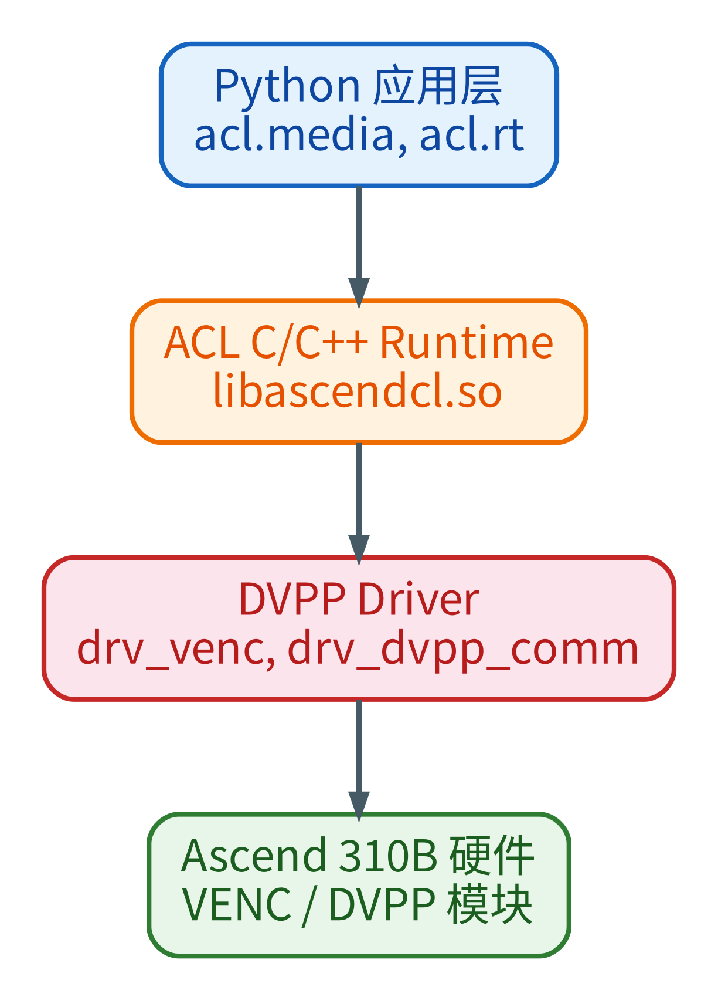
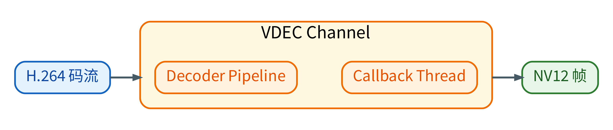

Ascend 310B 芯片内置了 **DVPP（Digital Vision Pre-Processing）** 硬件加速引擎，提供视频编解码（VENC/VDEC）、图像处理（VPC）和 JPEG 编解码能力。本章从基础概念出发，逐步深入到各子模块的 API 使用、性能调优和实战集成。

## DVPP 基础概念与编程模型 {#dvpp-basics}

DVPP（Digital Vision Pre-Processing）是 Ascend 芯片内部的一组**硬件加速模块**，专门处理图像和视频数据。它独立于 NPU 的 AI Core（推理引擎），不占用 AI 算力。PyACL 通过 `acl.media` 接口对外暴露这些能力。

> 本节覆盖所有 DVPP 子模块（VENC、VDEC、VPC、JPEGE、JPEGD）共享的基础概念。初次接触 DVPP 时，建议先阅读本节，再进入具体子模块的内容。

### DVPP 在芯片中的位置 {#src-book-chapter5-h1}

Ascend 310B4 可从应用开发视角理解为以下几类片上资源：

- **AI Core × 1**: DaVinci V300（矩阵运算，NPU 推理主力）
- **片上 CPU × 4**: 4 个 64 位 ARMv8-A 通用处理核。`npu-smi` 可按 AI CPU / control CPU / data CPU 查询和配置数量，默认配比为 `1:3:0`；这是启动配置，修改后需要复位生效，不是运行时动态划分
- **DVPP**: 独立视觉/媒体处理硬件单元（独立于 AI Core，也不是 CPU/AICPU 上的软件模块）
  - VENC: 视频编码
  - VDEC: 视频解码
  - VPC: 图像处理（resize/crop/csc）
  - JPEGE: JPEG 编码
  - JPEGD: JPEG 解码
- **设备内存与内部总线**: AI Core、DVPP 与片上 CPU 通过设备内存和内部总线交换数据

**关键要点**：DVPP 与 AI Core 是芯片上两个独立的硬件域。DVPP 编码 1080p 视频与 AI Core 执行 YOLO 推理可以并行运行，二者不竞争同一计算单元；CPU 侧主要负责内存、描述符和任务下发，不执行像素级编解码计算。

### DVPP 数据流 {#src-book-chapter5-h2}

DVPP 接收来自 **DDR 内存** 的数据，处理后写回 DDR。CPU 侧的工作是准备输入描述符、下发任务、等待回调或 Stream 同步完成——不参与实际像素级处理。

数据流五步：(1) CPU 侧分配设备内存并拷贝数据到设备 -> (2) DVPP 硬件通过内部总线读取 -> (3) 处理后将结果写入输出缓冲区 -> (4) DVPP 通过回调或 Stream 完成事件通知 CPU 侧 -> (5) CPU 侧按需从设备内存拷回结果。

**核心机制**：DVPP 直接访问 DDR，不经过 CPU 执行像素级处理。这是它能比 CPU 软件处理快得多的根本原因。

### 子模块概览 {#dvpp-modules}

| 模块 | 全称 | 功能 | 输入格式 | 输出格式 | 本教程章节 |
|------|------|------|---------|---------|------|
| **VENC** | Video Encoder | 视频编码 | NV12 原始帧 | H.264 / H.265 码流 | [VENC](#venc) |
| **VDEC** | Video Decoder | 视频解码 | H.264 / H.265 码流 | NV12 原始帧 | [VDEC](#vdec) |
| **VPC** | Video Pre-Processing Core | 图像处理 | NV12 / RGB / BGR | NV12 / RGB / BGR | [VPC](#vpc) |
| **JPEGE** | JPEG Encoder | JPEG 编码 | YUV420SP / YUV422SP | JPEG 码流 | [JPEG](#jpeg) |
| **JPEGD** | JPEG Decoder | JPEG 解码 | JPEG 码流 | YUV420SP / YUV444 | [JPEG](#jpeg) |

> **PNGD**（PNG 解码器）虽然列在 DVPP 规格中，但在 310B (CANN 8.3.RC1) 上实测输出缓冲区全零。310B 上 PNG 解码请使用 CPU 方案（Pillow / OpenCV）。本教程不含 PNGD 章节。

### AIPP vs DVPP（何时用哪个） {#src-book-chapter5-h3}

PyACL 的媒体处理分两类能力：

- **DVPP**：适合执行“低级别”的高吞吐预处理——JPEG/视频解码、YUV 与 RGB 转换、缩放、裁剪等。优点是速度快、CPU 负载低，但受格式与对齐约束。
- **AIPP**（Artificial Intelligence Pre-Processing）：适合执行“模型输入级”的精确预处理——统一色域/像素变换、量化/去均值、通道顺序等。AIPP 分静态（在模型转换时固化到 .om）与动态（运行时通过接口设置）两种模式。

**常见组合**：先用 DVPP 完成解码与粗略 resize/crop，再用 AIPP（静态或动态）做最后的色域和像素级处理，保证与模型输入要求一致。

### H.264 与 H.265 编解码基础 {#h264-h265-basics}

VENC 和 VDEC 都围绕 H.264/H.265 工作。理解这些编码标准的基本概念，是使用 DVPP 编解码模块的前提。

**什么是 H.264**

H.264（也叫 AVC）是目前全球使用最广泛的视频编码标准。核心思想是去除视频中的冗余：空间冗余通过帧内预测消除，时间冗余通过帧间预测消除，统计冗余通过熵编码消除。

编码后的每一帧按类型分为：

| 帧类型 | 全称 | 大小 | 依赖 | 说明 |
|--------|------|------|------|------|
| **I 帧** (IDR) | Instantaneous Decoder Refresh | 最大（~80KB@480p） | 无 | 独立解码，不依赖任何其他帧 |
| **P 帧** | Predictive | 中等（~5-15KB@480p） | 前一帧 | 只存与前一帧的差异 |
| **B 帧** | Bi-predictive | 最小（~2-5KB@480p） | 前后帧 | 双向预测，压缩率最高但延迟最大 |

> **B 帧与实时通信**：B 帧需要参考“未来”帧，引入额外延迟。WebRTC 和实时视频通话通常**禁用 B 帧**（`tune=zerolatency`），只用 I 帧和 P 帧。

**GOP（Group of Pictures）**：一个 I 帧到下一个 I 帧之间的帧组。GOP=30 表示每 30 帧插入一个 I 帧（30fps 下每秒一个关键帧）。IDR 帧必须从 IDR 帧开始才能正确解码。

**NAL 单元与 Annex-B 格式**：H.264 码流由 NAL 单元组成（SPS、PPS、IDR Slice、Non-IDR Slice、SEI）。Annex-B 格式用起始码 `0x00000001` 分隔每个 NAL 单元。VDEC 要求输入必须是 Annex-B 格式。

**什么是 H.265**

H.265（也叫 HEVC）是 H.264 的下一代标准，核心目标：**相同画质下码率减半**。

| 特性 | H.264 | H.265 |
|------|-------|-------|
| 编码块大小 | 16×16 宏块（固定） | 8×8 到 64×64 CTU（自适应） |
| 帧内预测方向 | 9 种 | 35 种 |
| 压缩率 | 基准 | **同画质下码率少 50%** |
| 编码复杂度 | 基准 | **约 2-5 倍** |
| 浏览器支持 | 100% | >95%（Firefox 不支持 WebRTC H.265） |

**为什么本章仍以 H.264 作为主线**：H.264 在 WebRTC 和教学演示里最稳定、最容易复现；同时，本章的 VENC/VDEC minimal 样例、基准脚本和 WebRTC 综合案例都补充了 H.265/HEVC 路径。对比来看：(1) CANN VENC/VDEC 对 H.264 和 H.265 的 API 基本一致，主要差别是 `entype`；(2) ARM 平台上 libx264 的测试码流更容易生成；(3) H.265 可作为同一套 DVPP API 的对照路径，用于理解两种编码的工程差异。

### ACL 初始化——四步必要步骤 {#acl-init}

任何使用 DVPP 的 Python 进程，都必须在开头执行这四个调用，顺序固定不可变：

```python
import acl

ret = acl.init()                    # (1) 初始化 ACL 运行时
ret = acl.rt.set_device(0)          # (2) 选择 NPU 设备 0
ctx, ret = acl.rt.create_context(0) # (3) 在设备上创建执行上下文
ret = acl.rt.set_context(ctx)       # (4) 将上下文绑定到当前线程
```

**为什么需要 context**：ACL 的 context（上下文）是**线程局部**的。每个需要调用 ACL API 的线程都必须绑定自己的 context。回调线程里必须再调一遍 `set_context(ctx)`——主线程的 context 不会自动传递到回调线程。

**多线程规则**：一个设备可以创建多个 context，但一个 context 同时只能绑定一个线程，一个线程同时只能绑定一个 context。同一个 context 可以在不同时间绑定到不同线程（但不能同时）。

### 通道模型 {#channel-model}

VENC 和 VDEC 都采用**通道（Channel）**模型。通道是 DVPP 硬件资源的抽象——创建一个通道就是向驱动申请一个硬件编码器/解码器实例。

通道创建遵循“描述符 -> 通道”两步模式：先创建通道描述符并设置参数，再调用 create_channel 申请硬件资源。描述符只是一组参数配置，create 时才真正向驱动申请资源。

**DVPP 内部有两种不同的通道模型**：

| | VENC / VDEC 专用通道 | VPC / JPEG 通用通道 |
|---|---|---|
| 创建 API | `venc_create_channel()` / `vdec_create_channel()` | `dvpp_create_channel()`（无需设置 mode） |
| 异步机制 | **回调线程**（`process_report` 轮询） | **Stream 同步**（`synchronize_stream` 阻塞） |
| 线程模型 | 需要独立回调线程 + Queue | 不需要额外线程 |
| 数据描述 | VENC: pic_desc->stream_desc，VDEC: stream_desc->pic_desc | pic_desc -> pic_desc（同类型） |

- **VENC/VDEC 回调式**：主线程发送帧后阻塞在 Queue.get()，回调线程通过 process_report 轮询硬件完成事件，触发回调后 Queue.put 唤醒主线程
- **VPC/JPEG Stream 式**：主线程下发异步任务后调用 synchronize_stream 阻塞等待，硬件完成时直接通知 Stream（无需回调线程）

**通道复用 vs 创建/销毁**：每次 `创建通道() -> 处理 N 帧 -> 销毁通道()` 的固定开销约 **5-10ms**。对于单帧编码场景，创建/销毁的开销远超编解码本身。最佳实践：创建一次通道，连续处理所有帧，最后销毁。

**通道数是有限的**：Ascend 310B4 的 VENC/VDEC 硬件实例数量有限（通常每种 1-2 个）。

### 回调线程模型 {#callback-thread-model}

DVPP 是**异步**的：发送工作请求后立即返回，结果通过**回调**在另一个线程中返回。

异步处理时序：(1) 主线程发送帧请求后立即返回 -> (2) 主线程阻塞在 `Queue.get()` 等待结果 -> (3) DVPP 硬件完成处理 -> (4) 回调线程收到事件 -> (5) 回调将结果 `Queue.put()` -> (6) 主线程被唤醒得到结果

**VENC vs VDEC 回调的关键差异**：

| | VENC 回调 | VDEC 回调 |
|---|---|---|
| 参数顺序 | `(输入_pic_desc, 输出_stream_desc)` | `(输入_stream_desc, 输出_pic_desc)` |
| 读取输出 | `获取码流大小/数据()` | `获取图片返回码()` + `获取图片数据/大小()` |
| 返回码检查 | 无 | **必须检查**，非 0 = 解码失败 |
| 销毁输入 | `销毁图片描述符(输入)` | `销毁码流描述符(输入)` |
| 销毁输出 | 不需要（调用方管理） | **`销毁图片描述符(输出)`** |

**记忆方法**：第一个参数总是“输入”，第二个总是“输出”。VENC 输入图片->输出码流；VDEC 输入码流->输出图片。

**为什么用 Queue 而不是 Event**：Queue 天然适合“生产者（回调线程）-> 消费者（主线程）”模式——支持缓冲（多帧排队）、阻塞等待（`Queue.get(timeout=5.0)`）、线程安全（无需额外锁）。

**为什么是 300ms**：`process_report(300ms)` 阻塞最多 300ms 等待 DVPP 硬件完成通知。太短（如 10ms）会高频 CPU 轮询，太长（如 5000ms）会导致销毁通道时等待过久。300ms 是平衡值。

### DVPP 内存管理 {#src-book-chapter5-h4}

DVPP 有两套内存系统，必须正确区分：

| 操作 | 分配位置 | 访问方式 | 用途 | 释放 |
|-----|---------|---------|------|------|
| `dvpp_malloc(大小)` | **设备端**（NPU 片内或 DDR） | 不能被 CPU 直接读写 | DVPP 硬件访问的输入/输出缓冲区 | `dvpp_free(ptr)` |
| `malloc_host(大小)` | **主机端**（系统 DDR） | CPU 可正常读写 | 回调中临时中转数据 | `free_host(ptr)` |

数据搬运方向：`memcpy(设备内存, 主机数据, 大小)` — 主机->设备（发送数据给 DVPP）；`memcpy(主机内存, 设备数据, 大小)` — 设备->主机（取回结果）。

**常见内存错误**：

| 错误 | 现象 | 原因 |
|------|------|------|
| 忘记 `dvpp_free` | 内存泄漏 -> 后续分配失败 | 每帧分配但未释放 |
| 忘记 `free_host` | 主机内存泄漏 | 回调中分配主机内存后未释放 |
| 在主机上直接读设备指针 | 段错误 / 无效数据 | 设备内存不能直接被 CPU 访问 |
| 回调中未销毁输入描述符 | 内存泄漏 | VENC pic_desc / VDEC stream_desc 必须由回调销毁 |

### 描述符模型 {#src-book-chapter5-h5}

DVPP 使用两种描述符来描述输入/输出数据：

- **pic_desc（图片描述符）**：描述一帧图像（NV12 / RGB 等），包含数据指针、大小、格式、宽高、stride。VDEC 专用字段：`ret_code`（0=解码成功，非0=失败）。
- **stream_desc（码流描述符）**：描述一段压缩码流（H.264 / H.265 / JPEG），包含数据指针和大小。

| 子模块 | 输入描述符 | 输出描述符 | 回调参数顺序 |
|--------|----------|----------|------------|
| VENC | pic_desc | stream_desc | `(input_pic_desc, output_stream_desc)` |
| VDEC | stream_desc | pic_desc | `(input_stream_desc, output_pic_desc)` |
| JPEGE | pic_desc | stream_desc | 同 VENC |
| JPEGD | stream_desc | pic_desc | 同 VDEC |

### NV12——DVPP 的通用货币 {#nv12-format}

NV12（也叫 YUV420SP）是 DVPP 所有图像相关模块的首选像素格式。

**为什么 NV12**：(1) 体积小——每像素 1.5 字节（RGB 是 3 字节），省 50% 内存和带宽；(2) 人眼匹配——利用人对亮度敏感、对色度不敏感的特性，降低色度分辨率；(3) 硬件原生——VENC/VDEC 硬件内部直接处理 NV12；(4) 摄像头兼容——大多数摄像头输出 YUV 格式，接近 NV12。

**内存布局**：NV12 缓冲区 = [Y 平面]（H×W，每像素 1 字节亮度）+ [UV 交错平面]（H/2 × W，每 2 字节一组 U,V）。总字节数 = H × W × 3/2。

**与其他 YUV 格式的区别**：

| 格式 | 全称 | 内存布局 | DVPP 支持 |
|------|------|---------|----------|
| **NV12** | YUV420SP | Y 平面 + UV 交错平面 | VENC / VDEC / VPC / JPEGE |
| NV21 | YVU420SP | Y 平面 + VU 交错平面 (U/V 顺序相反) | VDEC / VPC |
| I420 | YUV420P | Y 平面 + U 平面 + V 平面（3 个独立平面） | VPC (部分) |
| YUYV | YUV422 | YUYV 交错（每 2 像素共享 UV） | — (需 VPC 转换) |

**USB 摄像头输入 -> NV12 的路径**：大多数 USB 摄像头输出 YUYV 或 MJPG，不是 NV12。转换可选 CPU 路径（`cv2.cvtColor + bgr_to_nv12()`）或 VPC 路径（VPC CSC: YUYV->NV12，但 310B 不支持 CSC）。

### DVPP V1 与 himpi V2 — 两套 API 体系 {#src-book-chapter5-h6}

CANN 为 Ascend 310B 提供了两套不同的媒体处理 API：

| | DVPP V1 (`acl.media`) | himpi V2 (`acl.himpi`) |
|---|---|---|
| 全称 | Digital Vision Pre-Processing | Hi Media Processing Interface |
| 定位 | AscendCL 通用媒体处理 | 专用媒体处理（对标 HiMPP） |
| 通道模型 | VENC/VDEC 专用 + 通用 dvpp 通道 | 统一 `*_create_chn` |
| 310B Python 可用性 | **大部分可用** | **通道创建不可用** |

himpi 的 `*_create_chn` 函数需要传入 C 结构体（如 `hi_vpc_chn_attr`），Python 侧不支持创建这些结构体。

**选择指南**：在 310B 上处理媒体数据时：

- **VENC/VDEC 编解码** -> `acl.media.venc_*` / `vdec_*`（唯一选择）
- **VPC resize/crop** -> `acl.media.dvpp_vpc_*_async`
- **JPEG 编解码** -> `acl.media.dvpp_jpeg_*_async`
- **旋转/翻转/滤波/仿射** -> CPU (OpenCV)
- **310P/710 等新硬件** -> himpi V2

### 典型 DVPP 使用模式 {#src-book-chapter5-h7}

- **视频推理管道**：VDEC 解码 -> VPC YUV 格式调整与缩放 -> 若需 RGB 或额外预处理，再由 AIPP 完成 -> 传入模型
- **静态图片分类**：JPEGD 解码 -> VPC 缩放/裁剪 -> 如需色域/像素变换使用 AIPP -> 传入模型
- **全硬件转码**：VDEC（H.264->NV12）-> VPC（resize）-> VENC（NV12->H.264），设备内零拷贝

### 开发注意事项 {#src-book-chapter5-h8}

- DVPP 输出对分辨率与地址有对齐要求（stride/padding），读取数据时需依据描述信息处理
- 使用异步接口（`*_async`）时必须配合 Stream 与同步机制
- Host->Device 的异步拷贝源内存应使用页锁定（pinned）内存（`acl.rt.malloc_host`）
- 优先把耗时的像素级操作下沉到 DVPP/AIPP，避免在 CPU（Python）端逐像素处理
- 310B 上 `dvpp_vpc_convert_color_async`（CSC 色彩空间转换）不可用

---

## VENC — 硬件视频编码 {#venc}

> VENC（Video Encoder）将 NV12 原始帧编码为 H.264/H.265 码流。前置基础：[DVPP 基础概念](#dvpp-basics)。
>
> 文中所有完整可运行的代码在 [samples/chapter5/](https://github.com/zhouxzh/Ascend310/tree/master/samples/chapter5/) 目录下。

### 理论背景 {#src-book-chapter5-h9}

#### 为什么需要硬件编码 {#src-book-chapter5-h10}

H.264 视频编码是计算密集型任务。一块 640×480@30fps 的视频流，纯 CPU 软件编码（如 libx264）会占用 ARM Cortex-A55 的大量计算资源。对于 Orange Pi AI Pro 这样的嵌入式设备，CPU 资源有限，软件编码不仅影响视频质量（可能因算力不足而降低帧率），还挤占了其他任务的 CPU 时间。

昇腾 310B 芯片内部集成了 **VENC（Video Encoder）** 硬件模块，专用于 H.264/H.265 编码。硬件编码器具有：

- **固定功能电路**：编码路径完全硬化，功耗和延迟远低于通用 CPU
- **独立于 AI Core**：不占用 NPU 推理算力
- **实时性保证**：硬件 pipeline 确保编码在固定时间内完成

#### CANN / ACL 体系 {#src-book-chapter5-h11}

CANN（Compute Architecture for Neural Networks）是华为昇腾芯片的全栈软件栈，其层级结构如下：

{#fig:cann_acl_dvpp_stack width=40% .center}

- **ACL**（Ascend Computing Language）：CANN 的核心编程接口，提供设备管理、内存管理、媒体处理等 API
- **DVPP**（Digital Vision Pre-Processing）：数字视觉预处理模块，包含 VENC（编码）、VDEC（解码）、VPC（图像处理）、JPEG 编解码等
- **acl.media**：Python 侧对 DVPP 的封装

#### VENC 在 DVPP 中的位置 {#src-book-chapter5-h12}

DVPP 各子模块分工详见 [子模块概览](#dvpp-modules)。VENC 的职责：**NV12 原始帧 -> H.264/H.265 码流**。

VDEC 是它的镜像：H.264/H.265 码流 -> NV12。两者串联可形成全硬件转码管道。

#### NV12 格式 {#src-book-chapter5-h13}

VENC 的输入格式必须是 **NV12**（YUV420SP）。详见 [NV12 格式](#nv12-format)，这里只强调 VENC 的关键约束：

- **总大小**：H × W × 3/2 字节（对比 RGB 的 H × W × 3，节省 50%）
- **stride 对齐**：VENC 要求宽度对齐到 16，未对齐会导致编码画面偏移或绿条。对齐公式：`((width + 15) // 16) * 16`

#### 编码流程（端到端） {#src-book-chapter5-h14}

{#fig:venc_encode_flow width=100% .center}

---

### 环境与架构 {#src-book-chapter5-h15}

#### 硬件 {#src-book-chapter5-h16}

- **芯片**：Ascend 310B4（Orange Pi AI Pro）
- **VENC 模块**：支持 H.264 Baseline/Main/High，H.265 Main
- **驱动**：`drv_venc`, `drv_h264e`, `drv_h265e`（通过 `lsmod | grep venc` 验证）

#### 软件 {#src-book-chapter5-h17}

- **CANN 版本**：8.3.RC1
- **安装路径**：`/usr/local/Ascend/ascend-toolkit/8.3.RC1/`
- **Python API**：`/usr/local/Ascend/ascend-toolkit/latest/python/site-packages/acl/`
- **动态库**：`/usr/local/Ascend/ascend-toolkit/latest/aarch64-linux/lib64/`

#### 环境变量 {#src-book-chapter5-h18}

每次使用 CANN Python API 前必须设置：

```bash
export LD_LIBRARY_PATH="/usr/local/Ascend/ascend-toolkit/latest/aarch64-linux/lib64:/usr/local/Ascend/driver/lib64:$LD_LIBRARY_PATH"
export PYTHONPATH="/usr/local/Ascend/ascend-toolkit/latest/python/site-packages:$PYTHONPATH"
```

这两个变量分别解决了：

- `libascendcl.so: cannot open shared object file` — 动态库找不到
- `No module named 'acl'` — Python 包找不到

---

### VENC API 详解 {#src-book-chapter5-h19}

#### ACL 初始化 {#src-book-chapter5-h20}

4 步固定初始化详见 [ACL 初始化](#acl-init)，此处只给出 VENC 上下文的代码：

```python
import acl

ret = acl.init()                    # (1)
ret = acl.rt.set_device(0)          # (2)
ctx, ret = acl.rt.create_context(0) # (3)
ret = acl.rt.set_context(ctx)       # (4)
assert ret == 0
```

所有后续的 VENC API 调用都依赖这个上下文。

#### VENC 通道模型 {#src-book-chapter5-h21}

通道模型详见 [通道模型](#channel-model)，这里只列出 VENC 特有的 API：

{#fig:venc_channel_model width=75% .center}

| 函数 | 用途 |
|------|------|
| `venc_create_channel_desc()` | 创建通道描述符 |
| `venc_set_channel_desc_*()` | 设置通道参数（见下节） |
| `venc_create_channel(desc)` | 创建通道（返回 0 即成功） |
| `venc_send_frame(...)` | 发送一帧到编码器 |
| `venc_create_frame_config()` | 创建帧配置（控制 force I-frame 等） |
| `venc_destroy_channel(desc)` | 销毁通道 |
| `venc_destroy_channel_desc(desc)` | 销毁描述符 |

#### 通道参数详解 {#src-book-chapter5-h22}

创建 VENC 通道前，必须在描述符上设置编码类型、像素格式、分辨率、GOP、码率等参数。完整参数表及常用值见 [VENC 参数速查表](#venc-params)。

#### 回调机制 {#src-book-chapter5-h23}

回调线程模型详见 [回调线程模型](#callback-thread-model)。VENC 的回调特点：

- 参数顺序：**`(input_pic_desc, output_stream_desc)`** — 第一个是输入图片，第二个是输出码流
- 输入 `pic_desc` 必须由回调销毁（`dvpp_destroy_pic_desc`）
- 输出 `stream_desc` 的数据需在回调中通过 `malloc_host` + `memcpy` 拷到主机内存
- 通过 `queue.Queue` 将编码结果传回主线程，实现异步->同步转换

---

### 开发过程与常见问题与调试 {#src-book-chapter5-h24}

#### 问题 #1：Python 环境找不到 acl 模块 {#src-book-chapter5-h25}

**现象**：
```
ModuleNotFoundError: No module named 'acl'
```

**根因**：CANN 的 Python 包不在标准 `sys.path` 中。即使 `conda activate` 了正确的环境，CANN 的 site-packages 也不会自动加入搜索路径。

**修复**：

```bash
export PYTHONPATH="/usr/local/Ascend/ascend-toolkit/latest/python/site-packages:$PYTHONPATH"
```

**说明**：CANN 的 Python 路径是 `<toolkit>/python/site-packages`，**不是** `<toolkit>/aarch64-linux/python/site-packages`。`aarch64-linux/` 下只有动态库（`lib64/`），没有 Python 包。

> **是否在代码中修复？** 示例脚本遵循“环境变量在进程外设置”的原则，不内置 `sys.path` 操作代码。这样可以明确依赖来源，避免隐式修改 Python 搜索路径。

---

#### 问题 #2：libascendcl.so 找不到 {#src-book-chapter5-h26}

**现象**：
```
ImportError: libascendcl.so: cannot open shared object file: No such file or directory
```

**根因**：即使 `import acl` 成功（因为 Python 包路径正确），底层 C 扩展仍需要动态库。

**修复**：
```bash
export LD_LIBRARY_PATH="/usr/local/Ascend/ascend-toolkit/latest/aarch64-linux/lib64:/usr/local/Ascend/driver/lib64:$LD_LIBRARY_PATH"
```

---

#### 问题 #3：venc_create_channel 返回 507018 — bitrate 单位错误 {#src-book-chapter5-h27}

**现象**：
```
RuntimeError: venc_create_channel failed: 507018 (0x7bc8a)
dmesg: rc_drv_check_bit_rate bit rate set 2000000k error for out of [2k, 614400k]
```

**根因**：`max_bit_rate` 的单位是 **kbps**（千比特/秒），不是 bps（比特/秒）。

我传入了 `2_000_000`（2 Mbps 以 bps 表示），被 VENC 驱动解释为 2,000,000 kbps = 2 Gbps，远超上限 614,400 kbps。

**修复**：
```python
# 错误
media.venc_set_channel_desc_max_bit_rate(desc, 2_000_000)  # bps -> 超出范围

# 正确
media.venc_set_channel_desc_max_bit_rate(desc, 2_000)       # kbps = 2 Mbps
```

**dmesg 调试技巧**：VENC 错误信息会写入内核日志，`dmesg | grep -i venc` 是排查参数问题的第一手段。

---

#### 问题 #4：venc_create_channel 返回 507018 — GOP 为 0 {#src-book-chapter5-h28}

**现象**：
```
dmesg: rc_check_com_attr gop 0 err, should be in [1 65536]
dmesg: rc_create_chn check user rc attr err
```

**根因**：`key_frame_interval`（即 GOP — Group of Pictures）未设置，默认值为 0，不在合法范围 [1, 65536] 内。

GOP 控制多少个 P/B 帧之间插入一个 I 帧（关键帧）。GOP=30 意味着每 30 帧一个 I 帧，这在 30fps 下相当于每秒一个关键帧。GOP=0 对编码器没有意义（永远不产生 I 帧？），因此被拒绝。

**修复**：
```python
media.venc_set_channel_desc_key_frame_interval(desc, 30)  # GOP=30
```

---

#### 问题 #5：venc_set_channel_desc_channel_id 不存在 {#src-book-chapter5-h29}

**现象**：
```
AttributeError: module 'acl.media' has no attribute 'venc_set_channel_desc_channel_id'
```

**根因**：VDEC 有 `vdec_set_channel_desc_channel_id`，但 VENC 的 API 中**没有对应的 setter**。VENC 的 channel_id 由驱动自动分配，不能手动设置。

这暴露了 CANN API 的一个不对称设计：VDEC 和 VENC 虽然结构相似，但细节不同，不能简单类比。

---

#### 问题 #6：NumPy 维度索引错误 {#src-book-chapter5-h30}

**现象**：
```
ValueError: could not broadcast input array from shape (640,640) into shape (640,)
```

**根因**：NV12 数据是 2D 数组 `(H*3/2, W)`，但代码用 1D 线性偏移去索引：
```python
# 错误：nv12_data[src_off : src_off + w] 切出了形状 (w, w) 而非 (w,)
nv12_padded[off : off + w] = nv12_data[src_off : src_off + w]  # 2D -> 1D 广播失败
```

当 `src_off = row * w = 0` 时，`nv12_data[0:640]` 取到的是整个 Y plane 的前 640 行（即整个 640×640 区域），而不是第 0 行的 640 个像素。

**修复**：使用 2D 切片明确行列：
```python
nv12_padded_2d = np.zeros(stride * h * 3 // 2, dtype=np.uint8).reshape(-1, stride)
nv12_src_2d = nv12_data.reshape(-1, w)

# Y plane
for row in range(h):
    nv12_padded_2d[row, :w] = nv12_src_2d[row, :w]

# UV plane
for row in range(h // 2):
    nv12_padded_2d[h + row, :w] = nv12_src_2d[h + row, :w]

nv12_padded = nv12_padded_2d.ravel()
```

---

#### 问题 #7：stride 对齐 {#src-book-chapter5-h31}

VENC 要求输入帧的宽度**对齐到 16**（硬件约束）。NV12 数据填充时，Y plane 每行宽度应为 `aligned_width`（stride），UV plane 同理。

```python
self._align = 16
self._stride = ((width + self._align - 1) // self._align) * self._align
# 640 -> 640 (已对齐)，638 -> 640 (补齐)
```

不设置 stride 对齐会导致编码出的画面出现偏移或绿条。

---

#### 问题 #8：NPU Alarm 状态混淆 {#src-book-chapter5-h32}

**现象**：
```
npu-smi info: Health = Alarm
```

该状态容易被误认为 VENC 不可用。但实际测试表明 Alarm 不影响 VENC（参数正确就能创建成功）。`Alarm` 可能与其他传感器（温度、电源）有关，不一定反映 DVPP 模块状态。

**调试建议**：不要仅依据 NPU 全局状态判断模块可用性，应通过 `dmesg` 获取具体的模块级错误信息。

---

### 练习脚本 {#src-book-chapter5-h33}

三个可独立运行的脚本位于 [`samples/chapter5/`](https://github.com/zhouxzh/Ascend310/tree/master/samples/chapter5/)，建议按顺序阅读理解。

#### 概览 {#src-book-chapter5-h34}

| 文件 | 学习内容 | 运行时间 |
|------|----------|----------|
| `check_cann.py` | ACL 初始化的 4 个必要调用 | <1s |
| `venc_minimal.py` | 原始 VENC API：同一帧 NV12 分别编码为 H.264/H.265 | ~3s |
| `bench_venc.py` | `CannVenc` 封装类 + H.264/H.265 分辨率扫描对比 | ~20s |

> **实现方式**：本节示例直接使用 `acl.media.venc_*` API，不依赖额外封装库。

```bash
export LD_LIBRARY_PATH="/usr/local/Ascend/ascend-toolkit/latest/aarch64-linux/lib64:/usr/local/Ascend/driver/lib64:$LD_LIBRARY_PATH"
export PYTHONPATH="/usr/local/Ascend/ascend-toolkit/latest/python/site-packages:$PYTHONPATH"

python samples/chapter5/check_cann.py        # -> ACL init OK  soc=Ascend310B4
python samples/chapter5/venc/venc_minimal.py      # -> H.264/H.265 关键帧编码结果
python samples/chapter5/venc/bench_venc.py        # -> H.264/H.265 VENC vs CPU 帧率表
```

---

#### 走读：ACL 初始化 — [`check_cann.py`](https://github.com/zhouxzh/Ascend310/blob/master/samples/chapter5/check_cann.py) {#src-book-chapter5-h35}

```python
import acl

ret = acl.init()                    # (1) 初始化 ACL 运行时
ret = acl.rt.set_device(0)          # (2) 绑定设备 0
ctx, ret = acl.rt.create_context(0) # (3) 创建执行上下文
ret = acl.rt.set_context(ctx)       # (4) 绑定上下文到当前线程
```

这四个调用是**固定的**，顺序不能变。任何使用 CANN 的 Python 进程都需要它们。

#### 走读：最小编码 — [`venc_minimal.py`](https://github.com/zhouxzh/Ascend310/blob/master/samples/chapter5/venc/venc_minimal.py) {#src-book-chapter5-h36}

这是理解 VENC 的核心文件。脚本用同一帧确定性 NV12 输入，分别创建 H.264 Baseline 与 H.265 Main 通道并编码一帧。两个路径的 API 基本一致，主要差异是 `entype`：

```python
ENTYPE_H265_MAIN = 0
ENTYPE_H264_BASE = 1

CODECS = [
    ("H.264 Baseline", ENTYPE_H264_BASE, 2_000),
    ("H.265 Main", ENTYPE_H265_MAIN, 2_000),
]
```

代码分为 5 个阶段：

**(1) ACL 初始化** — 与 step1 相同。

**(2) 回调线程** — VENC 是异步的：
```python
cb_queue: queue.Queue = queue.Queue(maxsize=8)

def venc_callback(input_pic_desc, output_stream_desc, _user_data):
    size = media.dvpp_get_stream_desc_size(output_stream_desc)  # 读取编码后大小
    ptr  = media.dvpp_get_stream_desc_data(output_stream_desc)  # 读取数据指针
    host_buf = acl.rt.malloc_host(size)        # 分配主机内存
    acl.rt.memcpy(host_buf, size, ptr, size, ACL_MEMCPY_DEVICE_TO_HOST)
    cb_queue.put(ctypes.string_at(host_buf, size))  # 拷贝为 Python bytes
    acl.rt.free_host(host_buf)
    media.dvpp_destroy_pic_desc(input_pic_desc)     # 回调负责销毁输入

def callback_thread(_args):                  # 独立线程处理回调
    acl.rt.set_context(ctx)                  # 必须重新绑定上下文
    while running[0]:
        acl.rt.process_report(300)           # 300ms 轮询
```

**(3) 创建通道** — 按当前 codec 设置 `entype`、NV12 格式、分辨率、GOP、帧率和码率后调用 `venc_create_channel()`。H.264 Baseline 使用 `entype=1`，H.265 Main 使用 `entype=0`。

**(4) 发送一帧** — NumPy 生成紧凑 NV12 -> 宽度 padding 到 16 对齐 -> `dvpp_malloc` -> `venc_send_frame` -> `cb_queue.get()` 等待 H.264/H.265 码流结果。

**(5) 清理** — 销毁通道、描述符、帧配置，释放 DVPP 内存。

---

#### 走读：封装与基准 — [`bench_venc.py`](https://github.com/zhouxzh/Ascend310/blob/master/samples/chapter5/venc/bench_venc.py) {#src-book-chapter5-h37}

`bench_venc.py` 将原始 VENC API 封装为可复用的 `CannVenc` 类，然后做 **H.264/H.265 双分辨率扫描** 对比硬件 vs CPU 编码性能。整个文件 ~380 行，分为 6 个部分。

**(1) 测试参数**

```python
RESOLUTIONS = [
    (640, 480),
    (1280, 720),
    (1920, 1080),
    (2560, 1440),      # 2K
    (3840, 2160),      # 4K
]

TEST_FRAMES = 90            # 恰好 3 个 GOP（GOP=30 × 3）
TEST_GOP = 30                # 1 个 I + 29 个 P，模拟真实视频流
RANDOM_SEED = 42             # 固定种子 -> 结果可复现
WARMUP_FRAMES = 3
FPS = 30
```

- **90 帧**：3 个完整 GOP，每个 GOP 含 1 个 I 帧 + 29 个 P 帧，I 帧占比 3.3%，与真实视频流一致
- **固定种子 42**：同一种子下任何机器生成的测试帧内容相同，保证跨运行可复现
- **3 帧预热**：排除首次编码的驱动初始化开销（比旧版 10 帧更精简）

**(2) 确定性测试帧生成**

```python
def make_test_yuv420_frame(i: int, w: int, h: int) -> tuple[np.ndarray, np.ndarray, np.ndarray]:
```

直接生成 YUV420 平面，再按测试路径转换：VENC 路径拼成 NV12，CPU 路径拼成 yuv420p/I420。这样无需 BGR/RGB 转换，测量的是**纯编码性能**。每帧包含：

- **水平渐变** + **垂直渐变叠加**
- **正弦移动白条**：模拟时间相关性，防止编码器走 P 帧"全零残差"捷径
- **角落棋盘格**：8×8 方块交替，测试空间纹理编码

**(3) `CannVenc` 类详解**

将 `venc_minimal.py` 的原始 API 封装为可复用的同步接口。

**`__init__`** — 通道创建：与 `venc_minimal.py` 相同逻辑，额外计算 stride 对齐（`((w+15)//16)*16`）和输出缓冲区大小。

**`_venc_callback`** — 编码完成回调：从 `output_stream_desc` 读取编码数据 -> `malloc_host` -> `memcpy` 拷到主机内存 -> 放入 Queue。回调负责销毁输入的 `pic_desc`。

**`encode(nv12, force_keyframe)`** — 编码一帧：

```python
# (1) NV12 宽度补齐到 stride（16 对齐）—— VENC 硬件约束
padded = np.zeros(stride * h * 3 // 2, dtype=np.uint8).reshape(-1, stride)
src = nv12.reshape(-1, w)
for r in range(h):                 # Y 平面逐行拷贝
    padded[r, :w] = src[r, :w]
for r in range(h // 2):             # UV 平面逐行拷贝
    padded[h + r, :w] = src[h + r, :w]

# (2) 分配 DVPP 输入内存 + 拷贝 NV12 到设备
in_buf, _ = media.dvpp_malloc(padded.nbytes)
acl.rt.memcpy(in_buf, padded.nbytes, padded.ctypes.data, padded.nbytes,
              ACL_MEMCPY_HOST_TO_DEVICE)

# (3) 构造输入 pic_desc 和输出 stream_desc
pic = media.dvpp_create_pic_desc()
media.dvpp_set_pic_desc_data(pic, in_buf)
media.dvpp_set_pic_desc_format(pic, PIX_FMT_NV12)
media.dvpp_set_pic_desc_width_stride(pic, stride)    # ← 必须设置 stride
# ... 输出 out_buf + stream_desc ...

# (4) 可选强制 I 帧
if force_keyframe:
    media.venc_set_frame_config_force_i_frame(self._frame_cfg, True)

# (5) 排空回调队列（防止上一帧残留干扰）
while not self._cb_queue.empty():
    self._cb_queue.get_nowait()

# (6) 发送编码请求 + 等待回调
media.venc_send_frame(self._ch_desc, pic, sd, self._frame_cfg, None)
encoded = self._cb_queue.get(timeout=5.0)

# (7) 清理：释放 DVPP 内存、销毁 stream_desc、恢复 force I-frame 标志
```

**`destroy()`** — 先 `venc_destroy_channel` 再停回调线程，与 VDEC 的销毁顺序要求类似。

**(4) CPU 编码对比 — `bench_cpu_encode()`**

```python
def bench_cpu_encode(w: int, h: int, codec_name: str, bitrate_bps: int,
                     thread_count: int) -> tuple:
    level = "31" if w * h <= 1280 * 720 else "40"   # <=720p -> 3.1, >=1080p -> 4.0
    codec = av.CodecContext.create(codec_name, "w")
    codec.thread_count = thread_count                # 0=自动多线程，1=单线程
    codec.bit_rate = bitrate_bps                      # bps（注意与 VENC 的 kbps 区分）
    codec.options = {"level": level, "tune": "zerolatency"}
    if codec_name == "libx264":
        codec.profile = "Baseline"                    # H.264 与 VENC entype=1 对应
```

参数与 VENC 对齐：H.264 使用 Baseline profile、zerolatency tune、相同码率。最新脚本不再生成 BGR/RGB 测试帧，而是统一生成 YUV420 平面：VENC 路径拼成 NV12，CPU 路径拼成 yuv420p/I420 直接交给 PyAV，避免把颜色转换成本混入编码对比。

**(5) 主流程 — 分辨率扫描**

```python
for w, h in RESOLUTIONS:
    bitrate_kbps = max(2000, int(w * h * FPS * 0.1 / 1000))
    bitrate_bps = bitrate_kbps * 1000

    # VENC 测量
    venc = CannVenc(w, h, bitrate=bitrate_kbps, entype=entype)
    for i in range(WARMUP_FRAMES):                     # 预热
        y, u, v = make_test_yuv420_frame(i, w, h)
        venc.encode(yuv420_to_nv12(y, u, v), force_keyframe=(i == 0))
    t0 = time.perf_counter()
    for i in range(TEST_FRAMES):                        # 正式测量
        y, u, v = make_test_yuv420_frame(i, w, h)
        venc.encode(yuv420_to_nv12(y, u, v), force_keyframe=(i % TEST_GOP == 0))
    venc_fps = TEST_FRAMES / (time.perf_counter() - t0)

    # CPU 测量
    _, cpu_mt_fps, _ = bench_cpu_encode(w, h, cpu_codec_name, bitrate_bps, thread_count=0)
    _, cpu_st_fps, _ = bench_cpu_encode(w, h, cpu_codec_name, bitrate_bps, thread_count=1)
```

**码率自适应公式** `max(2000, w*h*fps*0.1/1000)` kbps：

- 480p：640×480×30×0.1/1000 = 921 -> **2000 kbps**（下限 2 Mbps）
- 720p：1280×720×30×0.1/1000 = 2764 -> **2764 kbps**
- 1080p：1920×1080×30×0.1/1000 = 6220 -> **6220 kbps**
- 4K：3840×2160×30×0.1/1000 = 24883 -> **24883 kbps**

含义：每像素每秒分配 0.1 bit，按分辨率等比缩放。

**(6) 本文件与 `venc_minimal.py` 的关系**

| | `venc_minimal.py` | `bench_venc.py` |
|---|---|---|
| 目的 | 教学——展示每个 API 调用 | 基准——评估性能 |
| 帧数 | 1 帧 | 90 帧 × 5 分辨率 |
| 封装 | 裸 API 直接调用 | `CannVenc` 类 |
| 对比 | 无 | 与 libx264/libx265 A/B 对比 |
| 内容 | 确定性 NV12 单帧 | 确定性 YUV420 序列（渐变+条+棋盘） |
| 输出 | H.264/H.265 关键帧大小 | H.264/H.265 双表格 |

---

### 集成到 aiortc {#src-book-chapter5-h38}

VENC 可集成到 aiortc（Python WebRTC 库）替代默认的 libx264 编码器。

#### 基本思路 {#src-book-chapter5-h39}

通过**猴子补丁**替换 aiortc 的 H.264 编码器：

```python
import aiortc.codecs.h264 as h264_module
h264_module.H264Encoder = YourCannEncoder
```

#### 继承策略 {#src-book-chapter5-h40}

推荐**继承** `H264Encoder`：只需覆盖 `_encode_frame()` 接入 VENC，其余 RTP 封装（RFC 6184 的 FU-A 分片、STAP-A 聚合等）全部继承。

`H264Encoder` (aiortc) 的继承结构——只需覆盖 `_encode_frame()` 接入 VENC，其余 RTP 封装全部继承：

- `_encode_frame()` -> libx264 编码 **[待覆盖]**
- `_packetize()` -> NAL -> RTP 分包 **[继承]**
- `_split_bitstream()` -> Annex-B -> NAL 分割 **[继承]**
- 其他全部继承

#### 回退机制 {#src-book-chapter5-h41}

CANN 不可用时自动回退到 libx264：

```python
class CannH264Encoder(H264Encoder):
    def _encode_frame(self, frame, force_keyframe):
        if not _CANN_READY:
            yield from super()._encode_frame(frame, force_keyframe)
            return
        try:
            # CANN VENC 编码...
        except RuntimeError:
            yield from super()._encode_frame(frame, force_keyframe)
```

---

### 性能对比与基准测试 {#src-book-chapter5-h42}

#### 实测数据：CANN VENC vs CPU 编码 {#src-book-chapter5-h43}

以下数据在 Orange Pi AI Pro（Ascend 310B4）上实测获得，使用 [`bench_venc.py`](https://github.com/zhouxzh/Ascend310/blob/master/samples/chapter5/venc/bench_venc.py) 脚本。该脚本同时覆盖 H.264 与 H.265，并分别测量 CPU 自动多线程（`thread_count=0`）和 CPU 单线程（`thread_count=1`）。

**测试条件**：GOP=30（I/P 混合），90 帧（3 个完整 GOP），确定性测试帧，固定种子 42。
码率按分辨率自动缩放：H.264 使用 `max(2M, w*h*fps*0.1)` bps，H.265 使用 0.7 倍目标码率。
测试帧统一生成为 YUV420 平面，VENC 路径转为 NV12，CPU 路径转为 yuv420p/I420，避免额外 BGR/RGB 颜色转换。

**H.264 Baseline**

```
分辨率          VENC帧率     CPU多线程     CPU单线程
────────────────────────────────────────────────────
640x480            166.4          86.6          46.5
1280x720            92.8          39.1          21.2
1920x1080           48.4          13.4           6.0
2560x1440           21.3          11.0           6.8
3840x2160           15.8           7.1           3.7
```

**H.265 Main**

```
分辨率          VENC帧率     CPU多线程     CPU单线程
────────────────────────────────────────────────────
640x480            165.1          31.1          22.9
1280x720            96.6          18.8          14.7
1920x1080           50.7           7.3           6.2
2560x1440           31.1           6.2           5.1
3840x2160           15.4           2.6           2.2
```

#### 结果解读 {#src-book-chapter5-h44}

**H.264 Baseline**

| 分辨率 | VENC fps | CPU 单线程 | CPU 多线程 | vs 单线程 | vs 多线程 |
|--------|----------|-------------|-------------|----------|----------|
| 640×480 | 166 | 47 | 87 | **3.58x** | **1.92x** |
| 1280×720 | 93 | 21 | 39 | **4.38x** | **2.37x** |
| 1920×1080 | 48 | 6 | 13 | **8.07x** | **3.61x** |
| 2560×1440 | 21 | 7 | 11 | **3.13x** | **1.94x** |
| 3840×2160 | 16 | 4 | 7 | **4.27x** | **2.23x** |

**H.265 Main**

| 分辨率 | VENC fps | CPU 单线程 | CPU 多线程 | vs 单线程 | vs 多线程 |
|--------|----------|-------------|-------------|----------|----------|
| 640×480 | 165 | 23 | 31 | **7.21x** | **5.31x** |
| 1280×720 | 97 | 15 | 19 | **6.57x** | **5.14x** |
| 1920×1080 | 51 | 6 | 7 | **8.18x** | **6.95x** |
| 2560×1440 | 31 | 5 | 6 | **6.10x** | **5.02x** |
| 3840×2160 | 15 | 2 | 3 | **7.00x** | **5.92x** |

**实时性观察**

- H.264：VENC 在 480p、720p、1080p 均超过 30fps；2K/4K 单路未达到 30fps，但仍明显快于 CPU。
- H.265：VENC 在 480p、720p、1080p、2K 均超过 30fps；4K 约 15fps，仍约为 CPU 多线程的 5.9 倍。
- CPU 多线程比单线程快，但在所有测试点都低于 VENC。H.265 软件编码尤其重，CPU 多线程在 1080p 仅约 7fps。

**与 VDEC 的对比**

VENC 和 VDEC 在 Ascend 310B4 上的表现模式不同：

| 对比维度 | VENC（编码） | VDEC（解码） |
|----------|------------|------------|
| H.264 <=1080p | **领先 CPU 多线程** | 落后 CPU |
| H.265 <=1080p | **大幅领先 CPU 多线程** | 720p 以上领先 CPU 多线程 |
| 4K 表现 | 仍快于 CPU，但单路低于 30fps | VDEC 约 72fps |
| 拐点 | 无 CPU 交叉拐点，所有点 VENC 更快 | H.264 解码约从 2K 开始领先单线程 CPU |
| 瓶颈 | 编码计算量大，硬件收益明显 | 解码计算量较小，Python 回调开销更显著 |
| 适合场景 | 实时推流、录制、转码输出 | 高分辨率/HEVC 解码、多路或零拷贝管道 |

**根因**：视频编码计算量大，H.264/H.265 软件编码很快把 ARM CPU 打满；VENC 把运动估计、变换、量化、熵编码等重计算交给硬件完成，因此全分辨率都领先 CPU。VDEC 的解码计算量小得多，Python 回调、队列和内存搬运的固定开销更容易成为瓶颈。

#### 什么场景下使用 VENC {#src-book-chapter5-h45}

**场景决策树**

需要实时视频编码（>30fps）？

- **是** — 取决于分辨率：
  - <=480p: CPU H.264 多线程可超过 30fps，但 VENC 更快且释放 CPU -> 建议 VENC
  - 720p/1080p: CPU 编码余量不足或不可用 -> 建议 VENC
  - 2K: H.264 VENC 约 21fps，H.265 VENC 约 31fps；需要结合目标帧率选择
  - 4K: 单路约 15fps，不满足 30fps；仍明显快于 CPU，适合低帧率录制或离线转码
- **否**（离线/批处理）-> CPU 可考虑，但 VENC 通常仍快 2×~7×，尤其 H.265 收益更大

**典型场景推荐**

| 场景 | 推荐方案 | 理由 |
|------|---------|------|
| **WebRTC 视频通话** | **VENC** | 480p/720p 实时编码 + CPU 留给推理 |
| **USB 摄像头监控** | **VENC** | 1080p@30fps CPU 跑不动，VENC 可超过实时 |
| **多路视频流 (>2 路)** | **VENC 必须** | CPU 单路 720p H.264 多线程约 39fps，多路余量不足 |
| **4K 录制** | **VENC** | 4K 单路约 15fps，适合低帧率录制；30fps 需进一步优化或降低分辨率 |
| **本地视频文件转码** | 均可 | 离线场景 CPU 也可，但 VENC 更快 |
| **AI 推理 + 视频边车** | **VENC** | CPU 编码会抢占 NPU 推理的 host 侧资源 |
| **低功耗设备** | **VENC** | 硬件编码功耗远低于 CPU 全速运行 |

**多路并发估算**

以 1080p@30fps 为目标帧率：

| 编码器 | 单路 fps | 最多支持路数 | CPU 剩余 |
|--------|---------|-------------|---------|
| CPU libx264 多线程 | 13 | **0 路**（不到 30） | 0% |
| **VENC H.264** | 48 | **1 路**（48/30） | 较高 |
| **VENC H.265** | 51 | **1 路**（51/30） | 较高 |

最新单路基准显示，1080p 下 VENC 约 48-51fps，单路 30fps 有余量，但还不足以稳定支撑 2 路 1080p@30fps。多路场景应结合实际码率、GOP、输入来源和端到端链路重新测量。

**什么情况下 CPU 编码就够了**

只有**离线批处理**且满足以下全部条件时，CPU 才有意义：

- 分辨率 <= 480p（CPU H.264 多线程约 87fps，CPU H.265 多线程约 31fps）
- 不需要实时输出（无帧率硬性要求）
- 无并发推理任务（CPU 全给编码用）
- 不想引入 CANN 依赖（如 Docker 环境未安装 CANN）

**底线**：从 720p 开始，CPU 编码余量快速下降；1080p 及以上的实时视频场景，尤其是在 Orange Pi 这样的嵌入式 ARM 设备上，优先使用 VENC。

#### 验证方法 {#src-book-chapter5-h46}

在 Orange Pi 上分别运行 CPU 和硬件编码服务器，用 `htop` 观察实时 CPU 占用差异：

```bash
# CPU 编码
python server.py --source usb_camera

# 硬件编码
python server.py --source usb_camera --hardware-encode
```

或直接跑基准测试：

```bash
export LD_LIBRARY_PATH="/usr/local/Ascend/ascend-toolkit/latest/aarch64-linux/lib64:/usr/local/Ascend/driver/lib64:$LD_LIBRARY_PATH"
export PYTHONPATH="/usr/local/Ascend/ascend-toolkit/latest/python/site-packages:$PYTHONPATH"
python samples/chapter5/venc/bench_venc.py
```

---

### VENC 调试与参数速查 {#src-book-chapter5-h47}

#### 常用调试命令 {#src-book-chapter5-h48}

```bash
# NPU 状态
npu-smi info
npu-smi info -t usages -i 0

# VENC 驱动状态
lsmod | grep venc

# VENC 内核日志（参数错误信息 —— 排查 507018 必用）
dmesg | grep -i venc | tail -10

# 环境验证（等价于 check_cann.py）
python samples/chapter5/check_cann.py

# 运行基准测试
python samples/chapter5/venc/bench_venc.py
```

#### 参数速查表 {#src-book-chapter5-h49}

#### VENC 通道参数 {#venc-params}

| 参数 | 函数 | 默认 | 推荐值 |
|------|------|------|--------|
| 编码类型 | `venc_set_channel_desc_entype` | — | 1 (H264) |
| 像素格式 | `venc_set_channel_desc_pic_format` | — | 1 (NV12) |
| 宽度 | `venc_set_channel_desc_pic_width` | — | 640 |
| 高度 | `venc_set_channel_desc_pic_height` | — | 480 |
| GOP | `venc_set_channel_desc_key_frame_interval` | 0 | 30 |
| 帧率 | `venc_set_channel_desc_src_rate` | — | 30 |
| 最大码率 (kbps) | `venc_set_channel_desc_max_bit_rate` | — | 2000 |
| 码率控制 | `venc_set_channel_desc_rc_mode` | — | 2 (CBR) |
| 回调线程 | `venc_set_channel_desc_thread_id` | — | tid |
| 回调函数 | `venc_set_channel_desc_callback` | — | cb |

**错误码**：0 = ACL_SUCCESS, 507018 = 参数错误（检查 dmesg）, 500001 = ACL_ERROR_FAILURE, 500004 = ACL_ERROR_DRV_FAILURE

**编码类型**：0 = H.265 Main, 1 = H.264 Baseline, 2 = H.264 Main, 3 = H.264 High

**像素格式**：1 = NV12 (YUV420SP), 12 = RGB888, 13 = BGR888

**码率控制**：1 = VBR (Variable Bitrate), 2 = CBR (Constant Bitrate)

---

## VDEC — 硬件视频解码 {#vdec}

> VDEC（Video Decoder）将 H.264/H.265 码流解码为 NV12 原始帧。前置基础：[DVPP 基础概念](#dvpp-basics)。

### VDEC 简介 {#src-book-chapter5-h50}

**VDEC**（Video Decoder）是 DVPP 中的硬件视频解码模块。它将 H.264/H.265 压缩码流解码为 NV12 原始帧。

{#fig:vdec_channel_model width=90% .center}

#### H.264 与 H.265 基础 {#src-book-chapter5-h51}

H.264/H.265 的帧类型（I/P/B）、GOP、NAL 单元、Annex-B 格式等编解码理论知识，详见 [H.264/H.265 基础](#h264-h265-basics)。本文的 VDEC API 示例和基准脚本都覆盖 **H.264 Baseline** 与 **H.265 Main**，便于直接对照两种 codec 的 `entype` 和码流差异。

VDEC 对输入码流只有一个硬性要求：必须是 **Annex-B 格式**（带 `0x00000001` 起始码的 NAL 单元序列）。H.264 首帧必须包含 SPS + PPS + IDR；H.265 首帧必须包含 VPS + SPS + PPS + IDR。

#### 典型应用场景 {#src-book-chapter5-h52}

| 场景 | 数据流 |
|------|--------|
| 视频文件回放 | MP4/MKV 文件 -> 解封装 -> H.264/H.265 码流 -> **VDEC** -> NV12 -> 显示 |
| 网络摄像机接收 | RTSP/WebRTC -> H.264/H.265 码流 -> **VDEC** -> NV12 -> 分析/显示 |
| 转码管道 | H.264/H.265 -> **VDEC** -> NV12 -> **VENC** -> 不同分辨率/码率的 H.264/H.265 |

#### 与 VENC 的对称关系 {#src-book-chapter5-h53}

详见 [子模块概览](#dvpp-modules)。

```
VENC: NV12 -> [硬件编码] -> H.264/H.265 码流
VDEC: H.264/H.265 码流 -> [硬件解码] -> NV12
```

#### 硬件能力规格（Ascend 310B4） {#src-book-chapter5-h54}

以下基于 CANN 8.3.RC1 + Ascend 310B4 实测和驱动常量定义。

**支持的编码类型**

| 编码格式 | Profile | `entype` 值 | 实测 |
|----------|---------|-------------|------|
| H.265 / HEVC | Main | `0` | 支持 |
| H.264 / AVC | Baseline | `1` | 支持 |
| H.264 / AVC | Main | `2` | 支持 |
| H.264 / AVC | High | `3` | 支持 |

> 实验中用 H.264 Baseline 码流测试了全部四种 `entype`，通道创建和 `send_frame` 均成功。
> 但**实际解码能否正确输出**取决于输入码流是否匹配所选的 `entype`。
> 例如：用 Baseline 码流 + `entype=H265_MAIN` 虽然不会报错，
> 但解码结果会是花屏或黑帧（编码标准不匹配）。

**支持的输出像素格式**

| 格式 | `out_pic_format` 值 | 位深 | 说明 |
|------|---------------------|------|------|
| YUV400 | 0 | 8 | 仅亮度 |
| **NV12** (YUV420SP) | **1** | 8 | 推荐使用 |
| NV21 (YVU420SP) | 2 | 8 | |
| NV12 4:2:2 | 3 | 8 | |
| NV21 4:2:2 | 4 | 8 | |
| NV12 4:4:4 | 5 | 8 | |
| NV21 4:4:4 | 6 | 8 | |
| RGB888 | 12 | 8 | |
| BGR888 | 13 | 8 | |

> 位深 10-bit 理论上支持（`vdec_set_channel_desc_bit_depth`），
> 但 310B4 驱动在 10-bit 下的实际表现未经充分验证。

**分辨率和帧率约束**

| 约束项 | 值 | 说明 |
|--------|-----|------|
| 最小分辨率 | 128×128 | 理论下限 |
| 最大分辨率 | 4096×4096 | 理论上限，受内存限制 |
| 宽度对齐 | 16 | VDEC 硬件要求 |
| 高度对齐 | 2 | VDEC 硬件要求 |
| 最大帧率 | 60 fps | 与分辨率有关 |
| 参考帧数 | 1-5（默认 5） | `ref_frame_num`，影响解码缓冲大小 |

> 实际可解码的最大分辨率受设备内存和码率限制。
> 310B4 配备 16GB 内存，单路 4K@30fps 解码无压力。

**输入码流约束**

| 约束项 | 说明 |
|--------|------|
| 码流格式 | H.264/H.265 Annex-B（带 0x00000001 起始码的 NAL 单元） |
| 参数集 | 同一通道上所有帧必须共享一致的参数集；H.264 为 SPS/PPS，H.265 为 VPS/SPS/PPS |
| 首帧要求 | H.264 必须包含 SPS + PPS + IDR；H.265 必须包含 VPS + SPS + PPS + IDR |
| 单次输入上限 | 取决于码流参数，超过约 256KB 可能被 VDEC 丢弃 |
| 帧边界 | 每次 `vdec_send_frame` 应发送完整的一帧（含所有 NAL 单元） |

**H.264 Level 与典型应用**

| Level | 最大宏块数 | 典型分辨率@帧率 | 最大码率 |
|-------|-----------|----------------|---------|
| 3.0 | 1620 | 720×480@30 | 10 Mbps |
| 3.1 | 3600 | 1280×720@30 | 14 Mbps |
| 4.0 | 8192 | 1920×1080@30, 2048×1024@30 | 20 Mbps |
| 4.1 | 8192 | 1920×1080@30, 2048×1024@30 | 50 Mbps |
| 4.2 | 8704 | 1920×1080@60 | 50 Mbps |
| 5.0 | 22080 | 2560×1920@30 | 135 Mbps |
| 5.1 | 36864 | 4096×2304@30 | 240 Mbps |

> 310B4 VDEC 理论上支持到 Level 5.1。
> 本章基准测试中，480p 使用 Level 3.1，1080p 使用 Level 4.0。

---

### VDEC 与 VENC 的关键区别 {#src-book-chapter5-h55}

VDEC 与 VENC 的关键区别如下表所示（同时参考 [子模块概览](#dvpp-modules) 获取完整的子模块间对比）：

| 特性 | VENC | VDEC |
|------|------|------|
| 数据方向 | NV12 -> H.264/H.265 | H.264/H.265 -> NV12 |
| `channel_id` | 驱动自动分配 | **必须显式设置** |
| `out_mode` | 无 | **必须检查和设置**（默认通常为 0） |
| `ref_frame_num` | 无 | 参考帧数量（默认 5） |
| `send_frame` 参数 | `(pic_desc, stream_desc)` | `(stream_desc, pic_desc)` |
| 回调中销毁对象 | 输入（pic_desc） | 输入（stream_desc）**和**输出（pic_desc） |
| 输入有效性要求 | 任意合法 NV12 均可 | 必须是**合法的完整 H.264/H.265 NAL 单元** |
| 输出 ret_code | 无 | 有，**必须检查**，非 0 表示解码失败 |
| `send_skipped_frame` | 无 | **有**，用于丢帧后通知解码器 |

---

### VDEC API 详解 {#src-book-chapter5-h56}

#### 通道参数 {#src-book-chapter5-h57}

VDEC 通道需设置通道 ID、编码类型、输出像素格式、分辨率、参考帧数等参数。与 VENC 不同，VDEC 的 `channel_id` 必须显式设置。完整参数表见 [VDEC 参数速查表](#vdec-params)。

#### 回调函数 {#src-book-chapter5-h58}

```python
def vdec_callback(input_stream_desc, output_pic_desc, user_data):
    """VDEC 解码完成回调——参数顺序与 VENC 相反。"""
    ret_code = acl.media.dvpp_get_pic_desc_ret_code(output_pic_desc)
    if ret_code != 0:
        # 解码失败——丢弃此帧
        pass
    else:
        pic_data = acl.media.dvpp_get_pic_desc_data(output_pic_desc)
        pic_size = acl.media.dvpp_get_pic_desc_size(output_pic_desc)
        # ... 拷贝 pic_data 到主机内存 ...

    # 回调负责销毁输入和输出描述符
    acl.media.dvpp_destroy_stream_desc(input_stream_desc)
    acl.media.dvpp_destroy_pic_desc(output_pic_desc)
```

与 VENC 的关键区别：

- 回调参数顺序相反：VDEC 是 `(stream_desc, pic_desc)`，VENC 是 `(pic_desc, stream_desc)`
- VDEC 必须检查 `pic_desc` 的 `ret_code`
- VDEC 回调需要销毁 **两个**描述符（VENC 只销毁输入）

#### ret_code 错误码 {#src-book-chapter5-h59}

| ret_code | 含义 |
|----------|------|
| 0 | 解码成功 |
| 非 0 | 解码失败——输入码流损坏、帧边界错误或参考帧不足 |

### 练习脚本走读 {#src-book-chapter5-h61}

完整代码见 [`samples/chapter5/vdec/vdec_minimal.py`](https://github.com/zhouxzh/Ascend310/blob/master/samples/chapter5/vdec/vdec_minimal.py)。程序使用原始 `acl.media` API 分为 5 个阶段：

#### (1) 生成测试码流 {#src-book-chapter5-h62}

VDEC 需要合法的 H.264/H.265 输入，不能使用随机字节。最小样例先用 NumPy 生成同一帧 I420/YUV420P 测试图，再分别交给 `libx264` 和 `libx265` 生成 H.264 Baseline 与 H.265 Main 码流：

```python
import av, fractions, numpy as np

ENTYPE_H265_MAIN = 0
ENTYPE_H264_BASE = 1

CODECS = [
    ("H.264 Baseline", "libx264", "31", ENTYPE_H264_BASE),
    ("H.265 Main", "libx265", "31", ENTYPE_H265_MAIN),
]

codec = av.CodecContext.create(ffmpeg_codec, "w")
codec.width, codec.height = 640, 480
codec.pix_fmt = "yuv420p"
# ... 设置 bit_rate, framerate, time_base, options ...
if ffmpeg_codec == "libx264":
    codec.profile = "Baseline"

frame = av.VideoFrame.from_ndarray(make_test_i420(640, 480), format="yuv420p")
stream = b"".join(bytes(pkt) for pkt in codec.encode(frame))
stream += b"".join(bytes(pkt) for pkt in codec.encode(None))
```

#### (2) 回调线程 {#src-book-chapter5-h63}

与 VENC 结构相同，但**回调参数顺序相反**，且必须检查 `ret_code`。

#### (3) 创建通道 {#src-book-chapter5-h64}

```python
desc = media.vdec_create_channel_desc()
media.vdec_set_channel_desc_channel_id(desc, 0)   # ← VDEC 必须设置！
media.vdec_set_channel_desc_thread_id(desc, tid)
media.vdec_set_channel_desc_callback(desc, vdec_callback)
media.vdec_set_channel_desc_entype(desc, entype)   # H.264=1, H.265=0
media.vdec_set_channel_desc_out_pic_format(desc, PIX_FMT_NV12)
media.vdec_set_channel_desc_out_pic_width(desc, W)
media.vdec_set_channel_desc_out_pic_height(desc, H)

ret = media.vdec_create_channel(desc)
```

#### (4) 发送一帧解码 {#src-book-chapter5-h65}

```python
# 输入：H.264/H.265 码流
arr = np.frombuffer(stream, dtype=np.uint8)
in_buf, _ = media.dvpp_malloc(len(arr))
acl.rt.memcpy(in_buf, len(arr), arr.ctypes.data,
              len(arr), ACL_MEMCPY_HOST_TO_DEVICE)

stream_desc = media.dvpp_create_stream_desc()
media.dvpp_set_stream_desc_data(stream_desc, in_buf)
media.dvpp_set_stream_desc_size(stream_desc, len(arr))

# 输出：NV12 图片
out_size = W * H * 3 // 2
out_buf, _ = media.dvpp_malloc(out_size)
pic_desc = media.dvpp_create_pic_desc()
media.dvpp_set_pic_desc_data(pic_desc, out_buf)
media.dvpp_set_pic_desc_size(pic_desc, out_size)
media.dvpp_set_pic_desc_format(pic_desc, PIX_FMT_NV12)

ret = media.vdec_send_frame(desc, stream_desc, pic_desc, frame_cfg, None)
```

#### (5) 清理 {#src-book-chapter5-h66}

与 VENC 相同——销毁通道、描述符、帧配置，释放 DVPP 内存。

---

#### 附：`encode_frames` 参数详解 {#src-book-chapter5-h67}

[`bench_vdec.py`](https://github.com/zhouxzh/Ascend310/blob/master/samples/chapter5/vdec/bench_vdec.py) 中用于生成测试码流的函数，接收原始帧 + 编码器名 + GOP -> 码流 + 统计。

```python
def encode_frames(frames: list[np.ndarray], codec_name: str, gop: int
                  ) -> tuple[list[bytes], int, int]:
    import av

    h, w = frames[0].shape[:2]
    level = "31" if w * h <= 1280 * 720 else "40"

    codec = av.CodecContext.create(codec_name, "w")    # (1)
    codec.width = w                                     # (2)
    codec.height = h
    codec.pix_fmt = "yuv420p"                           # (3)
    codec.bit_rate = max(2_000_000,                     # (4)
                         int(w * h * FPS * 0.1))
    codec.framerate = fractions.Fraction(FPS, 1)        # (5)
    codec.time_base = fractions.Fraction(1, FPS)        # (6)
    codec.options = {"level": level,                    # (7)
                     "tune": "zerolatency"}
    if codec_name == "libx265":
        codec.options["x265-params"] = "log-level=error"
    if codec_name == "libx264":
        codec.profile = "Baseline"                      # (8)

    for i, bgr in enumerate(frames):
        frame = av.VideoFrame.from_ndarray(
            bgr[..., ::-1], format="rgb24")             # (9)
        frame.pict_type = (                             # (10)
            av.video.frame.PictureType.I
            if i % gop == 0
            else av.video.frame.PictureType.P)
        data = bytearray()
        for pkt in codec.encode(frame):                 # (11)
            data += bytes(pkt)
        if data:
            streams.append(bytes(data))
    tail = bytearray()
    for pkt in codec.encode(None):                      # (12)
        tail += bytes(pkt)
    if tail:
        if streams:
            streams[-1] += bytes(tail)
        else:
            streams.append(bytes(tail))
    return streams, i_avg, p_avg
```

**(1) `av.CodecContext.create(codec_name, "w")`**
创建编码器实例。`codec_name = "libx264"` 或 `"libx265"`，`"w"` 表示编码模式。
libx264 是 H.264 标准的开源软件实现，运行在 CPU 上。
此处用它来**生成测试素材**——先软件编码再硬件解码，正好对应需要对比的两条路径。

**(2) `codec.width / codec.height`**
编码帧的尺寸（像素）。必须与实际输入的 numpy 数组尺寸一致。
VDEC 解码时需传入相同尺寸的 `out_pic_width/height`。

**(3) `codec.pix_fmt = "yuv420p"`**
编码器**内部**使用的像素格式。libx264 只接受 YUV 格式，
`"yuv420p"` 是 I420（YUV 4:2:0 planar）。PyAV 会自动将输入的 `rgb24` 帧
转为 `yuv420p` 后再送给编码器。

**(4) `codec.bit_rate = max(2_000_000, int(w * h * FPS * 0.1))`**
目标码率，单位 **bps**。
- `2_000_000` = 2 Mbps，是最低可用码率，确保小分辨率不会码率过低。
- `w * h * FPS * 0.1` = 每像素每秒 0.1 bps，按分辨率和帧率缩放。
  例如 640×480×30×0.1 ~ 0.9 Mbps -> 取 2 Mbps；3840×2160×30×0.1 ~ 25 Mbps。
- `max(...)` 设置 2 Mbps 码率下限。

码率影响帧大小：码率越高字节越多，但硬件解码速度主要和像素数相关，受码率影响很小。

**(5) `codec.framerate`**
目标帧率（fps）。设为 30 表示编码器按 30fps 场景分配比特预算。
不改变实际编码速度，只影响码率控制算法。

**(6) `codec.time_base`**
时间基准，帧率的倒数。`Fraction(1, 30)` 表示每帧间隔 1/30 秒。
影响编码后 Packet 的 `pts`/`dts` 时间戳。

**(7) `codec.options`**
传递给 libx264 编码器的底层选项：

- `"level"`：H.264 Level。<=720p 用 Level 3.1，>=1080p 用 Level 4.0。
  编码的码流中会嵌入 Level 标志，VDEC 据此分配解码缓冲区。
- `"tune": "zerolatency"`：低延迟调优。**禁用 B 帧**，编码器每收到一帧立即输出，
  不做多帧缓冲。实时通信必须开启，代价是牺牲约 10-15% 压缩率。

H.265 路径也使用 `zerolatency`，并通过 `x265-params=log-level=error` 关闭 x265 的信息日志。

**(8) `codec.profile = "Baseline"`**
H.264 **档次**。三个常用档次：

- **Baseline**：最简，无 B 帧，适合实时通信和低功耗设备。
- **Main**：比 Baseline 多 B 帧，压缩率高 10-15%，适合广播电视。
- **High**：在 Main 基础上增加 8×8 变换和量化矩阵，适合高清蓝光。

Baseline 是 WebRTC 强制要求的最低档次，且 VDEC `entype=1` 正好对应 Baseline。
注意：libx265 没有 `profile` 属性（H.265 的 profile 通过 options 设置），所以加了 `if` 判断。

**(9) `av.VideoFrame.from_ndarray(bgr[..., ::-1], format="rgb24")`**
将 numpy BGR 数组转为 PyAV `VideoFrame` 对象。
`bgr[..., ::-1]` 把通道反转：`BGR -> RGB`。

**(10) `frame.pict_type = I if i % gop == 0 else P`**
按 GOP 间隔设置帧类型。GOP=30 时，帧 0、30、60… 为 I 帧，其余为 P 帧。
这是模拟真实视频流的关键——97% 的帧是 P 帧，3% 是 I 帧。
与旧版全 I 帧（GOP=1）相比，I 帧体积从 ~80KB 降至 ~25KB（480p），因为码率预算被 P 帧摊薄。

**(11) `codec.encode(frame)`**
将一帧送入编码器，返回编码后的 `Packet` 列表。每个 Packet 包含
一个或多个 NAL 单元（SPS/PPS/SEI/IDR Slice 等）。

基准脚本会过滤空 packet，并按实际可用 packet 数量做 warmup 和计时；这也是 H.265 现在能正常出表的原因。

**(12) `codec.encode(None)`**
**排空编码器缓冲区**。传入 `None` 强制输出所有剩余数据。
排空后的尾 NAL 追加到最后一帧的码流末尾。

---

#### I 帧数量与解码性能 {#iframe-performance}

**基准测试中的 I 帧数量**

每 30 帧一个 I 帧。`bench_vdec.py` 使用 `TEST_GOP = 30`，90 帧测试中只有
**3 个 I 帧**（帧 0、30、60），其余 87 帧是 P 帧。这是模拟真实视频流的配置。

```
基准测试码流（GOP=30）：
  [IDR] [P] [P] ... [P] [IDR] [P] [P] ... [P] [IDR] [P] ...
   ↑ ~25KB@480p     ↑ ~7KB                     I 帧数 = 3/90 ~ 3%

全 I 帧码流（GOP=1，仅供参考）：
  [IDR] [IDR] [IDR] ... [IDR]   ← 所有帧都是关键帧
   ↑ ~80KB@480p 完全相同的大小
```

**为什么用 GOP=30 而不是全 I 帧**

1. **真实视频流就是这样的**：WebRTC、RTSP、监控摄像头通常使用 GOP=15~60。
   GOP=30 表示每秒一个关键帧（30fps 下），是实时通信的典型配置。

2. **避免误判 VDEC 性能**：全 I 帧测试中每帧都 ~80KB（480p），VDEC 的硬件并行优势被放大。
   而真实流中 97% 的帧是小 P 帧（~7KB），CPU 处理 P 帧极快（只需解运动矢量 + 残差），
   VDEC 的固定调度开销反而成了瓶颈。

3. **全 I 帧曾导致错误结论**：本教程早期版本用 GOP=1 测得 VDEC 在 720p 领先 CPU 10%、
   1080p 领先 43%。切换到 GOP=30 后，H.264 VDEC 在 <=1080p 全面落后于 CPU。
   **全 I 帧测试的不是真实场景，测试结果不可用于工程决策。**

**I 帧比例对性能的颠覆性影响**

| 测试模式 | 480p VDEC | 480p CPU | 1080p VDEC | 1080p CPU | 拐点 |
|----------|----------|---------|-----------|---------|------|
| GOP=1（全 I 帧） | 240 fps | 410 fps | 97 fps | 68 fps | **720p** |
| **GOP=30（I/P 混合）** | **17 fps** | **1349 fps** | **17 fps** | **307 fps** | **2K** |

**GOP 的影响是巨大的**：

- VDEC 在全 I 帧模式下 480p 跑 240fps，混合流下掉到 17fps（**14× 差距**）
- 原因：全 I 帧模式下每帧数据量大（~80KB），连续发送大包让 VDEC 硬件始终处于忙碌状态，调度开销被隐藏
- 混合流下每帧只有 ~8KB（P 帧），VDEC 处理太快反而暴露了 Python 回调调度的固定瓶颈

**帧类型与性能特性**

| 帧类型 | 每帧大小 (480p) | 解码方式 | VDEC 表现 | CPU 表现 |
|--------|---------------|---------|----------|---------|
| I 帧 (IDR) | ~25 KB (GOP=30) | 帧内解码（完整） | 硬件并行优势 | 需完整逆变换 |
| P 帧 | ~7 KB | 帧间解码（运动矢量 + 残差） | **固定开销主导** | 极快（数据量小） |

在 GOP=30 混合流中，P 帧占 97%。P 帧数据量仅为 I 帧的 ~30%，
CPU 解码 P 帧的开销远低于 I 帧（只需解残差），而 VDEC 每帧仍需经过完整的
`memcpy -> send -> callback -> memcpy -> Queue` 路径，这部分时间与帧大小关系不大。

**如何切换测试模式**

修改 `bench_vdec.py` 顶部的常量即可：

```python
# 当前（GOP=30，I/P 混合——真实视频流）
TEST_GOP = 30

# 改为（GOP=1，全 I 帧——最坏情况/最大吞吐测试）
TEST_GOP = 1
```

`encode_frames()` 会根据 `gop` 参数自动设置每帧的 `pict_type`：
`i % gop == 0` 时为 I 帧，否则为 P 帧。

---

### 常见问题与调试 {#src-book-chapter5-h68}

#### 问题 #1：`channel_id` 未设置导致通道创建失败 {#src-book-chapter5-h69}

**现象**：
```
vdec_create_channel failed: 507018
```

**根因**：VDEC 与 VENC 不同，**不会**自动分配 `channel_id`。必须显式调用 `vdec_set_channel_desc_channel_id(desc, N)`。

**修复**：
```python
media.vdec_set_channel_desc_channel_id(desc, 0)
```

---

#### 问题 #2：回调参数顺序与 VENC 相反 {#src-book-chapter5-h70}

**现象**：在回调中调用 `dvpp_get_pic_desc_ret_code` 时进程异常终止或返回无效数据。

**根因**：VENC 回调是 `(input_pic_desc, output_stream_desc)`，VDEC 回调是 `(input_stream_desc, output_pic_desc)`。如果按 VENC 习惯写 VDEC 回调，会把 stream_desc 当成 pic_desc 来读。

**记忆方法**：**第一个参数总是"输入"，第二个参数总是"输出"**。VENC 输入是图片、输出是码流；VDEC 输入是码流、输出是图片。

---

#### 问题 #3：未检查 `ret_code` 导致使用损坏帧 {#src-book-chapter5-h71}

**现象**：解码后的 NV12 数据是花屏或全黑。

**根因**：`dvpp_get_pic_desc_ret_code()` 返回非 0 表示解码失败——可能是输入码流不完整、帧边界不对、参考帧丢失。直接使用失败帧的数据会得到损坏画面。

**修复**：
```python
ret_code = media.dvpp_get_pic_desc_ret_code(pic_desc)
if ret_code != 0:
    cb_queue.put(None)  # 跳过此帧
    return
```

---

#### 问题 #4：回调未销毁输出 pic_desc 导致内存泄漏 {#src-book-chapter5-h72}

**现象**：解码多帧后，`dvpp_malloc` 返回内存不足。

**根因**：VDEC 回调负责销毁**两个**描述符（输入 stream_desc 和输出 pic_desc）。VENC 只需要销毁输入，因为输出的 stream_desc 由调用方管理。如果只销毁了 stream_desc，pic_desc 及其关联的 DVPP 内存永远不会释放。

**修复**：回调 `finally` 块中同时销毁两个：
```python
finally:
    media.dvpp_destroy_stream_desc(input_stream_desc)
    media.dvpp_destroy_pic_desc(output_pic_desc)
```

---

#### 问题 #5：输入必须用 numpy 包装才能 memcpy {#src-book-chapter5-h73}

**现象**：
```
TypeError: acl.rt.memcpy args parse failed
```

**根因**：`acl.rt.memcpy` 的源地址参数不接受 Python `bytes` 对象。必须将其包装为 numpy 数组或 ctypes 指针。

**修复**：
```python
# 错误
h264 = b"..."
acl.rt.memcpy(in_buf, len(h264), h264, len(h264), 1)  # TypeError

# 正确
h264_arr = np.frombuffer(h264, dtype=np.uint8)
acl.rt.memcpy(in_buf, len(h264), h264_arr.ctypes.data, len(h264), 1)
```

---

#### 问题 #6：`vdec_destroy_channel` 顺序错误导致阻塞 {#src-book-chapter5-h74}

**现象**：解码多帧后，`media.vdec_destroy_channel(desc)` 永远阻塞，程序卡死。

**根因**：VDEC 通道销毁时，回调线程必须在 `vdec_destroy_channel` 调用期间保持运行——驱动需要在销毁过程中通过回调发送最后的清理通知。如果先停止了回调线程，`vdec_destroy_channel` 会无限等待一个永远不会来的回调。

VDEC 的正确销毁顺序与直觉相反：

```python
# 错误：先停线程再销毁通道 -> 永远阻塞
running[0] = False                      # 通知线程停止
media.vdec_destroy_frame_config(fcfg)    # 销毁帧配置
media.vdec_destroy_channel(desc)         # 销毁通道 -> 等待回调 -> 永远阻塞！

# 正确：先销毁通道（需要线程活着），再停线程
media.vdec_destroy_channel(desc)         # (1) 先销毁通道（此时线程必须活着）
running[0] = False                      # (2) 通知线程停止
acl.util.stop_thread(tid)               # (3) 停止回调线程
media.vdec_destroy_frame_config(fcfg)    # (4) 最后销毁帧配置
media.vdec_destroy_channel_desc(desc)    # (5) 销毁描述符
```

这一步的关键点是销毁通道时回调线程必须仍在运行，否则驱动侧的清理事件无法被处理。

---

#### 问题 #7：VDEC 通道复用对码流连续性非常敏感 {#src-book-chapter5-h75}

**现象**：通道创建后第一帧解码正常，第二帧 `vdec_send_frame` 返回 0 但回调永不触发。

**根因**：VDEC 期望同一通道上解码的帧来自**同一个编码器实例**，并且按连续视频流顺序送入。也就是所有帧需要共享兼容的 SPS/PPS（序列参数集/图像参数集），不能把多个互不相关的 IDR 样本直接拼到同一通道里混跑。

**验证方法**：用单个 libx264 `CodecContext` 连续编码所有测试帧，确保 SPS/PPS 一致，并按同一序列顺序逐帧送入。`samples/chapter5/vdec/bench_vdec.py` 已新增“单通道复用”路径，并自动尝试不同 `pipeline_depth` 与 `frame_config` 策略；在当前 310B 环境下，只有带显式 `EOS` 的 `depth=4` 变体能够稳定排空尾部缓存帧。

**当前结论**：Ascend 310B4 上不能假设“任意 H.264 样本都能安全复用同一通道”。应先用连续码流验证复用模式，并显式处理解码器尾部 flush；如果复用路径不稳定，再退回每帧独立通道作为兜底方案。独立通道虽然可靠，但固定创建/销毁开销在 640×480 下通常远高于纯 CPU 解码。

---

### 性能实测 {#src-book-chapter5-h76}

在 Orange Pi AI Pro（Ascend 310B4）上，使用 [`bench_vdec.py`](https://github.com/zhouxzh/Ascend310/blob/master/samples/chapter5/vdec/bench_vdec.py) 进行 H.264/H.265 分辨率扫描。
测试参数：GOP=30（I/P 混合，模拟真实视频流），90 帧（3 个完整 GOP），固定种子可复现。
CPU 解码对比单线程（`thread_count=1`）和多线程（`thread_count=0`，自动使用所有核心）两种模式。
脚本生成 H.265 测试码流时使用 `libx265`，并过滤编码器可能返回的空 packet，避免 CPU HEVC 解码路径把空 packet 当作 EOF。
当前脚本输出已简化为帧率表：不再打印加速比、单帧耗时、优胜结论和码流大小。

**H.264 Baseline**

```
分辨率          VDEC帧率     CPU多线程     CPU单线程
────────────────────────────────────────────────────
640x480             16.9        1485.9         612.0
1280x720            16.8         684.6         272.2
1920x1080           16.5         305.5         119.8
2560x1440          133.6         189.1          75.9
3840x2160           71.2          88.5          35.1
```

**H.265 Main**

```
分辨率          VDEC帧率     CPU多线程     CPU单线程
────────────────────────────────────────────────────
640x480            275.4         324.9         185.6
1280x720           250.2         182.2          97.7
1920x1080          194.6          82.5          42.3
2560x1440          135.3          46.6          23.4
3840x2160           71.7          21.2           9.9
```

#### VDEC 单帧耗时（由帧率反推） {#src-book-chapter5-h77}

简化后的 `bench_vdec.py` 只打印帧率，不再打印耗时分解。若按 `1000 / fps` 反推，H.264 低分辨率路径仍能看到明显的固定开销：

| 编码 | 640×480 | 1280×720 | 1920×1080 | 2560×1440 | 3840×2160 |
|------|---------|----------|-----------|-----------|-----------|
| H.264 VDEC | 59.2ms | 59.5ms | 60.6ms | 7.5ms | 14.0ms |
| H.265 VDEC | 3.6ms | 4.0ms | 5.1ms | 7.4ms | 13.9ms |

> **关键结论**：H.264 <=1080p 时，VDEC 路径稳定在约 60ms/帧，说明瓶颈主要不是像素计算量。
> 当前 Python 基准路径每帧都经过 DVPP 内存分配、回调线程、Queue 等同步环节，这些固定开销在小分辨率下很难被硬件解码收益摊薄。
> 
> 2K 以上分辨率时，H.264 VDEC 吞吐明显回升；H.265 路径则从 480p 起就没有出现同样的 60ms 固定开销。

#### 拐点分析 {#src-book-chapter5-h78}

**H.264 Baseline**

| 分辨率 | VDEC fps | CPU 单线程 | CPU 多线程 | vs 单线程 | vs 多线程 |
|--------|----------|-------------|-------------|----------|----------|
| 640×480 | 17 | 612 | 1486 | 0.03x | 0.01x |
| 1280×720 | 17 | 272 | 685 | 0.06x | 0.02x |
| 1920×1080 | 17 | 120 | 306 | 0.14x | 0.05x |
| 2560×1440 | 134 | 76 | 189 | **1.76x** | 0.71x |
| 3840×2160 | 71 | 35 | 89 | **2.03x** | 0.80x |

**H.265 Main**

| 分辨率 | VDEC fps | CPU 单线程 | CPU 多线程 | vs 单线程 | vs 多线程 |
|--------|----------|-------------|-------------|----------|----------|
| 640×480 | 275 | 186 | 325 | **1.48x** | 0.85x |
| 1280×720 | 250 | 98 | 182 | **2.56x** | **1.37x** |
| 1920×1080 | 195 | 42 | 83 | **4.60x** | **2.36x** |
| 2560×1440 | 135 | 23 | 47 | **5.78x** | **2.90x** |
| 3840×2160 | 72 | 10 | 21 | **7.24x** | **3.38x** |

H.264 路径下，VDEC 在 <=1080p 完全不具备竞争力（仅为 CPU 单线程的 3%~14%）。
真正的单线程交叉点在 **2K（2560×1440）**：2K 时 VDEC 比单线程 CPU 快 76%，4K 时快 103%。
但在这个单路测试中，CPU 多线程在 H.264 全部分辨率上仍快于 VDEC。

H.265 路径不同：VDEC 在 480p 已经领先单线程 CPU，在 720p 以上同时领先单线程和多线程 CPU。HEVC 软件解码在 ARM CPU 上明显更重，因此 VDEC 的收益比 H.264 更早出现。

#### 关键发现 {#src-book-chapter5-h79}

1. **H.264 低分辨率 VDEC 有固定调度开销**——480p/720p/1080p 下 VDEC 都是 ~59ms/帧，与分辨率无关。
   这说明瓶颈不在硬件解码，而在 Python 回调->队列->主线程的调度路径。

2. **H.264 高分辨率开始领先单线程 CPU**——2K 以上分辨率，固定调度开销被摊薄，
   VDEC 开始领先单线程 CPU。2K 时领先 1.76×，4K 时领先 2.03×；但单路场景下仍慢于 CPU 多线程。

3. **H.265 是 VDEC 的优势路径**——720p 以上 H.265 VDEC 同时领先单线程和多线程 CPU，4K 时对多线程 CPU 也有 3.38× 加速。

4. **I/P 混合流比全 I 帧流更不利于 H.264 VDEC**——详见上文 [I 帧数量与解码性能](#iframe-performance) 的对比分析。全 I 帧测试曾误导结论，GOP=30 才是真实场景。

5. **零拷贝管道可减少主机侧开销**——当前基准实现每次解码都经过设备内存分配、D2H `memcpy` 和 Python Queue。
   如果 VDEC 输出直接喂给 VENC（设备内存零拷贝），可以避免把 NV12 帧拷回主机再送回设备。

#### 适用场景速查 {#src-book-chapter5-h80}

| 分辨率 | 单路实时 | 多路并发（>=4 路） | 转码管道 |
|--------|---------|-----------------|---------|
| H.264 <= 1080p | CPU 推荐 | CPU 可选 | CPU 推荐 |
| H.264 2K/4K | CPU 多线程优先，CPU 资源紧张时可选 VDEC | VDEC 可选 | VDEC 可选 |
| H.265 480p | CPU 多线程优先，VDEC 可选 | CPU 可选 | VDEC 可选 |
| H.265 >= 720p | **VDEC 推荐** | **VDEC 推荐** | **VDEC 推荐** |

---

### VDEC 调试与参数速查 {#src-book-chapter5-h81}

#### 常用调试命令 {#src-book-chapter5-h82}

```bash
# VDEC 驱动状态
lsmod | grep vdec

# VDEC 内核日志
dmesg | grep -i vdec | tail -10

# 运行练习脚本
python samples/chapter5/vdec/vdec_minimal.py
```

#### 参数速查表 {#src-book-chapter5-h83}

#### VDEC 通道参数 {#vdec-params}

| 参数 | 函数 | 示例 |
|------|------|------|
| 通道 ID | `vdec_set_channel_desc_channel_id` | 0 |
| 编码类型 | `vdec_set_channel_desc_entype` | 1 |
| 输出像素格式 | `vdec_set_channel_desc_out_pic_format` | 1 |
| 输出宽度 | `vdec_set_channel_desc_out_pic_width` | 640 |
| 输出高度 | `vdec_set_channel_desc_out_pic_height` | 480 |
| 输出模式 | `vdec_set_channel_desc_out_mode` | 0 |
| 参考帧数 | `vdec_set_channel_desc_ref_frame_num` | 5 |
| 位深 | `vdec_set_channel_desc_bit_depth` | 8 |

**编码类型**：0 = H.265 Main, 1 = H.264 Baseline, 2 = H.264 Main, 3 = H.264 High

---

## VPC — 硬件图像处理 {#vpc}

> VPC（Video Pre-Processing Core）提供硬件加速的缩放、裁剪、色彩空间转换。前置基础：[DVPP 基础概念](#dvpp-basics)。

### VPC 简介 {#src-book-chapter5-h84}

**VPC**（Video Pre-Processing Core）是 DVPP 中的硬件图像处理模块。它提供三大功能：

| 功能 | 说明 | 典型场景 |
|------|------|---------|
| **Resize** | 图像缩放（多种插值算法） | 1080p -> 720p 下采样 |
| **Crop** | 按指定区域裁剪 | 从画面中提取 ROI 区域 |
| **CSC** | 色彩空间转换 | YUYV->NV12、NV12->RGB 等 |

VPC 在 DVPP 管道中的典型位置：

```
USB Camera YUYV -> [VPC CSC] -> NV12 -> [VENC] -> H.264 -> WebRTC
                        ↑                  ↑
                   硬件色彩转换          硬件编码
                   (零CPU占用)          (零CPU占用)
```

#### 为什么用 VPC 而不是 OpenCV {#src-book-chapter5-h85}

在 Orange Pi AI Pro 上，CPU 做 `cv2.cvtColor(YUYV->BGR)` + `cv2.resize(1080p->720p)` + `bgr_to_nv12()` 会消耗 ARM Cortex-A55 的宝贵算力。VPC 完全在硬件中完成这些操作，CPU 只负责下发任务和等待完成。

#### 硬件能力规格（Ascend 310B4） {#src-book-chapter5-h86}

| 约束项 | 值 |
|--------|-----|
| 输入分辨率范围 | 10×6 ~ 8192×8192 |
| 输出分辨率范围 | 10×6 ~ 4096×8192 |
| 宽度对齐 | 2（VPC 自动向下对齐） |
| 高度对齐 | 2 |
| 支持的输入格式 | NV12、NV21、YUV400、YUV422、YUV444 |
| 支持的输出格式 | NV12、NV21、YUV400、YUV422、YUV444 |

---

### VPC 与 VENC/VDEC 的关键区别 {#src-book-chapter5-h87}

VPC 使用的是 **通用 DVPP 通道模型**，与 VENC/VDEC 的专用通道有本质差异：

| 维度 | VENC / VDEC | VPC |
|------|------------|-----|
| 通道创建 | `venc_create_channel()` / `vdec_create_channel()` | `dvpp_create_channel()`（无需设置 mode） |
| 异步机制 | **回调线程**（需 `process_report` 轮询） | **Stream 同步**（`synchronize_stream` 等待） |
| 输入类型 | VENC: pic_desc / VDEC: stream_desc | pic_desc（始终是图像） |
| 输出类型 | VENC: stream_desc / VDEC: pic_desc | pic_desc（始终是图像） |
| 回调函数 | 必须设置 | **不需要** |
| 回调线程 | 必须启动 | **不需要** |
| 复杂度 | 高（多线程协调） | 低（同步等待即可） |

> **310B 特别注意**：`dvpp_vpc_convert_color_async`（CSC 色彩空间转换）在 310B 上**返回 ACL_ERROR_INVALID_PARAM**，不可用。`himpi.vpc_convert_color` 需要预创建 himpi 通道（Python 接口受限）。310B 上的 YUYV->NV12 转换目前只能走 CPU 路径。

#### 通道模型对比 {#src-book-chapter5-h88}

```
VENC/VDEC 专用通道:                VPC 通用通道:

主线程: send_frame -> Queue.get   主线程: vpc_xxx_async -> synchronize_stream
             ↑                                  ↑
回调线程: process_report            (无需回调线程)
          -> callback
          -> Queue.put
```

VPC 的 Stream 模型更简单——下发异步任务后直接阻塞等待完成，不需要管理额外的线程和队列。

---

### VPC API 详解 {#src-book-chapter5-h89}

#### 通用 DVPP 通道创建 {#src-book-chapter5-h90}

VPC 使用通用的 `dvpp_create_channel()`，与 VENC/VDEC 的专用 API 不同。无需设置 mode（310B 不支持 `DVPP_CHANNEL_MODE` 常量），也无需创建回调线程：

```python
import acl

# 创建通用 DVPP 通道
dvpp_channel_desc = acl.media.dvpp_create_channel_desc()
ret = acl.media.dvpp_create_channel(dvpp_channel_desc)

# 创建 Stream 用于同步等待
stream, ret = acl.rt.create_stream()
```

#### Resize — 缩放 {#src-book-chapter5-h91}

将输入图片缩放到输出尺寸：

```python
# 创建 resize 配置
resize_config = acl.media.dvpp_create_resize_config()
# 可选：设置插值算法
# acl.media.dvpp_set_resize_config_interpolation(resize_config, 0)  # 0=bilinear

ret = acl.media.dvpp_vpc_resize_async(
    dvpp_channel_desc,    # DVPP 通道描述符
    input_pic_desc,       # 输入图片描述符（pic_desc）
    output_pic_desc,      # 输出图片描述符（pic_desc）
    resize_config,        # 缩放配置
    stream                # Stream 对象
)
acl.rt.synchronize_stream(stream)  # 等待完成
```

**关键约束**：

- 输入/输出 pic_desc 的宽高必须对齐到 2（VPC 自动处理）
- resize 不会改变像素格式——输入 NV12 则输出也是 NV12
- 如需同时改变格式和尺寸，需串联 CSC + Resize

#### Crop — 裁剪 {#src-book-chapter5-h92}

从输入图片中裁剪指定区域：

```python
# 创建 ROI 配置：从 (100, 100) 开始裁剪 224×224
# dvpp_create_roi_config 接受 4 个位置参数: (left, right, top, bottom)
crop_area = acl.media.dvpp_create_roi_config(
    100,    # 左边界偏移
    323,    # 右边界偏移 (左+宽-1)
    100,    # 上边界偏移
    323,    # 下边界偏移 (上+高-1)
)

ret = acl.media.dvpp_vpc_crop_async(
    dvpp_channel_desc, input_pic_desc, output_pic_desc, crop_area, stream)
acl.rt.synchronize_stream(stream)
```

#### Crop + Resize — 最常用的组合 {#src-book-chapter5-h93}

裁剪后缩放到目标尺寸，一次调用完成两个操作：

```python
# 从 1080p 画面中裁剪中心区域，缩放到 720×480
# 注意：dvpp_create_roi_config 接受 4 个位置参数 (left, right, top, bottom)
crop_area = acl.media.dvpp_create_roi_config(160, 480, 120, 360)

resize_config = acl.media.dvpp_create_resize_config()

ret = acl.media.dvpp_vpc_crop_resize_async(
    dvpp_channel_desc,
    input_pic_desc,       # 1920×1080
    output_pic_desc,      # 720×480
    crop_area,
    resize_config,
    stream
)
acl.rt.synchronize_stream(stream)
```

这是 VPC 最高效的使用方式——crop + resize 在一个硬件调用中完成，避免中间缓冲区。

#### CSC — 色彩空间转换（310B 不可用） {#vpc-csc}

**结论**：310B (CANN 8.3.RC1) 上，`dvpp_vpc_convert_color_async` 返回 `ACL_ERROR_INVALID_PARAM`（100000），`himpi.vpc_convert_color` 需要 himpi 通道预配置（Python 接口不支持）。CSC 在 310B 上**目前不可用**。

**替代方案**：YUYV->NV12 转换使用 CPU（`cv2.cvtColor + bgr_to_nv12`），resize 可卸载到 VPC：

```
USB Camera YUYV -> CPU bgr_to_nv12() -> NV12 -> VPC resize -> NV12(720p) -> VENC
                                          ↑                    ↑
                                     CPU 做色彩转换        VPC 硬件缩放
```

如果未来 CANN 版本在 310B 上开放 CSC 支持，可通过 `dvpp_vpc_convert_color_async` 使用与 resize 完全相同的通道+Stream 模式调用。

### 练习脚本走读 {#src-book-chapter5-h95}

完整代码见 [`samples/chapter5/vpc/vpc_minimal.py`](https://github.com/zhouxzh/Ascend310/blob/master/samples/chapter5/vpc/vpc_minimal.py)。程序使用原始 `acl.media` API 演示两个核心操作：

#### (1) Resize — 硬件缩放 {#src-book-chapter5-h96}

```python
# 创建 640×480 测试 NV12 帧
src_nv12 = make_test_nv12(640, 480)

# 计算 stride 对齐的内存大小
sw = ((640 + 15) // 16) * 16    # width stride 对齐到 16
sh = ((480 + 1) // 2) * 2      # height stride 对齐到 2
in_size = sw * sh * 3 // 2

# 目标 320×240
out_sw = ((320 + 15) // 16) * 16
out_sh = ((240 + 1) // 2) * 2
out_size = out_sw * out_sh * 3 // 2

# 分配设备内存 + 拷贝输入数据
in_buf, _ = media.dvpp_malloc(in_size)
out_buf, _ = media.dvpp_malloc(out_size)
acl.rt.memcpy(in_buf, src_nv12.nbytes, src_nv12.ctypes.data,
              src_nv12.nbytes, ACL_MEMCPY_HOST_TO_DEVICE)

# 构造输入/输出 pic_desc（含 height_stride）
in_pic = create_nv12_pic_desc(in_buf, 640, 480, sw, sh)
out_pic = create_nv12_pic_desc(out_buf, 320, 240, out_sw, out_sh)

# 执行缩放 + 同步等待
resize_cfg = media.dvpp_create_resize_config()
media.dvpp_vpc_resize_async(ch_desc, in_pic, out_pic, resize_cfg, stream)
acl.rt.synchronize_stream(stream)

# 拷回主机内存
host_buf = np.zeros(out_size, dtype=np.uint8)
acl.rt.memcpy(host_buf.ctypes.data, out_size, out_buf, out_size,
              ACL_MEMCPY_DEVICE_TO_HOST)
```

#### (2) Crop + Resize — 裁剪后缩放 {#src-book-chapter5-h97}

```python
# 从 640×480 中裁剪中心 320×240，再缩放到 640×480
crop_area = acl.media.dvpp_create_roi_config()
acl.media.dvpp_set_roi_config(crop_area,
    left=160, right=480, top=120, bottom=360)    # 中心 320×240

resize_cfg = acl.media.dvpp_create_resize_config()
acl.media.dvpp_vpc_crop_resize_async(
    ch_desc, in_pic_desc, out_pic_desc, crop_area, resize_cfg, stream)
acl.rt.synchronize_stream(stream)
```

#### (3) CSC — 310B 不可用 {#src-book-chapter5-h98}

310B 上 CSC 需走 CPU。详见 [CSC 限制](#vpc-csc)。

#### 清理 {#src-book-chapter5-h99}

```python
# 释放 VPC 资源
acl.media.dvpp_destroy_resize_config(resize_cfg)
acl.media.dvpp_destroy_roi_config(crop_area)
acl.media.dvpp_destroy_pic_desc(in_pic)
acl.media.dvpp_destroy_pic_desc(out_pic)
acl.media.dvpp_free(in_buf)
acl.media.dvpp_free(out_buf)
acl.media.dvpp_destroy_channel(ch_desc)
acl.media.dvpp_destroy_channel_desc(ch_desc)
acl.rt.destroy_stream(stream)
```

#### 与项目的对应关系 {#src-book-chapter5-h100}

| 文件 | 角色 |
|------|------|
| `vpc_minimal.py` | 学习用途——直接调用 `acl.media` API，理解底层机制 |
| `bench_vpc.py` | 基准测试——VPC resize vs CPU cv2.resize 性能对比 |

---

### 性能基准 {#src-book-chapter5-h101}

以下数据使用 [`bench_vpc.py`](https://github.com/zhouxzh/Ascend310/blob/master/samples/chapter5/vpc/bench_vpc.py) 在 Orange Pi AI Pro（Ascend 310B4, CANN 8.3.RC1）上实测。

**测试条件**：NV12 -> ½ 缩放（各分辨率缩小一半），60 帧，确定性测试帧，固定种子 42。

**VPC Resize: NV12 to 1/2 Scale**（数据见下方结果解读表格）

#### 结果解读 {#src-book-chapter5-h102}

VPC Resize 与 VENC 不同——**不是所有分辨率都远超 CPU**。VPC 与 CPU 在低分辨率下互有胜负（720p VPC 赢，1080p CPU 赢），这是 Stream 同步的固定开销与硬件加速之间的拉锯：

| 分辨率 | 像素数 | VPC fps | CPU fps | 加速比 | 推荐 |
|--------|--------|---------|---------|--------|------|
| 640×480 | 0.3M | **761** | **1521** | **0.50x** | CPU |
| 1280×720 | 0.9M | **679** | **573** | **1.19x** | VPC |
| 1920×1080 | 2.1M | **273** | **290** | **0.94x** | CPU |
| 2560×1440 | 3.7M | **228** | **144** | **1.59x** | **VPC** |
| 3840×2160 | 8.3M | **110** | **53** | **2.07x** | **VPC** |

**从 2K（2560×1440）开始 VPC 稳定领先**（1.6×~2.1×）。低分辨率下互有胜负——VPC 的固定调度开销（dvpp_malloc + memcpy + Stream 同步）在小帧上无法稳定被硬件加速摊薄，720p 虽 VPC 略快但优势微弱（1.19×），1080p 反而 CPU 略快（0.94×）。

**VPC vs VENC vs VDEC 性能模式对比**

| 模块 | 低分辨率（<=1080p） | 高分辨率（>=2K） | 瓶颈 |
|------|-------------------|----------------|------|
| **VENC** | 领先 CPU 多线程（H.264 约 1.9×~3.6×，H.265 约 5.3×~7.0×） | 领先 CPU 多线程（H.264 约 1.9×~2.2×，H.265 约 5.0×~5.9×） | 纯硬件编码计算 |
| **VDEC** | 落后 CPU（~59ms 固定开销） | 领先 CPU（1.9×~2.2×） | Python 回调调度 |
| **VPC** | 与 CPU 互有胜负（0.5×~1.2×） | 领先 CPU（1.6×~2.1×） | Stream 同步开销 |

> VPC 的固定开销比 VDEC 小得多（Stream 同步比回调线程轻量），因此即使在 720p 也能与 CPU 抗衡，而 VDEC 要到 2K 以上才有竞争力。

#### CSC 性能（310B 不支持，仅供参考） {#src-book-chapter5-h103}

310B 上 CSC（YUYV->NV12）必须走 CPU：`cv2.cvtColor(YUYV->BGR) + bgr_to_nv12()`。VPC 只能卸载 resize，CPU 仅做色彩转换。

---

### 常见问题与调试 {#src-book-chapter5-h104}

#### 问题 #1：310B 不支持 dvpp_vpc_convert_color_async {#src-book-chapter5-h105}

**现象**：`dvpp_vpc_convert_color_async` 返回 `100000`（ACL_ERROR_INVALID_PARAM）。

**根因**：该接口仅支持 310P 及以上型号。310B（Atlas 200I A2）的 CANN 8.3.RC1 版本不支持。

**修复**：无 VPC 硬件替代方案。YUYV->NV12 使用 CPU：`cv2.cvtColor(YUYV->BGR) + bgr_to_nv12()`。VPC 仅卸载 resize 部分。

#### 问题 #2：pic_desc 必须设置 height_stride {#src-book-chapter5-h106}

**现象**：`dvpp_vpc_resize_async` 返回 `100000`（ACL_ERROR_INVALID_PARAM）。

**根因**：`dvpp_set_pic_desc_height_stride` 未设置，且 `dvpp_set_pic_desc_size` 使用了未对齐的 `W*H*3//2`。VPC 要求高度 stride 对齐到 2，宽度 stride 对齐到 16，缓冲区大小按 stride 计算。

**修复**：
```python
sw = ((w + 15) // 16) * 16   # width stride
sh = ((h + 1) // 2) * 2     # height stride
size = sw * sh * 3 // 2      # 按 stride 算总大小
media.dvpp_set_pic_desc_width_stride(pic, sw)
media.dvpp_set_pic_desc_height_stride(pic, sh)
media.dvpp_set_pic_desc_size(pic, size)
```

#### 问题 #3：dvpp_create_roi_config 不接受 keyword 参数 {#src-book-chapter5-h107}

**现象**：`dvpp_create_roi_config()` + `dvpp_set_roi_config()` 不存在或报错。

**根因**：`dvpp_set_roi_config` 在 CANN 8.3.RC1 的 Python API 中不接受 keyword 参数。正确做法是在 `dvpp_create_roi_config()` 中直接传入 4 个位置参数。

**修复**：
```python
# 正确
crop_area = acl.media.dvpp_create_roi_config(left, right, top, bottom)

# 错误
crop_area = acl.media.dvpp_create_roi_config()
acl.media.dvpp_set_roi_config(crop_area, left, right, top, bottom)
```

#### 问题 #4：himpi 通道不可从 Python 创建 {#src-book-chapter5-h108}

**现象**：`himpi.vpc_create_chn()` 无论传什么参数都报 "args parse failed"。

**根因**：himpi 接口是 C 扩展的直接映射，需要 C 结构体类型的参数，Python 侧不支持创建这些结构体。`vpc_convert_color` 虽然语法上可以调用，但缺少预配置的 himpi 通道，返回硬件错误 `0xa0078003`。

**当前结论**：310B 上的 VPC CSC 不可用。等待 CANN 后续版本在 310B 上开放 `dvpp_vpc_convert_color_async` 支持。

---

### 场景推荐 {#src-book-chapter5-h109}

#### 场景决策树 {#src-book-chapter5-h110}

需要对图像做预处理？

- **仅缩放**（NV12 in -> NV12 out）-> `dvpp_vpc_resize_async`（简单，Stream 同步）
- **仅裁剪** -> `dvpp_vpc_crop_async`
- **裁剪 + 缩放** -> `dvpp_vpc_crop_resize_async`（推荐，一次调用）
- **仅色彩转换**（YUYV -> NV12）-> 310B 不支持，使用 CPU `cv2.cvtColor` + `bgr_to_nv12`
- **色彩转换 + 缩放**（摄像头场景）：
  1. CPU `bgr_to_nv12`（YUYV->NV12）
  2. VPC `dvpp_vpc_resize_async`（1080p->720p）
- **小型图像、非实时** -> CPU (cv2) 足够

#### 典型场景 {#src-book-chapter5-h111}

| 场景 | 推荐方案 | 理由 |
|------|---------|------|
| USB 摄像头 -> WebRTC | CPU CSC + VPC resize | CSC 走 CPU，resize 卸载到 VPC |
| 视频文件预处理 | dvpp_vpc_crop_resize_async | 单次调用完成裁剪+缩放 |
| AI 推理前处理 | VPC resize + AIPP CSC | Resize->AI Core 直接推理 |
| 多路视频并发（>4 路） | **VPC 必须** | CPU 做多路 resize 会占满所有核 |

---

### VPC 调试与参数速查 {#src-book-chapter5-h112}

#### 常用调试命令 {#src-book-chapter5-h113}

```bash
# VPC 驱动状态
lsmod | grep vpc

# VPC 内核日志
dmesg | grep -i vpc | tail -10

# 运行示例脚本
python samples/chapter5/vpc/vpc_minimal.py

# 运行基准测试
python samples/chapter5/vpc/bench_vpc.py
```

#### 参数速查表 {#src-book-chapter5-h114}

**VPC 通道创建**

| 参数 | API | 值 |
|------|-----|-----|
| 通道描述符 | `dvpp_create_channel_desc()` | — |
| 创建通道 | `dvpp_create_channel(ch_desc)` | ret=0 |
| 创建 Stream | `acl.rt.create_stream()` | ret=0 |

**VPC 操作 API**

| 操作 | API | 310B 支持 |
|------|-----|----------|
| 缩放 | `dvpp_vpc_resize_async` | 支持 |
| 裁剪 | `dvpp_vpc_crop_async` | 支持 |
| 裁剪+缩放 | `dvpp_vpc_crop_resize_async` | 支持 |
| 色域转换 | `dvpp_vpc_convert_color_async` | 不支持 |

**像素格式**（`dvpp_set_pic_desc_format`）：1 = NV12 (YUV420SP), 7 = YUYV (YUV422 interleaved), 12 = RGB888, 13 = BGR888

---

## JPEG — 硬件编解码 {#jpeg}

> JPEGE / JPEGD 使用与 VPC 相同的 Stream 同步模型。前置基础：[DVPP 基础概念](#dvpp-basics)。

### JPEG 编解码简介 {#src-book-chapter5-h115}

DVPP 的 JPEG 编解码子模块：

```
JPEGE (JPEG Encoder):  NV12 -> [硬件编码] -> JPEG 码流
JPEGD (JPEG Decoder):  JPEG 码流 -> [硬件解码] -> NV12
```

两者串联形成硬件闭环，可验证编解码无损性（测试常用模式）。

#### 与 VENC 编码的区别 {#src-book-chapter5-h116}

VENC 输出 H.264 码流，但 JPEGE 输出的是**独立的 JPEG 图片**——两者有本质不同：

| | JPEGE | VENC |
|---|---|---|
| 输出格式 | JPEG 单帧图片 | H.264 / H.265 视频码流 |
| 帧间关系 | 无（每帧独立） | 有（I/P/B 帧依赖） |
| 输出描述符 | **裸内存缓冲区** + size 指针 | **stream_desc**（码流描述符） |
| 编码参数 | quality（1-100） | GOP、码率、帧率、profile |
| 用途 | 截图、快照、缩略图 | 实时视频传输 |

#### 硬件能力规格（Ascend 310B4） {#src-book-chapter5-h117}

| | JPEGE | JPEGD |
|---|---|---|
| 输入格式 | NV12 (YUV420SP)、YUV422SP | JPEG 码流（Baseline） |
| 输出格式 | JPEG 码流 | NV12 (YUV420SP) |
| 分辨率范围 | 32×32 ~ 8192×8192 | 32×32 ~ 8192×8192 |
| 质量范围 | 1-100 | — |
| 编码吞吐 | 1080p@256fps | 1080p@512fps |

---

### 与 VENC/VDEC/VPC 的关键区别 {#src-book-chapter5-h118}

JPEGE/JPEGD 使用与 VPC 相同的**通用 dvpp 通道 + Stream 同步**模型：

| 维度 | VENC/VDEC | JPEGE/JPEGD |
|------|-----------|------------|
| 通道创建 | `venc/vdec_create_channel()` | `dvpp_create_channel()`（无需 mode） |
| 异步机制 | 回调线程 | Stream 同步 |
| 输入描述 | 图片或码流描述符 | **裸内存指针 + size** |
| 输出描述 | 图片或码流描述符 | JPEGE: **裸内存 + size 指针**；JPEGD: pic_desc |

> JPEGE 的输出不是 `stream_desc`——这是一个常见误区。JPEG 码流直接写入 `dvpp_malloc` 分配的缓冲区，通过 `numpy_to_ptr` 封装的 size 指针返回实际大小。

---

### JPEGE API 详解 {#src-book-chapter5-h119}

#### 编码流程 {#src-book-chapter5-h120}

```text
(1) 创建 jpege_config + 设置质量 -> (2) predict_enc_size 预测输出大小
    -> (3) dvpp_malloc 输出缓冲区 -> (4) jpeg_encode_async 异步编码
    -> (5) synchronize_stream 等待 -> (6) 读取实际 size -> (7) memcpy 取回 JPEG 码流
```

#### jpege_config — 编码参数 {#src-book-chapter5-h121}

```python
jpege_cfg = acl.media.dvpp_create_jpege_config()
acl.media.dvpp_set_jpege_config_level(jpege_cfg, quality)  # quality: 1-100
```

唯一参数是 **quality**（1-100），对应 JPEG 压缩质量。值越大画质越好、文件越大。

#### predict_enc_size — 预测输出大小 {#src-book-chapter5-h122}

```python
max_size, ret = acl.media.dvpp_jpeg_predict_enc_size(input_pic_desc, jpege_cfg)
```

返回编码后 JPEG 码流的**最大可能大小**（通常远大于实际值）。输出缓冲区需按此值分配。

#### jpeg_encode_async — 执行编码 {#src-book-chapter5-h123}

```python
import numpy as np

# in/out 参数：传入 max_size，编码后返回实际大小
out_size_arr = np.array([max_size], dtype=np.int32)
if "bytes_to_ptr" in dir(acl.util):
    out_size_ptr = acl.util.bytes_to_ptr(out_size_arr.tobytes())
else:
    out_size_ptr = acl.util.numpy_to_ptr(out_size_arr)

ret = acl.media.dvpp_jpeg_encode_async(
    channel_desc,       # dvpp 通道描述符
    input_pic_desc,     # NV12 输入图片描述符
    output_buffer,      # 输出缓冲区（dvpp_malloc）
    out_size_ptr,       # in/out: [max_size] -> [actual_size]
    jpege_cfg,          # 编码配置
    stream              # Stream 对象
)
acl.rt.synchronize_stream(stream)

# 同步后读取实际编码大小
actual_size = int(out_size_arr[0])
```

**关键点**：`out_size_ptr` 是 Python 层用 `numpy_to_ptr` 封装的指针，指向一个 `int32` 数组。编码器写入实际大小后，同步完成即可读取。

#### 完整编码示例 {#src-book-chapter5-h124}

```python
# 准备输入 NV12 pic_desc（略）

jpege_cfg = media.dvpp_create_jpege_config()
media.dvpp_set_jpege_config_level(jpege_cfg, 85)

max_size, _ = media.dvpp_jpeg_predict_enc_size(in_pic, jpege_cfg)
out_buf, _ = media.dvpp_malloc(max_size)

out_size_arr = np.array([max_size], dtype=np.int32)
out_size_ptr = acl.util.numpy_to_ptr(out_size_arr)

media.dvpp_jpeg_encode_async(ch_desc, in_pic, out_buf,
                              out_size_ptr, jpege_cfg, stream)
acl.rt.synchronize_stream(stream)

jpeg_size = int(out_size_arr[0])
jpeg_host = np.zeros(jpeg_size, dtype=np.uint8)
acl.rt.memcpy(jpeg_host.ctypes.data, jpeg_size, out_buf, jpeg_size,
              ACL_MEMCPY_DEVICE_TO_HOST)
# jpeg_host 即为 JPEG 码流，可直接写入 .jpg 文件
```

---

### JPEGD API 详解 {#src-book-chapter5-h125}

#### 解码流程 {#src-book-chapter5-h126}

```text
(1) JPEG 数据拷贝到设备 -> (2) get_image_info 获取宽高
    -> (3) predict_dec_size 预测输出大小 -> (4) dvpp_malloc + 创建 pic_desc
    -> (5) jpeg_decode_async 异步解码 -> (6) synchronize_stream -> (7) memcpy 取回 NV12
```

#### get_image_info — 获取 JPEG 信息 {#src-book-chapter5-h127}

```python
img_w, img_h, img_fmt, ret = acl.media.dvpp_jpeg_get_image_info(
    jpeg_dev_ptr, jpeg_size)
```

解码前必须调用此函数获取 JPEG 图像的宽度和高度，用于创建输出 pic_desc。

#### predict_dec_size — 预测输出大小 {#src-book-chapter5-h128}

```python
out_size, ret = acl.media.dvpp_jpeg_predict_dec_size(
    jpeg_dev_ptr, jpeg_size, PIX_FMT_NV12)
```

返回解码后 NV12 缓冲区的所需大小。

#### jpeg_decode_async — 执行解码 {#src-book-chapter5-h129}

```python
ret = acl.media.dvpp_jpeg_decode_async(
    channel_desc,       # dvpp 通道描述符
    jpeg_dev_ptr,       # JPEG 数据指针（设备内存）
    jpeg_size,          # JPEG 数据大小
    output_pic_desc,    # 输出 NV12 pic_desc
    stream              # Stream 对象
)
acl.rt.synchronize_stream(stream)
```

#### 完整解码示例 {#src-book-chapter5-h130}

```python
# 拷贝 JPEG 到设备内存
jpeg_dev, _ = media.dvpp_malloc(len(jpeg_data))
acl.rt.memcpy(jpeg_dev, len(jpeg_data), jpeg_data.ctypes.data,
              len(jpeg_data), ACL_MEMCPY_HOST_TO_DEVICE)

# 获取图像信息
w, h, fmt, _ = media.dvpp_jpeg_get_image_info(jpeg_dev, len(jpeg_data))

# 预测 + 解码
out_size, _ = media.dvpp_jpeg_predict_dec_size(jpeg_dev, len(jpeg_data), PIX_FMT_NV12)
out_buf, _ = media.dvpp_malloc(out_size)
out_pic = create_nv12_pic_desc(out_buf, w, h)  # 见 vpc_guide

media.dvpp_jpeg_decode_async(ch_desc, jpeg_dev, len(jpeg_data), out_pic, stream)
acl.rt.synchronize_stream(stream)

# 取回 NV12
nv12_host = np.zeros(out_size, dtype=np.uint8)
acl.rt.memcpy(nv12_host.ctypes.data, out_size, out_buf, out_size,
              ACL_MEMCPY_DEVICE_TO_HOST)
```

### 练习脚本走读 {#src-book-chapter5-h132}

完整代码见 [`samples/chapter5/jpeg/jpeg_minimal.py`](https://github.com/zhouxzh/Ascend310/blob/master/samples/chapter5/jpeg/jpeg_minimal.py)。程序使用原始 `acl.media` API 演示 **JPEGE -> JPEGD 闭环**。

#### (1) JPEGE — 编码一帧 {#src-book-chapter5-h133}

```python
# 创建 JPEGE 配置
jpege_cfg = media.dvpp_create_jpege_config()
media.dvpp_set_jpege_config_level(jpege_cfg, 90)

# 预测编码后最大大小
max_size, _ = media.dvpp_jpeg_predict_enc_size(in_pic, jpege_cfg)

# 分配输出缓冲区
out_buf, _ = media.dvpp_malloc(max_size)

# in/out 参数：传 max_size，同步后读 actual_size
out_size_arr = np.array([max_size], dtype=np.int32)
out_size_ptr = acl.util.numpy_to_ptr(out_size_arr)

media.dvpp_jpeg_encode_async(ch_desc, in_pic, out_buf,
                              out_size_ptr, jpege_cfg, stream)
acl.rt.synchronize_stream(stream)

jpeg_actual = int(out_size_arr[0])  # ← 同步后才能读
```

#### (2) JPEGD — 解码验证 {#src-book-chapter5-h134}

```python
# 获取 JPEG 信息
w, h, fmt, _ = media.dvpp_jpeg_get_image_info(jpeg_dev, jpeg_size)

# 预测解码大小
dec_size, _ = media.dvpp_jpeg_predict_dec_size(jpeg_dev, jpeg_size, PIX_FMT_NV12)

# 创建输出 pic_desc + 解码
dec_buf, _ = media.dvpp_malloc(dec_size)
dec_pic = create_pic_desc(dec_buf, w, h)

media.dvpp_jpeg_decode_async(ch_desc, jpeg_dev, jpeg_size, dec_pic, stream)
acl.rt.synchronize_stream(stream)

# 验证闭环：输入 NV12 大小 = 输出 NV12 大小
```

#### 310B 实测输出 {#src-book-chapter5-h135}

```
JPEGE OK  640x480 NV12 -> 2097152 bytes JPEG  (quality=90)
JPEGD OK  2097152 bytes JPEG -> 640x480 NV12  size=460800
闭环验证  PASS  输入=460800 输出=460800
```

> JPEG 码流 2MB 是因为测试帧的渐变+棋盘格纹理压缩率低（确定性生成，非真实照片）。正常照片在 quality=85 下通常只有几十 KB。

#### 与项目的对应关系 {#src-book-chapter5-h136}

| 文件 | 角色 |
|------|------|
| `jpeg_minimal.py` | 学习用途——裸 API 编解码闭环 |

---

### 场景推荐 {#src-book-chapter5-h137}

| 场景 | 推荐方案 |
|------|---------|
| WebRTC 截图保存 | `vpc.jpege(frame)` -> 写入 .jpg 文件 |
| MJPEG 视频流解码 | `vpc.jpegd()` 逐帧解码（配合 VPC resize） |
| 照片缩略图生成 | VPC resize -> JLEGE 编码（全硬件管道） |
| 追求最小 JPEG 文件 | 裸 API + 精细调 quality 参数 |

#### 全硬件截图管道 {#src-book-chapter5-h138}

```
WebRTC NV12 帧 -> VPC resize(320×240) -> JPEGE(quality=80) -> JPEG 文件
                        ↑ 硬件                  ↑ 硬件
```

---

### 常见问题与调试 {#src-book-chapter5-h139}

#### 问题 #1：JPEGE 输出不是 stream_desc {#src-book-chapter5-h140}

**现象**：试图用 `dvpp_get_stream_desc_data` 读取编码输出，得到无效数据。

**根因**：JPEGE 输出写入裸内存缓冲区，不是 `stream_desc`。只有 VENC 使用 stream_desc 输出。

**修复**：JPEGE 输出直接 `memcpy` 从 `out_buf` 拷出，实际大小从 `out_size_ptr` 读取。

#### 问题 #2：out_size_ptr 的同步时序 {#src-book-chapter5-h141}

**现象**：`synchronize_stream` 之前读取 `out_size_arr[0]`，得到的是 max_size 而非 actual_size。

**根因**：`out_size_arr` 是 in/out 参数，编码器在硬件完成后才写入实际值。

**修复**：**必须在 `synchronize_stream` 之后**读取 `out_size_arr[0]`。

#### 问题 #3：predict_enc_size 返回的值远大于实际 {#src-book-chapter5-h142}

**现象**：`predict_enc_size` 返回 2MB，但编码后只有 30KB。

**根因**：`predict_enc_size` 返回的是**最坏情况**的缓冲区大小，不是预测值。JPEG 的压缩率取决于图像内容。

**修复**：按 predict 值分配缓冲区（保障不溢出），编码后通过 `out_size_arr[0]` 取实际大小。

---

### JPEG 编解码参数速查 {#src-book-chapter5-h143}

#### 参数速查表 {#src-book-chapter5-h144}

**JPEGE 编码流程**

| 步骤 | API | 说明 |
|------|-----|------|
| 创建配置 | `dvpp_create_jpege_config()` | — |
| 设置质量 | `dvpp_set_jpege_config_level(cfg, 1-100)` | 越大画质越好 |
| 预测输出最大大小 | `dvpp_jpeg_predict_enc_size(pic, cfg)` | 最坏情况 |
| 异步编码 | `dvpp_jpeg_encode_async(ch, pic, buf, size_ptr, cfg, stream)` | — |
| 同步等待 | `acl.rt.synchronize_stream(stream)` | — |

**JPEGD 解码流程**

| 步骤 | API | 说明 |
|------|-----|------|
| 获取图像信息 | `dvpp_jpeg_get_image_info(ptr, size)` | 宽度/高度 |
| 预测输出大小 | `dvpp_jpeg_predict_dec_size(ptr, sz, fmt)` | NV12 |
| 异步解码 | `dvpp_jpeg_decode_async(ch, ptr, sz, pic_desc, stream)` | — |
| 同步等待 | `acl.rt.synchronize_stream(stream)` | —

---

## 集成实战：WebRTC 推流性能对比 {#src-book-chapter5-h145}

> 完整可运行的代码位于 [`samples/chapter5/WebRTC/`](https://github.com/zhouxzh/Ascend310/tree/master/samples/chapter5/WebRTC/)。本节聚焦教材层面的架构、H.264/H.265 编码链路和实测结论；具体运行命令、页面使用方式、复现实验步骤见该目录下的 [README.md](https://github.com/zhouxzh/Ascend310/blob/master/samples/chapter5/WebRTC/README.md)。

### 项目定位 {#src-book-chapter5-h146}

WebRTC 综合案例将本章前面学习的 VENC、JPEGD、NV12 stride 对齐和 aiortc 编码器适配串联为完整的视频推流管道。它由一个 Python WebRTC 服务端和一个浏览器接收页面组成：服务端在昇腾 310B 上采集、解码、编码视频，通过 aiortc 发送 RTP/WebRTC；浏览器只负责接收和显示。当前实现同时支持 H.264 和 H.265/HEVC 两条编码路径。

HTTP `POST /offer` 只是信令入口，不在媒体路径里。真正的媒体链路是：

```text
Ascend 310B frame source -> AscendVideoTrack -> aiortc encoder -> RTP/WebRTC -> Browser
```

项目支持三条视频源路径和两种编码格式：

| 运行方式 | MJPEG 解码 | 帧格式 | 编码器 | 用途 |
|---------|------------|--------|--------|------|
| `--source demo` | 无 | `rgb24` 合成帧 | libx264 | 验证 WebRTC 信令和浏览器接收链路 |
| `--source usb_camera` | CPU (PyAV) | `rgb24` | libx264 | 纯 CPU 摄像头基线 |
| `--source usb_camera --hardware-encode` | CPU (PyAV) | PyAV 转 `nv12` | CANN VENC H.264 | 只替换编码器的对照组 |
| `--source dvpp_camera --video-codec h264` | DVPP JPEGD | `nv12` | CANN VENC H.264 | 当前最稳定的 1080p60 路径 |
| `--source dvpp_camera --video-codec h265` | DVPP JPEGD | `nv12` | CANN VENC H.265 | HEVC 路径，要求浏览器支持 WebRTC H.265 |

`dvpp_camera` 模式下硬件编码自动启用，因为 JPEGD 产出的 NV12 帧最适合直接交给 VENC。H.264 是默认编码格式；H.265 只走 CANN VENC，不提供 CPU H.265 fallback。

### 目录结构与角色分工 {#src-book-chapter5-h147}

- `server.py` — 服务入口：HTTP 路由、offer/answer、连接管理
- `webrtc_app/`
  - `ascend_source.py` — 视频源适配层：三种模式的初始化与帧产出
  - `cann_encoder.py` — CANN VENC H.264/H.265 编码器 + aiortc 兼容层
  - `dvpp_jpegd.py` — DVPP JPEGD 硬件解码器（MJPEG -> NV12）
  - `hevc.py` — H.265 Annex-B NAL 解析与 RFC 7798 RTP 分包
  - `v4l2_capture.py` — PyAV V4L2 MJPEG 采集模块
  - `v4l2_raw.py` — 直接 ioctl + mmap 采集（更高帧率，自动优先）
- `web/` — 浏览器接收页面（HTML/JS/CSS）
- `tools/` — H.265 offer/answer 与 VENC 码流验证脚本
- `test/` — pytest 测试套件

核心设计原则：**设备专属逻辑只写在 `webrtc_app/` 内**，`server.py` 只做会话控制和 HTTP 信令，不承载图像处理逻辑。接入新的视频源只需在 `AscendVideoTrack` 中添加一个 `_init_xxx()` 分支。

### 关键模块走读 {#src-book-chapter5-h148}

#### `server.py` — 会话控制层 {#src-book-chapter5-h149}

`server.py` 是整个服务的入口。它不直接操作 VENC/JPEGD 描述符，但负责把 WebRTC 协商结果和硬件编码器绑定起来。

**通用编解码偏好（`_prefer_video_codec_for_sender`）**：当启用硬件编码时，服务端在 offer 处理中强制设置 video transceiver 的 codec preference。H.264 路径只允许 `video/H264`，H.265 路径只允许 `video/H265`。这样可以避免浏览器和 aiortc 协商到 VP8 等软件编码格式，导致硬件 VENC 产出的码流无法被对端消费。

```python
def _prefer_video_codec_for_sender(pc, sender, mime_type):
    codecs = [
        c for c in RTCRtpSender.getCapabilities("video").codecs
        if c.mimeType.lower() == mime_type.lower()
    ]
    for transceiver in pc.getTransceivers():
        if transceiver.sender == sender:
            transceiver.setCodecPreferences(codecs)
```

**H.264 编码器替换**：`--hardware-encode` 或 `--source dvpp_camera` 会把 aiortc 的 `H264Encoder` 替换为 `CannH264Encoder`。对于 `dvpp_camera` 模式下产出的 NV12 帧，VENC 是必要条件；否则需要额外做格式转换再交给 libx264。

**H.265 能力注册**：aiortc 1.14.0 默认没有完整的 H.265 编码器路径。服务端在 `--video-codec h265` 模式下调用 `_patch_h265_encoder()`：先确认 CANN ACL 可用，再向 aiortc 的 video codec 列表注册 `video/H265`（clock rate 90000），最后把 encoder factory 指向 `CannH265Encoder`。

**H.265 offer 校验**：H.265 失败时机不是服务启动，而是浏览器发起 offer。服务端会检查浏览器 SDP 是否包含 `H265/90000`；如果没有，直接返回 `HTTP 400`：

```text
Browser offer does not contain video/H265. Use a WebRTC HEVC-capable browser.
```

**目标码率是建连参数**：浏览器页面提交的 `bitrate_kbps` 会在 `POST /offer` 时进入服务端。服务端根据分辨率、帧率、编码格式和页面选择解析出本次连接的 VENC 目标码率，并在创建编码器/VENC 通道时使用。当前不支持运行中热调码率；要修改码率，需要断开后重新建连。

**连接关闭时先停源再关 PeerConnection**：`close_peer_connection()` 先调用 `source_track.stop()` 释放 `/dev/video0`，再 `await pc.close()`。这样下一个 offer 请求到达时可以立即复用摄像头设备。

#### `ascend_source.py` — 视频源适配层 {#src-book-chapter5-h150}

`AscendVideoTrack` 继承 `MediaStreamTrack`，是 aiortc 获取视频帧的唯一入口。三种模式的差异全部封装在初始化方法和 `_camera_read()` 中。

**`demo` 模式**：纯软件合成帧——x/y 颜色渐变 + 正弦移动白条 + 余弦移动白方块，不需要任何外设或 CANN 依赖。用于验证 aiortc + 浏览器接收链路是否畅通。

**`usb_camera` 模式（软件基线）**：V4L2 MJPEG 采集 -> PyAV CPU JPEG 解码 -> RGB `VideoFrame`。这是为对比 DVPP 路径准备的软件基线，不依赖 CANN。

**`dvpp_camera` 模式（全硬件管线）**：

1. V4L2 采集 MJPEG 码流（优先使用 `V4l2RawCapture` 直采，失败降级到 PyAV）
2. `DvppJpegDecoder` 硬件解码为 NV12（含 stride 对齐）
3. 返回 NV12 `VideoFrame` 给 aiortc -> `CannH264Encoder` 或 `CannH265Encoder` 直通编码

**V4L2 双后端策略**：`_init_dvpp_camera()` 优先尝试 `v4l2_raw.py`（直接 ioctl + mmap，帧率更高），失败时降级到 `v4l2_capture.py`（基于 PyAV）。两套后端提供相同的 `read(timeout)` 接口，上层的 `_camera_read()` 不需要知道用哪个。

**性能日志**：`recv()` 每 150 帧打印一次 `Track FPS`，方便在设备端直接观察链路帧率；`_camera_read()` 前 5 帧打印单帧解码耗时。

#### `cann_encoder.py` — VENC 硬件编码 + aiortc 兼容 {#src-book-chapter5-h151}

这是连接 CANN VENC 和 aiortc 的桥接层，包含三个核心组件：

**`CannVenc`** — 同步封装 VENC 异步回调 API。与第 5 章 VENC 教程中的版本相比，WebRTC 版本增加了：

- **`pre_padded` 参数**：JPEGD 输出的 NV12 已经是 stride 对齐的（宽度对齐到 16），此时跳过 CPU 侧的 stride 重排循环，直接从 `dvpp_malloc` -> `memcpy` -> `venc_send_frame`。这是实现"NV12 零拷贝管道"的关键——整个 JPEGD->VENC 路径上 NV12 的 stride 布局始终一致。
- **回调队列残留检测**：`encode()` 发送前 drain 回调队列，若有残留帧则 warn。这能在日志中暴露"上一帧结果未被消费"的问题，避免静默丢帧。
- **ACL context 线程安全**：每次 `encode()` 和回调线程入口都显式 `set_context(ctx)`，确保线程池中的 executor 线程也能正常访问 ACL 资源。

**`bgr_to_nv12()`** — 纯 NumPy 实现的 BGR->NV12 转换。旧版依赖 OpenCV `cv2.cvtColor`，现在完全使用 NumPy 整数运算（ITU-R BT.601 转换公式），消除了 OpenCV 依赖。在 `dvpp_camera` 模式下此函数不会被调用（NV12 已由 JPEGD 产出）；仅在非 NV12 帧走硬件编码时作为回退路径。

**`CannH264Encoder`** — 继承 aiortc 的 `H264Encoder`，只覆盖 `_encode_frame()`：

`H264Encoder` (aiortc) 的继承结构——只覆盖 `_encode_frame()`，其余 RTP 封装全部继承：

- `_encode_frame()` -> CANN VENC 编码 **[已覆盖]**
- `_split_bitstream()` -> Annex-B -> NAL 分割 **[继承]**
- `_packetize()` -> NAL -> RTP 分包 **[继承]**
- `pack()` -> RTP 打包逻辑 **[继承]**
- 其他全部继承

关键设计：

- **NV12 直通检测**：检查 `frame.format.name == "nv12"`。DVPP 产出的 NV12 帧直接调用 `to_ndarray`（零格式转换），传入 `pre_padded=True` 跳过 CPU stride 重排。
- **BGR->NV12 走 PyAV reformat**：非 NV12 帧（如 demo 的 RGB 帧）调用 `frame.reformat(format="nv12")`，由 PyAV 的 C 实现完成色彩空间转换（比手动 `bgr_to_nv12()` 快得多），再 `to_ndarray` 取出。
- **FPS 自适应**：`_estimate_fps()` 从连续帧的 PTS 时间戳差值实时估算实际帧率，据此调整 VENC 的 `src_rate` 参数。当实际帧率因采集链路抖动而变化时，VENC 的码率控制能跟随调整。
- **CANN 不可用时自动回退**：`_CANN_READY` 为 False 时走 `super()._encode_frame()`（CPU libx264），无缝降级。

**`CannH265Encoder`** — aiortc 兼容的 H.265 编码器。它复用 `CannVenc`，但创建通道时使用 `ENTYPE_H265_MAIN = 0`，输出 HEVC Annex-B 码流。与 H.264 路径不同，H.265 路径不继承 aiortc 的 H.264 RTP 封装，也不提供 CPU fallback；CANN 初始化或 VENC 创建失败应视为 H.265 模式不可用。

#### `hevc.py` — H.265 RTP 分包 {#src-book-chapter5-h152}

H.265 不能复用 H.264 的 RTP 分包格式。`webrtc_app/hevc.py` 单独实现 HEVC 相关逻辑：

- `split_annexb()`：按 Annex-B 起始码切分 HEVC NAL 单元
- `hevc_nal_type()`：从 HEVC 两字节 NAL header 中提取 NAL type
- `packetize_hevc()`：小 NAL 直接作为 single NAL packet，大 NAL 按 RFC 7798 封装为 Fragmentation Unit
- `has_hevc_keyframe_markers()`：检查 VPS/SPS/PPS/IDR 等关键 NAL，用于验证 VENC H.265 输出是否像合法 HEVC 码流

#### `dvpp_jpegd.py` — DVPP JPEGD 硬件解码器 {#src-book-chapter5-h153}

封装了 JPEGD 的完整生命周期：DVPP 通道创建 -> JPEG->NV12 解码 -> 输出缓冲区管理。关键设计：

- **按需分配**：首次解码时通过 `dvpp_jpeg_get_image_info` 获取宽高，`dvpp_jpeg_predict_dec_size` 预测输出大小后分配设备缓冲区。后续帧复用已分配的缓冲区，避免每帧 malloc。
- **stride 对齐的 NV12 输出**：JPEGD 输出的 NV12 已按 16 宽度对齐，此 stride 布局与 VENC 的 `pre_padded=True` 路径完全匹配。从 JPEGD 到 VENC，NV12 数据无需 CPU 做任何重排。
- **线程安全**：`decode()` 入口显式 `set_context(ctx)`，因为此方法在线程池的 executor 线程中被调用。

#### `v4l2_raw.py` — 高性能 V4L2 采集 {#src-book-chapter5-h154}

直接在 Python 中通过 `fcntl.ioctl` + `mmap` 操作 V4L2 设备，绕过 PyAV 的封装层。相比 PyAV 路径（1080p 约 15fps），直接 ioctl 路径可达到摄像头原生帧率（1080p 约 24fps）。两套后端通过相同的 `read(timeout)` 接口互换，上层代码无需感知。

> `v4l2_raw.py` 中的 `v4l2_buffer` 结构体布局（88 字节）是针对 aarch64 Linux 的硬编码值。在 x86-64 机器上此模块不可用，自动降级到 PyAV。

### 性能实测（1920×1080） {#src-book-chapter5-h155}

下面的数据来自 `311`（`orangepiaipro`）上 2026-05-26 的日志。测试请求为 `1920×1080@60`，浏览器接收端通过 WebRTC 接收视频流。

| 模式 | 路径 | Track FPS | 瓶颈分析 |
|------|------|-----------|---------|
| 纯 CPU | `V4L2 MJPEG -> CPU JPEG decode -> RGB -> libx264` | 约 `15 fps` | CPU JPEG 解码单帧约 `20~32ms`，无法支撑 60fps |
| H.264 硬编 | `V4L2 MJPEG -> DVPP JPEGD -> NV12 -> CANN VENC H.264` | 基本稳定 `60 fps` | JPEGD 约 `4.9~9.5ms`，VENC 约 `6.3~6.5ms` |
| H.265 硬编 | `V4L2 MJPEG -> DVPP JPEGD -> NV12 -> CANN VENC H.265` | 通常 `57~59 fps`，个别样本掉到 `35 fps` | 码流更小，但本次日志中稳定性弱于 H.264 |

**关键结论**：

- 纯 CPU 路径在 `1920×1080@60` 请求下只能达到约 `15 fps`，主要瓶颈是 CPU JPEG 解码。
- 只替换编码器并不能解决全链路瓶颈；如果 MJPEG 解码仍在 CPU 上，VENC 的收益会被前级吞掉。
- `dvpp_camera` 的核心价值是 **JPEGD + VENC** 连用：JPEGD 输出 stride 对齐的 NV12，VENC 直接消费，中间不需要 RGB 转换。
- 当前这台 `311` 的稳定 1080p60 优先选 H.264。H.265 码流更小，但 WebRTC HEVC 接收能力、SDP 协商和端到端稳定性更敏感。

浏览器有时会显示 `1920×1088`，这是 VENC 编码面高度按 16 对齐后的 coded size，不代表有效画面真的变成了 1088 行。1080 不能被 16 整除，因此硬件会补 8 行 padding。

### 依赖说明 {#src-book-chapter5-h156}

服务端（昇腾 310B）需要的依赖：

| 依赖 | 用途 |
|------|------|
| `v4l-utils` | V4L2 命令行工具和库（`sudo apt install`） |
| `aiohttp` | HTTP 服务端和静态页面托管 |
| `aiortc` | Python 侧 WebRTC 实现 |
| `av` (PyAV) | VideoFrame 构造 + V4L2 采集 |
| `numpy` | 演示帧生成和 NV12 数据操作 |
| CANN 8.3.RC1 | ACL Python API（硬件编码必需） |
| `pytest` | 测试框架（仅开发） |

> 旧版依赖的 `opencv-python-headless` 已移除。usb_camera 模式和 bgr_to_nv12 均已改用 PyAV + NumPy 纯实现。

### 关键结论 {#src-book-chapter5-h157}

- **DVPP 模块不能孤立优化**——只用 VENC 而保留 CPU JPEG 解码，链路仍会卡在 CPU 解码阶段。DVPP 的收益需要全链路协同才能兑现
- **JPEGD + VENC 是 1080p 实时推流的关键组合**——纯软件路径约 `15 fps`，全硬件 H.264 管道可以稳定到 `60 fps`
- **NV12 stride 对齐的零拷贝交付**——JPEGD 输出的 stride 对齐 NV12 直接匹配 VENC `pre_padded` 输入要求，中间不经过任何 CPU 数据重排
- **H.264 与 H.265 的工程取舍不同**——H.264 是当前最稳的 1080p60 WebRTC 路径；H.265 只走 CANN VENC，依赖浏览器暴露 `video/H265` WebRTC 能力，且本次 311 实测中有偶发掉帧
- **码率在建连时确定**——页面目标码率会影响本次 VENC 通道创建，当前不支持在线热调

---

## 应用调试与常见 FAQ {#src-book-chapter5-h158}

### 调试技巧 {#src-book-chapter5-h159}

- **返回值检查**：所有 ACL 接口均返回 `ret` 状态码，`0` 表示成功。非 0 需查阅《错误码参考》。
- **日志获取**：设置环境变量 `export ASCEND_GLOBAL_LOG_LEVEL=1`（Info 级别）查看详细日志，日志默认位置在 `~/ascend/log/`。
- **NPU 状态**：`npu-smi info` 查看芯片温度和内存占用。
- **驱动日志**：`dmesg | grep -i venc` / `dmesg | grep -i vdec` / `dmesg | grep -i dvpp` 排查硬件错误。

### 常见问题 {#src-book-chapter5-h160}

**Q: 为什么 `acl.mdl.execute` 报错 "Memory Check Failed"?**
A: 检查 `acl.mdl.get_input_size_by_index` 获取的大小是否与 `acl.rt.malloc` 的大小严格一致。

**Q: DVPP 解码后的图像显示异常？**
A: DVPP 输出有宽/高对齐要求（如 128×16 对齐）。读取数据时需要根据 `stride` 跳过 Padding 数据，而不能简单按 `width * height` 读取。

**Q: `libascendcl.so: cannot open shared object file`?**
A: 确认 `LD_LIBRARY_PATH` 包含 `/usr/local/Ascend/ascend-toolkit/latest/aarch64-linux/lib64:/usr/local/Ascend/driver/lib64`。

**Q: `No module named 'acl'`?**
A: 确认 `PYTHONPATH` 包含 `/usr/local/Ascend/ascend-toolkit/latest/python/site-packages`。

**Q: VENC 创建通道返回 507018?**
A: 常见原因：(1) `max_bit_rate` 单位是 **kbps** 而非 bps（2000 而非 2000000）；(2) `key_frame_interval`（GOP）为 0，合法范围 `[1, 65536]`。

**Q: VDEC 解码结果为空帧?**
A: 检查回调中的 `ret_code`——非 0 表示解码失败。常见原因：(1) 输入码流不是 Annex-B 格式（缺 `0x00000001` 起始码）；(2) 首帧缺少 SPS + PPS + IDR；(3) `entype` 与输入码流的编码格式不匹配。

### 使用约束 {#src-book-chapter5-h161}

1. **Context 线程安全**：一个 Context 可以在多个线程中使用，但需用户保证并发安全。推荐一线程一 Context。
2. **Stream 约束**：Stream 上的任务按顺序执行，但异步接口下发后需显式 `synchronize` 才能确保数据就绪。
3. **内存对齐**：DVPP 对内存地址和图片尺寸有严格对齐要求（宽对齐到 16，高对齐到 2）。
4. **通道数量有限**：Ascend 310B4 的 VENC/VDEC 硬件实例通常每种只有 1-2 个。创建通道前确保之前的通道已销毁。
