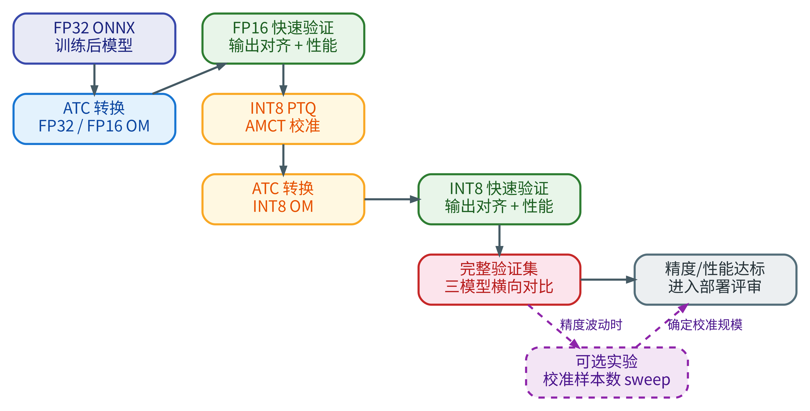
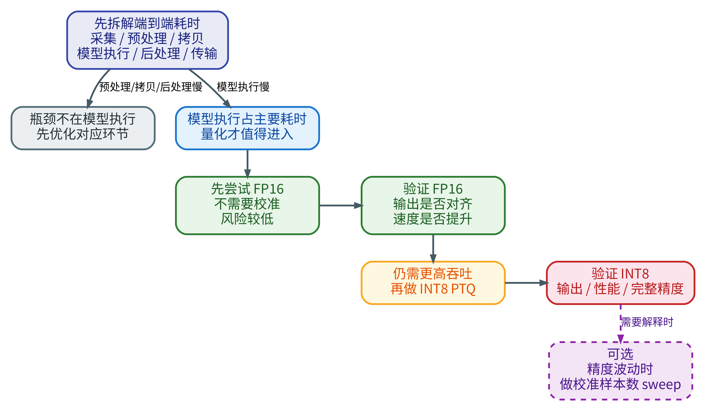
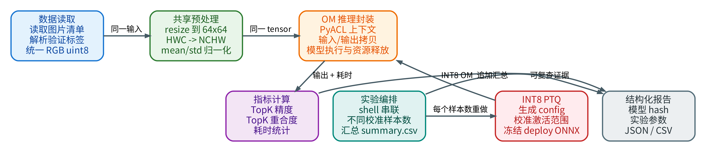
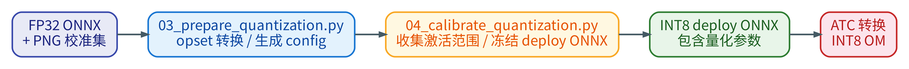
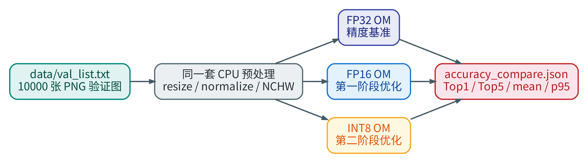
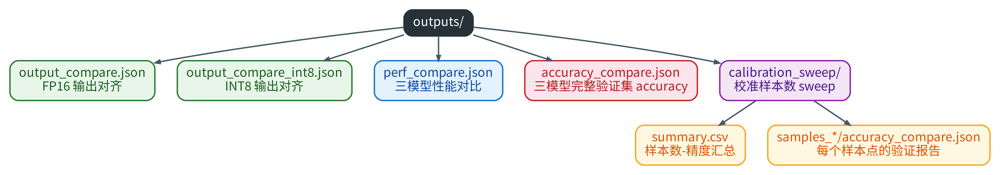
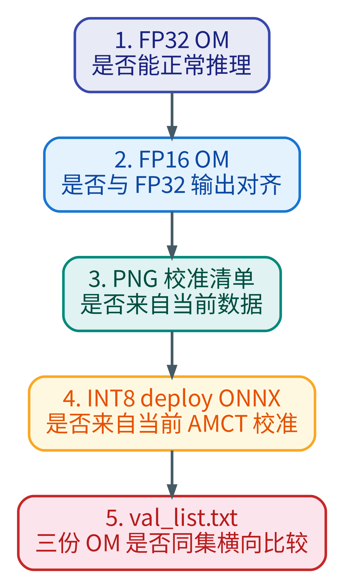

一条推理应用变慢时，首先要拆开看时间花在哪里：是图片解码慢，预处理慢，主机与
NPU 之间的数据拷贝慢，模型在 NPU 上执行慢，还是后处理、显示和网络传输慢。只有
当模型执行已经成为主要瓶颈时，量化才真正进入工程决策。

为什么是量化？原因首先来自业务需求。实时目标检测、实时手势识别、人脸识别打卡
这类边缘 AI 应用通常要求稳定帧率。例如摄像头输入是 30 FPS，单帧从采集到结果
显示就不能长期超过 33 ms；如果还要叠加视频编码、网络传输和 UI 绘制，留给模型
推理的时间会更短。此时如果 FP32 模型执行时间过长，单纯调整 Python 代码已经不够，
就需要考虑让模型以更适合芯片的低精度形式运行。

从 Ascend 310B 的硬件定位看，它是面向边缘推理的 AI 处理器，AI Core 更适合执行
低精度张量计算。相比 FP32，FP16 的数据宽度更小，访存压力更低，在 310B 上通常是
更常用的推理精度；相比 FP16，INT8 进一步把权重和激活压缩到 8 位整数，理论上可以
带来更高吞吐和更低内存带宽占用。也就是说，量化不是一个“文件格式转换技巧”，而是
把模型数值表示方式调整到芯片更擅长的计算路径上。

但低精度并不是免费的。FP16 可能带来轻微数值误差，INT8 还需要通过校准数据估计
量化比例和零点。低精度模型如果处理不好，虽然速度上去了，Top1/Top5 精度、
边界样本排序和业务可用性都可能下降。因此本章的核心问题不是“怎样把模型转成
INT8”，而是：

1. 在什么性能场景下需要考虑量化。
2. 为什么 Ascend 310B 上先看 FP16，再看 INT8。
3. 如何建立 FP32 基准，并公平比较 FP32、FP16、INT8。
4. 如何判断“输出接近”与“验证集精度不下降”。
5. 在 INT8 精度不稳定时，如何观察校准样本数量对 PTQ 的影响。

本章选择一个已经训练好的 ResNet18-TinyImageNet FP32 ONNX 模型作为教学对象，
用它完整演示从 FP32 ONNX 到 FP32/FP16/INT8 OM 的量化评估过程。代码只是承载这条
教学主线的参考实现；真正要学的是量化的判断逻辑、验证方法和代码设计原则。其中
ATC、AMCT、PyACL 和 OM 推理相关命令必须在真实 Ascend 310B 开发板上执行；本地
开发机只适合阅读代码、修改文档和做语法检查。

模型量化的主流程不是一开始就冲向 INT8，而是先建立 FP32 基准，再验证 FP16，
最后在需要进一步提升吞吐时引入 INT8 PTQ。完整验证集横向对比是主流程的收口；
校准样本数 sweep 只是可选实验，只有当 INT8 精度波动、精度不达标，或者需要解释
校准样本数量对结果的影响时才需要做。

{#fig:chapter8_quantization_workflow width=62% .center}

这张图可以按三层来读。第一层是基准建立：从训练后得到的 FP32 ONNX 出发，用 ATC
分别生成 FP32 OM 和 FP16 OM。FP32 OM 是后续所有比较的精度基准，FP16 OM 则是
第一个低精度优化对象。这里要先保证转换参数、输入 shape 和预处理口径固定下来，
否则后面的差异就无法归因到精度变化。

第二层是快速验证。FP16 生成后，不应该直接进入完整验证集，而是先用少量图片做
输出对齐和性能对比：输出对齐检查候选模型是否仍然“像” FP32 基准模型，性能对比
检查低精度是否真的降低了推理耗时。只有 FP16 的功能和性能都可信，才继续尝试
INT8。

第三层是 INT8 PTQ 和最终验证。INT8 需要 AMCT 使用校准图片估计激活范围，再把
校准后的 deploy ONNX 交给 ATC 转成 INT8 OM。INT8 OM 也要先做快速输出/性能验证，
最后再用完整验证集把 FP32、FP16、INT8 放在同一把尺上比较 Top1、Top5 和推理耗时。
如果这个横向对比已经满足项目目标，就可以进入部署评审；如果 INT8 精度不稳定、
不达标，或者需要解释校准数据规模对精度的影响，再进入可选的校准样本数 sweep。

## 8.1 从性能瓶颈到量化决策 {#src-book-chapter8-h1}

在实际项目中，量化经常被误用成“只要模型慢，就先转 INT8”。这并不稳妥。
量化优化的是模型计算和一部分模型相关的数据搬运。如果端到端瓶颈在摄像头采集、
图片解码、CPU 预处理、主机与 NPU 之间的数据拷贝、后处理或视频推流，量化模型
本身不会带来根本改善。

因此量化决策应该按图中的顺序进行：

{#fig:chapter8_quantization_decision_order width=62% .center}

第一步是拆解端到端耗时。一个实时应用从摄像头采集到结果显示，中间会经过图片解码、
CPU 预处理、主机与 NPU 之间的数据拷贝、模型执行、后处理和视频传输等环节。如果
主要时间花在预处理、数据拷贝、后处理或显示传输上，优先工作就不是量化，而是优化
对应环节。例如 resize 和归一化太慢，就应该考虑 AIPP、向量化或流水线；输出拷贝
占比过高，就应该检查输出 tensor 尺寸和 buffer 复用；后处理太慢，则应优化 NMS、
绘制或编码。

第二步才是判断模型执行是否占主要耗时。只有当 NPU 上的模型前向计算已经成为瓶颈，
低精度计算才可能带来明显收益。此时不要一开始就做 INT8，而是先尝试 FP16。FP16
通常不需要校准，转换链路更短，精度风险也低，适合用来判断当前模型是否能从低精度
计算中获益。

第三步是验证 FP16。验证不能只看模型是否成功转换，还要检查两件事：候选模型的输出
是否仍然接近 FP32 基准模型，推理耗时是否确实下降。如果 FP16 输出已经明显漂移，
就没有必要继续做 INT8；如果 FP16 正确但性能仍达不到实时帧率或吞吐目标，再进入
INT8 PTQ。

第四步是验证 INT8。INT8 需要校准数据估计激活范围，因此精度风险比 FP16 更高。
完成 INT8 OM 后，也要先做小样本输出对齐和性能对比，再用完整验证集比较 FP32、
FP16、INT8 的 Top1、Top5 和推理耗时。只有功能证据、性能证据和精度证据同时成立，
量化结果才可以进入部署评审。

最后，校准样本数 sweep 不是主流程的必做步骤。只有当 INT8 精度不达标、不同校准集
导致结果波动，或者需要解释“多少张校准图片已经足够”时，才需要进一步做 sweep 实验。

本章所有结论都围绕同一个原则：每次改变模型精度，都必须同时保留功能证据、
性能证据和精度证据。

## 8.2 必备理论：FP32、FP16、INT8 与 PTQ {#src-book-chapter8-h2}

FP32、FP16 和 INT8 的区别不只是“数字位数不同”。它们影响模型权重、激活值、
算子选择、内存带宽和最终预测排序。

FP32 是本章的精度基准。它使用 32 位浮点表示权重和激活，数值范围和表达精度都
比较充足，因此最适合作为“原始模型应该输出什么”的参考。后续 FP16 和 INT8 的
判断都不能脱离这个基准：候选模型可以更快，但不能在分类结果上出现不可接受的
漂移。

FP16 是第一阶段优化。它仍然是浮点数，只是把每个数从 32 位压缩到 16 位。对许多
卷积神经网络推理任务来说，FP16 的数值误差通常比 INT8 更容易控制，而且不需要
额外校准数据。因此在 Ascend 310B 上部署模型时，常见做法是先验证 FP16：如果
FP16 已经满足帧率和精度要求，就没有必要急着进入 INT8。

INT8 是第二阶段优化。它把权重和激活映射到 8 位整数，能进一步降低访存和计算压力，
但它不再是简单的浮点精度缩短，而是需要确定每层的量化比例和零点。这个比例来自
校准数据，所以 INT8 的收益和风险都更明显：速度可能更快，精度也更依赖校准集是否
代表真实输入分布。

从芯片执行角度看，低精度通常能带来三类收益：

1. **计算吞吐更高**：AI Core 对低精度矩阵和卷积计算更友好，FP16 通常比 FP32
   更适合 310B 推理，INT8 又进一步面向整数计算路径。
2. **内存带宽压力更小**：同样数量的权重和激活，FP16 只需要 FP32 一半的数据宽度，
   INT8 只需要 FP32 四分之一的数据宽度。
3. **缓存和搬运更友好**：模型参数和中间激活变小后，片上/片外数据搬运压力下降，
   对边缘设备这种内存和功耗都受限的平台尤其重要。

这些收益不是自动等于端到端加速。如果模型很小，或者 CPU 预处理、数据拷贝、后处理
占主导，量化后的模型执行虽然变快，应用整体 FPS 也可能变化不大。因此本章后面
不仅看模型推理耗时，也会看端到端耗时和完整验证集精度。

INT8 量化的核心思想是把浮点数映射到整数区间。可以粗略理解为：

$$
q = \operatorname{round}\left(\frac{x}{s}\right) + z
$$

$$
x \approx (q - z) \times s
$$

其中，$x$ 是原始浮点数，$q$ 是量化后的整数，$s$ 是量化比例（scale），$z$ 是零点
（zero-point）。这里的量化比例和零点不是凭空指定的。对于权重，工具可以直接扫描
模型参数；对于激活值，必须用一批代表性输入跑一遍模型，估计每层激活分布。
这个过程就是校准。校准图片如果不代表真实输入分布，就可能出现两类问题：

1. 激活范围估计太窄，真实输入中的大值被截断，精度明显下降。
2. 激活范围估计太宽，常见数值区域的量化分辨率变粗，分类边界样本排序漂移。

本章使用的是 PTQ，也就是 Post-Training Quantization。PTQ 不重新训练模型，
只在训练后用校准数据估计量化参数。它适合部署阶段快速评估。如果 PTQ 后精度
下降不可接受，再考虑 QAT（Quantization-Aware Training），也就是训练时模拟
量化误差并重新微调模型。

## 8.3 如何设计量化验证代码：先拆职责，再写脚本 {#src-book-chapter8-h3}

写量化案例代码时，最忌讳把下载数据、图片预处理、模型推理、计时、accuracy 统计、
AMCT 校准和报告写入全部塞进一个大脚本。那样虽然第一次能跑通，但只要换模型、
换输入尺寸或换校准样本数量，就很难判断问题来自哪里。

更稳妥的写法是先拆出清晰的职责边界。图中每个框都只做一类事情，框与框之间只传递
必要的数据，而不是互相知道彼此的实现细节。

{#fig:chapter8_sample_structure width=72% .center}

最前面的边界是数据读取。它只负责读取图片清单、解析验证标签，并把图片统一转成
RGB `uint8` 数组。这里不应该做模型推理，也不应该计算 accuracy。这样做的好处是，
后面无论验证 FP16、INT8，还是做校准样本数 sweep，都能复用同一套图片读取逻辑。

第二个边界是共享预处理。它把 RGB 图片 resize 到模型输入尺寸，完成 HWC 到 NCHW
的 layout 转换，并按训练时的 mean/std 做归一化。这个模块必须只写一份，不能因为
模型是 FP32、FP16 或 INT8 就写三套预处理。量化对比要公平，最基本的前提就是三个
模型吃到完全相同的输入 tensor。

第三个边界是 OM 推理封装。它负责 PyACL 上下文、模型加载、输入拷入 NPU、模型执行、
输出拷回主机和资源释放。它不关心预测是否正确，也不关心 Top1/Top5 怎么算。把硬件
运行细节封装起来后，后面的输出对齐、性能对比和完整验证都可以用同一种 runner 调用
方式。

第四个边界是指标计算。它只接收模型输出和标签，计算 TopK 精度、TopK 重合度、输出
误差和耗时统计。这个模块不应该读取图片，也不应该管理 Ascend 资源。这样指标代码
可以独立测试，也能避免“推理出错”和“统计口径出错”混在一起。

第五个边界是结构化报告。实验结果不能只打印在终端里，而要把模型路径、模型 hash、
样本数量、输入清单、精度、耗时和少量样本明细写成 JSON 或 CSV。只有报告可复查，
后续才可以比较 FP32、FP16、INT8，或者回头解释某次 sweep 为什么出现波动。

图中的 INT8 PTQ 和实验编排是两个补充边界。INT8 PTQ 负责生成量化配置、用校准图
统计激活范围并冻结 deploy ONNX；实验编排只负责把不同样本数的校准、转换、验证
串起来，不把 Python 数据处理逻辑塞进 shell。这样主线代码不会被 sweep 实验拖乱，
sweep 也能复用前面已经写好的数据、预处理、推理和报告模块。

按照这个边界，代码的骨架可以先写成下面这样：

```python
paths = read_image_list(list_file)
models = [Runner(path) for path in om_models]
metrics = {name: MetricState() for name in names}

for image_path, label in paths:
    frame = load_rgb_frame(image_path)
    input_tensor = preprocess_resnet_rgb(frame)
    for name, runner in zip(names, models):
        logits, timing = runner.infer(input_tensor)
        metrics[name].add(logits, label, timing)

write_report(output_path, metrics)
```

这个骨架背后的关键思想是：输入路径只走一次，预处理只写一份，多个 OM 只在
`runner.infer()` 这一层发生差异。这样得到的 FP32、FP16、INT8 对比才是公平的。

本章的参考实现可以在 GitHub 仓库中查看：
[samples/chapter8](https://github.com/zhouxzh/Ascend310/tree/main/samples/chapter8)。

## 8.4 如何编写数据准备代码：让输入可复现 {#src-book-chapter8-h4}

先在开发板上加载 CANN 环境，激活 Python 环境，并进入样例目录：

```bash
source /usr/local/Ascend/ascend-toolkit/set_env.sh
conda activate npu
cd ~/Documents/Ascend310/samples/chapter8
```

对于 8GB 及以内内存的 Ascend 310B 开发板，运行 ATC 前建议一定加上下面的并行
编译限制，避免转换过程中因为内存不足失败。12GB 以上内存的开发板通常可以先不加；
如果 ATC 转换时仍然出现内存不足或编译进程被杀掉，也应加上这两个环境变量后重试：

```bash
export TE_PARALLEL_COMPILER=1
export MAX_COMPILE_CORE_NUMBER=1
```

本章的起点不是重新训练模型，而是接着前面章节已经完成的分类模型训练和 ONNX
导出流程往下走。ResNet 的残差结构和小尺寸图像分类模型的基本写法，可以回看
[第 3 章 ResNet 部分](chapter3.md#src-book-chapter3-h28)；Tiny-ImageNet 数据集、
ResNet-18 训练和 ONNX 导出的过程，可以回看
[第 4 章 ResNet-18 实例](chapter4.md#src-book-chapter4-h24)。本章只把训练后的
`resnet18_tiny_imagenet.onnx` 当作待部署模型，重点讲如何把它转换为不同精度的
OM，并验证量化后的精度和性能。

这个模型有几个适合量化教学的特点。它是一个面向 Tiny-ImageNet 的 ResNet18
分类模型，输入是 `1x3x64x64` 的 RGB 图像，输出是 200 个类别分数。相比标准
ImageNet 的 `224x224` 模型，它更小，适合在 Ascend 310B 开发板上完整跑完校准、
性能测试和验证集评估；相比过于简单的 MNIST/CIFAR 小模型，它又包含卷积、BN、
残差连接和多类别分类输出，能更真实地反映 FP16/INT8 量化对推理结果的影响。

第一段数据准备代码是模型下载。运行方式如下：

```bash
python tools/download_model.py
```

这段代码不应该只是简单的 `wget`。为了让教程和实验可复现，模型下载程序至少要
处理三件事：

1. 默认从 `zhouxzh/resnet18_tiny_imagenet` 下载 `resnet18_tiny_imagenet.onnx`。
2. 默认使用 `https://hf-mirror.com`，失败时回退到 `https://huggingface.co`。
3. 只保存 FP32 ONNX，后续所有 OM 都由本章的 ATC/AMCT 流程生成。

第二段数据准备代码是校准集和验证集下载。Tiny-ImageNet 可以理解为 ImageNet 的
小型教学版本：它包含 200 个类别，图像分辨率为 `64x64`，常用验证集有 10000 张
图片。这个规模比完整 ImageNet 更适合开发板实验，但类别数又足够多，可以观察
Top1/Top5、边界样本排序和量化误差。运行方式如下：

```bash
python tools/download_tiny_imagenet.py train --force-download --per-class 2
python tools/download_tiny_imagenet.py val --force-download
```

这里故意把图片统一保存为 PNG。Tiny-ImageNet 原始数据中常见的是 JPEG，但 JPEG
是有损压缩，同一张图在不同处理链中可能引入细微差异。PNG 是无损格式，更适合
做教学实验：校准图、验证图和清单可以稳定复现，后续对比 FP32/FP16/INT8 时，
输入差异不会成为干扰因素。

这里还有一个重要约束：校准集和验证集必须分开。校准集只用来估计 INT8 的量化范围；
验证集才用来报告 Top1/Top5。把验证集混入校准阶段，会让实验结论不干净，因为模型
量化参数已经“看过”验证数据，后面的精度报告就不再是独立评估。

`tools/download_tiny_imagenet.py` 有两个子命令：

| 子命令 | 默认行为 | 输出清单 |
|---|---|---|
| `train` | 每类保存 2 张训练图，共 400 张 PNG | `data/calib_list.txt` |
| `val` | 保存完整验证集，共 10000 张 PNG | `data/val_list.txt` |

训练集和验证集的清单格式不同：

```text
data/calib_list.txt: tiny_imagenet_train/0_00000.png
data/val_list.txt:   tiny_imagenet_val/0_00000.png 0
```

校准阶段不需要真实标签，所以 `calib_list.txt` 只保存图片路径。验证阶段要计算
Top1/Top5，所以 `val_list.txt` 必须保存 `路径 标签`。

写数据准备代码时，关键不是把图片下载下来就结束，而是要保证后续实验可以复现。
校准图片和验证图片应分目录保存，避免误把验证集用于校准；图片格式应统一，避免
不同压缩格式带来额外输入差异；清单最好使用相对路径，这样本地目录和开发板目录
不同也能迁移；验证集清单必须保存标签，accuracy 统计不能依赖文件名去猜类别。
下载程序还应支持强制刷新和离线 cache，这样既方便完整重跑，也能在网络不稳定时
继续教学实验。

## 8.5 预处理：所有模型对比必须使用同一套输入 {#src-book-chapter8-h5}

量化实验中最容易被忽略的是预处理。如果 FP32、FP16、INT8 三个模型使用的 resize、
颜色通道、归一化或 layout 不一致，后面所有精度对比都没有意义。

本章把预处理集中在一个代码，核心函数是 `preprocess_resnet_rgb()`：

```python
resized = resize_nearest_rgb(frame, out_h, out_w)
image_chw = resized.transpose(2, 0, 1).astype(np.float32)
image_chw *= 1.0 / 255.0
image_chw -= IMAGENET_MEAN
image_chw *= IMAGENET_INV_STD
input_tensor = image_chw[None, ...]
```

这段逻辑完成四件事：

1. 把 RGB 图片 resize 到 `64x64`。
2. 从 HWC 转成 NCHW。
3. 从 `uint8` 转成 `float32`，并缩放到 `[0, 1]`。
4. 使用 ImageNet mean/std 做归一化，再增加 batch 维度。

`01_compare_outputs.py`、`02_perf_compare.py`、`04_calibrate_quantization.py` 和
`05_validate_accuracy.py` 都调用这套预处理。这是本章代码设计中最重要的复用点：
校准、快速对齐、性能测试和完整验证必须共享同一条输入路径。

这段预处理也体现了本章的几个设计取舍：

| 代码选择 | 为什么这样做 |
|---|---|
| `load_rgb_frame()` 统一转 RGB | 避免 PNG/JPEG、灰度图、不同解码库造成通道含义不一致 |
| `resize_nearest_rgb()` 固定为 64x64 | 与训练好的 Tiny-ImageNet ResNet18 输入尺寸一致 |
| `transpose(2, 0, 1)` | 把图片从 HWC 变为 ATC 命令中声明的 NCHW |
| `astype(np.float32)` | 即使后续模型是 FP16/INT8，输入预处理仍用同一个 FP32 浮点张量作为比较基准 |
| `IMAGENET_MEAN` 和 `IMAGENET_INV_STD` | 复用训练时的归一化方式，否则 accuracy 变化无法归因到量化 |

## 8.6 ATC 转 FP32/FP16：先建立可比较的基准 {#src-book-chapter8-h6}

在做 INT8 之前，先从同一个 FP32 ONNX 转出 FP32 OM 和 FP16 OM。FP32 OM 是
精度参考，FP16 OM 是第一阶段优化对象。

FP32 OM：

```bash
atc \
  --model=model/resnet18_tiny_imagenet.onnx \
  --framework=5 \
  --output=model/resnet18_tiny_imagenet_fp32 \
  --input_format=NCHW \
  --input_shape="input.1:1,3,64,64" \
  --soc_version=Ascend310B4 \
  --precision_mode=force_fp32 \
  --log=info
```

FP16 OM：

```bash
atc \
  --model=model/resnet18_tiny_imagenet.onnx \
  --framework=5 \
  --output=model/resnet18_tiny_imagenet_fp16 \
  --input_format=NCHW \
  --input_shape="input.1:1,3,64,64" \
  --soc_version=Ascend310B4 \
  --precision_mode=allow_fp32_to_fp16 \
  --log=info
```

几个参数值得单独解释：

| 参数 | 作用 |
|---|---|
| `--framework=5` | 输入模型是 ONNX |
| `--input_format=NCHW` | 输入 tensor layout 与预处理输出一致 |
| `--input_shape="input.1:1,3,64,64"` | 固定 batch、通道和图片尺寸 |
| `--soc_version=Ascend310B4` | 指定目标芯片 |
| `--precision_mode=force_fp32` | 尽量保持 FP32，作为精度参考 |
| `--precision_mode=allow_fp32_to_fp16` | 允许 ATC 把 FP32 转为 FP16 |

这一步完成后，`model/` 中至少应有：

```text
resnet18_tiny_imagenet.onnx
resnet18_tiny_imagenet_fp32.om
resnet18_tiny_imagenet_fp16.om
```

## 8.7 如何编写输出对齐程序：先看模型是否“像”基准 {#src-book-chapter8-h7}

转换成功不等于模型可信。第一层检查是输出对齐：给 FP32 OM 和候选 OM 喂同一张图，
看 Top1 是否一致、Top5 重合度和 logits 误差。

这里需要先把三个概念说清楚。分类模型最后通常会输出一个长度等于类别数的向量，
这个向量一般称为 logits，也就是 softmax 之前的原始类别分数。本章的模型输出
200 个 logits，每个位置对应 Tiny-ImageNet 的一个类别。分数最高的类别就是 Top1；
分数最高的前 5 个类别构成 Top5。

在输出对齐阶段，Top1 和 Top5 还不是验证集 accuracy。因为这里不看真实标签，
只比较“候选模型是否像 FP32 基准模型”。Top1 一致，表示同一张图片上 FP32 OM
和候选 OM 给出的第一名类别相同；Top5 重合度（Top5 overlap）表示两个模型前
5 个候选类别集合有多少个相同，最大值是 5。例如平均 Top5 重合度为 `4.9975/5`，
说明绝大多数图片的前 5 个候选类别完全相同，只在极少数边界样本上出现了一个
类别的差异。

logits 误差则不看类别名，而是直接比较两个输出向量的数值差异。本章记录最大绝对
误差和平均绝对误差：前者观察最剧烈的一项数值漂移，后者观察整体漂移水平。这个
指标通常比 Top1 更敏感，因为即使 Top1 没变，logits 的数值也可能已经发生变化。
反过来，如果两个最高分非常接近，极小的 logits 漂移也可能让 Top1 对调。因此
输出对齐要同时看排序和数值误差，不能只看一个指标。

[`01_compare_outputs.py`](https://github.com/zhouxzh/Ascend310/blob/main/samples/chapter8/01_compare_outputs.py)
就是这个“小样本输出一致性检查”程序。它的输入是两个 OM
模型和一批固定图片；输出是一份 JSON 报告，记录候选模型和 FP32 基准模型的 Top1
是否一致、Top5 预测集合有多少重合，以及两个输出向量之间的最大/平均绝对误差。
它不计算真实 accuracy，也不需要图片标签。它回答的问题是“候选模型的输出是否仍然
接近 FP32 基准”，而不是“候选模型预测得是否正确”。

写完程序后，可以先用 FP16 OM 做一次输出对齐：

```bash
python 01_compare_outputs.py \
  --base-model model/resnet18_tiny_imagenet_fp32.om \
  --candidate-model model/resnet18_tiny_imagenet_fp16.om \
  --output outputs/output_compare.json
```

这类程序不应该先看真实标签，而应该只比较两个模型在同一输入上的输出排序。
实现时可以分成三步：先读取一批固定图片，通常使用校准图片即可，不需要标签；
然后把同一个 `input_tensor` 先送入 FP32 OM，再送入候选 OM；最后比较两个输出
向量的 Top1、Top5 集合、最大绝对误差和平均绝对误差。这个顺序能保证差异只来自
模型本身，而不是来自图片读取、预处理或标签解析。

核心比较函数可以写成下面的思路：

```python
base_top = topk_indices(base_logits, k=5)
candidate_top = topk_indices(candidate_logits, k=5)

top1_match = base_top[0] == candidate_top[0]
top5_overlap = len(set(base_top) & set(candidate_top))
mean_abs_diff = np.mean(np.abs(base_logits - candidate_logits))
max_abs_diff = np.max(np.abs(base_logits - candidate_logits))
```

这里的 `compare_logits()` 不使用真实标签。它比较的是两个模型输出之间的相似度，
回答“候选模型是否像基准模型”，而不是“候选模型是否预测正确”。

本轮 PNG 数据重跑后，FP16 快速验证结果如下：

| 验证内容 | 对比对象 | 样本/次数 | 关键结果 |
|---|---|---:|---|
| 输出对齐 | FP32 OM vs FP16 OM | 400 张校准图 | Top1 match 100.00%，Top5 overlap 4.9975/5，mean abs diff 0.000405 |

这个结果说明 FP16 的输出排序几乎完全继承了 FP32，可以继续看性能。

## 8.8 如何编写性能对比程序：把耗时拆成可解释阶段 {#src-book-chapter8-h8}

第二层检查是性能。性能程序如果只记录一个总耗时，很难解释“模型变快了但端到端
没有明显变快”这种现象。因此要把一次推理拆成 CPU 预处理、数据拷贝、设备执行和
后处理几个阶段。

FP16 性能对比命令：

```bash
python 02_perf_compare.py \
  --models model/resnet18_tiny_imagenet_fp32.om model/resnet18_tiny_imagenet_fp16.om \
  --labels fp32 fp16 \
  --runs 100 \
  --output outputs/perf_compare.json
```

实现时可以让 `measure_model()` 围绕同一个 runner 循环多次，并把一次推理拆成
下面几个容易理解的阶段：

| 计时阶段 | 含义 |
|---|---|
| CPU 预处理 | 图片 resize、归一化、layout 转换 |
| 输入拷贝 | 把输入 tensor 从主机内存拷到 NPU 侧内存 |
| 模型执行 | OM 模型在 NPU 上完成一次前向计算 |
| 输出拷贝 | 把模型输出从 NPU 侧内存拷回主机内存 |
| 推理整体耗时 | 输入拷贝、模型执行、输出拷贝等推理相关耗时 |
| 后处理 | 从输出中取 Top1 等轻量处理 |
| 端到端耗时 | CPU 预处理 + 推理整体耗时 + 后处理 |

`StageRecorder` 是样例代码中复用的一个简单阶段计时器。它把每个阶段的多次耗时保存下来，再用
`summarize_stages()` 计算平均值、中位数、95% 分位耗时、最小值、最大值和 FPS。
这样读者不仅知道平均值，还能看到少数慢帧造成的长尾抖动。

计时代码不要只包住 Python 函数入口，而要尽量贴近真正想测的边界。例如：

```python
with recorder.time("preprocess"):
    input_tensor = preprocess_resnet_rgb(frame)

with recorder.time("inference_total"):
    outputs, timings = runner.infer(input_tensor)

with recorder.time("postprocess"):
    top1 = int(np.argmax(outputs[0]))
```

这里的 `preprocess`、`inference_total`、`postprocess` 是报告中的字段名；字段名
服务于程序读写，教材阅读时先理解对应的中文阶段即可。

这样写的好处是，如果 INT8 的模型执行阶段明显变快，但 CPU 预处理占比很高，
读者会知道下一步应该优化输入流水线，而不是继续调量化参数。

本轮 PNG 数据重跑后，FP16 性能结果如下：

| 对比 | 结果 |
|---|---|
| FP32 end-to-end mean | 4.1116 ms |
| FP16 end-to-end mean | 3.7774 ms |
| FP16 相对 FP32 | 约 1.09x |

FP16 的输出对齐很好，但端到端收益比较温和。这提示我们：如果希望进一步压缩模型
执行时间，可以继续尝试 INT8；但也要保持同样的验证标准。

## 8.9 如何编写 INT8 PTQ 程序：准备配置，再收集激活范围 {#src-book-chapter8-h9}

INT8 不能只靠 ATC 参数完成。本章采用 AMCT PTQ 生成 deploy ONNX，再交给 ATC
转换为 INT8 OM。

{#fig:chapter8_int8_ptq_pipeline width=100% .center}

### 8.9.1 为什么选择 `amct_onnx`

AMCT 的全称是 Ascend Model Compression Toolkit，即昇腾模型压缩工具包。它不是
一个推理运行时，而是部署前的模型处理工具：根据校准数据估计量化参数，把原始
模型改写成带量化信息的模型，再交给 ATC 转成 OM。AMCT 支持不同深度学习框架的
入口，常见形态包括 `amct_onnx`、`amct_pytorch`、`amct_caffe`、`amct_tensorflow`
等。不同入口面向的模型格式和依赖环境不同，但最终目标都是生成更适合昇腾硬件
部署的压缩模型。

放到代码层面看，`amct_onnx` 提供的是一组 Python API。本章主要用到这些接口：

| API | 在代码中的作用 | 为什么需要它 |
|---|---|---|
| `amct.create_quant_config()` | 根据 ONNX 和校准批次数生成量化配置 | 先确定哪些层量化、使用什么量化策略 |
| `amct.quantize_model()` | 按配置给 ONNX 插入 fake-quant 和统计相关节点 | 让后续校准运行时能够收集激活范围 |
| `amct.AMCT_SO` | 提供 AMCT 专用的 ONNX Runtime SessionOptions | 防止普通图优化破坏 fake-quant/统计节点 |
| `amct.save_model()` | 把校准得到的量化比例和零点固化进 deploy ONNX | 生成 ATC 可转换的 INT8 部署模型 |

本章选择 `amct_onnx`，不是因为 PyTorch 路线不存在，而是因为本案例的工程条件
更适合 ONNX 路线：

| 选择点 | `amct_onnx` 路线 | `amct_pytorch` 路线 |
|---|---|---|
| 输入模型 | 已经训练好的 FP32 ONNX | PyTorch 模型和 PyTorch 运行环境 |
| 校准执行 | 使用 ONNX Runtime 跑校准图 | 依赖 PyTorch/torch_npu 或 PyTorch 相关图处理 |
| 部署衔接 | deploy ONNX 可直接交给 ATC 转 OM | 通常还要处理导出或框架适配问题 |
| 对 310B 教学适配 | 更贴近“ONNX -> ATC -> OM”的离线推理部署链路 | 更适合 PyTorch 训练/量化感知训练等场景 |

第 3 章已经介绍过，`torch_npu` 在昇腾 310B 上仍有算子、精度和图编译方面的
限制。本章的目标是把一个已经训练好的分类模型稳定部署到 310B 做推理，而不是
在 310B 上继续训练或做 PyTorch 图改写。因此使用 `amct_onnx` 更直接：校准阶段
只需要 ONNX Runtime 和 AMCT ONNX 包，部署阶段仍然走 310B 更常用的 ATC 离线转换
路径。

这也是代码设计上的一个重要原则：工具链越靠近最终部署格式，中间变量就越少。
本章从 FP32 ONNX 出发，所有 FP32、FP16、INT8 OM 都由这个 ONNX 或 AMCT 生成的
deploy ONNX 转换而来，避免了“PyTorch 模型、ONNX 模型、OM 模型各自一套语义”
带来的额外不确定性。

### 8.9.2 AMCT ONNX 环境

INT8 PTQ 需要额外安装 AMCT ONNX 工具包。CANN Toolkit 本身不一定自带
`amct_onnx` Python 包。本章验证环境为：

```text
CANN: 8.3.RC1
arch: aarch64
Python: 3.11
ONNX: 1.14.0
ONNX Runtime: 1.16.0
AMCT ONNX: 0.23.2
```

不同 CANN 版本应以昇腾官方文档中的 AMCT 依赖表为准。安装完成后可简单验证：

```bash
python -c 'import amct_onnx as amct, onnx, onnxruntime as ort; print("amct_onnx:", getattr(amct, "__file__", "ok")); print("onnx:", onnx.__version__); print("onnxruntime:", ort.__version__)'
```

如果 `import amct_onnx` 失败，优先检查 AMCT 包是否与 CANN 版本匹配、wheel 架构
是否与 `uname -m` 一致、当前 `python` 是否就是安装 AMCT 的环境。

### 8.9.3 准备阶段：生成量化配置

第一步运行：

```bash
python 03_prepare_quantization.py
```

准备阶段的代码不是直接“量化模型”，而是先回答三个问题：输入 ONNX 能不能被当前
AMCT 版本理解、这次准备用多少张校准图片、哪些层参与量化。因此代码从参数和路径
开始写：

```python
parser.add_argument("--onnx", default=str(DEFAULT_ONNX))
parser.add_argument("--work-dir", default=str(DEFAULT_WORK_DIR))
parser.add_argument("--calib-list", default=str(DEFAULT_CALIB_LIST))
parser.add_argument("--samples", type=int, default=0)
parser.add_argument("--amct-opset", type=int, default=16)
parser.add_argument("--skip-layers", nargs="*", default=[])
parser.add_argument("--activation-offset", action=argparse.BooleanOptionalAction, default=True)
```

这些参数看似普通，但每一个都对应一个教学目的：

| 参数 | 为什么要这样写 |
|---|---|
| `--onnx` | 允许替换自己的 FP32 ONNX，而不是把模型名写死在代码中 |
| `--work-dir` | 每次实验的 AMCT 中间文件独立保存，sweep 时不会互相覆盖 |
| `--calib-list` / `--samples` | 让“用多少张图片校准”成为显式实验变量 |
| `--amct-opset` | 兼容不同 AMCT/ONNX Runtime 版本，必要时可用 `0` 跳过转换 |
| `--skip-layers` | 当某些层量化后精度敏感时，可以先排除再定位问题 |
| `--activation-offset` | 控制激活量化是否带 offset，本章默认开启，更适合非对称激活分布 |

代码中还设置了：

```python
os.environ.setdefault("TORCH_DEVICE_BACKEND_AUTOLOAD", "0")
```

这不是在使用 PyTorch，而是反过来避免不必要的设备后端自动加载。本脚本只需要
ONNX、AMCT 和校准清单，不应该因为环境里装了其他深度学习包就触发额外的 NPU
后端初始化。

准备阶段真正做两件事。

第一，检查原始 ONNX opset。如果当前 opset 与 AMCT 期望不一致，就调用
`onnx.version_converter.convert_version()` 转成默认的 opset 16。这里不是为了
改变模型语义，而是为了匹配本章验证环境中的 AMCT ONNX 依赖组合。

代码单独写出 `prepare_opset()`，而不是把转换逻辑塞进 `main()`，好处是错误边界
清楚：如果 opset 转换失败，问题就是 ONNX/AMCT 兼容性；如果转换成功而后面失败，
问题再去看量化配置或校准数据。

第二，调用：

```python
amct.create_quant_config(
    config_file=...,
    model_file=...,
    batch_num=len(paths),
    activation_offset=True,
    updated_model=...,
)
```

这一步生成 `outputs/int8_amct/config.json` 和 `outputs/int8_amct/updated_model.onnx`。
`config.json` 描述哪些层参与量化、是否使用 activation offset，以及校准批次数。
它还没有真正统计激活范围，只是把“要怎么量化”准备好。

这里必须注意 `batch_num=len(paths)`。AMCT 需要知道后续会跑多少批校准输入，
所以准备阶段先读取 `calib_list.txt`，但还不真正执行模型。这样写的好处是：
配置生成和校准执行可以分开排错；sweep 实验也可以为 20、50、100、200、400
张图片分别生成独立配置。

### 8.9.4 校准阶段：用真实图片统计激活范围

第二步运行：

```bash
python 04_calibrate_quantization.py
```

校准阶段的代码是 PTQ 的关键。它先调用 `amct.quantize_model()` 生成带 fake-quant
节点的 `modified_model.onnx`，然后用 ONNX Runtime 跑校准图片：

```python
session = ort.InferenceSession(
    str(modified_model),
    amct.AMCT_SO,
    providers=["CPUExecutionProvider"],
)
session.run(None, {input_name: input_tensor})
```

这段代码里有四个容易被忽略的设计点。

第一，`model_for_quant` 优先使用准备阶段生成的 `updated_model.onnx`：

```python
model_for_quant = updated_model if updated_model.exists() else resolve_chapter_path(args.onnx)
```

这样写是为了兼容两种情况。正常流程中，`03_prepare_quantization.py` 已经完成
opset 转换并生成 `updated_model.onnx`；如果读者明确跳过准备阶段的某些处理，
代码仍然可以回退到原始 ONNX，但会在缺少 `config.json` 时给出明确错误。

第二，`amct.quantize_model()` 和 `amct.save_model()` 必须放在同一个 Python 进程：

```python
amct.quantize_model(str(config_file), str(model_for_quant), str(modified_model), str(record_file))
...
amct.save_model(str(modified_model), str(record_file), str(save_prefix))
```

AMCT 0.23.x 会在进程内保存一部分融合和量化状态。如果把“生成 modified ONNX”
和“保存 deploy ONNX”拆成两个独立命令，后一个进程可能拿不到前一个进程里的
状态，导致保存失败或生成结果不完整。所以本章把校准和保存写进一个脚本，这是
为了配合工具行为，而不是为了偷懒。

第三，ONNX Runtime 要使用 `amct.AMCT_SO`，并关闭图优化：

这里使用 `amct.AMCT_SO` 并关闭图优化，是为了让 fake-quant 节点保留在图中，
从而收集每层激活统计。校准结束后，代码调用 `amct.save_model()` 冻结 deploy
ONNX，并把结果复制到：

```text
model/resnet18_tiny_imagenet_int8_deploy.onnx
```

如果使用普通的 ONNX Runtime session，图优化可能把 AMCT 插入的统计节点或
fake-quant 节点融合掉，校准过程就失去了意义。因此代码显式设置：

```python
amct.AMCT_SO.graph_optimization_level = ort.GraphOptimizationLevel.ORT_DISABLE_ALL
amct.AMCT_SO.intra_op_num_threads = 1
amct.AMCT_SO.inter_op_num_threads = 1
```

线程数设为 1 不是为了追求最快，而是为了降低 310B 开发板上校准时的内存压力和
运行抖动。校准阶段看重的是统计稳定性，不是吞吐量。

第四，校准循环必须复用完整验证代码里的预处理：

```python
for path in paths:
    frame = load_rgb_frame(path)
    input_tensor = preprocess_resnet_rgb(frame)
    session.run(None, {args.input_name: input_tensor})
```

PTQ 估计的是“真实部署输入经过预处理后，各层激活大概落在哪个范围”。如果校准
阶段使用一套预处理，而验证阶段使用另一套预处理，AMCT 得到的量化比例和零点
就会偏离真实部署分布。把 `load_rgb_frame()` 和 `preprocess_resnet_rgb()` 复用
到校准、输出对齐、性能测试和完整验证中，是本章代码最重要的正确性保障。

校准结束后，`find_deploy_model()` 会在工作目录中寻找 AMCT 实际生成的 deploy
ONNX，再复制到固定路径 `model/resnet18_tiny_imagenet_int8_deploy.onnx`。这样做
的好处是：AMCT 内部输出文件名可以随版本变化，而后续 ATC 命令永远读取同一个
稳定路径。

### 8.9.5 ATC 转 INT8 OM

最后用 AMCT 生成的 deploy ONNX 转出 INT8 OM：

```bash
atc \
  --model=model/resnet18_tiny_imagenet_int8_deploy.onnx \
  --framework=5 \
  --output=model/resnet18_tiny_imagenet_int8 \
  --input_format=NCHW \
  --input_shape="input.1:1,3,64,64" \
  --soc_version=Ascend310B4 \
  --log=info
```

这里不再设置 `--precision_mode`。deploy ONNX 已经包含 AMCT 校准后的量化信息，
额外指定精度模式可能覆盖或破坏这些信息。

## 8.10 快速验证 INT8：漂移更大不等于不能用 {#src-book-chapter8-h10}

INT8 转换后，先重复 FP16 阶段的两个快速检查。

输出对齐：

```bash
python 01_compare_outputs.py \
  --base-model model/resnet18_tiny_imagenet_fp32.om \
  --candidate-model model/resnet18_tiny_imagenet_int8.om \
  --output outputs/output_compare_int8.json
```

性能对比：

```bash
python 02_perf_compare.py \
  --models model/resnet18_tiny_imagenet_fp32.om model/resnet18_tiny_imagenet_fp16.om model/resnet18_tiny_imagenet_int8.om \
  --labels fp32 fp16 int8 \
  --runs 100 \
  --output outputs/perf_compare.json
```

本轮 INT8 快速验证结果如下：

| 验证内容 | 对比对象 | 样本/次数 | 关键结果 |
|---|---|---:|---|
| 输出对齐 | FP32 OM vs INT8 OM | 400 张校准图 | Top1 match 99.75%，Top5 overlap 4.9075/5，mean abs diff 0.016629 |
| 性能对比 | FP32/FP16/INT8 OM | 100 次 | INT8 end-to-end mean 2.1634 ms，相对 FP32 约 1.90x |

INT8 的 logits 误差明显大于 FP16，这是低比特量化的正常现象。关键不是“误差是否
为零”，而是这些误差是否改变最终分类结论。如果 Top1 match 和 Top5 overlap 仍然
较高，就说明可以进入完整验证集评估。

## 8.11 如何编写完整验证程序：把多个 OM 放到同一把尺上 {#src-book-chapter8-h11}

快速输出对齐不能替代真实精度。最终结论必须来自带标签的验证集：

```bash
python 05_validate_accuracy.py --output outputs/accuracy_compare.json
```

验证程序会使用同一套 CPU 预处理，在 Ascend 310B 上依次运行 FP32、FP16、INT8 三个
OM，并用同一份 `data/val_list.txt` 计算 Top1/Top5。

{#fig:chapter8_accuracy_compare_flow width=90% .center}

完整验证程序的核心函数可以命名为 `evaluate_accuracy()`，实现时按下面顺序组织：

1. 解析 `--om-models` 和 `--labels`，默认就是 FP32、FP16、INT8 三个 OM。
2. 用 `read_validation_list()` 读取 `路径 标签`。
3. 用 `ReuseResNetRunner` 为每个 OM 建立一个可复用 runner。
4. 检查三个模型输出类别数一致，避免把不同分类头的模型放在一起比较。
5. warmup 后逐张读取验证图，执行同一套 `preprocess_resnet_rgb()`。
6. 对每个 OM 运行推理，用 `add_accuracy()` 累加 Top1 和 Top5 命中数。
7. 记录每个 OM 的推理整体耗时，报告中对应字段为 `inference_total`。
8. 保存 `mismatches`，方便后续查看哪些样本预测不一致或预测错误。

这里有一个容易写错的地方：不要分别运行三次验证程序再手工拼表。那样三次运行的
预热、图片读取顺序、异常处理和统计口径都可能不同。更好的方式是在同一个循环里
对同一张图片依次运行多个 OM，再同时更新各自的指标状态。

报告主要看：

| 指标 | 含义 |
|---|---|
| Top1 / Top5 | 当前模型相对验证集真实标签的分类精度 |
| 平均推理耗时 / 95% 分位耗时 | 当前 OM 的推理耗时，不包含图片读取和 CPU 预处理 |
| `mismatches` | 部分错误样本及三种模型的 TopK 预测 |

报告中，平均推理耗时和 95% 分位耗时分别保存为 `mean_ms` 和 `p95_ms` 字段。

常用参数如下：

| 参数 | 教学用途 |
|---|---|
| `--val-list` | 指定带标签验证集清单，默认 `data/val_list.txt` |
| `--samples` | 调试时限制验证图片数量；正式报告使用 `0`，表示全部验证集 |
| `--om-models` / `--labels` | 把任意多个 OM 放到同一口径下横向比较 |
| `--warmup` | 预热 OM，减少首次执行开销对推理耗时的影响 |
| `--mismatch-limit` | 控制报告中保存多少个预测不一致样本，便于后续人工分析 |
| `--save-samples` | 保存逐图预测，适合深入分析错例，但报告文件会明显变大 |

调试时可以先少量运行：

```bash
python 05_validate_accuracy.py --samples 200
```

但正式结论应使用完整验证集。本轮 PNG 数据重跑后的结果如下：

<!-- CH8_ACCURACY_TABLE_START -->
| 模型 | Top1 | Top5 | Top1 相对 FP32 | Top5 相对 FP32 | 平均推理耗时/ms | 95% 分位耗时/ms | 平均加速比 |
|---|---:|---:|---:|---:|---:|---:|---:|
| FP32 OM | 62.43% | 82.68% | 0.00 pp | 0.00 pp | 3.4808 | 3.5081 | 1.00x |
| FP16 OM | 62.43% | 82.68% | 0.00 pp | 0.00 pp | 3.1410 | 3.1659 | 1.11x |
| INT8 OM | 62.44% | 82.67% | +0.01 pp | -0.01 pp | 1.4999 | 1.5196 | 2.32x |
<!-- CH8_ACCURACY_TABLE_END -->

这组结果说明：

1. FP16 与 FP32 的 Top1/Top5 完全一致，说明 FP16 转换对分类结果没有可见损失。
2. INT8 的 Top1 与 FP32 基本持平，Top5 只低 0.01 个百分点。
3. INT8 的平均推理耗时相对 FP32 约 2.32x，加速收益明显。

INT8 Top1 比 FP32 高了 0.01 个百分点，这个现象不能理解成“INT8 精度更好”。
验证集是 10000 张图片，0.01 个百分点只对应 1 张图片。具体计数是 FP32/FP16
Top1 正确 6243 张，INT8 Top1 正确 6244 张；同时 Top5 是 FP32/FP16 正确
8268 张，INT8 正确 8267 张。也就是说，量化后的量化比例、零点、取整和
截断改变了少量边界样本的 logits 排序，有的样本从错变对，也有的样本从 Top5
内掉出。这种微小正负波动应视为量化噪声范围内的排序抖动，而不是稳定收益。

## 8.12 如何编写 sweep 实验：用最少胶水代码重复完整流程 {#src-book-chapter8-h12}

如果 INT8 的完整验证集精度已经满足项目要求，这一节可以不做。sweep 是一个可选的
分析实验，用来回答更细的问题：校准图片到底需要多少张，精度曲线什么时候进入
平台区，以及某次 INT8 精度波动是否与校准样本数量有关。

```bash
bash tools/sweep_calibration_samples.sh 20 50 100 200 400
```

sweep 程序会为每个样本数单独执行图中的流程：

{#fig:chapter8_calibration_sweep_flow width=100% .center}

这里故意让 shell 只做实验编排，不在 shell 里嵌入 Python 逻辑。每个 sweep 点
都必须完整经历下面六步：

1. 从完整校准清单中按固定随机种子抽取 N 张图片。
2. 根据当前 N 生成一份新的 AMCT 量化配置。
3. 用这 N 张图片重新统计激活范围，并冻结当前 N 对应的 deploy ONNX。
4. 用 ATC 把当前 deploy ONNX 转成独立的 `int8_sN.om`。
5. 在同一份验证集上比较 FP32、FP16 和当前 INT8。
6. 从验证报告中提取 Top1、Top5 和推理耗时，追加到 `summary.csv`。

`calibration_sweep_helper.py` 里有两个子命令：

| 子命令 | 作用 |
|---|---|
| `make-subset` | 用固定随机种子打乱 `calib_list.txt`，取前 N 张，保证实验可复现 |
| `append-summary` | 从每个 `accuracy_compare.json` 中提取 Top1/Top5 和 INT8 推理耗时，写入 CSV |

常用环境变量如下：

| 变量 | 默认值 | 说明 |
|---|---|---|
| `SAMPLE_COUNTS` | `20 50 100 200 400` | 不传命令行参数时使用的样本数列表 |
| `VAL_SAMPLES` | `0` | 每个点评估多少张验证图，`0` 表示全部验证集 |
| `OUT_DIR` | `outputs/calibration_sweep` | sweep 输出目录 |
| `SOC_VERSION` | `Ascend310B4` | ATC 目标芯片 |
| `SWEEP_SEED` | `2024` | 固定校准子集随机顺序 |

`summary.csv` 中最关键的列是：

| 列 | 含义 |
|---|---|
| `calibration_samples` | 当前 INT8 模型使用的校准图片数量 |
| `int8_top1_pct` / `int8_top5_pct` | 当前 INT8 模型验证集精度 |
| `int8_minus_fp32_top1_pp` / `int8_minus_fp32_top5_pp` | INT8 相对 FP32 的精度变化 |
| `int8_mean_ms` / `int8_p95_ms` | 当前 INT8 模型平均推理耗时和 95% 分位耗时 |

本轮 sweep 结果如下：

<!-- CH8_SWEEP_TABLE_START -->
| 校准图片数 | INT8 Top1 | INT8 Top5 | Top1 相对 FP32 | Top5 相对 FP32 | 平均推理耗时/ms | 95% 分位耗时/ms |
|---:|---:|---:|---:|---:|---:|---:|
| 20 | 62.44% | 82.73% | +0.01 pp | +0.05 pp | 1.4977 | 1.5195 |
| 50 | 62.59% | 82.73% | +0.16 pp | +0.05 pp | 1.5198 | 1.5441 |
| 100 | 62.53% | 82.73% | +0.10 pp | +0.05 pp | 1.4995 | 1.5236 |
| 200 | 62.60% | 82.78% | +0.17 pp | +0.10 pp | 1.5055 | 1.5290 |
| 400 | 62.44% | 82.67% | +0.01 pp | -0.01 pp | 1.5125 | 1.5351 |
<!-- CH8_SWEEP_TABLE_END -->

这轮单次实验的经验拐点大约出现在 50 到 200 张之间：20 张已经没有明显掉点，
50 张后 Top1/Top5 基本进入平台区，200 张达到本轮最高 Top1/Top5；继续增加到
400 张没有继续提升，反而回到与主 INT8 模型一致的 62.44%/82.67%。

这不是矛盾，而是 PTQ 的正常现象。校准范围估计要在“覆盖极端值”和“保持常见值
分辨率”之间折中，再叠加分类边界样本的 logits 排序抖动，accuracy 曲线不一定
随样本数单调上升。工程上不要假设图片越多越好，而应该用固定验证集观察平台区；
若要把 200 张作为正式结论，还应换不同随机种子、增加每类校准图片数量再重复实验。

把这个实验迁移到其他模型时，需要保持两点不变。第一，所有 sweep 点必须使用同一
份验证集，否则曲线变化可能来自验证样本变化。第二，每个样本数都要重新执行 AMCT
校准和 ATC 转换，不能只替换清单后复用旧 INT8 OM，因为量化参数已经固化在 deploy
ONNX 和 OM 中。

## 8.13 如何设计报告和故障回退 {#src-book-chapter8-h13}

量化验证代码不能只把结果打印在终端。终端输出适合人看，但不适合复查、画图、
写报告或比较多轮实验。更好的做法是让每个程序都写结构化报告：输入模型是谁、
模型 hash 是什么、用了多少样本、Top1/Top5 是多少、推理耗时统计是什么。

{#fig:chapter8_outputs width=88% .center}

本章参考实现中，报告设计遵循下面的原则：

| 报告内容 | 编写原因 |
|---|---|
| 保存模型路径、大小和 hash | 防止后来分不清报告对应哪一个 OM |
| 保存样本数量和清单路径 | 防止把 200 张调试结果当成完整验证集结果 |
| 保存 Top1/Top5 和 logits 差异 | 同时观察“是否预测正确”和“输出是否接近” |
| 保存平均值、中位数、95% 分位、最小值、最大值 | 平均值看趋势，95% 分位看少数慢帧 |
| sweep 使用 CSV 汇总 | 方便直接画“校准样本数 - accuracy”曲线 |
| 每个 sweep 点保留独立 JSON | 当某个点异常时，可以回到原始报告排查 |

常见失败模式如下：

| 现象 | 可能原因 | 处理建议 |
|---|---|---|
| ATC 转 FP16 失败 | ONNX 算子或 shape 不满足转换要求 | 先检查 FP32 OM 是否能转换 |
| FP16 输出明显漂移 | 输入 layout、shape 或预处理不一致 | 回到 `01_compare_outputs.py` 小样本定位 |
| `import amct_onnx` 失败 | AMCT 与 CANN/Python/架构不匹配 | 按 CANN 版本重新安装 AMCT |
| INT8 accuracy 大幅下降 | 校准集不代表真实输入分布 | 增加代表性校准图片，检查预处理 |
| INT8 性能收益很小 | 算子回退或模型太小 | 查看 ATC 日志和 Profiling |
| 少数帧耗时明显偏高 | 预热不足、资源复用不稳定 | 增加 warmup，固定运行环境 |

量化失败时不要先调参数。建议按图中的顺序回退检查：

<!-- pdf-page-break -->

{#fig:chapter8_quantization_debug_order width=30% .center}

## 8.14 小结 {#src-book-chapter8-h14}

这个案例的重点不是“把 ResNet18 转成 INT8”这么简单，而是建立一套可复用的量化
评估方法。先用 FP32 建立精度参考，再用 FP16 做温和优化，最后用 INT8 PTQ 追求
更高性能。每一步都要回答三个问题：输出是否对齐，速度是否提升，验证集精度是否
仍然可接受。

从本轮结果看，FP16 与 FP32 精度一致但性能收益有限；INT8 的完整验证集精度基本
持平，平均推理耗时从 3.4808 ms 降到 1.4999 ms。对这个模型和这套 PNG 校准数据
而言，INT8 PTQ 是值得部署的优化方向。更重要的是，读者可以把本章的代码结构和
判断方法迁移到自己的 ONNX 模型上：替换模型、输入 shape、预处理和数据清单，
然后重新执行同一套对齐、性能、accuracy 和 sweep 实验。

迁移时最容易漏改的是四类内容：ATC 的 `--input_shape`、预处理函数、类别数和
标签映射、校准集/验证集清单格式。只要这四类内容保持一致，本章的五个脚本就能
继续作为一个完整的量化评估模板使用。
