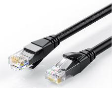
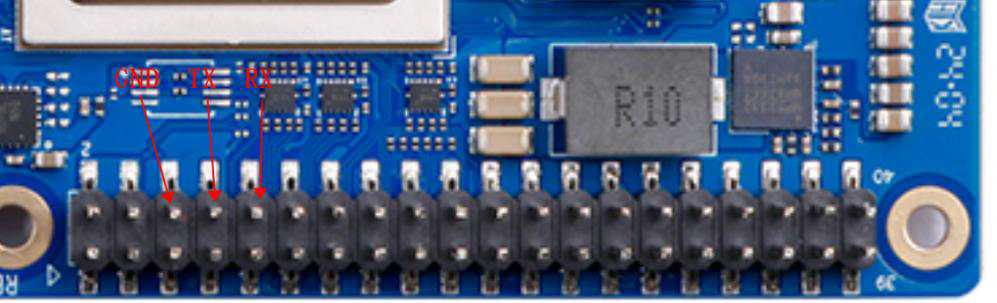

## 昇腾310B开发板介绍

OrangePi AIpro(8T)开发板是香橙派联合华为精心打造的高性能AI开发板，采用昇腾AI技术路线，搭载的昇腾310B为4核64位处理器+AI处理器，集成图形处理器，支持8TOPS INT8的AI算力，拥有8GB/16GB LPDDR4X内存，可以外接32GB/64GB/128GB/256GB eMMC模块，支持双4K高清输出。OrangePi AIpro(8T)引用了相当丰富的接口，包括两个HDMI输出、GPIO接口、Type-C电源接口、支持SATA/NVMe SSD 2280的M.2插槽、TF插槽、千兆网口、两个USB3.0、一个USB Type-C 3.0、一个Micro USB（串口打印调试功能）、两个MIPI摄像头、一个MIPI屏等，预留电池接口，可广泛适用于AI边缘计算、深度视觉学习及视频流AI分析、视频图像分析、自然语言处理、智能小车、机械臂、人工智能、无人机、云计算、AR/VR、智能安防、智能家居等领域，覆盖 AIoT各个行业。 OrangePi AIpro(8T)支持Ubuntu、openEuler操作系统，满足大多数AI算法原型验证、推理应用开发的需求。


### 开发板详细视图


--- 

### 开发板硬件规格

## 所需配件介绍

1. **TF卡**  
   容量最小为32GB，速率为Class10级以上的闪迪品牌的TF卡，如下图所示。建议使用64G及以上的TF卡，以避免在开发过程中出现磁盘空间不足的问题。

   

2. **TF卡读卡器**  
   用于读写TF卡，刷写系统，建议选择速率为USB3.0以上的，减少系统刷写的等待时间。

   

3. **HDMI线或HDMI转mini-HDMI线**  
   主要取决于显示器的接口类型该开发板的视频输出接口为标准HDMI接口。

   
   

4. **电源**  
   该开发板的电源输入为PD 20V，需要搭配支持PD协议20V挡位的65W电源适配器。

   

5. **USB接口的鼠标以及键盘**  
   在无远程访问的条件下对开发板进行本地调试。

   

6. **金属配套外壳**  
   用于保护开发板硬件。

   

7. **12V散热风扇以及散热鳍块**  
   开发板的风扇接口为2pin，输出电压为12v，支持PWM调速。由于该开发板的CPU发热较大，强烈建议安装主动扇热设备。

   

8. **Type-C转USB 3.0转接线（可选）**  
   OrangePi AIPro开发板具有一个Type-C接口，协议为USB3.0（不支持USB 2.0），可外接支持USB3.0以上协议的外置设备。

   

9. **M.2接口 2280规格的PCIe Nvme SSD（可选）**  
   开发板的背部设计有M.2接口，可外接一个M.2的SSD作为开发板的系统盘或者存储。

   

10. **M.2接口 2280规格的Sata Ngff SSD（可选）**  
    同样，开发板的M.2接口不仅支持PCIe协议，也支持Sata协议，因此也可以使用Sata协议的SSD。

    

11. **香橙派的eMMC模块（可选）**  
    eMMC（嵌入式多媒体卡）是一种集成了闪存和控制器的低成本存储解决方案，主要用于智能手机、平板电脑和低端笔记本电脑等消费电子产品。其读写速度适中（100-400MB/s），比传统机械硬盘快但不及固态硬盘（SSD），具有体积小、功耗低和易于集成的特点。开发板支持使用eMMC模块作为存储，但需要额外购置eMMC模块。

    

    

12. **USB摄像头模块（可选）**  
    可用于图像识别、视频通话等多方面用途。

    

13. **网线（可选）**  
    开发板自带有wifi模块可用于连接wifi，若需要更稳定的网络连接，建议使用网线连接。

    

14. **树莓派IMX219型号摄像头（MIPI-CSI）（可选）**  
    开发板带有两个MIPI-CSI接口，可以兼容树莓派的MIPI摄像头，无需占用USB接口。

    

15. **树莓派5寸MIPI LCD显示屏（可选）**  
    开发板带有一个MIPI-DSI显示输出接口，可以直接驱动MIPI的显示屏，而无需外接显示器。

    

16. **Micro USB数据线（可选）**  
    开发板自带了CH343P芯片，将UART转发为Micro USB接口，若需要使用串口对开发板进行调试，则需要使用Micro USB数据线。

    

## 操作系统安装

作为华为生态中重要的一员，开发板不仅支持Ubuntu系统，也支持openEuler系统，但由于开发板自身并无存储，我们在使用开发板的过程中需要使用电脑对TF卡进行系统的刷写，建议使用安装有Windows11 或 Ubuntu22.04以上版本的PC。

首先，打开香橙派官网的[技术支持界面](http://www.orangepi.cn/html/hardWare/computerAndMicrocontrollers/service-and-support/Orange-Pi-AIpro.html)。


向下滑动网页，找到官方镜像部分，分为Ubuntu和openEuler两个部分，两个系统都是官方为我们编译完成的，且预装了部分昇腾NPU的应用环境以及软件，非常方便新手用户上手使用。


### Ubuntu

1. **点击下载**  
   

2. **复制提取码并跳转**  
   

3. **打开百度网盘的链接后，有一个命名为Ubuntu的文件夹，点开该文件夹**  
   

4. **文件夹中，后缀为.xz的文件是镜像压缩包文件，.sha文件是压缩包的md5校验码文件，用于校验镜像包文件是否完整。**

5. **文件夹中的镜像有两种：**  
   - 一种文件名带有Desktop的，是带有GUI图形化界面的。  
   - 另一种文件名带有minimal的，是不具有图形化界面的，只有命令行界面。建议新学习的用户使用带有desktop的镜像。  
   

6. **下载后先校验压缩包是否完整，后解压压缩包**

### openEuler

1. **点击下载**  
   

2. **复制提取码并跳转**  
   

3. **打开百度网盘的链接后，有一个命名为OpenEuler的文件夹，点开该文件夹**
   

4. **文件夹中，后缀为.xz的文件是镜像压缩包文件，.sha文件是压缩包的md5校验码文件，用于校验镜像包文件是否完整。**

5. **文件夹中的镜像只有一种，即具有GUI图形化界面的openEuler系统。**
   

6. **下载后先校验压缩包是否完整，后解压压缩包**

### 使用 MD5 校验下载的文件

- **Windows**：在文件夹内按住 **Shift** 并右键，选择“在终端（Powershell/命令提示符）中打开”。运行：
   ```powershell
   certutil -hashfile opiaipro_ubuntu22.04_desktop_aarch64_20241128.img.xz md5
   ```
   将输出的 MD5 与 `opiaipro_ubuntu22.04_desktop_aarch64_20241128.img.xz.sha` 中的值对比。  
     

   

- **Ubuntu**：
   ```bash
   md5sum <filename>
   ```

- **macOS**：
   ```bash
   md5 <filename>
   ```

若校验值一致，可进行下一步操作；若不一致，请重新下载。  

### 刷写系统到TF卡

#### 下载并安装必要的工具

- **下载链接**： [官网](http://www.orangepi.cn/html/hardWare/computerAndMicrocontrollers/service-and-support/Orange-Pi-AIpro.html) ｜ [百度网盘](https://pan.baidu.com/s/1Jho73pw91r5GJD2KijY45Q?pwd=3xuz#list/path=%2F)
1. **SD Card Formatter**  
   用于快速格式化 TF 卡，刷写系统前请先格式化以减少出错概率。
2. **balenaEtcher**  
   用于将 `.img` 镜像刷写到 TF 卡的工具。

#### 格式化TF卡

1. **将TF卡插入读卡器中，并将读卡器插入电脑。**

2. **打开 **SD Card Formatter** 软件。**  
   

3. **点击右下角的 **Format** 按键，格式化TF卡。**  
   
     
   
   警告内容是关于格式化操作会清除TF卡上原有的所有数据，此处选是。  
   
   

4. **等待软件格式化完成，并点击确定。**  
   

#### 刷写系统到TF卡（以Ubuntu为例）

> 此处以刷写Ubuntu为例，balenaEther需要1.19.25版本及以下！

1. **打开balenaEther，选择“从文件烧录”**  
   

2. **选择好要烧录的镜像文件（**.img**格式），再选择目标磁盘为TF卡对应的位置，如图中名称为“SDXC Card”的位置，选中并选择“选定1”。**  
   

3. **点击“现在烧录！”，耐心等待烧录完成。**  
   

4. **烧录完成后进入校验过程，也请耐心等待。**  
   

5. **烧录完成后即可关闭程序，并安全弹出TF卡**  
   

#### 刷写系统到eMMC
由于板上并不自带有eMMC模块，若要想使用需要额外购买香橙派的eMMC模块，此处暂时不列入参考，若需使用，请查阅香橙派的用户手册。

#### 刷写系统到SSD
开发板带有M.2接口，可以使用SSD作为启动设备。但SSD需要自行准备，且根据香橙派的兼容性说明，该开发版仅支持少数品牌的SSD，因此不推荐使用SSD作为系统安装位置。

#### 调整设备启动方式的拨码开关
开发板支持多种启动方式，包括TF卡、eMMC以及M.2 SSD，当这些存储设备都同时存在时，需要让开发板选定一个存储设备作为启动来源。


两个开关都有左、右两种状态，因此共有4种状态，但是目前开发板仅使用3种模式，对应的参数表如下：

| Boot1开关 | Boot2开关 | 启动设备 |
| :------: | :------: | :------: |
| 左 | 左 | 未使用 |
| 右 | 右 | TF卡 |
| 左 | 右 | eMMC |
| 右 | 左 | M.2 SSD (Nvme或Ngff)|

切换拨码开关后，必须要将开发板完全断电再重新上电才能使新的启动配置生效，使用RESET按键重启则不会使新的启动配置生效。


## 启动开发板（Ubuntu）
### 图形化界面
1. **将系统刷写完成的TF卡从读卡器中取出，插入开发板的TF卡插槽中，并确保两个启动开关的位置均在右边，接入HDMI数据线到靠近USB3.0接口的HDMI0接口，然后将Type-C电源线插入开发板最边缘的TYPE-C供电口，等待风扇的声音变小以及屏幕出现系统登录界面。**  

     

     

   

2. **进入登录界面后，将键盘接入开发板的USB接口中，默认的登录用户名是```HwHiAiUser```，输入该账户的密码```Mind@123```,登录进入系统。**  
   
     
   
   若无法登陆请检查输入的密码是否正确，大小写以及符号是否正确

   默认账户表格：
   | 用户名 | 密码 |
   | :---: | :---: |
   | root | Mind@123 |
   | HwHiAiUser | Mind@123 |

### 串口界面
1. **使用USB2TTL模块，与开发板的GPIO口进行连线**  
   ，开发板的TX（GPIO8）接入USB2TTL模块的RX接口，开发板的RX（GPIO10）则接入模块的TX接口，并连接好GND接地，在Windows电脑下可以使用PUTTY连接串口。
2. **使用开发板自带的Micro USB接口进行串口调试，该方法更为方便，只需要一根Micro USB数据线，接入电脑后打开设备管理器查询对应的串口，然后使用PUTTY进行链接即可。**  
   

以Micro USB接口为例：
1. **使用Micro USB数据线连接开发板和电脑**
2. **打开电脑的设备管理器，选择端口，寻找开发板对应的串口端口号**  
   

3. **打开串口调试软件（PUTTY）**  
   ，将Connection Type选择为```Serial```，然后在Serial Line处将端口号修改为设备管理器中查到的端口号，如作者此处端口号为```COM3```，此外，还需要将Speed从9600修改为115200，最后点击Open打开串口。
4. **等待出现```Ubuntu 22.04.3 LTS orangepiaipro ttyAM0```字样，输入登录的用户名HwHiAiUser并回车，然后输入密码Mind@123并回车，注意在输入密码的时候屏幕并不会显示任何东西，登陆后的界面如图所示。**  

     
   
   

### 设置SWAP交换分区
开发板虽然有8G/16G的运存，但是有些应用（例如ATC模型转换工具）需要较大的内存，在这种情况下我们可以通过设置SWAP交换分区来扩展系统能使用的最大内存容量。需要注意的是，SWAP分区是设置在TF卡或者eMMC而不是
