# 案例0：初步使用开发板

## 昇腾310B开发板介绍 {#src-experiment-case0-h1}

OrangePi AIpro(8T)开发板是由香橙派联合华为精心打造的高性能AI开发板。它采用昇腾AI技术路线，搭载昇腾310B处理器（4核64位处理器 + AI处理器），集成图形处理器，支持8TOPS INT8的AI算力。板载8GB/16GB LPDDR4X内存，并支持外接32GB至256GB的eMMC模块，同时支持双4K高清输出。

OrangePi AIpro(8T)拥有丰富的接口资源，包括两个HDMI输出、GPIO接口、Type-C电源接口、支持SATA/NVMe SSD 2280的M.2插槽、TF插槽、千兆网口、两个USB3.0、一个USB Type-C 3.0、一个Micro USB（用于串口打印调试）、两个MIPI摄像头接口以及一个MIPI屏幕接口等。此外，还预留了电池接口。

该开发板广泛适用于AI边缘计算、深度视觉学习、视频流AI分析、自然语言处理、智能小车、机械臂、无人机、云计算、AR/VR、智能安防及智能家居等领域，覆盖AIoT的各个行业。在软件方面，OrangePi AIpro(8T)支持Ubuntu和openEuler操作系统，能够满足大多数AI算法原型验证及推理应用开发的需求。在这个教程中，我们只介绍基于Ubuntu操作系统的昇腾310B开发流程。

{#fig:aipro width=70% .center}

### 开发板详细视图 {#src-experiment-case0-h2}

<!-- 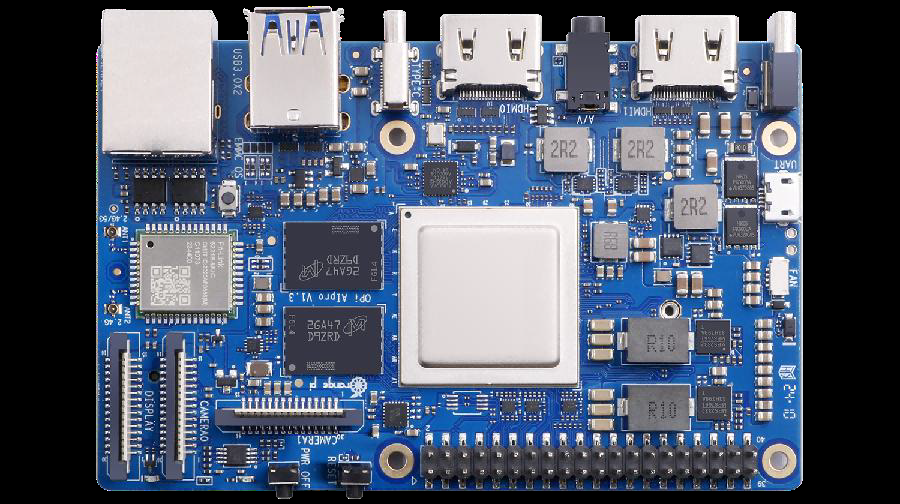{#fig:4 width=70%}

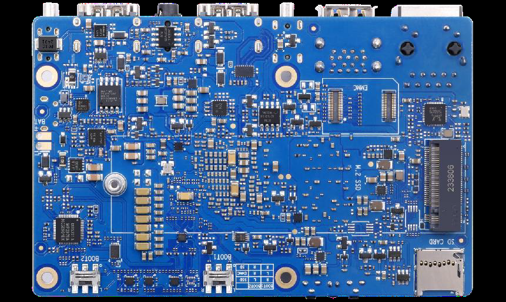{#fig:5 width=70%} -->

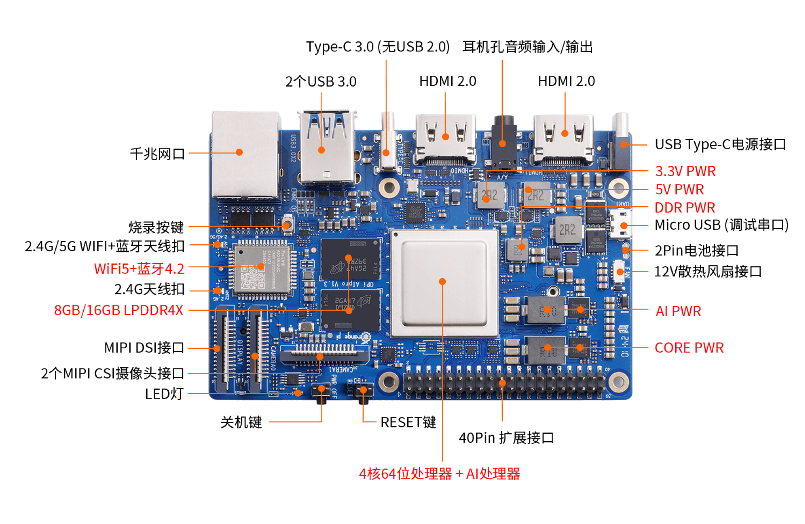{#fig:1 width=100% .center}

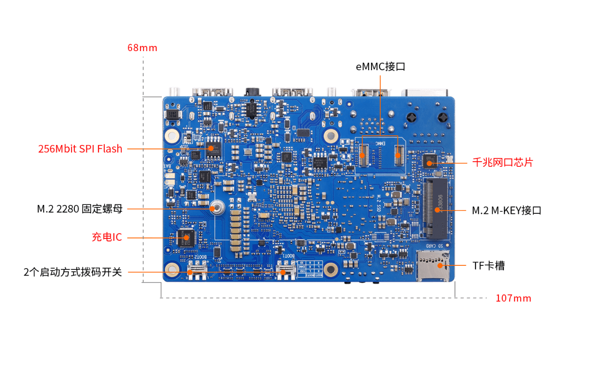{#fig:2 width=100% .center}

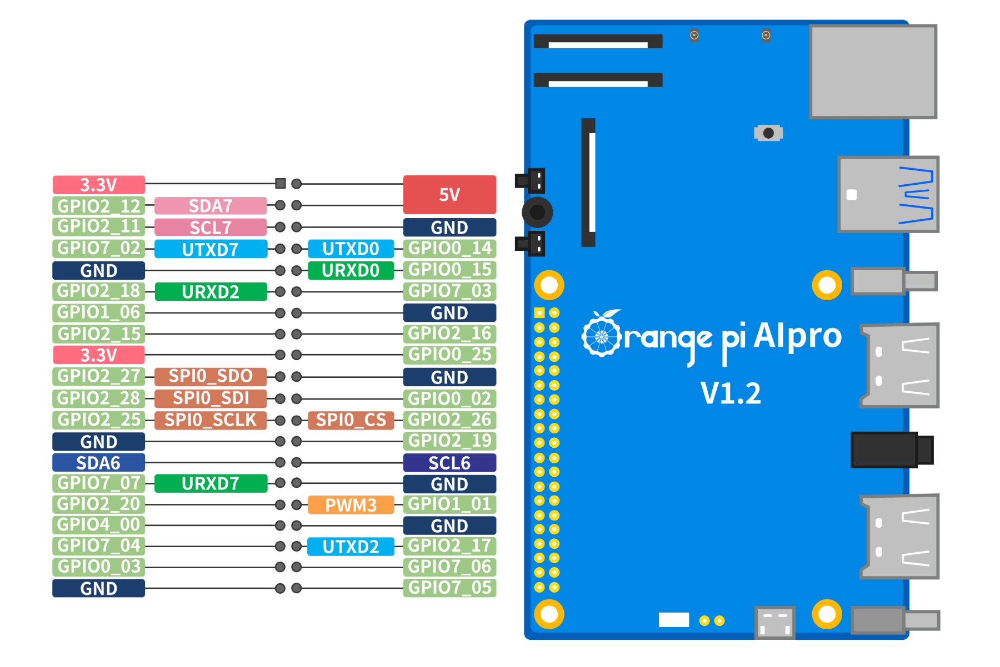{#fig:3 width=70% .center}

--- 

### 开发板硬件规格 {#src-experiment-case0-h3}

## 配件准备 {#src-experiment-case0-h4}

为了顺利进行开发，请准备以下配件：

1. **TF卡**  
   建议使用容量64GB及以上、速率为Class10级以上的闪迪（SanDisk）品牌TF卡。虽然最小支持32GB，但为了避免开发过程中出现磁盘空间不足的问题，推荐使用更大容量。

   {#fig:tf width=30% .center}

2. **TF卡读卡器**  
   用于在电脑上读写TF卡以刷写系统镜像。建议选择USB 3.0速率的读卡器，以减少系统刷写的等待时间。

   {#fig:reader width=30% .center}

3. **HDMI线**  
   开发板配备标准HDMI接口。请根据您的显示器接口类型，准备标准的HDMI线或HDMI转Mini-HDMI/Micro-HDMI线。

   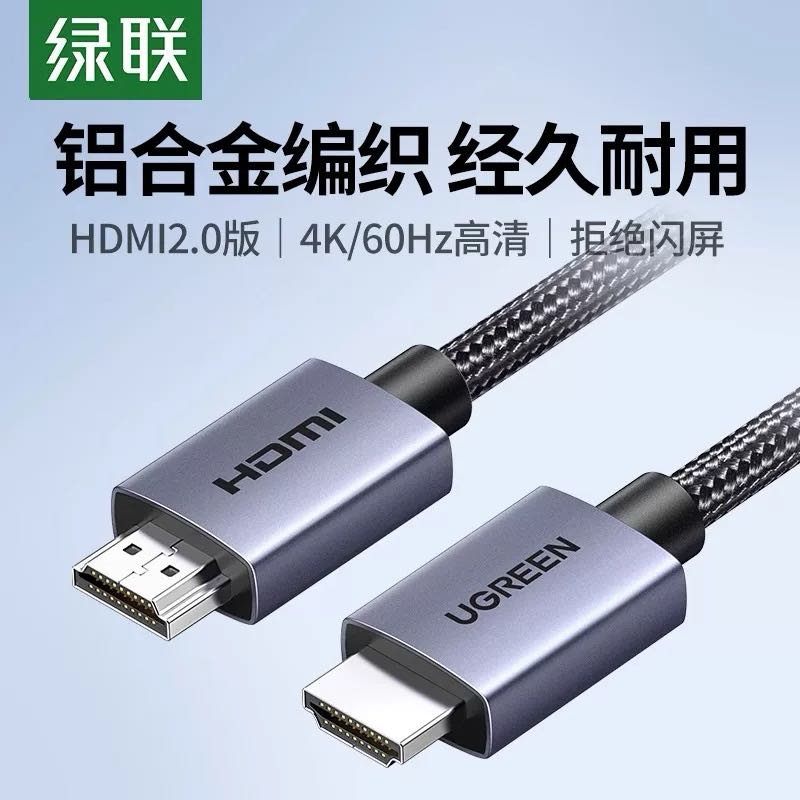{#fig:hdmi width=30% .center}

   {#fig:minihdmi width=30% .center}

4. **电源适配器**  
   开发板采用PD协议供电（20V挡位），功率需求为65W。请务必使用支持PD协议20V输出的65W Type-C电源适配器。

   {#fig:power width=30% .center}

5. **USB鼠标和键盘**  
   用于在本地桌面环境下对开发板进行操作和调试。

6. **金属外壳**  
   用于保护开发板硬件，防止意外短路或物理损伤。

   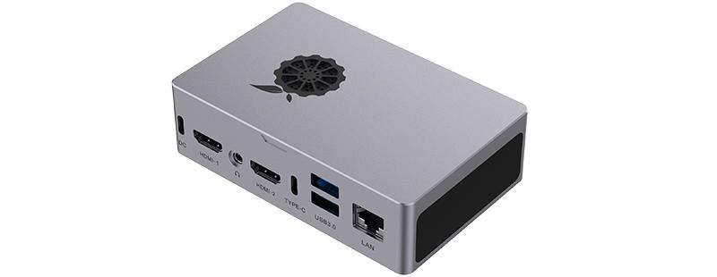{#fig:cover width=70% .center}

7. **散热风扇及散热鳍片**  
   由于昇腾310B处理器在高负载下发热量较大，强烈建议安装主动散热设备。开发板提供2pin风扇接口（12V），支持PWM调速。

   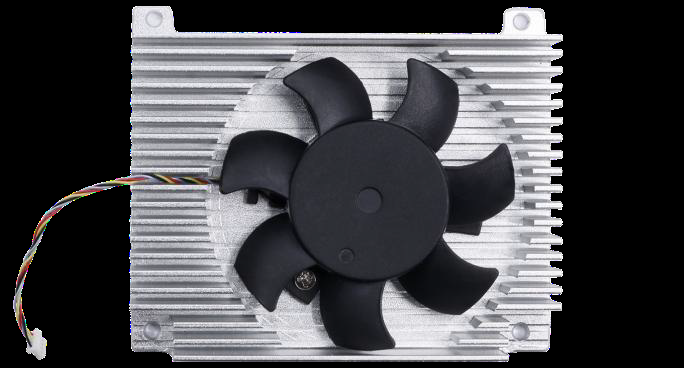{#fig:fan width=40% .center}

8. **Type-C转USB 3.0转接线（可选）**  
   开发板的一个Type-C接口支持USB 3.0协议（不兼容USB 2.0），可通过转接线连接USB 3.0外设。

   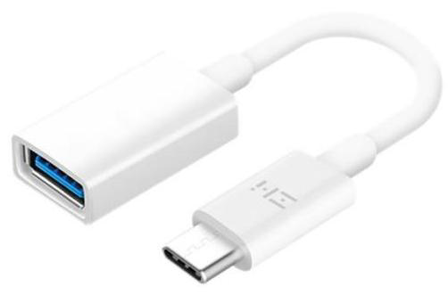{#fig:otg width=30% .center}

9. **M.2 NVMe SSD（可选）**  
   开发板背部的M.2接口支持PCIe协议（2280规格），可安装NVMe SSD作为系统盘或扩展存储。

   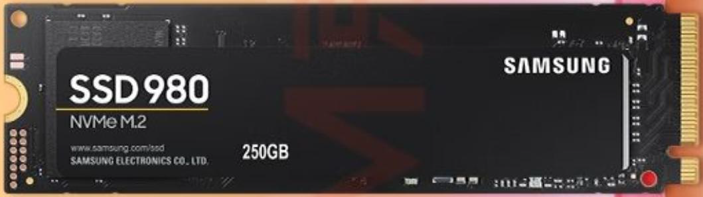{#fig:nvme width=40% .center}

10. **M.2 SATA SSD（可选）**  
    该M.2接口同时也支持SATA协议，因此也可以使用M.2 SATA（NGFF）接口的SSD。

    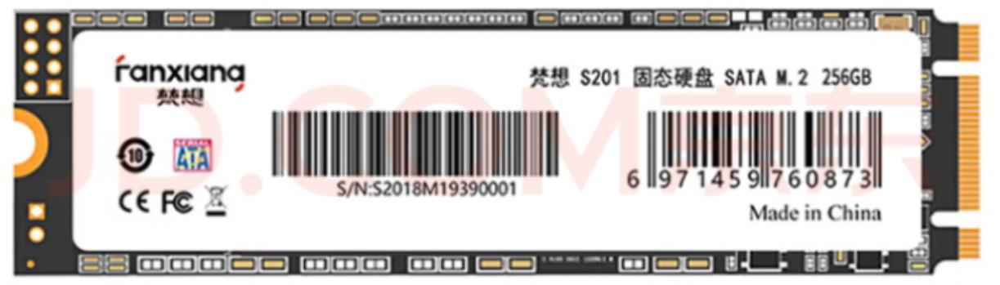{#fig:ngff width=40% .center}

11. **eMMC模块（可选）**  
    eMMC是一种高性能、低功耗的嵌入式存储方案。相比TF卡，eMMC读写速度更快（100-400MB/s）且更稳定。开发板预留了eMMC接口，需额外购买香橙派专用eMMC模块。

    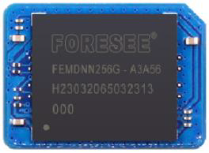{#fig:emmc1 width=30% .center}

    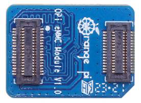{#fig:emmc2 width=30% .center}

12. **USB摄像头（可选）**  
    用于图像识别、视频通话等应用开发。

    {#fig:camera width=40% .center}

13. **网线（可选）**  
    虽然开发板板载Wi-Fi模块，但在需要更稳定网络连接的场景下，建议使用千兆网口连接有线网络。

14. **树莓派IMX219摄像头（MIPI-CSI）（可选）**  
    开发板提供两个MIPI-CSI接口，兼容树莓派IMX219摄像头，可直接连接而无需占用USB接口。

    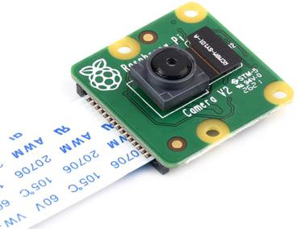{#fig:csi width=30% .center}

15. **MIPI LCD显示屏（可选）**  
    开发板配备MIPI-DSI显示接口，可直接驱动兼容的MIPI显示屏（如树莓派5寸屏），无需外接HDMI显示器。

    {#fig:dsi width=40% .center}

16. **Micro USB数据线（可选）**  
    开发板板载CH343P芯片，将UART调试串口转换为Micro USB接口。使用Micro USB数据线连接电脑，即可进行串口调试。

    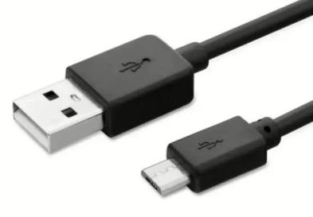{#fig:microusb width=30% .center}

## 操作系统安装 {#src-experiment-case0-h5}

作为华为昇腾生态的重要成员，OrangePi AIpro(8T)支持Ubuntu和openEuler两种操作系统。由于开发板板载无预装系统，我们需要通过电脑将系统镜像刷写到TF卡中。建议使用Windows 11或Ubuntu 22.04及以上版本的PC进行操作。

首先，访问香橙派官网的[技术支持页面](http://www.orangepi.cn/html/hardWare/computerAndMicrocontrollers/service-and-support/Orange-Pi-AIpro.html)。

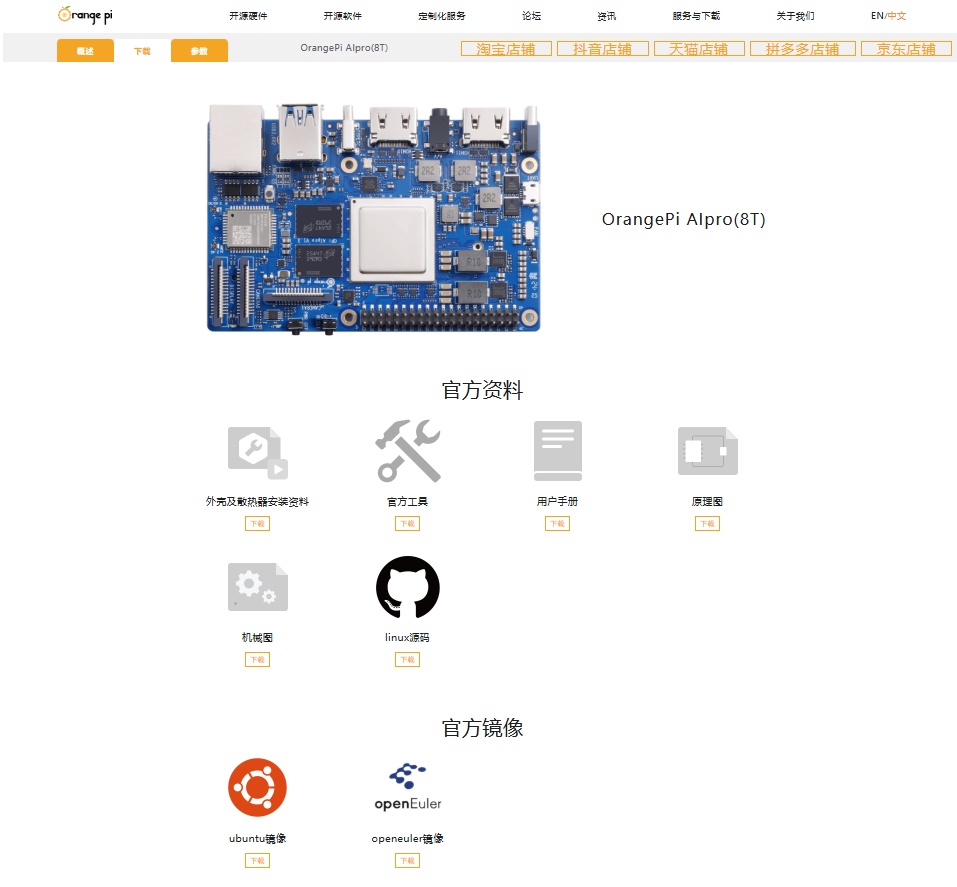{#fig:技术支持 width=70% .center}

在页面下方找到“官方镜像”区域。官方提供了预装昇腾NPU应用环境及软件的Ubuntu和openEuler镜像，极大地方便了开发者快速上手。

{#fig:官方镜像 width=70% .center}

### 镜像下载 {#src-experiment-case0-h6}

#### Ubuntu {#src-experiment-case0-h7}

1. **点击下载**：点击Ubuntu镜像对应的下载按钮。

   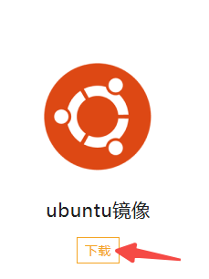{#fig:download_ubuntu width=30% .center}

2. **获取提取码**：复制弹出的百度网盘提取码，并点击跳转链接。

   {#fig:copyandjump width=50% .center}

3. **选择镜像文件**：在网盘中找到名为`Ubuntu`的文件夹并进入。

   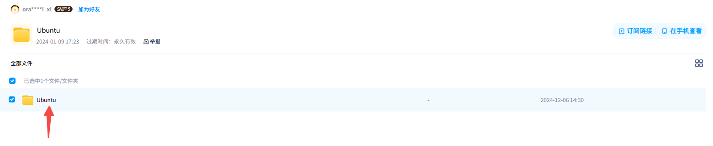{#fig:folder width=100% .center}

4. **文件说明**：
   - `.xz`后缀文件为镜像压缩包。
   - `.sha`后缀文件为MD5校验码，用于验证下载文件的完整性。

5. **选择版本**：
   - **Desktop**：包含GUI图形化界面，适合初学者和需要桌面环境的用户。
   - **Minimal**：仅包含命令行界面，适合高级用户或服务器用途。
   
   **建议初学者下载带有`Desktop`字样的镜像。**

   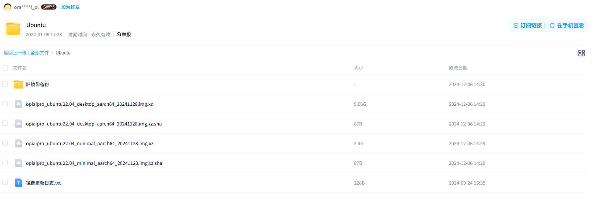{#fig:chooseubuntu width=100% .center}

6. **下载与解压**：下载完成后，请先校验文件完整性，再解压`.xz`压缩包得到`.img`镜像文件。

<!-- #### openEuler

1. **点击下载**：点击openEuler镜像对应的下载按钮。

   {#fig:download_openeuler width=70%}

2. **获取提取码**：复制提取码并跳转。

   {#fig:cpjp width=70%}

3. **选择镜像文件**：在网盘中进入`OpenEuler`文件夹。

   {#fig:folderr width=70%}

4. **选择版本**：目前官方仅提供带有GUI图形化界面的openEuler镜像。

   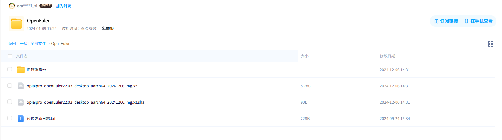{#fig:chooseeuler width=70%}

5. **下载与解压**：同样，下载后请先校验再解压。 -->

### 校验下载文件 (MD5) {#src-experiment-case0-h8}

为了确保下载的镜像文件未损坏，建议在解压前进行MD5校验。

- **Windows**：
  在镜像文件所在文件夹内按住 **Shift** 键并点击鼠标右键，选择“在终端中打开”或“在此处打开Powershell窗口”。输入以下命令（文件名请根据实际情况修改）：

   ```powershell
   certutil -hashfile opiaipro_ubuntu22.04_desktop_aarch64_20241128.img.xz md5
   ```

   将输出的MD5值与同目录下`.sha`文件中的内容进行比对。

   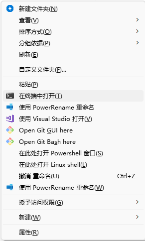{#fig:shell width=30% .center}  

   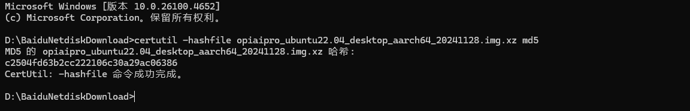{#fig:md5 width=100% .center}

- **Ubuntu**：

   ```bash
   md5sum <filename>
   ```

- **macOS**：

   ```bash
   md5 <filename>
   ```

若校验值一致，说明文件完整，可进行解压；若不一致，请重新下载。

### 刷写系统到TF卡 {#src-experiment-case0-h9}

#### 工具准备 {#src-experiment-case0-h10}

- **下载链接**： [官网](http://www.orangepi.cn/html/hardWare/computerAndMicrocontrollers/service-and-support/Orange-Pi-AIpro.html) ｜ [百度网盘](https://pan.baidu.com/s/1Jho73pw91r5GJD2KijY45Q?pwd=3xuz#list/path=%2F)

1. **SD Card Formatter**：用于格式化TF卡，确保存储卡状态良好。
2. **balenaEtcher**：用于将`.img`镜像文件烧录到TF卡。**注意：建议使用1.19.25及以下版本，以避免兼容性问题。**

#### 格式化TF卡 {#src-experiment-case0-h11}

1. 将TF卡插入读卡器，连接至电脑。
2. 打开 **SD Card Formatter** 软件。

   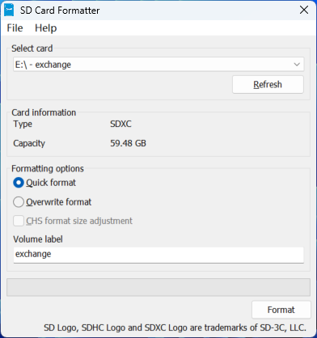{#fig:SDFmt width=50% .center}

3. 确认选中了正确的盘符，点击右下角的 **Format** 按钮。

   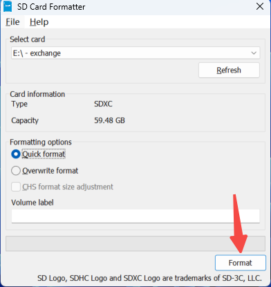{#fig:fmt width=50% .center}
   
   *警告：格式化将清除TF卡上所有数据，请确认无误后点击“是”。*

   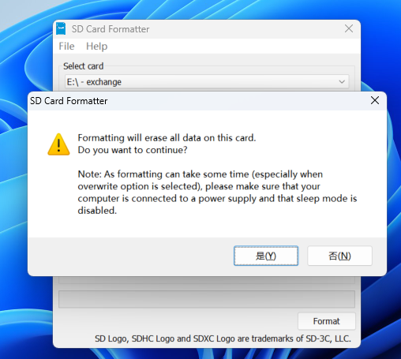{#fig:warning width=50% .center}

4. 等待格式化完成，点击确定。

   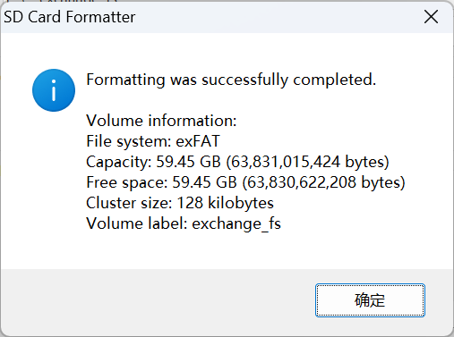{#fig:fmtfin width=50% .center}

#### 烧录镜像（以Ubuntu为例） {#src-experiment-case0-h12}

1. 打开 **balenaEtcher**，选择“Flash from file”（从文件烧录）。

   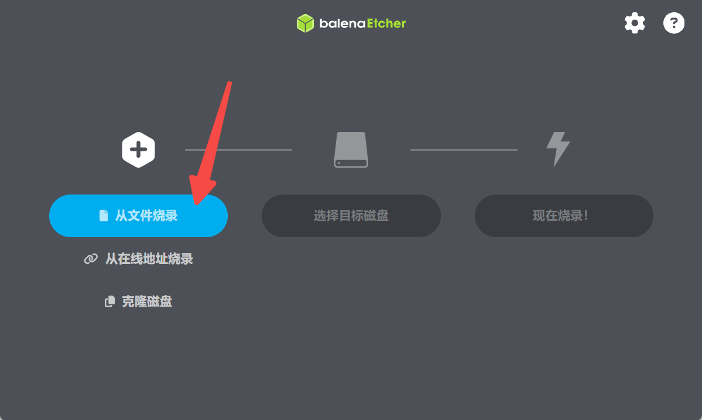{#fig:ether1 width=70% .center}

2. 选择解压后的镜像文件（`.img`格式），然后点击“Select target”选择您的TF卡。

   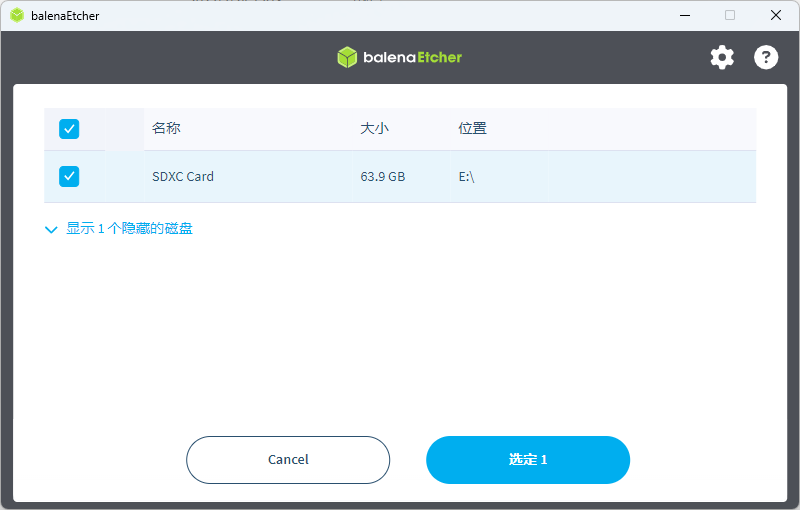{#fig:chooseether width=70% .center}

3. 点击“Flash!”开始烧录。

   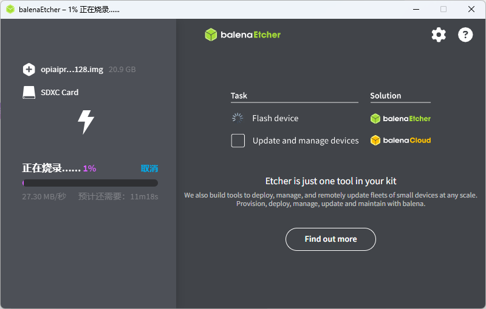{#fig:dd width=50% .center}

4. 烧录完成后软件会自动进行校验，请耐心等待。

   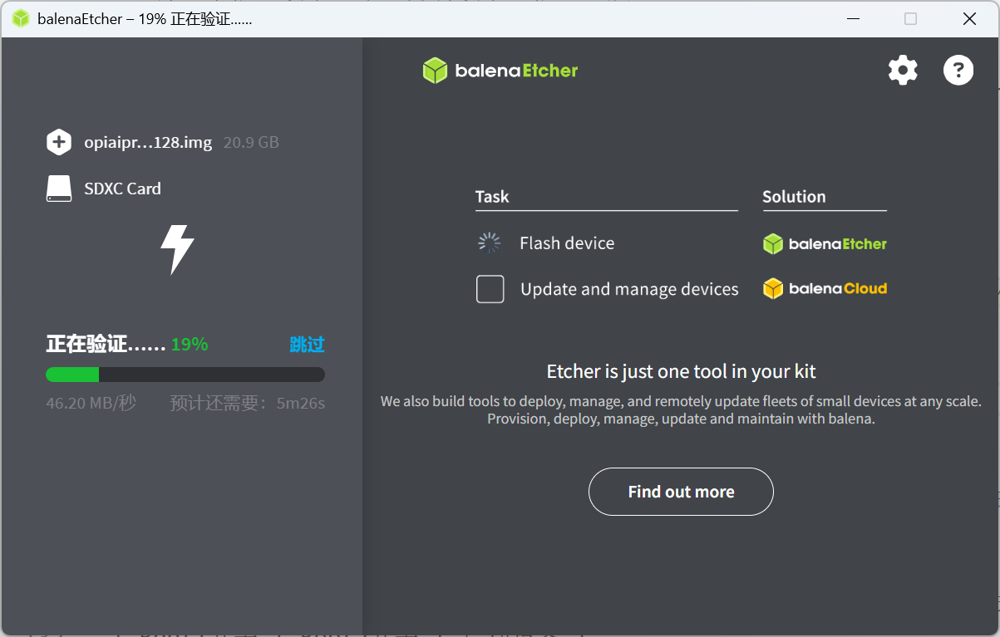{#fig:val width=50% .center}

5. 校验通过后，关闭软件并安全弹出TF卡。

   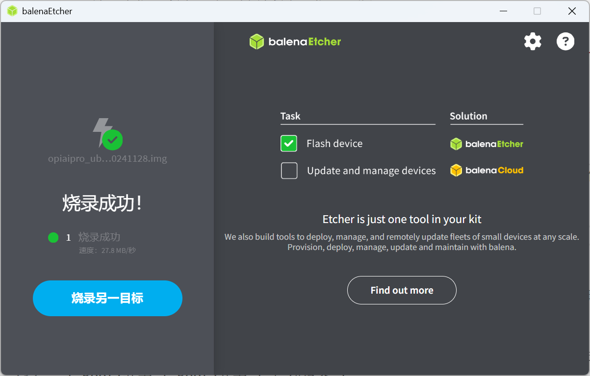{#fig:finish width=50% .center}

#### 其他存储介质说明 {#src-experiment-case0-h13}
- **eMMC**：板载无eMMC，需购买专用模块。刷写方法请参考香橙派用户手册。
- **SSD**：支持M.2 SSD启动，但兼容性有限（仅支持特定品牌型号），且需自行准备。初学者不推荐直接使用SSD作为系统盘。

#### 设置启动模式 {#src-experiment-case0-h14}

开发板支持从TF卡、eMMC或M.2 SSD启动。当连接了多种存储设备时，需通过背面的拨码开关（BOOT开关）指定启动设备。

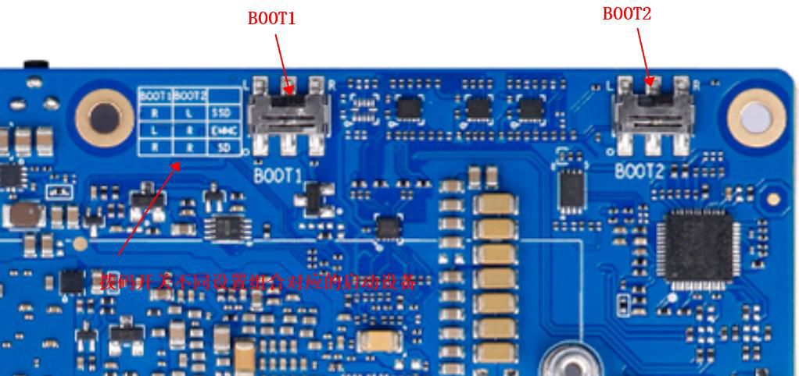{#fig:bootswitch width=50% .center}

拨码开关状态说明（ON方向为1/右，相反为0/左，具体请参考板上丝印或下表）：

| Boot1 | Boot2 | 启动设备 |
| :---: | :---: | :---: |
| 左 | 左 | (未使用) |
| **右** | **右** | **TF卡** |
| 左 | 右 | eMMC |
| 右 | 左 | M.2 SSD |

**注意**：切换拨码开关后，必须**完全断电**（拔掉电源线）再重新上电，新的启动配置才会生效。仅按RESET键重启无效。

## 启动开发板 {#src-experiment-case0-h15}

### 方式一：图形化界面启动 {#src-experiment-case0-h16}

1. **硬件连接**：
   - 将刷写好的TF卡插入开发板插槽。
   - 确认拨码开关均拨至**右侧**（TF卡启动模式）。
   - 将HDMI线连接至**HDMI0**接口（靠近USB 3.0接口的那个）。
   - 连接鼠标和键盘。
   - 最后，接入Type-C电源。

   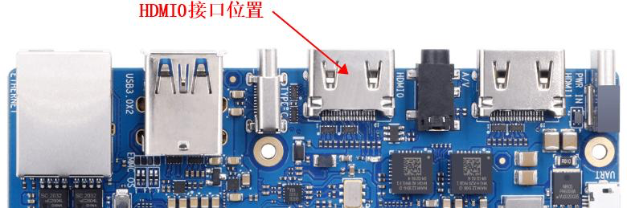{#fig:HDMI0 width=70% .center}  

   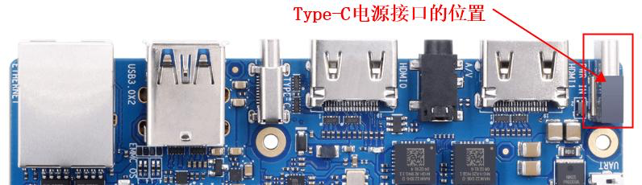{#fig:typecp width=70% .center}

2. **系统启动**：
   - 上电后，风扇会全速旋转，随后声音变小，屏幕显示启动画面。
   - 稍候进入登录界面。

   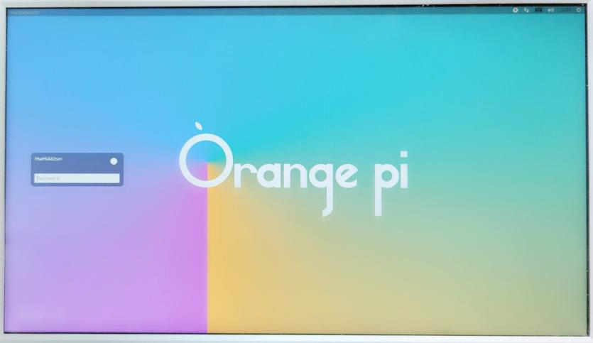{#fig:beforelogin width=70% .center}

3. **登录系统**：
   - 默认普通用户：`HwHiAiUser`，密码：`Mind@123`
   - 默认Root用户：`root`，密码：`Mind@123`
   
   输入密码登录进入桌面环境。
   
   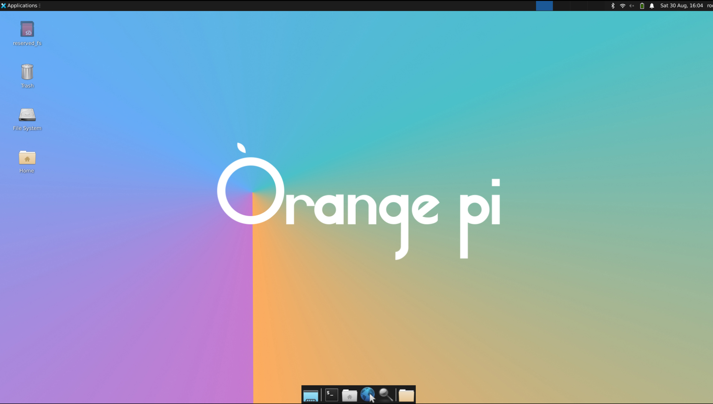{#fig:desktop width=70% .center}  
   
   若无法登陆请检查输入的密码是否正确，大小写以及符号是否正确

   默认账户表格：
   | 用户名 | 密码 |
   | :---: | :---: |
   | root | Mind@123 |
   | HwHiAiUser | Mind@123 |

### 方式二：串口登录 {#src-experiment-case0-h17}

如果暂时没有显示器、键盘和鼠标，也可以通过串口登录开发板。建议初学者使用开发板自带的Micro USB接口，该方法不需要额外接线，只需要一根Micro USB数据线，接入电脑后打开设备管理器查询对应的串口，然后使用PUTTY进行连接即可。

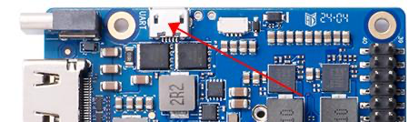{#fig:microusbser width=70% .center}

1. **使用Micro USB数据线连接开发板和电脑，此时请不要给开发板上电。**
2. **打开电脑的设备管理器，选择端口，寻找开发板对应的串口端口号**

   {#fig:ttl width=70% .center}

3. **打开串口调试软件（PUTTY）**  

   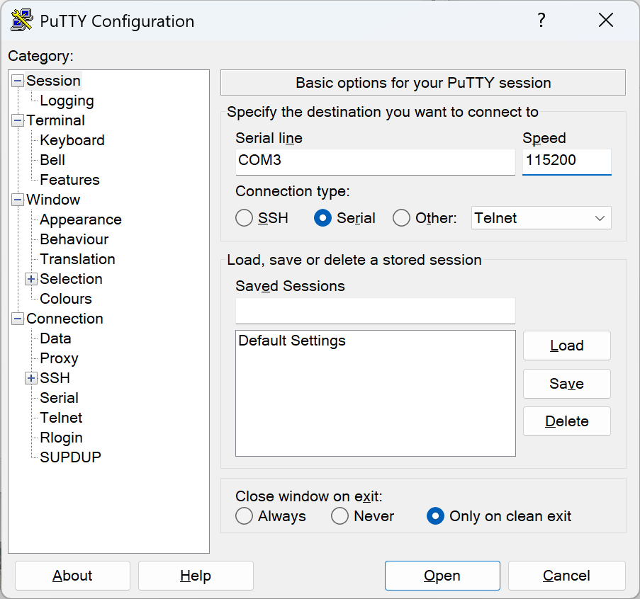{#fig:putty width=70% .center}
   
   将Connection Type选择为```Serial```，然后在Serial Line处将端口号修改为设备管理器中查到的端口号，如作者此处端口号为```COM3```，此外，还需要将Speed从9600修改为115200，最后点击Open打开串口。
4. **给开发板上电，等待出现```Ubuntu 22.04.3 LTS orangepiaipro ttyAM0```字样，输入登录的用户名HwHiAiUser并回车，然后输入密码Mind@123并回车，注意在输入密码的时候屏幕并不会显示任何东西，登陆后的界面如图所示。**  

   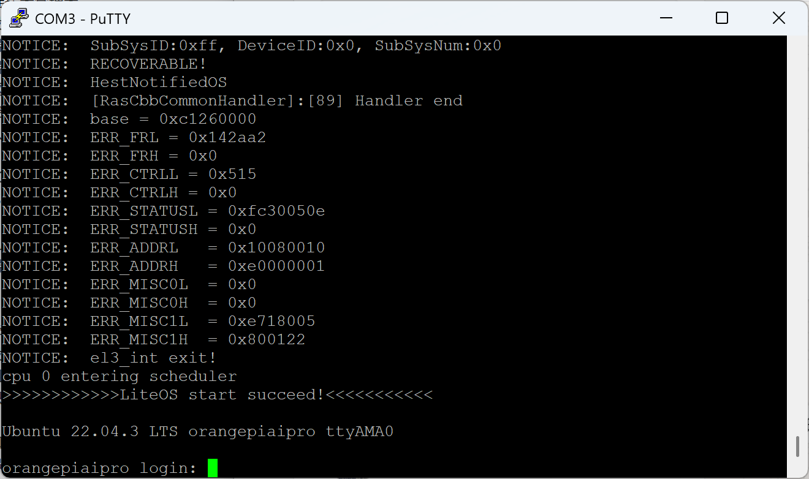{#fig:serial width=70% .center}  

   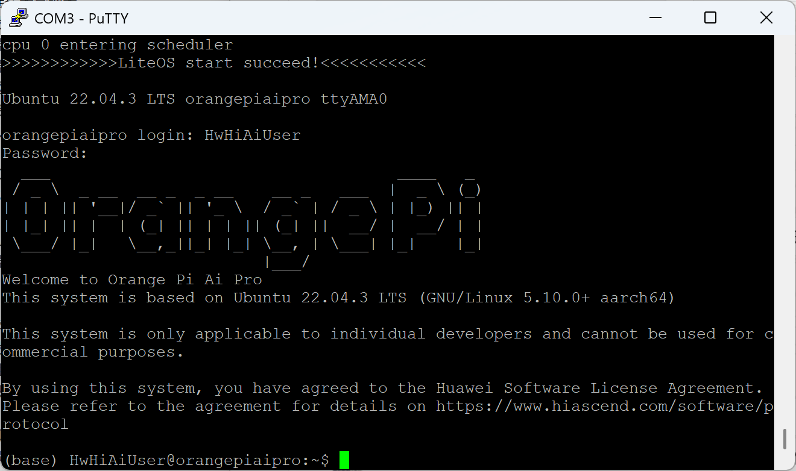{#fig:login width=70% .center}

## 网络连接 {#src-experiment-case0-h18}

### 无线网络连接 (WiFi) {#src-experiment-case0-h19}

开发板板载了WiFi模块，可以通过命令行工具`nmcli`轻松连接无线网络。

1. **扫描WiFi**
   ```bash
   nmcli dev wifi list
   ```

2. **连接WiFi**
   将`<SSID>`替换为你的WiFi名称，`<PASSWORD>`替换为密码。
   ```bash
   nmcli dev wifi connect <SSID> password <PASSWORD>
   ```

3. **查看连接状态**
   ```bash
   nmcli connection show
   ```

如果不熟悉命令参数，也可以使用`nmtui`提供的终端图形界面连接WiFi：

1. **打开NetworkManager终端界面**
   ```bash
   sudo nmtui
   ```
   接着就会出现如下的界面：
   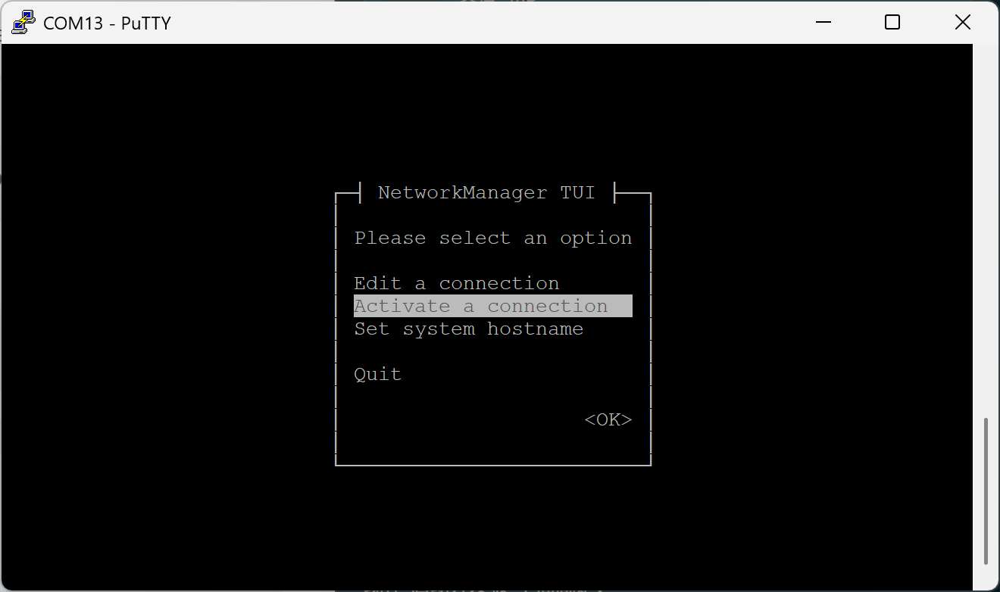
2. **选择无线网络**
   在界面中选择`Activate a connection`，进入连接列表后选择需要连接的WiFi名称。
   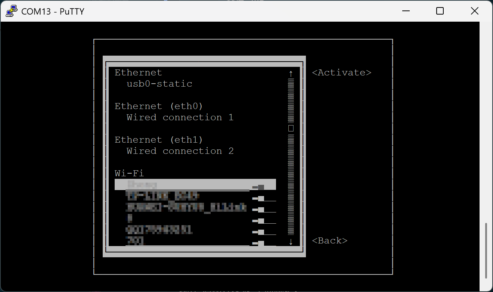
3. **输入密码并连接**
   按提示输入WiFi密码，确认后等待连接状态变为已连接。完成后选择`Back`返回，再选择`Quit`退出。
   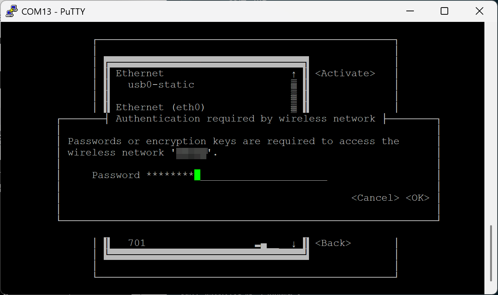

4. **确认网络状态**
   ```bash
   nmcli connection show
   ip addr
   ```

### 有线网络连接 {#src-experiment-case0-h20}

如果有线网络可用，直接插入网线即可。可以通过以下命令查看IP地址：
```bash
ip addr
```
或者
```bash
ifconfig
```

## 远程连接 (SSH) {#src-experiment-case0-h21}

为了方便开发，通常我们会使用个人电脑通过SSH远程连接到开发板。

1. **获取开发板IP地址**
   使用上述`ip addr`命令获取开发板的IP地址（通常在`wlan0`或`eth0`接口下）。

2. **使用SSH客户端连接**
   在你的个人电脑终端（Windows可以使用CMD、PowerShell或Putty，Mac/Linux使用Terminal）中输入：
   ```bash
   ssh HwHiAiUser@<开发板IP地址>
   ```
   例如：
   ```bash
   ssh HwHiAiUser@192.168.1.100
   ```
   默认密码为：`Mind@123`

## 验证开发环境 {#src-experiment-case0-h22}

系统启动并连接网络后，我们需要验证昇腾AI处理器的状态以及开发环境是否正常。

1. **查看NPU状态**
   使用`npu-smi`工具查看NPU的详细信息，包括温度、功耗、算力利用率等。
   ```bash
   npu-smi info
   ```
   如果能看到类似以下的输出，说明NPU工作正常：
   ```text
   +------------------------------------------------------------------------------------------------+
   | npu-smi 23.0.0                       Version: 23.0.0                                           |
   |------------------------------------------------------------------------------------------------|
   | NPU     Name                         Health   Power(W)     Temp(C)           Hugepages-Usage(page) |
   | Chip    Device                       Bus-Id   AICore(%)    Memory-Usage(MB)                        |
   |================================================================================================|
   | 0       310B4                        OK       12.8         45                0    / 0              |
   | 0       0                            0000:00:00.0 0            2433 / 7564                         |
   |================================================================================================|
   ```

2. **检查CANN环境**
   官方镜像通常已预装CANN（Compute Architecture for Neural Networks）。可以通过检查环境变量或运行简单命令来确认。
   通常环境变量设置在`.bashrc`中，尝试执行：
   ```bash
   echo $ASCEND_HOME_PATH
   ```
   或者检查编译器版本：
   ```bash
   c++ --version
   ```

## 结语 {#src-experiment-case0-h24}

至此，你的昇腾310B开发板（OrangePi AIpro）已经完成了基本的环境搭建。接下来，你可以进入[案例1：智能打卡机](./case1.md)的学习，开始你的第一个AI应用开发之旅。
