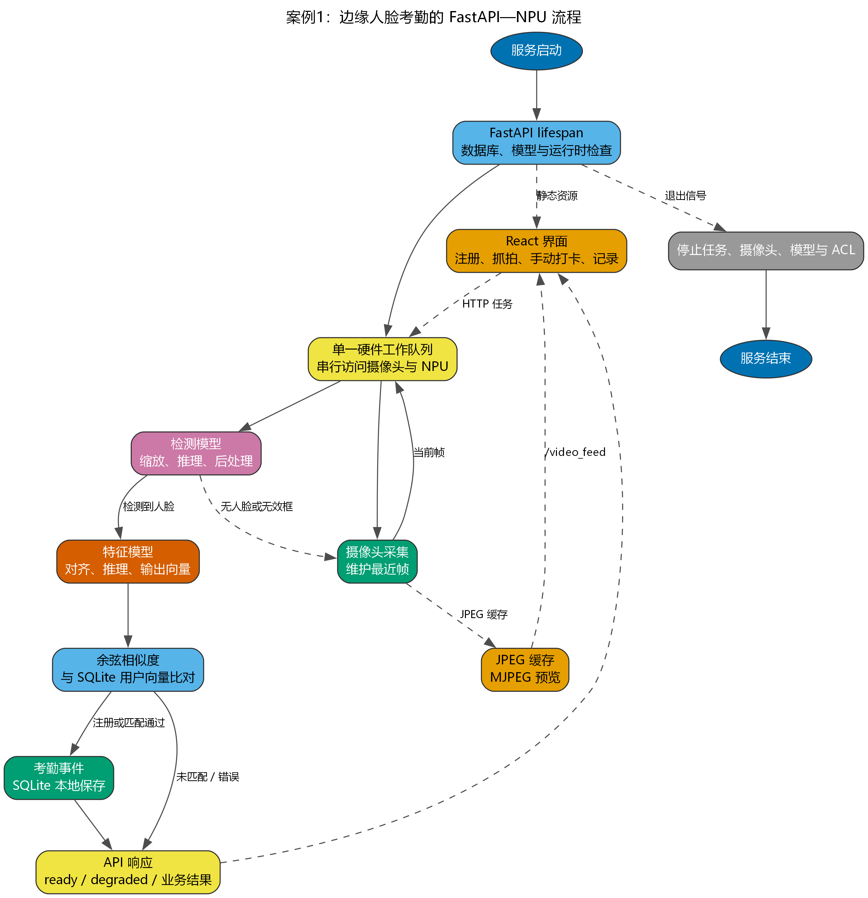

# 案例 1：基于 RetinaFace 与 ArcFace 的智能人脸识别考勤系统

## 教程定位 {#src-experiment-case1-h1}

本案例旨在利用昇腾 310B 的强大 AI 算力，构建一个功能完整、响应迅速的智能人脸识别打卡系统。系统通过 USB 摄像头实时捕捉视频流，检测画面中的人脸，并与预先注册的员工人脸数据库进行比对，完成身份验证和自动记录考勤。

本案例的设计初衷是为开发者提供一个端到端的边缘 AI 应用范例，涵盖了以下核心知识点：

1. **高性能推理加速**：利用昇腾 PyACL 接口直接驱动 NPU，实现 RetinaFace 检测与 ArcFace 识别的硬件加速。
2. **端到端流水线**：建立从“视频流采集 -> 人脸检测 -> 人脸对齐 -> 特征提取 -> 特征比对 -> 数据库存取”的完整业务链路。
3. **嵌入式 Web 交互**：通过 Flask 框架构建轻量级管理后端，支持远程监控、用户注册与考勤导出。
4. **边缘存储实践**：使用 SQLite 数据库在本地高效存储用户特征向量（Embedding）与考勤记录。

从整体结构看，本案例对应一条标准的生物特征识别流水线：

{#fig:face_flow width=60% .center}

本案例选择的实现路线是：
* 使用 **RetinaFace** 完成鲁棒的人脸检测。
* 使用 **ArcFace** 完成高精度的特征提取。
* 使用 **SQLite** 进行本地数据持久化。
* 使用 **Python Flask** 提供现代化的 Web 交互界面。

## 实验硬件与运行条件 {#src-experiment-case1-h2}

为了完成实时人脸识别与考勤实验，建议准备如下硬件条件：

* **昇腾 310B 开发者套件** (如 OrangePi AIpro)
* **USB 摄像头** (支持 640x480 及以上分辨率)
* **显示设备 (可选)**: HDMI 显示器或通过 Web 远程访问
* **CANN 软件栈**: 7.0 或更高版本
* **Python 环境**: 3.9 或更高版本，需安装 `flask`, `opencv-python`, `numpy<2.0`, `sqlite3` 等

运行方式：
* **本地模式**：直接运行 `python3 app.py`，后台线程会自动处理本地 USB 摄像头。
* **Web 模式**：通过浏览器访问 `http://<开发板IP>:5000` 进行管理和手动打卡。

## 本案例支持的模型结构 {#src-experiment-case1-h3}

当前仓库里的模型基于 InsightFace 提供的轻量化版本，经过 `atc` 工具转换为 `.om` 格式：

* **检测模型 (RetinaFace)**: `face_detection.om`
    * 输入尺寸: `640 x 640`
    * 输出: 多尺度分数 (Scores) 与边界框偏移量 (BBoxes)
* **识别模型 (ArcFace)**: `face_recognition.om`
    * 输入尺寸: `112 x 112` (对齐后的人脸切片)
    * 输出: `512` 维特征向量 (Embedding)

这两类模型共同构成了“检测-对齐-识别”的经典人脸分析链路。

## 人脸识别系统的核心流水线 {#src-experiment-case1-h4}

人脸识别不仅仅是“看一眼”，它包含了一系列精细的图像处理步骤：

1. **检测 (Detection)**：在复杂的背景中定位人脸的具体位置。
2. **对齐与裁剪 (Alignment & Cropping)**：根据检测到的关键点，将人脸旋转至正位并裁剪为固定尺寸（如 112x112），以消除姿态影响。
3. **特征提取 (Feature Extraction)**：将图像编码为一个具有高度代表性的固定长度向量（512 维）。
4. **比对 (Matching)**：计算当前向量与数据库中已知向量的相似度（如余弦相似度）。

## RetinaFace 深度剖析：从“看见”到“看懂”人脸 {#src-experiment-case1-h5}

RetinaFace 不仅仅是一个检测人脸框的工具，它是一个精密的、为解决现实世界中各种复杂人脸检测问题而设计的深度学习模型。要理解它的价值，我们需要先了解它的历史背景和设计哲学。

### RetinaFace 的发展历史与作者信息 {#src-experiment-case1-h6}

RetinaFace 模型由 **InsightFace** 团队发布，该团队在人脸识别领域享有盛誉，其开源的 `insightface` 代码库已成为学术界和工业界广泛使用的基准。RetinaFace 的提出，正是在单阶段目标检测器（如 SSD、YOLO）性能大幅提升，但通用检测器在人脸这种特定任务上仍有优化空间的背景下诞生的。

它的设计目标非常明确：创建一个在速度和精度上都达到顶尖水平，并且能同时处理人脸框、关键点乃至 3D 姿态的**一体化解决方案**。它借鉴了通用目标检测器 **RetinaNet** 的核心思想，并针对人脸任务的特性进行了深度定制。

### RetinaFace 到底在解决什么问题？ {#src-experiment-case1-h7}

在真实场景中，“找到一张脸”远比想象的复杂。RetinaFace 主要致力于解决以下几个核心挑战：

1.  **尺度变化巨大**：从合影中的微小人脸到监控下的特写人脸，尺寸差异可能达到上百倍。
2.  **姿态与遮挡**：侧脸、低头、被口罩或手部分遮挡的人脸，都需要被准确识别。
3.  **密集场景**：在人群中，大量人脸紧密排列，容易产生漏检或错误的合并检测。
4.  **实时性要求**：在边缘设备上，检测速度必须足够快，才能支撑实时应用。

### 核心技术解析 {#src-experiment-case1-h8}

RetinaFace 的强大性能源于其对多个关键技术的巧妙融合。

#### 1. 单阶段检测器与多任务学习 {#src-experiment-case1-h9}

与需要先生成候选区域再进行分类的两阶段检测器（如 Faster R-CNN）不同，RetinaFace 是一个**单阶段（One-Stage）检测器**。它直接在特征图上预测目标的位置和类别，速度更快。更重要的是，它采用**多任务学习（Multi-task Learning）**框架，让一个网络同时完成多项任务：

*   **人脸分类**：判断某个区域是人脸还是背景。
*   **边界框回归**：精调人脸框的位置。
*   **关键点定位**：预测眼睛、鼻子、嘴角等 5 个关键点的位置。

这种设计不仅提升了效率，而且关键点定位任务的加入，反过来为模型提供了更丰富的监督信息，有助于更准确地识别人脸区域，尤其是对于部分遮挡的人脸。

#### 2. 特征金字塔网络 (FPN) {#src-experiment-case1-h10}

为了解决尺度变化问题，RetinaFace 采用了**特征金字塔网络（Feature Pyramid Network, FPN）**。FPN 的思想是“高层特征看语义，底层特征看细节”。它通过自顶向下的路径和横向连接，将高层特征图中丰富的语义信息与底层特征图中高分辨率的细节信息相融合，从而在多个不同尺度的特征图上进行预测。这意味着，大的特征图负责检测小人脸，小的特征图负责检测大人脸，实现了对各种尺寸人脸的“全覆盖”。

#### 3. 上下文感知模块 (SSH) {#src-experiment-case1-h11}

为了进一步增强特征的表达能力，RetinaFace 在 FPN 的每个预测层后都引入了 **SSH（Single Stage Headless）模块**。SSH 模块通过并行的、具有不同大小卷积核的通路来提取特征，并将它们拼接在一起。这就像给模型装上了“广角镜”和“长焦镜”，使其能够同时关注一个区域的局部细节和它周围的上下文信息，从而在复杂背景或人脸密集的情况下做出更鲁棒的判断。

#### 4. 焦点损失 (Focal Loss) 的启示 {#src-experiment-case1-h12}

虽然 RetinaFace 的论文没有将焦点损失（Focal Loss）作为其核心创新点，但这个概念对于理解所有现代单阶段检测器至关重要。在人脸检测中，一张图像里绝大部分区域都是背景（负样本），只有极少数区域是人脸（正样本）。这种**正负样本的极端不平衡**会导致模型训练时被大量简单的背景样本主导，而忽略了对困难人脸样本的学习。

Focal Loss 通过一个动态缩放因子，降低了大量简单负样本在损失计算中的权重，使得模型能够更专注于学习那些难以区分的正样本和困难负样本。RetinaFace 正是受益于这种思想，才能在复杂的背景中精准地“聚焦”于人脸。

### 在本案例中的应用 {#src-experiment-case1-h13}

在我们的智能考勤系统中，RetinaFace 作为整个识别流程的“眼睛”，其作用至关重要：

*   **提供高质量输入**：它为后续的 ArcFace 识别模块提供了准确的人脸边界框和关键点。只有检测得准，后续的对齐和识别才有可能成功。
*   **保证实时性能**：通过在昇腾 310B NPU 上的高效推理，它确保了系统能够对视频流进行逐帧处理而不会出现明显卡顿，这是实现“自动打卡”功能的基础。
*   **鲁棒性保障**：得益于其先进的设计，即使在光线不佳、人员走动或部分遮挡的情况下，系统依然能维持较高的检测成功率。

## ArcFace 深度剖析：让特征在角度空间中更具区分度 {#src-experiment-case1-h14}

ArcFace 是人脸识别流程的“大脑”，负责将检测到的人脸图像转化为一个高度浓缩且易于比较的 512 维特征向量（Embedding）。它的成功并非偶然，而是建立在人脸识别损失函数长期演进的基础之上。

### 从 Softmax 到度量学习：损失函数的演进之路 {#src-experiment-case1-h15}

在深度学习的早期，人脸识别通常被当作一个多分类问题来处理。例如，在一个包含 1000 个人的数据集中，模型会尝试将输入的人脸图像正确分类到这 1000 个类别中的某一个。这个过程通常使用 **Softmax Loss**。

*   **Softmax Loss 的局限**：Softmax 的目标是让不同类别能够被分开，但它并不强制要求“同一类”的样本在特征空间中靠得足够近，也未要求“不同类”的样本离得足够远。这导致在面对从未见过的新人脸（开集识别）时，模型泛化能力不足。

为了解决这个问题，研究者们开始探索**度量学习（Metric Learning）**的思想，其核心目标是直接在特征空间中优化距离：最大化类间距离，最小化类内距离。

#### 1. SphereFace (A-Softmax) {#src-experiment-case1-h16}

SphereFace 首次提出，在计算角度时应该引入一个**角度间隔（Angular Margin）**。它将传统的 Softmax 中的权重与特征的点积 $W^T x$ 修改为 $\|W\|\|x\|\cos(\theta)$，并通过对权重 $W$ 的归一化，将特征学习过程约束在一个单位超球面上。然后，它在目标类别的角度 $\theta_y$ 上乘以一个整数 $m$，变成了 $\cos(m\theta_y)$。这样一来，分类的决策边界从简单的线性边界变成了角度边界，强制模型学习到角度区分度更强的特征。

#### 2. CosFace (LMCL) {#src-experiment-case1-h17}

CosFace 认为 SphereFace 的乘性间隔 $m\theta_y$ 会导致训练不稳定。因此，它提出了一种更简单、更稳定的**加性余弦间隔（Additive Cosine Margin）**。它直接在余弦空间中减去一个常数 $m$，将决策边界从 $\cos(\theta_y)$ 变为 $\cos(\theta_y) - m$。这种方式在实现上更简单，训练过程也更平滑。

### ArcFace 的核心创新：加性角度间隔 {#src-experiment-case1-h18}

ArcFace (Additive Angular Margin Loss) 结合了前两者的优点，并做出了关键性的改进。它的作者同样来自 **InsightFace** 团队，这保证了从检测到识别的算法思想一脉相承。

ArcFace 认为，无论是在余弦空间还是角度空间进行乘性操作，都有些间接。最直接、最有效的方式，应该是在**角度空间**中直接增加一个**加性间隔（Additive Angular Margin）**。

它的数学形式是将决策边界从 $\cos(\theta_y)$ 修改为 $\cos(\theta_y + m)$。

这个看似微小的改动，却带来了巨大的优势：

*   **几何意义明确**：直接在超球面上的测地距离（Geodesic Distance）上增加了一个恒定的角度惩罚项 $m$。这意味着，模型不仅要正确识别人脸，还必须保证该人脸的特征向量与对应类中心的夹角，要比与其他所有类中心的夹角**至少小 $m$ 度**。这个要求非常严格，极大地提升了特征的区分度。
*   **训练更稳定**：相比 SphereFace 的乘性间隔，加性间隔的设计更加稳定，更容易收敛。
*   **性能卓越**：ArcFace 在几乎所有主流人脸识别评测基准上都取得了当时的最佳性能，证明了其设计的有效性。

<!-- {#fig:loss_comp width=70% .center} -->

上图直观地展示了不同损失函数下的决策边界。可以看到，ArcFace 的决策边界（绿色虚线）相比其他损失函数，对类内样本的约束更强，类间间隔也更大。

### 在本案例中的应用 {#src-experiment-case1-h19}

在本考勤系统中，ArcFace 的作用是赋予系统“认识”人的能力：

1.  **生成高质量 Embedding**：对于每一张注册的人脸，ArcFace 都会生成一个 512 维的特征向量。这个向量就是这张脸在数学空间中的“身份证”。
2.  **实现精准比对**：当一个新的人脸被检测到后，系统同样会提取其特征向量。通过计算这个新向量与数据库中所有已注册向量的**余弦相似度**，我们可以快速找到最相似的用户。
3.  **高可靠性**：由于 ArcFace 学习到的特征具有极强的类内紧凑性和类间分离性，因此即使在光照变化、表情变化甚至轻微遮挡的情况下，识别的准确率和召回率依然非常高，误识率极低。这对于一个严肃的考勤应用至关重要。

## 数据存储与检索深度剖析：边缘场景下的智慧与权衡 {#src-experiment-case1-h20}

如果说模型是系统的大脑，那么数据存储就是系统的记忆。本案例采用 SQLite 存储用户特征和考勤记录，这个选择背后体现了边缘计算场景下的典型工程权衡。

### 为什么选择 SQLite？ {#src-experiment-case1-h21}

在动辄使用 MySQL、PostgreSQL 或云数据库的时代，选择 SQLite 似乎有些“复古”。但在昇腾 310B 这样的边缘设备上，它却是最合适的选择之一：

1.  **轻量级与零配置**：SQLite 是一个库，而不是一个独立的服务器进程。它直接将整个数据库存储为一个单一的文件（`attendance.db`），无需安装、无需配置、无需管理用户权限，极大地降低了部署和维护的复杂度。
2.  **资源占用极低**：它对内存和 CPU 的占用非常小，这对于资源本就紧张的边缘设备至关重要，可以确保更多的计算资源留给核心的 AI 推理任务。
3.  **事务支持**：尽管轻量，SQLite 依然提供了完整的 ACID 事务支持，保证了数据操作的原子性、一致性、隔离性和持久性，确保了考勤数据不会因为意外中断而损坏。
4.  **Python 内置支持**：Python 的标准库 `sqlite3` 直接提供了对 SQLite 的支持，无需安装任何额外的驱动包，进一步简化了开发。

### 特征向量的存储：BLOB 格式的优与劣 {#src-experiment-case1-h22}

本案例将 512 维的人脸特征向量（一个包含 512 个浮点数的 `numpy` 数组）直接转换为二进制数据，并存储在数据库的 **BLOB (Binary Large Object)** 类型字段中。

```python
# In database.py
def add_user(name, embedding):
    # embedding 是一个 numpy 数组
    conn = sqlite3.connect(DB_NAME)
    c = conn.cursor()
    # 将 numpy 数组转换为二进制格式存入 BLOB 字段
    c.execute('INSERT INTO users (name, embedding) VALUES (?, ?)', (name, embedding))
    # ...
```

这种做法的**优点**非常明显：

*   **简单高效**：直接存储原始二进制数据，无需进行任何格式转换，读写速度快。
*   **精度无损**：避免了将浮点数转为字符串等可能引入精度损失的操作。

但它的**缺点**也同样突出：

*   **数据库“不理解”数据**：对于 SQLite 来说，BLOB 字段里存的只是一堆无意义的二进制数据。它无法理解这是一个 512 维的向量，因此也无法在数据库层面进行任何向量相关的运算，比如计算距离或相似度。

### 当前的检索方案：简单遍历 {#src-experiment-case1-h23}

正是由于数据库无法直接操作向量，本案例的识别流程采用了最简单直接的**暴力检索（Brute-force Search）**方案：

1.  当一个新的人脸出现时，计算其特征向量 $V_{curr}$。
2.  从数据库中**取出所有**已注册用户的特征向量，加载到内存中形成一个列表 $[V_1, V_2, ..., V_n]$。
3.  在内存中，使用 `numpy` 逐一计算 $V_{curr}$ 与列表中每个向量的余弦相似度。
4.  找到相似度最高且超过阈值的用户作为识别结果。

这个方案在用户规模较小（如几十人或几百人）时是完全可行的，因为现代 CPU 进行几百次 512 维向量的点积运算耗时极短，远低于视频帧率的间隔。

### 性能瓶颈与未来展望 {#src-experiment-case1-h24}

然而，当用户规模从几百人扩大到几千人、几万人甚至更多时，上述暴力检索方案的性能瓶颈会立刻显现。每次识别都需要遍历整个数据库，计算量会随着用户数量线性增长，最终导致识别延迟变得无法接受。

为了解决大规模向量检索的问题，工业界发展出了一系列**近似最近邻（Approximate Nearest Neighbor, ANN）**搜索技术和专门的**向量数据库**。其核心思想是：不再保证 100% 找到最相似的向量，而是通过构建特殊的索引结构（如树、图、哈希等），在牺牲极少量精度的前提下，将检索速度提升几个数量级。

如果本系统需要向上扩展，可以考虑以下演进路径：

*   **集成 ANN 库**：在应用层面集成如 **Faiss**（由 Facebook AI 开发）或 **ScaNN**（由 Google 开发）这样的高性能向量检索库。数据仍然可以存储在 SQLite 中，但在系统启动时，将所有向量加载到内存中构建 Faiss 索引，后续检索直接通过该索引进行。
*   **迁移到向量数据库**：当数据规模和并发请求进一步增大时，可以考虑使用专门的向量数据库，如 **Milvus** 或 **Weaviate**。这些系统不仅内置了高效的 ANN 索引算法，还提供了完整的分布式、高可用的数据管理方案，是处理海量向量数据的终极解决方案。

因此，本案例采用的 SQLite + BLOB + 暴力检索的方案，是在边缘计算资源受限、用户规模可控的特定场景下的最佳实践。它体现了“**简单、有效、满足当前需求**”的工程设计原则，同时也为未来的系统扩展留下了清晰的演进路径。

## PyACL 深度剖析：与昇腾 NPU 对话的艺术 {#src-experiment-case1-h25}

`ascend_inference.py` 是本案例与昇腾 NPU 硬件沟通的桥梁。它通过 `pyacl` 库，将上层的 Python 指令转化为底层硬件可以理解的指令。理解其工作流程，是掌握昇腾平台开发的关键。

### 什么是 ACL？为什么需要它？ {#src-experiment-case1-h26}

在深入代码之前，我们先理解一个基本问题：为什么不能直接用 Python 调用 NPU？

想象一下，NPU 就像一个只会说”机器语言”的超级计算专家，而我们的 Python 程序说的是”人类语言”。它们之间需要一个翻译官，这个翻译官就是 **ACL (Ascend Computing Language，昇腾计算语言)**。

ACL 提供了一套标准化的 API 接口，让我们可以用相对高级的语言（如 Python、C++）来：
- 管理 NPU 硬件资源（设备、内存、计算队列）
- 加载和运行 AI 模型
- 在 CPU 和 NPU 之间传输数据
- 监控和调试推理过程

可以把 ACL 理解为 NPU 的”操作系统接口”，就像我们通过操作系统 API 来使用 CPU 和内存一样。

### 昇腾计算语言 (ACL) 的标准工作流 {#src-experiment-case1-h27}

在昇腾平台上进行一次完整的模型推理，通常遵循一个非常标准且结构化的流程。这个流程可以被概括为”初始化-执行-释放”三大阶段。

让我们用一个生活化的比喻来理解整个流程：把 NPU 推理想象成去餐厅吃饭。

<!-- {#fig:acl_wf width=80% .center} -->

#### 阶段一：资源初始化（进入餐厅，找座位） {#src-experiment-case1-h28}

1.  **ACL 初始化 (`acl.init`)**: 这是与硬件沟通的第一步。它负责加载底层驱动，建立与硬件的连接。一个进程中只需调用一次。

    *比喻*：这就像推开餐厅的大门，告诉服务员”我来了”。只需要在进门时做一次。

2.  **设备与上下文管理 (`acl.rt.set_device`, `acl.rt.create_context`)**:
    *   `set_device`：指定我们要使用哪一块 NPU 设备（对于只有一个 NPU 的开发板，通常是设备 0）。
    *   `create_context`：为当前线程创建一个独立的执行上下文。这个上下文管理着队列、事件和内存等所有与该线程相关的资源，确保多线程环境下的资源隔离。

    *比喻*：`set_device` 就像选择在哪个餐厅用餐（如果你有多家连锁店可选）。`create_context` 就像服务员给你安排了一个专属的座位和餐具，这些资源只属于你这一桌，不会和其他客人混淆。

在 `ascend_inference.py` 的 `AscendSystem` 类中，这个过程被封装在 `_init_resource` 方法里，确保了系统启动时资源的正确准备。

```python
# In ascend_inference.py -> AscendSystem
class AscendSystem:
    def __init__(self, device_id=0):
        # ...
        self._init_resource()

    def _init_resource(self):
        ret = acl.init() # 1. ACL 初始化 - 推开餐厅大门
        ret = acl.rt.set_device(self.device_id) # 2. 设置设备 - 选择餐厅
        self.context, ret = acl.rt.create_context(self.device_id) # 2. 创建上下文 - 分配座位
        self.stream, ret = acl.rt.create_stream() # 创建计算流 - 叫来服务员
        # ...
```

3.  **创建 Stream (计算流)**: Stream 是一个任务队列，所有提交给 NPU 的计算任务都会按顺序在这个队列中执行。

    *比喻*：这就像餐厅的服务员，你点的菜会按顺序送到厨房，厨房按顺序做菜。

#### 阶段二：模型执行（点菜、上菜、吃饭） {#src-experiment-case1-h29}

3.  **模型加载 (`acl.mdl.load_from_file`)**: 将编译好的 `.om` 离线模型从硬盘加载到 NPU 的内存中。加载后，我们会得到一个模型 ID，后续所有操作都通过这个 ID 来引用该模型。

    *比喻*：这就像把菜单（模型文件）交给厨房，厨房记住了你要的菜（模型 ID），之后你只需要说"上第 3 号菜"就行了。

    ```python
    # In ascend_inference.py -> AscendModel
    def _load_model(self):
        self.model_id, ret = acl.mdl.load_from_file(self.model_path)
        # 获取模型描述信息（输入输出的形状、大小等）
        self.desc = acl.mdl.create_desc()
        ret = acl.mdl.get_desc(self.desc, self.model_id)
    ```

4.  **内存分配与数据准备**: 这是最核心也最容易出错的环节。

    *比喻*：在点菜之前，餐厅需要准备好盘子（内存空间）。厨房有自己的盘子（Device 内存），你手里也有食材（Host 内存的数据），需要把食材放到厨房的盘子里才能开始做菜。

    *   **Device 内存**: 模型推理是在 NPU (Device) 上完成的，因此输入数据和输出结果都需要存放在 Device 内存中。我们使用 `acl.rt.malloc` 来分配 Device 内存。

    *   **Host 内存**: 我们的原始图像数据（如用 OpenCV 读取的 `numpy` 数组）存放在 CPU 管理的内存（Host）中。

    *   **数据传输**: 在推理前，必须使用 `acl.rt.memcpy` 将 Host 上的输入数据拷贝到 Device 上的指定内存区域。这个过程被称为 **H2D (Host to Device)** 拷贝。

    ```python
    # In ascend_inference.py -> AscendModel._init_buffers
    def _init_buffers(self):
        # 为每个输入分配 Device 内存
        num_inputs = acl.mdl.get_num_inputs(self.desc)
        for i in range(num_inputs):
            size = acl.mdl.get_input_size_by_index(self.desc, i)
            dev_ptr, ret = acl.rt.malloc(size, 2)  # 在 Device 上分配内存
            self.input_buffers.append({"ptr": dev_ptr, "size": size})

        # 为每个输出分配 Device 内存
        num_outputs = acl.mdl.get_num_outputs(self.desc)
        for i in range(num_outputs):
            size = acl.mdl.get_output_size_by_index(self.desc, i)
            dev_ptr, ret = acl.rt.malloc(size, 2)
            self.output_buffers.append({"ptr": dev_ptr, "size": size})
    ```

5.  **模型执行 (`acl.mdl.execute`)**: 将准备好的输入数据（存放于 Device 内存）送入已加载的模型中进行推理。

    *比喻*：食材已经放到厨房的盘子里了，现在厨师开始做菜（NPU 开始计算）。

    ```python
    # In ascend_inference.py -> AscendModel.execute
    def execute(self, input_data_list):
        # 步骤 1: H2D - 把数据从 CPU 内存拷贝到 NPU 内存
        for i, data in enumerate(input_data_list):
            data = np.ascontiguousarray(data)  # 确保数据在内存中连续
            ptr = acl.util.numpy_to_ptr(data)  # 获取 numpy 数组的内存指针
            ret = acl.rt.memcpy(
                self.input_buffers[i]["ptr"],  # 目标：Device 内存
                self.input_buffers[i]["size"],
                ptr,  # 源：Host 内存
                data.nbytes,
                1  # 模式 1 = Host to Device
            )

        # 步骤 2: 执行模型推理
        ret = acl.mdl.execute(self.model_id, self.input_dataset, self.output_dataset)
    ```

6.  **结果获取**: 推理完成后，结果仍然存放在 Device 内存中。我们需要再次使用 `acl.rt.memcpy` 将其从 Device 拷贝回 Host 内存，这个过程被称为 **D2H (Device to Host)** 拷贝。

    *比喻*：菜做好了，但还在厨房的盘子里，服务员需要把菜端到你的桌子上（从 Device 拷贝回 Host）。

    ```python
        # 步骤 3: D2H - 把结果从 NPU 内存拷贝回 CPU 内存
        outputs = []
        for i in range(len(self.output_buffers)):
            size = self.output_buffers[i]["size"]
            host_data = np.zeros(size, dtype=np.byte)  # 在 Host 上分配接收空间
            host_ptr = acl.util.numpy_to_ptr(host_data)
            ret = acl.rt.memcpy(
                host_ptr,  # 目标：Host 内存
                size,
                self.output_buffers[i]["ptr"],  # 源：Device 内存
                size,
                2  # 模式 2 = Device to Host
            )
            outputs.append(host_data)
        return outputs
    ```

#### 阶段三：资源释放（吃完饭，结账离开） {#src-experiment-case1-h30}

7.  **资源清理**: 为了避免内存泄漏，所有申请的资源在使用完毕后都必须被显式释放。这包括模型、Device 内存、上下文、流等。最后调用 `acl.finalize` 来断开与硬件的连接。

    *比喻*：吃完饭要结账、归还餐具、离开餐厅。如果不做清理，内存就会像没还的餐具一样越积越多，最终耗尽系统资源。

    ```python
    # In ascend_inference.py -> AscendModel.release
    def release(self):
        # 释放输入输出的 Device 内存
        for buf in self.input_buffers:
            acl.rt.free(buf[“ptr”])
        for buf in self.output_buffers:
            acl.rt.free(buf[“ptr”])

        # 卸载模型
        if self.model_id:
            acl.mdl.unload(self.model_id)

        # 销毁数据集和描述符
        if self.input_dataset:
            acl.mdl.destroy_dataset(self.input_dataset)
        if self.output_dataset:
            acl.mdl.destroy_dataset(self.output_dataset)

    # In ascend_inference.py -> AscendSystem.release
    def release(self):
        if self.stream:
            acl.rt.destroy_stream(self.stream)
        if self.context:
            acl.rt.destroy_context(self.context)
        acl.rt.reset_device(self.device_id)
        acl.finalize()  # 最后关闭 ACL
    ```

### 为什么需要区分 Host 和 Device？ {#src-experiment-case1-h31}

对于初学者来说，最困惑的莫过于 Host 和 Device 的概念。让我们用一个更生活化的比喻来理解：

想象你家里有两个厨房：

*   **Host (主厨房 - CPU)**：这是你日常使用的厨房，有冰箱（内存）、微波炉（通用计算）。你可以在这里做各种事情：切菜、洗碗、煮咖啡。但如果要做一道需要专业设备的菜（比如需要专业烤箱的甜点），效率就不高。

*   **Device (专业厨房 - NPU)**：这是一个配备了专业设备的厨房，有工业级烤箱（AI 加速器）、专业搅拌机（矩阵运算单元）。它做某些特定的事情（AI 推理）速度极快，但不能做通用的事情（比如不能用来煮咖啡）。

**关键问题**：这两个厨房的冰箱（内存）是分开的！

- 你在主厨房冰箱里的食材（Host 内存的数据），专业厨房看不到
- 你必须手动把食材从主厨房搬到专业厨房（H2D 拷贝）
- 做好的菜在专业厨房，你要吃的话得搬回主厨房（D2H 拷贝）

**技术层面的解释**：

*   **Host (主机)**：指 CPU 及其管理的内存（我们常用的内存条，DDR4/DDR5）。它是系统的”总管”，负责运行操作系统、Python 解释器和大部分通用逻辑。

*   **Device (设备)**：指 NPU 及其专用的板载内存（如 HBM - High Bandwidth Memory）。它是专门用于并行计算的”专家”，执行 AI 推理速度极快，但不能直接运行通用程序。

CPU 和 NPU 是两个独立的计算单元，它们之间的内存地址空间**不共享**。因此，数据必须通过 `memcpy` 在两者之间显式地来回传递。这个过程是昇腾乃至所有异构计算（如 NVIDIA CUDA、AMD ROCm）平台的基本操作。

**为什么不能共享内存？**

这是硬件架构决定的。NPU 为了达到极高的计算性能，使用了专门优化的内存系统（高带宽、低延迟），这套内存系统与 CPU 的内存系统是物理隔离的。虽然这增加了编程的复杂度（需要手动拷贝数据），但换来了数十倍甚至上百倍的计算性能提升。


### 从 ONNX 到 OM：模型转换的必要性 {#src-experiment-case1-h32}

你可能会好奇：为什么不能直接用原始的 ONNX 模型，而要转换成 `.om` 格式？

**ONNX (Open Neural Network Exchange)** 是一个开放的模型格式标准，就像 PDF 是文档的通用格式一样。它的优点是通用性强，PyTorch、TensorFlow 等框架训练的模型都可以导出为 ONNX。

但是，ONNX 模型是"通用语言"，NPU 硬件需要的是"方言"。每种硬件（NVIDIA GPU、昇腾 NPU、Intel CPU）都有自己的优化方式和指令集。

**OM (Offline Model)** 是昇腾平台的专用模型格式。通过 `atc` (Ascend Tensor Compiler) 工具，我们可以：

1. **算子融合**：把多个小操作合并成一个大操作，减少内存读写
2. **内存优化**：预先规划好内存分配，避免运行时的动态分配开销
3. **指令优化**：把通用的神经网络操作翻译成 NPU 的专用指令
4. **量化加速**：可选地将 FP32 转为 FP16 或 INT8，进一步提升速度

*比喻*：ONNX 就像一份通用的菜谱，任何厨房都能看懂。但如果你有一个专业的意大利餐厅（昇腾 NPU），你会把菜谱翻译成意大利语，并标注上"用我们的专业烤箱，温度设置 220 度，时间 15 分钟"。这样厨师（NPU）执行起来会快得多。

**转换命令示例**（在 `prepare_models.py` 中）：

```bash
atc --model=det_500m.onnx \
    --framework=5 \
    --output=face_detection \
    --input_shape="input.1:1,3,640,640" \
    --soc_version=Ascend310B1
```

参数解释：
- `--model`: 输入的 ONNX 模型
- `--framework=5`: 表示 ONNX 格式
- `--output`: 输出的 OM 模型名称
- `--input_shape`: 指定输入张量的形状
- `--soc_version`: 目标硬件型号

## Anchor-based 检测深度解析：RetinaFace 如何"看见"人脸 {#src-experiment-case1-h33}

在 `ascend_inference.py` 中，有一段看起来很神秘的代码：

```python
def generate_anchors(self, height, width):
    strides = [8, 16, 32]
    anchors = []
    for stride in strides:
        num_grid_y = height // stride
        num_grid_x = width // stride
        for y in range(num_grid_y):
            for x in range(num_grid_x):
                for _ in range(2):  # 2 anchors per grid
                    anchors.append([x * stride, y * stride, stride])
    return np.array(anchors, dtype=np.float32)
```

这段代码在生成 **Anchors（锚点）**。要理解它，我们需要先理解目标检测的核心挑战。

### 目标检测的根本问题 {#src-experiment-case1-h34}

假设你要在一张 640×640 的图片中找到所有人脸。最直接的想法是什么？

**暴力方法**：用一个固定大小的窗口（比如 100×100）在图片上滑动，每个位置都判断"这里有没有人脸"。

问题来了：
1. 人脸大小不一样，有的 50×50，有的 200×200，一个窗口怎么够？
2. 即使用多个不同大小的窗口，也需要滑动成千上万次，太慢了！

### Anchor-based 方法的智慧 {#src-experiment-case1-h35}

Anchor-based 检测器（如 RetinaFace、YOLO、Faster R-CNN）的核心思想是：

**不要在原图上滑动窗口，而是在特征图上预测！**

让我们一步步理解：

#### 第 1 步：特征图的概念 {#src-experiment-case1-h36}

当图像经过卷积神经网络后，会得到多个不同尺度的**特征图 (Feature Map)**。

- 输入图像：640×640×3
- 经过网络后：
  - 浅层特征图：80×80×256 (stride=8，每 8 个像素压缩成 1 个)
  - 中层特征图：40×40×512 (stride=16)
  - 深层特征图：20×20×1024 (stride=32)

*比喻*：原图是一张高清照片，特征图是这张照片的"缩略图"。浅层特征图是"中等缩略图"，深层特征图是"超小缩略图"。

#### 第 2 步：Anchor 的作用 {#src-experiment-case1-h37}

在每个特征图的每个位置（网格点），我们预先定义几个**候选框（Anchor）**。

- 在 80×80 的特征图上，有 80×80 = 6400 个网格点
- 每个网格点放置 2 个 anchor
- 总共 6400×2 = 12800 个 anchor

*比喻*：Anchor 就像是"预设的相框"。我们在墙上（特征图）的每个位置都挂了几个不同大小的相框，然后让模型判断：
1. 这个相框里有没有人脸？（分类）
2. 如果有，人脸的实际位置相对于相框偏移了多少？（回归）

#### 第 3 步：多尺度检测 {#src-experiment-case1-h38}

为什么要用 stride=8/16/32 三个尺度？

- **stride=8 (80×80 特征图)**：负责检测**小人脸**
  - 每个网格对应原图 8×8 像素
  - 适合检测 16-64 像素的人脸

- **stride=16 (40×40 特征图)**：负责检测**中等人脸**
  - 每个网格对应原图 16×16 像素
  - 适合检测 32-128 像素的人脸

- **stride=32 (20×20 特征图)**：负责检测**大人脸**
  - 每个网格对应原图 32×32 像素
  - 适合检测 64-256 像素的人脸

*比喻*：这就像用三种不同倍率的望远镜同时观察：低倍镜看远处的大物体，高倍镜看近处的小物体。

### 边界框解码：从偏移量到坐标 {#src-experiment-case1-h39}

模型输出的不是直接的坐标，而是相对于 anchor 的**偏移量**。

```python
def decode_bbox(self, anchors, raw_outputs):
    # 模型输出：相对于 anchor 的偏移 [left, top, right, bottom]
    # 需要转换为：绝对坐标 [x1, y1, x2, y2]

    x1 = anchors[:, 0] - bbox_all[:, 0] * anchors[:, 2]  # anchor_x - left*stride
    y1 = anchors[:, 1] - bbox_all[:, 1] * anchors[:, 2]  # anchor_y - top*stride
    x2 = anchors[:, 0] + bbox_all[:, 2] * anchors[:, 2]  # anchor_x + right*stride
    y2 = anchors[:, 1] + bbox_all[:, 3] * anchors[:, 2]  # anchor_y + bottom*stride
```

**为什么要这样设计？**

如果直接预测绝对坐标，模型需要学习"在 640×640 的图像中，人脸可能在任何位置"，这个学习空间太大了。

但如果预测相对偏移，模型只需要学习"相对于这个 anchor，人脸往左偏了一点，往上偏了一点"，学习难度大大降低。

*比喻*：这就像导航。直接说"目的地在北纬 39.9°，东经 116.4°"（绝对坐标）不如说"从你当前位置往北走 500 米，再往东走 200 米"（相对偏移）更容易理解和执行。

### NMS (非极大值抑制)：去除重复检测 {#src-experiment-case1-h40}

由于有 16800 个 anchor，同一张人脸可能被多个 anchor 同时检测到。NMS 的作用是保留最好的那个，去掉重复的。

```python
indices = cv2.dnn.NMSBoxes(rects, scores.tolist(), threshold, 0.4)
```

**工作原理**：
1. 按置信度分数排序
2. 选择分数最高的框 A
3. 计算其他框与 A 的重叠度（IoU）
4. 删除所有与 A 重叠度 > 0.4 的框
5. 重复 2-4，直到处理完所有框

*比喻*：就像选班长，先选出票数最高的，然后把所有和他"太像"的候选人（重复检测）都去掉，再选下一个。

## 余弦相似度：如何判断"两张脸是同一个人" {#src-experiment-case1-h41}

在 `app.py` 和 `camera.py` 中，有这样一段关键代码：

```python
# 计算余弦相似度
sim = np.dot(target_embedding, db_emb) / (np.linalg.norm(target_embedding) * np.linalg.norm(db_emb) + 1e-6)

# 判断是否匹配
if sim > 0.5:  # 阈值
    print(f"匹配成功！相似度：{sim}")
```

这段代码在做什么？为什么用余弦相似度而不是欧氏距离？

### 特征向量的几何意义 {#src-experiment-case1-h42}

ArcFace 模型输出的 512 维特征向量，可以理解为 512 维空间中的一个点（或者说从原点出发的一个箭头）。

*比喻*：想象你在描述一个人的特征：身高、体重、肤色、发型... 如果用 512 个维度来描述，每个人就是 512 维空间中的一个点。

**关键问题**：如何衡量两个点（两张脸）的相似度？

### 方法 1：欧氏距离（不推荐） {#src-experiment-case1-h43}

欧氏距离就是两点之间的直线距离：

$$d = \sqrt{\sum_{i=1}^{512} (a_i - b_i)^2}$$

**问题**：欧氏距离受向量长度（模）的影响很大。

假设有两个向量：
- 向量 A：[1, 1, 1, ..., 1] (512 个 1)
- 向量 B：[2, 2, 2, ..., 2] (512 个 2)
- 向量 C：[1, 0, 0, ..., 0] (第一个是 1，其余是 0)

从方向上看，A 和 B 完全一致（都指向同一个方向），只是 B 的长度是 A 的 2 倍。但欧氏距离会认为 A 和 B 差别很大。

而 A 和 C 的方向差异巨大，但如果 C 的长度恰好合适，欧氏距离可能反而比 A-B 更小。

### 方法 2：余弦相似度（推荐） {#src-experiment-case1-h44}

余弦相似度只关心方向，不关心长度：

$$\text{cosine similarity} = \frac{A \cdot B}{||A|| \times ||B||} = \cos(\theta)$$

其中 $\theta$ 是两个向量的夹角。

**几何意义**：
- 如果两个向量方向完全相同，夹角 = 0°，cos(0°) = 1
- 如果两个向量垂直，夹角 = 90°，cos(90°) = 0
- 如果两个向量方向相反，夹角 = 180°，cos(180°) = -1

*比喻*：想象两个人站在原点，分别指向不同的方向。余弦相似度衡量的是"他们指的方向有多接近"，而不管"他们的手臂伸得有多长"。

### 为什么 ArcFace 适合用余弦相似度？ {#src-experiment-case1-h45}

还记得 ArcFace 的训练目标吗？它在**超球面**上进行优化，强制所有特征向量的长度（模）都归一化到 1。

这意味着：
1. 所有特征向量都在一个单位球面上
2. 向量之间的差异只体现在方向上
3. 余弦相似度完美地捕捉了这种"方向差异"

**代码实现细节**：

```python
# 分子：向量点积
dot_product = np.dot(emb1, emb2)

# 分母：两个向量的模的乘积
norm_product = np.linalg.norm(emb1) * np.linalg.norm(emb2)

# 余弦相似度
similarity = dot_product / (norm_product + 1e-6)  # 加 1e-6 防止除零
```

**为什么加 1e-6？**

这是一个防御性编程技巧。虽然理论上向量的模不会是 0，但由于浮点数精度问题，可能出现极小的值。加上一个极小的数（1e-6 = 0.000001）可以避免除零错误，同时不影响正常计算结果。

### 阈值的选择：0.5 的含义 {#src-experiment-case1-h46}

```python
threshold = 0.5
if similarity > threshold:
    # 认为是同一个人
```

**0.5 对应的夹角**：

$$\theta = \arccos(0.5) = 60°$$

这意味着，如果两个特征向量的夹角小于 60°，我们就认为它们是同一个人。

**如何调整阈值？**

- **提高阈值（如 0.6-0.7）**：
  - 更严格，减少误识别（把陌生人认成员工）
  - 但可能增加漏识别（把员工认不出来）
  - 适合安全性要求高的场景

- **降低阈值（如 0.4-0.5）**：
  - 更宽松，减少漏识别
  - 但可能增加误识别
  - 适合便利性优先的场景

*比喻*：阈值就像门禁的严格程度。设得高，只有拿着正确钥匙的人才能进（安全但不便）；设得低，钥匙差不多的也能进（方便但不安全）。

## 多线程与实时性：摄像头后台线程的设计 {#src-experiment-case1-h47}

在 `camera.py` 中，有一个精妙的多线程设计：

```python
class VideoCamera:
    def __init__(self, face_system):
        self.video = cv2.VideoCapture(0)
        self.lock = threading.Lock()
        self.last_frame = None

        # 启动后台线程
        self.thread = threading.Thread(target=self.update, args=())
        self.thread.daemon = True
        self.thread.start()

    def update(self):
        while self.running:
            success, frame = self.video.read()
            with self.lock:
                self.last_frame = frame.copy()

            # 每 2 秒自动打卡
            if time.time() - self.last_check_time > 2.0:
                self.process_attendance(frame)
```

### 为什么需要多线程？ {#src-experiment-case1-h48}

**问题场景**：如果在主线程中同步处理摄像头，会发生什么？

```python
# 错误的做法（伪代码）
while True:
    frame = camera.read()  # 读取帧，耗时 30ms
    detect_face(frame)     # 检测人脸，耗时 20ms
    recognize_face(frame)  # 识别人脸，耗时 15ms
    # 总耗时：65ms，帧率只有 15 FPS
```

在这种设计下：
1. 读取帧要等待
2. 处理帧要等待
3. 如果有 Web 请求进来，整个系统都会卡住

### 多线程的优势 {#src-experiment-case1-h49}

**后台线程**持续做两件事：
1. 以 30 FPS 的速度读取摄像头帧，保存到 `last_frame`
2. 每 2 秒触发一次人脸识别

**主线程**可以：
1. 随时读取 `last_frame` 用于 Web 视频流
2. 处理用户的 HTTP 请求
3. 不会被摄像头读取阻塞

*比喻*：这就像餐厅的分工。后厨（后台线程）持续准备食材、做菜，前台（主线程）负责接待客人、上菜。两者并行工作，互不干扰。

### 线程安全：Lock 的作用 {#src-experiment-case1-h50}

```python
with self.lock:
    self.last_frame = frame.copy()
```

**为什么需要锁？**

想象两个线程同时访问 `last_frame`：
- 线程 A（后台）：正在写入新的帧
- 线程 B（主线程）：正在读取帧用于 Web 传输

如果没有锁，可能发生：
- 线程 B 读到一半，线程 A 开始写入
- 结果：读到的是"半新半旧"的数据，导致图像错乱

**Lock（互斥锁）** 确保：
- 同一时刻只有一个线程能访问 `last_frame`
- 其他线程必须等待，直到锁被释放

*比喻*：Lock 就像卫生间的门锁。有人在用的时候，其他人必须在外面等。

### daemon 线程的含义 {#src-experiment-case1-h51}

```python
self.thread.daemon = True
```

**daemon（守护线程）** 的特点：
- 当主程序退出时，守护线程会自动终止
- 不会阻止程序退出

如果不设置为 daemon：
- 主程序想退出时，会等待所有非 daemon 线程结束
- 摄像头线程在 `while self.running` 中循环，可能导致程序无法正常退出

*比喻*：daemon 线程就像保安。老板（主程序）下班了，保安也就下班了，不会一个人留在公司。

## Flask Web 框架：构建轻量级 API 服务 {#src-experiment-case1-h52}

`app.py` 使用 Flask 框架构建了整个 Web 服务。Flask 是 Python 中最流行的轻量级 Web 框架之一。

### 什么是 Web 框架？ {#src-experiment-case1-h53}

想象你要开一家餐厅。你可以：
1. **从零开始**：自己建房子、装修、设计菜单、培训服务员...
2. **加盟连锁**：使用现成的装修方案、标准化流程、培训体系...

Web 框架就是"连锁餐厅的标准化方案"。它提供了：
- 路由系统（URL 到函数的映射）
- 请求处理（解析 HTTP 请求）
- 响应生成（返回 JSON、HTML）
- 静态文件服务（CSS、JS、图片）

### Flask 的核心概念 {#src-experiment-case1-h54}

#### 1. 路由 (Route) {#src-experiment-case1-h55}

```python
@app.route('/api/users', methods=['GET'])
def list_users():
    users = database.get_users()
    return jsonify(users)
```

**路由的作用**：把 URL 映射到 Python 函数。

- 当用户访问 `http://localhost:5000/api/users`
- Flask 自动调用 `list_users()` 函数
- 函数返回的数据被转换成 JSON 响应

*比喻*：路由就像餐厅的菜单。客人点"宫保鸡丁"（URL），服务员就知道要让厨师做哪道菜（调用哪个函数）。

#### 2. HTTP 方法 {#src-experiment-case1-h56}

```python
@app.route('/api/users', methods=['GET'])   # 查询用户
@app.route('/api/users', methods=['POST'])  # 添加用户
@app.route('/api/users/<id>', methods=['DELETE'])  # 删除用户
```

**HTTP 方法的语义**：
- **GET**：获取数据（只读，不修改服务器状态）
- **POST**：提交数据（创建新资源）
- **PUT**：更新数据（完整替换）
- **DELETE**：删除数据

*比喻*：这就像对图书馆的操作：
- GET = 查阅书籍（不改变图书馆）
- POST = 捐赠新书（增加藏书）
- PUT = 更换书籍（用新版替换旧版）
- DELETE = 销毁书籍（减少藏书）

#### 3. 请求数据的获取 {#src-experiment-case1-h57}

```python
@app.route('/api/users', methods=['POST'])
def add_user():
    name = request.form.get('name')        # 表单数据
    file = request.files['image']          # 上传的文件
    data = request.json                    # JSON 数据
```

Flask 的 `request` 对象提供了访问各种请求数据的接口：
- `request.form`：HTML 表单数据
- `request.files`：上传的文件
- `request.json`：JSON 格式的请求体
- `request.args`：URL 查询参数（如 `?page=1&size=10`）

#### 4. 响应的生成 {#src-experiment-case1-h58}

```python
# 返回 JSON
return jsonify({"success": True, "user_id": 123})

# 返回 HTML 页面
return render_template('index.html')

# 返回文件
return send_from_directory('uploads', filename)

# 返回流式数据（视频流）
return Response(gen(camera), mimetype='multipart/x-mixed-replace; boundary=frame')
```

### MJPEG 视频流：实时传输的技巧 {#src-experiment-case1-h59}

```python
def gen(camera):
    while True:
        frame = camera.get_frame()  # 获取 JPEG 编码的帧
        yield (b'--frame\r\n'
               b'Content-Type: image/jpeg\r\n\r\n' + frame + b'\r\n')

@app.route('/video_feed')
def video_feed():
    return Response(gen(camera), mimetype='multipart/x-mixed-replace; boundary=frame')
```

**MJPEG (Motion JPEG)** 的原理：
- 把视频流当作一系列 JPEG 图片
- 通过 HTTP 持续发送，用特殊的分隔符 `--frame` 分隔每一帧
- 浏览器接收到后，自动连续显示，形成视频效果

*比喻*：这就像翻页动画。每一页是一张静态图片（JPEG），快速翻页就形成了动画效果。

**为什么用 yield？**

`yield` 是 Python 的生成器语法，它可以：
1. 逐帧生成数据，而不是一次性生成所有帧（节省内存）
2. 实现"无限流"，持续发送数据直到连接断开

## 图像预处理：为什么需要归一化？ {#src-experiment-case1-h60}

在 `ascend_inference.py` 中，有这样的预处理代码：

```python
def preprocess_det(self, image):
    img = cv2.resize(image, (640, 640))
    img = img.astype(np.float32)
    img -= np.array([127.5, 127.5, 127.5])  # 减去均值
    img /= 128.0                             # 除以标准差
    img = img.transpose(2, 0, 1)             # HWC -> CHW
    img = np.expand_dims(img, axis=0)        # 添加 batch 维度
    return img
```

每一步都有其深刻的原因。

### 第 1 步：缩放到固定尺寸 {#src-experiment-case1-h61}

```python
img = cv2.resize(image, (640, 640))
```

**为什么？**

神经网络的输入必须是固定尺寸。模型在训练时使用 640×640 的图像，推理时也必须用相同尺寸。

**会不会变形？**

会的。如果原图是 1920×1080，缩放到 640×640 会拉伸。但这不是问题，因为：
1. 模型在训练时也见过各种拉伸的图像
2. 检测到的坐标会按比例缩放回原图

*比喻*：这就像证件照必须是 2 寸（35×45mm）。不管你的脸是圆是方，都要缩放到这个尺寸。

### 第 2 步：归一化 (Normalization) {#src-experiment-case1-h62}

```python
img -= 127.5  # 减去均值
img /= 128.0  # 除以标准差
```

**原始像素值的范围**：0-255（8 位整数）

**归一化后的范围**：约 -1 到 +1

**为什么要归一化？**

1. **数值稳定性**：神经网络的权重通常在 -1 到 +1 之间。如果输入是 0-255，会导致梯度爆炸或消失。

2. **加速收敛**：归一化后，不同特征的数值范围一致，优化器更容易找到最优解。

3. **匹配训练时的分布**：模型训练时用的是归一化数据，推理时也必须用相同的预处理。

*比喻*：想象你在称重。如果有人用公斤，有人用磅，有人用吨，就很难比较。归一化就是把所有单位统一成"标准单位"。

**为什么是 127.5 和 128？**

- 像素值范围：0-255
- 中间值：127.5
- 减去中间值后：-127.5 到 +127.5
- 除以 128：约 -1 到 +1

这是一种常见的归一化方法，称为 **零均值归一化**。

### 第 3 步：通道顺序转换 {#src-experiment-case1-h63}

```python
img = img.transpose(2, 0, 1)  # HWC -> CHW
```

**OpenCV 的格式**：(Height, Width, Channels) = (640, 640, 3)
- 第 0 维：高度
- 第 1 维：宽度
- 第 2 维：通道（BGR）

**PyTorch/ONNX 的格式**：(Channels, Height, Width) = (3, 640, 640)
- 第 0 维：通道
- 第 1 维：高度
- 第 2 维：宽度

**为什么要转换？**

这是深度学习框架的约定。PyTorch、TensorFlow 等框架在处理卷积时，期望通道维度在前。

*比喻*：这就像不同国家的日期格式。中国用"年-月-日"，美国用"月-日-年"。虽然信息相同，但格式必须匹配。

### 第 4 步：添加 Batch 维度 {#src-experiment-case1-h64}

```python
img = np.expand_dims(img, axis=0)  # (3, 640, 640) -> (1, 3, 640, 640)
```

**为什么需要 Batch？**

神经网络通常设计为处理"一批"数据，而不是单个样本。即使我们只有一张图片，也要把它包装成"一批，包含 1 张图片"。

- 输入形状：(Batch, Channels, Height, Width)
- 单张图片：(1, 3, 640, 640)
- 多张图片：(4, 3, 640, 640) 表示一批 4 张图片

*比喻*：这就像快递。即使你只寄一件商品，也要装在一个箱子里（batch）。箱子上写着"内含 1 件商品"。

## 性能优化策略：让系统跑得更快 {#src-experiment-case1-h65}

### 1. 内存复用：避免重复分配 {#src-experiment-case1-h66}

在 `AscendModel` 的设计中，输入输出 buffer 在初始化时就分配好了，之后每次推理都复用这些 buffer。

```python
def _init_buffers(self):
    # 只在初始化时分配一次
    dev_ptr, ret = acl.rt.malloc(size, 2)
    self.input_buffers.append({"ptr": dev_ptr, "size": size})

def execute(self, input_data_list):
    # 每次推理都复用同一块内存
    ret = acl.rt.memcpy(self.input_buffers[i]["ptr"], ...)
```

**如果每次都重新分配会怎样？**

```python
# 错误的做法
def execute_bad(self, input_data):
    dev_ptr, ret = acl.rt.malloc(size, 2)  # 每次都分配
    acl.rt.memcpy(dev_ptr, ...)
    acl.mdl.execute(...)
    acl.rt.free(dev_ptr)  # 每次都释放
```

这样做的问题：
- 内存分配/释放是昂贵的操作（可能耗时几毫秒）
- 频繁分配会导致内存碎片
- 在实时应用中，这些毫秒级的延迟会累积成明显的卡顿

*比喻*：这就像餐厅的盘子。好的做法是准备一套盘子，用完洗干净继续用。坏的做法是每次都买新盘子，用完就扔，既浪费又慢。

### 2. 批处理：一次处理多张图片 {#src-experiment-case1-h67}

虽然本案例是单张处理，但如果需要处理大量图片（如批量注册用户），可以使用批处理：

```python
# 单张处理：推理 100 次
for img in images:
    result = model.execute([img])  # 每次 H2D + 推理 + D2H

# 批处理：推理 1 次
batch = np.stack(images[:100])  # (100, 3, 640, 640)
results = model.execute([batch])  # 一次性处理 100 张
```

**批处理的优势**：
- 减少 H2D/D2H 的次数（数据传输开销）
- NPU 的并行计算能力得到充分利用
- 吞吐量可提升 5-10 倍

**权衡**：
- 延迟增加（需要等待凑够一批）
- 内存占用增加

*比喻*：这就像坐电梯。等人齐了再走（批处理）比每来一个人就开一次（单张处理）效率高得多。

### 3. 异步推理：让 CPU 和 NPU 并行工作 {#src-experiment-case1-h68}

当前实现是同步的：

```
CPU: 准备数据 -> 等待 -> 等待 -> 处理结果
NPU:            空闲 -> 推理 -> 空闲
```

异步推理可以让 CPU 和 NPU 同时工作：

```
CPU: 准备数据1 -> 准备数据2 -> 准备数据3 -> 处理结果1
NPU:            推理1 -> 推理2 -> 推理3
```

**实现方式**（伪代码）：

```python
# 提交任务到 stream，不等待完成
acl.mdl.execute_async(model_id, input, output, stream)

# CPU 继续做其他事情
prepare_next_data()

# 需要结果时再同步
acl.rt.synchronize_stream(stream)
```

### 4. 模型量化：用更少的位数表示权重 {#src-experiment-case1-h69}

当前模型使用 FP32（32 位浮点数）。通过量化，可以转换为 FP16 或 INT8：

- **FP32**：精度最高，速度最慢，内存占用最大
- **FP16**：精度略降，速度提升 2 倍，内存减半
- **INT8**：精度再降，速度提升 4 倍，内存减少 75%

**量化的代价**：
- 精度损失（通常在 1-3% 以内）
- 需要校准数据集

**在 atc 转换时启用量化**：

```bash
atc --model=det.onnx \
    --framework=5 \
    --output=det_int8 \
    --precision_mode=allow_mix_precision \
    --insert_op_conf=quant_config.json
```

## 实际部署建议 {#src-experiment-case1-h70}

### 1. 用户规模与检索策略 {#src-experiment-case1-h71}

| 用户数量 | 检索方法 | 预期延迟 |
|---------|---------|---------|
| < 100 | 暴力检索（当前方案） | < 10ms |
| 100-1000 | 暴力检索 + 缓存 | < 50ms |
| 1000-10000 | Faiss (IVF) | < 20ms |
| > 10000 | Faiss (HNSW) 或向量数据库 | < 50ms |

### 2. 防止重复打卡 {#src-experiment-case1-h72}

当前实现每 2 秒就会记录一次考勤。实际应用中应该添加去重逻辑：

```python
def add_attendance_if_not_recent(user_id, type, image_path, cooldown=60):
    """只有距离上次打卡超过 cooldown 秒才记录"""
    conn = sqlite3.connect(DB_NAME)
    c = conn.cursor()

    # 查询最近一次打卡时间
    c.execute('''
        SELECT timestamp FROM attendance
        WHERE user_id = ?
        ORDER BY timestamp DESC LIMIT 1
    ''', (user_id,))

    last_record = c.fetchone()
    if last_record:
        last_time = datetime.fromisoformat(last_record[0])
        if (datetime.now() - last_time).total_seconds() < cooldown:
            conn.close()
            return None  # 太频繁，不记录

    # 记录新的考勤
    c.execute('INSERT INTO attendance (user_id, type, image_path) VALUES (?, ?, ?)',
              (user_id, type, image_path))
    conn.commit()
    conn.close()
```

### 3. 安全性考虑 {#src-experiment-case1-h73}

**照片攻击防御**：

当前系统无法防御"拿着照片打卡"的攻击。如需防御，可以：
1. 添加活体检测模型（检测眨眼、张嘴等动作）
2. 使用 3D 人脸识别（需要深度摄像头）
3. 结合其他生物特征（指纹、虹膜）

**数据安全**：

```python
# 特征向量加密存储
import hashlib

def encrypt_embedding(embedding, key):
    # 简单的 XOR 加密（实际应用应使用 AES）
    key_hash = hashlib.sha256(key.encode()).digest()
    encrypted = bytes([a ^ b for a, b in zip(embedding.tobytes(), key_hash * 100)])
    return encrypted
```

### 4. 日志与监控 {#src-experiment-case1-h74}

添加详细的日志记录：

```python
import logging

logging.basicConfig(
    level=logging.INFO,
    format='%(asctime)s - %(name)s - %(levelname)s - %(message)s',
    handlers=[
        logging.FileHandler('attendance.log'),
        logging.StreamHandler()
    ]
)

logger = logging.getLogger(__name__)

# 在关键位置记录日志
logger.info(f"User {user_id} checked in, similarity: {similarity:.3f}")
logger.warning(f"Failed to detect face in frame")
logger.error(f"NPU inference failed: {error}")
```

### 5. 错误处理与降级策略 {#src-experiment-case1-h75}

```python
def get_face_system():
    global face_system
    if face_system is None:
        try:
            face_system = FaceSystem()
        except Exception as e:
            logger.error(f"Failed to initialize NPU: {e}")
            # 降级到 CPU 模式（使用 ONNX Runtime）
            face_system = FaceSystemCPU()
    return face_system
```

## 常见问题深度解答 {#src-experiment-case1-h76}

### Q1: 为什么摄像头打开失败？ {#src-experiment-case1-h77}

**可能原因**：

1. **权限问题**：
```bash
ls -l /dev/video0
# 如果显示 crw-rw---- root video，说明只有 root 和 video 组能访问

# 解决方案 1：临时修改权限
sudo chmod 666 /dev/video0

# 解决方案 2：将用户加入 video 组（永久）
sudo usermod -aG video $USER
# 需要重新登录生效
```

2. **设备被占用**：
```bash
# 查看哪个进程在使用摄像头
lsof /dev/video0

# 如果是其他程序，先关闭它
```

3. **驱动问题**：
```bash
# 检查摄像头是否被识别
v4l2-ctl --list-devices

# 测试摄像头
ffplay /dev/video0
```

### Q2: 识别率低怎么办？ {#src-experiment-case1-h78}

**诊断步骤**：

1. **检查注册照片质量**：
   - 光照是否均匀？
   - 人脸是否清晰？
   - 是否有遮挡？

2. **调整阈值**：
```python
# 在 app.py 和 camera.py 中
threshold = 0.5  # 降低到 0.4 试试

# 同时记录相似度分布
logger.info(f"Similarity scores: {[f'{s:.3f}' for s in all_similarities]}")
```

3. **检查预处理是否正确**：
```python
# 保存预处理后的图像，检查是否正常
cv2.imwrite('debug_preprocessed.jpg', img * 128 + 127.5)
```

### Q3: 推理速度慢怎么办？ {#src-experiment-case1-h79}

**性能分析**：

```python
import time

def profile_inference():
    # 测试检测速度
    start = time.time()
    faces = face_system.detect(image)
    det_time = time.time() - start

    # 测试识别速度
    start = time.time()
    embedding = face_system.get_embedding(face_img)
    rec_time = time.time() - start

    print(f"Detection: {det_time*1000:.1f}ms")
    print(f"Recognition: {rec_time*1000:.1f}ms")
```

**优化方向**：
- 如果检测慢：降低输入分辨率（640->480）
- 如果识别慢：检查是否正确使用了 NPU
- 如果数据传输慢：检查是否有不必要的内存拷贝

## 扩展实验建议 {#src-experiment-case1-h80}

### 实验 1：添加情绪识别 {#src-experiment-case1-h81}

在人脸识别的基础上，添加情绪分类（开心、悲伤、愤怒等）：

1. 下载情绪识别模型（如 FER2013）
2. 转换为 OM 格式
3. 在检测到人脸后，额外进行情绪推理
4. 在考勤记录中保存情绪信息

### 实验 2：多摄像头支持 {#src-experiment-case1-h82}

扩展系统支持多个摄像头（如大门、前台、会议室）：

```python
cameras = {
    'entrance': VideoCamera(face_system, device_id=0),
    'lobby': VideoCamera(face_system, device_id=1),
    'meeting_room': VideoCamera(face_system, device_id=2),
}
```

### 实验 3：移动端集成 {#src-experiment-case1-h83}

开发移动 App，通过 HTTP API 与服务器通信：

```
手机拍照 -> Base64 编码 -> POST /api/clockin -> 返回结果
```

##  Web 界面详细介绍 {#src-experiment-case1-h84}

##  Web 界面详细介绍 {#src-experiment-case1-h85}

### 1. 主页 (/) {#src-experiment-case1-h86}

系统概览与功能导航入口。提供三个主要功能模块的快速访问：
- 用户管理：注册新用户、查看用户列表
- 考勤记录：查看打卡历史、手动打卡
- 实时监控：查看摄像头实时画面

### 2. 用户管理 (/users_page) {#src-experiment-case1-h87}

**用户注册功能**：

支持两种注册方式：

1. **上传照片**：
   - 用户选择本地照片文件
   - 系统自动检测人脸并裁剪
   - 提取 512 维特征向量存入数据库

2. **设备摄像头抓拍**：
   - 点击”Capture from Device Camera”
   - 系统从本地 USB 摄像头抓取当前帧
   - 自动完成人脸检测和特征提取

**技术实现**：

```javascript
// 前端调用摄像头抓拍
fetch('/api/camera/capture', {method: 'POST'})
    .then(res => res.json())
    .then(data => {
        // 获得临时图片路径
        document.getElementById('preview').src = '/uploads/' + data.temp_path;
    });

// 提交注册
const formData = new FormData();
formData.append('name', userName);
formData.append('temp_path', tempPath);  // 使用抓拍的图片
fetch('/api/users', {method: 'POST', body: formData});
```

**用户列表**：
- 显示所有已注册用户
- 支持删除操作（同时删除考勤记录）
- 实时更新

### 3. 考勤记录 (/attendance_page) {#src-experiment-case1-h88}

**自动打卡显示**：
- 实时展示本地摄像头自动识别的打卡记录
- 显示用户姓名、打卡时间、相似度分数
- 页面自动刷新（每 5 秒）

**手动打卡功能**：
- 支持浏览器摄像头拍照打卡
- 支持上传照片打卡
- 实时反馈识别结果（匹配成功/失败）

**技术实现**：

```javascript
// 使用浏览器摄像头
navigator.mediaDevices.getUserMedia({video: true})
    .then(stream => {
        video.srcObject = stream;
    });

// 拍照并打卡
const canvas = document.createElement('canvas');
canvas.getContext('2d').drawImage(video, 0, 0);
const imageData = canvas.toDataURL('image/jpeg');

fetch('/api/clockin', {
    method: 'POST',
    headers: {'Content-Type': 'application/x-www-form-urlencoded'},
    body: 'image_base64=' + encodeURIComponent(imageData)
});
```

### 4. 实时视频流 (/video_feed) {#src-experiment-case1-h89}

通过 MJPEG 协议提供实时视频流：

```html

```

浏览器会持续接收视频帧，形成实时监控效果。

## 系统架构总结 {#src-experiment-case1-h90}

### 数据流向 {#src-experiment-case1-h91}

```
摄像头 -> OpenCV -> 人脸检测(NPU) -> 人脸裁剪 -> 特征提取(NPU) -> 相似度计算(CPU) -> 数据库
   ↓                                                                              ↓
后台线程(30 FPS)                                                            考勤记录
   ↓
MJPEG 流 -> Web 浏览器
```

### 关键技术栈 {#src-experiment-case1-h92}

| 层次 | 技术 | 作用 |
|-----|------|------|
| 硬件加速 | 昇腾 310B NPU | AI 推理加速 |
| 推理接口 | PyACL | NPU 编程接口 |
| 模型格式 | OM (离线模型) | 昇腾专用格式 |
| 检测算法 | RetinaFace (SCRFD) | 人脸检测 |
| 识别算法 | ArcFace | 特征提取 |
| Web 框架 | Flask | HTTP 服务 |
| 数据库 | SQLite | 本地存储 |
| 图像处理 | OpenCV | 摄像头、图像操作 |
| 前端 | HTML5 + Bootstrap | 用户界面 |

### 性能指标 {#src-experiment-case1-h93}

在昇腾 310B 上的典型性能：

| 指标 | 数值 |
|-----|------|
| 人脸检测延迟 | 10-20ms |
| 特征提取延迟 | 5-10ms |
| 特征比对延迟 (100 人) | < 5ms |
| 端到端延迟 | < 50ms |
| 视频流帧率 | 30 FPS |
| 自动打卡间隔 | 2 秒 |

## 学习路径建议 {#src-experiment-case1-h94}

### 初学者（第 1-2 周） {#src-experiment-case1-h95}

1. **理解整体流程**：
   - 运行系统，体验各项功能
   - 阅读 README.md，理解系统架构
   - 观察日志输出，了解执行过程

2. **修改简单参数**：
   - 调整识别阈值（0.5 -> 0.6）
   - 修改自动打卡间隔（2 秒 -> 5 秒）
   - 更改摄像头分辨率

3. **理解核心概念**：
   - 什么是特征向量？
   - 什么是余弦相似度？
   - Host 和 Device 的区别

### 进阶学习（第 3-4 周） {#src-experiment-case1-h96}

1. **深入代码细节**：
   - 阅读 `ascend_inference.py`，理解 ACL 工作流
   - 阅读 `camera.py`，理解多线程设计
   - 阅读 `app.py`，理解 Flask 路由

2. **实验与调试**：
   - 添加性能分析代码
   - 尝试不同的预处理方法
   - 测试不同光照条件下的识别率

3. **扩展功能**：
   - 添加考勤统计功能
   - 实现考勤数据导出（CSV/Excel）
   - 添加用户权限管理

### 高级应用（第 5-8 周） {#src-experiment-case1-h97}

1. **性能优化**：
   - 实现批处理推理
   - 集成 Faiss 加速检索
   - 尝试模型量化（FP16/INT8）

2. **功能增强**：
   - 添加活体检测
   - 支持多摄像头
   - 实现移动端 App

3. **生产部署**：
   - 添加完善的错误处理
   - 实现日志系统
   - 配置 Nginx 反向代理
   - 使用 Gunicorn 部署

## 总结 {#src-experiment-case1-h98}

本案例展示了如何利用昇腾 310B NPU 构建一个完整的人脸识别考勤系统。通过学习本案例，你应该掌握：

**理论知识**：
- Anchor-based 目标检测原理
- 度量学习与 ArcFace 损失函数
- 余弦相似度与特征匹配
- 图像预处理与归一化

**工程技能**：
- PyACL 编程与 NPU 资源管理
- Host-Device 内存管理
- 多线程编程与线程安全
- Flask Web 开发
- SQLite 数据库操作

**实践经验**：
- 模型转换（ONNX -> OM）
- 边缘设备部署
- 实时视频流处理
- 性能优化策略

这些知识和技能不仅适用于人脸识别，也可以迁移到其他 AI 应用场景，如物体检测、图像分类、语义分割等。

祝你学习愉快！
