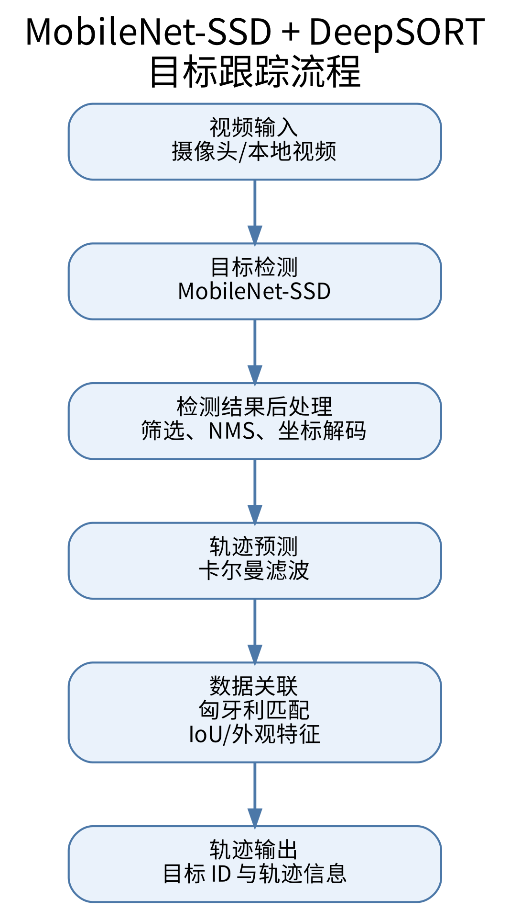
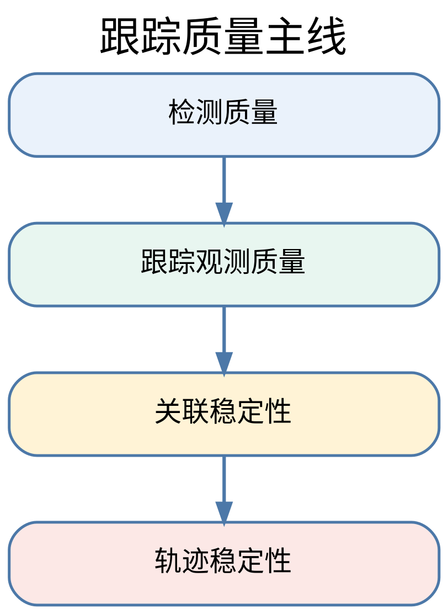

# 案例 2：目标跟踪检测

## 教程定位 {#src-experiment-case2-h1}

本案例面向昇腾 310B 平台的开发入门，目标不只是把程序跑起来，而是建立一条完整、清晰、可扩展的目标跟踪知识主线：

1. 为什么边缘设备上要优先选择轻量级检测网络。
2. MobileNet 的结构为什么适合做骨干网络。
3. SSD 的检测思想为什么适合实时场景。
4. MobileNet-SSD 作为检测前端，在目标跟踪任务中有哪些优点和局限。
5. 为什么在检测结果之上叠加 DeepSORT，是一个很好的多目标跟踪入门方案。
6. 本案例中的 ssdlite 与 tracking 代码，分别承担了什么角色。

从整体结构看，本案例对应一条标准的视频目标分析流水线：

{#fig:ssd_flow width=40% .center}

本案例选择的实现路线是：

* 使用 MobileNet-SSD 完成实时目标检测。
* 使用一个简化版 DeepSORT 风格跟踪器完成多目标跟踪。
* 使用 CPU 与 Ascend NPU 统一接口，方便读者同时理解算法与部署。

这条路线适合作为昇腾 310B 开发教程中的案例章节，因为它兼顾了三点：

* 算法结构足够完整。
* 推理链路足够直观。
* 工程复杂度可控，适合实验训练和工程实践。

## 实验硬件与运行条件 {#src-experiment-case2-h2}

本案例既可以在普通 CPU 环境下运行，也可以在昇腾 NPU 环境下运行。为了完成实时检测与实时跟踪实验，建议准备如下硬件条件：

* 一台 Linux 主机或昇腾开发环境
* 一只 USB 摄像头，用于实时视频采集
* Ascend 310B 或兼容昇腾 NPU 设备，运行 `npu` 模式时需要

运行方式可以分为两类：

* 实时演示：接入 USB 摄像头，使用 `--source 0` 作为输入
* 离线演示：直接读取本地视频文件，例如 `--source demo.mp4`

如果只运行 `cpu` 模式，可以没有昇腾 NPU；如果运行 `npu` 模式，则还需要本机正确安装 Ascend ACL Python 运行时，并准备对应的 `.om` 模型文件。当前模型下载脚本默认使用 `zhouxzh/SSDLite320`，该仓库发布的是 `.onnx` 模型；在 Ascend 310B 上运行 NPU 模式前，需要使用 `scripts/convert_onnx_to_om.py` 将 ONNX 转成 OM。

常用准备流程如下：

```bash
python scripts/download_models.py --onnx
source /usr/local/Ascend/ascend-toolkit/set_env.sh
python scripts/convert_onnx_to_om.py --soc-version Ascend310B4
```

转换脚本默认读取 `models/*.onnx`，并把同名 `.om` 文件写回 `models/`。如果板端 SoC 版本不是 `Ascend310B4`，需要按实际环境修改 `--soc-version`。

## 本案例支持的骨干网络 {#src-experiment-case2-h3}

当前仓库里的 SSD 模型已经覆盖了两类主干网络：

* MobileNet 系列：`mobilenetv1`、`mobilenetv2`、`mobilenetv3`、`mobilenetv3_large_100`、`mobilenetv4`
* ResNet 系列：`resnet18`、`resnet34`、`resnet50`、`resnet101`、`resnet151`

其中：

* `ssd320_*` 主要对应 MobileNet 系列，输入尺寸通常为 `320 x 320`
* `ssd300_*` 主要对应 ResNet 系列，输入尺寸通常为 `300 x 300`

从工程角度看，MobileNet 系列更强调轻量化和实时性，ResNet 系列更强调特征表达能力和检测稳定性。两类骨干网络共同构成了本案例中“轻量实时”和“更强表达”两种不同取向的实验基础。

## 目标跟踪对时序关联的要求 {#src-experiment-case2-h4}

目标检测解决的是单帧图像中的两个问题：

* 目标在哪里。
* 目标属于什么类别。

例如，在一帧图像里，检测器可能输出三个框，其中两个是行人，一个是汽车。但仅靠检测器，我们无法回答下面这些时间维度上的问题：

* 当前这一帧左侧的行人，是不是上一帧的 3 号目标。
* 被遮挡后重新出现的车辆，是否还是之前那一辆。
* 两个目标交叉通过时，系统该如何保持它们的身份不交换。

上述问题正是目标跟踪所要解决的核心任务。多目标跟踪系统不仅需要检测目标的存在，还需要为同一目标在连续帧中维持稳定的身份编号，即稳定的 ID。

因此，目标跟踪可以理解为“目标检测在时间维度上的延伸”。检测负责看见目标，跟踪负责维持目标身份。

## MobileNet-SSD 作为检测前端的依据 {#src-experiment-case2-h5}

### 边缘侧场景的基本要求 {#src-experiment-case2-h6}

昇腾 310B 面向边缘智能计算场景。在这类场景中，算法设计通常要同时考虑以下问题：

* 实时性是否足够。
* 模型规模是否可控。
* 推理链路是否简单稳定。
* 是否便于部署到 NPU 或 CPU 回退环境。

如果直接选择参数量庞大、结构复杂、后处理繁重的检测器，理解成本与工程调试成本都会显著上升，系统主线反而不易把握。因此，本案例采用轻量、经典且工程路径清晰的 MobileNet-SSD 组合作为检测前端。

### MobileNet 的网络结构 {#src-experiment-case2-h7}

MobileNet 的核心设计思想，是用深度可分离卷积替代标准卷积，从而显著降低参数量与计算量。

标准卷积把空间卷积和通道融合同时完成，而 MobileNet 将其拆分成两步：

1. Depthwise Convolution：对每个输入通道分别做空间卷积。
2. Pointwise Convolution：使用 1×1 卷积完成通道之间的信息融合。

如果标准卷积的输入通道数为 $M$，输出通道数为 $N$，卷积核大小为 $K \times K$，特征图大小为 $D \times D$，那么标准卷积的计算量大致为：

$$
D^2 \cdot K^2 \cdot M \cdot N
$$

而深度可分离卷积的计算量大致为：

$$
D^2 \cdot K^2 \cdot M + D^2 \cdot M \cdot N
$$

当 $K=3$ 时，这种拆分能够显著降低计算成本。这一特性对于边缘设备尤为重要。

从结构上看，MobileNet 可以理解为由以下几类模块反复堆叠而成：

* 普通卷积层，用于最初级的特征提取。
* 深度卷积层，用于逐通道提取空间信息。
* 逐点卷积层，用于跨通道融合特征。
* 下采样层，用于逐步扩大感受野，获得更强的语义信息。

MobileNet 的主要价值体现在以下几个方面：

* 它很好地体现了轻量化网络的设计思想。
* 它适合作为边缘侧模型部署的入门例子。
* 它与 SSD 结合后，能够形成一条结构清晰、速度较快的检测链路。

### MobileNet v1 至 v4 的版本演进 {#src-experiment-case2-h8}

MobileNet 并非单一网络，而是一个持续演进的轻量级网络家族。v1 至 v4 的演进，本质上体现为在移动端与边缘侧约束下，对精度、速度与结构表达能力的持续平衡与优化。

#### MobileNet v1 {#src-experiment-case2-h9}

MobileNet v1 是这个家族的起点。它最核心的贡献，就是把深度可分离卷积系统化地应用到整个网络主干中。

结构特点：

* 以 depthwise convolution 加 pointwise convolution 为基本单元
* 网络结构规整，堆叠方式简单直接
* 参数量和计算量相比标准卷积网络大幅下降

优点：

* 结构最直观，最容易理解
* 轻量化效果明显
* 在边缘设备上容易部署

局限：

* 特征表达能力相对有限
* 在相同算力下，精度通常不如后续版本

#### MobileNet v2 {#src-experiment-case2-h10}

MobileNet v2 的核心改进是引入了 inverted residual 和 linear bottleneck。

结构特点：

* 先通过 1×1 卷积扩张通道
* 再做 depthwise convolution
* 最后通过线性 bottleneck 压缩回较低维度
* 在满足条件时使用残差连接

它与传统残差块的设计思路存在明显差异。传统残差块通常采用“宽输入到宽输出”的结构，而 MobileNet v2 更强调“窄输入、宽中间层、窄输出”，因此被称为 inverted residual。

这一版本的优势在于：

* 在轻量化前提下提升了表达能力
* 残差连接帮助梯度传播更稳定
* 在线性 bottleneck 中减少非线性带来的信息损失

#### MobileNet v3 {#src-experiment-case2-h11}

MobileNet v3 在 v2 基础上继续优化，它融合了神经网络结构搜索和轻量注意力机制的思想。

结构特点：

* 延续 inverted residual 主体框架
* 引入 SE 模块增强通道注意力
* 使用 h-swish 等更适合移动端的激活函数
* 网络结构由精度与延迟共同驱动优化

与 v2 相比，v3 的一个重要特征在于更加关注真实硬件上的执行效率，而不仅仅是理论 FLOPs 的下降。换言之，v3 的优化目标并非单纯减少计算量，而是在移动端与边缘端设备上取得更优的实际速度与精度平衡。

#### MobileNet v4 {#src-experiment-case2-h12}

MobileNet v4 是更后续的轻量骨干版本，它进一步强化了硬件感知设计，更强调不同算子组合在实际设备上的性能收益。

结构特点：

* 延续轻量主干的整体方向
* 更强调不同卷积模块和块结构的组合效率
* 进一步面向硬件友好的延迟优化
* 在不同配置下兼顾速度、参数量和表达能力

从本仓库的模型组织可以看出，模型目录中既包含 `mobilenetv4`，也包含 `mobilenetv4_conv_large.onnx`、`mobilenetv4_hybrid_medium.onnx` 这样的变体文件。这表明 v4 系列本身已经具备不同配置路径，用于在更强表达能力与更低计算开销之间进行权衡。

### MobileNet v1-v4 的结构对比总结 {#src-experiment-case2-h13}

如果按结构演进主线来总结，四个版本的差异可以概括为：

* v1：用深度可分离卷积解决“怎么把网络做轻”
* v2：用 inverted residual 和 linear bottleneck 解决“轻量化下如何保留表达能力”
* v3：用 SE、h-swish 和结构搜索解决“如何进一步优化真实设备上的速度与精度平衡”
* v4：进一步走向硬件感知和模块组合优化，强调在实际部署环境中的综合收益

如果按本案例的应用视角看，这些版本的差异意味着：

* v1 更适合讲轻量化网络的最基础结构
* v2 更适合讲轻量网络中的残差和瓶颈设计
* v3 更适合讲轻量网络与注意力机制、激活函数优化的结合
* v4 更适合讲面向部署性能的后续演化方向

### MobileNet 与 ResNet 骨干在本案例中的取向差异 {#src-experiment-case2-h14}

本案例同时提供 MobileNet 和 ResNet 两条骨干路线，这样可以更直观地对比不同网络家族的使用取向。

MobileNet 系列的特点是：

* 参数量更小
* 推理速度更快
* 更适合实时演示和边缘部署

ResNet 系列的特点是：

* 特征提取能力更强
* 网络层次更深，残差结构更成熟
* 在一些场景下更容易得到稳定的检测效果

因此，在本案例中：

* 如果更关注实时性和轻量部署，可以优先尝试 MobileNet v1-v4
* 如果更关注骨干网络深度和表达能力，可以尝试 ResNet18 到 ResNet151 的多个版本

### SSD 的检测特点 {#src-experiment-case2-h15}

SSD 是 Single Shot MultiBox Detector 的缩写，属于典型的一阶段检测器。它的核心特点是：不需要像两阶段检测器那样先生成候选区域，再做分类与回归，而是直接在不同尺度的特征图上预测目标位置和类别。

SSD 的关键思想包括：

* 在多个尺度特征图上进行检测，兼顾大目标和小目标。
* 在每个位置预先定义一组 default boxes，也叫 prior boxes。
* 网络直接回归 default box 的位置偏移量，同时预测各类别分数。
* 经过解码和 NMS 后，输出最终的检测框。

SSD 的优点主要有：

* 推理速度快，适合实时场景。
* 结构相对直接，便于理解和部署。
* 检测头设计清晰，容易解释“分类”和“回归”两个分支的作用。

SSD 的局限也需要明确说明：

* 对小目标和密集目标场景通常不如更新的检测器稳定。
* 检测效果较依赖先验框设计与输入尺寸。
* 在复杂遮挡场景下，单帧检测质量会波动，从而影响后续跟踪。

### MobileNet-SSD 用于目标跟踪的优缺点 {#src-experiment-case2-h16}

在目标跟踪任务中，检测器不是孤立存在的，它会直接影响轨迹质量。MobileNet-SSD 作为跟踪前端，有以下优点：

* 轻量高效，适合边缘侧实时处理。
* 输出结构标准，便于接入后续跟踪器。
* 检测速度较快，可以为多目标跟踪提供稳定的帧级观测。
* 工程复杂度低，便于构建完整案例。

但它也存在明显不足：

* 对小目标和远距离目标的检测精度有限。
* 遇到密集遮挡时，漏检和框抖动会增多。
* 当检测框位置不稳定时，跟踪器更容易发生 ID switch。
* 仅靠检测框几何信息，难以应对长时间遮挡或重识别问题。

因此，MobileNet-SSD 的价值不在于“它是最强的检测前端”，而在于“它能以较低复杂度，把检测到跟踪这条主线讲清楚”。

## DeepSORT 作为跟踪后端的选择依据 {#src-experiment-case2-h17}

### 从检测到跟踪，还缺少什么 {#src-experiment-case2-h18}

检测器每一帧都输出一组目标框，但这些框之间没有时间关联。要把检测结果变成稳定轨迹，还需要以下机制：

* 轨迹状态表示。
* 帧间运动预测。
* 检测与轨迹之间的匹配。
* 轨迹的创建、保留和删除。

DeepSORT 恰好提供了这样一套结构完整的解决框架。

### DeepSORT 为什么适合作为入门算法 {#src-experiment-case2-h19}

完整的 DeepSORT 在 SORT 基础上增加了外观特征建模，因此在目标遮挡、交叉和重识别问题上通常具有更好的稳定性。尽管本案例并未实现完整的工业级 DeepSORT，但保留了其最核心、最适合入门阶段把握的基本思路：

* 用卡尔曼滤波做运动预测。
* 用匈牙利算法做全局匹配。
* 用 IOU 作为主要几何相似度。
* 用轨迹生命周期参数管理目标的出现与消失。

这种简化版方案有三个突出优点：

* 思路完整，已经覆盖多目标跟踪中的核心环节。
* 数学和工程难度适中，不需要先掌握 ReID 网络训练。
* 便于直接观察检测质量、IOU 阈值、轨迹寿命等因素对最终效果的影响。

因此，将 MobileNet-SSD 与 DeepSORT 组合使用，是一条结构清晰、实现成本适中且便于展开分析的入门路径。

## 本案例的代码结构与总体流程 {#src-experiment-case2-h20}

本案例的工程代码主要分为三层：

### 入口层 {#src-experiment-case2-h21}

* scripts/detection_app.py：只做实时检测。
* scripts/tracking_app.py：先做检测，再做跟踪。

### 检测层 {#src-experiment-case2-h22}

* ssdlite/backend_base.py：统一检测后端基类，负责预处理、推理调度与输出解码。
* ssdlite/cpu_backend.py：ONNXRuntime CPU 推理实现。
* ssdlite/npu_backend.py：Ascend ACL NPU 推理实现。
* ssdlite/decoder.py：SSD prior boxes、位置解码、类别概率与 NMS。

### 跟踪层 {#src-experiment-case2-h23}

* tracking/deepsort.py：轨迹对象、匹配逻辑、轨迹生命周期管理。
* tracking/kalman_filter.py：卡尔曼滤波状态预测与观测更新。
* utils/postprocessing.py：检测结果转换为跟踪器输入，并将轨迹画回图像。

整条链路的执行顺序可以概括为：

1. 读取摄像头或视频流。
2. 对输入帧执行 MobileNet-SSD 检测。
3. 解码输出张量并得到边界框、类别和分数。
4. 将检测结果整理成跟踪器统一输入格式。
5. 对已有轨迹进行预测。
6. 将当前检测结果与历史轨迹做关联。
7. 更新匹配轨迹、创建新轨迹、删除失效轨迹。
8. 在图像上绘制检测结果或轨迹结果。

## 检测部分代码解析 {#src-experiment-case2-h24}

### detection_app.py 如何组织检测主流程 {#src-experiment-case2-h25}

在 scripts/detection_app.py 中，主程序首先解析参数，然后根据 device 选择后端，再进入逐帧推理循环。这一设计体现了很清晰的工程结构：入口脚本只负责流程编排，把模型相关细节下沉到 ssdlite 模块。

主流程的示意代码如下：

```python
labels = load_labels(args.labels)
model_path = resolve_model_path(args.model, args.backbone, model_dir, args.device)
backend = CpuBackend(model_path) or NpuBackend(model_path)

while True:
	ok, frame = cap.read()
	detections, profile_ms = backend.infer_with_profile(
		frame,
		args.score_threshold,
		args.nms_threshold,
		args.max_detections,
	)
	annotated = draw_detections(...)
```

这里需要关注的重点并非某一行语法细节，而是模块职责的划分方式：

* 入口脚本负责参数、视频流、显示和保存。
* backend 负责模型推理。
* decoder 负责把原始张量变成检测框。
* postprocessing 负责可视化。

这是一种很清晰的工程拆分方式。

### backend_base.py 如何统一检测后端 {#src-experiment-case2-h26}

ssdlite/backend_base.py 是检测部分最核心的代码之一。它把 CPU 与 NPU 两种后端统一到同一个抽象接口下。这样设计后，入口脚本就不用关心底层到底是 ONNXRuntime 还是 ACL。

这个基类做了三件关键事情：

* 根据模型名推断输入尺寸。
* 统一图像预处理。
* 统一输出解码流程。

其中，infer_with_profile 的核心逻辑如下：

```python
input_tensor = preprocess_frame(frame, self.input_hw)
outputs = self._run_model(input_tensor)
detections = decode_detections(
	outputs,
	frame.shape,
	score_threshold,
	nms_threshold,
	max_detections,
	self.ssd_decoder,
	self.strict_ssd,
)
```

这段代码清晰地对应了检测系统中的三个阶段：

1. 预处理：把原始图像缩放、归一化，并变成模型要求的 NCHW 张量。
2. 推理：调用不同后端执行前向计算。
3. 解码：把输出张量还原成真实的目标框与类别分数。

这里需要明确的一点是，模型推理本身并不等于最终检测结果。真正可用于后续跟踪的目标框，需要由模型输出经过解码与 NMS 后处理后才能得到。

### preprocess_frame 体现了部署输入规范 {#src-experiment-case2-h27}

在 backend_base.py 中，preprocess_frame 完成了以下操作：

* BGR 转 RGB。
* resize 到固定输入尺寸。
* 像素值归一化到 0 到 1。
* 按 ImageNet 风格均值与方差做标准化。
* 从 HWC 转为 CHW。
* 增加 batch 维度。

这说明了一个重要的部署原则：模型输入的预处理流程必须与训练阶段的约定保持一致，否则推理结果将发生明显偏移。

### decoder.py 如何体现 SSD 的核心思想 {#src-experiment-case2-h28}

ssdlite/decoder.py 直接对应了 SSD 的理论结构，是整条检测链路中的关键部分。

#### default boxes {#src-experiment-case2-h29}

在 DefaultBoxes 类中，代码根据不同特征图尺度和长宽比生成先验框。这正是 SSD 的基础：网络并不是直接从零开始生成框，而是在预定义框基础上学习偏移量。

#### 位置回归的反变换 {#src-experiment-case2-h30}

在 SSDDecoder.scale_back_batch 中，网络输出的并不是最终框坐标，而是相对于默认框的偏移量。代码中先利用 scale_xy 和 scale_wh 对偏移量进行还原，再把中心点形式转换为左上角和右下角坐标。

更直接地说：

* 网络先预测相对于先验框的中心偏移和宽高缩放。
* 解码阶段再把这些相对量恢复成图像上的实际边界框。

#### 分类分数与 NMS {#src-experiment-case2-h31}

当前工程版本中的 decode_single 已经不是“对每个类别都扫描全部 prior”的基础写法，而是先对每个 prior 选出一个最佳前景类别，再进入后续筛选和 NMS。其主线思路更接近下面这样：

```python
foreground_scores = scores_in[:, class_ids]
best_class_indices = np.argmax(foreground_scores, axis=1)
best_scores = foreground_scores[np.arange(foreground_scores.shape[0]), best_class_indices]
keep_score = best_scores >= score_threshold

candidate_boxes = bboxes_in[keep_score, :]
candidate_scores = best_scores[keep_score]
candidate_labels = class_ids[best_class_indices[keep_score]]
```

随后，代码再按类别分别执行 NMS。这样做体现了 SSD 后处理中的三个关键工程点：

* 先为每个 prior 找到最可信的前景类别。
* 再根据阈值筛掉低置信度候选框。
* 最后只对保留下来的候选框按类别做 NMS。

如果仍然采用“每个类别都扫全部 prior”的方式，那么在 COCO 这类多类别场景里，解码阶段会产生大量无效扫描和重复 NMS，实时性会明显受影响。

#### NMS 的作用是什么 {#src-experiment-case2-h32}

NMS 是 Non-Maximum Suppression，即非极大值抑制。它的核心作用可以概括为一句话：当多个候选框同时指向同一个目标时，只保留其中最可信的候选框，并删除其余高度重叠的框。

这是因为 SSD 会在每个特征图位置、每种先验框形状上产生候选框。对于一个真实目标，模型往往不会只输出一个框，而是会输出一组位置接近、分数相近的候选框。如果不执行 NMS，画面中就会出现大量相互覆盖的检测框，例如同一行人周围同时叠加 5 个到 10 个候选框。

NMS 的作用主要有四点：

* 去除重复检测，让一个目标尽量只保留一个主框。
* 降低后续显示和统计的混乱程度。
* 为跟踪器提供更稳定、更稀疏的观测输入。
* 避免同一目标在跟踪阶段被误认为多个目标。

对本案例尤其要强调最后一点。如果检测器把同一目标输出成多个高重叠框，那么 tracking 模块在创建轨迹时，可能会把这些框错误地当成多个独立目标，从而造成重复轨迹、ID 混乱和后续匹配不稳定。

NMS 的处理逻辑可以概括成下面 4 步：

1. 按置信度从高到低排序所有候选框。
2. 取当前分数最高的框作为保留框。
3. 计算其余框与该保留框的 IOU。
4. 删除所有 IOU 超过阈值的框，然后继续处理剩余框。

因此，NMS 本质上是在做“去重”。它不是提高分类能力，而是在后处理阶段把重复候选框压缩成更干净的检测结果。

#### ssdlite 中 _nms 的实现解析 {#src-experiment-case2-h33}

当前工程版本中的 NMS 函数如下：

```python
def _nms(boxes, scores, iou_threshold, presorted=False):
	if len(boxes) == 0:
		return np.empty((0,), dtype=np.int64)

	if presorted:
		order = np.arange(scores.size, dtype=np.int64)
	else:
		order = np.argsort(scores)[::-1]

	keep = []
	while order.size > 0:
		index = order[0]
		keep.append(index)
		if order.size == 1:
			break

		remaining = order[1:]
		iou = _calc_iou_with_box(boxes[remaining], boxes[index])
		order = remaining[iou <= iou_threshold]

	return np.array(keep, dtype=np.int64)
```

这段实现虽然短，但几乎完整体现了经典 NMS 的核心流程。

第一步，处理空输入：

```python
if len(boxes) == 0:
	return np.empty((0,), dtype=np.int64)
```

这一步是工程上必不可少的防御式处理。如果当前类别一个候选框都没有，就直接返回空索引，避免后续排序和 IOU 计算报错。

第二步，确定候选框顺序：

```python
if presorted:
	order = np.arange(scores.size, dtype=np.int64)
else:
	order = np.argsort(scores)[::-1]
```

这里多了一个 `presorted` 参数。其作用是：如果外部已经按分数把候选框排好了，就不必在 NMS 内部重复排序。这样可以减少一次多余的排序开销。

第三步，循环保留最高分框：

```python
keep = []
while order.size > 0:
	index = order[0]
	keep.append(index)
```

这里的含义至关重要：每一轮循环都将当前最高分框作为“代表框”保留下来。NMS 的基本原则是，在一组高度重叠的候选框中，分数最高的框通常最应优先保留。

第四步，只剩一个框时直接结束：

```python
if order.size == 1:
	break
```

如果当前只剩一个候选框，那么它已经被保留，没有必要再做 IOU 比较。

第五步，计算其余候选框与当前最高分框的 IOU：

```python
remaining = order[1:]
iou = _calc_iou_with_box(boxes[remaining], boxes[index])
```

这一步可以这样理解：

* `boxes[index]` 是当前保留框。
* `boxes[remaining]` 是除了它以外剩余的候选框。
* `_calc_iou_with_box(...)` 直接计算“多框对单框”的 IOU。

如果某个候选框与保留框的 IOU 很高，就说明这两个框大概率描述的是同一个目标，此时就没有必要同时保留。

第六步，删除 IOU 过高的重复框：

```python
order = remaining[iou <= iou_threshold]
```

这一行代码是整个 NMS 实现中最关键的语句之一。它表示：

* 只保留那些与当前主框重叠不太严重的候选框。
* 不再通过 `np.where(...)+1` 做额外索引映射，而是直接对 `remaining` 做布尔筛选。

执行完这一行后，所有与当前主框高度重叠的框都会被移除，剩下的框继续进入下一轮循环。

第七步，返回保留框索引：

```python
return np.array(keep, dtype=np.int64)
```

最终返回的不是框本身，而是被保留框在原数组中的索引。后续代码再用这些索引去提取真正的框、分数和类别。

#### calc_iou 为什么是 NMS 的基础 {#src-experiment-case2-h34}

NMS 能否正确工作，取决于 IOU 计算是否准确。本案例在 decoder.py 中通过 calc_iou 计算两个框集合之间的交并比。其核心思想是：

$$
IOU = \frac{\text{交集面积}}{\text{并集面积}}
$$

在代码里，这一过程分为三步：

* 先求两个框相交区域的左上角和右下角。
* 再计算交集面积。
* 最后用交集面积除以并集面积。

如果 IOU 接近 1，说明两个框几乎重合；如果 IOU 接近 0，说明两个框几乎没有重叠。NMS 正是利用这一数值来判断“两个候选框是不是在描述同一个目标”。

#### NMS 阈值对结果的影响 {#src-experiment-case2-h35}

NMS 中最重要的超参数是 `iou_threshold`。它决定了“多大程度的重叠应被视为重复”。

如果阈值较小，例如 0.3，那么算法会更严格：

* 只要两个框稍微重叠得多一点，就可能删除其中一个。
* 输出框更少，更干净。
* 但也可能误删本来相邻但不是同一目标的框。

如果阈值较大，例如 0.6 或 0.7，那么算法会更宽松：

* 允许更多重叠框同时保留。
* 对密集目标场景可能更友好。
* 但重复检测也更容易残留。

因此，NMS 阈值本质上是在“去重强度”和“保留相邻目标”之间做权衡。

#### NMS 对跟踪效果的直接影响 {#src-experiment-case2-h36}

NMS 容易被视为检测模块内部的技术细节，但在目标跟踪系统中，它实际上会直接影响跟踪质量。

原因是跟踪器把检测器输出当作观测输入。如果检测结果中存在大量重复框，就会产生以下问题：

* 同一目标可能在同一帧中生成多条新轨迹。
* 轨迹关联时会出现多对一竞争。
* 轨迹数目虚高，画面看起来混乱。
* 目标 ID 容易抖动，甚至频繁切换。

从这个角度看，NMS 不是孤立的后处理技巧，而是整个“检测到跟踪”流水线稳定运行的重要保障。

#### decode_single 中 NMS 的完整上下文 {#src-experiment-case2-h37}

在本案例中，NMS 不是单独执行的，而是被放在 decode_single 的类别循环中。其完整语义是：

1. 针对每一个类别单独处理。
2. 先按分数过滤掉置信度过低的框。
3. 再保留该类别中得分最高的一部分候选框。
4. 最后在这个类别内部做 NMS。

这意味着本案例采用的是“按类别分别做 NMS”的策略。这样设计的优点是：不同类别之间不会互相抑制。例如一个行人框和一个自行车框即使重叠较大，也不应该因为彼此重叠就被删除。

### CPU 与 NPU 后端如何被统一接入 {#src-experiment-case2-h38}

本案例中的 ssdlite/cpu_backend.py 与 ssdlite/npu_backend.py 都继承自 DetectionBackend，这意味着它们对外暴露的是同一套接口。这种设计有两层价值：

* 从算法角度看，检测逻辑不依赖具体硬件后端。
* 从工程角度看，同一套上层代码可以在 CPU 和 Ascend NPU 之间切换。

这也体现了一个重要的工程原则：算法主线尽量稳定，硬件适配尽量下沉到后端实现层。

## 从检测到跟踪：tracking_app.py 的桥接作用 {#src-experiment-case2-h39}

如果说 detection_app.py 用于建立检测流程，那么 tracking_app.py 的作用就在于将“检测结果如何转化为轨迹”这一过程完整串联起来。

在 scripts/tracking_app.py 中，检测模块与跟踪模块之间的桥接代码如下：

```python
detections, profile_ms = backend.infer_with_profile(...)
tracker_inputs = detections_to_tracker_inputs(detections)
tracks = tracker.update(tracker_inputs)
annotated = draw_tracks(...)
```

这一过程可以分为四个连续步骤：

1. 先由检测器输出本帧的目标集合。
2. 再把字典形式的检测结果转成跟踪器统一使用的数组格式。
3. 调用跟踪器更新轨迹状态。
4. 把最新轨迹结果绘制到图像上。

其中，utils/postprocessing.py 中的 detections_to_tracker_inputs 函数具有关键作用，因为它完成了检测模块与跟踪模块之间的数据接口统一。转换后的输入格式为：

$$
[x_1, y_1, x_2, y_2, score, class\_id]
$$

这正是后续轨迹匹配与分类约束所依赖的输入格式。

## 跟踪部分代码解析 {#src-experiment-case2-h40}

### Track 类如何表示一条轨迹 {#src-experiment-case2-h41}

tracking/deepsort.py 中的 Track 类代表单个目标的历史状态。每条轨迹至少维护了以下信息：

* track_id：目标编号。
* bbox：当前边界框。
* score：当前检测置信度。
* class_id：目标类别。
* trail：历史中心点序列，用于绘制轨迹拖尾。
* kalman_filter：用于状态预测与更新。
* time_since_update：距离上次匹配成功已经过去多少帧。
* hits：这条轨迹累计被成功匹配了多少次。

这表明轨迹并不是静态边界框的简单记录，而是一个具有时间属性的状态对象。因此，“检测框”和“轨迹”必须明确区分。

### predict 和 update 对应卡尔曼滤波两阶段 {#src-experiment-case2-h42}

Track 类中最核心的两个方法是 predict 和 update。

predict 的作用是：即使当前帧还没有拿到新的检测结果，也先根据上一时刻状态预测目标现在大概会出现在哪里。

update 的作用是：一旦当前帧有新的检测框匹配到这条轨迹，就用新的观测值修正状态估计。

这正对应卡尔曼滤波的两步：

1. Predict：根据上一时刻状态外推当前状态。
2. Update：用当前观测修正预测误差。

本案例里，状态量采用了一个比较直观的简化形式：

$$
x = [x, y, v_x, v_y]^T
$$

其中 $x, y$ 表示目标中心位置，$v_x, v_y$ 表示速度。这样做的好处是：数学含义直观，代码实现也容易读懂。

### kalman_filter.py 如何实现线性状态估计 {#src-experiment-case2-h43}

tracking/kalman_filter.py 中定义了最基础的卡尔曼滤波器。其状态转移矩阵为：

$$
F =
\begin{bmatrix}
1 & 0 & 1 & 0 \\
0 & 1 & 0 & 1 \\
0 & 0 & 1 & 0 \\
0 & 0 & 0 & 1
\end{bmatrix}
$$

这表示系统假设目标在相邻帧之间近似满足匀速运动。观测矩阵为：

$$
H =
\begin{bmatrix}
1 & 0 & 0 & 0 \\
0 & 1 & 0 & 0
\end{bmatrix}
$$

这表示我们能够直接观测到的是目标中心位置，而不是速度。

这一实现虽然经过简化，但其价值十分明确，因为它将“运动预测”与“观测修正”这两个概念直接落实到了矩阵运算之中。

### 卡尔曼滤波器的发展历史与作者信息 {#src-experiment-case2-h44}

卡尔曼滤波器的提出者是鲁道夫·埃米尔·卡尔曼，英文名 Rudolf Emil Kalman。他是匈牙利裔美国数学家和控制理论学者，1960 年发表了著名论文 A New Approach to Linear Filtering and Prediction Problems，系统建立了线性动态系统状态估计的现代形式。

从历史背景看，卡尔曼滤波器并不是突然出现的。它的形成与 20 世纪中叶的控制理论、随机过程、航空航天导航和军事工程需求密切相关。第二次世界大战后，工程界越来越需要解决这样一类问题：

* 系统状态不能被直接完整观测。
* 传感器观测存在噪声。
* 系统本身还在不断运动和变化。

例如，雷达跟踪飞机、导弹制导、航天器轨道估计，本质上都属于这一类问题。

卡尔曼滤波器之所以具有里程碑意义，是因为它把“预测”和“校正”统一进了一个递推框架中：

* 先根据上一时刻状态和系统模型预测当前状态。
* 再根据当前观测对预测结果进行修正。

这一思想后来在 20 世纪 60 年代迅速应用到阿波罗计划的导航系统中，也因此被广泛传播到航空航天、自动控制、机器人、计算机视觉和金融工程等领域。

在发展过程中，卡尔曼滤波形成了多个重要分支：

* 标准卡尔曼滤波：用于线性高斯系统。
* 扩展卡尔曼滤波 EKF：用于非线性系统的一阶近似。
* 无迹卡尔曼滤波 UKF：通过采样点传播非线性分布。
* 粒子滤波：进一步放宽线性和高斯假设。

本案例采用最基础的标准卡尔曼滤波器。采用这一形式，并非因为它代表当前最复杂的状态估计方案，而是因为它在入门阶段具有最清晰的解释路径：

* 数学形式清晰。
* 与目标跟踪中的位置预测问题高度匹配。
* 代码实现短小，便于直接对应矩阵运算理解。

### 卡尔曼滤波器到底在解决什么问题 {#src-experiment-case2-h45}

在目标跟踪里，卡尔曼滤波器要解决的问题可以表述为：当检测器每一帧给出的目标框存在抖动、漏检和噪声时，如何根据历史状态更平滑地估计目标当前位置，并在短时没有观测的情况下继续维持轨迹。

这意味着卡尔曼滤波并不是在做“目标分类”，也不是在做“目标匹配”，它做的是状态估计。

在本案例里，这个状态估计问题被简化成了二维平面上的匀速运动模型：

$$
x_k = F x_{k-1} + w_k
$$

$$
z_k = H x_k + v_k
$$

其中：

* $x_k$ 表示第 $k$ 帧的隐藏状态，也就是目标真实但不可完全直接观测的状态。
* $z_k$ 表示第 $k$ 帧的观测，也就是检测器给出的目标中心位置。
* $F$ 是状态转移矩阵。
* $H$ 是观测矩阵。
* $w_k$ 是过程噪声。
* $v_k$ 是观测噪声。

从工程角度看，这个模型表达的是一个朴素但有效的假设：目标会以相对平滑的方式运动，而检测器给出的观测值只是对真实运动状态的带噪声测量。

### 本案例中的 predict 与 update 如何对应算法公式 {#src-experiment-case2-h46}

tracking/kalman_filter.py 中的两个核心函数正好对应卡尔曼滤波的两个阶段。

第一阶段是预测：

```python
def predict(self):
	self.x = self.F @ self.x
	self.P = self.F @ self.P @ self.F.T + self.Q
	return self.x
```

该阶段完成以下两项操作：

* 用状态转移矩阵 `F` 预测新的状态向量 `x`。
* 用协方差传播公式预测新的不确定性 `P`。

第二阶段是更新：

```python
def update(self, z):
	measurement = np.asarray(z, dtype=np.float32).reshape((2, 1))
	innovation = measurement - self.H @ self.x
	innovation_covariance = self.H @ self.P @ self.H.T + self.R
	kalman_gain = np.linalg.solve(innovation_covariance.T, (self.P @ self.H.T).T).T
	self.x = self.x + kalman_gain @ innovation

	correction = self._identity - kalman_gain @ self.H
	self.P = correction @ self.P @ correction.T + kalman_gain @ self.R @ kalman_gain.T
```

这段代码中几个量的意义需要讲清楚：

* `innovation` 是残差，表示“观测值与预测值之间的差”。
* `innovation_covariance` 是残差协方差，表示当前误差的不确定性。
* `kalman_gain` 是卡尔曼增益，决定“应该更相信模型预测还是更相信当前观测”。

当前实现和基础版相比还多了两点工程优化：

* 用 `np.linalg.solve` 代替直接求逆，数值更稳定。
* 用 Joseph form 更新协方差矩阵，更容易保持协方差的对称性和正定性。

这里最重要的量仍然是卡尔曼增益。它并非经验性设定的固定权重，而是由当前状态不确定性与观测噪声共同决定的自适应权重。

可以直观地理解为：

* 如果观测噪声很大，滤波器会更信任模型预测。
* 如果观测噪声较小，滤波器会更信任当前检测结果。

这也是卡尔曼滤波器的重要优势之一。它并不是简单的滑动平均，而是在概率意义上进行最优线性估计。

### 卡尔曼滤波在本案例中的适用性 {#src-experiment-case2-h47}

对本案例而言，卡尔曼滤波器之所以合适，并不在于目标运动一定严格符合线性高斯模型，而在于它在工程上实现了较好的综合平衡：

* 算法复杂度低。
* 推理和更新速度快。
* 能明显改善检测框抖动。
* 在短时遮挡和漏检场景下能维持轨迹连续。

如果在入门阶段直接引入 EKF、UKF 或粒子滤波，虽然理论上能够处理更复杂的运动模型，但理解成本会显著上升，主线结构反而更不易把握。因此，本案例采用标准卡尔曼滤波具有充分的合理性。

### DeepSORT.update 如何体现多目标跟踪主线 {#src-experiment-case2-h48}

tracking/deepsort.py 中的 DeepSORT.update 是整条跟踪主线最核心的函数，其执行顺序如下：

```python
for track in self.tracks:
	track.predict()

matched, unmatched_detections, _ = self._associate(detections)

for track_idx, detection_idx in matched:
	self.tracks[track_idx].update(detections[detection_idx])

for detection_idx in unmatched_detections:
	self._create_track(detections[detection_idx])

self.tracks = [track for track in self.tracks if track.time_since_update <= self.max_age]
```

这一段代码几乎完整体现了多目标跟踪的标准流程：

1. 对所有旧轨迹做预测。
2. 把当前检测结果与旧轨迹做关联。
3. 用匹配到的检测结果更新旧轨迹。
4. 对未匹配检测创建新轨迹。
5. 删除长期未更新的轨迹。

换言之，跟踪并不是对检测框进行简单编号，而是在连续帧之间持续执行预测、匹配、更新与清理。

### 数据关联为什么使用 IOU + 匈牙利算法 {#src-experiment-case2-h49}

在 _associate 中，当前工程版本会先构造轨迹与检测之间的 IOU 矩阵和类别兼容矩阵，再调用匈牙利算法获得全局最优分配。对应代码思路如下：

```python
iou_matrix = self._calculate_iou_matrix(detections)
class_mask = self._calculate_class_compatibility_matrix(detections)
assignment_scores = np.where(class_mask, iou_matrix, -1.0)
matched_indices = self._linear_assignment(assignment_scores)
```

之所以这样设计，是因为当场景中有多条轨迹和多个检测框时，不能只做局部贪心匹配。匈牙利算法的作用在于：

* 从全局角度寻找一一对应的最优匹配。
* 避免一个检测框同时分配给多条轨迹。
* 避免一条轨迹同时匹配多个检测框。

本案例还加入了类别兼容矩阵：

```python
class_mask = self._calculate_class_compatibility_matrix(detections)
assignment_scores = np.where(class_mask, iou_matrix, -1.0)
```

这说明系统不仅看几何位置，还会在进入全局匹配之前，先利用类别信息屏蔽明显不合理的配对关系，避免“行人轨迹匹配到车辆框”这类明显错误。

### 匈牙利算法的发展历史与作者信息 {#src-experiment-case2-h50}

匈牙利算法是解决二分图最优匹配和指派问题的经典算法。它最早由美国数学家哈罗德·W·库恩，英文名 Harold W. Kuhn，在 1955 年系统提出。之所以命名为“匈牙利算法”，是因为库恩的工作建立在两位匈牙利数学家的理论成果之上：

* 德奈什·克尼格，英文名 Dénes Kőnig。
* 耶诺·埃格瓦里，英文名 Jenő Egerváry。

他们在图论和指派问题上的研究，为后来算法化求解最优匹配提供了重要理论基础。之后，美国数学家詹姆斯·芒克雷斯，英文名 James Munkres，在 1957 年进一步改进了该算法，使其在计算复杂度和工程实现上更加完善。因此，这一算法也常被称为 Kuhn-Munkres 算法。

从历史背景看，匈牙利算法主要服务于一类经典的组合优化问题：

* 一组任务要分配给一组工人。
* 每一种分配都有代价或收益。
* 目标是在一一对应约束下，使总代价最小或总收益最大。

这个问题后来被称为 assignment problem，即指派问题。它在生产调度、资源分配、路径规划、视觉跟踪等场景中都较为常见。

在多目标跟踪中，匈牙利算法的角色就是把“轨迹”和“当前检测框”看成两侧节点，把相似度或代价矩阵看成边权，然后求出全局最优的一一匹配关系。

### 匈牙利算法到底解决什么问题 {#src-experiment-case2-h51}

在目标跟踪里，如果只有一条轨迹和一个检测框，那么匹配很简单。但一旦场景中存在多条轨迹和多个检测框，问题就会迅速复杂起来。

例如，假设当前有 3 条旧轨迹和 3 个新检测框。此时系统不能只看“哪两个最像就先配对”，因为局部最优未必能得到全局最优。匈牙利算法解决的就是这个问题：

* 它在满足一一对应约束的前提下，寻找整体代价最小或整体相似度最大的匹配方案。

这正是多目标跟踪里数据关联的核心。

### 本案例中匈牙利算法是如何被调用的 {#src-experiment-case2-h52}

在 tracking/deepsort.py 中，匈牙利算法的调用被封装在 `_linear_assignment` 中：

```python
def _linear_assignment(self, cost_matrix):
	if cost_matrix.size == 0:
		return np.empty((0, 2), dtype=np.int64)

	row_ind, col_ind = linear_sum_assignment(-cost_matrix)
	return np.array(list(zip(row_ind, col_ind)), dtype=np.int64)
```

这里调用的是 scipy.optimize.linear_sum_assignment，它是匈牙利算法在科学计算库中的标准实现。

该函数默认求解最小化问题，而本案例构造的是 IOU 相似度矩阵，IOU 越大表示匹配越优。因此，代码中采用了一个典型的等价变换：

```python
linear_sum_assignment(-cost_matrix)
```

即将“最大化相似度”转化为“最小化负相似度”。

这里需要强调的一点是，同一个优化算法既可以用于最小代价问题，也可以通过简单变换用于最大收益问题。

### 匈牙利算法在本案例中的完整上下文 {#src-experiment-case2-h53}

在 `_associate` 中，数据关联的整体过程是：

1. 先计算每一条轨迹与每一个检测框之间的 IOU。
2. 再构造类别兼容矩阵，屏蔽明显不合理的类别组合。
3. 调用匈牙利算法得到全局最优分配。
4. 对主匹配结果应用 IOU 阈值过滤。
5. 对未匹配目标再执行一轮基于中心距离的补充匹配。

对应代码主线是：

```python
iou_matrix = self._calculate_iou_matrix(detections)
class_mask = self._calculate_class_compatibility_matrix(detections)
assignment_scores = np.where(class_mask, iou_matrix, -1.0)
matched_indices = self._linear_assignment(assignment_scores)

for track_idx, detection_idx in matched_indices:
	if assignment_scores[track_idx, detection_idx] < self.iou_threshold:
		continue

fallback_matches = self._match_by_center_distance(...)
```

这段代码说明一个重要事实：匈牙利算法本身只负责“给出最优一一分配”，但它并不直接理解哪些匹配在语义上是合理的。因此，本案例又叠加了两层约束：

* 类别必须兼容。
* IOU 必须高于阈值。
* 当 IOU 不足但中心运动关系合理时，还允许进入中心距离补充匹配。

由此可见，匈牙利算法提供的是全局分配框架，而不是完整的业务规则集合。

### 匈牙利算法相对于贪心匹配的优势 {#src-experiment-case2-h54}

一个常见问题在于，为什么不直接选择当前最大 IOU 的一对进行匹配。该贪心策略看似简单，但存在明显局限：

* 先做出的局部选择可能破坏后续整体最优。
* 当多个轨迹都与同一个检测框接近时，容易造成冲突。
* 在目标密集场景下，局部贪心更容易导致 ID 交换。

匈牙利算法的价值就在于它能从全局角度处理这类一一匹配问题。虽然本案例的匹配度量比较简单，只用了 IOU，但只要场景中存在多目标竞争，使用全局分配通常都比局部贪心更稳健。

### 匈牙利算法在多目标跟踪中的局限 {#src-experiment-case2-h55}

需要说明的是，匈牙利算法并不是万能的。它解决的是“在给定代价矩阵时，如何求最优匹配”，但如果代价矩阵本身构造得不好，算法仍然可能得到错误匹配。

在本案例中，主匹配代价矩阵主要由 IOU 构成，因此它会受到以下问题影响：

* 快速运动目标与旧轨迹重叠变小，IOU 不足。
* 相邻目标位置太近，几何信息不够区分。
* 遮挡后重新出现时，仅靠 IOU 难以恢复原身份。

这也是为什么当前工程版本又额外加入了“类别兼容矩阵”和“中心距离补充匹配”。匈牙利算法负责的是“最优分配”，但“什么样的代价矩阵才合理”仍然是跟踪算法设计的关键。

### 轨迹生命周期参数如何影响最终效果 {#src-experiment-case2-h56}

本案例中的三组参数具有较强的实验分析价值：

* max_age：轨迹最长允许失配多少帧。
* min_hits：轨迹至少命中多少次后才输出。
* iou_threshold：检测与轨迹关联所需的最小 IOU。

这些参数分别控制三类问题：

* 轨迹是否容易过早消失。
* 新轨迹是否容易过快出现。
* 匹配是否保守还是激进。

通过调参可以直接观察以下现象：

* max_age 过小，目标短时遮挡后容易断轨。
* min_hits 过小，误检容易变成短暂轨迹。
* iou_threshold 过高，快速移动目标更容易失配。
* iou_threshold 过低，邻近目标更容易错配。

## 可视化代码如何帮助理解算法结果 {#src-experiment-case2-h57}

在 utils/postprocessing.py 中，draw_detections 与 draw_tracks 分别负责绘制检测结果和跟踪结果。尽管这部分并不直接构成算法主体，但其作用十分重要，因为可视化能够将抽象状态转化为可直接观察的现象。

其中，draw_tracks 中有两点尤其值得关注：

* 每条轨迹使用固定颜色，帮助观察 ID 是否稳定。
* trail 轨迹拖尾可以直观看出运动路径与预测连续性。

因此，在调节参数时，不仅能够观察检测框是否正常输出，还能够观察 ID 是否发生跳变，以及轨迹是否保持连续。

## 如何评价这个案例方案 {#src-experiment-case2-h58}

### 这个方案的优点 {#src-experiment-case2-h59}

作为昇腾 310B 开发教程中的案例，本方案有很强的适配性：

* 模型轻量，适合边缘侧实时实验。
* 检测和跟踪两个阶段边界清晰，便于分层讲解。
* 代码结构整洁，便于把入口、后端、解码、跟踪拆开讲。
* DeepSORT 采用简化实现，避免课程一开始就陷入 ReID 细节。
* 既能跑 CPU，也能跑 NPU，便于体现部署层面的思维。

### 这个方案的不足 {#src-experiment-case2-h60}

需要明确的是，本案例并不是为了追求最强跟踪精度：

* 检测前端仍是经典 SSD，精度不是当前最先进水平。
* 跟踪器没有使用外观特征，因此遮挡恢复能力有限。
* 数据关联主要依赖 IOU，对交叉目标和密集目标不够鲁棒。
* 卡尔曼状态建模较简化，更偏向实现可解释性而不是工业最优效果。

### 作为入门案例的合理性 {#src-experiment-case2-h61}

正因为它没有引入过多复杂部件，目标跟踪的基本问题反而更容易被清晰呈现：

* 检测结果是如何来的。
* 检测结果如何进入跟踪器。
* 为什么需要预测。
* 为什么需要全局匹配。
* 为什么轨迹管理会决定最终 ID 稳定性。

当这些基础概念建立起来后，再引入完整 DeepSORT、ByteTrack、OC-SORT 或更复杂的 ReID 模块，学习曲线会平缓很多。

## 实验设计 {#src-experiment-case2-h62}

为了把本案例组织成一章完整教程，可以安排以下实验任务：

### 只运行检测链路 {#src-experiment-case2-h63}

目标：理解 MobileNet-SSD 的输入输出与后处理。

可观察：

* 不同模型输入尺寸对速度和效果的影响。
* score_threshold 对检测框数量的影响。
* NMS 阈值对重复框抑制效果的影响。

推荐命令：

```bash
python scripts/detection_app.py --device npu --source 0
python scripts/detection_app.py --device npu --source 0 --backbone mobilenetv2_100
python scripts/detection_app.py --device npu --source 0 --backbone resnet18
```

实验提示：

* 对比 `ssd320_*` 和 `ssd300_*` 两类模型时，不仅要看 FPS，还要同时观察检测框数量和画面稳定性。
* 当 `score-threshold` 较低时，解码后的候选框数会明显增加，后处理负担也会增大。
* 当 `nms-threshold` 较大时，重复框更容易残留，后续 tracking 的输入质量也会受到影响。

### 检测链路的性能拆分实验 {#src-experiment-case2-h64}

目标：学会区分摄像头读取、预处理、推理、解码和绘制的性能瓶颈。

可观察：

* `Read`：摄像头或视频流读取时间。
* `Pre`：模型输入预处理时间。
* `Infer`：模型推理时间。
* `Decode`：后处理时间。
* `Draw`：检测框或轨迹绘制时间。

推荐命令：

```bash
python scripts/detection_app.py --device npu --source 0
python scripts/detection_app.py --device npu --source 0 --camera-mjpeg
python scripts/detection_app.py --device npu --source 0 --camera-profile 1280x720@60
```

实验提示：

* 如果 `Read` 明显高于 `Pre`，瓶颈更可能在摄像头采集或驱动路径，而不是模型预处理本身。
* 如果 `Decode` 偏高，可以优先降低 `max-detections` 或缩小关注类别范围。
* 如果启用 `--camera-mjpeg` 后 `Read` 下降，说明当前 USB 摄像头和驱动组合更适合 MJPEG 模式；如果反而上升，则应恢复默认模式。
* 如果请求的分辨率或帧率不是摄像头原生档位，驱动可能发生额外缩放或格式转换，`Read` 往往会明显上升。

### 在检测基础上启用跟踪 {#src-experiment-case2-h65}

目标：观察轨迹是如何从检测结果中产生的。

可观察：

* 同一目标在连续帧中是否保持稳定 ID。
* 当目标短时遮挡时，轨迹是否断裂。
* 当多个目标接近时，是否发生 ID 交换。

推荐命令：

```bash
python scripts/tracking_app.py --device npu --source 0
python scripts/tracking_app.py --device npu --source 0 --track-classes person
python scripts/tracking_app.py --device npu --source 0 --track-classes person,bus
```

实验提示：

* 使用 `--track-classes` 后，可以明显减少无关类别进入解码和跟踪流程，便于观察指定目标的轨迹稳定性。
* 对实时摄像头场景，建议优先用 `person` 这类高频类别做实验，更容易观察目标进出画面、遮挡和交叉等现象。

### 类别过滤与解码开销实验 {#src-experiment-case2-h66}

目标：理解“只跟踪指定类别”不仅影响画面内容，也影响后处理负载。

可观察：

* 指定类别前后，`Decode` 时间是否变化。
* 指定类别前后，检测框数量和轨迹数量是否更稳定。
* 不同类别组合对解码开销和跟踪干扰的影响。

推荐命令：

```bash
python scripts/tracking_app.py --device npu --source 0
python scripts/tracking_app.py --device npu --source 0 --track-classes person
python scripts/tracking_app.py --device npu --source 0 --track-classes person,bus
```

实验提示：

* 当只关心少数类别时，优先在解码阶段就做类别过滤，比“先解出全部类别再过滤”更符合实时场景。
* 如果场景中本来就几乎只有行人，那么 `--track-classes person` 的主要收益会体现在画面更干净和干扰更少，而不是极大的速度变化。

### 调节 DeepSORT 参数 {#src-experiment-case2-h67}

目标：理解生命周期管理与关联阈值。

可调节：

* track_max_age
* track_min_hits
* track_iou_threshold

推荐命令：

```bash
python scripts/tracking_app.py --device npu --source 0 --track-max-age 120
python scripts/tracking_app.py --device npu --source 0 --track-min-hits 3
python scripts/tracking_app.py --device npu --source 0 --track-iou-threshold 0.4
```

实验中应重点解释参数变化背后的原因，而不是只记录结果。

观察重点：

* `track-max-age` 过小，目标短时遮挡或漏检后容易断轨。
* `track-min-hits` 过小，误检更容易形成短暂轨迹。
* `track-iou-threshold` 过高，快速运动目标更容易匹配失败。

### 调节中心距离与平滑参数 {#src-experiment-case2-h68}

目标：理解补充匹配与轨迹平滑对稳定性的影响。

可调节：

* track-center-distance-threshold
* track-size-smoothing
* track-score-smoothing

推荐命令：

```bash
python scripts/tracking_app.py --device npu --source 0 --track-center-distance-threshold 2.0
python scripts/tracking_app.py --device npu --source 0 --track-size-smoothing 0.85 --track-score-smoothing 0.8
python scripts/tracking_app.py --device npu --source 0 --track-center-distance-threshold 1.4 --track-size-smoothing 0.6
```

观察重点：

* `track-center-distance-threshold` 增大后，快速运动和短时失配场景下的轨迹更容易续上，但如果过大，也可能提升误匹配概率。
* `track-size-smoothing` 增大后，框宽高更稳定，但目标尺度变化的响应会更慢。
* `track-score-smoothing` 增大后，显示分数更平滑，但对置信度突变的响应也更迟缓。

### 组合实验建议 {#src-experiment-case2-h69}

为了让实验更有层次，可以按下面顺序组织：

1. 先做 detection 基础实验，理解检测、解码和 NMS 的作用。
2. 再做性能拆分实验，判断瓶颈是在 `Read`、`Pre`、`Infer` 还是 `Decode`。
3. 然后启用 tracking，观察轨迹生成与 ID 稳定性。
4. 最后再做 `track-classes`、中心距离阈值和平滑参数的组合对比。

这样安排的好处是：

* 先把单帧检测问题讲清楚。
* 再把实时性能问题拆清楚。
* 最后把时序跟踪问题和参数调优联系起来。


## 当前工程版本的优化说明 {#src-experiment-case2-h70}

前文很多内容是按“教学上的基础实现思路”来讲解的，便于先把检测与跟踪主线讲清楚。当前仓库中的代码在此基础上又做了一轮面向实时性的工程优化，因此实际实现相比前文的基础版描述更进一步。阅读源码时，建议把这一节与前文结合起来看。

### 检测链路中的工程优化 {#src-experiment-case2-h71}

#### 解码器不再对所有类别逐类扫描全部 prior {#src-experiment-case2-h72}

在基础版 SSD 后处理中，一个直观但开销较大的实现方式是：对每个类别都遍历全部 prior，然后分别做阈值筛选和 NMS。这样做虽然容易理解，但在 COCO 这类多类别场景里，后处理开销会明显增大。

当前仓库中的 ssdlite/decoder.py 已经改成了更适合实时场景的实现：

* 对每个 prior 先在候选前景类别中选出一个最佳类别。
* 只保留分数超过阈值的候选框。
* 再按类别分别做 NMS。

这样做的优点是：

* 大幅减少无效类别扫描。
* 降低候选框数量。
* 避免同一个 prior 在多个类别上重复进入 NMS。

这类优化尤其适合边缘设备，因为它直接减少了解码阶段的 CPU 开销。

#### 支持在解码阶段按指定类别过滤 {#src-experiment-case2-h73}

在当前工程版本中，tracking_app.py 增加了按类别跟踪的命令行参数：

```bash
python scripts/tracking_app.py --track-classes person
python scripts/tracking_app.py --track-classes person,bus
```

这里并不是“先把所有检测框都解出来，再在跟踪前简单过滤”，而是把允许的类别一直传递到 decoder 内部，让解码阶段只关注这些目标类别。这样做的意义在于：

* 可以减少不关心类别的后处理开销。
* 可以降低多类别场景中的误检测干扰。
* 可以让跟踪器专注于任务相关目标，例如只跟踪行人或公交车。

#### default boxes 的生成做了向量化改写 {#src-experiment-case2-h74}

基础版的 default boxes 生成通常会使用多层 Python 循环去枚举中心点和长宽比，这种写法直观，但初始化时效率较低。

当前实现已经把 DefaultBoxes 中的中心点网格生成和尺寸组合改写成 NumPy 向量化方式，同时拆分成更清晰的辅助函数：

* `_build_layer_sizes`：负责生成当前特征层的 anchor 尺寸集合。
* `_build_center_coordinates`：负责生成当前特征层的网格中心点。

这样既提升了代码可读性，也减少了初始化阶段的 Python 循环开销。

#### SSD300 与 SSDLite320 使用不同的 default boxes 设计 {#src-experiment-case2-h75}

当前 decoder.py 中保留了两个明确区分的入口：

* `dboxes300_coco()`：对应原始 SSD300 论文风格的 default boxes 设计。
* `dboxes320_coco()`：对应 torchvision SSDLite / MobileNet-SSD 路径使用的 default boxes 设计。

这并不只是输入尺寸从 `300` 换成 `320`，而是两种不同模型家族在先验框配置上的区别。把这两个入口拆开写清楚，有助于读者理解“不同 SSD 变体的 prior boxes 设计并不完全相同”。

#### IOU 与 NMS 的实现做了进一步优化 {#src-experiment-case2-h76}

在当前工程版本中，decoder.py 里的 `calc_iou`、`_calc_iou_with_box` 和 `_nms` 已经做了两类优化：

* 用更直接的广播写法计算 IOU，提高可读性并减少中间变量。
* 在 NMS 中区分“多框对单框”的专用 IOU 计算路径，避免重复走更通用但更重的函数。
* 对已经按分数排序的候选框，不再重复做一次完整排序。

这说明同一个算法模块往往可以分成两种层次来理解：

* 原理层：为什么需要 IOU 和 NMS。
* 工程层：怎样把同样的逻辑写得更适合实时设备。

#### 预处理与读帧时间被明确分开统计 {#src-experiment-case2-h77}

在早期实验中，容易把摄像头读取时间和图像预处理时间混在一起看，从而误以为“预处理最慢”。当前版本已经在 detection_app.py 和 tracking_app.py 中把以下时间分开统计：

* `Read`：摄像头或视频流读取时间。
* `Pre`：真正的模型输入预处理时间。
* `Infer`：模型推理时间。
* `Decode`：后处理时间。
* `Draw`：绘制与显示时间。

这对边缘设备非常重要，因为摄像头读取、视频解码、模型预处理和模型推理往往处于不同瓶颈路径上，必须分开分析。

#### 摄像头实时输入增加了更适合实时场景的参数 {#src-experiment-case2-h78}

当前 detection_app.py 和 tracking_app.py 都支持：

* `--camera-profile`
* `--camera-mjpeg`
* `--no-camera-mjpeg`

其中 `--camera-profile` 用一个参数统一表达摄像头原生采集档位，例如 `1280x720@60`、`1024x576@30` 或 `@30`。这种写法比同时暴露宽、高、FPS 三个独立参数更适合教学，因为读者更容易把“摄像头采集模式”理解成一个完整组合。

其中 `--camera-mjpeg` 适用于部分 USB 摄像头。如果摄像头和驱动支持 MJPEG，启用后有时可以降低实时读取延迟。但要注意，这类参数是否有效，与具体摄像头、驱动和板端 OpenCV 构建方式密切相关，因此需要实测。

此外，当前工程版本已经把 OpenCV 运行时辅助逻辑合并到 `utils/opencv_runtime.py` 中，这个文件现在同时负责：

* OpenCV Qt 字体目录修复
* 摄像头启动日志与阶段计时
* V4L2 优先打开实时摄像头
* 请求较小缓冲区以减轻实时场景中的采集积压

在一组 OrangePi AI Pro / Ascend 310B 的实测中，针对一只支持 `MJPG 1280x720@60` 的 USB 摄像头，启用 V4L2 优先后端和 `buffer=1` 请求后，tracking 的显示 FPS 从约 `20` 提升到了约 `26`。这个结果并不是固定值，但足以说明：在边缘端实时链路中，摄像头读帧路径本身就值得单独优化。

### 进一步提高帧率的建议 {#src-experiment-case2-h79}

如果在完成当前这轮采集优化后，FPS 仍然没有达到目标，可以继续按下面顺序做进一步优化：

* 优先选择摄像头原生支持的 `camera-profile`，避免非原生分辨率触发驱动缩放或格式转换。
* 如果目标是稳定跟踪帧率，而不是单纯追求更大画面，优先尝试 `1024x576@30`、`800x448@30` 这类更均衡的原生档位。
* 保留 `MJPEG` 用于高分辨率高帧率场景，但要注意 `Read` 中也包含解码时间，因此是否更快必须实测。
* 进一步把摄像头采集改成后台线程，只保留最新一帧，减少主线程推理和绘制阻塞导致的帧积压。
* 如果 `Draw` 时间偏高，可以降低显示窗口尺寸、减少拖尾绘制长度，或在无界面场景下使用 `--no-display`。
* 如果 `Decode` 时间偏高，可以减小 `max-detections`，或者优先使用 `--track-classes` 限制关注类别。
* 如果 `Infer` 仍是主要瓶颈，则应从模型侧继续优化，例如切换更轻量骨干、减小输入尺寸，或根据任务需要降低采集分辨率。

### 跟踪链路中的工程优化 {#src-experiment-case2-h80}

#### 关联前先做类别兼容性约束 {#src-experiment-case2-h81}

基础版多目标跟踪常见的写法是：先对所有轨迹和检测框计算 IOU，再在匹配完成后排除类别不兼容的结果。当前版本把类别兼容性提前到了关联阶段本身，也就是说：

* 不兼容的类别对在进入匈牙利匹配前就会被屏蔽。
* 这样可以减少无效匹配占用全局分配机会。

这种处理对多类别场景尤其重要，因为它可以有效降低“行人轨迹误匹配到车辆框”这类明显错误。

#### IOU 矩阵改成向量化计算 {#src-experiment-case2-h82}

tracking/deepsort.py 中轨迹和检测之间的 IOU 矩阵，已经从双层 Python 循环改成了 NumPy 向量化实现。这样做有两个好处：

* 匹配阶段速度更快。
* 代码更容易与“矩阵形式的数据关联”这一概念对应起来。

#### 增加基于中心距离的补充匹配 {#src-experiment-case2-h83}

仅靠 IOU 做关联时，如果目标移动较快、检测框尺寸波动较大，或者短时遮挡后重新出现，轨迹容易断开。当前工程版本在 IOU 关联失败后，又增加了一轮基于中心距离的补充匹配：

* 先计算轨迹中心和检测框中心的归一化距离。
* 再结合类别约束，做一次补充关联。

这样可以提高短时丢检和快速移动场景下的轨迹连续性。

#### 轨迹框尺寸与分数做了平滑 {#src-experiment-case2-h84}

在 Track.update 中，当前版本不再每一帧都直接用新检测框完全替换轨迹框，而是对宽高和分数做指数平滑：

* `size_smoothing`：控制框宽高变化的平滑程度。
* `score_smoothing`：控制置信度显示的平滑程度。

这样做的效果是：

* 画面中的框抖动更小。
* 轨迹框大小变化更连续。
* 显示分数不容易大起大落。

#### 轨迹类别不再只看最近一帧 {#src-experiment-case2-h85}

当前 Track 类中维护了 `class_scores`，会对每个轨迹在历史匹配过程中累计类别分数，再选择当前最可信的类别。这比简单采用“最近一帧的 class_id”更稳定，尤其适合检测框偶尔分类波动的场景。

### 卡尔曼滤波器中的工程优化 {#src-experiment-case2-h86}

#### 初始协方差更加符合目标跟踪场景 {#src-experiment-case2-h87}

在基础讲解中，常把卡尔曼滤波器写成最简单的形式，例如：

* `P = I`
* `Q = 0.05 * I`
* `R = 0.5 * I`

这很适合教学起点，但在实际跟踪里往往过于理想化。当前工程版本已经改成更合理的初始化方式：

* 位置初始不确定性较小。
* 速度初始不确定性较大。

这更符合新轨迹刚创建时的实际情况：我们大致知道目标在哪里，但一开始并不知道它运动得有多快。

#### 过程噪声和观测噪声被显式区分 {#src-experiment-case2-h88}

当前 KalmanFilter 中把位置过程噪声、速度过程噪声和观测噪声分开定义，而不是用单个常量矩阵草草代替。这样做的好处是：

* 参数意义更清楚。
* 后续调参更方便。
* 更能贴合“位置观测可信，但速度需要逐步估计”的目标跟踪特点。

#### 更新阶段使用更稳定的数值形式 {#src-experiment-case2-h89}

当前实现中：

* 卡尔曼增益计算使用 `np.linalg.solve`，而不是直接显式求逆。
* 协方差更新使用 Joseph form，而不是简单的 `P = P - KHP`。

这种改法在数学上更稳定，尤其适合连续多帧递推的视觉跟踪任务，因为协方差矩阵的对称性和正定性更容易保持。

### tracking_app.py 当前支持的实用参数 {#src-experiment-case2-h90}

当前 tracking_app.py 在基础版参数之外，还支持以下跟踪专有参数：

* `--track-max-age`
* `--track-min-hits`
* `--track-iou-threshold`
* `--track-center-distance-threshold`
* `--track-size-smoothing`
* `--track-score-smoothing`
* `--track-classes`

这些参数分别对应：

* 轨迹生命周期控制。
* IOU 关联阈值。
* 中心距离补充匹配阈值。
* 轨迹框和分数的平滑强度。
* 指定只跟踪哪些类别。

例如，只跟踪行人时，可以使用：

```bash
python scripts/tracking_app.py --device npu --source 0 --track-classes person
```

如果需要同时跟踪行人和公交车，可以使用：

```bash
python scripts/tracking_app.py --device npu --source 0 --track-classes person,bus
```

如果希望在快速运动场景中增强补充关联，可以适当提高中心距离阈值，例如：

```bash
python scripts/tracking_app.py --device npu --source 0 --track-center-distance-threshold 2.0
```

### 如何理解“教材版”和“工程版”的关系 {#src-experiment-case2-h91}

本案例的一个教学特点是：前文先用更直观的形式讲清算法主线，再在当前工程代码中逐步引入更适合实时边缘设备的优化实现。两者并不是相互冲突，而是两个层次：

* 教材版：帮助读者看懂为什么需要这些模块。
* 工程版：帮助读者理解怎样让这些模块在真实设备上跑得更稳、更快。

因此，建议阅读顺序是：

1. 先按前文把 MobileNet-SSD、NMS、卡尔曼滤波和数据关联的原理主线理清。
2. 再结合当前仓库代码，对照本节总结理解这些优化为什么能够改善实时效果。


## 章节总结 {#src-experiment-case2-h92}

本案例展示了一条较为典型的目标跟踪实现路线：

* 用 MobileNet 作为轻量骨干网络，降低边缘侧计算成本。
* 用 SSD 作为一阶段检测器，直接输出类别与边界框。
* 用统一检测后端把 CPU 与 Ascend NPU 推理过程封装起来。
* 用简化版 DeepSORT 完成轨迹预测、数据关联与轨迹维护。

从知识结构上看，本章真正要让读者掌握的，不只是某个脚本的使用方法，而是下面这条主线：

{#fig:ssd_main_line width=30% .center}

理解这条主线之后，读者就能明白：目标跟踪不是一个独立黑盒，而是一套由检测、预测、匹配和管理共同组成的时序识别系统。

对于昇腾 310B 教程而言，这个案例的价值正在于此。它既保留了真实部署场景中需要考虑的实时性与工程组织问题，又把目标跟踪最核心的算法逻辑清楚地呈现出来，适合作为后续学习更复杂视觉任务的基础章节。
