# 案例3：Ascend 310B DDSP 智能电子琴

本案例在 Ascend 310B 开发板上实现一个可实际演奏、渲染和测试的音乐工作站。它不是只展示模型推理结果的演示页面，而是把触摸屏、实体 MIDI 键盘、MIDI 文件、摄像头麦克风、OM 模型、CPU 端可微分数字信号处理和音频设备组织成四个顶层工作区；触摸屏与实体 MIDI 键盘是“实时演奏”工作区内共享同一 Piano-DDSP 会话的两种输入方式。

案例代码位于 [`samples/case3`](https://github.com/zhouxzh/Ascend310/tree/main/samples/case3)。本文以 2026-08-04 的代码、`model-suite-v1.0.1`、真实 `ascend8t` 板端页面和可追溯资产为准；性能数字只允许从合格的 publication 报告回填。TensorFlow/TFLite 到 ONNX 的导出脚本已经从 case3 删除，生产运行时严格使用 OM，不提供 ONNX、TFLite 或 CPU 神经网络回退。

## 1. 案例目标与学习成果 {#src-experiment-case3-overview}

### 1.1 系统能做什么 {#src-experiment-case3-capabilities}

完成本案例后，可以在同一套 Web 工作站中使用四种不同输入方式：

| 工作流 | 输入 | 神经网络 | 输出 | 适用场景 |
| :--- | :--- | :--- | :--- | :--- |
| 触控演奏 | 10 英寸触摸屏上的 13 或 25 键钢琴 | Piano-DDSP OM | 实时扬声器声音 | 无外接键盘时直接演奏 |
| MIDI 键盘 | MIDIPLUS TINY 或其他标准 MIDI 输入 | Piano-DDSP OM | 实时扬声器声音 | 有力度、踏板和弯音的实体演奏 |
| MIDI-DDSP | `.mid` 或 `.midi` 文件 | Expression 与 Synthesis OM 组件 | WAV、开发板播放或浏览器播放 | 离线多声部音色渲染 |
| DDSP-VST | UGREEN 摄像头的实体麦克风输入 | Feature OM 与 Control OM | 实时音色转换 | 把单音哼唱或乐器声转换为 11 种音色 |

设备页不参与音乐生成，它负责展示开发板、NPU、模型、音频、MIDI、蓝牙和 Python 环境状态，并提供独占的扬声器与麦克风测试。

### 1.2 学习成果与边界 {#src-experiment-case3-learning-outcomes}

读者将理解并复现以下内容：

1. DDSP 为什么让神经网络预测可解释的控制量，而不是直接生成每个音频采样点。
2. Piano-DDSP、MIDI-DDSP 和 DDSP-VST 三套网络在输入、状态、时序和用途上的区别。
3. ONNX 下载与校验、开发板 ATC 转换、OM 打包和 PyACL 调用之间的边界。
4. FastAPI、WebSocket、音频线程、MIDI 状态机、资源互斥和文件产物如何协作。
5. React 触摸界面如何在 `1920 x 1080` 的 10 英寸物理屏幕及约 `1920 x 969` 的浏览器内容视口中保持可读、可按和低开销。

本案例不做摄像头图像识别。摄像头只提供 USB 麦克风。DDSP-VST Effect 第一版也不提供录音、浏览器监听、原声 Dry/Wet 混合或复音音频转音色；它面向稳定基频的单音输入。程序指标可以证明链路在运行，但不能替代现场听感、声压或声学测量。

## 2. 器件与材料清单 {#src-experiment-case3-bom}

### 2.1 最小配置 {#src-experiment-case3-minimum-bom}

最小配置用于完成触控演奏、浏览器操作和基本声音输出。

| 器件 | 数量 | 接口 | 用途 | 替代要求 |
| :--- | :---: | :--- | :--- | :--- |
| Ascend 310B 开发板 | 1 | 以太网、HDMI、USB、音频 | 运行 FastAPI、PyACL、OM 推理和 CPU DSP | 必须具备可用 CANN/PyACL 和对应 SoC 的 OM 支持 |
| 原配电源与启动存储 | 1 套 | 开发板专用 | 启动和稳定供电 | 电压、电流和启动介质必须符合板卡说明 |
| 10 英寸 HDMI 触摸屏 | 1 | HDMI、USB 触控 | 本地显示与触摸演奏 | 至少能稳定显示 `1920 x 1080`，浏览器内容区约 `1920 x 969` |
| HDMI 线与 USB 触控线 | 各 1 | HDMI、USB | 视频与触控回传 | 线材需支持屏幕分辨率和持续供电 |
| 有线音频输出 | 1 | USB 或板载接口 | 播放合成音频 | 推荐独立 USB 音箱或 USB DAC，避免未经验证的板载双声道路由 |
| 局域网与开发电脑 | 1 套 | 以太网或 Wi-Fi | 构建、部署和浏览器访问 | 开发电脑与开发板需位于可信局域网 |

### 2.2 完整功能配置 {#src-experiment-case3-full-bom}

以下型号是本案例当前实测组合，不代表唯一可用品牌。

| 器件 | 数量 | 当前实测型号 | 接口 | 在实验中的作用 |
| :--- | :---: | :--- | :--- | :--- |
| Ascend 310B 开发板 | 1 | [Orange Pi AIpro][ref-orange-pi] | USB、HDMI、网络 | OM 推理、音频、后端和触摸屏主机 |
| 触摸显示器 | 1 | 10 英寸 HDMI 触摸屏 | HDMI + USB | 四工作区本地操作 |
| USB 音箱 | 1 | EDIFIER M16 Pro | USB Audio | Piano-DDSP、MIDI-DDSP 和 DDSP-VST 的默认输出 |
| 摄像头麦克风 | 1 | UGREEN Camera 1080P | USB Audio Capture | DDSP-VST 输入与麦克风测试；图像数据不参与本案例 |
| MIDI 键盘 | 1 | MIDIPLUS TINY，32 键 | USB MIDI | 物理按键、力度和控制器输入 |
| 路由器 | 1 | 普通局域网路由器 | 以太网或 Wi-Fi | 分配 IPv4 地址并连接开发电脑与开发板 |
| 网线 | 1 | Cat5e 或更高 | RJ45 | 推荐的稳定部署和调试链路 |
| 开发电脑 | 1 | Windows 或 Linux | USB、网络 | Python 测试、Node 前端构建和模型发布下载 |
| USB 线材与供电线 | 若干 | 与设备匹配 | USB-A、USB-C 等 | 音箱、摄像头、MIDI、触控和供电连接 |

### 2.3 可选扩展 {#src-experiment-case3-optional-bom}

| 扩展 | 用途 | 使用条件 |
| :--- | :--- | :--- |
| 蓝牙 A2DP 音箱 | 无线播放 | 先由开发板系统完成配对，并在 PulseAudio 中出现可用 sink；蓝牙延迟不作为低延迟验收路径 |
| USB DAC 或 USB 声卡 | 提供更稳定的线路输出 | 必须能被开发板枚举并显示为可用输出 |
| 独立单音麦克风 | 改善 DDSP-VST 输入信噪比 | 必须是实体 capture source，不能使用 PulseAudio monitor |
| 延音踏板 | 控制实体 MIDI 的 CC64 | MIDI 控制器需要上报标准控制变化消息 |

## 3. 系统总体架构与完整流程 {#src-experiment-case3-system-architecture}

### 3.1 三条业务链 {#src-experiment-case3-three-flows}

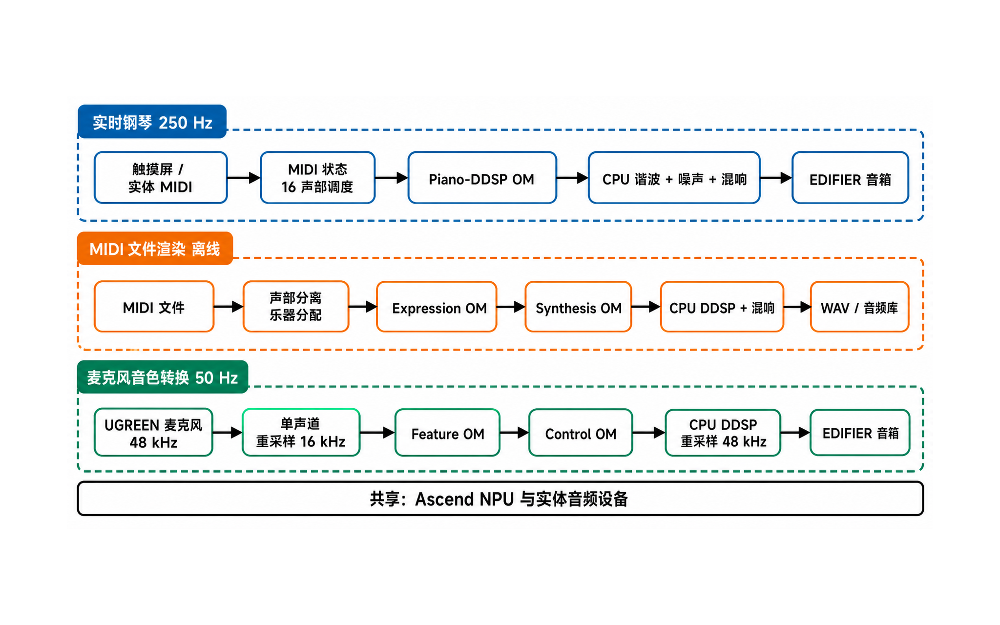

三条链路共享 NPU 和音频设备，但时间模型不同。Piano-DDSP 每 `4 ms` 更新一次控制量；MIDI-DDSP 先知道完整乐曲并离线生成 WAV；DDSP-VST 每 `20 ms` 处理一帧音高和响度控制。它们不能被简单合并为一个“通用模型”。

### 3.2 硬件连接 {#src-experiment-case3-hardware-connection}

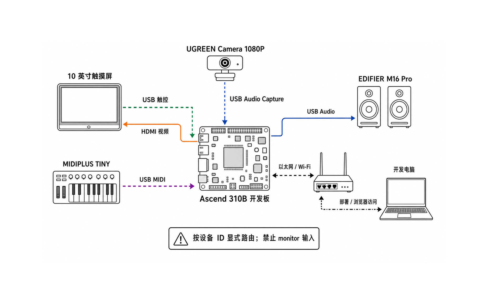

应按设备 ID 选择输入输出。程序不会在摄像头或音箱断开后静默切换到其他设备，也不会把 `Monitor of ...` 当作麦克风。这样的显式路由可以避免突然回放系统声音、产生反馈或把测试发到错误音箱。

### 3.3 开发电脑与开发板的职责边界 {#src-experiment-case3-runtime-boundary}

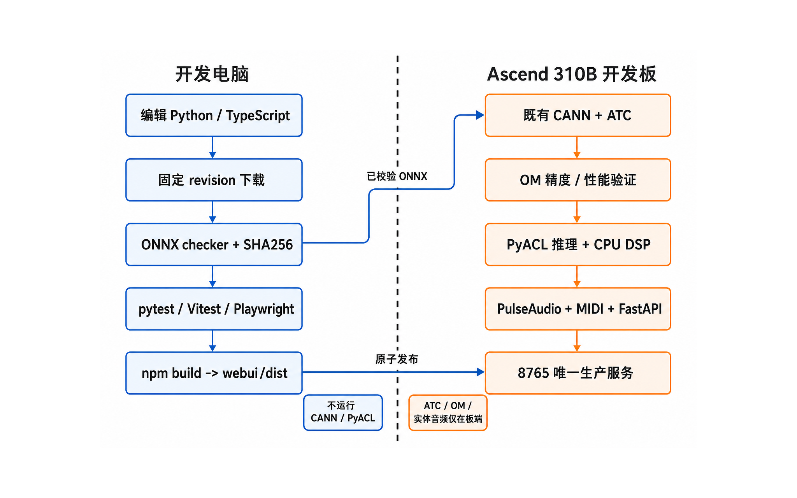

| 操作 | 开发电脑 | Ascend 310B |
| :--- | :---: | :---: |
| 编辑源码、运行普通 Python 单元测试 | 是 | 否 |
| `npm ci`、`npm run test`、`npm run build` | 是 | 否 |
| 下载并校验发布模型 | 是 | 可接收已校验资产 |
| TensorFlow/TFLite 历史导出 | 不属于 case3 当前流程 | 否 |
| ATC、PyACL、OM 推理、`npu-smi` | 否 | 是 |
| PulseAudio 实体路由和真实听音 | 否 | 是 |

## 4. DDSP 原理 {#src-experiment-case3-ddsp-theory}

### 4.1 从采样合成到可微分 DSP {#src-experiment-case3-ddsp-motivation}

传统采样合成器把大量录音映射到音高和力度区域，音色逼真但资产大，跨音高和连续控制依赖插值。端到端波形神经网络可以直接预测音频，却需要在音频采样率上输出大量数据，实时部署的计算量、状态和可解释性都更困难。

DDSP 将已知的振荡器、滤波器、包络和混响写成可微模块，训练时仍可通过梯度优化，部署时只让神经网络预测少量控制量。Google 的 DDSP 工作证明了这种“神经网络负责控制，DSP 负责生成”的音频建模方式。[DDSP 论文][ref-ddsp-paper]和[官方代码][ref-ddsp-repo]给出了完整背景。

### 4.2 基频、谐波和相位 {#src-experiment-case3-harmonic-synthesis}

设采样率为 $f_s$，第 $n$ 个采样的基频为 $f_0[n]$。第 $k$ 个谐波的相位按下式累积：

$$
\phi_k[n+1] = \phi_k[n] + \frac{2\pi k f_0[n]}{f_s}.
$$

网络预测总幅度 $A[n]$ 和未归一化谐波参数 $z_k[n]$。使用非负映射和归一化得到谐波比例：

$$
c_k[n] = \frac{\operatorname{softplus}(z_k[n])}
{\sum_{j=1}^{K}\operatorname{softplus}(z_j[n]) + \varepsilon}.
$$

谐波信号为：

$$
x_h[n] = A[n]\sum_{k=1}^{K}c_k[n]\sin(\phi_k[n]).
$$

超过奈奎斯特频率的谐波必须被抑制，即 $k f_0[n] < f_s/2$。Piano-DDSP 还预测 `inharmonicity`，用于表达钢琴弦的部分音偏离整数倍基频的现象。

### 4.3 滤波噪声、包络、重采样和混响 {#src-experiment-case3-noise-reverb}

噪声支路把白噪声 $w[n]$ 变换到频域，并用网络预测的频带幅度 $H_b[t]$ 构成时变滤波器：

$$
x_n[n] = \operatorname{ISTFT}\left(\operatorname{STFT}(w[n]) \odot H[t,f]\right).
$$

最终干声是谐波和噪声之和：

$$
x_{dry}[n] = g_h x_h[n] + g_n x_n[n].
$$

控制网络工作在 `50 Hz` 或 `250 Hz`，远低于 `16 kHz` 音频采样率，因此幅度、基频和频带系数需要插值到音频时间轴。混响可以是学习到的冲激响应 $r[n]$，也可以是 FreeVerb 风格反馈延迟网络：

$$
x_{wet}[n] = x_{dry}[n] * r[n], \qquad
y[n] = (1-m)x_{dry}[n] + m x_{wet}[n].
$$

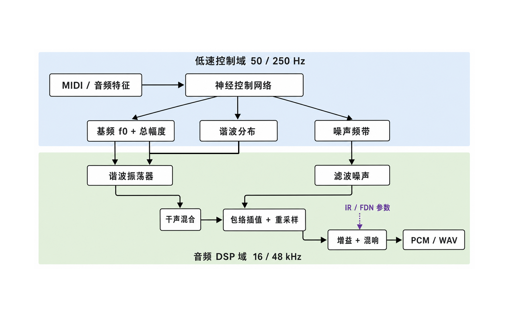

### 4.4 参数如何改变听感 {#src-experiment-case3-perception}

| 控制量 | 物理或听觉含义 | 常见异常 |
| :--- | :--- | :--- |
| `f0` | 基频，决定音高和滑音轨迹 | 噪声被误检为基频时会出现无意义的低音或抖动 |
| 幅度或响度 | 控制音符包络和整体强弱 | 过大会削波，过小会让音色模型看不到有效输入 |
| 谐波分布 | 决定明亮度、共鸣和乐器主体音色 | 高频谐波过多会尖锐，归一化错误会改变总能量 |
| 噪声频带 | 表达吹气、摩擦、击弦和瞬态 | 过高会产生嘶声，全部关闭会让音色不自然 |
| 混响 | 表达空间和尾音 | 全湿声会掩盖起音，实时链路中也会增加主观拖尾 |
| 噪声门 | 阻止环境底噪触发模型 | 阈值过低会持续触发，过高会吞掉轻声起音 |

## 5. 三套神经网络架构 {#src-experiment-case3-model-architectures}

### 5.1 Piano-DDSP {#src-experiment-case3-piano-ddsp}

当前发布为 `model-suite-v1.0.1`，模型结构源自 [DDSP-Piano][ref-piano-ddsp]：`16 kHz` 音频、`250 Hz` 控制率、每次一帧、每帧 `64` 个采样、最多 `16` 个声部。部署图显式输入和输出循环状态，开发板激活的 bundle 为 `model-suite-v1.0.1-gru-unrolled-fp32-origin`，默认模型为 `gru_ir_96_64`。GRU 被展开为基础算子，以适配当前 `Ascend310B4` 的 FP32 编译和连续状态验证。

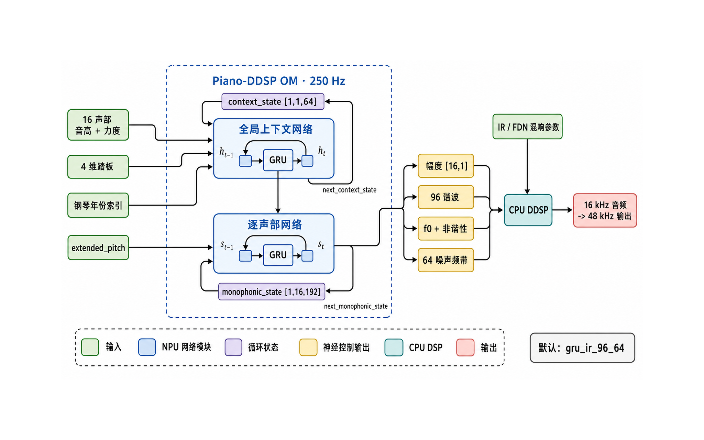

主要张量合同如下，所有张量均为 FP32：

| 方向 | 张量 | 形状 | 含义 |
| :--- | :--- | :--- | :--- |
| 输入 | `conditioning` | `[1,1,16,2]` | 16 声部的音高与力度条件 |
| 输入 | `pedal` | `[1,1,4]` | 踏板与连续控制状态 |
| 输入 | `piano_model` | `[1]` | MAESTRO 钢琴年份索引 |
| 输入 | `extended_pitch` | `[1,1,16,1]` | 扩展音高条件 |
| 输入 | `context_state` | `[1,1,64]` | 全局循环状态 |
| 输入 | `monophonic_state` | `[1,16,192]` | 每声部循环状态 |
| 输出 | `amplitudes` | `[1,1,16,1]` | 声部总幅度 |
| 输出 | `harmonic_distribution` | `[1,1,16,96]` | 96 个谐波比例 |
| 输出 | `inharmonicity`、`f0_hz` | `[1,1,16,1]` | 非谐性和基频 |
| 输出 | `noise_magnitudes` | `[1,1,16,64]` | 64 个噪声频带 |
| 输出 | `reverb_ir` | `[1,24000]` | 学习到的混响冲激响应 |
| 输出 | `next_context_state` | `[1,1,64]` | 下一帧全局状态 |
| 输出 | `next_monophonic_state` | `[1,16,192]` | 下一帧声部状态 |

四个已发布候选模型都通过 `10,000` 帧 OM 连续对照，但结构和混响边界不同：

| 变体 | 时序调制 | 混响 | 谐波/噪声 | 当前作用 |
| :--- | :--- | :--- | :--- | :--- |
| GRU IR | GRU | 学习 IR | 96/64 | 当前默认激活模型 |
| FiLM FDN | FiLM | FDN | 128/96 | 可配置候选 |
| GRU 全湿声 | GRU | 全湿声 IR | 96/64 | 感知校准候选 |
| FiLM 全湿声 | FiLM | 全湿声 IR | 96/64 | FiLM 与学习 IR 候选 |

清单中的完整模型 ID 为：

```text
gru_ir_96_64
film_fdn_128_96
gru_ir_fullwet_96_64
film_ir_fullwet_96_64
```

### 5.2 MIDI-DDSP {#src-experiment-case3-midi-ddsp}

<!-- pdf-figure-here -->

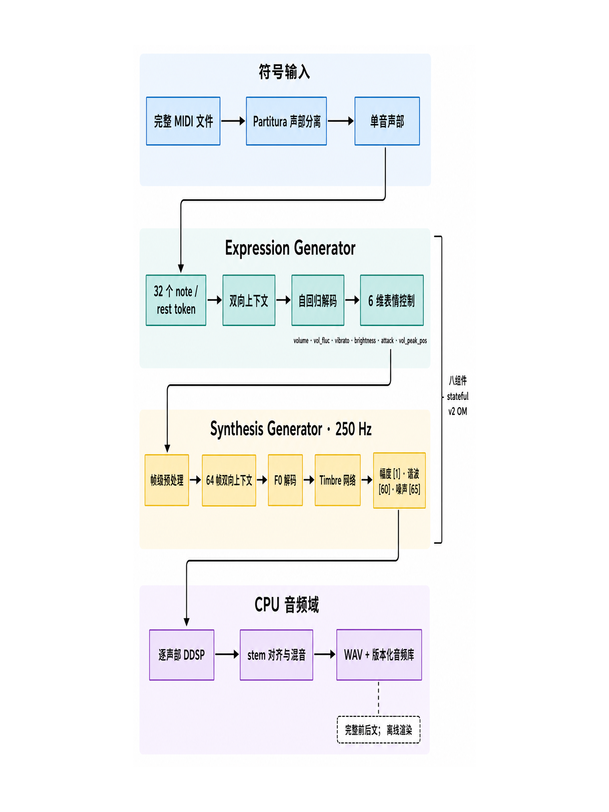

MIDI-DDSP 为已知完整乐曲的离线层级模型，不是物理 MIDI 键盘的低延迟模型。Expression Generator 先从最长 `32` 个 note/rest token 的上下文预测 `6` 维表情控制：`volume`、`vol_fluc`、`vibrato`、`brightness`、`attack` 和 `vol_peak_pos`。Synthesis Generator 再用 `64` 帧窗口、`250 Hz` 控制率生成音频控制量。[MIDI-DDSP 论文][ref-midi-ddsp-paper]和[官方仓库][ref-midi-ddsp-repo]解释了这种符号控制与音色合成的层级结构。

stateful v2 把原始图拆成八个可独立转换和批处理的组件：

| 组件 | 关键输入输出 |
| :--- | :--- |
| `expression_context_forward` | 前向 token 上下文与状态 |
| `expression_context_backward` | 反向 token 上下文与状态 |
| `expression_decode` | 上下文、上一控制与下一自回归状态 |
| `synthesis_precondition` | 帧级音高、表情和乐器条件 |
| `synthesis_context_forward` | 前向帧上下文与状态 |
| `synthesis_context_backward` | 反向帧上下文与状态 |
| `synthesis_f0_decode` | 基频控制与解码状态 |
| `synthesis_timbre` | `amplitude[1]`、`harmonics[60]`、`noise_amps[65]` |

模型为单声部建模。程序先把 MIDI 分成单音声部，再按静态 batch `1/2/4/8` 选择最小可容纳 OM，生成每个 stem，最后对齐并混音。双向上下文需要看到完整前后文，因此不能把这条链路直接放到按键后的 `4 ms` 实时路径中。

### 5.3 DDSP-VST Feature 与 Control {#src-experiment-case3-ddsp-vst}

DDSP-VST Effect 参考[固定上游提交 `f2996e97`][ref-ddsp-vst]。Feature 模型来自 `extract_features_micro.tflite`。固定上游提交的完整值为：

```text
f2996e97f9469f3956a6b8e9d2d9b50b6555e1e9
```

Feature 源码 SHA256 为：

```text
98ade06772f9ca6ac64789fd843f14aeddf709084bbc76f060761b141837d0a2
```

case3 只保留验证后的 ONNX、OM 和转换证据，不保留 TFLite 导出工具。当前 Feature OM 使用 `mixed_float16`，Control OM 对应选择的乐器音色。

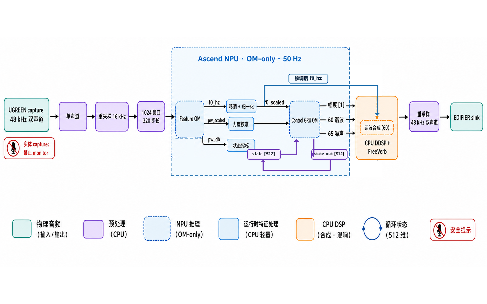

| 模型 | 输入 | 输出 | 时率与作用 |
| :--- | :--- | :--- | :--- |
| Feature OM | `float32[1024]` 音频 | `f0_scaled[1]`、`pw_scaled[1]`、`f0_hz[1]`、`pw_db[1]` | `16 kHz`，步长 `320`，即 `50 Hz` |
| Control OM | `state[512]`、`f0_scaled[1]`、`pw_scaled[1]` | `amplitude[1]`、`harmonics[60]`、`noise_amps[65]`、`state_out[512]` | 每 `20 ms` 更新音色控制与 GRU 状态 |

控制目录包含 Bassoon、Clarinet、Flute、Melodica、Saxophone、Sitar、Trombone、Trumpet、Tuba、Violin 和 Vowels 共 11 种音色。界面显示中文乐器名，但模型 ID、清单和哈希仍保留稳定英文标识。

### 5.4 三套网络对比 {#src-experiment-case3-model-comparison}

| 特性 | Piano-DDSP | MIDI-DDSP | DDSP-VST Effect |
| :--- | :--- | :--- | :--- |
| 输入 | MIDI 帧、踏板、钢琴索引 | 完整 MIDI 文件与乐器分配 | 实体麦克风音频 |
| 主要用途 | 实时复音钢琴 | 离线高质量 MIDI 渲染 | 实时单音音色转换 |
| 复音能力 | 固定 16 声部 | 分离后逐单音声部渲染并混音 | 单音输入 |
| 控制率 | 250 Hz | 250 Hz | 50 Hz |
| 时序状态 | 显式全局与逐声部状态 | 八组件双向和自回归状态 | 512 维 Control GRU 状态 |
| 前后文 | 只依赖过去和当前帧 | 使用完整乐曲的双向上下文 | 滑动音频窗口与过去状态 |
| NPU 输出 | 96 谐波、64 噪声等控制 | 60 谐波、65 噪声等控制 | Feature 特征和 60/65 控制 |
| DSP 边界 | CPU 合成、重采样和 IR/FDN | CPU 合成、混响、stem 混音和 WAV | CPU 合成、重采样、增益和 FreeVerb |

## 6. 模型获取与 Ascend 部署 {#src-experiment-case3-model-deployment}

### 6.1 只消费已发布模型 {#src-experiment-case3-model-download}

case3 不再提供 TensorFlow、Keras、SavedModel 或 TFLite 到 ONNX 的导出代码。历史 TensorFlow/MIDI-DDSP 的模型结构、张量合同和验证过程仍保留在[历史导出文档](https://github.com/zhouxzh/Ascend310/blob/main/samples/case3/doc/midi-ddsp-export.md)，但不再作为当前复现步骤。

当前下载入口为 [`tools/download_model_release.py`](https://github.com/zhouxzh/Ascend310/blob/main/samples/case3/tools/download_model_release.py)。下载器拒绝 `main`、`master` 和 `HEAD` 等移动分支，先解析固定 revision，再下载 `SHA256SUMS`，支持 `.part` 断点续传，并在原子替换前逐文件验证。Piano-DDSP `model-suite-v1.0.1` 的示例为：

```powershell
cd D:\Github\Ascend310\samples\case3
python tools/download_model_release.py `
  --revision model-suite-v1.0.1 `
  --manifest-sha256 1a4a2500ae357577a4a6f7378c28d54235f543663b9b69cc3cf5938929c458d7 `
  --target-dir models/piano_ddsp/model-suite-v1.0.1
```

发布仓库为 [`zhouxzh/piano-ddsp-ascend310`][ref-hf-models]。下载完成后还要核对解析出的固定提交（完整 SHA）：

```text
c41911aa7de454aeacf0b3edbb2d06a0801fb3ff
```

如果 revision、清单摘要或任一资产哈希不一致，应停止，不得继续 ATC。

DDSP-VST Feature 当前本地 release 已保存 ONNX、参考 NPZ、许可证、ATC 原始日志、两种精度验证和 SHA256；在新的不可变 HF revision 完成发布之前，不应把本地目录描述成已公开下载的 release。模型发布状态和操作以[模型与 OM 部署文档](https://github.com/zhouxzh/Ascend310/blob/main/samples/case3/doc/om-deployment.md)为准。

### 6.2 ONNX、ATC、OM 与 PyACL 验证链 {#src-experiment-case3-atc-pipeline}

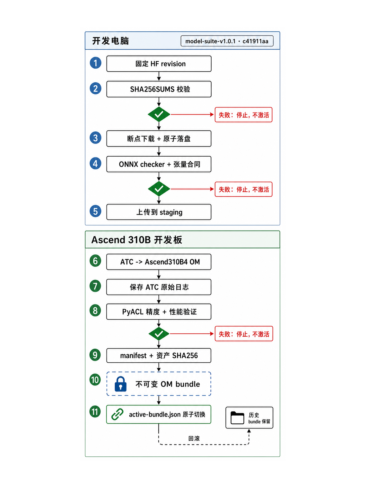

开发板使用现有 CANN 环境执行 ATC，目标 SoC 为 `Ascend310B4`；参数含义和版本要求应以 [Ascend CANN 官方文档][ref-ascend]为准。ONNX 文件先按 [ONNX 官方规范和 checker][ref-onnx]检查。Piano-DDSP 当前使用 `precision_mode_v2=origin` 的 FP32 GRU 展开图；DDSP-VST Feature 选择 `mixed_float16`，因为它通过了 `1,000` 帧精度和 Feature+Control `p95 < 20 ms` 验证，而 `force_fp16` 候选被精度门槛拒绝。

一个可进入运行目录的 bundle 至少应包含：

| 证据 | 目的 |
| :--- | :--- |
| 源 ONNX SHA256 与固定 revision | 证明转换输入没有漂移 |
| OM SHA256 与目标 SoC | 证明运行文件和硬件目标一致 |
| 原始 ATC 日志与摘要 | 保留编译参数、退出码和算子诊断 |
| 输入输出张量合同 | 阻止名称、形状和类型错配 |
| 参考 NPZ 与误差报告 | 比较 ONNX/TFLite 参考和 OM 输出 |
| 性能报告 | 记录 warmup、循环次数、p50、p95、p99 |
| manifest 与许可证 | 让服务端只发现完整、可追溯资产 |

### 6.3 生产运行时严格 OM-only {#src-experiment-case3-om-only}

生产服务只接受目录中的模型 ID，不接受浏览器提交任意文件路径或后端名称。Piano、MIDI-DDSP、DDSP-VST Feature 和 Control 的实际后端都必须报告为 `acl/om`。模型缺失、哈希不符、张量不符、NPU 不可用或实体 capture 消失时，服务拒绝启动并释放资源；不会切换到 ONNX Runtime、TFLite、浏览器推理或 CPU 神经网络。

## 7. 后端设计 {#src-experiment-case3-backend}

### 7.1 FastAPI、作业和文件资产 {#src-experiment-case3-fastapi}

后端入口是 [`midi_ddsp_webui/app.py`](https://github.com/zhouxzh/Ascend310/blob/main/samples/case3/midi_ddsp_webui/app.py)，由 [`scripts/run_webui.py`](https://github.com/zhouxzh/Ascend310/blob/main/samples/case3/scripts/run_webui.py) 在 `0.0.0.0:8765` 启动。FastAPI 同时提供生产静态资源、REST API、WebSocket、MIDI 上传、WAV 产物和状态页面。

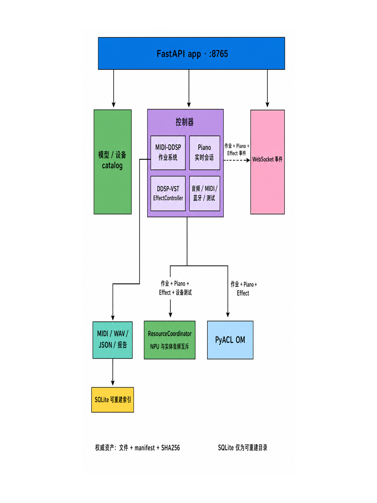

MIDI-DDSP 音频库使用 Python 标准库 `sqlite3`，数据库路径为 `reports/webui/library.sqlite3`。`midi_sources` 以 MIDI 内容 SHA256 标识曲目，`render_versions` 保存每次渲染的模型、声部分配、seed、增益、尾音、WAV 和报告引用；即使配置相同，显式渲染也会产生新历史。SQLite 只是可重建目录，真正权威的数据仍是 MIDI、WAV、任务元数据、manifest、报告和哈希文件。

### 7.2 资源互斥与实时钢琴 {#src-experiment-case3-resource-coordinator}

`ResourceCoordinator` 互斥以下会占用 NPU 或真实音频设备的流程：

- Piano-DDSP 触控与实体 MIDI 共享实时会话；
- DDSP-VST Effect 双工链路；
- MIDI-DDSP 板端 WAV 播放；
- 麦克风输入测试；
- 扬声器左右声道测试。

发生冲突时 API 返回 `409`，而不是同时打开设备。停止、异常、设备断开和线程退出都必须释放锁。浏览器不能绕过协调器直接选择板端文件路径。

Piano worker 是独立常驻子进程。MIDI 的 `note_on` 立即进入状态机，早到的 `note_off` 只在合成状态内部延迟，保证至少四个 `4 ms` 帧，即 `16 ms` 的可听门长。这样既保留触摸响应，也避免一次浏览器帧内的快速按下和释放被合成为零长度声音。重复音符、CC64 延音、voice stealing、`panic` 和 `release_source` 必须共同维护 16 个声部槽位，不能留下悬挂音符或踏板。

合成结果先进入有界 FIFO，再按 low、balanced 或 safe 延迟档合并音频块，通过所选的 PulseAudio、PortAudio 或板载 `alsa_mono` 后端写入明确设备。输出增益是合成内部的 `-60..+6 dB`，默认 `0 dB`；它不会修改 PulseAudio、ALSA、浏览器或音箱硬件音量。

### 7.3 DDSP-VST 音频线程与安全控制 {#src-experiment-case3-effect-runtime}

Effect 的固定链路为：`48 kHz 双声道摄像头输入 -> 单声道 -> 16 kHz -> 1024 窗/320 步长 -> Feature OM -> Control OM -> DDSP 合成 -> 48 kHz 双声道输出`。输入和输出使用 `parec`、`paplay` 对应的 PulseAudio source/sink，不使用 monitor，也不在设备丢失后自动改路。

噪声门先校准环境底噪，再用开启阈值、迟滞、保持、开启和关闭时间平滑门增益。默认只输出转换后的声音，输出增益为 `-18 dB`。持续过载会进入明确的安全静音，并在状态和 WebSocket 中报告；不会继续输出可能削波的声音。

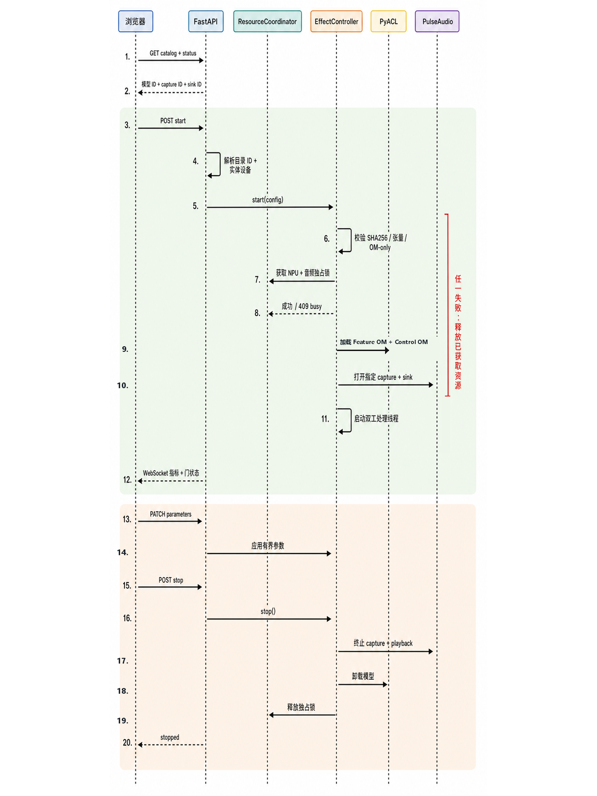

### 7.4 主要 API {#src-experiment-case3-api}

| 类别 | 代表接口 | 作用 |
| :--- | :--- | :--- |
| 系统 | `GET /api/v1/status`、`GET /api/v1/catalog` | 主机、依赖、NPU、模型和作业摘要 |
| 实时钢琴 | `GET /api/v1/realtime/catalog|status` | 查询 patch、输出、MIDI 和会话状态 |
| 实时钢琴 | `POST /api/v1/realtime/start|switch|stop|panic` | 启动、切换、停止和紧急释放共享会话 |
| 实时钢琴 | `PATCH /api/v1/realtime/parameters` | 实时更新增益、移调、混响等有界参数 |
| MIDI-DDSP | `POST /api/v1/midi-files`、`POST /api/v1/midi-ddsp/jobs` | 上传 MIDI，创建渲染任务 |
| 音频库 | `GET /api/v1/midi-ddsp/library` | 曲目、版本、首选版本和可用性 |
| MIDI 解析 | `GET /api/v1/midi-files/{midi_id}/voices|piano-roll` | 声部分离结果与浏览器钢琴卷帘数据 |
| DDSP-VST | `GET /api/v1/ddsp-vst-effect/catalog|status` | OM-only 模型与实体设备目录 |
| DDSP-VST | `POST /api/v1/ddsp-vst-effect/start|stop|calibrate` | Effect 生命周期和底噪校准 |
| DDSP-VST | `PATCH /api/v1/ddsp-vst-effect/parameters` | 更新音色、门限、谐波、噪声、增益和混响 |
| 设备 | `GET /api/v1/speaker-outputs`、`GET /api/v1/audio-inputs`、`GET /api/v1/midi-ddsp/audio-devices`、`GET /api/v1/midi-ports` | 显式枚举各工作流的输入输出和 MIDI |
| 测试 | 扬声器、输入测试和蓝牙接口 | 独占测试与设备管理 |
| WebSocket | `/api/v1/events`、`/api/v1/realtime/events` | 作业状态，以及音符、踏板、弯音、录音、监听和运行指标 |
| WebSocket | `/api/v1/ddsp-vst-effect/events` | 音高、响度、延迟、门与安全静音 |

详细字段、状态和同源限制见[WebUI 与 API 指南](https://github.com/zhouxzh/Ascend310/blob/main/samples/case3/doc/webui.md)。服务没有身份认证，只适合可信局域网。

## 8. 前端设计 {#src-experiment-case3-frontend}

### 8.1 技术栈与应用壳 {#src-experiment-case3-frontend-stack}

前端使用 React 19、TypeScript、Vite、Lucide 图标、Canvas、Vitest 和 Playwright。[`webui/src/App.tsx`](https://github.com/zhouxzh/Ascend310/blob/main/samples/case3/webui/src/App.tsx) 提供固定四项顶层导航：实时演奏、MIDI-DDSP、DDSP-VST 和设备；实时演奏内部使用分段控件切换触摸屏与 MIDI 键盘输入模式。四个工作区使用懒加载，首次进入时显示稳定加载状态；DDSP-VST 首次打开后保留挂载，隐藏时停止 Canvas 绘制，避免重复初始化实时资源。应用每 `5 s` 刷新低频系统状态，同时由 WebSocket 推送作业、音频设备、实时演奏事件和 Effect 指标。

前端只提交服务端目录提供的模型 ID、设备 ID 和有边界参数。错误、不可用、运行、暂停、门关闭、安全静音和 Health Alarm 都同时使用文字与颜色表达，不能只靠颜色区分。

`RealtimePerformanceView` 把当前钢琴音色、音频输出、MIDI 端口、延时档、各音色参数，以及触摸屏和 MIDI 键盘各自的键数、起始音和触控键盘大小保存在版本化浏览器配置中。恢复配置时仍以服务端目录和参数边界为准；会话运行、录音或切换期间锁定输入方式和设备选择，浏览器本地状态不能替代后端会话状态。

### 8.2 两个钢琴卷帘的时间模型 {#src-experiment-case3-canvas}

`LivePianoRoll` 与 `MidiFilePianoRoll` 都使用 Canvas，但不能合并：

| 组件 | 时间来源 | 绘制策略 | 性能边界 |
| :--- | :--- | :--- | :--- |
| `LivePianoRoll` | WebSocket 的实时 note edge | 静态键位/网格缓存，动态轨迹单层更新 | 最多 30 FPS，像素比上限 1.25，历史最多 192 条，空闲时停止 |
| `MidiFilePianoRoll` | 完整 MIDI 时间轴与播放位置 | 静态网格、音符层、动态光标三层 Canvas | 可显示 10,000 音符，不创建逐音符 React/SVG 节点，空闲时停止动画 |

实时卷帘保留短音符的最小可见高度；状态快照只用于重新同步当前按键，不能反推已错过的短音符。文件卷帘支持声部颜色、拍号网格、缩放、拖动、进度光标和活动音符，但不是 MIDI 编辑器。

### 8.3 触摸屏、桌面和手机布局 {#src-experiment-case3-responsive}

10 英寸板端物理屏幕为 `1920 x 1080`，Firefox kiosk 的浏览器内容视口约为 `1920 x 969`。主要导航使用 `20-22 px` 字体，正文和控件以 `16 px` 为目标，次要文字不小于 `14 px`；主要操作高度至少 `56 px`，普通触控目标至少 `52 px`。页面不能依赖浏览器只报告 coarse pointer，因此还使用板端尺寸和页面类触发触摸布局。

窄手机隐藏完整顶部导航并使用带安全区的底部导航。所有支持视口都要求无文档级横向滚动、无控件重叠、文本不被截断，并保留 `tablist`、`tab`、`tabpanel`、键盘焦点和可访问名称。

## 9. 逐页界面与操作说明 {#src-experiment-case3-ui-guide}

本节 12 张截图均在 2026-08-04 从真实 `ascend8t:8765` 生产服务的 Firefox kiosk 重新采集，物理屏幕分辨率为 `1920 x 1080`，没有使用模拟 API。界面上的 `NPU ALARM` 是该板 `npu-smi` 的真实警告；只要 NPU 可见且真实 OM 推理通过，它不自动等同于推理失败。

### 9.1 实时演奏 / 触摸屏 {#src-experiment-case3-ui-touch}

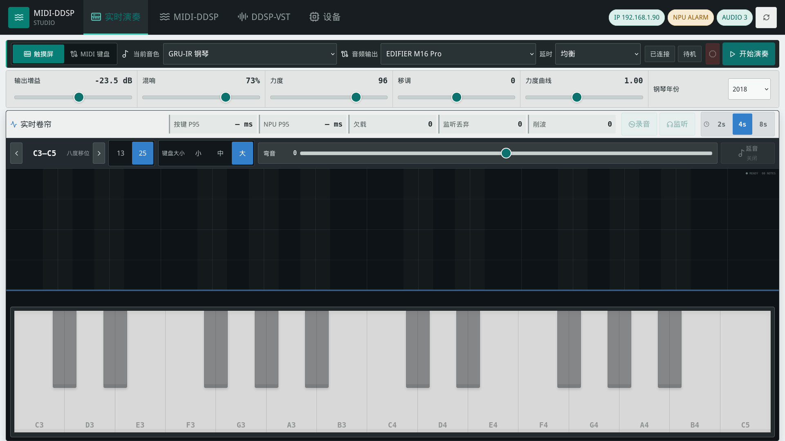

| 区域 | 控件 | 作用 | 正常状态 | 注意事项 |
| :--- | :--- | :--- | :--- | :--- |
| 统一会话栏 | 输入方式、当前音色、音频输出、延时档、开始/停止、Panic | 管理共享 Piano-DDSP 会话 | 截图为已连接、待机 | 会话运行、录音或切换时不能更换输入方式；Panic 用于释放悬挂音符 |
| 参数带 | 输出增益、混响、触控力度、移调、力度曲线、钢琴年份 | 实时改变当前钢琴音色参数 | 数值稳定，不改变布局 | 输出增益不是系统音量，参数值受服务端目录约束 |
| 卷帘工具栏 | 按键 P95、NPU P95、欠载、监听丢弃、削波、录音、监听、2/4/8 秒 | 查看会话指标和实时 note edge | 待机指标为空或为 0，运行后更新 | 短音符保留最小可见轨迹，监听和录音只在会话运行时可用 |
| 触控命令栏 | 13/25 键、小/中/大、八度、弯音、延音 | 调整屏幕琴键范围并演奏 | 截图为 25 键与大键盘 | 无缓存时键盘大小默认为“中”；弯音松开自动回中，88 键只属于 MIDI 键盘模式 |
| 底部钢琴 | 触控白键和黑键 | 手指直接发送 `note_on`/`note_off` | 待机可查看音域，开始后发声 | 快速松开仍由后端保证 16 ms 门长；失焦、取消触摸或停止会全部停音 |

### 9.2 实时演奏 / MIDI 键盘 {#src-experiment-case3-ui-midi-keyboard}


| 区域 | 控件 | 作用 | 正常状态 | 注意事项 |
| :--- | :--- | :--- | :--- | :--- |
| 统一会话栏与参数带 | 当前钢琴音色、音频输出、延时档、输出增益、混响、移调和力度曲线 | 与触摸屏模式共享 Piano-DDSP 会话 | 截图为已连接、待机 | 本页没有第二套音色参数，也不加载 DDSP-VST Synth 或 MIDI 文件抽屉 |
| 键盘范围 | 32/49/61/88 键、八度 | 匹配实体控制器与可视范围 | MIDIPLUS TINY 显示 32 键 | 小于 88 键可逐八度移动；88 键固定为 A0-C8 |
| 实体 MIDI 输入 | 服务端端口下拉框 | 绑定板端枚举的输入端口 | MIDIPLUS TINY 被选中 | 浏览器 Web MIDI 不是输入来源；运行中不能换端口，断开时释放该来源音符 |
| 卷帘工具栏 | 会话指标、录音、监听、2/4/8 秒 | 观察真实 WebSocket 音符边沿和运行状态 | 短音符仍有可见标记 | 不用轮询替代边沿事件；录音、监听和指标与触摸屏模式共享 |
| 可视键盘 | 只读键位高亮 | 对照实体 MIDI 的当前音符和音域 | 32 键范围为 F2-C5 | 只用于反馈，不在此处提供鼠标或触控演奏 |

### 9.3 MIDI-DDSP 音频库 {#src-experiment-case3-ui-library}

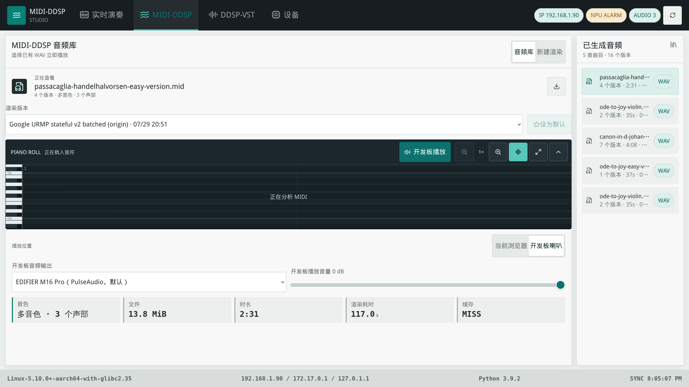

| 区域 | 控件 | 作用 | 正常状态 | 注意事项 |
| :--- | :--- | :--- | :--- | :--- |
| 主标题 | 音频库/新建渲染 | 切换浏览与创建流程 | 音频库选中 | 两种流程不混在一个长页面 |
| 曲目与版本 | 版本下拉、设为默认 | 一首 MIDI 管理多次渲染 | 版本、音色和 WAV 同步变化 | 缺失文件会标记不可用，不删除历史 |
| 文件卷帘 | 缩放、跟随、全屏 | 查看完整 MIDI 和播放光标 | 仅一个可见卷帘 | 页面不恢复第二个波形动画 |
| 播放区 | 开发板/浏览器、设备、增益 | 选择实际播放目标 | 默认开发板喇叭 | 浏览器播放不改变系统 mixer |
| 右侧曲目列表 | 曲目、版本数、时长 | 快速切换音频库来源 | 选中项有文字和底色 | 选择不可用版本时返回错误 |

### 9.4 MIDI-DDSP 新建渲染 {#src-experiment-case3-ui-render}


| 区域 | 控件 | 作用 | 正常状态 | 注意事项 |
| :--- | :--- | :--- | :--- | :--- |
| 曲目栏 | MIDI 选择和上传 | 选择现有文件或上传受限格式 | 显示时长、音符、轨道和声部 | 只接受 `.mid/.midi` 和大小限制 |
| 文件卷帘 | 声部颜色与视图控制 | 检查声部分离结果 | 声部数与表格一致 | 和弦轨需先拆成单音声部 |
| 分配表 | 每声部合成音色 | 修改自动建议 | 每个声部都有有效目录 ID | 浏览器不提交模型文件路径 |
| 右侧设置 | bundle、方案、seed、增益、尾音 | 固定可复现的渲染配置 | OM 已验证、声部已就绪 | 相同配置再次渲染仍创建新版本 |
| 底部操作 | 开始渲染、状态、产物 | 创建异步任务并显示进度 | succeeded 后可下载 | 运行时保留取消、心跳、ETA 和报告 |

<!-- pdf-page-break -->

### 9.5 DDSP-VST 音色 {#src-experiment-case3-ui-vst-tone}

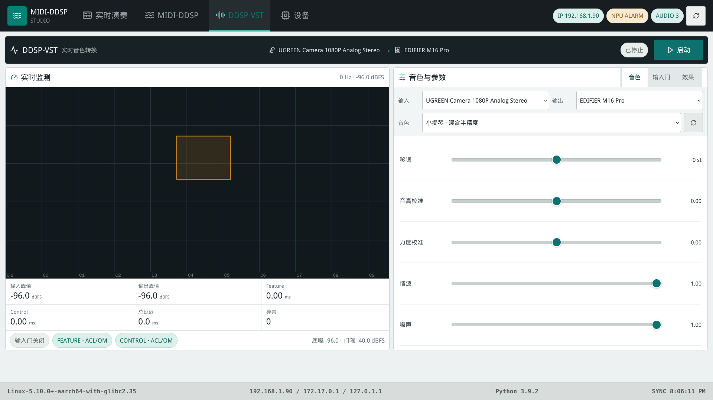

| 区域 | 控件 | 作用 | 正常状态 | 注意事项 |
| :--- | :--- | :--- | :--- | :--- |
| 顶部链路 | 输入、输出、运行/停止 | 明确真实设备路径 | UGREEN 到 EDIFIER，运行中 | 运行时不允许静默换设备 |
| 轨迹 Canvas | 音高和响度点 | 观察单音输入与门限 | Canvas 非空，异常为 0 | 环境噪声也可能有音高估计，不等于已输出 |
| 模型区 | 11 种中文音色 | 选择 Control OM | 小提琴混合半精度 | 后端仍用稳定模型 ID 和 SHA256 |
| 音色参数 | 移调、音高校准、力度、谐波、噪声 | 调整转换控制 | 有边界值即时更新 | 谐波和噪声全关会失去主要声源 |
| 指标 | Feature、Control、总延迟、后端 | 证明 OM 链路和线程状态 | `ACL/OM` 且异常 0 | 指标不能代替听感评价 |

### 9.6 DDSP-VST 输入门 {#src-experiment-case3-ui-vst-gate}

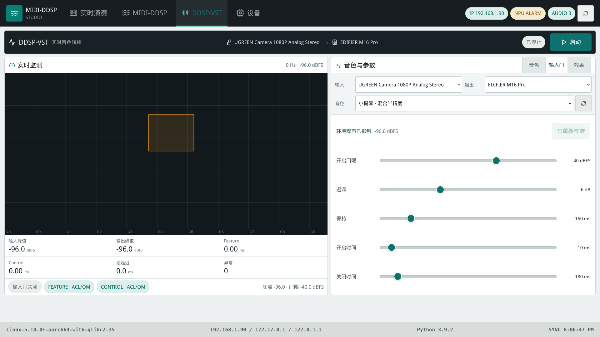

| 区域 | 控件 | 作用 | 正常状态 | 注意事项 |
| :--- | :--- | :--- | :--- | :--- |
| 校准 | 重新校准 | 采集环境底噪并给出建议门限 | 显示底噪和门限 | 校准时应保持安静，不要讲话或播放声音 |
| 开启门限 | dBFS 滑块 | 达到阈值后允许音频进入 | 底噪低于开启门限 | 太低会被噪声触发，太高会吞轻声 |
| 迟滞 | dB 滑块 | 让关闭阈值低于开启阈值 | 开关不频繁抖动 | 迟滞不是额外增益 |
| 保持/开启/关闭 | 毫秒滑块 | 平滑门状态 | 输入门状态稳定 | 关闭过慢会拖尾，过快会切断音头 |
| 状态条 | 输入门已关闭/打开 | 明确当前是否输出 | 静音环境显示关闭 | 有音高点但门关闭时不会送入合成输出 |

### 9.7 DDSP-VST 效果 {#src-experiment-case3-ui-vst-effects}


| 区域 | 控件 | 作用 | 正常状态 | 注意事项 |
| :--- | :--- | :--- | :--- | :--- |
| 输出增益 | dB 滑块 | 控制转换后 PCM | 默认 `-18 dB` | 与系统音量分离，避免同时放大两处 |
| 混响空间 | 0 到 1 | 调整房间反馈感 | 默认 0.40 | 更大空间会增加主观尾音 |
| 混响阻尼 | 0 到 1 | 衰减高频反馈 | 默认 0.10 | 不是低通滤波器的精确截止频率 |
| 混响 | 0 到 1 | 控制湿声比例 | 默认 0 | 第一版没有原声 Dry/Wet 直通 |
| 安全状态 | 异常和安全静音 | 防止持续过载 | 异常 0、安全静音关闭 | 触发后应停止并排查输入和增益 |

### 9.8 设备概览 {#src-experiment-case3-ui-device-overview}

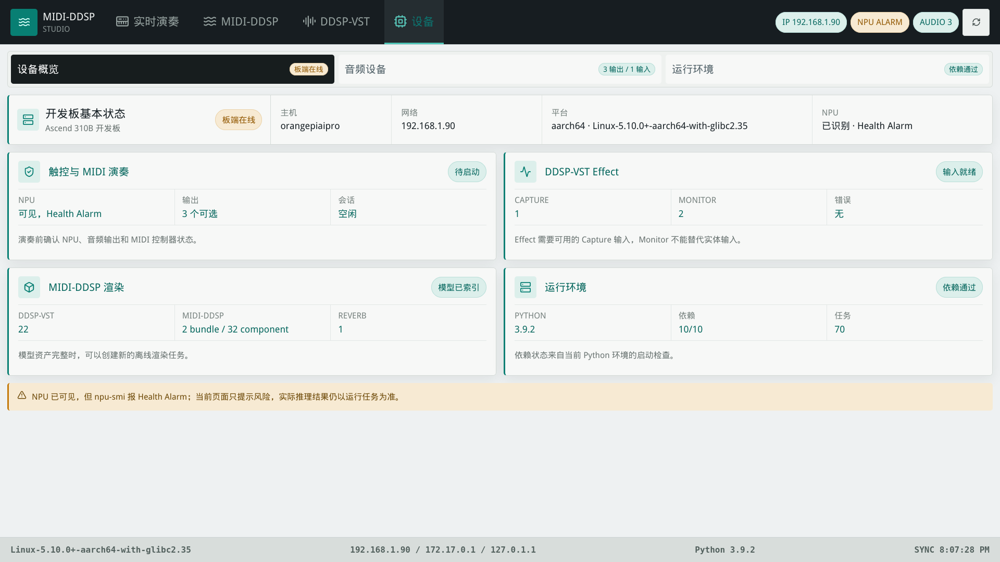

<!-- pdf-page-break -->

| 区域 | 正常状态 | 验收要点 |
| :--- | :--- | :--- |
| 开发板状态 | 板端在线、IP 可见、NPU 状态显示 | Health Alarm 是警告，真实推理结果优先 |
| 触控与 MIDI | 输出可选、会话无错误 | 概览只提示准备度，不重复提供跳转按钮 |
| DDSP-VST | 至少一个 capture、错误为 0 | monitor 数量不代表麦克风数量 |
| MIDI-DDSP | bundle 和组件已索引 | 发现资产不等同于已听音验收 |
| 运行环境 | Python、依赖、任务状态可见 | 详细内容放在运行环境页 |

### 9.9 音频输出与扬声器测试 {#src-experiment-case3-ui-audio-output}


| 区域 | 控件 | 作用 | 正常状态 | 注意事项 |
| :--- | :--- | :--- | :--- | :--- |
| 蓝牙音频 | 刷新、扫描、连接 | 管理板端已有蓝牙能力 | 控制器开启、设备可见 | 不在板端安装缺失的 `bluetoothctl` |
| 接口状态 | 输出/输入/MIDI | 切换设备清单 | EDIFIER PulseAudio 和直接 ALSA 可见 | “检测到”不等于已听见 |
| 声道表 | Left、Right 和电平 | 展示测试声道和状态 | 空闲时电平归零 | 测试会独占输出资源 |
| 输出设置 | 音频输出、系统音量 | 选择 sink 并显示真实系统音量 | EDIFIER、100%、未静音 | 音箱硬件按键应通过设备事件更新显示 |
| 测试设置 | 左/双/右声道、频率、增益、时长 | 播放受控正弦测试 | 状态从 IDLE 进入运行 | 从低增益开始，避免突然高声压 |

### 9.10 音频输入与麦克风测试 {#src-experiment-case3-ui-audio-input}

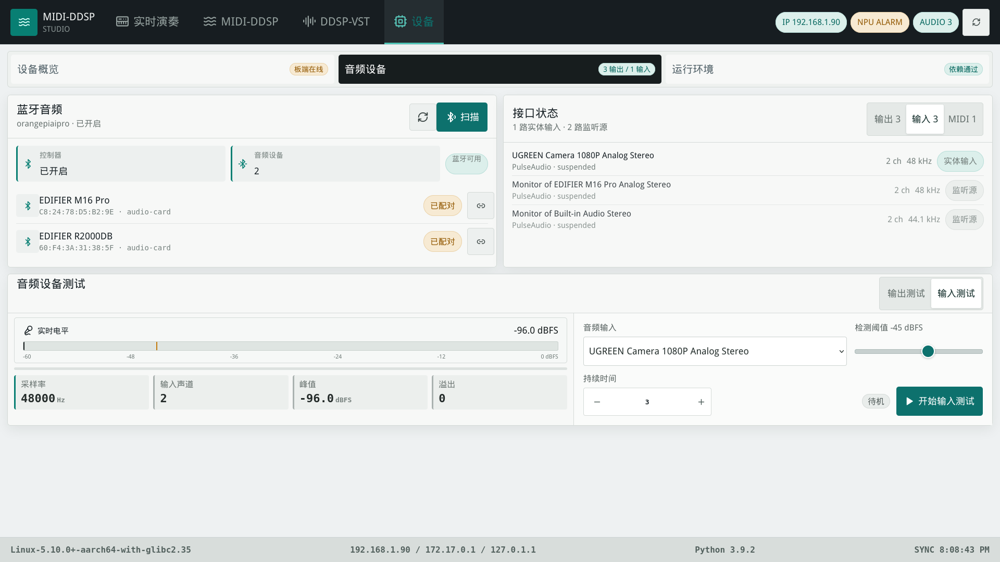

| 区域 | 控件 | 作用 | 正常状态 | 注意事项 |
| :--- | :--- | :--- | :--- | :--- |
| 输入清单 | capture 与 monitor | 区分实体采集和回放监视 | UGREEN 标为 CAPTURE | Effect 和输入测试都拒绝 monitor |
| 实时电平 | dBFS 表和峰值 | 观察麦克风输入 | 讲话时电平变化、无溢出 | `-96 dBFS` 表示空闲或未开始测试 |
| 输入选择 | capture 下拉 | 固定真实麦克风 ID | UGREEN 被选中 | 设备断开后不会自动替换 |
| 检测阈值 | dBFS 滑块 | 控制输入测试是否判为有效 | 高于底噪、低于说话峰值 | 与 DDSP-VST 噪声门是两个不同设置 |
| 时长与开始 | 步进器、开始输入测试 | 运行独占采集检查 | IDLE 或完成结果 | 测试期间不能启动 Effect |

### 9.11 MIDI 设备 {#src-experiment-case3-ui-midi-device}

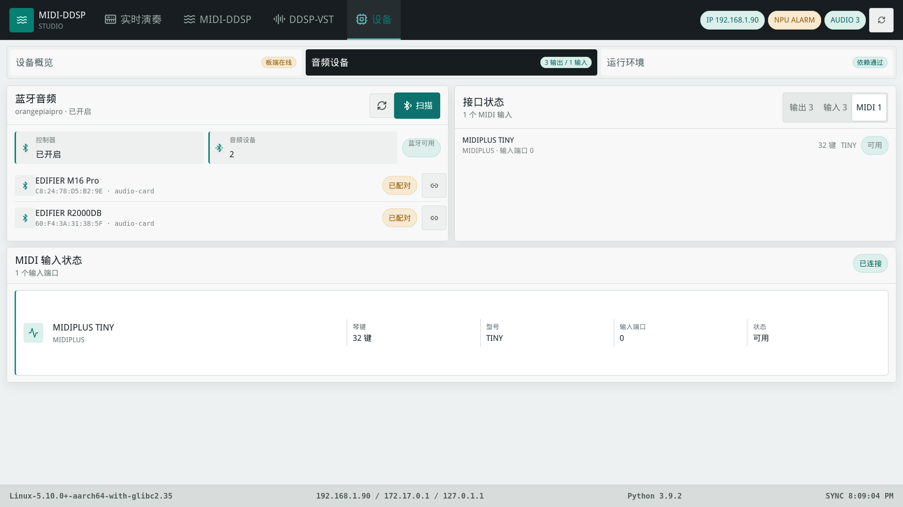

| 区域 | 控件 | 作用 | 正常状态 | 注意事项 |
| :--- | :--- | :--- | :--- | :--- |
| MIDI 清单 | MIDI 页签 | 枚举服务端输入端口 | MIDIPLUS TINY、32 keys、AVAILABLE | 浏览器 Web MIDI 不是板端输入来源 |
| 制造商与端口 | 型号、Input port | 识别正确设备 | MIDIPLUS、端口 0 | 重新插拔后设备 ID 可能变化，应刷新 |
| MIDI 输入状态 | 全宽设备状态卡 | 显示键数、型号、输入端口和可用状态 | MIDIPLUS TINY 已连接 | 切换到 MIDI 后不显示输入或输出音频测试；MIDI 枚举本身不会产生声音 |
| 蓝牙区 | 已配对音频设备 | 展示另一类外设状态 | 与 MIDI 清单分开 | 蓝牙音频不能替代 USB MIDI |

### 9.12 运行环境 {#src-experiment-case3-ui-runtime}

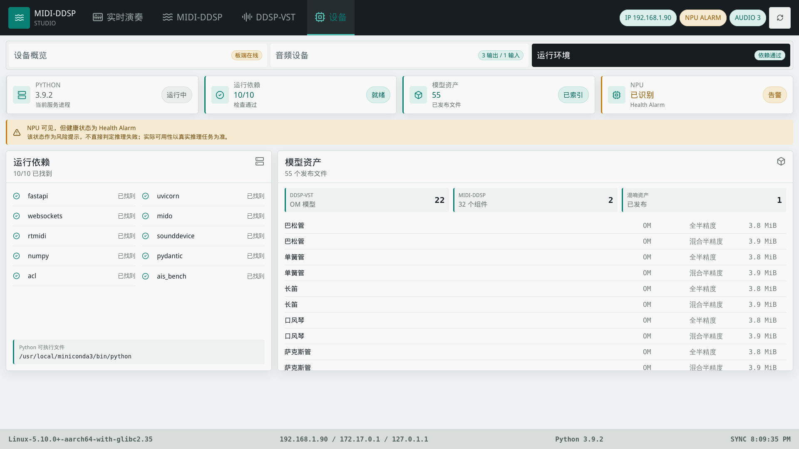

<!-- pdf-page-break -->

| 区域 | 控件 | 作用 | 正常状态 | 注意事项 |
| :--- | :--- | :--- | :--- | :--- |
| 摘要 | Python、依赖、模型、NPU | 一屏判断服务准备度 | Python 3.9.2、10/10 依赖 | 版本以当前板端环境为准 |
| NPU 警告 | Health Alarm 文本 | 如实展示硬件诊断 | 警告可见 | 不直接粘贴整个终端输出 |
| 运行依赖 | 包名与找到状态 | 定位 Python 启动缺包 | 全部找到 | 板端只允许唯一 requirements 的 pip 安装例外 |
| 模型资产 | 类型、精度、大小 | 检查目录索引结果 | OM 数量和精度可见 | 资产存在仍需哈希和真实推理验证 |
| Python 路径 | 可执行文件 | 证明使用现有 conda base | `/usr/local/miniconda3/bin/python` | 不回退到系统 Python |

### 9.13 已验证视口 {#src-experiment-case3-viewport-matrix}

| 视口 | 输入方式 | 导航 | 重点验收 |
| :--- | :--- | :--- | :--- |
| `1920 x 1080` | 10 英寸物理 kiosk | 完整顶部导航 | 12 张真实页面截图、实际点按、底部琴键贴边和无裁切 |
| `1920 x 969` | 10 英寸触摸内容视口 | 完整顶部导航 | 一屏主工作流、触控目标、Canvas 非空、无滚动冲突 |
| `1366 x 768` | 桌面 | 完整顶部导航 | 紧凑布局、无重叠和横向溢出 |
| `1024 x 768` | 平板 | 响应式顶部/底部策略 | 参数换行、可访问页签和触控尺寸 |
| `390 x 844` | 手机 | 底部导航 | 安全区、折叠内容、无文档级横向滚动 |

## 10. 从零复现实验 {#src-experiment-case3-reproduction}

### 10.1 接线与启动检查 {#src-experiment-case3-bringup}

1. 断电状态连接开发板电源、启动存储、HDMI 屏幕和 USB 触控线。
2. 连接 EDIFIER M16 Pro、UGREEN 摄像头和 MIDIPLUS TINY；高功耗 USB 设备较多时使用合规的独立供电 Hub。
3. 连接网线或 Wi-Fi，启动开发板，确认触摸和桌面正常。
4. 在开发板查看 IPv4、USB、ALSA/PulseAudio 和 MIDI；这些是板端只读诊断，不在开发电脑执行。

```bash
ip -4 address
lsusb
pactl list short sinks
pactl list short sources
cat /proc/asound/cards
cat /proc/asound/seq/clients
```

在 `pactl list short sources` 中，UGREEN 应出现为 `alsa_input...` 实体 capture。`*.monitor` 是输出回放监视源，不能用于 DDSP-VST 或麦克风输入测试。

### 10.2 开发电脑准备与本地测试 {#src-experiment-case3-local-setup}

```powershell
cd D:\Github\Ascend310\samples\case3
python -m pip install -r requirements.txt
python -m pytest -q

cd webui
npm ci
npm run test
npm run build
npm run test:e2e
```

各 npm 命令的职责不同：

| 命令 | 作用 | 何时必须执行 |
| :--- | :--- | :--- |
| `npm ci` | 严格按 `package-lock.json` 安装前端依赖 | 第一次准备环境、删除过 `node_modules` 或锁文件变化后 |
| `npm run test` | 用 Vitest 检查组件、状态和交互回归 | 前端逻辑、组件或相关样式改变后；纯低风险文字修改可酌情跳过 |
| `npm run build` | TypeScript 检查并生成部署所需 `webui/dist` | 任何前端源码变化后必须执行 |
| `npm run test:e2e` | 用 Playwright 检查真实页面布局和交互 | 发布前或影响工作流、响应式、Canvas 时 |

开发板不安装 Node 或 npm，也不运行 Vite 生产服务器。它只接收开发电脑生成的 `webui/dist/`。

### 10.3 下载、校验和准备模型 {#src-experiment-case3-prepare-models}

先执行第 6.1 节的固定 revision 下载。对每个发布目录执行清单校验，并检查 manifest 中的模型 ID、输入输出、精度、目标 SoC 和验证状态。ONNX 到 OM 的 ATC 操作必须在真实 Ascend 开发板上完成；开发电脑不安装或模拟 CANN。

板端 ATC 和 bundle 细节随模型族不同，不应手工猜测输入形状。使用仓库现有的模型准备、转换和验证工具，并遵循[模型与 OM 部署文档](https://github.com/zhouxzh/Ascend310/blob/main/samples/case3/doc/om-deployment.md)与[Piano-DDSP 合同](https://github.com/zhouxzh/Ascend310/blob/main/samples/case3/doc/piano-ddsp.md)。所有新结果保留源/目标 SHA256、ATC 日志、参考输入和 PyACL 报告。

### 10.4 部署、原子切换和启动 {#src-experiment-case3-deploy}

开发电脑执行现有部署脚本：

```powershell
cd D:\Github\Ascend310\samples\case3
powershell -ExecutionPolicy Bypass -File tools/deploy_midi_ddsp_webui.ps1
```

脚本递归同步完整 Python 包、vendored `partitura` 和模型运行元数据，并把前端 `dist` 放到 staging，校验哈希后才原子切换。不要使用会删除远端文件的镜像参数；板端的 MIDI、WAV、报告、任务历史、转换日志和校验文件必须保留。

在板端已有 conda `base` 中，仅允许安装本仓库唯一 requirements 并确认 pytest：

```bash
cd /home/HwHiAiUser/Documents/case3
/usr/local/miniconda3/bin/python -m pip install -r requirements.txt
/usr/local/miniconda3/bin/python -m pytest -q
/usr/local/miniconda3/bin/python scripts/check_webui_env.py
/usr/local/miniconda3/bin/python scripts/run_webui.py
```

只启动原 `8765` 服务，不额外开启 Vite、Node 或其他端口。服务启动后检查：

```bash
curl -fsS http://127.0.0.1:8765/
curl -fsS http://127.0.0.1:8765/api/v1/status
```

还应核对进程 PID、WebSocket、生产静态资源哈希和触摸屏页面。Web 服务是 LAN-only 且无认证，不要直接暴露到公网。

### 10.5 功能验收顺序 {#src-experiment-case3-acceptance-order}

1. **设备**：确认 IP、NPU、Python、依赖、EDIFIER 输出、UGREEN capture 和 MIDIPLUS MIDI。
2. **触控演奏**：先以低音量测试单音，再测试快速点按、多指、延音、移调和 panic。
3. **MIDI 键盘**：测试力度、重复音、快速音阶、CC64、断开重连和无悬挂音符。
4. **MIDI-DDSP**：选择 MIDI，检查声部分离和分配，渲染 WAV，切换版本并测试开发板/浏览器播放。
5. **DDSP-VST**：停止钢琴会话，选择 UGREEN 与 EDIFIER，安静校准噪声门，再以单音测试 11 个音色。

真实音频验收至少记录推理耗时、队列延迟、总延迟、PCM 非零、削波、capture overflow 和 playback underrun。仅有 HTTP 200 不能证明发声正确。

## 11. 实测结果与故障排查 {#src-experiment-case3-results}

### 11.1 DDSP-VST 板端长稳验收 {#src-experiment-case3-measured-results}

本节只从 `samples/case3/reports/publication/ddsp-vst-effect-long-run.json` 回填日期和数值。
报告必须由 `tools/benchmark_ddsp_vst_effect.py` 在板端本机 API 上生成，并同时满足以下条件：

- 使用 UGREEN 实体 capture、Violin Control OM 和 EDIFIER 实体 sink；
- 由操作人员显式确认独立单音声源，禁止把 EDIFIER 到 UGREEN 的声学反馈当作输入；
- 持续至少 `600 s`，状态每 `10 s` 采样一次，处理帧数持续增长；
- 存在非静音输入、非静音输出和有效 F0；
- Feature 与 Control 的合计 p95 小于 `20 ms`，软件总延迟小于 `150 ms`；
- capture overflow、playback underrun、clipped samples 均为 `0`，且 safety mute 未触发。

当前未保留合格的 publication 报告，因此不发布旧日期或旧性能数字。真实设备、独立声源和上述
全部门槛通过后，才可将该 JSON 中的结果回填到本节；失败报告必须保留失败状态，不能沿用上一次
成功表格。HTTP 200、单独 OM smoke test 或页面截图都不能替代这项双工长稳验收。

### 11.2 常见问题 {#src-experiment-case3-troubleshooting}

| 现象 | 优先检查 | 处理原则 |
| :--- | :--- | :--- |
| 页面正常但没有声音 | 会话状态、输出 ID、系统静音、合成增益、PCM 非零、underrun | 先用扬声器测试确认路由，再检查模型和 MIDI；不要同时提高系统音量和合成增益 |
| 一点噪声就触发 DDSP-VST | capture 是否正确、底噪、开启门限、迟滞和校准环境 | 安静时重新校准；提高开启门限，保留合理迟滞和保持时间 |
| DDSP-VST 始终没有输出 | 输入门、`pw_db`、安全静音、Feature/Control 后端 | 确认讲话峰值高于门限且两个后端都是 `acl/om` |
| 快速 MIDI 声音抖动 | 重复 note edge、声部复用、FIFO、设备 underrun | 不增加前端 hold delay；检查后端 16 ms 最小门、WebSocket 边沿和 MIDI 来源释放 |
| 触摸键抖动或多指缺失 | 浏览器 pointer 事件、触控硬件、多指取消 | 确保 `pointerdown/up/cancel` 成对，禁用浏览器手势冲突，保留 `panic` 回收 |
| 悬挂音符或踏板 | `note_off`、CC64、`release_source`、断线清理 | 执行 panic；修复事件边界，不能靠高频轮询重建短音符 |
| 开发板没有 IPv4 | 路由器 DHCP、网线、接口状态、地址冲突 | 先恢复网络基础设施；不要修改应用代码来掩盖路由器故障 |
| NPU 显示 Health Alarm | NPU 是否可见、真实 OM 是否能加载和推理、CANN 日志 | 保留警告；真实推理成功时不自动阻断，失败时保存诊断 |
| 模型哈希错误 | revision、`SHA256SUMS`、`.part` 文件、同步完整性 | 删除或重新下载损坏的单个暂存文件；不能跳过校验或修改 manifest 迎合错误文件 |
| 摄像头或音箱中途断开 | 固定设备 ID、PulseAudio source/sink、线程退出和资源锁 | 立即停止并释放资源；重新枚举后由用户显式选择，禁止静默改路 |
| 蓝牙设备可见但不可播放 | `bluetoothctl`、PulseAudio A2DP sink、连接 profile | 使用板端已有设施；缺少系统组件时报告，不在部署中安装 |

更多板端日志、ATC/OOM、音频和兼容性案例见[测试故障排查记录](https://github.com/zhouxzh/Ascend310/blob/main/samples/case3/doc/troubleshooting.md)与[音频输出说明](https://github.com/zhouxzh/Ascend310/blob/main/samples/case3/doc/audio-output.md)。

### 11.3 测试矩阵 {#src-experiment-case3-test-matrix}

| 层级 | 工具 | 主要覆盖 |
| :--- | :--- | :--- |
| Python 单元与 API | pytest | MIDI 状态边沿、16 ms 门、资源冲突、SQLite 重建、OM-only、monitor 拒绝、参数边界和线程清理 |
| React 组件 | Vitest | 加载、不可用、运行、故障、安全静音、触摸事件和音色中文显示 |
| 页面回归 | Playwright | 四视口、四项导航、实时演奏双输入模式、Canvas 非空、无溢出、快速触摸和 MIDI-DDSP 单卷帘 |
| 板端模型 | PyACL 与参考 NPZ | 张量合同、1,000/10,000 帧精度、p95/p99 和 NaN/Inf |
| 板端音频 | 真实双工与听音 | PCM 非零、路由、总延迟、overflow、underrun、clipping 和设备断开 |

本地测试不得运行 PyACL、ATC、OM 推理或 `npu-smi`；这些结果必须来自真实 Ascend 310B。

## 12. 代码结构、总结与参考资料 {#src-experiment-case3-code-and-references}

### 12.1 目录结构 {#src-experiment-case3-directory-tree}

```text
samples/case3/
|-- midi_ddsp_webui/          # FastAPI、作业、设备、音频库和 DDSP-VST Effect
|   `-- vendor/partitura/     # vendored MIDI 解析依赖
|-- piano_ddsp_runtime/       # Piano worker、MIDI 状态、DSP、FIFO 和指标
|-- webui/
|   |-- src/                  # React、TypeScript、Canvas 和分模块 CSS
|   |-- e2e/                  # Playwright 真实页面测试
|   `-- dist/                 # 本地构建、板端部署的生产静态资源
|-- tests/                    # Python 单元、API 和部署布局测试
|-- tools/                    # 下载、部署、OM 对照、哈希和报告工具
|-- scripts/                  # 服务启动与板端环境检查入口
|-- models/                   # 发布 ONNX、OM bundle、manifest 和转换证据
|-- reports/                  # 本地或板端生成的测试证据和音频库索引
|-- midi/                     # 本地测试 MIDI，不上传 GitHub
|-- midi_wav/                 # 本地渲染 WAV，不上传 GitHub
|-- doc/                      # 深入设计、部署和故障文档
|-- pyacl_ddsp.py             # DDSP-VST Control OM 封装
|-- pyacl_midi_ddsp.py        # MIDI-DDSP 多组件 OM 封装
|-- midi_ddsp_realtime.py     # MIDI-DDSP 渲染与 CPU DSP
|-- realtime_ddsp.py          # 命令行实时入口
|-- requirements.txt          # 唯一 Python 依赖清单，包含 pytest
`-- README.md                 # 案例代码入口
```

目录数量不能只按视觉上的“少”来优化。浏览器 UI、板端音频路由、MIDI 状态、模型推理、测试和生成证据有不同生命周期，保留清晰边界比把它们塞进少数大文件更容易维护。可以删除的是已证明无运行、测试、教程或部署作用的代码，不能删除本地 MIDI/WAV、模型清单、哈希、转换日志和历史报告。

### 12.2 关键模块与数据流 {#src-experiment-case3-module-map}

| 模块 | 责任 | 不负责的内容 |
| :--- | :--- | :--- |
| `midi_ddsp_webui/app.py` | API、同源检查、请求校验和静态资源 | 不直接实现 DSP 算法 |
| `midi_ddsp_webui/core.py` | 目录、作业、资源协调和通用状态 | 不允许浏览器路径穿透 |
| `midi_ddsp_webui/realtime_session.py` | Piano 会话生命周期和 worker 通信 | 不解析完整 MIDI-DDSP 乐曲 |
| `midi_ddsp_webui/ddsp_vst_effect.py` | capture、Feature/Control OM、噪声门和双工线程 | 不提供 ONNX/TFLite 回退 |
| `piano_ddsp_runtime/midi_state.py` | 16 声部、重复音、踏板、panic 和最小门长 | 不增加前端网络延迟 |
| `piano_ddsp_runtime/engine.py` | Piano OM 控制与 CPU DSP | 不改变系统 mixer |
| `midi_ddsp_realtime.py` | 八组件调度、声部 stem、合成和混音 | 不作为实体 MIDI 的低延迟引擎 |
| `webui/src/App.tsx` | 应用壳、四项顶层导航、状态刷新和懒加载 | 不执行模型推理 |
| Canvas 组件 | 卷帘几何、缓存和动画 | 不每帧触发整页 React 更新 |

最关键的数据原则是：浏览器只表达用户意图，后端拥有模型和设备路径，OM 只预测控制量，CPU DSP 生成波形，文件系统保存可恢复证据。

### 12.3 继续阅读 {#src-experiment-case3-further-reading}

- [Case3 代码总览](https://github.com/zhouxzh/Ascend310/tree/main/samples/case3)
- [系统分层设计](https://github.com/zhouxzh/Ascend310/blob/main/samples/case3/doc/overview.md)
- [WebUI、操作与 API](https://github.com/zhouxzh/Ascend310/blob/main/samples/case3/doc/webui.md)
- [Piano-DDSP 模型与实时合同](https://github.com/zhouxzh/Ascend310/blob/main/samples/case3/doc/piano-ddsp.md)
- [MIDI-DDSP 与 DDSP-VST 对比](https://github.com/zhouxzh/Ascend310/blob/main/samples/case3/doc/midi-ddsp-vs-ddsp-vst.md)
- [MIDI-DDSP 实时与离线边界](https://github.com/zhouxzh/Ascend310/blob/main/samples/case3/doc/midi-ddsp-realtime.md)
- [模型与 OM 部署](https://github.com/zhouxzh/Ascend310/blob/main/samples/case3/doc/om-deployment.md)
- [音频输出与设备边界](https://github.com/zhouxzh/Ascend310/blob/main/samples/case3/doc/audio-output.md)
- [测试故障排查](https://github.com/zhouxzh/Ascend310/blob/main/samples/case3/doc/troubleshooting.md)

### 12.4 总结 {#src-experiment-case3-summary}

本案例的核心不是把三个模型放进同一个网页，而是为三种不同的时间问题建立正确边界：Piano-DDSP 处理低延迟复音 MIDI，MIDI-DDSP 利用完整乐曲上下文生成版本化 WAV，DDSP-VST 用真实麦克风和噪声门完成单音音色转换。统一的 OM-only 模型目录、资源协调器、显式设备 ID、CPU DDSP、文件证据和四工作区界面，使这些能力能够在同一块 Ascend 310B 上安全切换和复现。

### 12.5 参考资料 {#src-experiment-case3-references}

[ref-ddsp-paper]: https://arxiv.org/abs/2001.04643 "DDSP: Differentiable Digital Signal Processing"
[ref-ddsp-repo]: https://github.com/magenta/ddsp "Magenta DDSP official repository"
[ref-midi-ddsp-paper]: https://openreview.net/forum?id=UseMOjWENv "MIDI-DDSP: Detailed Control of Musical Performance via Hierarchical Modeling"
[ref-midi-ddsp-repo]: https://github.com/magenta/midi-ddsp "Magenta MIDI-DDSP official repository"
[ref-ddsp-vst]: https://github.com/magenta/ddsp-vst/tree/f2996e97f9469f3956a6b8e9d2d9b50b6555e1e9 "Pinned DDSP-VST upstream revision"
[ref-piano-ddsp]: https://github.com/lrenault/ddsp-piano "DDSP-Piano upstream repository"
[ref-hf-models]: https://huggingface.co/zhouxzh/piano-ddsp-ascend310 "Case3 published model repository"
[ref-onnx]: https://onnx.ai/onnx/ "ONNX official documentation"
[ref-ascend]: https://www.hiascend.com/document "Ascend CANN official documentation"
[ref-orange-pi]: https://www.orangepi.org/html/hardWare/computerAndMicrocontrollers/details/Orange-Pi-AIpro%288-12t%29.html "Orange Pi AIpro product page"
