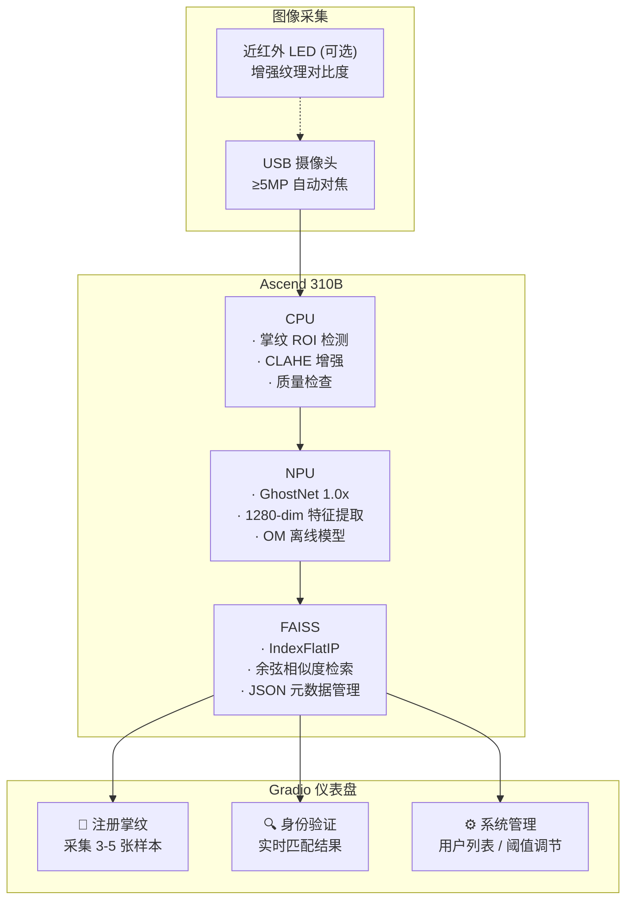
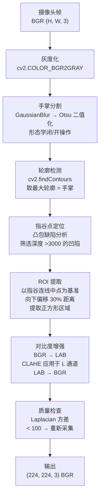
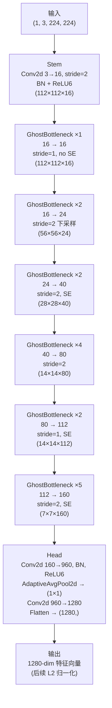
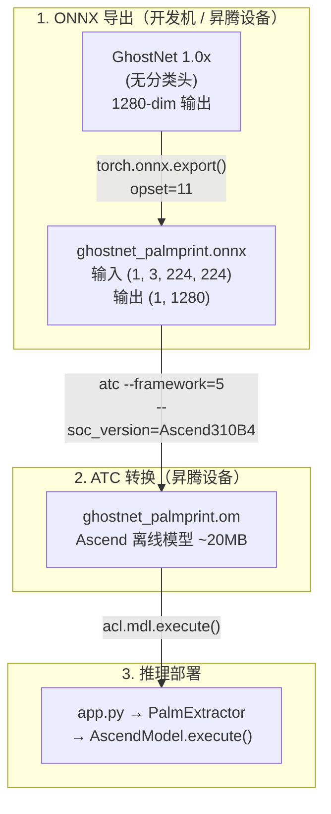
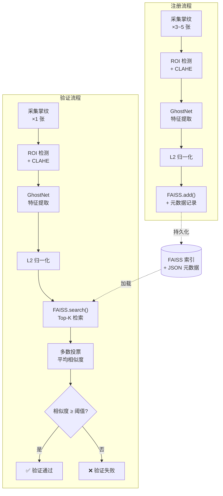
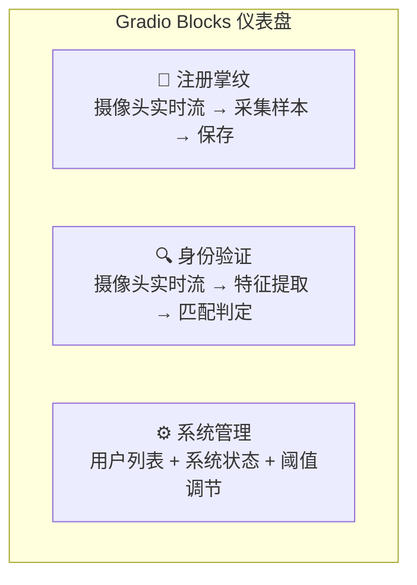
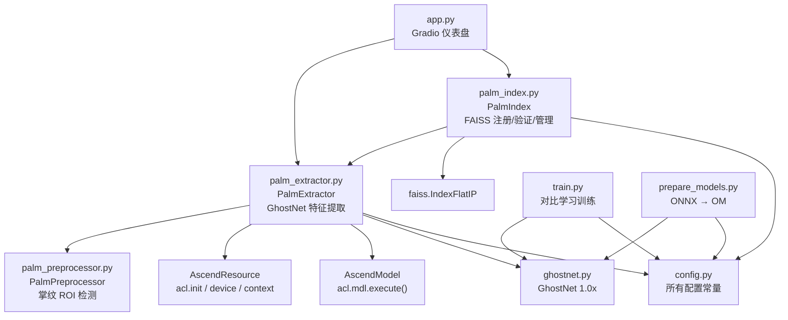

# 案例4：智能掌纹识别机

## 1. 项目简介

本项目基于昇腾 310B 平台，构建一个高精度的掌纹识别系统。掌纹识别作为一种
生物识别技术，具有纹理丰富、难以伪造、非接触式采集等优势，在门禁控制、
考勤管理、身份验证等领域有着广阔的应用前景。

相比传统的指纹识别，掌纹包含更多的特征信息——主线、皱纹、脊线纹理等，能够
提供更高的识别精度和更强的防伪能力。

本案例的**核心创新**在于将掌纹识别建模为**开集验证 (open-set verification)**
问题而非闭集分类问题：系统通过 GhostNet 提取掌纹的深度特征向量，使用 FAISS
进行高效的余弦相似度检索，新用户注册时无需重新训练模型，只需将其特征向量
加入索引即可。

### 与已有案例的关系

| 案例 | 领域 | 模型 | 任务范式 |
|------|------|------|----------|
| 案例1 | 人脸打卡 | ArcFace + SCRFD | 人脸检测 + 识别 |
| 案例5 | 电机监测 | EfficientNet-B0 | 闭集故障分类 |
| 案例6 | 小车感知 | ResNet18 | 闭集场景分类 |
| 案例7 | 智能相册 | ResNet50 + FAISS | 开集图像检索 |
| **案例4** | **掌纹识别** | **GhostNet + FAISS** | **开集身份验证** |
| 案例8 | 手势识别 | MobileNetV3-Small | 闭集手势分类 |

案例4 与案例7 都使用了 FAISS 进行向量检索，但有关键区别：
- **案例7** 使用 ResNet50 的通用 ImageNet 预训练特征，无需额外训练
- **案例4** 使用 GhostNet + 对比学习在掌纹数据上专门训练，学习掌纹特有的
  判别特征空间
- **案例7** 做的是 1:N 相似照片检索，**案例4** 做的是 1:1 身份验证（含阈值判定）

## 2. 内容大纲

### 2.1. 硬件准备

本项目需要的硬件分为三个层级：

| 层级 | 硬件 | 职责 | 要求 |
|------|------|------|------|
| 图像采集 | USB 摄像头 | 掌纹图像采集 | ≥5MP 分辨率，支持自动对焦 |
| 照明增强 | 近红外 LED 阵列 (可选) | 增强掌纹纹理对比度 | 850nm 波长，均匀分布 |
| AI 计算 | 昇腾 310B 开发者套件 | 掌纹特征提取 + 向量检索 | — |
| 结构件 | 3D 打印外壳 (可选) | 手掌定位 + 环境光隔离 | PETG 材料 |

系统架构如图所示：



### 2.2. 软件环境

#### 操作系统与框架

| 层级 | 软件 | 版本 | 用途 |
|------|------|------|------|
| 操作系统 | Ubuntu | 20.04 / 22.04 LTS | 运行环境 |
| CANN | Ascend Toolkit | 7.0+ | NPU 驱动与 ATC 转换工具 |
| Python | CPython | 3.8 ~ 3.10 | 应用开发语言 |
| 深度学习 | PyTorch + torchvision | 2.0+ | GhostNet 模型 / CPU 推理回退 |
| 图像处理 | OpenCV | 4.8+ | 掌纹预处理、ROI 检测、摄像头 |
| 向量检索 | faiss-cpu | 1.7+ | FAISS 索引与相似度搜索 |
| Web | Gradio | 4.0+ | 仪表盘界面 |

#### 环境准备

```bash
# 一键安装依赖并导出模型
bash setup.sh
```

`setup.sh` 依次完成：系统包安装 → Python 依赖安装 → 模型导出（如有训练好的
`.pth` 则导出 ONNX，如有 CANN 则继续转换为 OM）。

如果只想在开发机上导出 ONNX：

```bash
python3 prepare_models.py --onnx-only
```

#### Python 依赖说明

| 包 | 用途 | 必需？ |
|:---|:---|:---|
| `gradio` | Web 仪表盘框架 | ✓ |
| `torch` + `torchvision` | GhostNet 模型定义、CPU 推理回退 | ✓ |
| `opencv-python` | 掌纹预处理、ROI 检测、摄像头采集 | ✓ |
| `numpy` | 数值计算、特征向量处理 | ✓ |
| `faiss-cpu` | FAISS 向量索引与检索 | ✓ |
| `Pillow` | Gradio 图像格式转换 | ✓ |
| `onnx` | ONNX 模型校验（仅 prepare_models.py） | 仅转换 |
| `acl` (CANN 自带) | NPU 推理，随 CANN 安装 | 仅推理 |

### 2.3. 掌纹图像预处理

掌纹 ROI（感兴趣区域）检测是整个系统的第一道关口。高质量的 ROI 提取直接影响
后续特征提取的准确性。

#### 预处理流水线



#### 关键技术细节

**手掌分割**：使用 Otsu 自适应阈值将手掌与背景分离。系统假设手掌比背景亮
（配合深色背景和 LED 照明）。如果二值化后白色像素超过 50%，则自动反转
（适应浅色背景场景）。随后通过形态学闭操作填充手掌内部孔洞，开操作去除
孤立噪点。

**指谷点定位**：计算手掌轮廓的凸包，通过凸性缺陷 (convexity defects) 定位
手指之间的凹陷点（指谷）。只保留深度超过 3000 像素单位的缺陷点——这有效过滤
掉手腕处的微小凹陷。缺陷点按 x 坐标从左到右排序，取最左和最右两个作为
ROI 坐标系基准。

**ROI 提取**：以左右两个指谷点的连线中点为参考点，向下偏移连线距离的 30%
作为 ROI 中心（从指谷移动到掌纹中心区域），ROI 边长为指谷距离的 1.2 倍。
这种几何方法在受控环境下稳定且高效，避免了复杂的机器学习定位。

**CLAHE 增强**：将 ROI 图像从 BGR 转换到 LAB 色彩空间，仅在亮度 L 通道上应用
CLAHE（对比度受限的自适应直方图均衡化），然后转换回 BGR。这样做在不引入
色彩伪影的前提下显著增强了掌纹纹理的对比度。

全部代码实现在 [palm_preprocessor.py](samples/case4/palm_preprocessor.py) 的
`PalmPreprocessor` 类中，纯 OpenCV 实现，无需任何模型文件。

#### 预处理失败的处理

预处理可能因以下原因失败：手掌未在画面中、光照过暗/过亮、手指未张开无法
定位指谷点、图像模糊等。`PalmPreprocessor.preprocess()` 在失败时返回 `None`
而非抛出异常，调用方可以优雅地提示用户重新采集。

### 2.4. GhostNet 特征提取

掌纹识别需要一个能将掌纹图像映射到判别性特征空间的模型。本案例选择
**GhostNet 1.0x** 作为特征提取骨干网络。

#### 为什么选 GhostNet

| 对比维度 | GhostNet 1.0x | 其他候选 |
|----------|---------------|----------|
| 参数量 | 5.2M | ResNet50: 25.6M, MobileNetV3-Small: 2.5M |
| 核心创新 | Ghost 模块：廉价线性变换生成幻影特征图 | — |
| 纹理特征提取 | Ghost 模块在有限计算预算下产生更丰富的特征图，适合掌纹主线/皱纹/脊线纹理 | ShuffleNet 通道混洗偏通用 |
| 是否已被本书使用 | **否** — 为本书增加模型多样性 | MobileNetV3-Small 已被案例8 使用 |
| torchvision 内置 | 否 — 独立实现 (~220 行) | ResNet / MobileNet 内置 |

#### GhostNet 架构



#### Ghost 模块原理

标准卷积同时生成所有输出通道，存在大量冗余。Ghost 模块将卷积拆分为两步：

1. **主卷积 (Primary)**：生成少量"内在"特征图 (输出通道的 1/ratio，ratio=2)
2. **廉价卷积 (Cheap)**：对每个内在特征图应用深度可分离卷积，生成"幻影"
   特征图，填充剩余通道
3. 将两部分拼接，得到完整输出

```python
# GhostModule 核心实现 (ghostnet.py)
class GhostModule(nn.Module):
    def __init__(self, in_ch, out_ch, kernel_size=3, stride=1, ratio=2):
        primary_out = out_ch // ratio       # 一半通道
        cheap_out = out_ch - primary_out    # 另一半

        self.primary = nn.Sequential(
            nn.Conv2d(in_ch, primary_out, kernel_size, stride, ...),
            nn.BatchNorm2d(primary_out),
            nn.ReLU6(True),
        )
        self.cheap = nn.Sequential(
            nn.Conv2d(primary_out, cheap_out, kernel_size, 1,
                      groups=primary_out, ...),  # 深度可分离
            nn.BatchNorm2d(cheap_out),
        )

    def forward(self, x):
        p = self.primary(x)
        c = self.cheap(p)
        return torch.cat([p, c], dim=1)
```

注意廉价卷积后**不加 ReLU**——这是 GhostNet 论文的设计选择，保留幻影特征图
的线性特性以保持信息多样性。

#### SE 注意力模块

GhostNet 在部分 Bottleneck 中嵌入 SE (Squeeze-and-Excitation) 注意力模块。
SE 模块通过全局平均池化 → 压缩 → 扩展 → hard-sigmoid 门控，自适应地调整
各通道的重要性权重。

为保证 ONNX opset 11 兼容性，本实现使用手动 hard-sigmoid (`relu6 / 6`)
而非 `torch.nn.Hardsigmoid()`：

```python
def forward(self, x):
    s = F.adaptive_avg_pool2d(x, 1)
    s = F.relu6(self.conv1(s)) / 6.0  # hard-sigmoid
    s = self.conv2(s)
    return x * s
```

#### 特征提取模式

GhostNet 在特征提取模式下（`num_classes=None`）不包含分类头，直接输出
1280 维特征向量。`PalmExtractor.extract()` 在得到特征向量后执行 L2 归一化：

```python
vec = output.squeeze(0).numpy()
norm = np.linalg.norm(vec)
if norm > 0:
    vec = vec / norm
```

L2 归一化确保了 FAISS `IndexFlatIP` 的内积等价于余弦相似度，这是案例7
已验证的模式。

完整 GhostNet 实现在 [ghostnet.py](samples/case4/ghostnet.py)，包含
`GhostModule`、`SELayer`、`GhostBottleneck`、`GhostNet` 四个类以及工厂函数
`ghostnet_1x()`。

### 2.5. 对比学习训练

掌纹识别是开集验证问题——系统需要判断两张掌纹是否来自同一个人，而非将掌纹
分到某个预定义的类别。因此，本案例使用**对比学习 (contrastive learning)**
而非分类交叉熵来训练模型。

#### 为什么用对比学习

| 方法 | 适用场景 | 优缺点 |
|------|----------|--------|
| 分类 CrossEntropy | 闭集——用户固定，新用户需重新训练 | 简单，但不可扩展 |
| **对比学习 Contrastive** | **开集——新用户无需重新训练** | **直接学习特征空间的相似度结构** |
| 三元组 Triplet | 开集 | 三元组挖掘复杂，收敛不稳定 |
| ArcFace | 开集 | 需要大规模身份标签，实现复杂 |

对比学习直接优化特征空间中的距离关系：**同一人的掌纹特征距离近，不同人的
掌纹特征距离远**。训练完成后，新用户注册时只需将其掌纹的特征向量加入 FAISS
索引，无需任何模型更新。

#### 对比损失函数

```python
class ContrastiveLoss(nn.Module):
    """L = y * d² + (1-y) * max(0, margin - d)²"""
    def forward(self, emb1, emb2, label):
        dist = F.pairwise_distance(emb1, emb2)
        loss_pos = label * dist.pow(2)           # 正样本：最小化距离
        loss_neg = (1 - label) * \
                   F.relu(self.margin - dist).pow(2)  # 负样本：距离至少 margin
        return (loss_pos + loss_neg).mean()
```

- **正样本对**（同一人）：损失为欧氏距离的平方，驱动特征向量靠近
- **负样本对**（不同人）：当距离小于 margin 时产生损失，驱动特征向量远离
- margin 默认为 1.0：意味着负样本对的距离应至少为 1.0

#### 数据集组织

训练数据按用户分文件夹存放：

```
PolyU_Palmprint/
├── 001/
│   ├── 001_1.bmp
│   ├── 001_2.bmp
│   └── ...
├── 002/
│   ├── 002_1.bmp
│   └── ...
└── ...
```

`PalmprintPairDataset` 在每次 `__getitem__` 时动态生成样本对：
- 50% 概率生成正样本对（同一用户的两张不同图像）
- 50% 概率生成负样本对（两个不同用户的图像）

这种方式使得有效训练样本数远超原始图像数——即使只有 100 个用户、每个用户
10 张图像 (共 1000 张)，也能生成数万个训练对。

#### 训练命令与超参数

```bash
python3 train.py --data-dir /path/to/PolyU_Palmprint
```

| 超参数 | 默认值 | 说明 |
|--------|--------|------|
| `--epochs` | 60 | 训练轮数 |
| `--batch-size` | 64 | 批次大小 |
| `--lr` | 1e-3 | 初始学习率 |
| `margin` | 1.0 | 对比损失 margin |

训练使用 AdamW 优化器 + CosineAnnealingLR 学习率调度，训练/验证集按用户
（而非图像）85/15 分割以确保无数据泄漏。完整训练脚本在
[train.py](samples/case4/train.py)。

#### 评估指标

训练过程中计算验证集上的**成对准确率**：对每对掌纹，若其特征向量的欧氏距离
小于 margin/2 (0.5)，则预测为同一人，与标签比较得出准确率。

训练完成后，最佳模型保存到 `models/ghostnet_palmprint.pth`。

#### 推荐数据集

- [PolyU Palmprint Database](https://www4.comp.polyu.edu.hk/~biometrics/) —
  约 600 个手掌，每个 20 张图像（两阶段各 10 张），最经典的掌纹数据集
- [IITD Palmprint Database](https://www4.comp.polyu.edu.hk/~csajaykr/IITD/Database_Palm.htm) —
  约 460 个手掌，每个 5-6 张图像，包含左右手

> ⚠️ **关于预训练权重**：GhostNet 不在 torchvision 中，无法使用 ImageNet
> 预训练权重。模型需要从头开始在掌纹数据集上训练。如果跳过了训练步骤，
> 模型将使用随机权重，特征提取质量会很差——请务必先训练再使用。

### 2.6. 模型转换与昇腾部署



#### 步骤 1：导出 ONNX

```bash
python3 prepare_models.py --onnx-only
```

从 `models/ghostnet_palmprint.pth` 加载训练好的权重，构建 GhostNet 特征提取
模型（无分类头），固定输入形状 `(1, 3, 224, 224)` 导出 ONNX (opset=11)。
导出后自动进行三项验证：ONNX 模型结构校验、PyTorch vs ONNX Runtime 输出对比
（确保数值一致性）。

#### 步骤 2：ATC 转换

```bash
# 在昇腾设备上运行
python3 prepare_models.py
```

等效的 atc 命令：

```bash
atc --model=models/ghostnet_palmprint.onnx \
    --framework=5 \
    --output=models/ghostnet_palmprint \
    --soc_version=Ascend310B4 \
    --input_format=NCHW \
    --input_shape=input:1,3,224,224
```

转换完成后得到约 20MB 的 OM 离线模型文件。

#### ONNX 兼容性注意事项

GhostNet 的 ONNX 导出已针对 ATC 兼容性做了两项适配：
1. **手动 hard-sigmoid**：SELayer 中使用 `F.relu6(x) / 6.0` 替代
   `nn.Hardsigmoid()`，确保在 opset=11 下正确导出
2. **固定输入形状**：不使用动态轴 (`dynamic_axes={}`)，因为 OM 模型要求
   固定的输入输出尺寸

### 2.7. 开集验证系统

#### 系统架构

开集验证的核心流程：

```
注册阶段:  掌纹图像 → 预处理 → GhostNet(NPU) → 1280维向量 → FAISS 存储
验证阶段:  掌纹图像 → 预处理 → GhostNet(NPU) → FAISS 搜索 → 阈值判定
```



#### FAISS 索引设计

使用 `faiss.IndexFlatIP`（内积索引）存储 L2 归一化后的 1280 维特征向量。
由于向量已归一化，内积等价于余弦相似度：

```
cosine_similarity(a, b) = a · b  (= faiss inner product when ||a||=||b||=1)
```

每个注册用户存储 3-5 个样本的特征向量（对应不同角度/位置的掌纹），验证时
检索 Top-K 个最相似向量，对用户 ID 进行多数投票，取该用户的平均相似度作为
匹配分数。

#### 多样本注册策略

为什么每个用户需要 3-5 个样本？

| 样本数 | 优点 | 缺点 |
|--------|------|------|
| 1 | 简单快速 | 对姿态/光照敏感，易拒真 |
| **3-5** | **覆盖不同姿态，提高鲁棒性** | 注册稍慢 |
| >10 | 极高鲁棒性 | 注册耗时长，存储开销大 |

验证时，Top-5 个最相似向量中出现最多的用户 ID 即为最佳匹配。例如，若 Top-5
中有 4 个属于用户 A、1 个属于用户 B，则认定匹配用户 A，取这 4 个向量的
平均相似度作为最终分数。

#### 用户删除

FAISS `IndexFlatIP` 不支持直接删除单条记录。删除用户时，系统通过
`reconstruct()` 方法从索引中取出保留的向量，重建一个新的 FAISS 索引。
对于边缘场景（<1000 个用户），这一 O(N) 操作耗时 <100ms，完全可以接受。

完整索引管理实现在 [palm_index.py](samples/case4/palm_index.py) 的
`PalmIndex` 类中。

### 2.8. Web 仪表盘



三个页签：

1. **注册掌纹**：用户在摄像头前放置手掌，点击「采集掌纹」按钮
   采集当前帧。采集 3 张以上样本后，点击「完成注册」将特征向量存入
   FAISS 索引。界面实时显示已采集样本的缩略图和数量。

2. **身份验证**：用户将手掌放在摄像头前，点击「开始验证」。系统提取
   掌纹特征后在 FAISS 索引中搜索，返回匹配结果——验证通过/失败、
   最佳匹配用户、相似度分数和置信度条形图、Top-5 匹配列表、
   推理耗时和后端信息。

3. **系统管理**：显示已注册用户列表（ID、姓名、样本数），支持按
   用户 ID 删除。显示系统信息（后端类型、模型信息、索引状态、
   特征维度）。验证阈值可通过滑块实时调节。

#### 事件处理

注册页签的关键事件流：

```
[📷 采集掌纹] → capture_enroll_sample()
  ├── PalmExtractor.extract() → 若失败显示"未检测到有效掌纹"
  ├── 将 (BGR原图, RGB缩略图) 存入 _enroll_buffer
  └── 更新状态 (已采集数 / 3)
[✅ 完成注册] → confirm_enrollment()
  ├── PalmIndex.enroll_multiple() → FAISS 添加
  ├── PalmIndex.save() → 持久化
  └── 显示注册成功信息
[🔄 重新采集] → 清空缓冲区，重新开始
```

### 2.9. 用户手册

#### 2.9.1 部署

1. 将项目代码拷贝到昇腾 310B 设备
2. 运行 `bash setup.sh` 安装 Python 依赖
3. 训练模型：`python3 train.py --data-dir /path/to/palmprint/dataset`
4. 导出模型：`python3 prepare_models.py`（需 CANN 环境）
5. 连接 USB 摄像头
6. 启动服务：`python3 app.py`
7. 浏览器打开 `http://<设备IP>:7860`

#### 2.9.2 使用流程

1. 打开「注册掌纹」页签，输入用户姓名
2. 将手掌自然张开放在摄像头前 15-20 cm 处
3. 点击「采集掌纹」3-5 次，每次略微调整手掌角度
4. 确认样本预览无误后，点击「完成注册」
5. 切换到「身份验证」页签，放置手掌并点击「开始验证」
6. 观察验证结果——通过/失败、相似度分数、Top-5 匹配
7. 如需调整判定严格程度，在「系统管理」页签调节阈值

#### 2.9.3 采集技巧

- **光线**：确保手掌光照均匀，避免强烈阴影。推荐使用近红外 LED 补光
- **背景**：深色、简洁的背景有助于手掌分割。避免背景中有肤色相近的物体
- **姿态**：手指自然分开（不要并拢也不要张得太开），手掌平面与摄像头平行
- **距离**：手掌距摄像头 15-20 cm，确保掌纹纹理清晰可见
- **清洁**：手掌干燥清洁，避免汗渍或污渍影响纹理质量

#### 2.9.4 调整参数

| 参数 | 默认值 | 位置 | 说明 |
|------|--------|------|------|
| `VERIFICATION_THRESHOLD` | 0.75 | config.py / UI 滑块 | 验证阈值，越高越严格 |
| `TOP_K_RESULTS` | 5 | config.py | FAISS 检索返回数 |
| `CONTRASTIVE_MARGIN` | 1.0 | config.py / train.py | 对比损失 margin |
| `CLAHE_CLIP_LIMIT` | 2.0 | config.py | CLAHE 对比度限制 |
| `LAPLACIAN_BLUR_THRESHOLD` | 100.0 | config.py | 图像锐度最低要求 |

#### 2.9.5 故障排除

| 问题 | 可能原因 | 解决方法 |
|------|---------|---------|
| "未检测到有效掌纹" | 手掌不在画面中或光照不佳 | 调整手掌位置，确保光照均匀 |
| 验证总是失败 | 阈值过高或注册样本质量差 | 降低阈值，重新注册更多样本 |
| NPU 初始化失败 | CANN 环境未配置 | `source /usr/local/Ascend/ascend-toolkit/set_env.sh` |
| 特征提取结果随机 | 模型未训练 | 运行 `train.py` 训练模型 |
| ATC 转换失败 | soc_version 不匹配 | `npu-smi info` 查看版本 |
| "请重新放置手掌" | 预处理质量检查未通过 | 确保手掌清晰，避免运动模糊 |

## 3. 源代码结构

```text
case4/
├── app.py                 # Gradio 仪表盘入口
├── palm_preprocessor.py   # 掌纹 ROI 检测 + CLAHE 对比度增强
├── palm_extractor.py      # NPU/CPU 双后端 GhostNet 特征提取
├── palm_index.py          # FAISS 注册 / 验证 / 删除 / 持久化
├── ghostnet.py            # GhostNet 1.0x 独立实现
├── train.py               # 对比学习 Siamese 训练
├── prepare_models.py      # ONNX 导出 + ATC OM 转换
├── config.py              # 配置常量
├── setup.sh               # 一键环境安装
├── requirements.txt       # Python 依赖列表
├── data/
│   └── .gitkeep
├── models/                # 模型文件目录 (.pth / .onnx / .om)
└── README.md              # 快速开始指南
```

模块间的调用关系：



与已有案例的继承关系：

- `AscendResource` / `AscendModel` 沿用案例7/案例8 的同一套模式
- `PalmIndex` 的 FAISS `IndexFlatIP` + JSON 元数据模式与案例7 的
  `PhotoIndex` 一致
- `train.py` 的训练管道（AdamW + CosineAnnealing）与案例8 一致
- `prepare_models.py` 的 ONNX → ATC 流程与案例6/案例7/案例8 一致
- `config.py` 的 `BASE_DIR` + `os.path.join` 结构与所有案例一致
- `app.py` 的 Gradio 懒加载单例模式与所有案例一致
- `PalmPreprocessor` 是本案例独有的领域专用预处理模块
- `GhostNet` (ghostnet.py) 是本案例独有的模型实现（220 行独立代码）
- 对比学习训练范式（Siamese + ContrastiveLoss）是本案例独有的训练方法

## 4. 效果演示

### 预期效果

| 功能 | 预期表现 | 备注 |
|------|---------|------|
| 掌纹 ROI 检测 | 稳定提取正方形掌纹区域 | 受控光照 + 深色背景 |
| 特征提取 (NPU) | 约 8-10 ms / 张 | GhostNet 5.2M 参数 |
| 验证准确率 (已训练) | EER < 5%，AUC > 0.97 | 取决于训练数据量和质量 |
| FAISS 检索 (1000 向量) | < 1 ms | IndexFlatIP 精确搜索 |
| 端到端验证延迟 | 预处理 ~5ms + NPU ~10ms + 检索 <1ms ≈ 16ms | — |
| 新用户注册 | 3-5 次采集，无需重训模型 | 开集验证的核心优势 |

### 性能指标

| 指标 | NPU (Ascend 310B) | CPU (PyTorch) |
|------|-------------------|---------------|
| 掌纹 ROI 检测 | ~5 ms | ~5 ms |
| GhostNet 特征提取 | 8-10 ms | 18-25 ms |
| FAISS 检索 (1000 向量) | <1 ms | <1 ms |
| 模型大小 (.om) | ~20 MB | N/A |

### 浏览器中的效果

Gradio 仪表盘在浏览器中的预期布局：

**注册页签**：

```
┌──────────────────────────────────────────────────────────────────┐
│  🖐️ 智能掌纹识别机                                                │
│  GhostNet 1.0x 特征提取 + FAISS 向量检索                          │
├──────────────────────────────────────────────────────────────────┤
│  [📝 注册掌纹]  [🔍 身份验证]  [⚙️ 系统管理]                        │
│                                                                  │
│  ┌──────────────────────┐  ┌─────────────────────────────────┐  │
│  │                      │  │ 用户姓名: [张三            ]      │  │
│  │                      │  │                                 │  │
│  │   摄像头实时预览      │  │ [📷 采集掌纹]                    │  │
│  │                      │  │ [✅ 完成注册 (≥3 张)]            │  │
│  │                      │  │ [🔄 重新采集]                    │  │
│  │                      │  │                                 │  │
│  │                      │  │ ### 📝 注册中: 张三              │  │
│  │                      │  │ 已采集: 3 / 3 张                │  │
│  │                      │  │ ✅ 样本充足，点击完成注册         │  │
│  └──────────────────────┘  └─────────────────────────────────┘  │
│  [缩略图1] [缩略图2] [缩略图3]                                     │
└──────────────────────────────────────────────────────────────────┘
```

**验证页签**：

```
┌──────────────────────────────────────────────────────────────────┐
│  [📝 注册掌纹]  [🔍 身份验证]  [⚙️ 系统管理]                        │
│                                                                  │
│  ┌──────────────────────┐  ┌─────────────────────────────────┐  │
│  │                      │  │                                 │  │
│  │   摄像头实时预览      │  │  ## ✅ 验证通过                   │  │
│  │                      │  │  **用户**: 张三 (a3f4c8d2)       │  │
│  │                      │  │  **相似度**: 87.3%              │  │
│  │                      │  │  ██████████████░░░░              │  │
│  └──────────────────────┘  │                                 │  │
│                            │  ⏱ 耗时: 15.2 ms                 │  │
│  ┌──────────────────────┐  │                                 │  │
│  │   掌纹 ROI 预览       │  │  ### 📊 Top-5 匹配               │  │
│  │                      │  │  → 张三: 87.3% ██████████████░░  │  │
│  │                      │  │    李四: 42.1% ██████░░░░░░░░░░  │  │
│  │                      │  │    王五: 38.5% █████░░░░░░░░░░░  │  │
│  └──────────────────────┘  │                                 │  │
│                            │  🖥 后端: NPU | 特征维度: 1280     │  │
│  [🔍 开始验证]              │                                 │  │
│                            └─────────────────────────────────┘  │
└──────────────────────────────────────────────────────────────────┘
```

### 如何验证系统正常工作

1. 运行 `python3 app.py`，浏览器打开 `http://127.0.0.1:7860`
2. 在「注册掌纹」页签，输入姓名，放置手掌，采集 3-5 张样本
3. 点击「完成注册」，确认看到"注册成功"信息
4. 切换到「身份验证」页签，放置同一手掌，点击「开始验证」
5. 确认验证通过，相似度 > 80%，匹配用户正确
6. 用另一只手掌测试验证——应显示"验证失败"（低于阈值）
7. 在「系统管理」页签确认用户列表包含刚才注册的用户
8. 调节阈值滑块，验证高阈值下更容易拒真、低阈值下更容易认假
9. 在昇腾设备上，确认后端显示"NPU (Ascend 310B)"
10. 检查 `data/palm_index.faiss` 和 `data/palm_metadata.json` 是否存在
