# 案例5：基于昇腾 310B 的智能数据采集分析仪

示波器把连续电压画成波形，却没有回答“这一段信号在什么时间、什么频率出现了什么现象”。这个问题把一个看似简单的采集任务分成四层：可靠地取得样本，把样本组织成可解释的窗口，从窗口构造频域或时频表示，再把结果与原始证据和实际计算后端绑定起来。

本章围绕两种物理信号学习这一方法。Hantek 路线以 CH1 的 `CAL` 方波为已验证实例，用固定 Hann 窗 DFT 说明确定性信号处理如何部署到 NPU；Little Bee B1 的双通道电流测量属于尚待标定的扩展任务。RTL-SDR 路线把连续复数 IQ 变成时频图，再由 YOLO11s 检测网络形成候选区域。两条路线都运行在 Ascend 310B 上，但它们不是同一种“模型”：固定 DFT 是数值计算图，YOLO11s 才是经过训练的神经网络。

本章采用“核心实验加扩展实验”的组织方式，而不是要求读者一次完成全部硬件操作。Hantek 路线是核心实验，读者先学习第 3、4 节，再完成第 6 至 8 节；RTL-SDR 路线是扩展实验，在此前基础上学习第 5 节和第 9、10 节。涉及 CANN、ATC、ACL、OM、USB 和 RTL-SDR 的命令只能在真实 310B 开发板上验证，本地开发机只承担代码和数值参考检查。

| 路线 | 教学定位 | 可以确认的结论 |
| --- | --- | --- |
| Hantek 固定 DFT | 核心实验 | `CAL` 连通、两通道数据帧合同、固定窗口、真实 OM 频谱和会话追溯 |
| RTL-SDR 时频检测 | 扩展实验 | CU8 采集、时频预处理、OM 张量合同和主机流水线预算；不包括调制类别准确率 |

## 1. 从波形到可解释事件 {#src-experiment-case5-overview}

### 1.1 本章要回答的学习问题 {#src-experiment-case5-outcomes}

设采集系统在一段时间内获得样本 $x[n]$。仅显示 $x[n]$ 时，读者只能观察幅值随时间变化；若希望说明“何时出现了某一频率成分”或“哪一段频带包含一个候选信号”，还必须定义分析窗口、频率坐标、模型输入和结果回溯关系。本章用下列问题组织学习：

1. 采样率与窗口长度怎样同时限制时间尺度和频率分辨率？
2. 为什么实值波形适合单边频谱，而复数 IQ 必须保留正、负频移？
3. 固定 DFT 和训练得到的目标检测网络分别解决什么问题？
4. 一个时频检测框怎样还原成时间区间和名义频带？
5. 为什么“OM 可以运行”仍不能替代模型准确率、测量标定或连续实时性证据？

完成本章后，读者应能用自己的话说明输入窗口、CPU/NPU 分工、模型输出、实时预算和证据边界；能完成一条安全的 Hantek 固定 DFT 实验，并能在已有 `accepted` manifest 的开发板上开展 RTL-SDR 扩展实验。

### 1.2 证据等级与实验边界 {#src-experiment-case5-runtime-boundary}

教学实验中的结论必须与证据相称。当前 Hantek 记录证明了 CH1 的 `CAL` 方波连通与固定 DFT OM 界面；Little Bee 的真实 CH2 接入、幅相标定和双通道测量验收仍待完成。RTL-SDR 记录证明了接天线条件下的连续采集、时频预处理与 NPU 推理流水线；无标签真实 IQ 不能推出调制识别准确率。

| 结论类型 | 本章允许的证据 | 本章不能据此声称的结论 |
| --- | --- | --- |
| 采集连通 | `CAL` 波形、USB 诊断、原始帧或 CU8 归档 | 幅度、带宽、相位或频率校准 |
| NPU 执行 | `aclruntime` 实际加载 OM、后端状态和推理时延 | CPU 结果等价于 NPU 结果 |
| 流水线实时性 | 完整窗口、零丢批、逐阶段时延和连续运行记录 | 模型准确率或射频测量校准 |
| 检测性能 | 有来源的标签、独立验证集与指标 | 仅凭无标签检测框断言准确率 |

本地开发电脑用于 `pytest`、ONNX 图和 NumPy 参考；Ascend 310B 才用于 ATC、OM、真实采集和 NPU 延迟；Hantek/Little Bee 与 RTL-SDR 才提供真实模拟波形或 IQ。这个边界不是流程负担，而是防止把模拟测试写成硬件验收的前提。

## 2. 实验器材、接线与安全 {#src-experiment-case5-hardware}

### 2.1 Hantek 采集与扩展测量 {#src-experiment-case5-hantek-bom}

| 器材 | 本案例中的用途 |
| --- | --- |
| 昇腾 310B 开发板 | 采集控制、CPU 预处理、OM 推理和触摸显示 |
| Hantek 6022BE | 提供两个物理采集通道；本章已验证 CH1 的 `CAL` 连通 |
| Hantek 电压探头 | 连接 CH1，首轮实验接 6022BE 的 `CAL` 输出 |
| Little Bee B1 | 后续双通道扩展所用电流探头；不纳入本章当前验收 |
| SMA-BNC 连接线 | 把 Little Bee 输出连接到 CH2 |
| 经确认隔离的教学回路 | 后续双通道扩展实验的被测对象 |

[Hantek 硬件与接线说明](https://github.com/zhouxzh/Ascend310/blob/main/samples/case5/docs/01_hantek6022be.md)记录了 6022BE 两个通道共地的边界，不应把它当成隔离示波器。Little Bee 的操作说明也明确限定其为实验室探头，不具备 CAT 测量等级，不得夹持未绝缘导线。[^1] 因此，本章的第一次真实采集只使用 6022BE 自带的 `CAL` 输出；接入 Little Bee 前，必须由设备手册、课程实验规范或负责教师确认被测回路的隔离和允许测量范围。本章不以“低压”一词替代这一确认，也不把磁耦合或电池供电误解为任意共模电压下的隔离保证。

> **安全边界：** 未确认探头量程、接地、隔离、带宽和校准参数之前，禁止接入市电、裸露导体或打开后的市电设备。软件中的量程选择不能弥补错误接线带来的电气风险。

这张图把两条硬件路线放在同一页中，目的是先把接线关系和证据边界分开：左侧的 `CAL -> CH1` 是最小连通检查；Little Bee 只允许接入已确认隔离且适合该探头的单根绝缘导线，并由 CH2 接收；右侧的中心频率、增益和 PPM 只是 RTL-SDR 的运行配置。

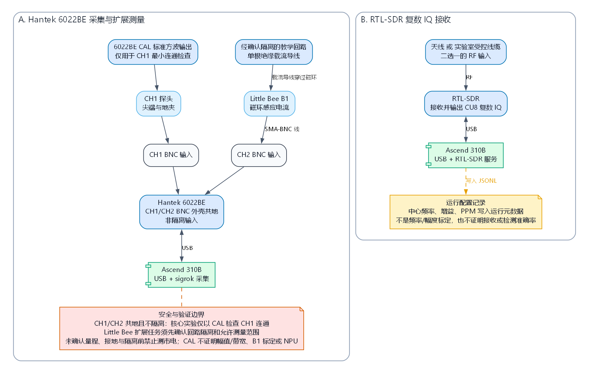

*图 5-1 两条实验路线的硬件连接与安全边界。这是教学结构图，不是实机验收照片；它特别标出 6022BE 的共地、非隔离输入，以及 `CAL`、接收配置分别能够和不能够证明什么。图源见 `img5/case5-hardware-connections.dot`。*

下图来自探头接触 6022BE `CAL` 标准测试输出。它证明 PulseView、sigrok 驱动、USB 和 CH1 探头能够获得真实方波，但不能证明幅值准确、带宽达标、CH1/CH2 同步或 NPU 已经通过验收。

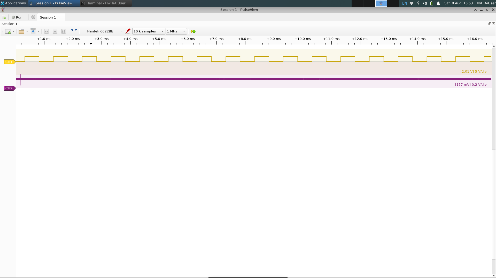

*图 5-2 `CAL` 连通时的 PulseView 界面示例；CH2 当时没有作为已标定电流通道使用。该图只说明最小采集基线，不能替代会话记录或计量标定。*

### 2.2 RTL-SDR 实验 {#src-experiment-case5-rtl-bom}

RTL-SDR 主线至少需要一只受 `rtl_sdr` 工具支持的接收机，以及与实验频段匹配的天线或受控线缆。当前板端记录使用 RTL-SDR Blog V4，但程序的核心合同是 CU8 复数 IQ，并不把部署包绑定到某一接收机销售型号。

真实运行必须如实记录射频输入状态：

- `antenna_connected` 表示已连接天线；
- `lab_cabled` 表示连接到受控实验线缆；
- `disconnected` 表示没有接入射频输入；
- `unknown` 只能表示状态未确认，不能作为硬件验收声明。

中心频率、增益和 PPM 都是接收配置，不是校准结论。某个地点在 100 MHz 使用 40.2 dB 增益没有明显字节级削顶，并不意味着其他天线、频率和环境也应采用相同增益。

## 3. 读懂时域、频域和复数 IQ {#src-experiment-case5-signal-theory}

### 3.1 从一段波形得到什么 {#src-experiment-case5-time-domain}

设一个窗口包含 $N$ 个样本 $x[n]$。均值描述波形的直流偏置：

$$
\bar{x}=\frac{1}{N}\sum_{n=0}^{N-1}x[n]
$$

原始均方根值描述包含直流分量的窗口有效幅值：

$$
x_{\mathrm{RMS}}=\sqrt{\frac{1}{N}\sum_{n=0}^{N-1}x^2[n]}
$$

峰峰值是最大值与最小值之差：

$$
x_{\mathrm{pp}}=\max(x)-\min(x)
$$

若关心去直流后的交流幅值，应使用

$$
x_{\mathrm{AC,RMS}}=\sqrt{\frac{1}{N}\sum_{n=0}^{N-1}\left(x[n]-\bar{x}\right)^2}.
$$

均值可用于观察偏置，原始 RMS 适合比较窗口整体幅值，AC RMS 则对应去直流后的交流成分，峰峰值对脉冲和削顶更敏感。当前 `CaptureProcessor` 已经对最新采集块计算每路的原始 `mean`、`rms` 和 `peak_to_peak`，而送入 OM 的完整分析窗口会另行去直流。Hantek 工作区和 `analysis.jsonl` 尚未持久化这些统计量，因此本章不把它们列为已经完成的端到端功能。

### 3.2 窗口长度决定观察尺度 {#src-experiment-case5-window-resolution}

采样率为 $f_s$、窗口包含 $N$ 点时，窗口时间跨度和 DFT 频率间隔分别为：

$$
T=\frac{N}{f_s},\qquad \Delta f=\frac{f_s}{N}
$$

Hantek 主线固定为由驱动读回并与 OM 合同一致的 $f_s=1\,000\,000\ \mathrm{S/s}$、$N=10\,000$，因此每个窗口覆盖 10 ms，频率间隔为 100 Hz。模型只保留 0 到 20 kHz，共 201 个频点。第 11 节的“有效速率”是主机收到回调的吞吐量，不是频率轴所用的采样率，不能用它替换 $f_s$。

这个例子揭示了一个常见取舍：扩大窗口可以减小 $\Delta f$，让相邻频率更容易分开，但也会增加单次分析等待时间和固定模型输入规模。缩短窗口可以更快更新界面，却会降低频率分辨率。窗口参数不能只由界面刷新速度决定，还必须与模型形状和实时预算一致。

这张图把公式变成一个可操作的设计关系：在采样率固定时，窗口点数同时决定等待时间和频率 bin 的间隔；把点数翻倍不会免费增加信息，而是把每次分析所需的样本和时间一并翻倍。

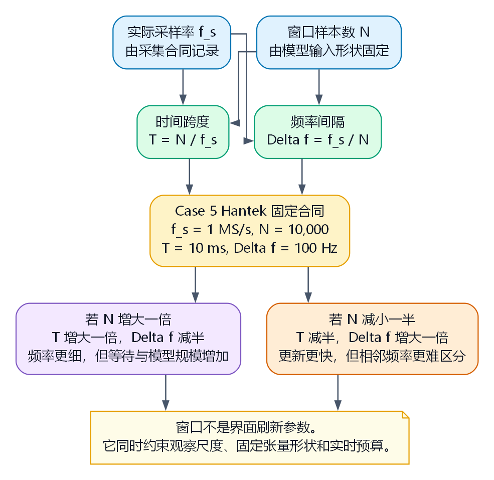

*图 5-3 采样窗口的尺度取舍。Hantek 当前合同把 $f_s=1$ MS/s 和 $N=10\,000$ 固定为 10 ms 与 100 Hz；改变任一量都要求重新审查窗口预算和模型合同。图源见 `img5/case5-sampling-window-resolution.dot`。*

### 3.3 为什么要去直流和加窗 {#src-experiment-case5-window-function}

Hantek 数据在进入 OM 前先执行逐通道去直流：

$$
x'[n]=x[n]-\bar{x}
$$

OM 内部再把 $x'[n]$ 与固定 Hann 窗相乘，并投影到正弦、余弦基函数。对第 $k$ 个频点，可以把计算理解为：

$$
X[k]=\sum_{n=0}^{N-1}x'[n]w[n]e^{-j2\pi kn/N},\qquad P[k]=|X[k]|^2
$$

加窗不是为了“让频谱更漂亮”，而是为了减小有限窗口边界不连续造成的频谱泄漏。Hantek 固定 DFT 使用 Hann 窗；正式 RTL-SDR 频谱检测模型则使用 manifest 锁定的 FFTW Blackman 时频预处理。二者服务于不同模型合同，不能随意互换。

Hantek OM 返回线性功率。显示层才进行如下转换：

$$
P_{\mathrm{dB}}=10\log_{10}\left(\frac{\max(P,10^{-12})}{1\ \mathrm{V}^2}\right)
$$

界面将它标注为“相对 $1\ \mathrm{V}^2$，未校准”。它不是 dBm、dBFS，也不应在未完成测量链标定时称为标准 dBV。

### 3.4 实值波形与复数 IQ {#src-experiment-case5-complex-iq}

Hantek 的每个通道都是实值时间序列。对实值信号，正频率和负频率互为共轭，因此仪表盘只显示单边频谱。

RTL-SDR 输出的是交错 CU8：一个字节表示 I，下一个字节表示 Q。程序按模型合同把它转换为近似位于 $[-1,1]$ 的复数样本：

$$
z[n]=\frac{I_{u8}[n]-127.5}{127.5}+j\frac{Q_{u8}[n]-127.5}{127.5}
$$

复数 IQ 保留了相对于中心频率的正、负频移。旧固定 DFT 教学模型因此输出从负频率到正频率的完整频谱；正式检测模型则把一段连续 IQ 构造成时频图，再交给 NPU 检测器。

这张对照图解决“为什么两类谱图的横轴范围不同”的问题。单边或双边显示首先由信号表示决定，不是 CPU 与 NPU 的性能选择；Hantek 与 RTL-SDR 的窗函数也分别由各自的模型合同锁定。

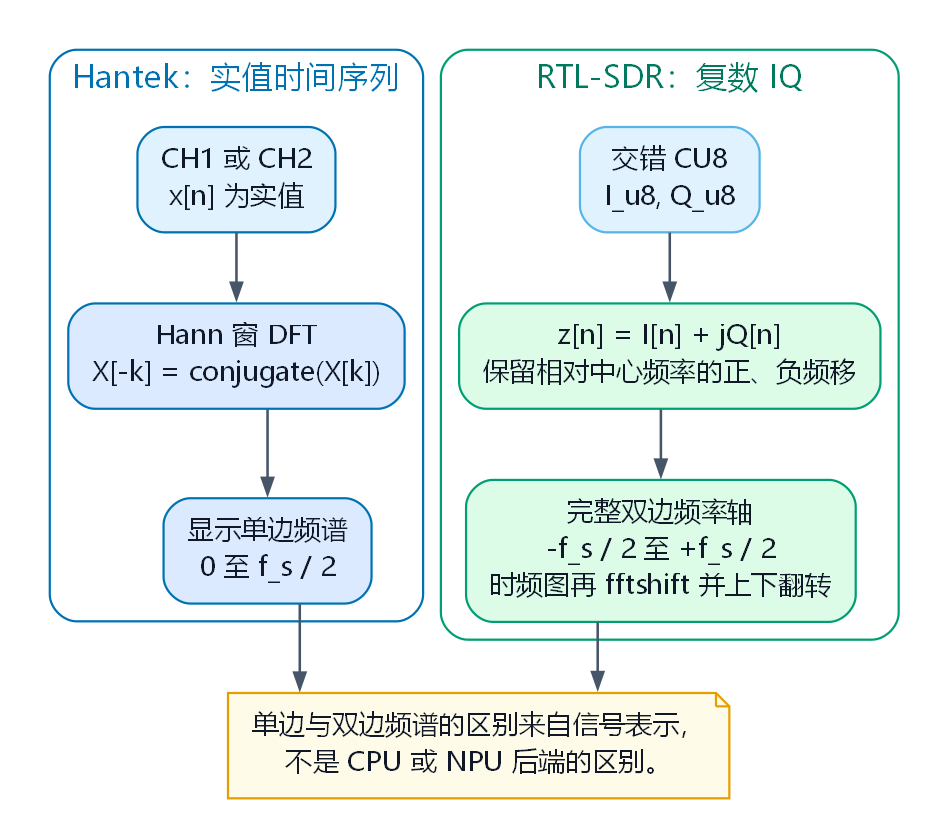

*图 5-4 实值与复数 IQ 的频谱表示。实值信号的负频率由共轭对称性决定；复数 IQ 保留中心频率两侧的独立频移。图源见 `img5/case5-real-vs-iq-spectrum.dot`。*

这张图解决“像素与物理量怎样对应”的问题。它把一个模型图像还原为连续 IQ、时间行和频率 bin；图中的箭头是数据变换，不是神经网络层。

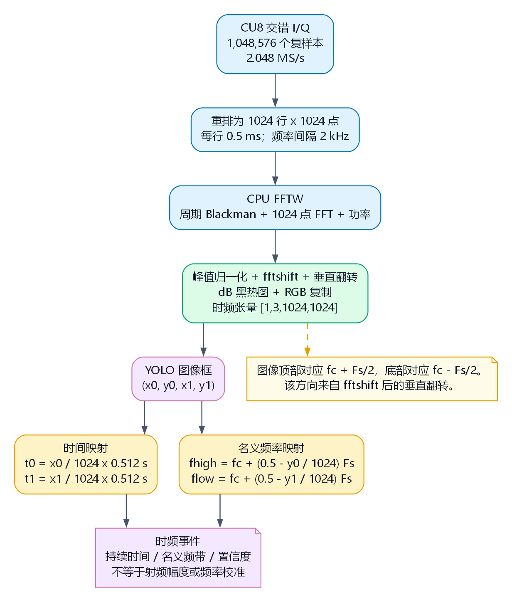{width=680px}

*图 5-5 IQ 到时频图的映射。2.048 MS/s 下，1024 点的一行覆盖 0.5 ms，频率 bin 间隔为 2 kHz；纵轴经过 `fftshift` 和上下翻转，图像顶端对应中心频率上方约 $f_s/2$。这是当前实现的名义频率坐标，尚不构成射频频率标定。图源见 `img5/case5-iq-to-spectrogram-mapping.dot`。*

## 4. 双主线系统架构 {#src-experiment-case5-architecture}

### 4.1 先划清两种 OM 的计算边界 {#src-experiment-case5-data-flow}

这张图解决“同样部署为 OM 是否就同样属于人工智能”的问题。两条主线都把固定形状张量交给 Ascend 310B，但 Hantek 的图只实现预先写死的 DFT 投影；RTL-SDR 的图才包含由训练确定的卷积、特征融合和检测参数。

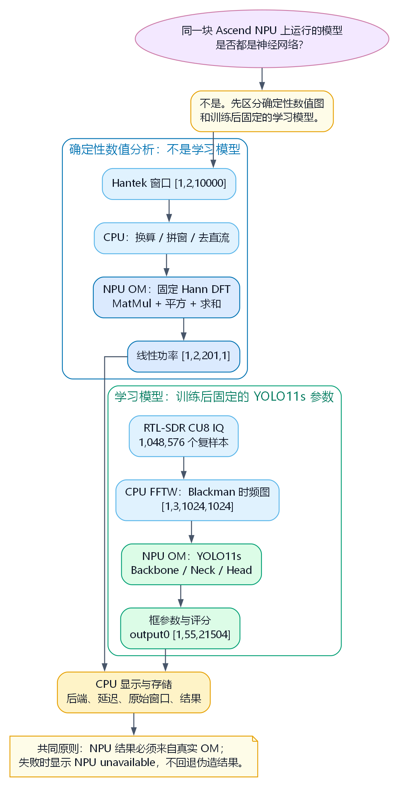{width=620px}

*图 5-6 两种 NPU 任务的计算边界。固定 DFT 是确定性数值分析，不含训练得到的可学习参数；YOLO11s 是学习模型。两条路径都要求 OM 真正运行：初始化不可用时显式报告 `NPU unavailable`，运行期错误显式失败且不以 CPU 结果替代。图源见 `img5/case5-computation-boundary.dot`。*

NPU 是执行位置，不是算法类别。把固定 DFT 编译为 ONNX/OM 的目的，是练习静态张量合同、数值校验和后端追溯；它并不使 DFT 变成神经网络。相反，YOLO11s 的卷积权重和检测头参数来自上游训练过程，即使在部署阶段它们同样固定，也必须单独评价其任务语义、数据分布和精度证据。

Hantek 路径首先把具体驱动返回值转换为公共 `BridgeFrameV1`。从这一边界开始，处理、NPU、存储和界面都不需要了解 `hantek-6xxx` 的私有结构。未来更换示波器时，只需要在 `time_frequency_dashboard/acquisition/` 中增加适配器，并继续输出相同帧合同。

RTL-SDR 路径不复用双通道电压帧，因为它面对的是复数 IQ 和第三方模型合同。它使用 `CapturedIqBatch` 保留批次序号、原始样本偏移、主机接收时间和分阶段耗时，再由 `RtlSdrService` 统一服务 CLI 和 Qt 工作区。

### 4.2 三种模型合同不能混用 {#src-experiment-case5-model-contracts}

| 路径 | 输入 | 核心 NPU 任务 | 输出与用途 |
| --- | --- | --- | --- |
| Hantek 主线 | `[1,2,10000]` float32 | Hann 窗固定实值 DFT | `[1,2,201,1]` 线性频谱功率 |
| RTL 固定 DFT 教学 | `[16,2,1024]` float32 I/Q | Hann 窗固定复数 DFT | `[16,1024]` 完整频谱功率 |
| RTL 正式检测 | `[1,3,1024,1024]` float32 图像 | TorchSig YOLO11 时频目标检测 | `output0 [1,55,21504]` 的框参数与评分 |

第一种合同驱动 Hantek 频谱与瀑布。第二种合同只用于理解复数 IQ、验证 NPU DFT 和比较 CPU/NPU 算法，不被正式 SDR 工作区调用。第三种合同才是当前 RTL-SDR 正式界面的检测路径，其中 CPU FFTW 生成模型规定的 Blackman 时频输入，NPU 执行神经网络检测。它的 51 个评分通道来自部署合同；该 checkpoint 的训练记录采用单类监督，因此这些通道不能被解释为 51 种调制类别，不能由张量维度或 UI 标签表自行推出。

### 4.3 实时系统为什么需要有界队列 {#src-experiment-case5-bounded-queues}

采集、NPU 和绘图不会永远保持相同速度。如果输入队列无限增长，短暂的推理或界面卡顿最终会耗尽内存，而且读者看到的仍是几秒前的旧结果。

Case 5 的分析输入队列默认容量为 2。队列满时，`LatestQueue` 丢弃最旧任务并保留最新窗口；结果队列和瀑布历史同样有固定上限。丢弃计数会进入状态和会话记录。这个策略适合实时观察，但不等于原始数据也可以无声丢失：原始帧由独立的有界会话写入器保存，并单独记录存储丢帧和写入错误。

`InstrumentCoordinator` 还保证 Hantek 与 RTL-SDR 不会同时占用 NPU 和设备控制路径。切换页面不会自动打开硬件；旧来源、队列和 NPU runner 完全停止后，另一条链才能启动。

## 5. 从时频图到神经网络检测 {#src-experiment-case5-neural-detection}

本节讨论的不是“怎样运行一个 OM 文件”，而是一个更基础的问题：模型看到的是什么、网络怎样把像素组织成候选事件、以及什么证据才足以支持模型结论。后面的板端命令只是在这条认识链完成后，把已经定义清楚的合同部署到 NPU。

### 5.1 模型看到的是标准化的时频形态 {#src-experiment-case5-spectrogram-representation}

正式 RTL-SDR 模型不直接读取原始 I/Q。设复数序列为 $z[n]$，Blackman 窗为 $w[n]$，每行长度为 $N=1024$，当前实现不重叠地构造时频图：

$$
X[m,k]=\sum_{n=0}^{N-1}z[n+mN]w[n]\exp\left(-j\frac{2\pi kn}{N}\right),
\qquad P[m,k]=|X[m,k]|^2.
$$

其中 $m$ 是图像的时间行，$k$ 是频率 bin。程序对功率执行 `fftshift`、上下翻转、dB 变换和**按单幅图自身最大值归一化**，再以黑热色标形成一个通道并复制为 RGB 三通道。因此，`[1,3,1024,1024]` 不是自然相机图像，而是一个具有固定轴向约定的张量合同。

在 $f_s=2.048$ MS/s 下，这个合同可以直接换算为观察尺度：

$$
T_{\mathrm{row}}=\frac{N}{f_s}=0.5\ \mathrm{ms},\qquad
\Delta f=\frac{f_s}{N}=2\ \mathrm{kHz},\qquad
T_{\mathrm{image}}=1024T_{\mathrm{row}}=0.512\ \mathrm{s}.
$$

图 5-5 中，检测框的横坐标是该 0.512 s 批次内的时间比例；纵坐标则因图像坐标向下增长而反向映射到频率。对于像素框 $(x_0,y_0,x_1,y_1)$，界面使用

$$
t_i=\frac{x_i}{1024}T_{\mathrm{image}},\qquad
f_i=f_c+\left(0.5-\frac{y_i}{1024}\right)f_s
$$

把它还原为名义时间和频率范围。这个映射使检测结果可以与 CU8 批次、中心频率和采样率关联；但由于每幅图独立归一化、接收链增益未校准，它不能给出绝对接收功率，也不自动消除本振偏差或天线误差。

### 5.2 先限定模型证据能够说明什么 {#src-experiment-case5-model-evidence}

本章选用经审查的 `gr-spectrumdetect` 候选作为部署对象。部署端不引入 PyTorch，只接收审查后的静态 ONNX、OM 和 manifest；来源版本、工件哈希、输入名和准入记录保存在本章的配套资料中。这里关注的是可复查的证据类型，而不是某一次构建的工件编号。

这里存在一项必须说明的训练语义限制：上游 README 与训练 YAML 将该权重描述为宽带射频能量区域检测，并采用 `single_cls=True`。Ultralytics 的这一路径会将训练数据的类别数收束为 1，验证时也按单一预测类别处理。虽然同一权重的网络合同仍保留 51 个评分通道，部署代码也为它们提供标签名称，但这些软件映射没有获得该 checkpoint 的 51 类监督语义。本章因此采用下表的证据表述。

| 论断 | 本章证据状态 | 可以得出的结论 |
| --- | --- | --- |
| 固定输入可形成 `[1,3,1024,1024]`，OM 输出可读取 | 已由 manifest、数值校验和板端运行记录支持 | 预处理与 NPU 部署边界连通 |
| 输出有 51 个评分通道 | 已由 ONNX 静态形状 `[1,55,21504]` 与部署代码支持 | 只能确认 4 个框参数加 51 个评分的张量布局，不能由此推出类别数 |
| 模型将时频区域作为检测目标 | 有上游单类训练说明支持 | 可以把框视为候选区域；现有兼容解码的框数和通道索引仍需与单类后处理分开解释 |
| 51 项软件标签是此权重的调制类别 | 不受当前 `single_cls=True` 训练语义支持 | 不能把任何标签当作该 checkpoint 的多类识别；需要另一个多类监督训练的模型 |

上游材料将该实验权重描述为从 YOLO11s 出发、使用 Wideband level-2 损伤数据的检测训练；记录中还包含冻结第一层、SGD 学习率 $10^{-4}$ 和单个 epoch 等运行参数。它们用于说明权重的来源和任务背景，不构成本项目对训练过程的独立复现。更重要的是，`single_cls=True` 改变了监督标签的语义，因此不能把 checkpoint 自报的检测指标改写为“51 类调制识别精度”。[^3]

若要研究 51 类调制识别，首先需要获得或重新训练一个具有多类监督语义的模型，而不是只为当前 checkpoint 追加一次本地评测。随后才应建立带控制发射源、注入路径或可靠标注的训练/验证/测试集，并按独立采集会话划分数据，报告召回率、精确率、IoU 阈值下的 mAP 以及混淆矩阵。本文记录的无标签真实 IQ 只用于评估采集、预处理、NPU 推理和实时预算，不能替代多类模型的任务精度实验。[^2] [^3]

### 5.3 YOLO11s 如何从图像形成候选框 {#src-experiment-case5-yolo-architecture}

这张图解决“`[1,55,21504]` 从哪里来”的问题。它是按输入输出合同和上游 YOLO11s 架构整理的教学拓扑，而不是由图像生成模型猜测的网络示意。候选模型的可执行合同见 [`candidate_catalog.py`](https://github.com/zhouxzh/Ascend310/blob/main/samples/case5/time_frequency_dashboard/model/candidate_catalog.py)，工件准入与数值复核过程见[配套资料 07](https://github.com/zhouxzh/Ascend310/blob/main/samples/case5/docs/07_ascend310b_heterogeneous_signal_processing.md)。

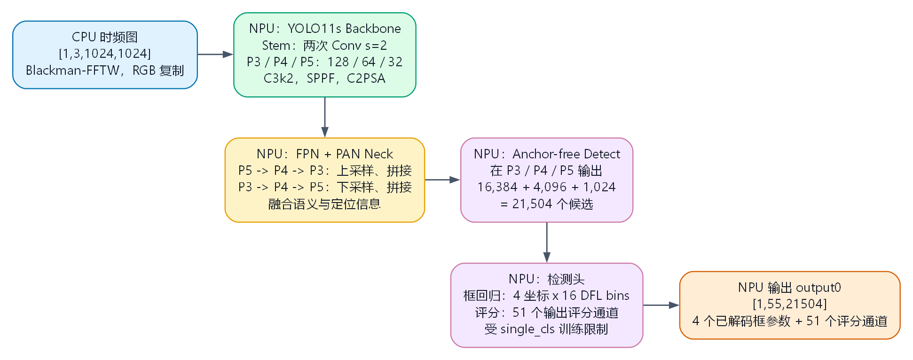

*图 5-7 当前 TorchSig YOLO11s 部署图的教学化结构。输入是 CPU 预处理后的时频图；Backbone 提取多尺度特征，FPN/PAN Neck 融合尺度，Detect Head 在 P3、P4、P5 上输出候选。图在 `output0` 处结束；阈值与 NMS 的 CPU 确定性后处理由图 5-8 单独说明。它不是逐节点的可执行 ONNX 报告，也不构成模型准确率证据。图源见 `img5/case5-yolo11s-architecture.dot`。*

固定 DFT 的投影矩阵由公式预先确定；卷积网络的核 $W$ 和偏置 $b$ 则由训练数据优化。抽象地说，一个卷积层在位置 $(i,j)$ 为输出通道 $c_o$ 计算

$$
Y_{c_o,i,j}=\sigma\left(b_{c_o}+\sum_{c_i,u,v}W_{c_o,c_i,u,v}X_{c_i,i+u,j+v}\right).
$$

在时频图中，$i$ 和 $j$ 对应时间、频率的局部邻域。训练后的卷积核会响应某些局部纹理、边缘、带状区域或它们的组合；它并没有直接“读到调制名称”。这也是为什么模型输出必须结合训练标签和独立实验解释。

可以从输入到输出分五步阅读图 5-7：

1. **Stem 与 Backbone。** 两个步长为 2 的卷积先把 $1024\times1024$ 图像压缩到 $512\times512$、$256\times256$；随后 `C3k2` 块提取局部模式。P3、P4、P5 的代表性特征图分别为 `[1,256,128,128]`、`[1,256,64,64]` 和 `[1,512,32,32]`。
2. **深层上下文。** P5 上的 `SPPF` 扩展感受野，`C2PSA` 在深层特征上引入注意力式上下文建模。它们处理的是频谱图形态，不是直接从 IQ 中估计相位或绝对功率。
3. **FPN/PAN Neck。** 自顶向下的上采样和拼接把高层语义传给较细的 P3/P4 特征；自底向上的路径再把定位信息传回较粗尺度。这样持续很短、带宽很窄的痕迹和持续较长、带宽较宽的痕迹都有对应的候选尺度。
4. **三尺度 Detect Head。** 三个输出网格的候选数为 $128^2+64^2+32^2=21\,504$。因此，输出的最后一个维度不是 21,504 个时间样本，而是 21,504 个候选位置。
5. **DFL 框解码。** DFL 用离散分布的期望解码连续框参数。当前导出合同的回归分支为 $4\times16=64$ 个离散值，即 `reg_max=16`；它随后与 51 个评分通道拼接，形成已解码的 $4+51=55$ 个输出值，而不是原始的 115 个头部值。前述固定数值来自当前导出合同，DFL 的一般原理见文献 [^5]；对当前单类监督 checkpoint，这些通道不能被解释为经过训练的 51 类语义。

下表把图中的模块名称与它们在本实验里可观察的职责对应起来。它解释结构，并不把模块名当作性能结论。

| 模块 | 在张量上的作用 | 对时频图任务的意义 |
| --- | --- | --- |
| 步长 2 卷积 | 降低空间分辨率并增加通道数 | 逐步把局部时间--频率纹理汇聚为更大感受野的特征 |
| `C3k2` | 在通道变换与瓶颈路径间组织局部特征 | 在不同分辨率上保留可用于定位的局部带状或突发形态 |
| `SPPF` | 用池化组合扩展深层上下文 | 为持续时间长或带宽宽的候选补充更大范围的上下文 |
| `C2PSA` | 在深层特征上建立注意力式关系 | 让相隔较远的时频结构可以共同参与深层表示；不等于获得了绝对功率或物理因果关系 |
| FPN/PAN | 自顶向下融合语义，自底向上回传定位信息 | 让 P3、P4、P5 同时覆盖不同尺度的时频区域 |
| Detect + DFL | 分别形成评分与离散框分布，再解码为连续坐标 | 产生候选框参数和评分，随后由确定性后处理筛选 |

训练阶段通常把定位、类别和分布回归误差组成目标函数，可抽象写成

$$
\mathcal{L}=\lambda_{\mathrm{box}}\mathcal{L}_{\mathrm{box}}
+\lambda_{\mathrm{cls}}\mathcal{L}_{\mathrm{cls}}
+\lambda_{\mathrm{dfl}}\mathcal{L}_{\mathrm{dfl}}.
$$

这个公式说明检测网络为何同时学习“框在哪里”和“该框的评分是什么”；它是 YOLO 检测训练的概念说明，不是对本项目上游训练超参数或精度的重新复现。对当前 checkpoint，类别项在单类监督语义下服务于候选信号区域，`single_cls=True` 限制优先于部署侧的标签表。

### 5.4 从 NPU 张量到候选区域 {#src-experiment-case5-yolo-decode}

这张图解决“神经网络输出后还发生了什么”的问题。ONNX 没有嵌入 NMS；OM 输出先在 CPU 上完成确定性的解码和抑制，才成为界面叠加框和 JSONL 记录。

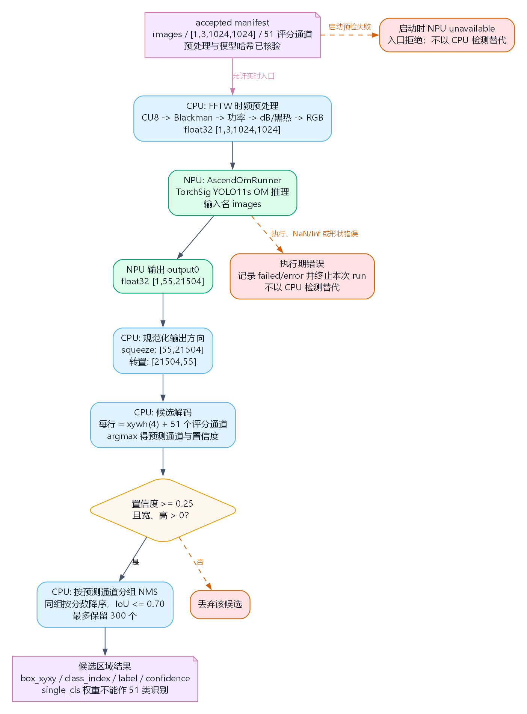{width=620px}

*图 5-8 当前 OM 兼容解码流程。`output0 [1,55,21504]` 转置为候选行后，前四列按 `xywh` 解释；现有实现从后 51 列取最大评分和通道索引，并按该索引分组做 IoU 0.70 的 NMS，最多保留 300 个框。该索引只是张量布局的兼容信息，不是调制类别标签；因此本图只说明输出解码和流水线连通，不能说明候选区域的类别、数量、召回率或误报率。图源见 `img5/case5-yolo-detection-decode-flow.dot`。*

这一段 CPU 后处理不构成 CPU 推理回退：卷积、特征融合和头部计算已经由 OM 完成，CPU 只执行框坐标换算、阈值筛选、NMS 和物理坐标映射。当前实现保留按评分通道分组的兼容逻辑，但它不能被表述为语义正确的 class-aware NMS；单类部署的正式后处理应改用单一候选得分和 class-agnostic NMS。在该源代码完成相应修订前，本章只把当前输出用于验证张量合同、数值有限性和流水线连通。若初始化时 OM 无法加载，实时入口显示或记录 `NPU unavailable`；若已运行的 OM 返回 NaN、Inf 或不满足 manifest 的形状，RTL 服务会终止本次运行并写入失败记录。两种失败都不会用另一个 CPU 检测器伪造 NPU 成功。

## 6. 核心实验：从 CAL 方波到固定分析窗口 {#src-experiment-case5-hantek-capture}

### 6.1 先确认 USB，而不是直接启动仪表盘 {#src-experiment-case5-usb-diagnostics}

USB 诊断程序只枚举已知设备，不打开示波器，也不上传固件。这样可以先区分“没有识别到设备”“当前用户没有权限”和“设备被其他程序占用”。在开发板的项目根目录执行：

```bash
cd ~/Documents/case5
python -m time_frequency_dashboard.acquisition.usb_diagnostics
```

**你应该看到：** 输出中列出 Hantek 对应的 USB 标识，并显示当前用户是否可写。如果显示 `writable=False`，应按 `scripts/udev/60-case5-hantek6022.rules` 配置权限，而不是使用 `sudo` 启动整个仪表盘。

**检查点：** 只有设备已识别且当前用户可访问时才继续。诊断阶段没有方波并不表示采集失败，因为它根本没有打开 ADC。

### 6.2 用 PulseView 建立最小真实基线 {#src-experiment-case5-pulseview-baseline}

首次接线时，将 CH1 探头接到 6022BE 的 `CAL` 输出，用 PulseView 选择 Hantek 6022BE、1 MHz 和 10 k samples，观察类似图 5-2 的方波。这个步骤把问题限制在设备、驱动和探头三项，不涉及 Case 5 的 Python、OM 或界面。

确认方波后关闭 PulseView。PulseView、`sigrok-cli` 和仪表盘都需要独占同一台 6022BE。如果设备仍显示为 `1d50:608e` 的 `fx2lafw` 固件状态，关闭占用程序后物理拔插设备，再启动下一次 sigrok session。

**检查点：** 能看到真实 CAL 方波，并且切换到 Case 5 前已经关闭 PulseView。不要把这一步写成 NPU 验收。

### 6.3 编译长期运行的 sigrok 采集桥 {#src-experiment-case5-build-bridge}

Case 5 不要求安装 `pyhantek6022`，也不再编译 OpenHantek 桥。板端使用系统 `libsigrok` 的 `hantek-6xxx` 驱动，由一个小型 C 程序把回调转换成稳定的二进制帧。

系统包由用户手动安装完成后，执行：

```bash
cd ~/Documents/case5
bash scripts/build_sigrok_capture_bridge.sh
```

**你应该看到：** 生成 `build/sigrok_capture_bridge`。脚本从自身位置解析项目根目录，不依赖临时工作目录。

桥接程序把二进制帧写到 stdout，把诊断写到 stderr。不要把 stdout 当成文本输出重定向到终端。Python 看到的公共对象可以简化为下面这段代码：

```python
@dataclass(frozen=True)
class BridgeFrame:
    sequence: int
    host_receive_ns: int
    sample_rate_hz: float
    flags: int
    samples: np.ndarray  # [samples, 2], float32
```

`sequence` 用于发现用户态帧缺口，`host_receive_ns` 是主机接收时间，`sample_rate_hz` 是驱动实际返回的采样率，`flags` 当前至少包含削顶标志。设备驱动没有提供 FIFO 溢出、ADC 序号或跨 USB 回调缺口元数据，所以桥序号连续只能证明桥到 Python 的帧没有丢失，不能证明物理 ADC 绝对无间隙。

### 6.4 从连续帧组成固定分析窗口 {#src-experiment-case5-window-assembly}

采集回调的块大小不应成为模型输入形状。`WindowAssembler` 将连续帧拼成 10,000 点窗口；一旦发现序号跳变、主机时间倒退或采样率变化，就清空未完成窗口，从下一帧重新开始：

```python
if self._last_sequence is not None and frame.sequence != self._last_sequence + 1:
    self.reset()
if self._sample_rate_hz is not None and frame.host_receive_ns < self._last_host_receive_ns:
    self.reset()
if self._sample_rate_hz is not None and not np.isclose(
    self._sample_rate_hz, frame.sample_rate_hz, rtol=0.0, atol=0.0
):
    self.reset()
```

这段处理体现了一个重要原则：宁可放弃跨越缺口的半个窗口，也不能把不连续样本拼成一段看似正常的频谱。

在启用 Little Bee 扩展配置时，`CaptureProcessor` 会按声明参数把 CH2 电压换算为趋势性电流，并计算最新采集块的统计量：

```python
current = self.config.current_conversion.to_current(frame.samples[:, 1])
converted = np.column_stack((frame.samples[:, 0], current)).astype(np.float32)
self.latest_statistics = (
    signal_statistics(converted[:, 0]),
    signal_statistics(converted[:, 1]),
)
```

这里的 CH2 换算只是配置驱动的显示变换，不是对 Little Bee 的本机标定。在核心 `CAL` 实验中，CH2 仍保留在两通道帧和固定形状张量中，但不据其数值作出电流测量结论。固定窗口形成后，每个通道再减去自身均值。CPU 只做单位换算、窗口整理和去直流，不计算供 Hantek 界面使用的 FFT 频谱。

这张图把“帧缺口为什么必须丢掉半个窗口”和“队列为什么丢弃旧分析任务”放在同一条流程上。它对应的是运行时数据完整性规则，而不是一次性的 USB 连接检查。

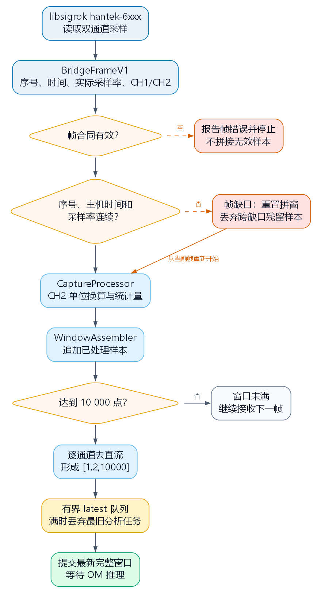{width=580px}

*图 5-9 Hantek 实时窗口形成流程。任何帧序号、主机时间或采样率连续性错误都会重置未完成窗口；形成 `[1,2,10000]` 后才进入容量为 2 的最新任务队列。队列满时丢弃旧分析任务并计数，不能把跨越缺口的样本拼成正常频谱。图源见 `img5/case5-hantek-acquisition-flow.dot`。*

### 6.5 扩展任务：Little Bee B1 的接入准备 {#src-experiment-case5-little-bee}

如需开展后续双通道扩展实验，才将 Little Bee 输出经 SMA-BNC 接入 CH2。开始采集前，应在探头本体上完成 `Reset/Zero`，记录工作模式、匝数、电池状态和连接方式；被测回路的隔离和允许测量范围必须已按第 2 节确认。

首版软件为这一扩展任务预设青色模式、1 MHz 声明带宽、$1.00\ \mathrm{V/A}$ 灵敏度和单匝导线。换算关系为：

$$
I=\frac{V_{\mathrm{out}}}{S\,N_{\mathrm{turns}}}
$$

默认参数下，$S=1.00\ \mathrm{V/A}$、$N_{\mathrm{turns}}=1$。这只是按公开说明进行的声明换算，配置版本为 `declared-cyan-1.0V-per-A-1turn`。当前成品探头尚未完成本机幅值、零点漂移和相位标定，因此 CH2 只能作为趋势性电流，不用于输出计量级功率、相位角或功率因数，也不属于本章核心实验的验收条件。

## 7. 在 310B 上完成固定 DFT {#src-experiment-case5-hantek-npu}

### 7.1 把 DFT 写成静态 ONNX 图 {#src-experiment-case5-dft-onnx}

传统 FFT 算法并不是本实验要部署的图。这里预先用 NumPy 生成带 Hann 窗的正弦、余弦投影矩阵，再用标准 ONNX 算子表达固定 DFT。输入窗口与矩阵相乘后，实部和虚部平方并成对求和，得到线性频谱功率。

`export_npu_spectrum.py` 中的核心节点如下：

```python
nodes = [
    helper.make_node("MatMul", ["waveforms", "dft_projection_weights"], ["projected"]),
    helper.make_node("Mul", ["projected", "projected"], ["squared_projection"]),
    helper.make_node("Reshape", ["squared_projection", "pair_shape"], ["squared_pairs"]),
    helper.make_node("AveragePool", ["squared_pairs"], ["pair_average"],
                     kernel_shape=[2, 1], strides=[2, 1]),
    helper.make_node("Mul", ["pair_average", "pair_sum_scale"], ["spectrum_power"]),
]
```

输入是 `[1,2,10000]`，输出是 `[1,2,201,1]`。权重、频率轴、窗口类型、采样率和输入输出形状同时写入 JSON 元数据。部署程序不依赖 PyTorch、`torch_npu` 或 `torch.onnx`。

这张图解决“生成 ONNX 后为什么还不能直接宣布 NPU 可用”的问题。ATC 只完成格式转换；真实 OM 的加载、数值与有限值检查才决定仪表盘能否发布频谱。

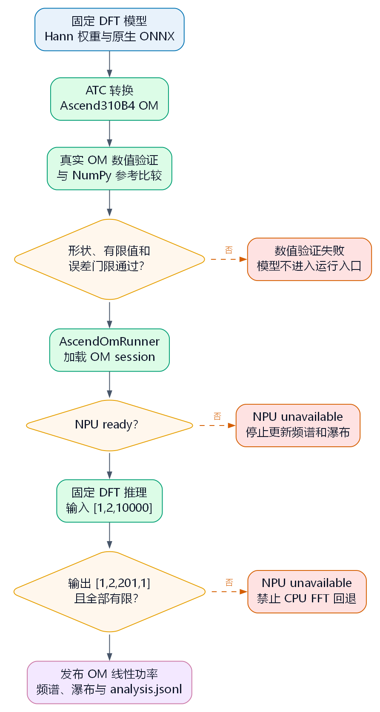{width=580px}

*图 5-10 固定 DFT 的板端验证与发布流程。只有真实 OM 输出形状正确、全为有限值并满足数值门限时，频谱和瀑布才接收线性功率；失败路径明确显示 `NPU unavailable`，没有 CPU FFT 回退。图源见 `img5/case5-hantek-om-flow.dot`。*

### 7.2 在开发板生成并验证 OM {#src-experiment-case5-prepare-hantek-om}

以下命令只能在 Ascend 310B 开发板执行。`prepare_models` 先生成 ONNX，再调用板端 ATC 转为 OM；`verify_npu_model` 使用同一测试输入比较数值参考与真实 OM 输出。

```bash
cd ~/Documents/case5
source /usr/local/Ascend/ascend-toolkit/set_env.sh
source /usr/local/miniconda3/etc/profile.d/conda.sh
conda activate base

python -m time_frequency_dashboard.model.prepare_models
python -m time_frequency_dashboard.model.verify_npu_model
```

**你应该看到：** `models/generated/` 中出现 ONNX、OM 和元数据文件，验证程序报告真实 OM 已加载、输出形状正确、数值有限且误差满足设定门限。

**检查点：** 生成 ONNX 成功不等于 NPU 验证成功。只有 `aclruntime.InferenceSession` 实际加载 OM 并完成推理，才能记录 `NPU (Ascend 310B)`。

### 7.3 启动仪表盘并读懂结果 {#src-experiment-case5-run-dashboard}

确认 PulseView 和 `sigrok-cli` 已退出，运行：

```bash
cd ~/Documents/case5
bash scripts/run_dashboard.sh --sigrok-bridge build/sigrok_capture_bridge
```

连接 Hantek 后，顶部后端区域应显示 `NPU (Ascend 310B)`，而不是 `NPU unavailable`。下图是以 6022BE `CAL` 方波取得的实机界面记录。

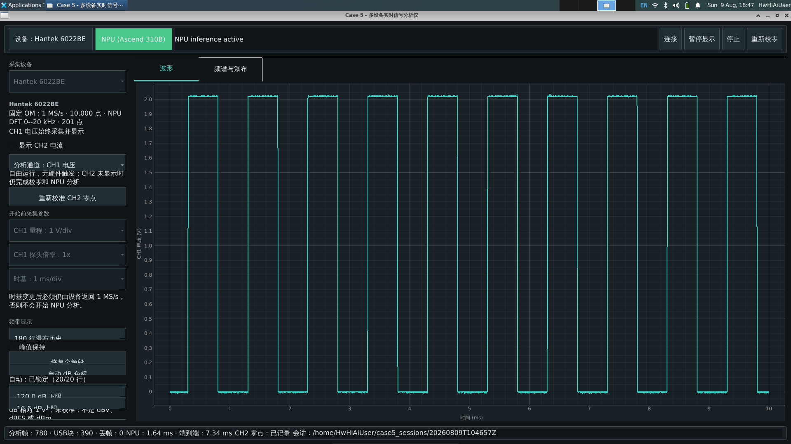

*图 5-11 Hantek 工作区的界面示例。它展示 CH1 采集、OM 后端状态和会话写入的位置，不代表 Little Bee 双通道幅相已经标定；一次运行是否可追溯仍以第 8 节所述的会话记录为准。*

界面可以按从上到下、从左到右的顺序阅读：

1. 顶部状态栏给出当前设备、实际 NPU 后端和错误信息；
2. 左侧参数区显示量程、探头倍率、分析通道、瀑布历史和色标；
3. 波形页显示当前采集块，暂停显示只冻结绘图，不会释放 USB；
4. 频谱与瀑布页显示同一批 OM 功率结果，瀑布只保存有界历史；
5. 底部状态栏给出分析帧、USB 块、丢帧、NPU 延迟、处理延迟和会话路径。

CAL 方波的基频约为 1 kHz，理想方波还会出现奇次谐波。在频谱页观察这些离散成分，比只看时域方波更容易理解频域为什么能描述波形边沿。但本次显示仍是未校准的相对功率，不应根据峰值直接推断探头带宽或精确电压。

### 7.4 NPU 不可用时系统怎样表现 {#src-experiment-case5-no-fallback}

`AscendOmRunner` 只有在 OM 文件存在、`aclruntime` 可导入、session 建立成功且输出名称可读取后才进入 ready 状态。任意一轮返回 NaN、Inf、错误形状或运行异常，后端都会转为 `NPU unavailable`，频谱和瀑布停止接收新行。

系统没有 Hantek CPU FFT fallback。模拟源可以帮助调试采集、队列和界面，但没有 OM 时不会生成一条 CPU 频谱冒充 NPU 结果。这个失败状态是可验证设计的一部分，而不是缺少功能。

## 8. 保存并复核一次会话 {#src-experiment-case5-hantek-session}

### 8.1 会话目录记录了什么 {#src-experiment-case5-session-files}

每次开始 Hantek 采集时，程序都会在 `data/hantek_sessions/` 下创建一个新的 UTC 时间目录，不覆盖旧证据。

| 文件 | 作用 |
| --- | --- |
| `manifest.json` | 保存配置、模型元数据、原始帧格式和时间基准 |
| `raw_XXXX.c5raw` | 分块保存原始 `BridgeFrameV1`，默认每块不超过 64 MiB |
| `raw_index.jsonl` | 记录每帧的序号、时间、采样率、块文件、偏移和字节数 |
| `analysis.jsonl` | 记录窗口范围、后端、形状、线性功率和推理延迟 |
| `summary.json` | 汇总原始字节、帧数、分析数、丢帧和写入错误 |

原始数据默认最多写入 1 GiB。达到上限或写队列满时，程序记录存储丢帧，不会让内存无限增长。分析 JSON 使用 `allow_nan=False`，因此 NaN 或 Inf 不能悄悄进入可追溯记录。

### 8.2 从一条结果追到原始窗口 {#src-experiment-case5-session-trace}

假设 `analysis.jsonl` 中某条结果记录了 `first_sequence=120`、`last_sequence=121`。复核时可以按下面的顺序追踪：

1. 在 `analysis.jsonl` 读取窗口序号范围、主机起止时间、模型后端和输出；
2. 在 `raw_index.jsonl` 查找序号 120、121 对应的块文件和字节偏移；
3. 根据索引从 `raw_XXXX.c5raw` 读取原始 `BridgeFrameV1`；
4. 在 `manifest.json` 核对采样率、探头倍率、Little Bee 换算版本和模型元数据；
5. 在 `summary.json` 检查本次会话是否发生存储丢帧或写入错误。

显示层使用 dB 便于阅读，但会话保存的是 OM 返回的线性功率。这样复核者可以重新选择显示下限，不会因为界面色标改变而丢失原始分析值。

这张图解决“一个漂亮的频谱图怎样被独立复核”的问题。它从结果记录反向回到原始帧，再让配置与会话完整性证据参与判断。

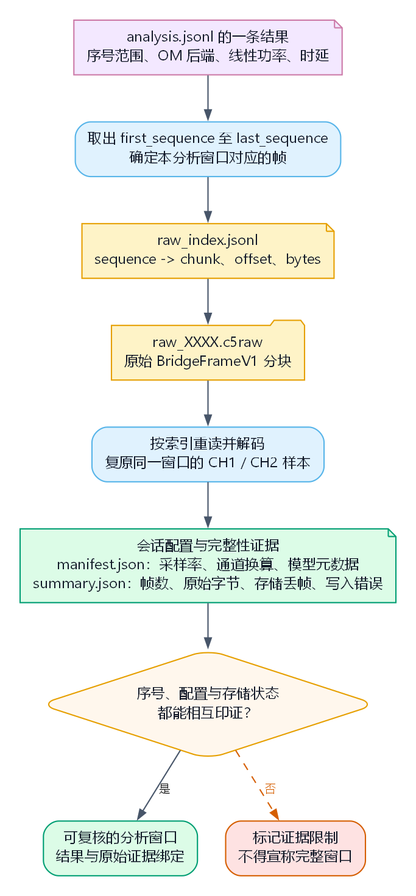{width=540px}

*图 5-12 单条 Hantek 分析结果的追溯路径。`analysis.jsonl` 给出窗口范围和 OM 结果，`raw_index.jsonl` 定位原始块；`manifest.json` 约束采样率、探头和模型，`summary.json` 报告会话完整性。缺少任一环节时，不能声称该窗口完全可复核。图源见 `img5/case5-session-trace-flow.dot`。*

### 8.3 当前仍未完成的部分 {#src-experiment-case5-hantek-limitations}

当前代码已经计算最新采集块的均值、RMS 和峰峰值，但 Hantek UI 与 `analysis.jsonl` 尚未持久化这些字段。Little Bee 的真实双通道接入、幅值标定、相位延迟和同步验收也尚未完成。因此，本章能够验收的是两通道数据帧合同、固定窗口、NPU 频谱、瀑布、后端状态和结果追溯；不能验收计量级功率、功率因数或故障分类。

## 9. 扩展实验：从 RTL-SDR IQ 到时频检测 {#src-experiment-case5-rtl-sdr}

### 9.1 先用固定 DFT 理解 IQ 频谱 {#src-experiment-case5-rtl-dft-demo}

正式检测模型包含时频预处理、目标检测和模型准入，第一次接触时不容易判断错误来自哪一层。旧固定复数 DFT Demo 提供了一条更小的教学路径：先生成一个频率已知的复数正弦波，确认 OM 的峰值频点正确，再接入真实接收机。

在开发板生成并验证模型：

```bash
cd ~/Documents/case5
source /usr/local/Ascend/ascend-toolkit/set_env.sh
source /usr/local/miniconda3/etc/profile.d/conda.sh
conda activate base

command -v rtl_sdr
python -m time_frequency_dashboard.model.prepare_rtl_iq_model
python -m time_frequency_dashboard.model.verify_rtl_iq_model
```

模型输入为 `[16,2,1024]`，一次推理覆盖 16 个窗口。采样率为 2.048 MS/s 时，单个 1024 点窗口为 0.5 ms，整个批次为 8 ms，频率间隔为 2 kHz。输出按照 `fftshift` 从 -1.024 MHz 排列到接近 +1.024 MHz。

先运行不依赖天线和射频环境的合成测试：

```bash
bash scripts/run_rtl_sdr_npu_demo.sh --source tone --batches 2
```

**你应该看到：** JSONL 中记录 `NPU (Ascend 310B)`、输入输出形状、推理耗时和与合成音调一致的峰值频率。

**检查点：** 这个 Demo 的频谱来自 OM，但它不被 PySide6 SDR 工作区使用，也不能代表正式检测模型的性能。

关闭 GQRX、GNU Radio、SDR++、`rtl_test` 等可能占用接收机的程序，确认天线或受控线缆状态后，可以运行有限真实采集：

```bash
bash scripts/run_rtl_sdr_npu_demo.sh \
  --source rtl \
  --center-frequency 100000000 \
  --gain-db 40.2 \
  --batches 8
```

40.2 dB 只是当前板卡、天线和 100 MHz 环境的实测起点，不是通用增益标定。若改用其他频段，应先通过独立短采集检查 CU8 端点削顶和 I/Q 方差。

### 9.2 正式 RTL-SDR 服务的数据流 {#src-experiment-case5-rtl-service}

正式 CLI 与仪表盘共同调用 `RtlSdrService`。一次运行按以下顺序发生：

1. 读取并复核 `accepted` manifest、ONNX/OM 哈希和固定输入合同；
2. 根据模型形状和采样率规划完整窗口，预检磁盘容量；
3. 启动 `rtl_sdr`，精确读取一个完整模型批次所需的 CU8 字节；
4. 归档原始 CU8，解码 I/Q，并构造模型输入；
5. 调用 `AscendOmRunner`，校验输出并执行 Top-K 或 NMS；
6. 将批次记录写入 JSONL，并把最新结果发布给 Qt；
7. 停止时写入 footer，绑定 CU8 字节数、SHA256、完成状态和时延汇总。

输入队列满时丢弃最旧批次，并在记录中增加 `queue_dropped_batches`。显示也只保留最新不可变快照，因此绘图变慢不会改写已经归档的模型输入或无限占用内存。

这张图解决“时频图和检测框分别在哪里计算”的问题。CPU 的 FFTW 只构造 manifest 规定的模型输入；神经网络检测必须来自 OM。

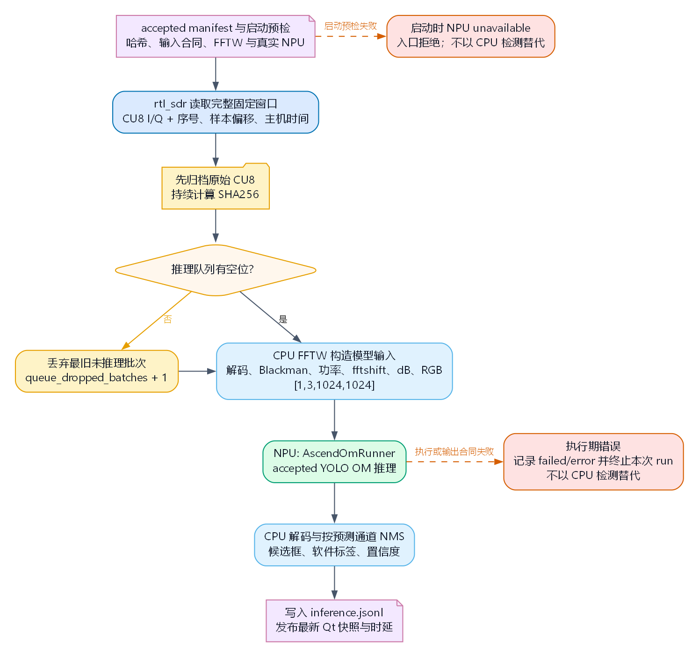

*图 5-13 RTL-SDR 实时服务流程。原始 CU8 先归档并绑定 SHA256；输入队列积压时丢弃最旧待推理批次；FFTW 生成时频图后由 OM 执行检测。初始化失败时入口拒绝 NPU 运行；执行期输出异常则以失败记录终止本次 run，二者都不会改用 CPU 检测器。图源见 `img5/case5-rtl-service-flow.dot`。*

### 9.3 谁计算时频图，谁完成检测 {#src-experiment-case5-rtl-cpu-npu-boundary}

当前正式模型是频谱图目标检测器。CPU 使用 FFTW 按 manifest 中的结构化合同执行 CU8 解码、1024 点无重叠 Blackman 窗、功率、`fftshift`、dB 归一化、黑热图和 RGB 复制，得到真正送入 OM 的 `[1,3,1024,1024]` 输入。

这个时频图可以在界面中预览，但必须标注为“CPU FFTW 模型输入”。NPU 执行 YOLO 并返回框参数与评分，CPU 再按第 5.4 节进行确定性解码和显示。当前 checkpoint 的输出只可作为候选区域链路的技术性证据；现有兼容解码中的通道索引和框数均不是类别或真实事件数量。把 CPU 模型输入称为“NPU FFT”，或者用 CPU 检测结果代替 OM，都会破坏后端可解释性。

对于 raw-IQ 分类模型，CPU 只按 manifest 进行去直流和归一化，NPU 返回类别 logits，界面再显示 Top-K。两类模型共用服务，但输入形状和后处理不能混用。

## 10. 模型准入与真实板端运行 {#src-experiment-case5-rtl-admission}

### 10.1 为什么一个 OM 文件还不够 {#src-experiment-case5-manifest-admission}

ATC 能够生成 OM，只说明图在当前工具链下可编译。要进入实时入口，还必须回答：这个模型来自哪里？权重是否与审查版本一致？ONNX 与 OM 是否被修改？NPU 输出是否与参考数值一致？P95 推理时间是否小于一个输入窗口？预处理是否与模型训练和验证时一致？

Case 5 用版本化 manifest 保存这些答案。正式入口只展示同时满足以下条件的模型：

- `admission.status` 为 `accepted`；
- ONNX、OM 和上游权重 SHA256 与记录一致；
- 输入形状、采样率和结构化预处理合同完整；
- 数值比较通过，输出有限；
- NPU P95 满足固定输入窗口预算；
- 模型被标记为可用于实时演示。

`accepted` 只表示模型和 NPU 边界通过准入，不代表采集、预处理、排队和后处理组成的整条主机流水线也已经实时通过。后者需要一次独立运行记录。

这张图区分“离线准入”与“在线连续运行证据”。前者证明一个固定模型合同可部署，后者才说明在明确输入状态下的完整流水线没有超过窗口预算。

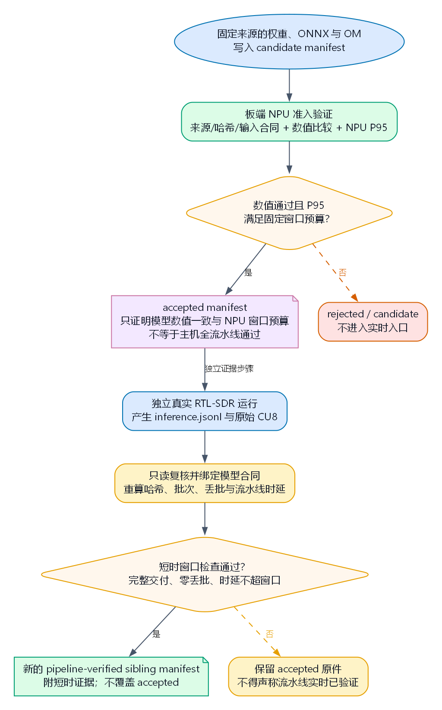{width=600px}

*图 5-14 模型准入与证据附着流程。来源、哈希、数值比较和窗口预算共同决定 `accepted`；真实运行的 CU8、JSONL 和只读 QC 形成新的 sibling manifest 证据，而不是改写原始 manifest。图源见 `img5/case5-model-admission-flow.dot`。*

### 10.2 从模型原理到板端候选 {#src-experiment-case5-yolo-model}

第 5 节已经从数据表示、YOLO11s 结构和后处理解释了这个候选。进入板端前，需要依次完成来源审查、ONNX 与 OM 工件核对、输入预处理复核、数值比较和窗口预算测量；这些信息由 manifest 绑定。部署仓库不包含训练环境和 PyTorch，上游权重只在隔离的准备环境中读取，部署侧只接收经过审查的 ONNX、OM 和 manifest。

若基础混合精度不能满足数值门限，板端准备流程可以采用 CANN 的局部精度保护机制。它只处理已发现的数值敏感边界，不改变模型训练语义，也不能把单类训练权重的通道布局变成多类识别。具体参数、工件名和重建命令随工具链演进，应以[配套资料 07](https://github.com/zhouxzh/Ascend310/blob/main/samples/case5/docs/07_ascend310b_heterogeneous_signal_processing.md)为准；不得通过手工修改 `status` 把 candidate 变成 accepted。[^6] [^7]

### 10.3 运行一次完整的真实窗口实验 {#src-experiment-case5-run-rtl}

当 `models/generated/inference/` 中已经存在通过准入的 manifest 时，先进行 10 秒级短运行：

```bash
cd ~/Documents/case5
bash scripts/run_rtl_sdr_npu_inference.sh \
  --source rtl \
  --manifest models/generated/inference/candidates/<accepted-manifest.json> \
  --center-frequency 100000000 \
  --gain-db 40.2 \
  --rf-input-context antenna_connected \
  --duration-seconds 10
```

当前检测模型的一个输入需要 $1024\times1024=1\,048\,576$ 个复样本。在 2.048 MS/s 下，一个完整窗口正好是 0.512 s。10 秒请求需要向上取整为 20 个窗口，因此实际计划为 10.240 s：

$$
20\times0.512\ \mathrm{s}=10.240\ \mathrm{s}
$$

每个复样本使用两个 CU8 字节，所以计划归档大小为 40 MiB。服务在打开设备前使用同一公式检查磁盘空间，JSONL 同时记录请求时长、计划时长、样本数和批次数。

**你应该看到：** metadata、每个批次和 footer 都记录 `NPU (Ascend 310B)`；生产批次等于完成批次；短运行没有队列丢批；`post_capture_pipeline_max_ms` 不超过 512 ms 窗口预算。

**检查点：** 当前 UI 的通道索引或调制名称都不能作为类别输出；它们至多说明采集、预处理、OM 输出和兼容解码链路连通。由于该 checkpoint 采用 `single_cls=True`，现有框数也不能作为真实时频事件数量。要开展类别识别或候选区域性能评价，必须先修订为语义一致的单类后处理，或换用具有多类监督语义的模型并进行独立评测。

### 10.4 对同一份证据执行只读复核 {#src-experiment-case5-rtl-qc}

运行完成后，用只读汇总器重新读取 JSONL 所绑定的同一份 CU8：

```bash
python -m time_frequency_dashboard.rtl_sdr_run_report \
  --inference-jsonl data/rtl_sdr_npu_inference/<run>/inference.jsonl \
  --output data/rtl_sdr_npu_inference/<run>/qc_summary.json
```

汇总器复核 CU8 字节数和 SHA256，要求 metadata、每批和 footer 都记录真实 NPU 后端，并统计 I/Q 直流偏置、端点削顶率和逐阶段 P50/P95/max 时延。它不会重新调用接收机、FFTW 或 NPU，也不会覆盖原始 JSONL、CU8 或已有 QC 文件。

若需要把一次运行附着为新的流水线证据，应从原 manifest 生成 sibling manifest，而不是改写采集时使用的文件：

```bash
python -m time_frequency_dashboard.model.attach_pipeline_realtime_evidence \
  --manifest models/generated/inference/candidates/<accepted-v3.manifest.json> \
  --inference-jsonl data/rtl_sdr_npu_inference/<run>/inference.jsonl \
  --output models/generated/inference/candidates/<pipeline-verified-v4.manifest.json>

python -m time_frequency_dashboard.model.attach_pipeline_realtime_evidence \
  --manifest models/generated/inference/candidates/<pipeline-verified-v4.manifest.json> \
  --verify-attached
```

至少 600 秒、输入状态为 `antenna_connected` 或 `lab_cabled`、零丢批且每批处理不超过窗口预算，才会被标记为连续管线通过。短运行只完成窗口级 smoke test。

## 11. 性能结果与工程判断 {#src-experiment-case5-performance}

### 11.1 Hantek 采集吞吐说明了什么 {#src-experiment-case5-hantek-throughput}

表 5-1 给出一次板端采集回调测量的结果。它只统计主机从 `libsigrok 0.5.2` 收到的模拟样本，不包含 Qt 绘制、会话存储或 NPU 推理；完整试验条件见[配套资料 01](https://github.com/zhouxzh/Ascend310/blob/main/samples/case5/docs/01_hantek6022be.md)。

| 请求采样率 | 单通道有效速率 | 双通道每通道有效速率 |
| ---: | ---: | ---: |
| 1 MS/s | 0.993 MS/s | 0.991 MS/s |
| 8 MS/s | 7.769 MS/s | 7.635 MS/s |
| 16 MS/s | 15.169 MS/s | 14.742 MS/s |
| 24 MS/s | 20.843 MS/s | 20.011 MS/s |

30 MS/s 和 48 MS/s 请求没有继续提高有效速率。Case 5 主线因此使用驱动读回并与 OM 合同一致的 1 MS/s 作为频率轴采样率，而不按设备宣传值推断运行能力。表中的“有效速率”是主机回调吞吐量，不能代替频率轴采样率；这些数字也不能证明跨 USB 回调的 ADC 样本绝对无间隙。

### 11.2 RTL-SDR 连续流水线 {#src-experiment-case5-rtl-soak}

表 5-2 摘录一次已接天线的连续板端运行：中心频率 100 MHz、采样率 2.048 MS/s、固定请求增益 40.2 dB、模型窗口 512 ms。除非另有说明，时延均从主机获得完整 IQ 批次后开始计时；“NPU 调用边界”包括张量准备、主机到设备传输、OM 执行、设备到主机传输和输出复制，不是射频首个样本到界面显示的端到端时延。完整环境与原始记录见[配套资料 07](https://github.com/zhouxzh/Ascend310/blob/main/samples/case5/docs/07_ascend310b_heterogeneous_signal_processing.md)。

| 指标（一次板端记录） | 结果 |
| --- | ---: |
| 连续运行时间 | 600.145 s |
| 计划 / 完成批次 | 1,170 / 1,170 |
| 队列丢批 | 0 |
| 后采集流水线 P50 / P95 / max | 252.440 / 255.858 / 282.768 ms |
| 主机至主机 NPU 调用边界 P50 / P95 / max | 139.425 / 139.881 / 141.935 ms |
| FFTW 预处理 P50 / P95 | 76.404 / 79.410 ms |
| CU8 归档大小 | 2,453,667,840 bytes |

后采集最大处理时间小于 512 ms，且生产批次与完成批次相等、零丢批，因此这次记录满足本章定义的连续管线条件。它只证明该板卡、这组参数和这次输入条件下的主机流水线，不证明射频幅值已经校准；当前兼容解码产生的框数和显示标签也不能作为类别结论或真实事件计数，因为 checkpoint 的 `single_cls=True` 训练语义不支持 51 类调制识别，且这次真实 IQ 没有地面真值。

### 11.3 NPU 并不天然快于最佳 CPU 算法 {#src-experiment-case5-cpu-npu-comparison}

旧固定复数 DFT 教学路径使用同一份真实 CU8，对 1024 点、batch 16 的不同实现进行了 50 次预热和 300 次重复测量。计时从主机输入数组可用开始，到主机可读取输出为止；初始化时间不计入，OM 数据包含主机与设备之间的数据传输：

| 实现 | P50 | P95 | 计算含义 |
| --- | ---: | ---: | --- |
| ARM FFTW3 | 0.136 ms | 0.141 ms | 优化后的 CPU FFT |
| NumPy FFT | 1.208 ms | 1.270 ms | Python/NumPy CPU 基线 |
| Ascend OM | 1.618 ms | 1.641 ms | 主机到主机固定稠密 DFT |
| CPU 稠密 DFT | 6.168 ms | 6.421 ms | 与 OM 相同矩阵算法 |

OM 比相同算法的 CPU 稠密 DFT 快，但明显慢于 FFTW。原因不是“NPU 不适合信号处理”，而是小型 FFT 有成熟的低复杂度 CPU 实现，而固定矩阵 DFT 需要更多乘加和主机设备搬运。当前工程选择因此是：轻量 FFT、解码和归约留在 ARM/FFTW，大型固定形状卷积、矩阵和神经网络优先评估 NPU。

是否迁移到 NPU，应同时检查数值、P95、输入窗口预算、最佳 CPU 基线和 CPU 释放价值，而不是只看一次推理是否成功。

## 12. 从零复现、验收与故障排查 {#src-experiment-case5-reproduction}

### 12.1 本地开发检查 {#src-experiment-case5-local-checks}

本地开发机只验证 Python、NumPy、ONNX 和 Qt 隔离逻辑：

```bash
cd samples/case5
python -m pytest -q
python -m compileall -q time_frequency_dashboard
```

pytest 覆盖帧协议、窗口缺口、单位换算、有界队列、ONNX 与 NumPy 数值对照、会话存储、NPU 不可用状态、仪表盘资源互斥、RTL manifest 和 JSONL/QC 合同。测试跳过硬件项并不表示硬件已经通过。

### 12.2 开发板准备 {#src-experiment-case5-board-setup}

在开发板上进入固定目录，由用户手动安装系统依赖：

```bash
cd ~/Documents/case5
sudo apt-get update
sudo apt-get install -y libsigrok-dev sigrok-cli gcc pkg-config libfftw3-single3 rtl-sdr
```

如果只运行 Hantek 路径，可以不安装 `rtl-sdr`；如果还要编译独立 FFTW C 基准，需要额外安装 `libfftw3-dev`。项目脚本不会自行执行 `sudo`。

随后安装用户态 Python 依赖：

```bash
source /usr/local/miniconda3/etc/profile.d/conda.sh
conda activate base
python -m pip install -r requirements-board.txt
```

`requirements-board.txt` 不包含 CANN、ACL、系统 sigrok 包或 PyTorch。CANN 使用开发板已有环境。

### 12.3 Hantek 验收顺序 {#src-experiment-case5-hantek-acceptance}

1. 运行 USB 诊断，确认设备存在且当前用户可写；
2. 用 PulseView 和 `CAL` 完成最小真实基线，随后关闭 PulseView；
3. 编译 `build/sigrok_capture_bridge`；
4. 生成并验证 Hantek 固定 DFT OM；
5. 启动仪表盘，确认实际采样率为 1 MS/s；
6. 确认后端为 `NPU (Ascend 310B)`，频谱和瀑布随 OM 结果更新；
7. 停止采集，复核会话目录中的原始帧、分析记录和 summary；

Little Bee 接入属于扩展任务。只有完成零点、模式、匝数、幅值、相位和同步标定后，CH2 才能作为电流测量通道解释；它不属于上述核心验收。

真实 USB 与 OM 集成测试只能在板端显式启用：

```bash
cd ~/Documents/case5
export CASE5_RUN_HARDWARE_TESTS=1
python -m pytest -q tests/test_hardware_capture_and_inference.py
```

该测试必须先取得至少两个包含 CH1/CH2 的真实 Hantek 帧窗口，再把窗口送入 OM，检查输出形状 `[1,2,201,1]` 和有限值。它验证两通道帧合同和 NPU 频谱链路，不验证 CH2 的 Little Bee 电流标定。没有设置环境变量时的跳过不能写成“硬件测试通过”。

### 12.4 RTL-SDR 验收顺序 {#src-experiment-case5-rtl-acceptance}

1. 用 `command -v rtl_sdr` 和 `rtl_test -t` 确认工具与接收机可用；
2. 生成并验证旧固定 IQ DFT OM，先运行 `--source tone`；
3. 使用有限真实 IQ 检查中心频率、增益、PPM 和 CU8 削顶；
4. 准备带来源、哈希、数值和预算证据的 accepted manifest；
5. 运行 10 秒正式服务，检查完整窗口、真实 NPU 后端和零丢批；
6. 对同一 JSONL/CU8 生成只读 QC；
7. 需要连续验收时，再执行至少 600 秒、已接天线或受控线缆的运行。

Hantek 与 RTL-SDR 在仪表盘中互斥。切换前必须先停止当前来源，等待采集进程、队列和 NPU runner 完全退出。

### 12.5 常见故障 {#src-experiment-case5-troubleshooting}

| 现象 | 原因 | 处理 |
| --- | --- | --- |
| `Resource busy` / `LIBUSB_ERROR_BUSY` | PulseView、`sigrok-cli` 或旧仪表盘仍占用 6022BE | 关闭占用程序；必要时物理拔插 |
| `writable=False` | 当前用户没有 USB 写权限 | 安装项目 udev 规则，不要 sudo 启动 UI |
| `sigrok capture bridge not found` | 尚未编译桥或路径错误 | 运行 `scripts/build_sigrok_capture_bridge.sh` |
| 实际采样率不是 1 MS/s | 采集合同与固定 OM 不匹配 | 检查驱动、量程和启动参数 |
| `NPU unavailable` | Hantek runner 在初始化或输出合同检查中失败，或 RTL 服务在启动预检时无法建立 OM | 先区分 Hantek 与 RTL 路径，再运行对应 `verify_*_model` 并查看具体消息 |
| RTL run `failed` / `error` | runner 已启动后输出出现 NaN/Inf 或违反形状合同 | 保留 JSONL，检查失败记录；不要把运行期错误写成 CPU 或 NPU 成功 |
| Hantek 频谱不更新 | NPU 没有 ready 或未形成完整窗口 | 检查后端、采样率、帧缺口和队列计数 |
| CH2 数值异常 | Little Bee 模式、匝数、去零或削顶不正确 | 回到探头说明和经确认隔离的教学回路重新检查；标定前不把 CH2 数值当作计量结果 |
| SDR 页面没有模型 | 没有通过准入和哈希复核的 manifest | 按 `docs/07` 完成模型准入 |
| RTL 后采集延迟超过 512 ms | CPU 预处理、排队或 NPU 超出窗口预算 | 检查逐阶段 P95/max 和丢批，不得宣称实时通过 |
| 检测框很多但无法解释 | 当前 checkpoint 为单类区域检测，且真实 IQ 没有地面真值或接收链过载 | 检查 QC；只能报告候选区域链路连通，不能把软件标签写成多类准确率 |

## 13. 思考题、总结与参考资料 {#src-experiment-case5-summary}

### 13.1 思考与改进任务 {#src-experiment-case5-exercises}

1. 如果 Hantek 窗口从 10,000 点扩大到 20,000 点，时间跨度、频率间隔、OM 输入形状和更新率分别怎样变化？
2. `LatestQueue` 满时为什么丢弃最旧分析窗口？如果应用目标改为离线证据采集，队列策略应怎样改变？
3. 为 Little Bee 设计幅值和相位标定实验。需要哪些参考仪器、频点、负载和元数据，才能开始计算有功功率与功率因数？
4. 在 Hantek UI 和 `analysis.jsonl` 中加入 RMS、峰值和峰峰值时，怎样保证这些统计量与同一原始窗口关联，而不是最新显示块？
5. 当前 RTL 检测窗口为 512 ms。如果换成更小输入模型，哪些性能指标必须重新测量，旧 manifest 中哪些证据会失效？
6. 为什么固定 DFT OM 比 CPU 稠密 DFT 快，却比 FFTW 慢？这个结果对“NPU 化”逐点运算有什么启示？
7. 设计一个带已知标签的受控射频实验，使检测准确率与链路实时性能够分别评价。
8. 为什么 `[1,55,21504]` 的张量合同不足以证明 51 类调制识别？说明为什么必须先换用具有多类监督语义的模型，再建立训练、标注和独立评测证据。

### 13.2 可迁移的方法 {#src-experiment-case5-conclusion}

Case 5 的两条实验链面对不同物理信号，却使用了相同的工程方法。第一，先建立稳定的采集合同，把具体设备格式隔离在适配层。第二，把连续数据整理成固定窗口，让时间、序号和原始文件始终可追溯。第三，只把适合固定形状和较高计算量的任务交给 NPU，并用最佳 CPU 实现作为比较基线。第四，后端状态、模型版本、延迟和错误必须进入界面和记录，不能在失败时悄悄替换结果。第五，把模型标签视为可检验的科学假设：对于本章这个 `single_cls=True` checkpoint，当前软件标签和框数仅服务于兼容性显示，不能代表类别或事件数量。要进行多类调制识别，必须替换为多类监督模型，并给出独立标签与适当指标。

这套方法比某一个示波器或某一个模型更重要。更换采集设备时，公共处理和存储合同仍然成立；更换模型时，manifest 和固定窗口预算仍然约束运行；增加新分析任务时，读者也能明确回答“输入是什么、谁计算、输出是什么、怎样验证、结果依据在哪里”。

### 13.3 Case 5 专项文档 {#src-experiment-case5-project-references}

- [01 Hantek 6022BE：sigrok 驱动和实机采集](https://github.com/zhouxzh/Ascend310/blob/main/samples/case5/docs/01_hantek6022be.md)
- [02 Little Bee B1：开源电流与磁场探头](https://github.com/zhouxzh/Ascend310/blob/main/samples/case5/docs/02_little_bee_b1.md)
- [03 架构与 sigrok 数据流](https://github.com/zhouxzh/Ascend310/blob/main/samples/case5/docs/03_architecture.md)
- [04 实时信号分析仪表盘前端](https://github.com/zhouxzh/Ascend310/blob/main/samples/case5/docs/04_frontend_design.md)
- [05 第三方代码与许可证](https://github.com/zhouxzh/Ascend310/blob/main/samples/case5/docs/05_third_party_licenses.md)
- [06 RTL-SDR 实时 NPU 服务与旧 DFT 教学路径](https://github.com/zhouxzh/Ascend310/blob/main/samples/case5/docs/06_rtl_sdr_npu_demo.md)
- [07 昇腾 310B 异构信号处理评估与 SDR-NPU 指引](https://github.com/zhouxzh/Ascend310/blob/main/samples/case5/docs/07_ascend310b_heterogeneous_signal_processing.md)
- [Case 5 代码入口与板端命令](https://github.com/zhouxzh/Ascend310/blob/main/samples/case5/README.md)

### 13.4 外部资料 {#src-experiment-case5-external-references}

[^1]: Weston Braun. "Little Bee B1 Operating Instructions." 固定审查版本：9157c50a5d6e56ba746725cb0de5875efac7d5e7. https://github.com/westonb/little-bee-B1/blob/9157c50a5d6e56ba746725cb0de5875efac7d5e7/getting-started/README.md

[^2]: Luke Boegner et al. "Large Scale Radio Frequency Wideband Signal Detection & Recognition." arXiv:2211.10335, 2022. https://doi.org/10.48550/arXiv.2211.10335

[^3]: TorchDSP. "gr-spectrumdetect." 固定审查版本：868cb381e1fdd7d13ad70ecaf271e5060c43308d. https://github.com/TorchDSP/gr-spectrumdetect/blob/868cb381e1fdd7d13ad70ecaf271e5060c43308d/README.md#training

[^4]: Ultralytics. "YOLO11: Architecture and model documentation." https://docs.ultralytics.com/models/yolo11/

[^5]: Xiang Li et al. "Generalized Focal Loss: Learning Qualified and Distributed Bounding Boxes for Dense Object Detection." NeurIPS 2020. https://doi.org/10.48550/arXiv.2006.04388

[^6]: Huawei. "CANN 8.0 ATC precision_mode." https://www.hiascend.com/document/detail/en/canncommercial/800/devaids/atc/atlasatcparam_16_0068.html

[^7]: Huawei. "CANN 8.0 ATC keep_dtype." https://www.hiascend.com/document/detail/en/canncommercial/800/devaids/atc/atlasatcparam_16_0074.html
