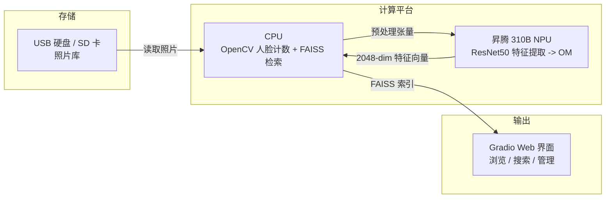
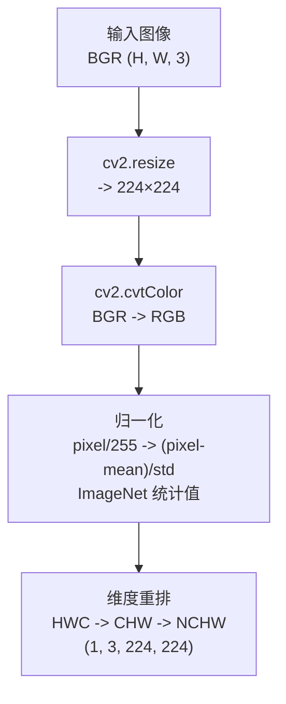
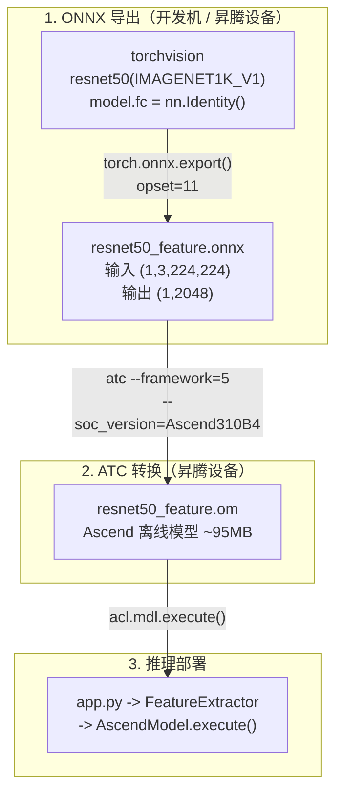
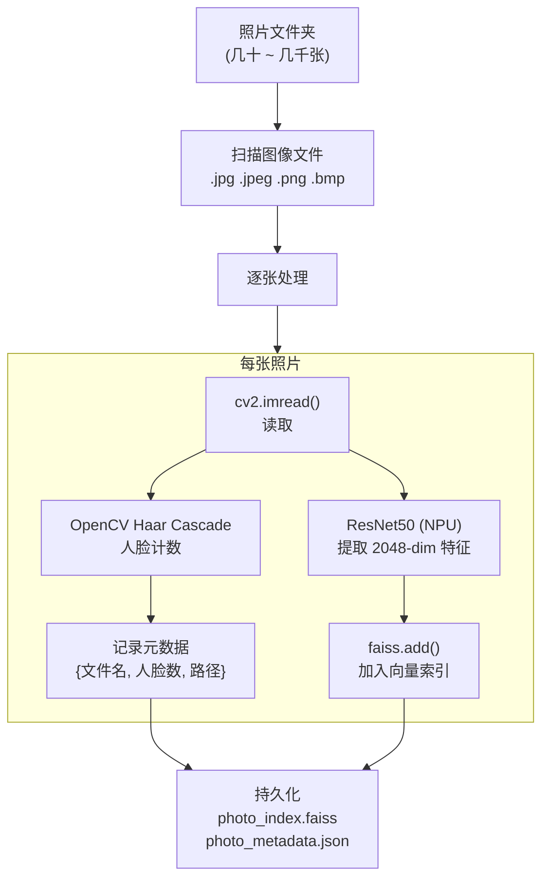
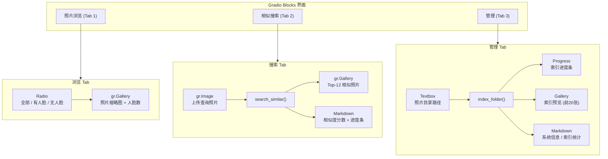
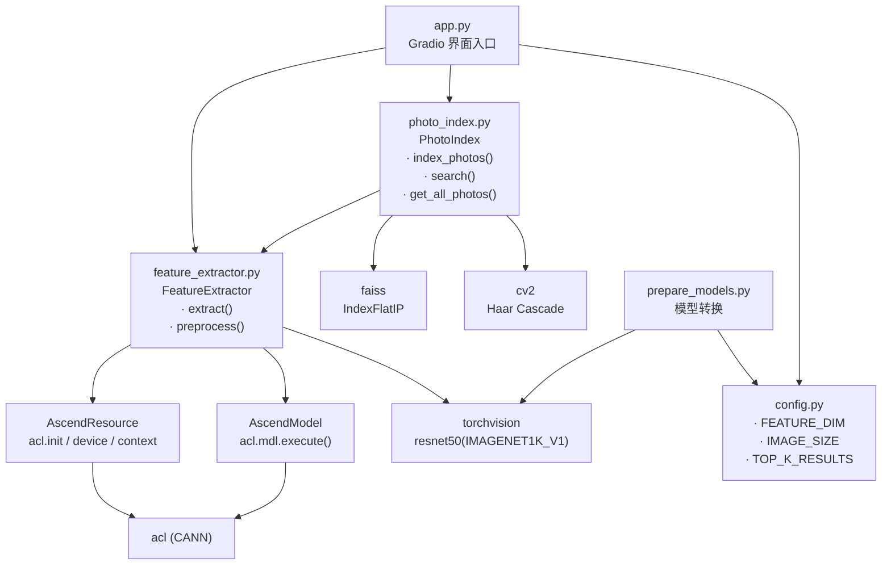

# 案例7：智能相册

## 1. 项目简介 {#src-experiment-case7-h1}

本项目基于昇腾 310B 平台，构建一个智能照片管理和检索系统。系统使用
**ResNet50** 卷积神经网络提取每张照片的 2048 维视觉特征向量，通过
**FAISS** 向量检索引擎实现毫秒级的相似图片搜索，利用 **OpenCV** 进行人
脸计数实现按人物筛选。

与案例1（人脸识别）的实时摄像头推理不同，本项目是书中第一个演示**批量
离线索引 + 在线检索**模式的案例，帮助读者理解 NPU 如何在"先算后查"的
场景中发挥作用。

### 三个核心功能 {#src-experiment-case7-h2}

1. **照片浏览**：按"全部 / 有人脸 / 无人脸"筛选照片库
2. **相似搜索**：上传一张照片，找出视觉上最相似的 12 张
3. **批量索引**：一键扫描照片文件夹，提取特征向量，构建 FAISS 索引

### 与已有案例的关系 {#src-experiment-case7-h3}

| 案例 | 领域 | NPU 任务 | 模式 |
|------|------|----------|------|
| 案例1 | 人脸识别 | SCRFD 检测 + MobileFaceNet 识别 | 实时摄像头 -> Flask API |
| **案例7** | **智能相册** | **ResNet50 特征提取** | **批量索引 + FAISS 检索** |
| 案例8 | 手势识别 | MobileNetV3 分类 | 实时摄像头 -> Gradio |
| 案例9 | 聊天机器人 | MiniLM 文本嵌入 | 文本 RAG + 云端 LLM |

## 2. 内容大纲 {#src-experiment-case7-h4}

### 2.1. 硬件准备 {#src-experiment-case7-h5}

相比旧版案例7中列出的扫描仪、4K 显示器、触摸屏、NAS 网络存储等复杂设
备，本项目只需要：

- **昇腾 310B 开发者套件**：核心计算单元
- **存储设备**：存放照片的 USB 硬盘 / SD 卡 / SSD（照片库需要一定容量）
- **显示屏**（可选）：用于浏览器访问 Gradio 界面

硬件架构如图所示：



为什么不需要 GPU 工作站？ResNet50 的特征提取在 310B NPU 上即可高效完成，
单张照片推理仅需 5-10ms。对于个人照片库（几百到数千张），310B 完全能
在几十秒内完成全库索引。而且模型权重直接由 PyTorch 官方 CDN 提供，无需
额外下载第三方模型文件。

### 2.2. 软件环境 {#src-experiment-case7-h6}

#### 操作系统与框架 {#src-experiment-case7-h7}

| 层级 | 软件 | 版本 | 用途 |
|------|------|------|------|
| 操作系统 | Ubuntu | 20.04 / 22.04 LTS | 运行环境 |
| CANN | Ascend Toolkit | 7.0+ | NPU 驱动与 ATC 转换工具 |
| Python | CPython | 3.8 ~ 3.10 | 应用开发语言 |
| 深度学习 | PyTorch + torchvision | 2.0+ | ResNet50 模型 / CPU 推理回退 |
| 图像处理 | OpenCV | 4.8+ | 图像预处理 + 人脸检测 |
| 向量搜索 | FAISS | 1.7+ | 向量相似度检索 |
| Web | Gradio | 4.0+ | 照片画廊 + 搜索界面 |

#### 环境准备 {#src-experiment-case7-h8}

在昇腾 310B 设备上，运行一键安装脚本：

```bash
# 安装 Python 依赖并导出 ONNX 模型
bash setup.sh
```

`setup.sh` 会依次完成：
1. 安装系统包（`python3-dev`, `python3-pip`）
2. 安装 Python 依赖（`pip3 install -r requirements.txt`）
3. 运行 `prepare_models.py` 导出 ResNet50 的 ONNX 模型（如有 CANN 则继续
   转换为 OM）

如果你希望在开发机上只做 ONNX 导出：

```bash
python3 prepare_models.py --onnx-only
```

#### Python 依赖说明 {#src-experiment-case7-h9}

| 包 | 用途 | 必需？ |
|:---|:---|:---|
| `gradio` | Web 界面框架，内置 `gr.Gallery` 照片墙组件 | 是 |
| `torch` + `torchvision` | ResNet50 模型定义、CPU 特征提取回退 | 是 |
| `opencv-python` | 图像缩放、色彩转换、归一化、人脸检测 | 是 |
| `numpy` | 特征向量操作、L2 归一化 | 是 |
| `faiss-cpu` | 向量相似度搜索（IndexFlatIP） | 是 |
| `Pillow` | Gradio 图像格式转换 | 是 |
| `onnx` | ONNX 模型校验（仅 prepare_models.py） | 仅转换 |
| `acl` (CANN 自带) | NPU 推理，随 CANN 安装 | 仅推理 |

`requirements.txt` 文件中已包含所有 pip 可安装的 Python 依赖。`acl` 包
无需手动安装，它随 CANN 一起部署，Python 通过 `import acl` 调用。

### 2.3. 图像特征提取原理 {#src-experiment-case7-h10}

#### 什么是图像特征向量 {#src-experiment-case7-h11}

要让计算机判断两张照片是否"相似"，不能直接比较像素——同一物体在不同光
照、角度、背景下，像素值完全不同。正确的做法是：用一个训练好的深度神经
网络将每张图像映射为一个固定长度的**特征向量（Embedding）**，使得语义
相似的图像在向量空间中距离很近。

```
照片 A (海滩日落)  ->  ResNet50  ->  [0.12, -0.34, 0.78, ..., 0.05]  (2048-dim)
照片 B (海边黄昏)  ->  ResNet50  ->  [0.11, -0.32, 0.80, ..., 0.04]  (2048-dim)
                                               ↓
                                    余弦相似度 约等于 0.95  (高度相似!)

照片 C (会议室)    ->  ResNet50  ->  [-0.45, 0.67, -0.12, ..., 0.33]  (2048-dim)
                                               ↓
                              与 A 的余弦相似度 约等于 0.12  (不相似)
```

#### 为什么选择 ResNet50 {#src-experiment-case7-h12}

昇腾 310B NPU 最适合运行固定输入输出形状的卷积神经网络。ResNet50 是计
算机视觉领域最经典的特征提取骨干网络之一：

| 模型 | 特征维度 | 模型大小 (OM) | NPU 推理 | 备注 |
|------|---------|--------------|----------|------|
| **ResNet50** | 2048-dim | ~95 MB | ~8ms | 推荐，torchvision 内置 |
| MobileNetV3-Small | 576-dim | ~10 MB | ~5ms | 案例8已使用，维度较低 |
| EfficientNet-B0 | 1280-dim | ~20 MB | ~10ms | 也可用 |
| CLIP ViT-B/32 | 512-dim | ~350 MB | 一般 | Transformer，OM 转换复杂 |

选择 ResNet50 的理由：

1. **零外部下载**：`torchvision.models.resnet50(weights=...)` 自动从
   PyTorch CDN 获取权重，无需维护第三方模型下载链接
2. **经典可迁移**：ResNet 是计算机视觉的"标准答案"，"去掉分类头得到特
   征向量"的模式适用于几乎所有 CNN 骨干网络
3. **维度适中**：2048 维特征向量在表达能力（越高越好）和存储开销（越低
   越好）之间取得平衡——10,000 张照片的索引仅占 ~80 MB
4. **与案例8差异化**：案例8使用 MobileNetV3-Small 做手势分类，本案使用
   ResNet50 做特征提取——不同的模型、不同的任务类型

#### 去掉分类头：分类模型 -> 特征提取器 {#src-experiment-case7-h13}

torchvision 的 `resnet50` 默认输出 1000 类的分类概率。我们只需要图像的
"语义表示"，不需要分类结果。做法是将最后一层 `fc`（全连接层）替换为
`nn.Identity()`（恒等映射）：

```python
import torchvision.models as models

model = models.resnet50(weights=models.ResNet50_Weights.IMAGENET1K_V1)
model.fc = torch.nn.Identity()  # 去掉分类头 -> 输出 2048-dim 特征向量
model.eval()
```

这样模型输入 `(1, 3, 224, 224)` 的图像张量，输出 `(1, 2048)` 的特征
向量，而不是 `(1, 1000)` 的类别概率。

#### L2 归一化：让内积等于余弦相似度 {#src-experiment-case7-h14}

FAISS 的 `IndexFlatIP`（内积索引）计算的是向量点积。为了让点积等价于余
弦相似度，需要先将所有特征向量做 L2 归一化（模长为 1）：

```python
norm = np.linalg.norm(vec)
if norm > 0:
    vec = vec / norm  # 归一化后 |vec| = 1，点积 = 余弦相似度
```

#### 图像预处理流程 {#src-experiment-case7-h15}



预处理代码在 [feature_extractor.py](samples/case7/feature_extractor.py) 的
`FeatureExtractor.preprocess()` 方法中，与案例8的手势识别预处理完全一致。

### 2.4. 模型转换与昇腾部署 {#src-experiment-case7-h16}

torchvision 提供的 ResNet50 权重是 PyTorch 格式，需要通过两次转换才能
在 310B NPU 上运行。



#### 步骤 1：导出 ONNX {#src-experiment-case7-h17}

```bash
# 仅导出 ONNX（可在开发机上运行，不需要昇腾硬件）
python3 prepare_models.py --onnx-only
```

这一步会：
1. 从 torchvision 加载预训练的 ResNet50（ImageNet 权重）
2. 将 `fc` 层替换为 `nn.Identity()`
3. 用 `torch.onnx.export()` 导出为 ONNX 格式
4. 输入形状固定为 `(1, 3, 224, 224)`，输出形状固定为 `(1, 2048)`

关键代码见 [prepare_models.py](samples/case7/prepare_models.py) 中的
`export_onnx()` 函数。注意 `dynamic_axes={}` 参数——我们刻意禁用了动态
形状，确保与 ATC 转换兼容。

#### 步骤 2：ATC 转换 ONNX -> OM {#src-experiment-case7-h18}

```bash
# 在昇腾设备上运行
python3 prepare_models.py
```

这一步调用 CANN 的 `atc` 工具：

```bash
atc --model=models/resnet50_feature.onnx \
    --framework=5 \
    --output=models/resnet50_feature \
    --soc_version=Ascend310B4 \
    --input_format=NCHW \
    --input_shape=input:1,3,224,224
```

参数说明：

| 参数 | 值 | 说明 |
|------|-----|------|
| `--model` | ONNX 文件路径 | 输入的 ONNX 模型 |
| `--framework` | 5 | 5 = ONNX 格式 |
| `--output` | 输出路径 | 生成的 `.om` 文件路径 |
| `--soc_version` | Ascend310B4 | 芯片型号 |
| `--input_format` | NCHW | 输入数据排布格式 |
| `--input_shape` | input:1,3,224,224 | 固定输入形状 |

`soc_version` 通过 `npu-smi info` 自动检测，默认值为 `Ascend310B4`。

#### 与案例8的模型转换对比 {#src-experiment-case7-h19}

| 对比项 | 案例8 (手势识别) | 案例7 (智能相册) |
|--------|-----------------|-----------------|
| 模型来源 | 自己训练 (.pth) | torchvision 预训练 |
| 模型架构 | MobileNetV3-Small | ResNet50 |
| 输出 | 10 类 logits | 2048-dim 特征向量 |
| 需要训练？ | 是（或下载 .pth） | 否（torchvision 直接提供） |
| 外部下载 | 预训练 .pth + HaGRID 数据集 | 无（PyTorch CDN 自动拉取） |

本案不需要训练脚本——这是案例8已经覆盖的内容。本案展示的是另一种常见的
边缘 AI 模式：直接使用预训练模型做特征提取，无需微调。

### 2.5. 照片索引与向量检索 {#src-experiment-case7-h20}

#### 整体流程 {#src-experiment-case7-h21}



#### PhotoIndex 类设计 {#src-experiment-case7-h22}

[photo_index.py](samples/case7/photo_index.py) 中的 `PhotoIndex` 类管理
整个照片索引的生命周期：

- `index_photos(photo_dir)` — 扫描目录，逐张提取特征，构建 FAISS 索引
- `search(query_image, k)` — 提取查询图像特征，返回 Top-K 相似照片
- `get_all_photos()` / `get_photos_by_face_count()` — 按条件筛选照片
- `save()` / `load()` — 将 FAISS 索引和元数据持久化到磁盘

#### 为什么用 IndexFlatIP（暴搜） {#src-experiment-case7-h23}

`faiss.IndexFlatIP` 是 FAISS 提供的最简单的索引——不做任何近似或压缩，
直接计算查询向量与库中所有向量的内积。对于个人照片库（通常几百到几千张），
暴搜完全够用：

- 在 10,000 张照片的库中搜索一次约需 1-2ms（2048 维 × 10,000 次点积）
- 不需要训练（IVF 需要）、不损失精度（PQ 会降低召回率）
- 索引文件大小 = 照片数 × 2048 × 4 字节，10,000 张约 80 MB

当照片库增长到数万张以上时，可以将 `IndexFlatIP` 替换为 `IndexIVFFlat`
或 `IndexHNSWFlat`，在精度和速度之间做权衡。

#### NPU 批量推理的实际情况 {#src-experiment-case7-h24}

OM 模型的输入形状固定为 `(1, 3, 224, 224)`（batch size = 1），所以 NPU
模式下的"批量索引"实际上是逐张调用 `execute()`。对于几百张照片的索引，
总耗时完全可以接受（每张 ~8ms，100 张不到 1 秒）。

CPU 回退模式反而可以利用 PyTorch 的动态批处理能力——将多张照片堆叠为
`(N, 3, 224, 224)` 的张量，一次前向传播处理整个批次。这是 OM 模型的一
个已知限制，书中已在多处提及（参见案例8、案例9中的相关讨论）。

#### 人脸检测：为什么只用 Haar Cascade {#src-experiment-case7-h25}

本案例使用 OpenCV 内置的 Haar Cascade 分类器做人脸**计数**，而不是使用
案例1中的 SCRFD NPU 模型做人脸**识别**：

| 方面 | Haar Cascade (本案) | SCRFD (案例1) |
|------|---------------------|--------------|
| 任务 | 数人脸 -> 几人 | 检测 + 提取人脸特征 -> 是谁 |
| 运行位置 | CPU | NPU (OM) |
| 设置成本 | 零（OpenCV 自带） | 需下载模型 + ATC 转换 |
| 单张耗时 | <10ms (CPU) | ~5ms (NPU) + 前后处理 |

对于智能相册的"按人数筛选"需求，知道一张照片里有几个人就足够了。如果需
要完整的人脸识别（标记每个人是谁），读者可以将案例1的 `FaceSystem` 集成
到本案中——两个案例的 `AscendResource` / `AscendModel` 基础设施是相同的。

#### 持久化 {#src-experiment-case7-h26}

FAISS 索引通过 `faiss.write_index()` 保存为二进制文件，照片元数据保存
为 JSON。这与案例9的知识库持久化模式完全一致。下次启动时，如果检测到已
有索引文件，会自动加载，无需重新索引。

### 2.6. Web 界面 {#src-experiment-case7-h27}

本项目使用 Gradio 构建 Web 界面，通过 `gr.Gallery` 实现照片墙展示，
无需任何前端代码。



#### 三个页签 {#src-experiment-case7-h28}

1. **照片浏览**：`gr.Gallery` 以网格形式展示所有已索引的照片，每张照片下
   方标注文件名和人脸数。通过单选按钮筛选"全部 / 有人脸 / 无人脸"。

2. **相似搜索**：上传一张查询照片，系统提取其特征向量后在 FAISS 索引中
   搜索最相似的 12 张照片。结果以画廊形式展示，同时以 Markdown 表格列出
   每张照片的相似度分数和进度条。

3. **管理**：输入照片文件夹路径，点击"开始索引"即可批量处理整个文件夹。
   `gr.Progress` 组件实时显示索引进度。索引完成后展示前 20 张照片预览
   和系统统计信息。

#### 双后端切换 {#src-experiment-case7-h29}

`FeatureExtractor` 在初始化时自动检测 NPU 可用性：

```python
class FeatureExtractor:
    def _init_backend(self):
        if os.path.exists(OM_MODEL_PATH):
            try:
                self._acl_resource = AscendResource(NPU_DEVICE_ID)
                self._om_model = AscendModel(...)
                self.use_npu = True     # NPU 模式
                return
            except Exception:
                pass
        self._init_cpu_backend()        # CPU 回退
```

这意味着：
- 在昇腾 310B 上 -> 自动使用 OM 模型，NPU 特征提取
- 在没有昇腾硬件的机器上 -> 自动使用 PyTorch ResNet50，CPU 推理
- 同一份代码，无需修改任何配置

#### 懒加载 {#src-experiment-case7-h30}

与案例8、案例9相同，`FeatureExtractor` 和 `PhotoIndex` 使用模块级懒加载：

```python
_extractor = None
_photo_index = None

def get_extractor():
    global _extractor
    if _extractor is None:
        _extractor = FeatureExtractor()
    return _extractor
```

这避免了 import 时的重操作，只在首次使用时初始化模型。

### 2.7. 用户手册 {#src-experiment-case7-h31}

#### 2.7.1 部署 {#src-experiment-case7-h32}

1. 将项目代码拷贝到昇腾 310B 设备
2. 运行 `bash setup.sh` 安装依赖并导出模型
3. （可选）在「管理」页签中准备测试照片文件夹
4. 启动服务：`python3 app.py`
5. 浏览器打开 `http://<设备IP>:7860`

#### 2.7.2 索引照片 {#src-experiment-case7-h33}

1. 在「管理」页签的"照片目录路径"中输入照片文件夹路径
2. 点击"开始索引"
3. 观察进度条，等待索引完成
4. 索引会自动保存，下次启动无需重新索引

索引速度参考（100 张照片）：

| 后端 | 耗时 |
|------|------|
| NPU (Ascend 310B) | ~1-2 秒 |
| CPU (PyTorch) | ~3-5 秒 |

#### 2.7.3 浏览和搜索 {#src-experiment-case7-h34}

1. 在「照片浏览」页签查看已索引的照片
2. 使用筛选按钮按人脸数过滤
3. 在「相似搜索」页签上传任意照片，查看相似结果
4. 相似度分数反映两张照片在 ResNet50 特征空间中的余弦距离
   - > 90%：高度相似（同类场景 / 同一物体）
   - 70-90%：有一定相似性（色彩 / 构图接近）
   - < 70%：视觉差异较大

#### 2.7.4 故障排除 {#src-experiment-case7-h35}

| 问题 | 可能原因 | 解决方法 |
|------|---------|---------|
| 索引时找不到照片 | 目录路径错误 | 检查路径是否正确，支持绝对路径 |
| 照片不显示在画廊中 | 文件格式不支持 | 支持 .jpg / .jpeg / .png / .bmp / .webp |
| 人脸数始终为 0 | Haar Cascade 漏检 | 正常现象——正面清晰人脸检测率更高 |
| 搜索结果不相关 | ResNet50 特征侧重场景 | 它对场景/物体/色彩敏感，对人脸身份不敏感 |
| NPU 初始化失败 | CANN 环境未配置 | `source /usr/local/Ascend/ascend-toolkit/set_env.sh` |
| ATC 转换失败 | soc_version 不匹配 | `npu-smi info` 查看版本，脚本会自动检测 |
| ONNX 导出失败 | onnx 包未安装 | `pip install onnx` |

#### 2.7.5 扩展建议 {#src-experiment-case7-h36}

1. **集成人脸识别**：将案例1的 `FaceSystem`（SCRFD + MobileFaceNet）加
   入本案，实现"按人物搜索"和"面孔聚类"
2. **文本搜索**：接入案例9的文本嵌入模型，支持用自然语言描述搜索照片
   （如"海边的日落"）
3. **大规模索引**：照片超过 10,000 张时，将 `IndexFlatIP` 替换为
   `IndexIVFPQ` 以压缩索引体积和加速检索
4. **增量索引**：监控照片文件夹变化，自动索引新增照片
5. **更大模型**：将 ResNet50 替换为 ResNet101 或 ConvNeXt，获得更强的
   特征表达能力（模型更大，转换方式相同）

## 3. 源代码结构 {#src-experiment-case7-h37}

```text
case7/
├── app.py                 # Gradio Web 界面入口
├── feature_extractor.py   # NPU/CPU 双后端特征提取 (ResNet50)
├── photo_index.py         # FAISS 索引管理 + 人脸检测
├── config.py              # 配置常量（模型路径、文件路径、阈值）
├── prepare_models.py      # ONNX 导出 & ATC OM 转换
├── setup.sh               # 一键环境安装
├── requirements.txt       # Python 依赖列表
├── data/
│   ├── .gitkeep
│   ├── photo_index.faiss     # FAISS 索引（运行时生成）
│   └── photo_metadata.json   # 照片元数据（运行时生成）
├── models/                   # 模型文件目录 (.onnx / .om)
├── photos/                   # 默认照片目录
└── README.md                 # 快速开始指南
```

模块间的调用关系：



与之前案例的继承关系：

- `AscendResource` / `AscendModel` 沿用案例8的同一套模式（案例8又继承自
  案例1）
- `config.py` 的路径管理方式与案例9一致（`BASE_DIR` + `os.path.join`）
- `app.py` 的 Gradio 模式与案例8/案例9一致（`gr.Blocks` + 懒加载）
- `prepare_models.py` 的 ONNX -> ATC 流程与案例8一致
- `PhotoIndex` 的 FAISS 持久化模式与案例9的 `KnowledgeBase` 一致
- 本项目**不需要**训练脚本——直接使用 torchvision 预训练权重，这是与案例8
  最大的区别

## 4. 效果演示 {#src-experiment-case7-h38}

### 预期效果 {#src-experiment-case7-h39}

在正常使用条件下，系统的各功能预期表现：

| 功能 | 预期表现 | 备注 |
|------|---------|------|
| 照片索引 | 100 张照片 < 2 秒 (NPU) | 含特征提取 + 人脸检测 |
| 相似搜索 | < 20ms / 次 | 特征提取 ~8ms + FAISS 搜索 ~2ms |
| 人脸计数 | 正面清晰人脸检测率 > 85% | Haar Cascade 对侧脸/遮挡敏感 |
| 相似结果相关性 | 同类场景/物体的照片排前面 | 受 ResNet50 ImageNet 训练域影响 |

### 性能指标 {#src-experiment-case7-h40}

| 指标 | NPU (Ascend 310B) | CPU (PyTorch) |
|------|-------------------|---------------|
| 单张特征提取 | 5-10 ms | 20-40 ms |
| 100 张批量索引 | 1-2 秒 | 3-5 秒 |
| FAISS 搜索 (1000 张) | ~0.5 ms | ~0.5 ms |
| 模型大小 (.om) | ~95 MB | N/A |
| FAISS 索引 (10000 张) | ~80 MB | ~80 MB |

### 浏览器中的效果 {#src-experiment-case7-h41}

Gradio 界面在浏览器中的预期布局：

```
┌──────────────────────────────────────────────────────┐
│   智能相册                                         │
│  ResNet50 特征提取 + FAISS 向量检索                   │
├──────────────────────────────────────────────────────┤
│  [ 照片浏览]  [ 相似搜索]  [ 管理]              │
│                                                      │
│  ┌─────────────────────────────────────────────┐     │
│  │  筛选: ○ 全部  ◉ 有人脸  ○ 无人脸  [刷新]    │     │
│  ├─────────────────────────────────────────────┤     │
│  │  ┌──────┐ ┌──────┐ ┌──────┐ ┌──────┐       │     │
│  │  │      │ │      │ │      │ │      │       │     │
│  │  │ 2人  │ │ 1人  │ │ 0人  │ │ 3人  │       │     │
│  │  └──────┘ └──────┘ └──────┘ └──────┘       │     │
│  │  ┌──────┐ ┌──────┐ ┌──────┐ ┌──────┐       │     │
│  │  │      │ │      │ │      │ │      │       │     │
│  │  │ 5人  │ │ 0人  │ │ 1人  │ │ 2人  │       │     │
│  │  └──────┘ └──────┘ └──────┘ └──────┘       │     │
│  └─────────────────────────────────────────────┘     │
│                                                      │
└──────────────────────────────────────────────────────┘
```

### 如何验证系统正常工作 {#src-experiment-case7-h42}

1. 打开浏览器访问 `http://127.0.0.1:7860`
2. 切换到「管理」页签，输入包含一些照片的文件夹路径
3. 点击"开始索引"，等待进度条完成
4. 切换到「照片浏览」页签，确认照片显示在画廊中
5. 切换到「相似搜索」页签，上传一张照片，确认返回 12 张相似结果
6. 在「管理」页签中确认系统信息显示正确的后端（NPU 或 CPU）
7. 关闭并重启 `app.py`，确认索引被正确保存和自动加载
