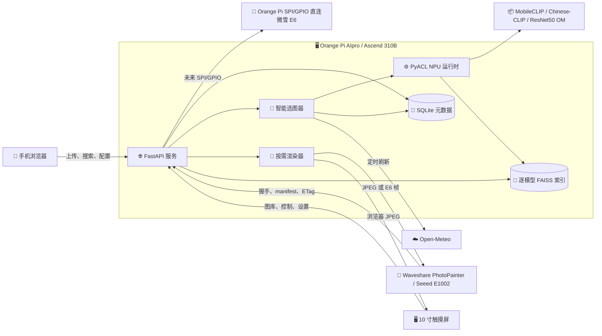
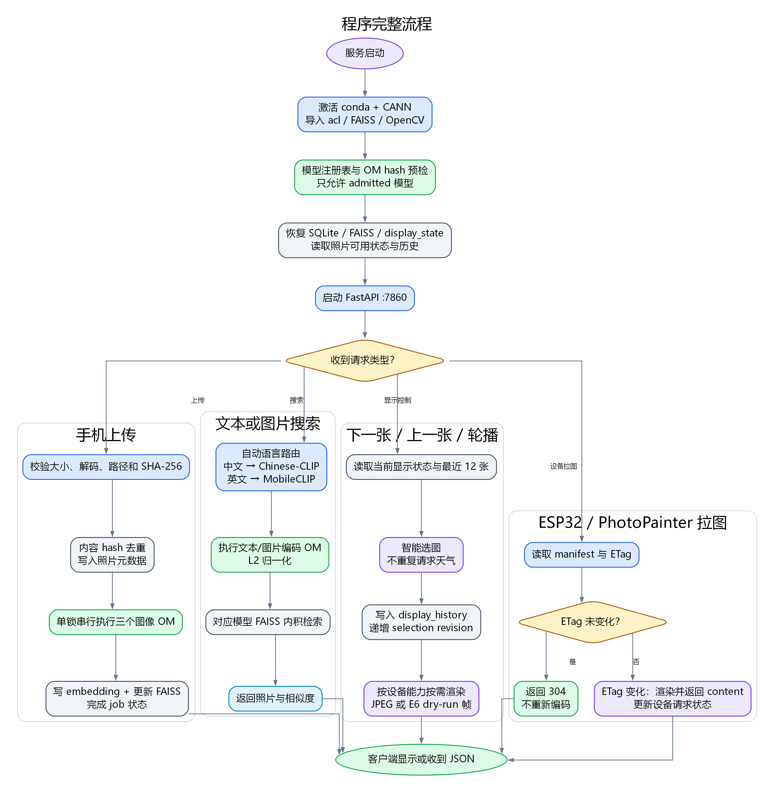
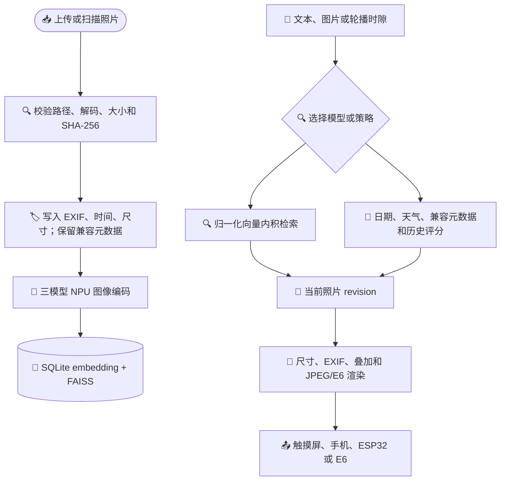
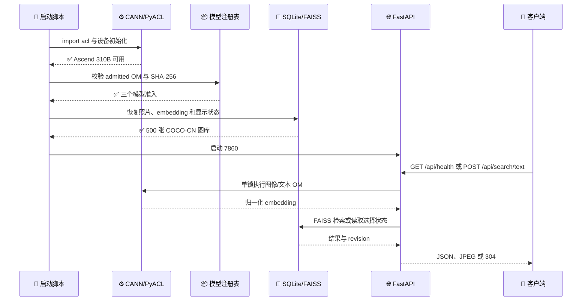
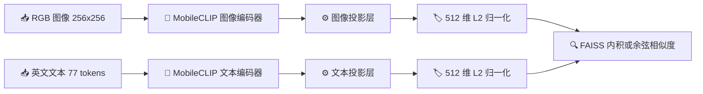
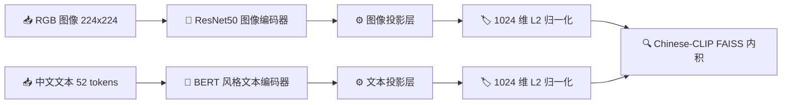
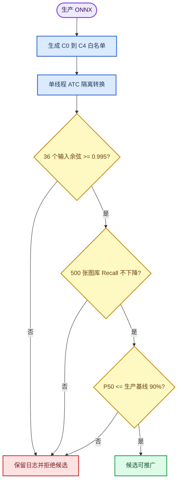

# 案例 7：智能相册

*本教程从问题建模、模型迁移、NPU 运行时、相册服务器到触摸屏和电子纸输出，完整解释 Case7 的设计与实现。*

---

## 🎯 案例目标与问题定义

传统电子相册只会按文件名或固定顺序轮播。Case7 要解决的是一个更完整的问题：照片由手机上传到局域网服务器，服务器在 Ascend 310B 上建立语义索引，再根据中文/英文查询、日期、天气和最近显示历史选择合适照片；同一份选择结果既服务开发板上的 10 寸触摸屏，也服务已登记的 Waveshare ESP32-S3-PhotoPainter 和 Seeed Studio reTerminal E1002 两类 ESP32 电子纸终端。当前已有的实机记录按设备分别标注，不能把一台设备的历史结果当作另一台已验收。Orange Pi 的 SPI/GPIO 直连微雪 E6 是独立的本机输出路径，不是第三种可注册 ESP32 相册。

因此，Case7 不是单独的“图片分类脚本”，而是一条端到端链路：

1. **照片进入**：手机上传或扫描目录，经过内容 hash、解码、尺寸和路径安全检查；
2. **照片理解**：NPU 图像编码器生成归一化 embedding，SQLite 保存元数据，FAISS 保存逐模型检索结构；
3. **照片选择**：中文/英文文本查询、相似图查询和日期/天气智能选图使用相应模型空间；
4. **照片显示**：FastAPI 静态页面、JPEG 设备接口和 E6 dry-run 使用同一个选择状态；
5. **设备协同**：ESP32 通过能力握手、manifest、ETag 和按需 content 获取照片。

生产服务只接受已准入的 Ascend OM，不回退 CPU/PyTorch 推理。CPU 负责图像解码、OpenCV Haar 人数计数、FAISS、JPEG/E6 准备和离线 ONNX 数值参考。

## 🏗️ 系统总体架构

下面的架构图展示手机、触摸屏和远程终端如何共享 310B 上的 FastAPI、索引和 NPU 资源。



### PDF 版结构图

下面两张图由 Graphviz DOT 源文件生成。Markdown 中保留 Mermaid 版本便于在线阅读，PNG 版本用于 VuePress/Pandoc 电子书排版；修改结构时先改 DOT，再重新生成 PNG。

{#fig:network_architecture width=92% .center}

*图 7-1 网络结构：手机、触摸屏和 PhotoPainter 通过 FastAPI 访问 SQLite/FAISS、Ascend 310B NPU、按需渲染器和天气服务。图源：`img7/network-architecture.dot`。*

{#fig:program_flow width=78% .center}

*图 7-2 程序流程：服务启动完成 CANN、模型 hash 和索引恢复后，分别处理上传、语义搜索、显示控制以及 ESP32/PhotoPainter 的 ETag 拉图请求。图源：`img7/program-flow.dot`。*

### 数据流



### 服务启动与请求时序



## 🧱 硬件与软件基础

| 层 | 组件 | 在本案例中的职责 |
| --- | --- | --- |
| 计算 | Orange Pi AIpro / Ascend 310B4 / 8T | 执行图像和文本 OM |
| 工具链 | CANN 8.x、ATC、PyACL | 转换、加载和执行模型；准入报告记录板端 `version.cfg` 的实际版本 |
| 服务 | FastAPI、Uvicorn、原生 HTML/CSS/JavaScript | 手机、触摸屏和设备 HTTP 接口 |
| 存储 | SQLite、faiss-cpu 1.7.4 | 元数据真源和逐模型向量检索 |
| 图像 | Pillow、OpenCV | 解码、EXIF、尺寸检查和 Haar 人数计数 |
| 显示 | QDtech MPI1001、PhotoPainter、微雪 E6 | 本机管理、六色终端和 E6 协议输出 |

310B 的 NPU 只负责已准入 OM 的推理。相册数据、FAISS 文件、设备状态和配置都留在板端；手机和 ESP32 只通过 HTTP 获取受控结果。

## 💾 核心数据模型

`photos` 保存原图生命周期，关键字段包括 `id`、`filepath`、`filename`、`sha256`、`size_bytes`、`mtime`、`available`、`width`、`height`、`mime_type`、`capture_time`、`capture_time_source`、`upload_time`、`tags`、`face_count` 和 `deleted_at`。普通上传原图位于系统用户的 `~/Pictures/ai-album/imports/`，临时 multipart 文件位于 `~/Pictures/ai-album/.upload-tmp/`；仓库 `shared/photos/` 仅承载 COCO-CN 和旧数据兼容读取，避免个人照片进入发布目录。其中 `tags` 只保留为旧数据库迁移兼容元数据；常规上传不要求或写入手工标签，当前工程也没有部署自动图像标注模型。

`embeddings` 使用 `(photo_id, model_id)` 作为主键，保存维度和归一化向量。每个模型有独立的 `IndexIDMap2(IndexFlatIP)`，FAISS 的 ID 就是 SQLite 的 `photo_id`，因此不会把不同模型空间混合。

`display_state` 和 `display_history` 保存本机触摸屏、两个 PhotoFrame profile 与本机 E6 输出的当前照片、暂停状态、时隙、策略 revision、selection revision 和最近 12 张历史。`jobs` 保存手机上传后的串行索引进度。

## 🧠 多模型语义检索方法

### CLIP 的共同向量空间

CLIP 使用图像编码器和文本编码器把两个模态投影到同一个向量空间。图像查询先编码成向量，文本查询也编码成向量，二者做 L2 归一化后使用内积近似余弦相似度。相似度高表示模型训练中认为图像和文本语义更接近。

Case7 不把三个模型的数值直接相加：不同训练数据、投影层和维度形成不同坐标空间。模型 ID 是索引隔离和 API 路由的边界。

### 参考实现与工程取舍

本案例参考了 Andy 的个人图像搜索实践和 `atarss/clip-image-search`。博客展示了一个很重要的工程事实：图片检索不是“把图片文件名交给搜索框”，而是先递归导入照片、提取图像向量和尺寸等元数据，再用归一化向量做相似度排序；同模态图像查询的分数通常高于跨模态文字查询，分数只能用于同一模型空间内排序，不能跨模型直接比较[^7]。上游仓库的实现把文件导入、CLIP 编码、元数据保存和查询服务拆成两个阶段，并在查询时先按 `width`、`height`、扩展名等字段过滤 MongoDB，再按批次计算余弦相似度[^8]。

Case7 保留这条数据流，但替换了不适合 310B 服务器的组件：

| 参考项目做法 | Case7 实现 | 取舍原因 |
| --- | --- | --- |
| OpenAI CLIP 常驻 PyTorch | 已准入 MobileCLIP/Chinese-CLIP OM，经 PyACL 串行执行 | NPU 是生产推理边界，CPU 不作 fallback |
| MongoDB 保存图片和向量 | SQLite 保存照片元数据与 embedding，FAISS 保存检索缓存 | 减少常驻服务，保留可审计的单文件真源 |
| 导入时可复制到 hash 目录 | 上传原图放在系统 `Pictures` 受管目录，SHA-256 去重 | 防止个人照片混入发布目录，原图生命周期可控 |
| 查询时拉取全部向量并分块计算 | 无筛选时使用每模型 `IndexIDMap2(IndexFlatIP)`；有筛选时先 SQLite 预筛选再计算候选内积 | 兼顾常用路径延迟和元数据过滤正确性 |
| 早期网页 Demo | 原生 FastAPI 与触摸屏/手机页面 | 当前服务同时支持本机显示和 ESP32，不依赖额外 UI 运行时 |
| OCR 作为后续实验 | 本版本不自动 OCR、不生成手工标签 | 不把未准入的 CPU 模型混入 NPU 相册主链路 |

因此，本案例借鉴的是可验证的检索分层和元数据预筛选思想，不复制 MongoDB 或未经准入的 OCR。`photo_index.py` 的 `search_vector()` 在带有尺寸、格式或人数条件时先构造候选集合，再进行归一化内积；没有条件时仍直接查询 FAISS。两条路径都返回相同的 `SearchResult` 合同，前端只需要消费照片 ID、文件名和分数。

> **边界：** 上游仓库的 README 将 FAISS、EXIF 和多语言列为 TODO；Case7 已经分别用 FAISS、SQLite/EXIF 和双语模型实现，但这不表示上游项目已经提供这些能力，也不表示两个项目的模型权重或分数可以互换。

### MobileCLIP-S0

MobileCLIP-S0 面向英文和通用语义，图像输入固定为 `1x3x256x256`，文本输入固定为 `1x77`，输出 embedding 为 512 维。图像和文本组件分别导出 ONNX，再分别转换成 OM。



### Chinese-CLIP RN50

Chinese-CLIP RN50 面向中文语义，图像输入固定为 `1x3x224x224`，文本输入固定为 `1x52`，输出 embedding 为 1024 维。文本 tokenizer 使用 BERT 风格的 `vocab.txt`、`[CLS]`、`[SEP]`、`[PAD]` 和 `[UNK]` 合同；tokenizer 的物理行读取规则必须和固定上游实现一致。



### ResNet50 经典相似图

ResNet50 输出 2048 维视觉特征，用于兼容传统“以图搜相似图”模式。它没有文本编码器，也不提供中文/英文语义能力。它必须使用独立 FAISS 文件，不能和任意 CLIP embedding 混合。


### 自动路由

文本自动模式检测中日韩字符时选择 Chinese-CLIP，否则选择 MobileCLIP；图片自动模式默认选择 MobileCLIP。用户手动指定模型时，服务检查模型已准入且查询输入合同正确。

## 🔧 昇腾 310B 模型迁移方法

模型迁移分为四个可审计阶段：

```text
checkpoint / tokenizer
        ↓ 离线导出
FP32 ONNX（固定 batch=1）
        ↓ 板端 ATC
Ascend310B4 mixed-FP16 OM
        ↓ PyACL / ACL
NPU embedding + FAISS 检索
```

导出阶段记录输入名称、shape、dtype、输出维度和 ONNX SHA-256。转换阶段使用 `--soc_version Ascend310B4` 和 `--precision_mode allow_fp32_to_fp16`。MobileCLIP 图像组件的当前生产 OM 已通过选择性精度扫描，使用 C0 的零节点 FP32 白名单；任何未来的例外仍必须写入 ATC 证据，而不能更换模型。

310B 板端内存有限，ATC 强制单线程：`MAX_COMPILE_CORE_NUMBER=1`、`TBE_PARALLEL_COMPILER=0`、`ASCENDC_PAR_COMPILE_JOB=0`、`TILINGKEY_PAR_COMPILE=0`、`OMP_NUM_THREADS=1` 和 `OPENBLAS_NUM_THREADS=1`。不添加 swap 或编译缓存，不开启并行图编译；转换器只在旧版确实提供该参数时选择 `--enable_graph_parallel=0`。CANN 8.x 的 `--ac_parallel_enable` 是动态 shape 执行阶段的 AI CPU/Core 并行选项，不等价于图编译开关，不能把它写成 ATC 并行门禁。

MobileCLIP 和 Chinese-CLIP 文本图目前登记为 `int64` 输入。这个类型是否能被目标 CANN 版本的 ONNX 到 ATC 链路接受，必须用板端最小文本图预检；若失败，应重新导出并验证 `int32` 合同，同时更新 tokenizer、ACL 输入检查、hash 和准入报告，而不是只改模型清单。

准入脚本先验证 ACL 初始化，再验证输入字节数、dtype、输出字节数、维度和有限值，最后比较 ONNX 与 OM 的归一化向量，余弦相似度门槛为 `0.995`。只有 `models/registry.json` 中 hash 一致且 `status=admitted` 的 OM 才会被服务加载。

### 目标 SoC 与运行时版本

MobileCLIP 的 OM 绑定 ATC 转换时指定的 `--soc_version`，不能默认跨不同 310B SoC 通用。当前服务只使用与目标板卡匹配、已完成准入的 OM。若更换板卡或 CANN 运行时，必须在新环境重新执行 ONNX 合同、ATC、ACL 数值和检索验证；未取得当前报告时，不在教程中写入旧板卡数字。

`npu-smi info` 用于记录板卡、驱动和固件字段；固件字段无法读取时原样记录，不从驱动版本推断。CANN Toolkit/ATC、板端 Runtime/PyACL、驱动和 NPU 固件必须按厂商兼容矩阵配套。版本升级应先查官方说明，再在隔离目录验证，不覆盖生产 OM、注册表或索引。

### 选择性 FP32/FP16 与误差定位

`allow_fp32_to_fp16` 是一种转换许可，不是“整张图强制 FP16”。图像浮点输入和 embedding 输出仍按
FP32 ONNX 合同处理；文本 token 输入是 `int64`。ATC 会在允许的节点上选择 FP16 实现，未被转换或被
`keep_dtype` 白名单保护的节点仍可沿用 FP32。这个区别很重要：MobileCLIP
图像分支当前生产 OM 的组件级策略是 `allow_fp32_to_fp16`，并已推广 C0 的零节点 FP32
白名单。推广前的 `must_keep_origin_dtype` OM 及其 `mobileclip_s0_image_keep_dtype.cfg` 仅保留为
诊断和候选节点清单。MobileCLIP 文本、Chinese-CLIP 两个分支和 ResNet50 图像分支使用模型级
`allow_fp32_to_fp16`。详细的命令、清单和证据字段见
[模型流水线与 NPU 准入](https://github.com/zhouxzh/Ascend310/blob/main/samples/case7/docs/05-models-and-npu.md)。

诊断的基本方法是比较同一输入在 ONNX 参考执行器和候选 OM 各中间输出的方向，而不是只看最终
embedding。现有诊断报告在 `network.4` 的加法节点记录余弦 `0.9994069`，在
`network.5/proj/proj.0/lkb_reparam/Conv` 记录 `0.7932538`；同一分组还出现 SE `Sigmoid`
`0.7223154`、主乘法 `0.2903332` 和 `proj.1` 卷积 `0.5836687`。另一次诊断的
`network.5/proj/proj.1/activation/Mul_1` 为 `0.2216825`，最终 embedding 为 `0.2551974`。
这些数字来自诊断图的单个输入，是误差传播线索而不是因果证明。一次整组件 `force_fp32` 候选也
记录了 `0.4368718` 的失败，因此“全部 FP32”并不能被当作自动修复。

选择性精度扫描按从小到大的白名单逐级验证：

| 候选 | FP32 保留范围 | 本次结果 |
| --- | --- | --- |
| `C0` | 空白名单 | 通过并推广为生产 OM |
| `C1` | `network.5/.../lkb_reparam/Conv` | 通过，因 C0 更快而未推广 |
| `C2` | `C1` 加 SE 的池化、两层卷积、激活、门控和乘法 | C0 已满足门槛，未执行 |
| `C3` | `C1` 加 GELU/`Erf`、主乘法链和 `proj.1` 卷积 | C0 已满足门槛，未执行 |
| `C4` | `C2 + C3`，再保护两组注意力 `MatMul`/`Softmax` 和 head `MatMul` | C0 已满足门槛，未执行 |

候选模型的流程如下。候选 OM、keep-dtype 文件和报告必须位于独立的
`reports/precision_sweep/mobileclip_s0_image_precision/<candidate>/` 目录，不能覆盖生产 OM、注册表、SQLite、FAISS 或既有
准入报告。



每个候选需要 32 张按 `image_id` 固定的 COCO-CN 图片和种子 `310` 至 `313` 生成的 4 张确定性
uint8 BGR 合成图；合成图也必须经过生产的 `NpuEmbeddingBackend.preprocess_image`，而不是直接把
标准正态张量送入模型。输出必须是 512 维有限向量，36 次归一化余弦全部达到 `0.995`。随后在临时
索引中重建 500 张图库，以同轮生产 OM 比较既有 20 条英文查询的 Recall@1/3/5；临时向量和索引在
报告完成后删除。最后在 `Ascend310B4` 板端以单线程、20 次预热、100 次计时、3 轮重复测量 P50/P95。

每次候选实验都必须把板卡型号、CANN 版本、ONNX/OM SHA-256、ATC 日志、36 个数值样本、
500 张图库 Recall@1/3/5 和三轮 P50/P95 写入独立报告。只有当前报告同时通过数值、检索和性能门槛，
候选才可以进入注册表；没有报告支撑的数字在教程中一律不预填。`Health: Alarm` 只作为诊断字段，
不能单独改变准入结论。候选实验的临时向量和索引在报告完成后删除。

## ⚙️ NPU 运行时与串行资源管理

`embedding_backend.py` 用一个 ACL 资源管理器拥有 device、context、stream 和 model。`ModelManager` 按需加载图像/文本 OM；切换模型前释放旧 model，避免多个大模型同时占用内存。获取模型、构造输入、执行和释放由同一把锁保护。

服务的索引任务、ATC 转换和单次 embedding 都是串行的。这样牺牲并发换取可预测的 NPU 内存峰值和板端稳定性。CPU/PyTorch 不作为生产 fallback，因为 fallback 会掩盖 OM 缺失、ACL 初始化失败或模型合同错误；这些错误必须直接返回并写入健康状态。

## 🌦️ 智能选图与天气方法

候选照片必须可用且未删除。默认总分为：

```text
总分 = 0.60 * Chinese-CLIP 语义相似度
     + 0.25 * 日期、月份、星期和时段匹配
     + 0.15 * 天气与兼容元数据匹配
```

照片时间优先 EXIF `DateTimeOriginal`，缺失时使用上传时间。天气默认来自 Open-Meteo；请求失败时保留最后有效状态。历史迁移照片若包含兼容 `tags`，可参与天气匹配；新上传照片不接受手工标签，缺少该元数据时该项得分为零。最近显示的 12 张照片进入重复抑制窗口，无匹配时回退到最新照片。

天气在后台按 `weather.refresh_seconds` 更新；`next`、`previous`、图库点选和相似图查询复用已有天气状态，不主动访问天气服务。服务器在空闲调度周期中用已准入 Chinese-CLIP 文本编码器查询语义空间，并把 FAISS 排序后的照片 ID 放入易失的内存候选队列；手动 `next` 消费这份 NPU 语义计划，因此不是按文件名绕过模型。队列因天气、配置、图库变化而失效或耗尽时，下一次操作会在缓存天气下补做一次串行 NPU 排序。这样连续点击不会重复请求天气或反复加载模型，同时每个候选顺序仍由 NPU 语义分数参与决定。触摸屏自动选图默认每 60 秒执行，普通电脑网页每 30 秒轮询显示元数据；网页比较 ETag，未变化时不重新下载 JPEG。电子纸物理刷新使用独立的 30 分钟周期，也可明确设置为 10 分钟，暂停相册会暂停这些自动动作。

手动切图的控制请求和图像显示是两个阶段：前者提交 NPU 预选队列中的照片 ID（冷队列时先完成一次 NPU 文本推理和 FAISS 排序），浏览器随后按实际视口请求一次性 JPEG。高分辨率原图的 EXIF 旋转、缩放和 JPEG 编码通常比温热队列的选择状态更新更耗时；服务器使用 `Image.draft` 作为当前 JPEG 解码的尺寸提示，但不写入缩略图或其他派生缓存。首页不预加载整个图库，图库面板打开后才创建网格，网格图片使用浏览器懒加载和异步解码，避免原图请求与主屏渲染争用板端资源。

`selection_revision` 在上传、天气变化、配置变化和轮播时隙到达时递增。每个 profile 的 current photo、pause 状态和 history 写入 SQLite，重启后恢复而不是重新随机选择。

## 🌐 服务器化设计

### 统一端口约定

Case7 的 310B 服务统一使用 `7860`：手机、10 寸触摸屏、ESP32 的 PhotoFrame 图片 URL、
`curl` 示例和教学部署命令均写作 `http://<BOARD_IP>:7860/`。这是普通用户进程可直接
监听的非特权端口，避免为了 80 端口修改 Linux 权限、CANN 环境或额外部署代理。

ESP32 与 310B 是两个不同的 HTTP 服务：ESP32 自身的控制页面为
`http://<ESP32-IP>/`，其默认端口是 80；310B 相册服务器仍为 7860。发布脚本可能短暂使用
一个仅回环可见的 smoke 端口验证候选版本，但该端口不写入设备、不出现在用户操作流程中。

### 上传任务状态机

手机的 `POST /api/photos/upload` 只负责接收和保存受管原图，然后返回 `job_id`。单线程任务依次完成解码、元数据写入、三模型 embedding 和 FAISS 更新；手机轮询 `/api/jobs/{job_id}` 获取 `queued`、`running`、`completed` 或 `failed`。

### 配置与显示状态

`GET/PATCH /api/config` 使用 revision 乐观锁和原子 JSON 写入。手机可以修改时区、轮播、天气坐标、重复抑制、JPEG 参数、E6 参数和文件名水印开关，但不能执行 shell、修改任意系统路径或改变 CANN 环境。显示控制 API 持久化 `select`、`next`、`previous`、`pause` 和 `resume`。

### ESP32 与 PhotoPainter

设备先发送显示能力，服务器返回 device ID、轮询周期和 manifest。后续以 ETag 条件请求 manifest/content；JPEG profile 按设备尺寸、方向和字节上限按需编码，E6 profile 输出固定 800x480、六色、192000-byte 帧。PhotoPainter profile 返回 bounded JPEG，由上游固件继续完成六色校准、抖动和电子纸刷新。

Case7 固定记录两种 7.3 英寸设备 profile：[Waveshare ESP32-S3-PhotoPainter 官方产品页](https://www.waveshare.com/product/displays/e-paper/epaper-1/esp32-s3-photopainter.htm) / [Wiki](https://www.waveshare.com/wiki/ESP32-S3-PhotoPainter) 为 E6 六色（黑、白、绿、蓝、红、黄）800x480；Wiki Mode 1 接受 800x480 或 480x800 图像，因此内容可标记为 `landscape` 或 `portrait`；其上游板级 profile 固定 `hardware_rotation_deg=180`。 [Seeed Studio reTerminal E1002 官方 Wiki](https://wiki.seeedstudio.com/getting_started_with_reterminal_e1002/) 为 ACeP / Spectra 6 全彩 800x480，Case7 将它固定为 `landscape`，板级补偿为 `0`。方向字段只允许 `landscape`、`portrait`，不提供用户可调的 360°、90°/270°或安装角度；服务器 JPEG `rotation` 保持 `0`，配对和 URL Rotation 同步时才把 profile 补偿写入固件的 `display_rotation_deg`。E1002 的 `portrait` 请求必须拒绝。Seeed 的资料只确认面板规格，横屏限制是本项目的设备策略；厂商资料不替代固件识别和真实面板刷新证据。

#### PhotoPainter 竖屏倒置的排查

`display_orientation` 表示逻辑内容方向，`display_rotation_deg` 表示板级物理坐标补偿。官方 v2.18.0
的 Waveshare 板级头文件将补偿定义为 180 度；若服务器把该字段错误地写成 0，竖屏画面会整体
上下倒置。Case7 不在 JPEG 上再次旋转，而是在注册和 `X-Config-Payload` 中发送固定补偿，并以
`X-Album-Hardware-Rotation` 回显。读取设备 `/api/config` 时应看到 Waveshare 的 `portrait`/`180` 或
`landscape`/`180` 组合；E1002 则为 `landscape`/`0`。这不是 NPU、EXIF 或图片内容错误，不能通过
增加 90/270 度用户选项解决。

新设备在管理 API 和低层握手 API 中都必须显式携带这两个 `profile_id` 之一，JPEG 能力固定为 `["jpeg"]`；服务不会因为 800x480、设备名称或 IP 地址相同而猜测型号。缺少 profile 的记录会被标记为待确认，仍可在管理页查看，但不能取图或推进轮播，直到操作者按实物型号完成确认。

当前 LAN 部署的设备注册和取图都是 URL-only：不生成、不显示、也不要求设备令牌。服务设置私有、重新验证缓存语义和 `Vary`，不把真实文件路径暴露给设备。禁用设备返回 `404`；访问边界依赖可信局域网和服务器端设备启停状态，而不是旧固件令牌。

### 从串口启动日志取得 PhotoPainter 的 IPv4 地址

设备网页地址由路由器 DHCP 分配，不能从设备名称、MAC 或旧的租约记录推断。实际操作时只连接当前
PhotoPainter，打开串口监视器并按一次 **BOOT** 唤醒，再按复位键观察完整启动过程：

```powershell
$idfPython = 'C:\Espressif\tools\python\v6.0.2\venv\Scripts\python.exe'
& $idfPython -m serial.tools.miniterm COM17 115200
```

日志中出现 `No WiFi credentials found - Starting AP mode` 表示设备还在临时配网 AP；连接形如
`PhotoFrame - XXXXX` 的 2.4 GHz AP 后配置家庭网络。配网成功必须同时看到 `sta ip: ...`、
`HTTP server started` 和 `Web interface available at: http://...`。保存完整串口日志，地址以本次
启动打印的 IPv4 为准：

```text
profile: waveshare_photopainter_73
serial: <SERIAL_PORT>
firmware: <FIRMWARE_VERSION>
sta ip: <ESP32_IP>
web: http://<ESP32_IP>/
```

在同一局域网电脑上用这个 IPv4 地址验证，而不是登录 `photoframe.local`：

```powershell
$photoIp = '<ESP32_IP>'
curl.exe --noproxy "*" "http://$photoIp/api/system-info"
curl.exe --noproxy "*" -I "http://$photoIp/"
```

`photoframe.local` 只是可选 mDNS 别名，Windows、VPN 或路由器不支持解析时仍属正常；它不是账号、
密码或必须的登录入口。310B 相册服务器地址使用 `<BOARD_IP>:7860`；旧租约记录不能代替当前串口日志中的
地址。每次重启、换路由器或重新配网后都要重新读取 `sta ip`。
完整的端口枚举、日志保存、DHCP 变化和故障排查步骤见仓库中的
[ESP32 电子相册设备管理](https://github.com/zhouxzh/Ascend310/blob/main/samples/case7/docs/04-esp32-device-management.md)。

### ESP32 深度休眠后的唤醒与 310B 发现

两类终端的“联网”“可发现”和“已配对”是三个独立状态。Waveshare
PhotoPainter 从深度休眠唤醒使用 **BOOT**，Seeed reTerminal E1002 使用顶部绿色
**Wake/Refresh**；醒来后先等待 Wi-Fi、HTTP 和 mDNS 服务恢复，再在 310B 上调用
`GET /api/admin/devices/discover`。该接口只查询 `_esp32-pframe._tcp`、读取每个候选的
`/api/system-info`，并保留字面 IPv4、硬件 ID、板型和固件版本供操作者选择。它不扫描网段，
也不能唤醒设备。深度休眠时 Wi-Fi、mDNS 和 HTTP 均关闭，310B 不存在可发送的网络唤醒包。

Case7 对这两类 ESP32 终端固定采用深度休眠：注册、策略更新和设备成功拉图时都写入
`deep_sleep_enabled=true`，前端不提供关闭或“调试常亮”选项。这样可以保持电池续航和实体
唤醒键的语义一致；重新刷写固件后重新注册会再次修复该配置。设备必须先由实体按键或固件
定时器唤醒，310B 才能发现并服务下一次 URL Rotation 请求。

发现为空时，可以在 310B 操作页面的 **设置 → ESP32 唤醒与发现** 中输入该地址并点击
**读取并验证 IP**；它调用只读 `POST /api/admin/devices/probe`。也可以从串口
`sta ip:` 或路由器 DHCP 租约取得当前 IPv4，直接读取 `http://<ESP32-IP>/api/system-info`；
只有 `project_name=esp32-photoframe`、`device_id`
和正确 profile 均核对后，才提交 `POST /api/admin/devices/register`。注册返回
`202/awaiting_pull` 只代表控制面配置完成；设备随后主动请求
`http://<BOARD_IP>:7860/api/devices/<device_id>/photoframe`，才算观察到真实拉图。
两台设备可能都显示 `photoframe.local`，因此不能按主机名或列表第一项自动配对。原厂
SenseCraft/Xiaozhi 固件若没有上述 API 或 mDNS 服务，必须先完成固件适配，不能仅凭外壳和
二维码判定兼容。可执行的逐步命令、故障表和证据模板见
[ESP32 电子相册设备管理](https://github.com/zhouxzh/Ascend310/blob/main/samples/case7/docs/04-esp32-device-management.md)。

E1002 的 MicroSD 兼容性由设备固件和硬件说明决定，不是 Case7 网络传输的前提。服务器不把 SD
卡作为照片缓存；存储卡异常与深度休眠策略是两个独立条件。

### 横竖屏图像方向

照片显示先执行 EXIF Orientation 校正，再应用设备 profile 的 `orientation`（`landscape` 或 `portrait`）。默认
`orientation_mode=auto` 保持照片本身的横竖构图，只将其按 `cover` 或 `fit` 放进目标画布；这是人像
照片的安全默认值。需要让最终编码帧严格匹配显示器横竖方向时，可启用
`orientation_mode=match_display`，服务会按 profile 选择 `landscape` 或 `portrait` 目标；E1002 的
`portrait` 请求直接拒绝，不通过隐式交换宽高放行。

设备可用 `X-Display-Width` 和 `X-Display-Height` 在**其已登记 profile 允许范围内**协商当前能力：
只有 PhotoPainter 可以使用 `480x800` 竖屏，E1002 的这类请求会拒绝；不可沿用旧的方向标签。JPEG 响应中的 `X-Album-Orientation` 是实际像素方向，
`X-Album-Target-Orientation` 是目标显示方向，因此 `auto` 模式下两者可以不同。尺寸、方向模式和安装
profile 的固定硬件补偿也会进入 JPEG variant/ETag，但不旋转 JPEG 像素：Waveshare PhotoPainter 为
`hardware_rotation_deg=180`，E1002 为 `0`，并分别写入固件的 `display_rotation_deg`。触摸屏
`display.*` 与 E6 `epaper.*` 的方向设置相互独立；E6 仍是固定
`800x480`、192000-byte 线协议，天气刷新或触摸屏方向变化不会让同一 E6 图帧失效并触发额外刷新。

## 🎨 触摸屏交互设计

触摸屏首页把照片作为第一视觉层，天气卡片和状态信息使用高对比度实体背景。五个首页动作收拢为一个紧凑工具栏；文件名作为同一工具栏内的非交互文本，设置页有“显示文件名水印”开关。8 秒无操作时工具栏和文件名一起淡出，触摸照片唤醒。

底部导航打开图库、智能搜索、上传、设备和设置五个全屏面板。按钮最小高度为 56px，图片网格固定宽高比；1920x1080、1280x800、1024x600 和 400x900 视口均禁止页面横向滚动。

如果开发板同时连接两个 HDMI 输出，X11 会把它们合成一个更宽的虚拟桌面；触摸设备若仍映射到整个桌面，会表现为照片页面没有偏移但点击位置向一侧偏离。Case7 的 kiosk 启动脚本在打开浏览器前将 `QDtech MPI1001` 映射到主输出 `HDMI-1`，并在重启或热插拔后重新执行。该输入映射属于显示会话配置，与网页 CSS、照片 EXIF 方向和 NPU 推理无关。

设备面板内部再按任务拆成四个互斥视图，而不是把本机屏幕、远端终端和配对表单连续堆叠在同一长页面：

- **总览**显示登记记录、型号确认、最近拉图和启用数量，并提供进入其他视图的快捷入口；
- **本机触摸屏**只管理开发板 HDMI 显示设备的轮播、方向和文件名水印；
- **已注册设备**按 Waveshare PhotoPainter、Seeed reTerminal E1002 和待确认型号分组，集中处理远端设备状态、策略、推进、启停和删除；
- **发现与配对**只负责唤醒后的局域网发现、IP 验证和身份登记。

标签使用 `tablist`/`tabpanel` 语义，同一时间仅激活一个视图；窄屏时标签排成两列，设备数量变化只更新标签副标题，不改变操作位置。这种分区使本机触摸屏成为可单独设置的设备，也避免把“发现候选设备”和“已经注册的设备”混为一谈。

## 🖨️ E6 图像处理方法

`epaper_display.py` 在 CPU 上执行：

1. 读取 EXIF 方向并旋转；
2. 将图像居中裁剪到 800x480；
3. 量化到 E6 六色调色板；
4. 使用官方稀疏颜色编号：黑 0、白 1、黄 2、红 3、保留黑 4、蓝 5、绿 6；
5. 两个像素按高半字节优先打包，输出 `800*480/2 = 192000` bytes；
6. dry-run 验证初始化、刷新、BUSY 和休眠命令序列。

真实硬件模式必须显式提供 SPI 设备、gpiochip 和 DC/RST/BUSY line offset。当前驱动板型号和接线尚未确认，PNG/帧 dry-run 只能证明协议编码，不能宣称微雪实屏刷新通过。PhotoPainter 六色路径同样不能由 E6 六色帧结果替代。

## 🗂️ 工程代码导读

| 模块 | 职责 |
| --- | --- |
| `app.py` | FastAPI 入口、上传、搜索、配置、显示和设备 API |
| `server_config.py` | 配置默认值、类型校验、revision 和原子写入 |
| `model_registry.py` | 候选清单、生产注册表、文件 hash 和准入状态 |
| `embedding_backend.py` | ACL 资源、固定输入输出合同、tokenizer 和模型切换锁 |
| `photo_index.py` | SQLite 元数据、旧索引迁移、逐模型 FAISS 和增量更新 |
| `smart_selector.py` | 日期、天气、兼容元数据、语义排序、时隙和显示历史 |
| `display_policy.py` | PhotoPainter 策略、cron、渲染、ETag 组成和 JPEG 限制 |
| `epaper_display.py` | E6 旋转、裁剪、量化、打包和 periphery 协议 |
| `web/` | 原生静态触摸屏/手机 UI，不需要额外前端构建运行时 |
| `scripts/` | 模型、COCO-CN、部署、服务、kiosk 和性能脚本 |

## 🧪 测试、性能与验收方法

测试把不同证据分开：

- 单元测试覆盖模型合同、ACL 模拟、索引隔离、上传安全、配置 revision、显示历史、设备握手/ETag 和 E6 帧；
- 模型准入覆盖 ONNX 合同、ATC 日志、OM hash、ACL 数值和有限值；
- COCO-CN 检索覆盖 20 条中文和 20 条英文查询，Recall@3 门槛均为 80%；
- 性能使用单线程、20 次预热、100 次计时、3 轮重复，报告图像/文本编码、FAISS 和 API P50/P95；
- UI 验收覆盖 1920x1080、1280x800、1024x600 和 400x900，无横向滚动、控件重叠或文字溢出；
- E6 dry-run 覆盖 EXIF、裁剪、六色、颜色编号、192000 bytes、BUSY 超时和无 GPIO 拒绝。

当前教程只定义验收协议，不预填具体 Recall、P50/P95、photo ID 或 hash。执行时把实际 JSON
报告路径、板卡/运行时版本、输入数量和结果写入 `samples/case7/reports/`，并在工程验证文档中
注明证据类型。模型准入、接口健康、触摸屏、设备 URL 拉图和 E6 dry-run 必须分别报告；其中
API 成功或 ACL 数值通过不能替代真实电子纸刷新结论。

## ⚠️ 限制、许可证与后续工作

- MobileCLIP 使用 Apple Machine Learning Research Model License，按清单中的非商业研究/教育边界使用；Chinese-CLIP 代码和权重许可应以固定上游仓库为准；ResNet50 使用 torchvision/ImageNet 研究教育资产。
- COCO-CN 是唯一公开测试集；图像来源于 COCO-CN/MS-COCO，使用时必须保留 manifest 的来源和许可证字段。
- Open-Meteo 是默认天气服务，网络失败时只能使用最后有效状态。
- PhotoPainter 使用上游 `v2.18.0` 固件；Case7 不维护自定义 ESP32 固件分支。
- 服务无管理员登录，只适合可信局域网，禁止公网暴露。
- 微雪 E6 驱动板型号和 GPIO/SPI 接线尚未确认，真实实屏刷新是独立后续验收。
- 通用 ESP-IDF 客户端需要具体 ESP32 变体、显示控制器、总线、GPIO、电源、Flash/PSRAM 和 IDF 版本后才能安全实现；当前先使用 HTTP 协议和上游 PhotoFrame。

## 📚 参考资料

- [Apple MobileCLIP](https://github.com/apple/ml-mobileclip)
- [OFA-Sys Chinese-CLIP](https://github.com/OFA-Sys/Chinese-CLIP)
- [COCO-CN 论文](https://arxiv.org/abs/1805.08661)
- [Waveshare E6 Python 驱动](https://github.com/waveshareteam/e-Paper/blob/master/RaspberryPi_JetsonNano/python/lib/waveshare_epd/epd7in3e.py)
- [Ascend samples](https://github.com/Ascend/samples)
- [ESP32 PhotoFrame](https://github.com/aitjcize/esp32-photoframe)
- [Andy：基于 CLIP 模型特征搭建简易的个人图像搜索引擎](https://andy9999678.me/blog/archives/239)
- [atarss/clip-image-search](https://github.com/atarss/clip-image-search)

[^1]: Apple. *ml-mobileclip*. https://github.com/apple/ml-mobileclip
[^2]: OFA-Sys. *Chinese-CLIP*. https://github.com/OFA-Sys/Chinese-CLIP
[^3]: Yuan, Y. et al. *Building a Large Scale Multimedia Dataset with Chinese Captions*. https://arxiv.org/abs/1805.08661
[^4]: Waveshare Team. *e-Paper*. https://github.com/waveshareteam/e-Paper
[^5]: Ascend. *samples*. https://github.com/Ascend/samples
[^6]: aitjcize. *esp32-photoframe*. https://github.com/aitjcize/esp32-photoframe
[^7]: Andy. *基于 CLIP 模型特征搭建简易的个人图像搜索引擎*. https://andy9999678.me/blog/archives/239
[^8]: atarss. *clip-image-search*. https://github.com/atarss/clip-image-search
