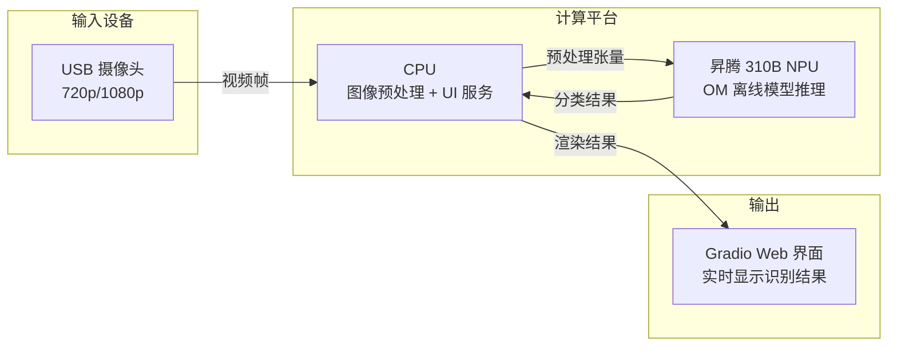
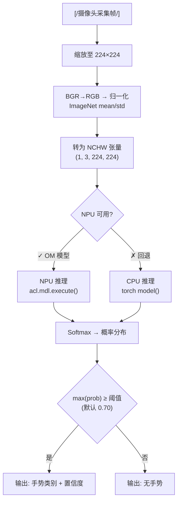
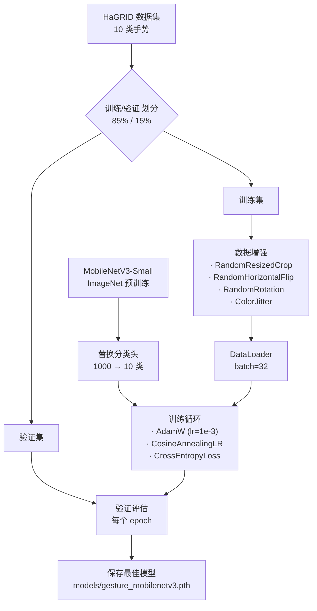
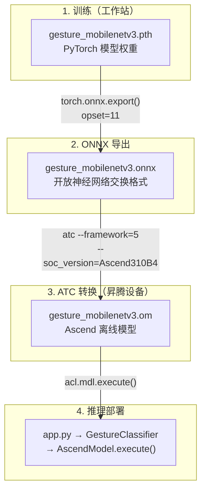
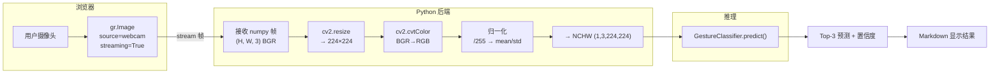
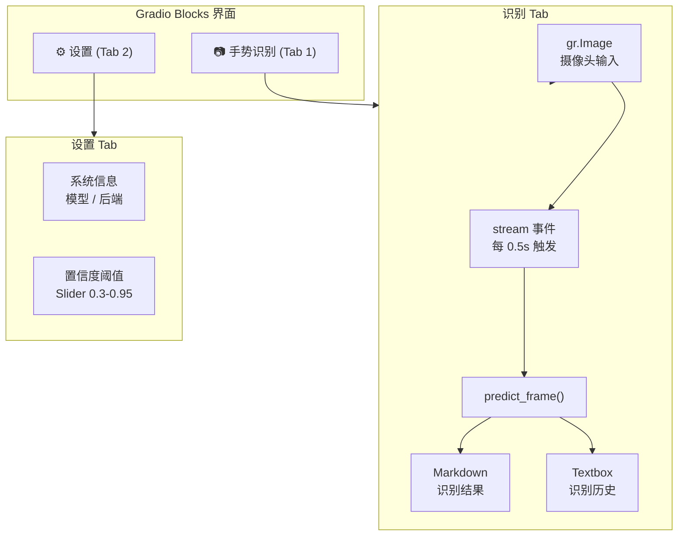
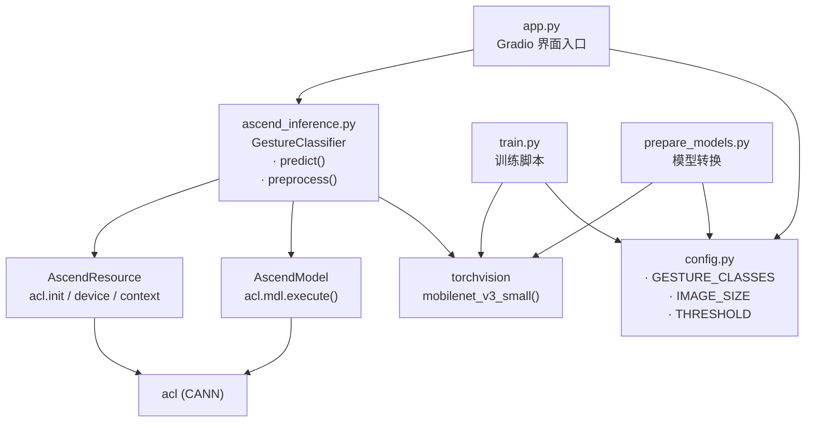

# 案例8：手势识别

## 1. 项目简介

本项目基于昇腾 310B 平台，构建一个实时手势识别系统，能够通过摄像头识
别 10 种常见静态手势。系统采用 MobileNetV3-Small 卷积神经网络，覆盖从
**模型训练 → ONNX 转换 → OM 部署 → 实时推理** 的完整边缘 AI 工作流。

与 case1（人脸识别）使用预训练模型不同，本项目是书中第一个完整演示
"训练-转换-部署"三阶段流程的案例，帮助读者理解在边缘设备上部署自定义
模型的完整链路。

### 手势列表（10 种）

| # | 手势 | 英文 | 可能用途 |
|---|------|------|----------|
| 0 | 👍 点赞 | like | 确认操作、好评 |
| 1 | 👎 不喜欢 | dislike | 取消操作、差评 |
| 2 | ✊ 握拳 | fist | 停止、关机 |
| 3 | ✋ 手掌 | palm | 暂停、停止 |
| 4 | ✌️ 剪刀手 | peace | 模式切换 |
| 5 | 👌 OK | ok | 确认、批准 |
| 6 | 🤘 摇滚 | rock | 特殊功能 |
| 7 | 📞 打电话 | call | 触发通话 |
| 8 | 🛑 停止 | stop | 急停 |
| 9 | 🫥 无手势 | no_gesture | 空闲状态 |

## 2. 内容大纲

### 2.1. 硬件准备

相比旧版 case8 中列出的多摄像头阵列、深度摄像头、红外补光等复杂设
备，本项目只需要：

- **昇腾 310B 开发者套件**：核心计算单元
- **USB 摄像头**：普通 720p/1080p USB 摄像头即可
- **显示屏**（可选）：用于显示识别结果

硬件架构如图所示：



为什么不需要深度摄像头？MobileNetV3 直接从 RGB 图像中学习手势特征，
单一 RGB 摄像头在正常光照下即可达到 90%+ 的识别准确率。深度摄像头会
增加硬件成本和部署复杂度，对于静态手势分类任务，收益有限。

### 2.2. 软件环境

#### 操作系统与框架

| 层级 | 软件 | 版本 | 用途 |
|------|------|------|------|
| 操作系统 | Ubuntu | 20.04 / 22.04 LTS | 运行环境 |
| CANN | Ascend Toolkit | 7.0+ | NPU 驱动与 ATC 转换工具 |
| Python | CPython | 3.8 ~ 3.10 | 应用开发语言 |
| 深度学习 | PyTorch + torchvision | 2.0+ | 模型训练 / CPU 推理 |
| 图像处理 | OpenCV | 4.8+ | 图像预处理 |
| Web | Gradio | 4.0+ | 聊天式 Web 界面 |

#### 环境准备

在昇腾 310B 设备上，运行一键安装脚本：

```bash
# 安装 Python 依赖并下载预训练模型
bash setup.sh
```

`setup.sh` 会依次完成：
1. 安装系统包（`python3-dev`, `python3-pip`）
2. 安装 Python 依赖（`pip3 install -r requirements.txt`）
3. 下载预训练模型并转换为 OM 格式

如果你希望在另一台有 GPU 的机器上自行训练模型，额外安装训练依赖：

```bash
pip3 install pillow tqdm
```

#### Python 依赖说明

| 包 | 用途 | 必需？ |
|:---|:---|:---|
| `gradio` | Web 界面框架，内置摄像头组件 (`gr.Image`) | ✓ |
| `torch` + `torchvision` | MobileNetV3 模型定义、CPU 推理回退 | ✓ |
| `opencv-python` | 图像缩放、色彩空间转换、归一化 | ✓ |
| `numpy` | 张量操作、softmax 计算 | ✓ |
| `Pillow` | 训练时的图像加载 | 仅训练 |
| `acl` (CANN 自带) | NPU 推理，随 CANN 安装 | 仅推理 |

`requirements.txt` 文件中已包含所有 Python 依赖，直接安装即可。`acl`
包无需手动安装，它随 CANN 一起部署，Python 通过 `import acl` 调用。

注意：`requirements.txt` 中包含在 WSL 开发机上不存在的包（如 `acl`）
是正常的——这些包只在昇腾设备上通过 CANN 提供。代码已做好检测，这些
包不可用时自动回退到 CPU 推理，不会报错。

### 2.3. 手势识别原理

#### 为什么选择 MobileNetV3-Small

昇腾 310B NPU 最适合运行固定输入输出形状的卷积神经网络。MobileNetV3
系列是专为移动和边缘设备设计的轻量级 CNN，其中 Small 版本只有 250 万
参数，在 310B 上单帧推理仅需 5-10ms，非常适合实时手势识别。

选择 MobileNetV3-Small 而不是其他模型的理由：

| 模型 | 参数量 | 310B 推理延迟 | 适合 OM 部署 | 备注 |
|------|--------|--------------|-------------|------|
| **MobileNetV3-Small** | 2.5M | ~5ms | ✓ | 推荐，轻量高速 |
| MobileNetV3-Large | 5.5M | ~10ms | ✓ | 精度略高但更慢 |
| ResNet18 | 11.7M | ~20ms | ✓ | 偏重，延迟边缘 |
| EfficientNet-B0 | 5.3M | ~12ms | ✓ | 也可用 |
| ViT-Tiny | 5.7M | ~15ms | △ | Transformer，转换复杂 |

#### 手势识别流程



#### 为什么不是 LSTM / 动态手势

旧版 case8 中使用了 LSTM 做动态手势识别。LSTM 涉及循环结构和变长输入，
这在 OM 离线模型（静态计算图）上难以高效运行——与 case9 中解释过的
"为什么不在 310B 上跑 LLM"是同一个原因。

如果需要识别动态手势（如挥手、画圈），更好的方案是：
1. 用 MediaPipe 在 CPU 上提取手部 21 个关键点坐标
2. 将连续 N 帧的关键点序列送入一个轻量 1D-CNN 或 MLP
3. 这个轻量分类器可以转 OM 在 NPU 上跑

这个折中方案利用了 CPU 做特征提取、NPU 做分类，适合 310B 的异构计算
特性。由于篇幅原因，本书仅实现静态手势识别，动态手势的扩展留给读者练
习。

### 2.4. 模型训练

训练在 GPU 或 CPU 工作站上完成，不占用昇腾设备。训练好的 `.pth` 权重
文件再拷贝到昇腾设备上进行转换和部署。

#### 数据集：HaGRID

[HaGRID](https://github.com/hukenovs/hagrid)（Hand Gesture Recognition
Image Dataset）是一个开源手势识别数据集，包含 18 类手势、超过 55 万张
标注图片。本项目选用其中 10 类常见手势。

下载数据集：

```bash
# 克隆 HaGRID 仓库（使用 Git LFS）
git lfs install
git clone https://github.com/hukenovs/hagrid.git data/hagrid
```

HaGRID 的目录结构为每类手势一个文件夹，`train.py` 会从对应文件夹读取
图片：

```text
data/hagrid/
├── call/          # 打电话手势图片
├── dislike/       # 不喜欢手势图片
├── fist/          # 握拳手势图片
├── like/          # 点赞手势图片
├── ok/            # OK 手势图片
├── palm/          # 手掌手势图片
├── peace/         # 剪刀手手势图片
├── rock/          # 摇滚手势图片
├── stop/          # 停止手势图片
└── no_gesture/    # 无手势 / 背景图片
```

#### 训练流程



#### 训练命令

```bash
# 完整训练（30 epochs，约 30 分钟 / GPU）
python3 train.py

# 快速验证（10 epochs）
python3 train.py --epochs 10

# 使用已有数据集目录
python3 train.py --data-dir /path/to/hagrid

# CPU 训练（速度较慢）
python3 train.py --no-cuda --batch-size 8 --epochs 10
```

训练完成后，最佳模型权重保存在 `models/gesture_mobilenetv3.pth`。

#### 关键训练参数

| 参数 | 默认值 | 说明 |
|------|--------|------|
| `--epochs` | 30 | 训练轮数，30 轮通常收敛 |
| `--batch-size` | 32 | GPU 可用 64-128，CPU 建议 8-16 |
| `--lr` | 1e-3 | AdamW 初始学习率 |
| `--data-dir` | data/hagrid | HaGRID 数据集路径 |

`train.py` 中使用的数据增强策略：

- **RandomResizedCrop**：随机裁剪缩放（0.7~1.0），模拟不同距离
- **RandomHorizontalFlip**：水平翻转，模拟左右手
- **RandomRotation(15°)**：小角度旋转，容忍手势倾斜
- **ColorJitter**：亮度、对比度、饱和度抖动，适应不同光照

### 2.5. 模型转换与昇腾部署

训练得到的 `.pth` 文件需要通过两次转换才能在 310B NPU 上运行。



#### 步骤 1：导出 ONNX

```bash
# 仅导出 ONNX（可在工作站上运行，不需要昇腾硬件）
python3 prepare_models.py --onnx-only
```

这一步会：
1. 加载训练好的 `models/gesture_mobilenetv3.pth` 权重
2. 构建 MobileNetV3-Small 模型结构
3. 用 `torch.onnx.export()` 导出为 ONNX 格式
4. 输入形状固定为 `(1, 3, 224, 224)`，与 OM 格式要求一致

关键代码见 [prepare_models.py](samples/case8/prepare_models.py) 中的
`export_onnx()` 函数。注意 `dynamic_axes={}` 参数——我们刻意禁用了
动态形状，确保与 ATC 转换兼容。

#### 步骤 2：ATC 转换 ONNX → OM

```bash
# 在昇腾设备上运行
python3 prepare_models.py
```

这一步调用 CANN 的 `atc` 工具：

```bash
atc --model=models/gesture_mobilenetv3.onnx \
    --framework=5 \
    --output=models/gesture_mobilenetv3 \
    --soc_version=Ascend310B4 \
    --input_format=NCHW \
    --input_shape=input:1,3,224,224
```

参数说明：

| 参数 | 值 | 说明 |
|------|-----|------|
| `--model` | ONNX 文件路径 | 输入的 ONNX 模型 |
| `--framework` | 5 | 5 = ONNX 格式 |
| `--output` | 输出路径 | 生成的 `.om` 文件路径 |
| `--soc_version` | Ascend310B4 | 芯片型号 |
| `--input_format` | NCHW | 输入数据排布格式 |
| `--input_shape` | input:1,3,224,224 | 固定输入形状 |

`soc_version` 可通过 `npu-smi info` 查看。如果你的设备显示不同的版本
号，请修改 `prepare_models.py` 中对应的值。

#### 跳过训练：使用预训练模型

如果你不想自己训练，可以下载预训练好的 `.pth` 文件：

```bash
python3 prepare_models.py --download
```

然后直接进入 ONNX → OM 转换。这大幅降低了上手门槛。

### 2.6. 实时摄像头采集

Gradio 的 `gr.Image` 组件内置了摄像头支持，选择 `source="webcam"` 即
可在浏览器中调用用户的摄像头。结合 `streaming=True` 参数，Gradio 会持
续将摄像头帧传给后端的预测函数。

摄像头采集和预处理的完整数据流：



图像预处理的关键步骤在 `GestureClassifier.preprocess()` 中实现：

1. **缩放**：`cv2.resize(image, (224, 224))` — 匹配模型输入尺寸
2. **色彩转换**：`cv2.cvtColor(image, cv2.COLOR_BGR2RGB)` — OpenCV 的
   BGR 格式转为 RGB
3. **归一化**：`(pixel / 255 - mean) / std` — 使用 ImageNet 统计值
4. **维度重排**：HWC → CHW → NCHW — 匹配模型要求的 NCHW 格式

### 2.7. Web 界面

本项目使用 Gradio 构建 Web 界面，通过 `gr.Image(source="webcam",
streaming=True)` 实现完全零前端代码的实时手势识别。



#### 关键 Gradio 事件流

1. **摄像头流式推理**：`camera_input.stream(predict_frame, ...)` 每
   0.5 秒触发一次，将最新帧传给后端推理
2. **设置面板**：置信度阈值滑块实时更新 `config.CONFIDENCE_THRESHOLD`，
   调整识别灵敏度
3. **系统信息**：页面加载时自动获取模型状态（NPU/CPU、模型路径、手势
   列表）

#### 界面布局

- **左栏（2/3 宽度）**：摄像头实时画面，`mirror_webcam=True` 镜像显示，
  符合用户直觉
- **右栏（1/3 宽度）**：识别结果（Markdown 渲染，含置信度进度条）+ 最
  近 10 次识别历史

#### 双后端切换

`GestureClassifier` 在初始化时自动检测 NPU 可用性：

```python
class GestureClassifier:
    def _init_backend(self):
        if os.path.exists(OM_MODEL_PATH):
            try:
                self._acl_resource = AscendResource()
                self._om_model = AscendModel(...)
                self.use_npu = True     # NPU 模式
                return
            except Exception:
                pass
        self._init_cpu_backend()        # CPU 回退
```

这意味着：
- 在昇腾 310B 上 → 自动使用 OM 模型，NPU 推理
- 在没有昇腾硬件的机器上 → 自动使用 PyTorch，CPU 推理
- 同一份代码，无需修改任何配置

### 2.8. 用户手册

#### 2.8.1 部署

1. 将项目代码拷贝到昇腾 310B 设备
2. 运行 `bash setup.sh` 安装依赖
3. 运行 `python3 prepare_models.py --download` 获取模型
4. （可选）运行 `python3 train.py` 训练自己的手势模型
5. 启动服务：`python3 app.py`
6. 浏览器打开 `http://<设备IP>:7860`

#### 2.8.2 使用

1. 在浏览器中授权摄像头权限
2. 将手放在摄像头前，做出标准手势
3. 观察右侧识别结果——置信度 >70% 显示绿色结果
4. 如果识别不准确：
   - 调整手势角度和距离
   - 检查光照是否充足
   - 在设置面板降低置信度阈值
   - 考虑用自己的手势数据重新训练

#### 2.8.3 添加自定义手势

1. 收集新手势的图片（每个新手势至少 200 张）
2. 放入 `data/hagrid/<new_gesture>/` 目录
3. 修改 `config.py` 中的 `GESTURE_CLASSES` 和 `HAGRID_GESTURES` 列表
4. 运行 `python3 train.py` 重新训练
5. 运行 `python3 prepare_models.py` 重新转换

#### 2.8.4 故障排除

| 问题 | 可能原因 | 解决方法 |
|------|---------|---------|
| 摄像头无画面 | 浏览器未授权 | 点击地址栏左侧的摄像头图标授权 |
| 一直显示"未检测到手势" | 阈值过高 | 在设置面板降低到 0.5 |
| 识别结果不准确 | 光照不足 / 手势不规范 | 改善光照，对准摄像头做清晰手势 |
| NPU 初始化失败 | CANN 环境未配置 | `source /usr/local/Ascend/ascend-toolkit/set_env.sh` |
| ATC 转换失败 | soc_version 不匹配 | `npu-smi info` 查看版本，修改 prepare_models.py |
| CPU 模式下"随机预测" | 未加载训练权重 | 先运行 `prepare_models.py --download` 或 `train.py` |

## 3. 源代码结构

```text
case8/
├── app.py                 # Gradio Web 界面入口
├── ascend_inference.py    # Ascend NPU 推理封装 + CPU 回退
├── config.py              # 配置常量（手势类、模型路径、阈值）
├── train.py               # HaGRID 模型训练脚本
├── prepare_models.py      # ONNX 导出 & ATC OM 转换
├── setup.sh               # 一键环境安装
├── requirements.txt       # Python 依赖列表
├── data/
│   └── gesture_labels.json  # 手势类别 ID → 中英文映射
├── models/                   # 模型文件目录 (.pth / .onnx / .om)
└── README.md                 # 快速开始指南
```

模块间的调用关系：



与之前案例的继承关系：

- `AscendResource` / `AscendModel` 沿用 case1 的同一套模式
- `config.py` 的结构与 case9 一致（集中管理常量）
- `app.py` 的 Gradio 模式与 case9 一致（`gr.Blocks` + lazy init）
- `prepare_models.py` 的 ONNX → ATC 流程与 case1 一致
- `train.py` 是本书第一个训练脚本，展示了数据加载、增强、训练循环的
  完整流程

## 4. 效果演示

### 预期效果

在正常室内光照条件下，系统对各手势的预期识别准确率：

| 手势 | 预期准确率 | 备注 |
|------|-----------|------|
| 👍 点赞 | 95%+ | 特征明显，角度鲁棒 |
| ✊ 握拳 | 93%+ | 手型独特 |
| ✋ 手掌 | 94%+ | 特征清晰 |
| ✌️ 剪刀手 | 92%+ | 需要明确伸出两指 |
| 👌 OK | 90%+ | 需要手指贴合 |
| 📞 打电话 | 88%+ | 手型类似握拳 |
| 👎 不喜欢 | 91%+ | 方向敏感 |
| 🤘 摇滚 | 87%+ | 需要明确伸出两指 |
| 🛑 停止 | 93%+ | 与手掌类似，需要上下文 |
| 🫥 无手势 | 90%+ | 背景多样性影响 |

### 性能指标

| 指标 | NPU (Ascend 310B) | CPU (PyTorch) |
|------|-------------------|---------------|
| 单帧推理延迟 | 5-8 ms | 15-30 ms |
| 端到端帧率 | ~60 fps | ~30 fps |
| 模型大小 (.om) | ~10 MB | N/A |
| 内存占用 | ~50 MB | ~200 MB |

### 浏览器中的效果

Gradio 界面在浏览器中的预期布局：

```
┌──────────────────────────────────────────────────┐
│  ✋ 手势识别系统                                  │
│  MobileNetV3-Small 实时手势分类                   │
├────────────────────┬─────────────────────────────┤
│  📷 手势识别        │  📊 识别结果                 │
│                    │                             │
│                    │  👍 点赞 (like)             │
│   [摄像头实时画面]   │  置信度: 94.3%              │
│                    │  ████████████████░░░        │
│                    │                             │
│                    │  - 手掌 (palm): 4.2%        │
│                    │  - OK (ok): 1.1%            │
│                    │                             │
│                    │  ⏱ 推理耗时: 6.2 ms         │
│                    │  🖥 推理后端: NPU            │
│                    ├─────────────────────────────┤
│                    │  📜 识别历史                  │
│                    │  1. 点赞 (94.3%)             │
│                    │  2. 点赞 (91.7%)             │
│                    │  3. 无手势 (85.2%)           │
├────────────────────┴─────────────────────────────┤
│  [📷 手势识别]  [⚙️ 设置]                         │
└──────────────────────────────────────────────────┘
```

### 如何验证系统正常工作

1. 打开浏览器访问 `http://127.0.0.1:7860`
2. 授权摄像头
3. 对着摄像头做出 👍 点赞手势
4. 观察右侧是否显示"点赞 (like)"且置信度 >80%
5. 切换到 ✊ 握拳，确认识别结果随之更新
6. 打开设置面板，将阈值调到 0.95，观察低置信度的预测被过滤
7. 在昇腾设备上，确认系统信息显示"NPU (Ascend 310B)"
