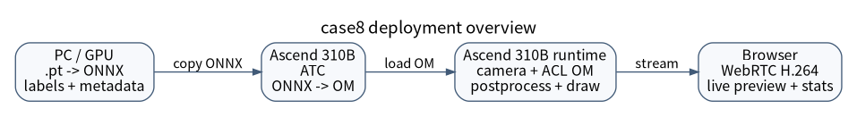
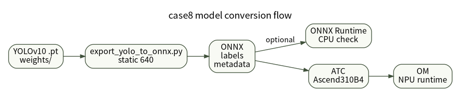
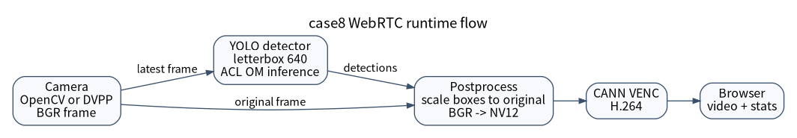

# 案例8：基于 HaGRID YOLOv10 的实时手势检测

## 1. 项目简介

本案例在昇腾310B上实现一个实时手势检测系统。系统从 USB 摄像头读取图
像，用 HaGRIDv2 提供的 YOLOv10 手势检测模型完成目标检测，再把检测框画
回原始画面，通过 WebRTC 推送到远程浏览器。整个流程覆盖了边缘视觉项目
中最常见的几件事：模型从 PyTorch 导出为 ONNX，使用 ATC 转换为 OM，通
过 AscendCL/PyACL 在 NPU 上推理，并把推理结果组织成可远程查看的实时视
频服务。

本案例采用目标检测路线，而不是只对裁剪后的单张手部图片做分类。YOLOv10
可以直接处理完整摄像头画面，同时输出手势类别、置信度和目标框坐标。本
章关注的核心问题是：如何在真实视频流中找到手势、把检测框正确画回原始
图像，并把结果稳定地推送到远程浏览器。

代码位于 `samples/case8`。其中 `hagrid_yolo` 是可复用 Python 包，保存预
处理、后处理和推理后端；`scripts` 保存命令行入口，包括 ONNX 验证、ATC
转换、OM 推理和 WebRTC 服务；`webrtc_app` 保存 CANN VENC、DVPP JPEGD
和 V4L2 采集相关适配代码；`web` 保存浏览器前端；`weights` 暂时保存
PyTorch 权重和导出脚本，后续可以单独迁移到模型仓库。

下方架构图说明了本案例的部署关系。PyTorch 到 ONNX 的导出建议在 PC 或
GPU 工作站完成；310B 侧负责 ATC 转换、OM 推理、摄像头采集和 WebRTC 推
流。图的 DOT 源文件位于 `src/experiment/img8/case8_system_arch.dot`。

{#fig:case8_system_arch width=85% .center}

图 1：case8 系统架构。

## 2. 实验环境

本案例只需要一块昇腾310B开发板和一个普通 USB 摄像头。摄像头最好支持
MJPG 输出，因为很多 UVC 摄像头在 YUYV 模式下无法以 1280x720 或
1920x1080 达到 30fps，而 MJPG 模式通常能提供更高帧率。显示器不是必需
的，远程浏览器可以直接查看 WebRTC 视频流。

310B 运行时需要 CANN、ATC、PyACL、OpenCV、aiortc 和 av 等组件。Python
运行依赖已经写在 `samples/case8/requirements.txt` 中，可以在 310B 的虚
拟环境里安装：

```bash
cd ~/Documents/Ascend310/samples/case8
pip install -r requirements.txt
```

`acl` 模块由 CANN 提供，不是 pip 安装的普通 Python 包。进入实验目录前通
常需要先加载 CANN 环境并激活 Python 虚拟环境：

```bash
source /usr/local/Ascend/ascend-toolkit/set_env.sh
conda activate npu
cd ~/Documents/Ascend310/samples/case8
```

本教程中的设备示例 hostname 为 `313`，虚拟环境名为 `npu`。如果你的开发
板名称或环境不同，只需要替换命令中的对应字段。

## 3. HaGRID 手势检测任务

手势识别可以做成分类任务，也可以做成检测任务。分类任务把已经裁剪好的
手部图像送入模型，输出一个类别，例如 `ok`、`stop` 或 `like`。这种方式
实现简单，但对输入画面要求较高：手需要占据主要区域，背景不能太复杂，
一旦出现多只手或手离摄像头较远，分类模型就很难判断。检测任务则直接接
收完整图像，输出一个或多个检测框，每个框都带有类别和置信度。对于摄像
头实时应用，检测任务更贴近实际场景，因为用户不会总是把手放在画面正中，
画面中也经常会出现身体、背景和多只手。

HaGRID 是 Hand Gesture Recognition Image Dataset 的缩写，是面向手势识
别系统的大规模 RGB 图像数据集。初版 HaGRID 发布于 2022 年，包含约
552,992 张 FullHD RGB 图像，覆盖 18 类手势，并提供 `no_gesture` 类来降
低误检。HaGRIDv2 进一步扩展到约 1,086,158 张 FullHD RGB 图像，包含
33 类手势和单独的 `no_gesture` 类，并按照 `user_id` 划分训练、验证和测
试集。这个划分方式很重要，因为它能减少同一个人同时出现在训练集和测试
集中的情况，更接近真实泛化能力评估。

HaGRIDv2 对边缘部署很有价值。它不是只在干净背景下拍摄单只手，而是包含
自然室内场景、不同光照、不同距离和不同人群。数据中的手势手和非手势手
也可能同时出现，这使得模型不仅要识别手势，还要学会避免把普通手部姿态
误判成命令手势。本案例直接使用 HaGRIDv2 官方提供的 YOLOv10 权重，把重
点放在部署、推理和实时视频优化，而不是重新训练数据集。

当前 `samples/case8/models` 中包含 `YOLOv10n_gestures`、
`YOLOv10x_gestures`、`YOLOv10n_hands` 和 `YOLOv10x_hands` 四组模型。
其中 `YOLOv10n_gestures` 是默认模型，标签数为 34，包含
`grabbing`、`call`、`dislike`、`fist`、`like`、`ok`、`palm`、`peace`、
`rock`、`stop`、`no_gesture` 等手势类别。`YOLOv10n` 和 `YOLOv10x` 的模
型输入都是 `1,3,640,640`，差异来自模型规模和计算量，而不是输入分辨率。
摄像头可以采集 640x480、1280x720 或 1920x1080，但进入模型前都会等比例
缩放并填充到 640x640。

表 1 汇总了四个已转换 OM 模型的实测结果。测试在主机 `313` 上执行，命令
如下：

```bash
python scripts/infer_om_camera.py \
  --benchmark-runs 80 \
  --warmup-runs 10 \
  --print-model-info
```

输入为脚本生成的全零张量，因此结果只代表 OM 后端推理耗时，不包含摄像
头采集、预处理、后处理、画框、颜色转换和 WebRTC 编码。

| 模型 | 类别数 | OM 大小 | 纯 OM 平均延迟 | 特点与建议 |
| :--- | ---: | ---: | ---: | :--- |
| `YOLOv10n_gestures` | 34 | 6.4 MB | 18.29 ms | 默认模型，速度最快，适合实时手势命令检测。 |
| `YOLOv10n_hands` | 34 | 6.4 MB | 18.41 ms | 标签集合与 `n_gestures` 相同，适合与默认模型对比误检和召回表现。 |
| `YOLOv10x_gestures` | 34 | 64 MB | 122.61 ms | 模型规模明显更大，适合离线精度对比，不适合每帧 30fps 推理。 |
| `YOLOv10x_hands` | 48 | 65 MB | 124.64 ms | 类别更多，包含若干左右手细分类；延迟最高，适合精度优先场景。 |

表 1：四个 HaGRID YOLOv10 OM 模型在 313 上的纯推理性能。

## 4. YOLOv10 与本案例模型

YOLOv10 是一种实时目标检测模型。YOLO 系列的基本思想是单阶段检测，也就
是一次前向计算同时预测目标框、置信度和类别。YOLOv10 论文进一步强调端
到端实时检测，使用 consistent dual assignments 进行 NMS-free 训练，并
从模型结构上减少冗余计算。对本案例来说，更需要理解的是导出后的部署形
式：模型接收固定大小的 NCHW 图像张量，输出检测结果，后处理再把检测框
映射回摄像头原图。

当前导出的模型输出可以理解为若干行检测结果，每一行至少包含
`[x1, y1, x2, y2, score, class_id]`。虽然 YOLOv10 论文强调 NMS-free，本
案例的 `postprocess.py` 仍然保留了一次 OpenCV NMS。这不是理论上的必要
步骤，而是工程兼容措施：不同导出版本可能产生略有差异的输出，保留 NMS
可以让教程代码在更换模型时更稳健。对当前 HaGRIDv2 YOLOv10 导出模型而
言，这一步不是主要性能瓶颈。

## 5. 模型导出与 ATC 转换

模型准备流程见下方流程图。图的 DOT 源文件保存在
`src/experiment/img8/case8_model_conversion.dot`。

{#fig:case8_model_conversion width=85% .center}

图 2：case8 模型转换流程。

PyTorch 权重到 ONNX 的导出不建议在 310B 上完成。这个步骤依赖 PyTorch、
Ultralytics 和 ONNX 工具，更适合放在 PC 或 GPU 工作站上。仓库中
`weights/export_yolo_to_onnx.py` 就是为这一步准备的，它跟随权重文件放在
`weights` 目录中，后续可以与样例代码仓库分离。

PC 或 GPU 工作站上的导出环境需要额外安装 PyTorch、Ultralytics 和 ONNX
工具。下面是一组已经验证过的依赖组合：

```bash
pip install numpy==1.26.4 onnx==1.14.1 onnxruntime==1.15.1 opencv-python==4.8.0.76
pip install torch==2.10.0 torchvision==0.25.0 --extra-index-url https://download.pytorch.org/whl/cu128
pip install ultralytics==8.4.60
```

导出 `YOLOv10n_gestures` 的命令如下：

```bash
cd samples/case8
python weights/export_yolo_to_onnx.py \
  --weights weights/YOLOv10n_gestures.pt \
  --output-dir models \
  --imgsz 640 \
  --batch 1 \
  --opset 13 \
  --device cpu
```

脚本会调用 Ultralytics 的 ONNX 导出接口，然后用 `onnx.checker` 检查模型
合法性，并写出标签文件和元数据文件。元数据文件记录输入名、输入形状、
输出名、类别名和导出参数。后面的 ATC 脚本会读取这些信息，因此不需要手
工猜测输入名是不是 `images`，也不容易把输入形状写错。

ONNX 可以先用 CPU 做一次功能验证。`scripts/infer_onnx_camera.py` 默认使
用 `models/YOLOv10n_gestures.onnx`，直接运行即可：

```bash
python scripts/infer_onnx_camera.py
```

如果通过 SSH 操作，没有图形界面，可以限制帧数并关闭 OpenCV 窗口：

```bash
python scripts/infer_onnx_camera.py --no-window --max-frames 30
```

ONNX 验收时应看到脚本正常打开摄像头，并在退出前打印类似下面的统计信
息：

```text
Processed 30 frames, ... inferences, camera FPS ..., inference FPS ..., avg ONNX latency ... ms
```

这个步骤只用于验证导出模型、标签和后处理流程，不代表最终性能。310B 的
CPU 跑 YOLOv10 会比较慢，尤其是 `YOLOv10x`。如果 ONNX Runtime 打印
`pthread_setaffinity_np failed`，通常是线程亲和性设置与当前系统 CPU 拓
扑不匹配。脚本已经默认设置了较保守的线程数，一般不影响模型功能验证。

在 310B 上转换 OM 时，先加载 CANN 环境，再运行：

```bash
SOC_VERSION=Ascend310B4 bash scripts/atc_convert.sh
```

当前 `scripts/atc_convert.sh` 默认会转换 `models` 目录下所有 `.onnx` 文
件。转换单个模型时，也可以传入 ONNX 路径和输出前缀：

```bash
SOC_VERSION=Ascend310B4 \
  bash scripts/atc_convert.sh models/YOLOv10n_gestures.onnx models/YOLOv10n_gestures
```

脚本最终调用的 ATC 命令核心参数如下：

```bash
atc \
  --framework=5 \
  --model=models/YOLOv10n_gestures.onnx \
  --output=models/YOLOv10n_gestures \
  --input_format=NCHW \
  --input_shape=images:1,3,640,640 \
  --soc_version=Ascend310B4
```

其中 `--framework=5` 表示输入模型是 ONNX，`--input_shape` 指定静态输入
形状。对 310B 这类边缘推理设备来说，静态形状更容易得到稳定性能，也更
容易定位问题。

ATC 成功时会输出：

```text
ATC run success, welcome to the next use.
```

转换完成后，`models` 目录下应出现同名 `.om` 文件，例如
`models/YOLOv10n_gestures.om`。如果转换脚本一次处理多个 ONNX 文件，每个
模型都会打印一次 `[ATC] model`、`[ATC] output` 和 `ATC run success`。

有时它还会伴随 W11001 性能警告，例如 `/model.23/Div_1` 和
`/model.23/Mod` 没有命中高优先级算子信息库。这不是转换失败。对 34 类
手势模型来说，检测头会把 TopK 得到的展平索引还原为候选框索引和类别
id。这个关系可以写成：

```text
flat_index = box_index * 34 + class_id
box_index  = flat_index // 34
class_id   = flat_index % 34
```

因此，`Div` 和 `Mod` 对应的是输出端的索引解码，而不是主干网络中的大卷
积计算。遇到这种警告时，应该先 benchmark 生成的 OM 模型，再决定是否需
要重新导出或简化模型图。

## 6. OM 推理与代码解析

OM 摄像头推理入口是 `scripts/infer_om_camera.py`。它的默认模型已经设置
为 `models/YOLOv10n_gestures.om`，所以在 310B 上可以直接运行：

```bash
python scripts/infer_om_camera.py
```

如果要指定摄像头分辨率和阈值，可以写成：

```bash
python scripts/infer_om_camera.py \
  --source /dev/video0 \
  --camera-width 1280 \
  --camera-height 720 \
  --camera-fps 30 \
  --conf 0.25 \
  --iou 0.45
```

纯模型 benchmark 不需要打开摄像头：

```bash
python scripts/infer_om_camera.py \
  --benchmark-runs 50 \
  --warmup-runs 5 \
  --print-model-info
```

OM benchmark 验收时应看到模型输入、输出和延迟统计。以
`YOLOv10n_gestures.om` 为例，313 上的实测输出如下：

```text
[ACL] input[0] size=4915200 shape=(1, 3, 640, 640)
[ACL] output[0] size=7200 shape=(1, 300, 6)
[OM] benchmark runs=80, avg=18.29 ms, min=18.20 ms, max=18.47 ms
[OM] output[0] shape=(1, 300, 6) dtype=float32
```

理解这段程序，关键是理解 `hagrid_yolo` 包内的三个文件：
`preprocess.py`、`detector.py` 和 `postprocess.py`。摄像头读到的原图可
能是 1280x720，而模型需要的是 640x640。直接拉伸会改变手的比例，因此代
码使用 letterbox：先按比例缩放，再用灰色边填充到正方形。`letterbox()`
不仅返回填充后的图像，还返回 `scale`、`pad_left` 和 `pad_top`，这些值
在后处理时会用来恢复坐标。

`preprocess_image()` 的输出是模型需要的 NCHW 张量。它先把 OpenCV 的 BGR
图像转成 RGB，再把 HWC 排布转为 CHW，最后转成 `float32` 并除以 255：

```python
padded, info = letterbox(image, imgsz)
rgb = cv2.cvtColor(padded, cv2.COLOR_BGR2RGB)
tensor = rgb.transpose(2, 0, 1).astype(np.float32) / 255.0
tensor = np.expand_dims(tensor, axis=0)
```

`detector.py` 把预处理、后端推理和后处理连接起来。代码中统计的
`latency_ms` 只包围 `backend.infer(tensor)`，所以它表示 OM 后端推理时
间，不包括预处理、后处理和线程调度：

```python
tensor, preprocess_info = preprocess_image(frame, self.imgsz)
start_t = time.time()
outputs = self.backend.infer(tensor)
latency_ms = (time.time() - start_t) * 1000.0
detections = decode_detections(outputs[0], frame.shape, preprocess_info, self.conf, self.iou)
```

后处理最容易出错的是坐标映射。模型输出的框坐标属于 letterbox 后的
640x640 图像；要画回原图，必须先减去 padding，再除以缩放比例：

```python
boxes[:, [0, 2]] = (boxes[:, [0, 2]] - preprocess_info.pad_left) / preprocess_info.scale
boxes[:, [1, 3]] = (boxes[:, [1, 3]] - preprocess_info.pad_top) / preprocess_info.scale
```

这也是为什么 WebRTC 推流中看到的是原始摄像头分辨率的画面，而不是
640x640 的模型输入。模型输入尺寸只决定推理张量大小；浏览器中的视频清
晰度主要由摄像头实际输出、H.264 码率和前端显示尺寸决定。

OM 推理后端在 `hagrid_yolo/backends/acl_backend.py` 中实现。`AclRuntime`
负责初始化 ACL、设置 device、创建 context 和 stream；`AclModel` 负责加
载 OM、创建输入输出 dataset、分配 device buffer，并在 `infer()` 中完成
host 到 device 的输入拷贝、`acl.mdl.execute` 执行和 device 到 host 的输
出拷贝。WebRTC 程序中 OM 推理、VENC 和 JPEGD 可能位于同一进程，因此代
码接受 `ACL_ALREADY_INITIALIZED=100002`，并在 WebRTC track 中使用
`finalize_on_release=False`，避免某个模块释放时全局 `acl.finalize()` 影
响其他硬件模块。

## 7. WebRTC 远程推流

本地 OpenCV 窗口适合调试，远程查看则需要一个面向实时视频的传输方式。
WebRTC 是浏览器原生支持的实时音视频协议，可以使用 H.264 编码，并通过
`RTCPeerConnection.getStats()` 观察接收端码率和帧率。本案例使用 aiortc
在 Python 服务端建立 PeerConnection，同时把 aiortc 默认的 H.264 编码器
替换为 Ascend CANN VENC，尽量减少 CPU 编码压力。

下方流程图是 WebRTC 程序的简化流程。DOT 源文件保存在
`src/experiment/img8/case8_webrtc_pipeline.dot`。

{#fig:case8_webrtc_pipeline width=85% .center}

图 3：case8 WebRTC 流水线。

启动服务只需要：

```bash
python scripts/webrtc_om_app.py
```

默认配置使用 `YOLOv10n_gestures.om`、`/dev/video0`、1280x720、30fps、
MJPG、4000 kbps H.264 码率、OpenCV 采集后端和每帧推理。服务启动后会打
印可访问地址，也可以直接在浏览器中打开：

```text
WebRTC H.264 app is starting. Open one of these URLs:
http://313:8080
```

前端会从 `/models` 获取 `models` 目录下的 OM 模型列表，从 `/health` 获
取默认参数和编码器状态，再通过 `/offer` 建立 WebRTC 连接。连接建立后，
前端定期读取 `/stats`，把 FPS、NPU 推理时间、总推理时间、采集格式、码
率和错误信息显示在页面右侧，而不是画到视频图像里。这样做的好处是视频
画面保持干净，性能信息也更容易复制和分析。

`scripts/webrtc_om_app.py` 中的 `YoloOmVideoTrack` 使用三个后台线程组织
实时流水线。采集线程不断读取摄像头帧，只保留最新帧；推理线程按
`infer_every_n` 取帧执行 YOLO 推理；渲染线程把最新检测结果画到最新原始
帧上，再把 BGR 转成 NV12。WebRTC 的 `recv()` 直接从最新 NV12 图像构造
PyAV `VideoFrame`：

```python
video_frame = av.VideoFrame.from_ndarray(frame, format="nv12")
```

VENC 接收 NV12 图像并输出 H.264 码流。这样可以减少 aiortc 内部的颜色空
间转换。如果 CANN VENC 可用，`/health` 中会看到
`"encoder": "cann-venc-h264"` 和 `"hardware_encode": true`；如果不可用，
程序会回退到 CPU libx264，也可以用 `--no-hardware-encode` 主动关闭硬件
编码。

WebRTC 验收时，浏览器应能打开视频页面并列出 `models` 目录下的 OM 模
型。命令行访问 `/health` 时，应看到类似下面的字段：

```text
"status": "ok"
"runtime_target": "ascend-310b"
"transport": "webrtc"
"video_codec": "h264"
"default_model": "YOLOv10n_gestures.om"
```

这个流水线有一个重要设计：队列长度很短，旧帧会被丢弃。实时视频系统追
求的是“最新画面”，不是“每一帧都处理完”。如果推理线程一时跟不上采集线
程，保留旧帧只会让画面延迟越来越大。因此本案例宁愿丢旧帧，也要保持远
程预览的实时性。

## 8. OpenCV 与 DVPP 采集后端

WebRTC 页面中可以选择 OpenCV 或 DVPP 采集后端。OpenCV 是默认路径，流
程是 `cv2.VideoCapture -> BGR -> 推理/画框 -> NV12 -> CANN VENC`。它的
优点是稳定、容易调试、兼容大多数 USB 摄像头。缺点是 MJPEG 解码通常由
CPU/OpenCV 完成，如果摄像头实际落到 YUYV 高分辨率模式，采集帧率可能明
显下降。

DVPP 后端的思路是绕过 OpenCV 的部分开销，直接用 V4L2 读取 MJPEG，再通
过 DVPP JPEGD 解码成 NV12。当前流程仍然需要把 NV12 转为 BGR 做推理和
画框，然后再转回 NV12 交给 VENC，因此它还不是全链路零拷贝。它的优势是
可能降低 MJPEG 解码的 CPU 压力，适合高分辨率 MJPG 摄像头；限制是对摄
像头格式、JPEG bitstream 和 DVPP 初始化更敏感。当前代码选择 `dvpp` 后
不会静默回退 OpenCV，如果 V4L2 MJPEG 或 JPEGD 失败，`/offer` 会返回明
确错误，前端日志也会显示对应信息。

调试采集性能时，首先应该确认摄像头真实支持哪些模式：

```bash
v4l2-ctl --device=/dev/video0 --list-formats-ext
```

如果同一摄像头显示 YUYV 1280x720 只能到 10fps，而 MJPG 1280x720 可以
到 30fps，就应该优先请求 MJPG。程序里设置了宽高和帧率，并不代表摄像头
一定按这个模式工作，最终还要看 `/stats` 里的 `actual_fourcc` 和
`capture_fps`。

## 9. 性能分析与优化

实时系统的帧率由最慢环节决定。看到远程 FPS 低时，不应该只看 NPU 推理
时间。一次完整远程显示至少经过采集、预处理、OM 推理、后处理、画框、颜
色转换、H.264 编码、网络传输和浏览器解码。NPU 推理时间只有 20ms，并不
意味着端到端一定能达到 50fps。

本案例把关键指标拆开放在 `/stats` 中。`capture_fps` 表示摄像头采集速
度，`infer_fps` 表示推理线程实际运行速度，`track_fps` 表示 WebRTC track
实际送帧速度，`npu_latency_ms` 表示 OM 后端推理时间，`infer_total_ms`
表示包含预处理和后处理的完整推理线程耗时，`nv12_ms` 表示 BGR 转 NV12
耗时。只有把这些指标分开看，才能判断瓶颈在摄像头、模型、颜色转换、编
码还是网络。

在 313 上的参考测试中，`YOLOv10n_gestures.om`、1280x720、MJPG、CANN
VENC、OpenCV 后端、`infer_every_n=1` 时，WebRTC 大约可以达到 27fps，
NPU 推理时间约 24ms，完整推理线程耗时约 30ms。把 `infer_every_n` 改为
2 后，视频可以接近 30fps，但检测结果每两帧更新一次，推理线程约 15fps。
这组数字只能作为基线，不同摄像头、CANN 版本和浏览器环境都会改变结果。

四个模型的纯 OM benchmark 显示，`YOLOv10x` 的单次推理约为
`YOLOv10n` 的 6.7 倍。实时 WebRTC 场景中还要叠加预处理、后处理、画框和
编码，因此默认使用 `YOLOv10n_gestures` 更稳妥。如果需要比较 `x` 模型的
识别效果，建议先在本地窗口或低帧率 WebRTC 配置中测试，并把
`infer_every_n` 调大，避免远程画面堆积延迟。

优化时建议先使用 `YOLOv10n`，不要一开始就用 `YOLOv10x`。两者输入同样
是 640x640，但 `YOLOv10x` 计算量大得多。然后确认摄像头实际输出是否为
MJPG，以及 `capture_fps` 是否已经达到目标帧率。如果采集只有 15fps，后
面的推理和编码再快也无法得到 30fps。采集正常后，再观察
`infer_total_ms` 和 `nv12_ms`。如果推理接近 33ms，`infer_every_n=1` 就
很难稳定超过 30fps；如果只是远程画面模糊，可以提高 H.264 码率，当前默
认值是 4000 kbps。

## 10. 完整实验流程

在 PC 或 GPU 工作站上，先导出 ONNX、标签和元数据：

```bash
cd samples/case8
pip install numpy==1.26.4 onnx==1.14.1 onnxruntime==1.15.1 opencv-python==4.8.0.76
pip install torch==2.10.0 torchvision==0.25.0 --extra-index-url https://download.pytorch.org/whl/cu128
pip install ultralytics==8.4.60
python weights/export_yolo_to_onnx.py \
  --weights weights/YOLOv10n_gestures.pt \
  --output-dir models \
  --imgsz 640 \
  --batch 1 \
  --opset 13 \
  --device cpu
```

然后把 `samples/case8` 同步到 310B，在设备上加载 CANN 环境并转换 OM：

```bash
cd /path/to/Ascend310
rsync -av samples/case8/ 313:~/Documents/Ascend310/samples/case8/
ssh 313
conda activate npu
source /usr/local/Ascend/ascend-toolkit/set_env.sh
cd ~/Documents/Ascend310/samples/case8
pip install -r requirements.txt
SOC_VERSION=Ascend310B4 bash scripts/atc_convert.sh
```

转换完成后，先做 OM benchmark：

```bash
python scripts/infer_om_camera.py \
  --benchmark-runs 50 \
  --warmup-runs 5 \
  --print-model-info
```

验收标准是模型能够加载，并打印输入形状 `1,3,640,640`、输出形状
`1,300,6` 和平均推理耗时。`YOLOv10n_gestures.om` 在 313 上的纯 OM 平均
延迟约为 18.29ms。

如果模型能正常加载，再做摄像头本地测试：

```bash
python scripts/infer_om_camera.py \
  --source /dev/video0 \
  --camera-width 1280 \
  --camera-height 720 \
  --camera-fps 30
```

如果通过 SSH 测试摄像头，可以先运行无窗口版本：

```bash
python scripts/infer_om_camera.py \
  --source /dev/video0 \
  --camera-width 1280 \
  --camera-height 720 \
  --camera-fps 30 \
  --no-window \
  --max-frames 60
```

验收标准是脚本结束时打印 `Processed 60 frames`，并给出 camera FPS、
inference FPS 和平均 NPU latency。

最后启动 WebRTC 服务：

```bash
python scripts/webrtc_om_app.py
```

浏览器打开 `http://313:8080`。如果需要确认服务端状态，可以访问：

```bash
curl http://313:8080/health
curl http://313:8080/stats
```

正常情况下，`/health` 中应能看到运行目标为 `ascend-310b`，传输方式为
`webrtc`，视频编码为 `h264`。如果 CANN VENC 已经启用，编码器字段会显示
`cann-venc-h264`。`/models` 中应至少列出
`YOLOv10n_gestures.om`、`YOLOv10n_hands.om`、`YOLOv10x_gestures.om` 和
`YOLOv10x_hands.om`。

## 11. 常见问题

如果 ATC 报 `--host_env_os linux is invalid`，说明旧命令中传入了当前
CANN/OPP 组合不接受的参数。当前 `scripts/atc_convert.sh` 已经不再设置
`--host_env_os`，只保留 ONNX 转 OM 需要的核心参数。

如果 ATC 成功但出现 W11001，先不要急着改模型。只要已经输出
`ATC run success`，就先运行 OM benchmark。`/model.23/Div_1` 和
`/model.23/Mod` 是检测头末尾的索引解码，通常不是主要耗时。

如果 ONNX Runtime 打印 `pthread_setaffinity_np failed`，通常不是模型错
误，而是线程亲和性设置与系统 CPU 拓扑不匹配。脚本已经提供
`--intra-op-threads` 和 `--inter-op-threads` 参数，可以显式限制线程数。

如果 WebRTC 端口被占用，可以换端口启动：

```bash
python scripts/webrtc_om_app.py --port 8081
```

如果选择 DVPP 后端后没有画面，要看前端日志和服务端日志。当前实现不会
静默回退 OpenCV。常见关键字包括 `Using direct V4L2 MJPEG capture backend
for DVPP`、`DVPP JPEGD decode frame`、`jpeg_get_image_info failed` 和
`jpeg_decode_async failed`。

如果本地显示器能到 30fps，远程浏览器只有个位数 FPS，瓶颈通常不在模型
推理本身，而在推流链路。需要同时观察 `track_fps`、浏览器 getStats 中的
码率、服务端 `nv12_ms` 和编码器状态。

## 12. 维护建议

为了让本案例长期适合作为教程使用，代码结构应保持清晰。可复用逻辑放在
`hagrid_yolo` 包内，脚本只作为入口；`.pt -> ONNX` 导出脚本继续留在
`weights`，便于后续随权重一起迁移；310B 运行时不要依赖 PyTorch；模型、
标签和元数据文件保持同名，例如 `YOLOv10n_gestures.om`、
`YOLOv10n_gestures_labels.txt` 和 `YOLOv10n_gestures_metadata.json`。每
次新增模型时，都应该先做 ONNX 功能验证，再做 ATC 转换和 OM benchmark。
涉及 CANN、ATC、OM、DVPP 的行为必须在真实 310B 上验证，本地文档环境只
能做代码编辑、图生成和 Markdown 检查。

## 13. 参考资料

1. HaGRID 官方仓库：
   [https://github.com/hukenovs/hagrid](https://github.com/hukenovs/hagrid)
2. HaGRID 初版论文：
   [https://arxiv.org/abs/2206.08219](https://arxiv.org/abs/2206.08219)
3. HaGRIDv2 论文：
   [https://arxiv.org/abs/2412.01508](https://arxiv.org/abs/2412.01508)
4. YOLOv10 论文：
   [https://arxiv.org/abs/2405.14458](https://arxiv.org/abs/2405.14458)
5. YOLOv10 官方实现：
   [https://github.com/THU-MIG/yolov10](https://github.com/THU-MIG/yolov10)
6. Ultralytics YOLO 模型导出文档：
   [https://docs.ultralytics.com/modes/export/](https://docs.ultralytics.com/modes/export/)
7. ONNX 官方仓库：
   [https://github.com/onnx/onnx](https://github.com/onnx/onnx)
8. ONNX Runtime Python API：
   [https://onnxruntime.ai/docs/api/python/api_summary.html](https://onnxruntime.ai/docs/api/python/api_summary.html)
9. 华为昇腾 CANN 文档入口：
   [https://www.hiascend.com/document](https://www.hiascend.com/document)
10. aiortc 文档：
    [https://aiortc.readthedocs.io/en/latest/](https://aiortc.readthedocs.io/en/latest/)
11. aiortc GitHub 仓库：
    [https://github.com/aiortc/aiortc](https://github.com/aiortc/aiortc)
12. W3C WebRTC 规范：
    [https://www.w3.org/TR/webrtc/](https://www.w3.org/TR/webrtc/)
13. Graphviz DOT 语言：
    [https://graphviz.org/doc/info/lang.html](https://graphviz.org/doc/info/lang.html)
