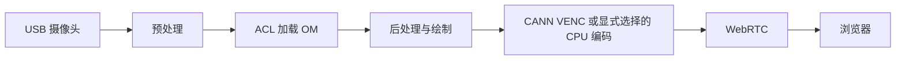

# 案例 8：实时手势识别

## 项目简介

本案例在昇腾 310B 上实现实时手势识别。系统从 USB 摄像头读取视频，使用
HaGRID YOLOv10 模型在 NPU 上完成目标检测，把检测框和标签绘制到原始画面，
再使用 H.264/WebRTC 将结果发送到浏览器。

案例代码位于 `samples/case8`。其中 `hagrid_yolo` 保存模型预处理、推理后端
和后处理，`webrtc_app` 保存摄像头、DVPP 和 CANN VENC 适配，`scripts` 保存
模型转换、OM 推理和 WebRTC 服务入口，`web` 保存浏览器页面。

完整的工程说明位于 `samples/case8/docs/`：

- `docs/README.md`：工程文档入口；
- `docs/01-project-design.md`：项目设计；
- `docs/02-program-analysis.md`：程序解析；
- `docs/03-model-dataset-and-conversion.md`：模型、数据集与转换；
- `docs/04-deployment-and-testing.md`：部署与测试；
- `docs/05-known-issues-and-version-compatibility.md`：问题与版本兼容性。

## 学习目标

完成本案例后，你应能够：

- 说明 HaGRID 手势检测任务和 YOLOv10 输出含义；
- 将 PyTorch 权重导出为 ONNX，并使用 ATC 转换为 Ascend OM；
- 使用 PyACL 加载 OM，完成摄像头帧的预处理、推理和后处理；
- 解释 NV12、CANN VENC、CPU `libx264` 和 WebRTC 的关系；
- 在开发板上完成 OM 冒烟、摄像头测试和远程 WebRTC 验收。

## 摄像头权限

官方昇腾 310B 系统通常将摄像头设备设置为 `root:video`、`0660`。如果使用
`HwHiAiUser` 启动 case8，该用户必须属于 `video` 组，否则 WebRTC 会报告
`Cannot open video source: /dev/video0`，即使设备列表中能看到 `/dev/video0`。

使用 root 或具有用户管理权限的账户执行：

```bash
sudo usermod -aG video HwHiAiUser
```

执行后退出当前 SSH 会话并重新登录。官方 Atlas 开发板的实际验证还要求随后
拔下并重新插入 USB 摄像头，使 UVC 设备重新初始化；否则即使用户组已经更新，
旧设备会话也可能导致首帧等待超时。重新插拔后再检查：

```bash
id HwHiAiUser
ls -l /dev/video0 /dev/video1
```

`id` 输出中应包含 `video`。`/dev/video0` 通常是真实的视频采集节点，
`/dev/video1` 可能是 UVC metadata 节点，case8 应使用 `/dev/video0`。不要
使用 `chmod 666` 代替用户组配置。

## 官方 Atlas 开发板验证

目前的 case8 已在官方 Huawei Atlas 开发板上完成端到端验证。此次验证的板端
软件栈为：`npu-smi` 产品标识 `Atlas 200I A2`、芯片 Ascend 310B4；Ubuntu
22.04.5 LTS；内核
`6.6.0-72.0.0.76.h914.eulerosv2r15.ascend.aarch64`；固件
`7.8.0.5.216`；驱动包 `25.5.0`（内部版本
`V100R001C23SPC005B219`）；CANN `9.2.0-beta.2`；`npu-smi` `25.5.0`。
板端没有单独暴露可核对的 `HDK` 版本字段，因此这里记录实际可查询的固件、
驱动和 CANN 版本，不把其中任何一个版本冒充 HDK 版本。

完成 `HwHiAiUser` 加入 `video` 组、重新登录并重新插拔摄像头后，程序可以从
`/dev/video0` 采集 MJPG，使用 NPU 执行 OM 推理，使用 CANN VENC 进行 H.264
硬件编码，并通过 WebRTC 连续推流到浏览器。这是当前官方 Atlas 平台上的
`observed-pass` 结果；CANN VENC 失败时仍保持明确报错并停止，不自动回退到
CPU 编码。

## 系统流程


```mermaid
flowchart LR
    accTitle: 实时手势识别流程
    accDescr: 摄像头图像经过预处理和 OM 推理，检测结果绘制回原图后编码为 H.264，通过 WebRTC 发送到浏览器。
    cam[USB 摄像头] --> pre[预处理]
    pre --> om[ACL 加载 OM]
    om --> post[后处理与绘制]
    post --> enc[CANN VENC 或显式选择的 CPU 编码]
    enc --> rtc[WebRTC]
    rtc --> browser[浏览器]
```

原始画面可以是 1280x720 等采集尺寸，但模型输入固定为静态
`1x3x640x640`。程序使用 letterbox 保持宽高比，再转成 RGB、NCHW 和
归一化张量。推理输出经过置信度过滤、坐标恢复和 NMS 后绘制回原图。

## 模型与数据集

本案例使用 HaGRID 提供的 YOLOv10 手势检测权重，不在开发板上训练模型。
导出脚本同时生成 ONNX、标签文件和元数据；ATC 在目标 Ascend 310B 上生成
OM。模型输入尺寸、输入名称和类别顺序以元数据及 OM 描述为准，不能在网页
中动态修改模型输入尺寸。

模型导出示例：

```bash
cd samples/case8
python weights/export_yolo_to_onnx.py \
  --weights weights/YOLOv10n_gestures.pt \
  --output-dir models --imgsz 640 --batch 1 --opset 13 --device cpu
```

开发板转换示例：

```bash
cd /home/HwHiAiUser/Documents/case8
source /usr/local/Ascend/ascend-toolkit/set_env.sh
SOC_VERSION=Ascend310B4 bash scripts/atc_convert.sh
```

## OM 推理

模型转换成功后，先执行不接摄像头的 benchmark：

```bash
python scripts/infer_om_camera.py \
  --benchmark-runs 20 --warmup-runs 5 --print-model-info
```

再执行摄像头推理：

```bash
python scripts/infer_om_camera.py \
  --source /dev/video0 --camera-width 1280 --camera-height 720 \
  --camera-fps 30 --max-frames 60 --no-window
```

benchmark 只验证 ACL 能够加载和执行 OM；摄像头测试还会验证采集、预处理、
后处理和资源释放。两者都通过后再进入 WebRTC 测试。

## WebRTC 推流

启动服务：

```bash
python scripts/webrtc_om_app.py
```

浏览器访问开发板打印的局域网地址，默认是 `http://192.168.1.100:8080`。
服务通过 `/models` 列出 OM，通过 `/offer` 完成 SDP 协商，通过 `/stats` 提供
采集、推理和编码状态。

网页的编码器选项有两个：

- `CANN VENC`：推理仍在 NPU，H.264 使用 Ascend VENC；通道创建或编码失败
  时明确报错并停止，不自动切换 CPU。
- `CPU libx264`：仅在用户明确选择时使用 CPU 编码，OM 推理仍在 NPU。

因此 CPU 编码可以作为明确的对照路径，但不能作为 CANN VENC 失败后的隐藏
回退。

## 验收顺序

1. 检查 CANN 环境和 `import acl`。
2. 运行 OM benchmark。
3. 运行有限帧摄像头推理。
4. 检查摄像头实际 MJPG/FourCC 和帧率。
5. 启动 WebRTC，选择 CANN VENC，确认浏览器持续收到 H.264。
6. 若 VENC 失败，保存错误码和设备日志，不用 CPU 结果替代硬件验收。

香橙派 8T 的系统版本差异会影响 VENC。当前已验证的旧系统、新系统和
`iommu_map failed -34` 证据集中记录在
`samples/case8/docs/05-known-issues-and-version-compatibility.md`。
