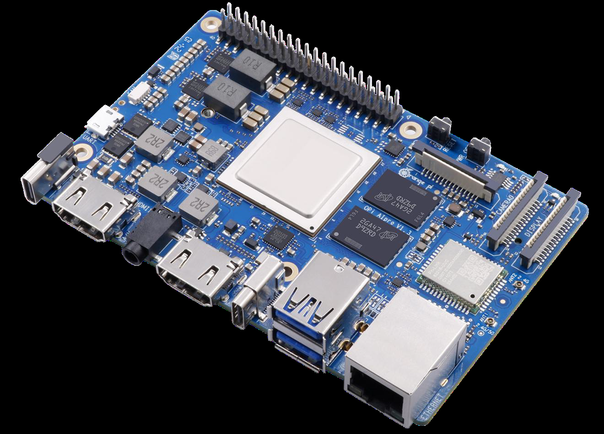
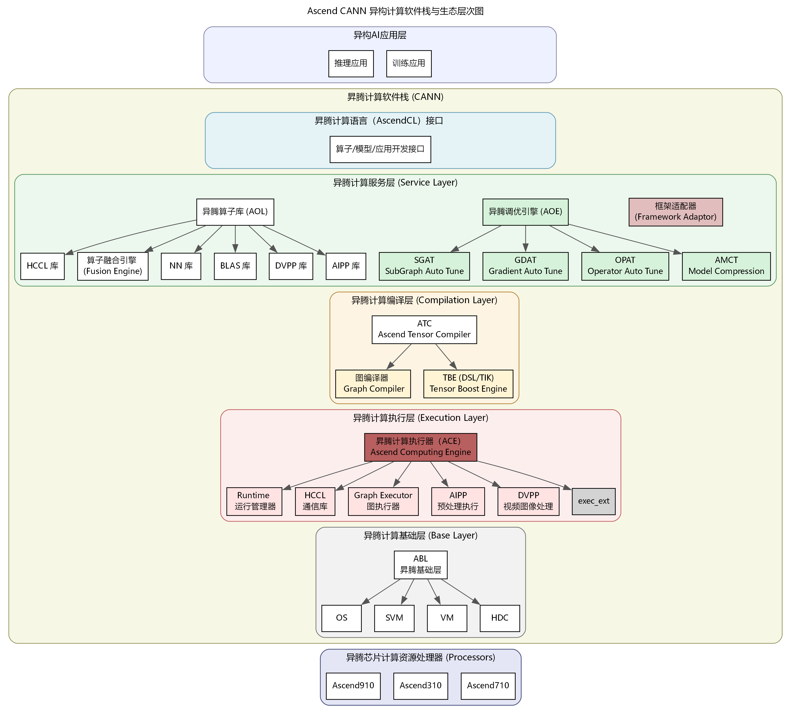
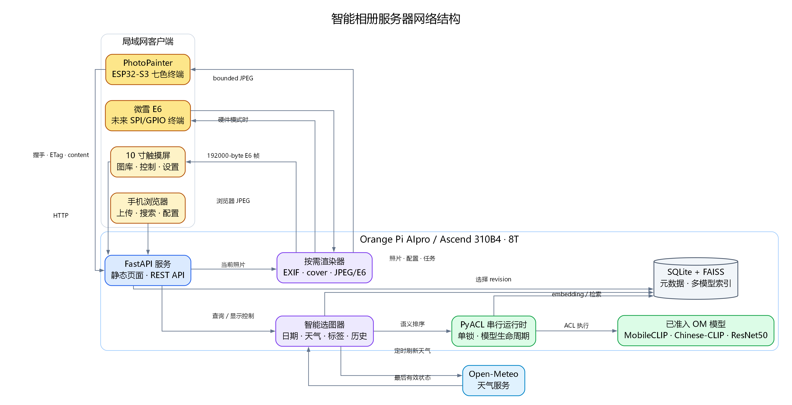
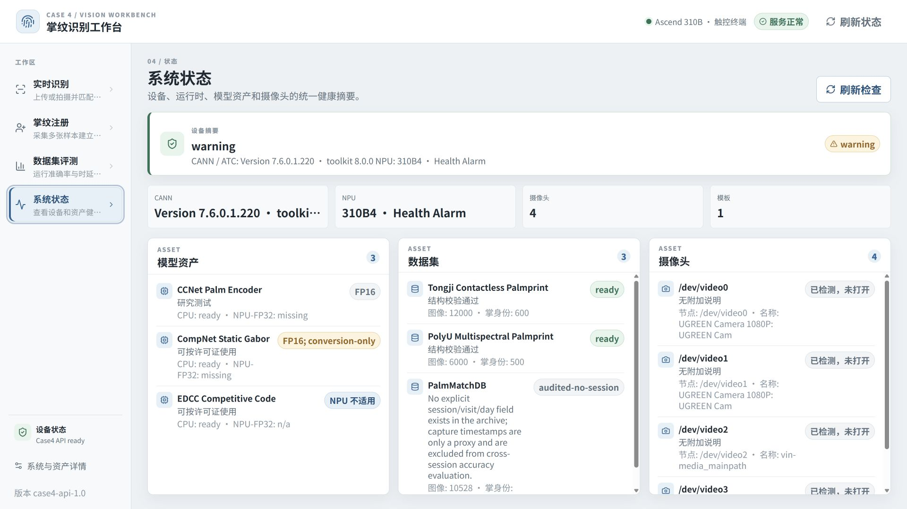

<!-- _class: cover -->

# Ascend310 仓库导览

## 从教材、实验到可运行样例

这套短讲先说明每张图和每段代码来自哪里，再进入 8 周专题课件。

---

## 仓库地图：四类内容各自负责什么

```text
Ascend310/
├─ README.md                 运行、构建与板端部署入口
├─ src/book/                 理论与教程正文
├─ src/experiment/           案例叙事、流程图、网络结构图
├─ src/appendix/             硬件、环境、工具与操作补充
├─ samples/                  可运行代码、模型脚本、测试
├─ scripts/                  构建、部署与静态校验
└─ src/presentation/         Marp 演示源文件（本目录）
```

演示只引用已经存在的源文件；生成的 HTML 和复制后的图片放在 `src/.vuepress/public/presentation/`，不回写源目录。

---

## 内容链：从概念到板端证据

| 层次 | 阅读入口 | 在课件中的表现 |
|---|---|---|
| 理论 | `src/book/` | CANN、ATC、PyACL、网络与训练基础 |
| 附录 | `src/appendix/` | 板卡照片、串口、网络、DSH 操作截图 |
| 实验 | `src/experiment/` | 案例目标、程序流程、网络结构、验收边界 |
| 样例 | `samples/` | 入口脚本、后端、前端、模型和测试 |

每个案例都把“源码位置、图示来源、能否在本机运行”分开记录，避免把板端结果误当成本地结果。

---

<!-- _class: visual -->

## 附录 1：先认识真实的 310B 开发板



<div class="source">来源：`src/appendix/img1/aipro.png`；操作说明：`src/appendix/appendix1.md`</div>

---

<!-- _class: visual -->

## 理论第 2 章：CANN 软件栈与运行边界



<div class="source">来源：`src/book/img2/CANN_Architecture.png`；正文：`src/book/chapter2.md`</div>

---

<!-- _class: visual -->

## 实验案例 1：人脸考勤的程序主线


<div class="source">来源：`src/experiment/img1/case1_flow_simple.png`；案例：`src/experiment/case1.md`；实现：`samples/case1/`</div>

---

<!-- _class: visual -->

## 实验案例 2：检测到跟踪的闭环


<div class="source">来源：`src/experiment/img2/流程图.png`；案例：`src/experiment/case2.md`；实现：`samples/case2/`</div>

---

<!-- _class: visual -->

## 实验案例 3：智能电子琴的三条模型链


<div class="source">来源：`src/experiment/img3/case3-three-workflows.png`；案例：`src/experiment/case3.md`；实现：`samples/case3/`</div>

---

<!-- _class: visual -->

## 实验案例 5：采集、频谱与 NPU 推理


<div class="source">来源：`src/experiment/img5/case5-hantek-acquisition-flow.png`；案例：`src/experiment/case5.md`；实现：`samples/case5/`</div>

---

<!-- _class: visual -->

## 实验案例 7：设备、服务与网络结构



<div class="source">来源：`src/experiment/img7/network-architecture.png`；流程图：`src/experiment/img7/program-flow.png`；实现：`samples/case7/`</div>

---

<!-- _class: visual -->

## 实验案例 8：模型转换不是黑盒


<div class="source">来源：`src/experiment/img8/case8_model_conversion.png`；案例：`src/experiment/case8.md`；实现：`samples/case8/`</div>

---

<!-- _class: visual -->

## 案例 4：NPU-only Palmprint Workbench 的 UI 证据



<div class="source">来源：`src/experiment/img4/palmprint-ui-react-system-status-1920x1080.png`；清单：`samples/case4/docs/evidence/ui-capture-manifest.json`；实现：`samples/case4/`</div>

---

## `samples/` 的代码结构：入口和职责一眼可见

```text
samples/case1/              samples/case2/
├─ app.py                   ├─ scripts/detection_app.py
├─ face_attendance/         ├─ scripts/tracking_app.py
│  ├─ inference.py          ├─ tracking/deepsort.py
│  └─ runtime.py            └─ utils/postprocessing.py

samples/case3/              samples/case9/
├─ scripts/                 ├─ app.py (网关)
├─ piano_ddsp/              ├─ acl_om_service.py
└─ web/                     ├─ mindspore_chat_service.py
                            └─ contract-v2.json
```

先从入口脚本和 `README.md` 读起，再看模型合同、测试和板端命令。

<div class="source">来源：`samples/case1/`、`samples/case2/`、`samples/case3/`、`samples/case9/` 的目录与入口文件</div>

---

## 如何核对一张图和一条结论

1. 在对应的 `src/book/`、`src/experiment/` 或 `src/appendix/` 找到原图和正文。
2. 在对应 `samples/*/` 找到入口、模型合同和测试；路径以源文件为准。
3. 只把板端执行得到的 ATC、ACL、性能和识别结果写成硬件证据。
4. 用 `pnpm run docs:slides` 重建，构建脚本会检查图片是否存在并复制到输出目录。

---

## 进入专题课件

| 课件 | 重点 |
|---|---|
| 01–02 | 硬件、Linux、CANN 与板端边界 |
| 03–04 | Python 数据处理与 DSH/Vibe Coding |
| 05–06 | 人脸识别、检测与多目标跟踪 |
| 07–08 | DDSP 智能电子琴与聊天机器人 |

从本页的来源路径出发，可以回到原始 Markdown、真实图片和可运行代码。

<div class="source">源目录：`src/presentation/`；构建入口：`scripts/build_presentation.mjs`</div>
