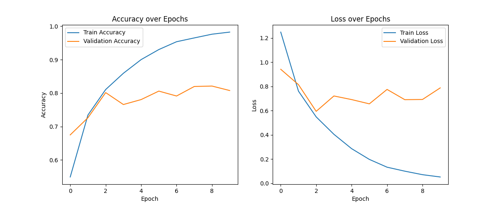

<!-- _class: cover -->

# 附录 3：Python 编程基础

- 专题安排：3 课时，每课时 45 分钟
- 目标：掌握模型部署与样例代码中最常用的 Python 语法和标准库
- 练习数据：`samples/case1/fusion_result.json`
- 依赖：仅使用 Python 标准库，不使用 pandas

---

## 真实训练产物：把曲线当作数据来读

<figure>

<figcaption>ResNet NPU 训练记录（accuracy/loss）；这是训练曲线，不是板端推理性能。来源：<a href="../../samples/chapter3/README.md">samples/chapter3/README.md</a>；图片：<code>samples/chapter3/ResNet/training_metrics_resnet_npu.png</code></figcaption>
</figure>

---

## 从仓库样例读 Python

| Python 对象 | 实际文件 | 课堂动作 |
| --- | --- | --- |
| 嵌套字典与 JSON | <a href="../../samples/case1/fusion_result.json"><code>samples/case1/fusion_result.json</code></a> | 用 `json.loads` 读取并统计 pass |
| 模型训练脚本 | <a href="../../samples/chapter3/ResNet/resnet_npu.py"><code>samples/chapter3/ResNet/resnet_npu.py</code></a> | 找入口、参数与日志 |
| 运行时检查 | <a href="../../samples/chapter4/check_ascend_device/check_ascend_device.py"><code>samples/chapter4/check_ascend_device/check_ascend_device.py</code></a> | 区分语法检查和板端 ACL |

来源索引：<a href="../appendix/appendix3.md">src/appendix/appendix3.md</a> · <a href="../../samples/README.md">samples/README.md</a>

---

# 专题结构

| 课时 | 时长 | 内容 | 重点 |
| --- | --- | --- | --- |
| 第1课时 | 45 分钟 | 语言基础与容器 | 变量、类型、列表、字典、集合、控制流 |
| 第2课时 | 45 分钟 | 函数、类与异常 | 函数、lambda、dataclass、class、异常处理 |
| 第3课时 | 45 分钟 | JSON、文件与命令行练习 | pathlib、json、argparse、logging，结合 `fusion_result.json` |

每课时含讲解、跟写代码和课堂练习，最后统一检查课堂任务、交付物与验收标准。

---

# 学习目标

学完本专题后，你应该能够：

- 用 Python 描述模型 ID、输入形状、精度模式和状态
- 用函数、类、dataclass 组织可复用代码
- 用 `pathlib` 和 `json` 读取真实配置文件
- 用 `argparse` 和 `logging` 写出可命令行运行的脚本
- 读懂 `fusion_result.json` 的嵌套结构并提取信息

---

# 1.1 变量与基本类型

变量是给值起的名字。Python 中每个值都有类型，类型决定它可以参与哪些运算。检查类型用 `type()`，查看结果用 `print()`。

```python
model_id = "mobileclip_s0"
feature_dim = 512
input_scale = 0.00392156862745098
is_admitted = True

print(type(model_id))
print(type(feature_dim))
print(type(input_scale))
print(type(is_admitted))
```

```text
<class 'str'>
<class 'int'>
<class 'float'>
<class 'bool'>
```

`str` 是文本，`int` 是整数，`float` 是小数，`bool` 是布尔值。模型 ID 适合存成 `str`，嵌入维度适合存成 `int`。

---

# 1.2 数字运算与单位换算

模型文件大小经常需要在字节和 MiB 之间换算。`/` 是普通除法，`//` 是向下取整，`%` 是取余数，`round()` 控制显示精度。

```python
bytes_size = 131904474
mib_size = bytes_size / 1024 / 1024

print(mib_size)
print(round(mib_size, 2))
print(bytes_size // 1024)
print(bytes_size % 1024)
```

```text
125.79369640350342
125.79
128812
986
```

`round()` 只改变显示结果，不改变原始变量。

---

# 1.3 列表与元组

模型输入形状、预处理均值和标准差通常是有序数值。`list` 保存可增删的有序数据，`tuple` 保存创建后不修改的固定组合。

```python
input_shape = [1, 3, 224, 224]
image_mean = (0.485, 0.456, 0.406)

print(input_shape[0])
print(input_shape[-1])
print(len(input_shape))
print(image_mean[0])
```

```text
1
224
4
0.485
```

列表索引从 0 开始，`-1` 表示最后一个元素。`len()` 返回元素个数。

---

# 1.4 字典

模型清单由多个字段组成，每个字段用一个键和对应的值表示。`dict` 保存键值对，适合描述一个模型条目。

```python
model = {
    "model_id": "mobileclip_s0",
    "input_shape": [1, 3, 256, 256],
    "precision_mode": "mixed_fp16",
    "status": "admitted",
}

print(model["model_id"])
print(model["input_shape"])
```

```text
mobileclip_s0
[1, 3, 256, 256]
```

键通常使用字符串，值可以是字符串、数字、列表或另一个字典。

---

# 1.5 集合

需要知道模型清单中出现过哪些精度模式时，用 `set` 去重。

```python
precision_modes = {"mixed_fp16", "allow_fp32_to_fp16", "mixed_fp16"}
print(precision_modes)
```

```text
{'allow_fp32_to_fp16', 'mixed_fp16'}
```

集合不保留插入顺序，也不能通过索引取值。顺序不重要的去重任务才适合使用集合。

---

# 2.1 条件分支

`if` 处理一个条件，`elif` 处理“否则如果”，`else` 是兜底。判断从上往下执行，先命中的分支生效。

```python
status = "admitted"

if status == "admitted":
    print("可进入 NPU 服务")
elif status == "candidate":
    print("仅用于离线评估")
else:
    print("状态未知")
```

```text
可进入 NPU 服务
```

比较运算符 `==` 判断是否相等，结果是一个布尔值。

---

# 2.2 for 循环

`for` 循环依次取出列表中的元素，重复执行缩进块。累加前先设置 `total = 0`，这个初始值必须写在循环外。

```python
feature_dims = [512, 1024, 2048]

total = 0
for dim in feature_dims:
    total = total + dim

print(total)
print(min(feature_dims))
print(max(feature_dims))
```

```text
3584
512
2048
```

---

# 2.3 range、enumerate 与 zip

`range(n)` 生成从 0 到 `n - 1` 的整数序列。`enumerate()` 同时返回序号和元素，`zip()` 把多个序列按位置配对。

```python
for index, dim in enumerate([512, 1024, 2048], start=1):
    print(index, dim)
```

```text
1 512
2 1024
3 2048
```

```python
model_ids = ["mobileclip_s0", "resnet50_feature"]
dims = [512, 2048]

for model_id, dim in zip(model_ids, dims):
    print(model_id, dim)
```

```text
mobileclip_s0 512
resnet50_feature 2048
```

---

<!-- _class: tight -->

# 2.4 while、break 与 continue

`while` 在条件仍为真时重复执行。循环内必须修改条件变量，否则会无限循环。`continue` 跳过本次循环，`break` 立即结束整个循环。

```python
attempt = 0

while attempt < 3:
    print(f"attempt {attempt + 1}")
    attempt += 1
```

```text
attempt 1
attempt 2
attempt 3
```

```python
dims = [512, 1024, 2048]

for dim in dims:
    if dim == 1024:
        continue
    print(dim)

for dim in dims:
    if dim > 1024:
        break
    print(dim)
```

```text
512
2048
512
1024
```

---

# 2.5 列表与字典推导式

推导式用一行代码生成新列表或字典，适合结构简单的过滤和转换。

```python
dims = [512, 1024, 2048]
large_dims = [dim for dim in dims if dim >= 1024]

print(large_dims)
```

```text
[1024, 2048]
```

```python
sizes = {"mobileclip_s0": 131904474, "resnet50_feature": 102400000}
sizes_mib = {model: round(size / 1024 / 1024, 2) for model, size in sizes.items()}

print(sizes_mib)
```

```text
{'mobileclip_s0': 125.79, 'resnet50_feature': 97.66}
```

---

# 第1课时小结

- `str`、`int`、`float`、`bool` 是基础类型
- `list` 和 `tuple` 保存有序数据，`dict` 保存键值对
- `set` 适合去重，但不保证顺序
- `if/elif/else`、`for`、`while` 是基本控制流
- 推导式适合简单过滤和转换

课堂练习：用列表保存 `[512, 1024, 2048, 512]`，分别输出元素个数、最小值、最大值和去重后的维度集合。

---

# 3.1 函数封装

函数把重复逻辑打包成可复用单元。下面函数接收模型列表，返回按精度模式统计的字典。

```python
def count_by_precision(models):
    result = {}
    for model in models:
        mode = model["precision_mode"]
        result[mode] = result.get(mode, 0) + 1
    return result

models = [
    {"precision_mode": "mixed_fp16"},
    {"precision_mode": "allow_fp32_to_fp16"},
    {"precision_mode": "allow_fp32_to_fp16"},
]

summary = count_by_precision(models)
for mode, count in sorted(summary.items()):
    print(f"{mode}: {count}")
```

```text
allow_fp32_to_fp16: 2
mixed_fp16: 1
```

`dict.get(key, 0)` 在键不存在时返回默认值 0。`sorted()` 让输出顺序稳定。

---

# 3.2 默认参数

默认参数让调用更简洁，同时允许按名字覆盖默认值。

```python
def format_model(model_id, precision="mixed_fp16"):
    return f"{model_id}: {precision}"

print(format_model("mobileclip_s0"))
print(format_model("resnet50_feature", precision="allow_fp32_to_fp16"))
```

```text
mobileclip_s0: mixed_fp16
resnet50_feature: allow_fp32_to_fp16
```

---

# 3.3 *args 与 **kwargs

`*values` 收集位置参数，`**options` 收集关键字参数。

```python
def summarize(title, *values, **options):
    print(title, values, options)

summarize("models", 512, 1024, status="admitted")
```

```text
models (512, 1024) {'status': 'admitted'}
```

---

# 3.4 lambda 与 f-string

`lambda` 适合写一个短小的临时函数。f-string 用 `f"..."` 开头，大括号内插入变量。

```python
models = [
    {"model_id": "mobileclip_s0", "embedding_dim": 512},
    {"model_id": "resnet50_feature", "embedding_dim": 2048},
]

models.sort(key=lambda model: model["embedding_dim"], reverse=True)
print([model["model_id"] for model in models])
```

```text
['resnet50_feature', 'mobileclip_s0']
```

```python
model_id = "mobileclip_s0"
embedding_dim = 512

print(f"{model_id}: {embedding_dim} dim")
```

```text
mobileclip_s0: 512 dim
```

---

# 3.5 类型注解

类型注解帮助阅读代码，也方便工具检查错误。它不会改变运行结果。

```python
def admitted_models(models: list[dict]) -> list[dict]:
    return [model for model in models if model.get("status") == "admitted"]
```

类型注解让调用者更清楚参数和返回值应该是什么形状，尤其是模型清单这种嵌套数据结构。

---

# 3.6 dataclass

`dataclass` 自动生成初始化、比较和打印方法，适合保存结构清晰的记录。

```python
from dataclasses import dataclass

@dataclass
class ModelRecord:
    model_id: str
    embedding_dim: int
    status: str = "admitted"

record = ModelRecord("mobileclip_s0", 512)
print(record)
```

```text
ModelRecord(model_id='mobileclip_s0', embedding_dim=512, status='admitted')
```

---

# 3.7 class 与 self

`__init__` 是实例创建时执行的方法，`self` 指向当前实例。

```python
class ModelChecker:
    def __init__(self, status="candidate"):
        self.status = status

    def is_admitted(self):
        return self.status == "admitted"

checker = ModelChecker("admitted")
print(checker.is_admitted())
```

```text
True
```

---

<!-- _class: tight -->

# 4.1 缺失键与类型转换

模型清单可能来自不同版本的脚本，字段并不总是一致。直接读取缺失字段会触发 `KeyError`，用 `dict.get()` 可以提供默认值。

```python
model = {
    "model_id": "mobileclip_s0",
    "precision_mode": "mixed_fp16",
}

print(model.get("status", "unknown"))
```

```text
unknown
```

把字符串转成数字时，输入内容决定转换是否成功。`int("fp16")` 会触发 `ValueError`，可以用 `try/except` 捕获。

```python
value = "fp16"

try:
    numeric_value = int(value)
except ValueError:
    numeric_value = None

print(numeric_value)
```

```text
None
```

`None` 表示没有有效数值。统计前应先检查它，不要把 `None` 当成 0。

---

# 4.2 try / except / else / finally

`else` 在没有异常时执行，`finally` 无论是否异常都会执行。

```python
try:
    dim = int("512")
except ValueError:
    dim = None
else:
    print("converted")
finally:
    print("done")
```

```text
converted
done
```

异常处理的目标是明确区分：缺字段、类型不匹配、文件不存在、JSON 解析失败分别是什么错误，并给出可读的日志或默认值。

---

# 第2课时小结

- 函数、lambda、类型注解让代码更易复用
- `dataclass` 适合保存结构清晰的记录
- `class` 适合封装状态和行为
- `dict.get()` 可以处理缺失字段
- `try/except/else/finally` 处理可预期的转换错误

课堂练习：写一个函数 `count_admitted(models)`，接收模型字典列表，返回 `status == "admitted"` 的模型数量。

---

# 4.3 pathlib 与 with open

`Path` 提供跨平台的路径操作，`with open` 在读取或写入结束后自动关闭文件。

```python
from pathlib import Path

path = Path("tmp/appendix3/notes.txt")
path.parent.mkdir(parents=True, exist_ok=True)
path.write_text("mixed_fp16\n", encoding="utf-8")

with path.open(encoding="utf-8") as f:
    print(f.read().strip())
```

```text
mixed_fp16
```

读取真实数据时，先确认路径存在，再使用 `Path.open()` 或 `read_text()`，不要用字符串拼接路径去猜层级。

---

<!-- _class: tight -->

# 4.4 json.loads 与 json.dumps

模型配置常以 JSON 保存。`json.loads()` 把 JSON 文本转回 Python 对象，`json.dumps()` 把 Python 对象转成 JSON 文本。

```python
import json

text = '{"model_id": "mobileclip_s0", "status": "admitted"}'
data = json.loads(text)

print(data["model_id"])
print(data.get("status", "unknown"))
```

```text
mobileclip_s0
admitted
```

```python
config = {"model_id": "mobileclip_s0", "precision_mode": "mixed_fp16"}
print(json.dumps(config, ensure_ascii=False, indent=2))
```

```text
{
  "model_id": "mobileclip_s0",
  "precision_mode": "mixed_fp16"
}
```

解析失败时，`json.loads()` 会抛出 `json.JSONDecodeError`。处理外部配置或日志时，先确认它确实是合法 JSON，再读取字段。

---

# fusion_result.json 的嵌套结构

真实文件 `samples/case1/fusion_result.json` 采用三层嵌套：

- 第一层只有一个实际键：`session_and_graph_id_0_0`
- 第二层有两个实际键：`graph_fusion` 和 `ub_fusion`
- 第三层以 fusion pass 名称为键，值为计数器字典
- `graph_fusion` 下的值通常包含 `effect_times` 和 `match_times`
- `ub_fusion` 下的值还包含 `repository_hit_times`

文件中这些计数器值目前都是字符串，例如 `"0"`、`"1"`、`"46"`。做统计前需要转换为整数，并先处理缺失字段。

---

# 读取真实数据文件

下面代码用 `pathlib` 打开文件，再用 `json.load` 读取为 Python 对象。输出内容以实际文件为准，这里只展示读取方式。

```python
from pathlib import Path
import json

path = Path("samples/case1/fusion_result.json")

with path.open(encoding="utf-8") as f:
    data = json.load(f)

print(type(data))
print(list(data.keys()))
```

预期结构：

```text
顶层包含 session_and_graph_id_0_0
该键下包含 graph_fusion 与 ub_fusion
```

不要预先假设只有一层，先在 REPL 或脚本中打印 `type(data)` 和实际键名，再写字段访问代码。

---

# 检查 graph_fusion 中的 fusion pass

`graph_fusion` 是字典，每个 fusion pass 名称对应一个计数器字典。可以遍历所有 pass，只打印出现过有效融合的项。

```python
graph_fusion = data["session_and_graph_id_0_0"]["graph_fusion"]

for pass_name, counters in graph_fusion.items():
    effect_times = counters.get("effect_times", "0")
    if int(effect_times) > 0:
        print(pass_name, counters)
```

这段代码演示三层字典访问、`items()` 遍历和字符串到整数的转换。具体输出取决于文件内容，练习时以实际打印结果为准。

---

# 4.5 argparse

`argparse` 用来解析命令行参数，样例脚本中常用来接收模型 ID、精度和路径。

```python
import argparse

parser = argparse.ArgumentParser()
parser.add_argument("--model-id", default="mobileclip_s0")
args = parser.parse_args(["--model-id", "resnet50_feature"])

print(args.model_id)
```

```text
resnet50_feature
```

在真实练习中，可以增加 `--json` 参数接收 `fusion_result.json` 的路径，再传入读取函数，让脚本不写死路径。

---

# 4.6 logging 与 if __name__ == "__main__"

`logging` 比 `print()` 更适合记录运行过程，样例服务中常用来区分普通日志和错误日志。`if __name__ == "__main__"` 让脚本被直接运行时执行 `main()`，被其他模块导入时不会自动执行。

```python
import logging

logging.basicConfig(level=logging.INFO)
logger = logging.getLogger("appendix3")
logger.info("model check complete")
```

```text
INFO:appendix3:model check complete
```

```python
def main():
    print("check complete")

if __name__ == "__main__":
    main()
```

```text
check complete
```

---

# 调试与验证

出错时先确认对象的真实内容，不要只看报错文字。`repr()` 可以显示字符串中的空格和引号。

```python
status = " admitted"

print(status)
print(repr(status))
```

```text
 admitted
' admitted'
```

脚本保存后，先在仓库根目录执行：

```bash
python -m py_compile 脚本路径.py
```

`py_compile` 只检查语法，不运行板端逻辑。昇腾 310B 的 CANN、ATC 和 ACL 检查仍应在真实开发板上完成。

---

# 课堂任务

1. 用列表保存 `feature_dims = [512, 1024, 2048, 512]`，输出元素个数、最小值、最大值和去重后的维度集合。
2. 写一个函数 `count_admitted(models)`，接收模型字典列表，返回 `status == "admitted"` 的模型数量。
3. 写一个 `safe_get(data, key)` 函数：键存在时返回值，不存在或类型错误时返回 `None`。
4. 用列表推导式筛出 `[512, 1024, 2048, 512]` 中大于等于 1024 的元素。
5. 读取 `samples/case1/fusion_result.json`，打印顶层键，并统计 `graph_fusion` 中 `effect_times` 大于 0 的 fusion pass 数量。
6. 把脚本交给 DSH 或人工审查一次，逐行解释每个分支和异常处理。

---

# 交付物

- 一个 Python 脚本文件：`python_basics_practice.py`
- 脚本包含变量、容器、控制流、函数或类、异常处理
- 脚本通过 `argparse` 接收文件路径参数
- 脚本读取 `samples/case1/fusion_result.json` 并输出结构化摘要
- 使用 `logging` 记录开始、完成和错误信息
- 不使用 pandas，只使用 Python 标准库

---

# 验收标准

- [ ] 能说出 `int`、`float`、`str`、`bool` 的区别
- [ ] 能用列表保存输入形状或特征维度，并用循环完成求和
- [ ] 能用字典表示一个模型条目，按字段名读取值
- [ ] 能写函数统计模型清单中的精度模式
- [ ] 能区分 `KeyError`、`ValueError` 和 `json.JSONDecodeError`
- [ ] 能阅读 `samples/` 中常见的列表推导、`enumerate`、`argparse` 和 `pathlib` 写法
- [ ] 能解释 `fusion_result.json` 的三层嵌套结构，并用实际键名读取数据
- [ ] 脚本通过 `python -m py_compile` 语法检查
- [ ] 示例只使用标准库，没有 pandas 或板端运行时依赖
